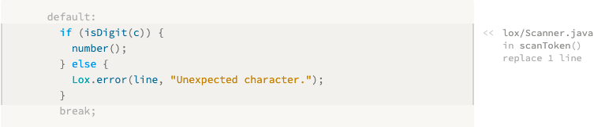

# 1. Introduction 前言

> Fairy tales are more than true: not because they tell us that dragons exist, but because they tell us that dragons can be beaten.
>
> ​																					—— Neil Gaiman, *Coraline*

童話故事是無比真實的：不是因為它告訴我們龍的存在，而是因為它告訴我們龍可以被擊敗。

> I’m really excited we’re going on this journey together. This is a book on implementing interpreters for programming languages. It’s also a book on how to design a language worth implementing. It’s the book I wish I had when I first started getting into languages, and it’s the book I’ve been writing in my head for nearly a decade.

我真的很興奮我們能一起踏上這段旅程。這是一本關於為編程語言實現解釋器的書。它也是一本關於如何設計一種值得實現的語言的書。我剛開始接觸編程語言的時候就希望我可以寫出這本書，這本書我在腦子裏已經寫了將近十年了。

> In these pages, we will walk step by step through two complete interpreters for a full-featured language. I assume this is your first foray into languages, so I’ll cover each concept and line of code you need to build a complete, usable, fast language implementation.

在本書中，我們將一步一步地介紹一種功能齊全的語言的兩個完整的解釋器實現。我假設這是您第一次涉足編程語言，因此我將介紹構建一個完整、可用、快速的語言所需的每個概念和代碼。

> In order to cram two full implementations inside one book without it turning into a doorstop, this text is lighter on theory than others. As we build each piece of the system, I will introduce the history and concepts behind it. I’ll try to get you familiar with the lingo so that if you ever find yourself in a cocktail party full of PL (programming language) researchers, you’ll fit in.

為了在一本書中塞進兩個完整的實現，而且避免這變成一個門檻，本文在理論上比其他文章更輕。在構建系統的每個模塊時，我將介紹它背後的歷史和概念。我會盡力讓您熟悉這些行話，即便您在充滿PL（編程語言）研究人員的雞尾酒會中，也能快速融入其中。

> But we’re mostly going to spend our brain juice getting the language up and running. This is not to say theory isn’t important. Being able to reason precisely and formally about syntax and semantics is a vital skill when working on a language. But, personally, I learn best by doing. It’s hard for me to wade through paragraphs full of abstract concepts and really absorb them. But if I’ve coded something, run it, and debugged it, then I *get* it.

但我們主要還是要花費精力讓這門語言運轉起來。這並不是説理論不重要。在學習一門語言時，能夠對語法和語義進行精確而公式化的推理[^1]是一項至關重要的技能。但是，就我個人而言，我在實踐中學習效果最好。對我來説，要深入閲讀那些充滿抽象概念的段落並真正理解它們太難了。但是，如果我（根據理論）編寫了代碼，運行並調試完成，那麼我就明白了。

> That’s my goal for you. I want you to come away with a solid intuition of how a real language lives and breathes. My hope is that when you read other, more theoretical books later, the concepts there will firmly stick in your mind, adhered to this tangible substrate.

這就是我對您的期望。我想讓你們直觀地理解一門真正的語言是如何生活和呼吸的。我希望當你以後閲讀其他理論性更強的書籍時，這些概念會牢牢地留在你的腦海中，依附於這個有形的基礎之上。

> ##  1.1 Why Learn This Stuff？

## 1.1 為什麼要學習這些？

> Every introduction to every compiler book seems to have this section. I don’t know what it is about programming languages that causes such existential doubt. I don’t think ornithology books worry about justifying their existence. They assume the reader loves birds and start teaching.

每本編譯器書籍的導言似乎都有這一部分。我不知道到底是編程語言的哪一點讓人產生這樣的質疑。我不認為鳥類學書籍會擔心如何證明自己的存在。它們假定讀者喜歡鳥類，然後開始教學。

> But programming languages are a little different. I suppose it is true that the odds of any of us creating a broadly successful general-purpose programming language are slim. The designers of the world’s widely-used languages could fit in a Volkswagen bus, even without putting the pop-top camper up. If joining that elite group was the *only* reason to learn languages, it would be hard to justify. Fortunately, it isn’t.

但是編程語言有一點不同。我認為，對我們中的任何一個人來説，能夠創建一種廣泛成功的通用編程語言的可能性都很小，這是事實。設計這個世界上被廣泛使用的語言的設計師們，一輛大眾旅遊巴士就能裝得下，甚至不用把頂上的帳篷加上。如果加入這個精英羣體是學習語言的*唯一*原因，那麼就很難證明其合理性。幸運的是，事實並非如此。

> ### 1.1.1 Little languages are everywhere

### 1.1.1 小型語言無處不在

> For every successful general-purpose language, there are a thousand successful niche ones. We used to call them “little languages”, but inflation in the jargon economy led today to the name “domain-specific languages”. These are pidgins tailor-built to a specific task. Think application scripting languages, template engines, markup formats, and configuration files.

對於每一種成功的通用語言，都有上千種成功的小眾語言。我們過去稱它們為“小語言”，但術語氾濫的今天它們有了“領域特定語言（即DSL）”的名稱。這些是為特定任務量身定做的洋涇浜語言[^2]，如應用程序腳本語言、模板引擎、標記格式和配置文件。

> Almost every large software project needs a handful of these. When you can, it’s good to reuse an existing one instead of rolling your own. Once you factor in documentation, debuggers, editor support, syntax highlighting, and all of the other trappings, doing it yourself becomes a tall order.

幾乎每個大型軟件項目都需要一些這樣的工具。如果可以的話，最好重用現有的工具，而不是自己動手實現。一旦考慮到文檔、調試器、編輯器支持、語法高亮顯示和所有其他可能的障礙，自己實現就成了一項艱鉅的任務。

> But there’s still a good chance you’ll find yourself needing to whip up a parser or something when there isn’t an existing library that fits your needs. Even when you are reusing some existing implementation, you’ll inevitably end up needing to debug and maintain it and poke around in its guts.

但是，當現有的庫不能滿足您的需要時，您仍然很有可能發現自己需要一個解析器或其他東西。即使當您重用一些現有的實現時，您也不可避免地需要調試和維護，並在其內部進行探索。

> ### 1 . 1 . 2 Languages are great exercise

### 1.1.2 語言是很好的鍛鍊

> Long distance runners sometimes train with weights strapped to their ankles or at high altitudes where the atmosphere is thin. When they later unburden themselves, the new relative ease of light limbs and oxygen-rich air enables them to run farther and faster.

長跑運動員有時會在腳踝上綁上重物，或者在空氣稀薄的高海拔地區進行訓練。當他們卸下自己的負擔以後，輕便的肢體和富氧的空氣帶來了新的相對舒適度，使它們可以跑得更遠，更快。

> Implementing a language is a real test of programming skill. The code is complex and performance critical. You must master recursion, dynamic arrays, trees, graphs, and hash tables. You probably use hash tables at least in your day-to-day programming, but how well do you *really* understand them? Well, after we’ve crafted our own from scratch, I guarantee you will.

實現一門語言是對編程技能的真正考驗。代碼很複雜，而且性能很關鍵。您必須掌握遞歸、動態數組、樹、圖和哈希表。您在日常編程中至少使用過哈希表，但*到底*您對它們的理解程度有多高呢？嗯，等我們從頭完成我們的作品之後，我相信您會理解的。

> While I intend to show you that an interpreter isn’t as daunting as you might believe, implementing one well is still a challenge. Rise to it, and you’ll come away a stronger programmer, and smarter about how you use data structures and algorithms in your day job.

雖然我想説明解釋器並不像您想的那樣令人生畏，但實現一個好的解釋器仍然是一個挑戰。學會了它，您就會成為一個更強大的程序員，並且在日常工作中也能更加聰明地使用數據結構和算法。

> ### 1 . 1 . 3 One more reason

### 1.1.3 另一個原因

> This last reason is hard for me to admit, because it’s so close to my heart. Ever since I learned to program as a kid, I felt there was something magical about languages. When I first tapped out BASIC programs one key at a time I couldn’t conceive how BASIC *itself* was made.

這最後一個原因我很難承認，因為它是很私密的理由。自從我小時候學會編程以來，我就覺得語言有種神奇的力量。當我第一次一個鍵一個鍵地輸入BASIC程序時，我無法想象BASIC語言*本身*是如何製作出來的。

> Later, the mixture of awe and terror on my college friends’ faces when talking about their compilers class was enough to convince me language hackers were a different breed of human—some sort of wizards granted privileged access to arcane arts.

後來，當我的大學朋友們談論他們的編譯器課程時，臉上那種既敬畏又恐懼的表情足以讓我相信，語言黑客是另一種人，某種可以操控奧術的巫師。

> It’s a charming image, but it has a darker side. *I* didn’t feel like a wizard, so I was left thinking I lacked some in-born quality necessary to join the cabal. Though I’ve been fascinated by languages ever since I doodled made up keywords in my school notebook, it took me decades to muster the courage to try to really learn them. That “magical” quality, that sense of exclusivity, excluded *me*.

這是一個迷人的形象，但它也有黑暗的一面。我感覺自己不像個巫師，所以我認為自己缺乏加入秘社所需的先天品質。 儘管自從我在學校筆記本上拼寫關鍵詞以來，我一直對語言着迷，但我花了數十年的時間鼓起勇氣嘗試真正地學習它們。那種“神奇”的品質，那種排他性的感覺，將我擋在門外。

> When I did finally start cobbling together my own little interpreters, I quickly learned that, of course, there is no magic at all. It’s just code, and the people who hack on languages are just people.

當我最終開始拼湊我自己的小解釋器時，我很快意識到，根本就沒有魔法。它只是代碼，而那些玩弄語言的人也只是普通人。

> There *are* a few techniques you don’t often encounter outside of languages, and some parts are a little difficult. But not more difficult than other obstacles you’ve overcome. My hope is that if you’ve felt intimidated by languages, and this book helps you overcome that fear, maybe I’ll leave you just a tiny bit braver than you were before.

有一些技巧您在語言之外不會經常遇到，而且有些部分有點難。但不會比您克服的其他障礙更困難。我希望，如果您對語言感到害怕，而這本書能幫助您克服這種恐懼，也許我會讓您比以前更勇敢一點。

> And, who knows, maybe you *will* make the next great language. Someone has to.

而且，説不準，你也許會創造出下一個偉大的語言，畢竟總要有人做。

> ## 1 . 2 How the Book is Organized

## 1.2 本書的組織方式

> This book is broken into three parts. You’re reading the first one now. It’s a couple of chapters to get you oriented, teach you some of the lingo that language hackers use, and introduce you to Lox, the language we’ll be implementing.

這本書分為三個部分。您現在正在讀的是第一部分。這部分用了幾章來讓您進入狀態，教您一些語言黑客使用的行話，並向您介紹我們將要實現的語言Lox。

> Each of the other two parts builds one complete Lox interpreter. Within those parts, each chapter is structured the same way. The chapter takes a single language feature, teaches you the concepts behind it, and walks through an implementation.

其他兩個部分則分別構建一個完整的Lox解釋器。在這些部分中，每個章節的結構都是相同的。 每一章節挑選一個語言功能點，教您背後對應的概念，並逐步介紹實現方法。

> It took a good bit of trial and error on my part, but I managed to carve up the two interpreters into chapter-sized chunks that build on the previous chapters but require nothing from later ones. From the very first chapter, you’ll have a working program you can run and play with. With each passing chapter, it grows increasingly full-featured until you eventually have a complete language.

我花了不少時間去試錯，但我還是成功地把這兩個解釋器按照章節分成了一些小塊，每一小塊的內容都會建立在前面幾章的基礎上，但不需要後續章節的知識。從第一章開始，你就會有一個可以運行和使用的工作程序。隨着章節的推移，它的功能越來越豐富，直到你最終擁有一門完整的語言。

> Aside from copious, scintillating English prose, chapters have a few other delightful facets:

除了大量妙趣橫生的英文段落，章節中還會包含一些其它的驚喜：

> ### 1.2.1 The code

### 1.2.1 代碼

> We’re about *crafting* interpreters, so this book contains real code. Every single line of code needed is included, and each snippet tells you where to insert it in your ever-growing implementation.

本書是關於製作解釋器的，所以其中會包含真正的代碼。所需要的每一行代碼都需要包含在內，而且每個代碼片段都會告知您需要插入到實現代碼中的什麼位置。

> Many other language books and language implementations use tools like [Lex](https://en.wikipedia.org/wiki/Lex_(software)) and [Yacc](https://en.wikipedia.org/wiki/Yacc), so-called **compiler-compilers** that automatically generate some of the source files for an implementation from some higher level description. There are pros and cons to tools like those, and strong opinions—some might say religious convictions—on both sides.

許多其他的語言書籍和語言實現都使用[Lex](https://en.wikipedia.org/wiki/Lex_(軟件))和[Yacc](https://en.wikipedia.org/wiki/Yacc)[^3]這樣的工具，也就是所謂的**編譯器-編譯器**，可以從一些更高層次的（語法）描述中自動生成一些實現的源文件。這些工具有利有弊，而且雙方都有強烈的主張--有些人可能將其説成是信仰。

> We will abstain from using them here. I want to ensure there are no dark corners where magic and confusion can hide, so we’ll write everything by hand. As you’ll see, it’s not as bad as it sounds and it means you really will understand each line of code and how both interpreters work.

我們這裏不會使用這些工具。我想確保魔法和困惑不會藏在黑暗的角落，所以我們會選擇手寫所有代碼。正如您將看到的，這並沒有聽起來那麼糟糕，因為這意味着您將真正理解每一行代碼以及兩種解釋器的工作方式。

> A book has different constraints from the “real world” and so the coding style here might not always reflect the best way to write maintainable production software. If I seem a little cavalier about, say, omitting `private` or declaring a global variable, understand I do so to keep the code easier on your eyes. The pages here aren’t as wide as your IDE and every character counts.

為了寫書，書中代碼和“真實世界”的代碼是有區別的，因此這裏的代碼風格可能並不是編寫可維護的生產型軟件的最佳方式。可能我的某些寫法是不太準確的，比如省略*private*或者聲明全局變量，請理解我這樣做是為了讓您更容易看懂代碼。書頁不像IDE窗口那麼寬，所以每一個字符都很珍貴。

> Also, the code doesn’t have many comments. That’s because each handful of lines is surrounded by several paragraphs of honest-to-God prose explaining it. When you write a book to accompany your program, you are welcome to omit comments too. Otherwise, you should probably use `//` a little more than I do.

另外，代碼也不會有太多的註釋。這是因為每一部分代碼前後，都使用了一些真的很簡潔的文字來對其進行解釋。當你寫一本書來配合你的程序時，歡迎你也省略註釋。否則，你可能應該比我使用更多的 `//`。

> While the book contains every line of code and teaches what each means, it does not describe the machinery needed to compile and run the interpreter. I assume you can slap together a makefile or a project in your IDE of choice in order to get the code to run. Those kinds of instructions get out of date quickly, and I want this book to age like XO brandy, not backyard hooch.

雖然這本書包含了每一行代碼，並教授了每一行代碼的含義，但它沒有描述編譯和運行解釋器所需的機制。我假設你可以簡單地拼湊出一個makefile，或者創建一個心儀的IDE中的一個工程，來讓代碼運行起來。 那種類型的説明很快就會過時，我希望這本書能像XO白蘭地一樣醇久，而不是像家釀酒（一樣易過期）。

> ### 1.2.2 Snippets

### 1.2.2 片段

> Since the book contains literally every line of code needed for the implementations, the snippets are quite precise. Also, because I try to keep the program in a runnable state even when major features are missing, sometimes we add temporary code that gets replaced in later snippets.

因為這本書包含了實現所需的每一行代碼，所以代碼片段相當精確。此外，即使是在缺少主要功能的時候，我也嘗試將程序保持在可運行狀態。因此我們有時會添加臨時代碼，這些代碼將在後面被其他的代碼片段替換。

> A snippet with all the bells and whistles looks like this:

一個完整的代碼片段可能如下所示：

> In the center, you have the new code to add. It may have a few faded out lines above or below to show where it goes in the existing surrounding code. There is also a little blurb telling you in which file and where to place the snippet. If that blurb says “replace _ lines”, there is some existing code between the faded lines that you need to remove and replace with the new snippet.

中間是要添加的新代碼。這部分代碼的上面或下面可能有一些淡出的行，以顯示它在周圍代碼中的位置。還會附有一小段介紹，告訴您在哪個文件中以及在哪裏放置代碼片段。如果簡介説要“replace _ lines”，表明在淺色的行之間有一些現有的代碼需要刪除，並替換為新的代碼片段。

> ### 1.2.3 Asides

### 1.2.3 題外話

> Asides contain biographical sketches, historical background, references to related topics, and suggestions of other areas to explore. There’s nothing that you *need* to know in them to understand later parts of the book, so you can skip them if you want. I won’t judge you, but I might be a little sad.

題外話中包含傳記簡介、歷史背景、對相關主題的引用以及對其他要探索的領域的建議。 您無需深入瞭解就可以理解本書的後續部分，因此可以根據需要跳過它們。 我不會批評你，但我可能會有些難過。【注：由於排版原因，在翻譯的時候，將有用的旁白信息作為腳註附在章節之後】

> ### 1.2.4 Challenge

### 1.2.4 挑戰

> Each chapter ends with a few exercises. Unlike textbook problem sets which tend to review material you already covered, these are to help you learn *more* than what’s in the chapter. They force you to step off the guided path and explore on your own. They will make you research other languages, figure out how to implement features, or otherwise get you out of your comfort zone.

每章結尾都會有一些練習題。 不像教科書中的習題集那樣用於回顧已講述的內容，這些習題是為了幫助您學習更多的知識，而不僅僅是本章中的內容。 它們會迫使您走出文章指出的路線，自行探索。 它們將要求您研究其他語言，弄清楚如何實現功能，換句話説，就是使您走出舒適區。

> Vanquish the challenges and you’ll come away with a broader understanding and possibly a few bumps and scrapes. Or skip them if you want to stay inside the comfy confines of the tour bus. It’s your book.

克服挑戰，您將獲得更廣泛的理解，也可能遇到一些挫折。 如果您想留在旅遊巴士的舒適區內，也可以跳過它們。 都隨你便[^4]。

> ### 1.2.5 Design notes

### 1.2.5 設計筆記

> Most “programming language” books are strictly programming language *implementation* books. They rarely discuss how one might happen to *design* the language being implemented. Implementation is fun because it is so precisely defined. We programmers seem to have an affinity for things that are black and white, ones and zeroes.

大多數編程語言書籍都是嚴格意義上的編程語言*實現*書籍。他們很少討論如何*設計*正在實現的語言。實現之所以有趣，是因為它的定義是很精確的。我們程序員似乎很喜歡黑白、1和0這樣的事物[^5]。

> Personally, I think the world only needs so many implementations of FORTRAN 77. At some point, you find yourself designing a *new* language. Once you start playing *that* game, then the softer, human side of the equation becomes paramount. Things like what features are easy to learn, how to balance innovation and familiarity, what syntax is more readable and to whom.

就個人而言，我認為世界只需要這麼多的FORTRAN 77實現。在某個時候，您會發現自己正在設計一種新的語言。 一旦開始這樣做，方程式中較柔和，人性化的一面就變得至關重要。 諸如哪些功能易於學習，如何在創新和熟悉度之間取得平衡，哪種語法更易讀以及對誰有幫助[^6]。

> All of that stuff profoundly affects the success of your new language. I want your language to succeed, so in some chapters I end with a “design note”, a little essay on some corner of the human aspect of programming languages. I’m no expert on this—I don’t know if anyone really is—so take these with a large pinch of salt. That should make them tastier food for thought, which is my main aim.

所有這些都會對您的新語言的成功產生深遠的影響。 我希望您的語言取得成功，因此在某些章節中，我以一篇“設計筆記”結尾，這些是關於編程語言的人文方面的一些文章。我並不是這方面的專家——我不確定是否有人真的精通這些，因此，請您在閲讀這些文字的時候仔細評估。這樣的話，這些文字就能成為您思考的食材，這也正是我的目標。

> ## 1 . 3 The First Interpreter

## 1.3 第一個解釋器

> We’ll write our first interpreter, jlox, in Java. The focus is on *concepts*. We’ll write the simplest, cleanest code we can to correctly implement the semantics of the language. This will get us comfortable with the basic techniques and also hone our understanding of exactly how the language is supposed to behave.

我們將用Java編寫第一個解釋器jlox。（這裏的）主要關注點是概念。 我們將編寫最簡單，最乾淨的代碼，以正確實現該語言的語義。 這樣能夠幫助我們熟悉基本技術，並磨練對語言表現形式的確切理解。

> Java is a great language for this. It’s high level enough that we don’t get overwhelmed by fiddly implementation details, but it’s still pretty explicit. Unlike scripting languages, there tends to be less complex machinery hiding under the hood, and you’ve got static types to see what data structures you’re working with.

Java是一門很適合這種場景的語言。它的級別足夠高，我們不會被繁瑣的實現細節淹沒，但代碼仍是非常明確的。與腳本語言不同的是，它的底層沒有隱藏太過複雜的機制，你可以使用靜態類型來查看正在處理的數據結構。

> I also chose Java specifically because it is an object-oriented language. That paradigm swept the programming world in the 90s and is now the dominant way of thinking for millions of programmers. Odds are good you’re already used to organizing code into classes and methods, so we’ll keep you in that comfort zone.

我選擇Java還有特別的原因，就是因為它是一種面向對象的語言。 這種範式在90年代席捲了整個編程世界，如今已成為數百萬程序員的主流思維方式。 很有可能您已經習慣了將代碼組織到類和方法中，因此我們將讓您在舒適的環境中學習。

> While academic language folks sometimes look down on object-oriented languages, the reality is that they are widely used even for language work. GCC and LLVM are written in C++, as are most JavaScript virtual machines. Object-oriented languages are ubiquitous and the tools and compilers *for* a language are often written *in* the same language.

雖然學術語言專家有時瞧不起面嚮對象語言，但事實上，它們即使在語言工作中也被廣泛使用。GCC和LLVM是用C++編寫的，大多數JavaScript虛擬機也是這樣。 面向對象的語言無處不在，並且針對該語言的工具和編譯器通常是用同一種語言編寫的[^7]。

> And, finally, Java is hugely popular. That means there’s a good chance you already know it, so there’s less for you to learn to get going in the book. If you aren’t that familiar with Java, don’t freak out. I try to stick to a fairly minimal subset of it. I use the diamond operator from Java 7 to make things a little more terse, but that’s about it as far as “advanced” features go. If you know another object-oriented language like C# or C++, you can muddle through.

最後，Java非常流行。 這意味着您很有可能已經瞭解它了，所以你要學習的東西就更少了。 如果您不太熟悉Java，也請不要擔心。 我儘量只使用它的最小子集。我使用Java 7中的菱形運算符使代碼看起來更簡潔，但就“高級”功能而言，僅此而已。 如果您瞭解其它面向對象的語言（例如C＃或C++），就沒有問題。

> By the end of part II, we’ll have a simple, readable implementation. What we won’t have is a *fast* one. It also takes advantage of the Java virtual machine’s own runtime facilities. We want to learn how Java *itself* implements those things.

在第二部分結束時，我們將得到一個簡單易讀的實現。 但是我們得到的不會是一個*執行效率*高的解釋器。它還是利用了Java虛擬機自身的運行時工具。我們想要學習Java本身是如何實現這些東西的。

> ## 1 . 4 The Second Interpreter

## 1.4 第二個解釋器

> So in the next part, we start all over again, but this time in C. C is the perfect language for understanding how an implementation *really* works, all the way down to the bytes in memory and the code flowing through the CPU.

所以在下一部分，我們將從頭開始，但這一次是用C語言。C語言是理解實現編譯器工作方式的完美語言，一直到內存中的字節和流經CPU的代碼。

> A big reason that we’re using C is so I can show you things C is particularly good at, but that *does* mean you’ll need to be pretty comfortable with it. You don’t have to be the reincarnation of Dennis Ritchie, but you shouldn’t be spooked by pointers either.

我們使用C語言的一個重要原因是，我可以向您展示C語言特別擅長的東西，但這並不意味着您需要非常熟練地使用它。您不必是丹尼斯·裏奇（Dennis Ritchie）的轉世，但也不應被指針嚇倒。

> If you aren’t there yet, pick up an introductory book on C and chew through it, then come back here when you’re done. In return, you’ll come away from this book an even stronger C programmer. That’s useful given how many language implementations are written in C: Lua, CPython, and Ruby’s MRI, to name a few.

如果你（對C的掌握）還沒到那一步，找一本關於C的入門書，仔細閲讀，讀完後再回來。作為回報，從這本書中你將成為一個更優秀的C程序員。可以想想有多少語言實現是用C完成的: Lua、CPython和Ruby 的 MRI等，這裏僅舉幾例。

> In our C interpreter, clox, we are forced to implement for ourselves all the things Java gave us for free. We’ll write our own dynamic array and hash table. We’ll decide how objects are represented in memory, and build a garbage collector to reclaim it.

在我們的C解釋器clox中[^8]，我們不得不自己實現那些Java免費提供給我們的東西。 我們將編寫自己的動態數組和哈希表。 我們將決定對象在內存中的表示方式，並構建一個垃圾回收器來回收它。

> Our Java implementation was focused on being correct. Now that we have that down, we’ll turn to also being *fast*. Our C interpreter will contain a compiler that translates Lox to an efficient bytecode representation (don’t worry, I’ll get into what that means soon) which it then executes. This is the same technique used by implementations of Lua, Python, Ruby, PHP, and many other successful languages.

我們的Java版實現專注於正確性。 既然我們已經完成了，那麼我們就要變*快*。 我們的C解釋器將包含一個編譯器[^9]，該編譯器會將Lox轉換為有效的字節碼形式（不用擔心，我很快就會講解這是什麼意思）之後它會執行對應的字節碼。 這與Lua，Python，Ruby，PHP和許多其它成功語言的實現所使用的技術相同。

> We’ll even try our hand at benchmarking and optimization. By the end, we’ll have a robust, accurate, fast interpreter for our language, able to keep up with other professional caliber implementations out there. Not bad for one book and a few thousand lines of code.

我們甚至會嘗試進行基準測試和優化。 到最後，我們將為lox語言提供一個強大，準確，快速的解釋器，並能夠不落後於其他專業水平的實現。對於一本書和幾千行代碼來説已經不錯了。

[^1]: 靜態類型系統尤其需要嚴格的形式推理。破解類型系統就像證明數學定理一樣。事實證明這並非巧合。 上世紀初，Haskell Curry和William Alvin Howard證明了它們是同一枚硬幣的兩個方面：[Curry-Howard同構](https://en.wikipedia.org/wiki/Curry%E2%80%93Howard_correspondence)。
[^2]: pidgins，洋涇浜語言，一種混雜的英語
[^3]: Yacc是一個工具，它接收語法文件並生成編譯器的源文件，因此它有點像一個輸出“編譯器”的編譯器，在術語中叫作“compiler-compiler”，即編譯器的編譯器。Yacc並不是同類工具中的第一個，這就是為什麼它被命名為“Yacc”—*Yet Another* Compiler-Compiler(另一個Compiler-Compiler)。後來還有一個類似的工具是Bison，它的名字源於Yacc和yak的發音，是一個雙關語。
[^4]: 警告:挑戰題目通常要求您對正在構建的解釋器進行更改。您需要在代碼副本中實現這些功能。後面的章節都假設你的解釋器處於原始(未解決挑戰題)狀態。
[^5]: 我知道很多語言黑客的職業就基於此。您將一份語言規範塞到他們的門下，等上幾個月，代碼和基準測試結果就出來了。
[^6]: 希望您的新語言不會將對打孔卡寬度的假設硬編碼到語法中。
[^7]: 編譯器以一種語言讀取文件。 翻譯它們，並以另一種語言輸出文件。 您可以使用任何一種語言（包括與目標語言相同的語言）來實現編譯器，該過程稱為“自舉”。你現在還不能使用編譯器本身來編譯你自己的編譯器，但是如果你用其它語言為你的語言寫了一個編譯器，你就可以用那個編譯器編譯一次你的編譯器。現在，您可以使用自己的編譯器的已編譯版本來編譯自身的未來版本，並且可以從另一個編譯器中丟棄最初的已編譯版本。 這就是所謂的“自舉”，通過自己的引導程序將自己拉起來。
[^8]: 我把這個名字讀作“sea-locks”，但是你也可以讀作“clocks”，如果你願意的話可以像希臘人讀“x”那樣將其讀作“clochs”，
[^9]: 你以為這只是一本講解釋器的書嗎?它也是一本講編譯器的書。買一送一。

------

> ## CHALLENGES

## 習題

> 1、There are at least six domain-specific languages used in the [little system I cobbled together](https://github.com/munificent/craftinginterpreters) to write and publish this book. What are they?

在我編寫的這個[小系統](https://github.com/munificent/craftinginterpreters)中，至少有六種特定領域語言（DSL），它們是什麼？

> 2、Get a “Hello, world!” program written and running in Java. Set up whatever Makefiles or IDE projects you need to get it working. If you have a debugger, get comfortable with it and step through your program as it runs.

使用Java編寫並運行一個“Hello, world!”程序，配置一個你需要的makefile或IDE項目讓它跑起來。如果您有調試器，請先熟悉一下，並在程序運行時對代碼逐步調試。

> 3、Do the same thing for C. To get some practice with pointers, define a [doubly-linked list](https://en.wikipedia.org/wiki/Doubly_linked_list) of heap-allocated strings. Write functions to insert, find, and delete items from it. Test them.

對C也進行同樣的操作。為了練習使用指針，可以定義一個堆分配字符串的[雙向鏈表](https://en.wikipedia.org/wiki/Doubly_linked_list)。編寫函數以插入，查找和刪除其中的項目。 測試編寫的函數。

------

> ## DESIGN NOTE: WHAT’S IN A NAME?

## 設計筆記：名稱是什麼？

> One of the hardest challenges in writing this book was coming up with a name for the language it implements. I went through *pages* of candidates before I found one that worked. As you’ll discover on the first day you start building your own language, naming is deviously hard. A good name satisfies a few criteria:
>
> 1. **It isn’t in use.** You can run into all sorts of trouble, legal and social, if you inadvertently step on someone else’s name.
> 2. **It’s easy to pronounce.** If things go well, hordes of people will be saying and writing your language’s name. Anything longer than a couple of syllables or a handful of letters will annoy them to no end.
> 3. **It’s distinct enough to search for.** People will Google your language’s name to learn about it, so you want a word that’s rare enough that most results point to your docs. Though, with the amount of AI search engines are packing today, that’s less of an issue. Still, you won’t be doing your users any favors if you name your language “for”.
> 4. **It doesn’t have negative connotations across a number of cultures.** This is hard to guard for, but it’s worth considering. The designer of Nimrod ended up renaming his language to “Nim” because too many people only remember that Bugs Bunny used “Nimrod” (ironically, actually) as an insult.
>
> If your potential name makes it through that gauntlet, keep it. Don’t get hung up on trying to find an appellation that captures the quintessence of your language. If the names of the world’s other successful languages teach us anything, it’s that the name doesn’t matter much. All you need is a reasonably unique token.

寫這本書最困難的挑戰之一是為它所實現的語言取個名字。我翻了好幾頁的備選名才找到一個合適的。當你某一天開始構建自己的語言時，你就會發現命名是非常困難的。一個好名字要滿足幾個標準：

1. **尚未使用**。如果您不小心使用了別人的名字，就可能會遇到各種法律和社會上的麻煩。
2. **容易發音**。如果一切順利，將會有很多人會説和寫您的語言名稱。 超過幾個音節或幾個字母的任何內容都會使他們陷入無休止的煩惱。
3. **足夠獨特，易於搜索**。人們會Google你的語言的名字來了解它，所以你需要一個足夠獨特的單詞，以便大多數搜索結果都會指向你的文檔。不過，隨着人工智能搜索引擎數量的增加，這已經不是什麼大問題了。但是，如果您將語言命名為“ for”，那對用户基本不會有任何幫助。
4. **在多種文化中，都沒有負面的含義**。這很難防範，但是值得深思。Nimrod的設計師最終將其語言重命名為“ Nim”，因為太多的人只記得Bugs Bunny使用“ Nimrod”作為一種侮辱（其實是諷刺）。

如果你潛在的名字通過了考驗，就保留它吧。不要糾結於尋找一個能夠抓住你語言精髓的名稱。如果説世界上其他成功的語言的名字教會了我們什麼的話，那就是名字並不重要。您所需要的只是一個相當獨特的標記。

