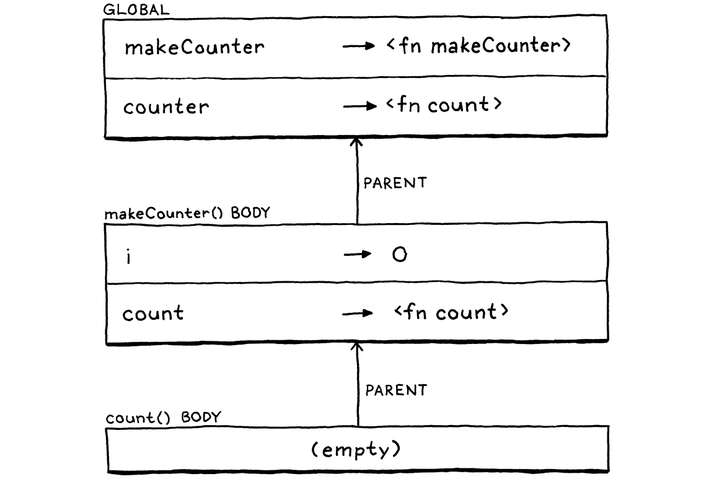

# 10. Functions 函數

> And that is also the way the human mind works—by the compounding of old ideas into new structures that become new ideas that can themselves be used in compounds, and round and round endlessly, growing ever more remote from the basic earthbound imagery that is each language’s soil.
>
> ​																														—— Douglas R. Hofstadter, *I Am a Strange Loop*

這也是人類思維的運作方式——將舊的想法複合成為新結構，成為新的想法，而這些想法本身又可以被用於複合，循環往復，無休無止，越來越遠離每一種語言賴以生存的基本的土壤。

> This chapter marks the culmination of a lot of hard work. The previous chapters add useful functionality in their own right, but each also supplies a piece of a puzzle. We’ll take those pieces—expressions, statements, variables, control flow, and lexical scope—add a couple more, and assemble them all into support for real user-defined functions and function calls.

這一章標誌着很多艱苦工作的一個高潮。在前面的章節中，各自添加了一些有用的功能，但是每一章也都提供了一個拼圖的碎片。我們整理這些碎片——表達式、語句、變量、控制流和詞法作用域，再加上其它功能，並把他們組合起來，以支持真正的用户定義函數和函數調用。

> ## 10 . 1 Function Calls

## 10.1 函數調用

> You’re certainly familiar with C-style function call syntax, but the grammar is more subtle than you may realize. Calls are typically to named functions like:

你肯定熟悉C語言風格的函數調用語法，但其語法可能比你意識到的更微妙。調用通常是指向命名的函數，例如：

```java
average(1, 2);
```

> But the name of the function being called isn’t actually part of the call syntax. The thing being called—the **callee**—can be any expression that evaluates to a function. (Well, it does have to be a pretty *high precedence* expression, but parentheses take care of that.) For example:

但是被調用函數的名稱實際上並不是調用語法的一部分。被調用者（ **callee**）可以是計算結果為一個函數的任何表達式。(好吧，它必須是一個非常高優先級的表達式，但是圓括號可以解決這個問題。)例如：

```java
getCallback()();
```

> There are two call expressions here. The first pair of parentheses has `getCallback` as its callee. But the second call has the entire `getCallback()` expression as its callee. It is the parentheses following an expression that indicate a function call. You can think of a call as sort of like a postfix operator that starts with `(`.

這裏有兩個函數調用。第一對括號將`getCallback`作為其被調用者。但是第二對括號將整個`getCallback()` 表達式作為其被調用者。表達式後面的小括號表示函數調用，你可以把調用看作是一種以`(`開頭的後綴運算符。

> This “operator” has higher precedence than any other operator, even the unary ones. So we slot it into the grammar by having the `unary` rule bubble up to a new `call` rule.

這個“運算符”比其它運算符（包括一元運算符）有更高的優先級。所以我們通過讓`unary`規則跳轉到新的`call`規則，將其添加到語法中[^1]。

```javascript
unary          → ( "!" | "-" ) unary | call ;
call           → primary ( "(" arguments? ")" )* ;
```

> This rule matches a primary expression followed by zero or more function calls. If there are no parentheses, this parses a bare primary expression. Otherwise, each call is recognized by a pair of parentheses with an optional list of arguments inside. The argument list grammar is:

該規則匹配一個基本表達式，後面跟着0個或多個函數調用。如果沒有括號，則解析一個簡單的基本表達式。否則，每一對圓括號都表示一個函數調用，圓括號內有一個可選的參數列表。參數列表語法是：

```javascript
arguments      → expression ( "," expression )* ;
```

> This rule requires at least one argument expression, followed by zero or more other expressions, each preceded by a comma. To handle zero-argument calls, the `call` rule itself considers the entire `arguments` production to be optional.

這個規則要求至少有一個參數表達式，後面可以跟0個或多個其它表達式，每兩個表達式之間用`,`分隔。為了處理無參調用，`call`規則本身認為整個`arguments`生成式是可選的。

> I admit, this seems more grammatically awkward than you’d expect for the incredibly common “zero or more comma-separated things” pattern. There are some sophisticated metasyntaxes that handle this better, but in our BNF and in many language specs I’ve seen, it is this cumbersome.

我承認，對於極其常見的 "零或多個逗號分隔的事物 "模式來説，這在語法上似乎比你想象的更難處理。有一些複雜的元語法可以更好地處理這個問題，但在我們的BNF和我見過的許多語言規範中，它就是如此的麻煩。

> Over in our syntax tree generator, we add a new node.

在我們的語法樹生成器中，我們添加一個新節點。

*<u>tool/GenerateAst.java，在 main()方法中添加代碼：</u>*

```
      "Binary   : Expr left, Token operator, Expr right",
      // 新增部分開始
      "Call     : Expr callee, Token paren, List<Expr> arguments",
      // 新增部分結束
      "Grouping : Expr expression",
```

> It stores the callee expression and a list of expressions for the arguments. It also stores the token for the closing parenthesis. We’ll use that token’s location when we report a runtime error caused by a function call.

它存儲了被調用者表達式和參數表達式列表，同時也保存了右括號標記。當我們報告由函數調用引起的運行時錯誤時，會使用該標記的位置。

> Crack open the parser. Where `unary()` used to jump straight to `primary()`, change it to call, well, `call()`.

打開解析器，原來`unary()`直接跳轉到`primary()`方法，將其修改為調用`call()`。

*<u>lox/Parser.java，在 unary()方法中替換一行：</u>*

```java
      return new Expr.Unary(operator, right);
    }
    // 替換部分開始
    return call();
    // 替換部分結束
  }
```

> Its definition is:

該方法定義為：

*<u>lox/Parser.java，在 unary()方法後添加[^2]：</u>*

```java
  private Expr call() {
    Expr expr = primary();

    while (true) { 
      if (match(LEFT_PAREN)) {
        expr = finishCall(expr);
      } else {
        break;
      }
    }

    return expr;
  }
```

> The code here doesn’t quite line up with the grammar rules. I moved a few things around to make the code cleaner—one of the luxuries we have with a handwritten parser. But it’s roughly similar to how we parse infix operators. First, we parse a primary expression, the “left operand” to the call. Then, each time we see a `(`, we call `finishCall()` to parse the call expression using the previously parsed expression as the callee. The returned expression becomes the new `expr` and we loop to see if the result is itself called.

這裏的代碼與語法規則並非完全一致。為了保持代碼簡潔，我調整了一些東西——這是我們手寫解析器的優點之一。但它與我們解析中綴運算符的方式類似。首先，我們解析一個基本表達式，即調用的左操作數。然後，每次看到`(`，我們就調用`finishCall()`解析調用表達式，並使用之前解析出的表達式作為被調用者。返回的表達式成為新的`expr`，我們循環檢查其結果是否被調用。

> The code to parse the argument list is in this helper:

解析參數列表的代碼在下面的工具方法中：

*<u>lox/Parser.java，在 unary()方法後添加：</u>*

```java
  private Expr finishCall(Expr callee) {
    List<Expr> arguments = new ArrayList<>();
    if (!check(RIGHT_PAREN)) {
      do {
        arguments.add(expression());
      } while (match(COMMA));
    }

    Token paren = consume(RIGHT_PAREN,
                          "Expect ')' after arguments.");

    return new Expr.Call(callee, paren, arguments);
  }
```

> This is more or less the `arguments` grammar rule translated to code, except that we also handle the zero-argument case. We check for that case first by seeing if the next token is `)`. If it is, we don’t try to parse any arguments.

這或多或少是`arguments` 語法規則翻譯成代碼的結果，除了我們這裏還處理了無參情況。我們首先判斷下一個標記是否`)`來檢查這種情況。如果是，我們就不會嘗試解析任何參數。

> Otherwise, we parse an expression, then look for a comma indicating that there is another argument after that. We keep doing that as long as we find commas after each expression. When we don’t find a comma, then the argument list must be done and we consume the expected closing parenthesis. Finally, we wrap the callee and those arguments up into a call AST node.

如果不是，我們就解析一個表達式，然後尋找逗號（表明後面還有一個參數）。只要我們在表達式後面發現逗號，就會繼續解析表達式。當我們找不到逗號時，説明參數列表已經結束，我們繼續消費預期的右括號。最終，我們將被調用者和這些參數封裝成一個函數調用的AST節點。

> ### 10 . 1 . 1 Maximum argument counts

### 10.1.1  最大參數數量

> Right now, the loop where we parse arguments has no bound. If you want to call a function and pass a million arguments to it, the parser would have no problem with it. Do we want to limit that?

現在，我們解析參數的循環是沒有邊界的。如果你想調用一個函數並向其傳遞一百萬個參數，解析器不會有任何問題。我們要對此進行限制嗎？

> Other languages have various approaches. The C standard says a conforming implementation has to support *at least* 127 arguments to a function, but doesn’t say there’s any upper limit. The Java specification says a method can accept *no more than* 255 arguments.

其它語言採用了不同的策略。C語言標準要求在符合標準的實現中，一個函數至少要支持127個參數，但是沒有指定任何上限。Java規範規定一個方法可以接受不超過255個參數[^3]。

> Our Java interpreter for Lox doesn’t really need a limit, but having a maximum number of arguments will simplify our bytecode interpreter in [Part III](http://craftinginterpreters.com/a-bytecode-virtual-machine.html). We want our two interpreters to be compatible with each other, even in weird corner cases like this, so we’ll add the same limit to jlox.

Lox的Java解釋器實際上並不需要限制，但是設置一個最大的參數數量限制可以簡化第三部分中的字節碼解釋器。即使是在這樣奇怪的地方里，我們也希望兩個解釋器能夠相互兼容，所以我們為jlox添加同樣的限制。

*<u>lox/Parser.java，在 finishCall()方法中添加：</u>*

```java
      do {
        // 新增部分開始
        if (arguments.size() >= 255) {
          error(peek(), "Can't have more than 255 arguments.");
        }
        // 新增部分結束
        arguments.add(expression());
```

> Note that the code here *reports* an error if it encounters too many arguments, but it doesn’t *throw* the error. Throwing is how we kick into panic mode which is what we want if the parser is in a confused state and doesn’t know where it is in the grammar anymore. But here, the parser is still in a perfectly valid state—it just found too many arguments. So it reports the error and keeps on keepin’ on.

請注意，如果發現參數過多，這裏的代碼會*報告*一個錯誤，但是不會*拋出*該錯誤。拋出錯誤是進入恐慌模式的方法，如果解析器處於混亂狀態，不知道自己在語法中處於什麼位置，那這就是我們想要的。但是在這裏，解析器仍然處於完全有效的狀態，只是發現了太多的參數。所以它會報告這個錯誤，並繼續執行解析。

> ### 10 . 1 . 2 Interpreting function calls

### 10.1.2 解釋函數調用

> We don’t have any functions we can call, so it seems weird to start implementing calls first, but we’ll worry about that when we get there. First, our interpreter needs a new import.

我們還沒有任何可以調用的函數，所以先實現函數調用似乎有點奇怪，但是這個問題我們後面再考慮。首先，我們的解釋器需要引入一個新依賴。

<u>lox/Interpreter.java</u>

```java
// 新增部分開始
import java.util.ArrayList;
// 新增部分結束
import java.util.List;
```

> As always, interpretation starts with a new visit method for our new call expression node.

跟之前一樣，解釋工作從新的調用表達式節點對應的新的visit方法開始[^4]。

*<u>lox/Interpreter.java，在 visitBinaryExpr()方法後添加：</u>*

```java
  @Override
  public Object visitCallExpr(Expr.Call expr) {
    Object callee = evaluate(expr.callee);

    List<Object> arguments = new ArrayList<>();
    for (Expr argument : expr.arguments) { 
      arguments.add(evaluate(argument));
    }

    LoxCallable function = (LoxCallable)callee;
    return function.call(this, arguments);
  }
```

> First, we evaluate the expression for the callee. Typically, this expression is just an identifier that looks up the function by its name, but it could be anything. Then we evaluate each of the argument expressions in order and store the resulting values in a list.

首先，對被調用者的表達式求值。通常情況下，這個表達式只是一個標識符，可以通過它的名字來查找函數。但它可以是任何東西。然後，我們依次對每個參數表達式求值，並將結果值存儲在一個列表中。

> Once we’ve got the callee and the arguments ready, all that remains is to perform the call. We do that by casting the callee to a LoxCallable and then invoking a `call()` method on it. The Java representation of any Lox object that can be called like a function will implement this interface. That includes user-defined functions, naturally, but also class objects since classes are “called” to construct new instances. We’ll also use it for one more purpose shortly.

一旦我們準備好被調用者和參數，剩下的就是執行函數調用。我們將被調用者轉換為LoxCallable，然後對其調用`call()`方法來實現。任何可以像函數一樣被調用的Lox對象的Java表示都要實現這個接口。這自然包括用户定義的函數，但也包括類對象，因為類會被 "調用 "來創建新的實例。稍後我們還將把它用於另一個目的。

> There isn’t too much to this new interface.

這個新接口中沒有太多內容。

*<u>lox/LoxCallable.java，創建新文件：</u>*

```java
package com.craftinginterpreters.lox;

import java.util.List;

interface LoxCallable {
  Object call(Interpreter interpreter, List<Object> arguments);
}
```

> We pass in the interpreter in case the class implementing `call()` needs it. We also give it the list of evaluated argument values. The implementer’s job is then to return the value that the call expression produces.

我們會傳入解釋器，以防實現`call()`方法的類會需要它。我們也會提供已求值的參數值列表。接口實現者的任務就是返回調用表達式產生的值。

> ### 10 . 1 . 3 Call type errors

### 10.1.3 調用類型錯誤
> Before we get to implementing LoxCallable, we need to make the visit method a little more robust. It currently ignores a couple of failure modes that we can’t pretend won’t occur. First, what happens if the callee isn’t actually something you can call? What if you try to do this:

在實現`LoxCallable`之前，必須先強化一下我們的visit方法。這個方法忽略了兩個可能出現的錯誤場景。第一個，如果被調用者無法被調用，會發生什麼？比如：

```java
"totally not a function"();
```

> Strings aren’t callable in Lox. The runtime representation of a Lox string is a Java string, so when we cast that to LoxCallable, the JVM will throw a ClassCastException. We don’t want our interpreter to vomit out some nasty Java stack trace and die. Instead, we need to check the type ourselves first.

在Lox中，字符串不是可調用的數據類型。Lox字符串在運行時中的本質其實是java字符串，所以當我們把它當作`LoxCallable` 處理的時候，JVM就會拋出`ClassCastException`。我們並不想讓我們的解釋器吐出一坨java堆棧信息然後掛掉。所以，我們自己必須先做一次類型檢查。

*<u>lox/Interpreter.java，在visitCallExpr接口中新增：</u>*

```java
    // 新增部分開始
    if (!(callee instanceof LoxCallable)) {
      throw new RuntimeError(expr.paren,
          "Can only call functions and classes.");
    }
    // 新增部分結束
    LoxCallable function = (LoxCallable)callee;
```

We still throw an exception, but now we’re throwing our own exception type, one that the interpreter knows to catch and report gracefully.

我們的實現同樣也是拋出錯誤，但它們能夠被解釋器捕獲並優雅地展示出來。

> ### 10 . 1 . 4 Checking arity

### 10.1.4 檢查元數

> The other problem relates to the function’s **arity**. Arity is the fancy term for the number of arguments a function or operation expects. Unary operators have arity one, binary operators two, etc. With functions, the arity is determined by the number of parameters it declares.

另一個問題與函數的**元數**有關。元數是一個花哨的術語，指一個函數或操作所期望的參數數量。一元運算符的元數是1，二元運算符是2，等等。對於函數來説，元數由函數聲明的參數數量決定。

```java
fun add(a, b, c) {
  print a + b + c;
}
```

> This function defines three parameters, `a`, `b`, and `c`, so its arity is three and it expects three arguments. So what if you try to call it like this:

這個函數定義了三個形參，`a` 、`b` 和`c`，所以它的元數是3，而且它期望有3個參數。那麼如果你用下面的方式調用該函數會怎樣：

```java
add(1, 2, 3, 4); // Too many.
add(1, 2);       // Too few.
```

> Different languages take different approaches to this problem. Of course, most statically typed languages check this at compile time and refuse to compile the code if the argument count doesn’t match the function’s arity. JavaScript discards any extra arguments you pass. If you don’t pass enough, it fills in the missing parameters with the magic sort-of-like-null-but-not-really value `undefined`. Python is stricter. It raises a runtime error if the argument list is too short or too long.

不同的語言對這個問題採用了不同的方法。當然，大多數靜態類型的語言在編譯時都會檢查這個問題，如果實參與函數元數不匹配，則拒絕編譯代碼。JavaScript會丟棄你傳遞的所有多餘參數。如果你沒有傳入的參數數量不足，它就會用神奇的與`null`類似但並不相同的值`undefined`來填補缺少的參數。Python更嚴格。如果參數列表太短或太長，它會引發一個運行時錯誤。

> I think the latter is a better approach. Passing the wrong number of arguments is almost always a bug, and it’s a mistake I do make in practice. Given that, the sooner the implementation draws my attention to it, the better. So for Lox, we’ll take Python’s approach. Before invoking the callable, we check to see if the argument list’s length matches the callable’s arity.

我認為後者是一種更好的方法。傳遞錯誤的參數數量幾乎總是一個錯誤，這也是我在實踐中確實犯的一個錯誤。有鑑於此，語言實現能越早引起用户的注意就越好。所以對於Lox，我們將採取Python的方法。在執行可調用方法之前，我們檢查參數列表的長度是否與可調用方法的元數相符。

*<u>lox/Interpreter.java，在 visitCallExpr()方法中添加代碼：</u>*

```java
    LoxCallable function = (LoxCallable)callee;
    // 新增部分開始
    if (arguments.size() != function.arity()) {
      throw new RuntimeError(expr.paren, "Expected " +
          function.arity() + " arguments but got " +
          arguments.size() + ".");
    }
    // 新增部分結束
    return function.call(this, arguments);
```

> That requires a new method on the LoxCallable interface to ask it its arity.

這就需要在`LoxCallable`接口中增加一個新方法來查詢函數的元數。

*<u>lox/LoxCallable.java，在LoxCallable接口中新增：</u>*

```java
interface LoxCallable {
  // 新增部分開始
  int arity();
  // 新增部分結束
  Object call(Interpreter interpreter, List<Object> arguments);
```

> We *could* push the arity checking into the concrete implementation of `call()`. But, since we’ll have multiple classes implementing LoxCallable, that would end up with redundant validation spread across a few classes. Hoisting it up into the visit method lets us do it in one place.

我們可以在`call()`方法的具體實現中做元數檢查。但是，由於我們會有多個實現LoxCallable的類，這將導致冗餘的驗證分散在多個類中。把它提升到訪問方法中，這樣我們可以在一個地方完成該功能。

> ## 10 . 2 Native Functions

## 10.2 原生函數（本地函數）

> We can theoretically call functions, but we have no functions to call yet. Before we get to user-defined functions, now is a good time to introduce a vital but often overlooked facet of language implementations—**native functions**. These are functions that the interpreter exposes to user code but that are implemented in the host language (in our case Java), not the language being implemented (Lox).

理論上我們可以調用函數了，但是我們還沒有可供調用的函數。在我們實現用户自定義函數之前，現在正好可以介紹語言實現中一個重要但經常被忽視的方面——**原生函數（本地函數）**。這些函數是解釋器向用户代碼公開的，但它們是用宿主語言(在我們的例子中是Java)實現的，而不是正在實現的語言(Lox)。

> Sometimes these are called **primitives**, **external functions**, or **foreign functions**. Since these functions can be called while the user’s program is running, they form part of the implementation’s runtime. A lot of programming language books gloss over these because they aren’t conceptually interesting. They’re mostly grunt work.

有時這些函數也被稱為**原語**、**外部函數**或**外來函數**[^5]。由於這些函數可以在用户程序運行的時候被調用，因此它們構成了語言運行時的一部分。許多編程語言書籍都掩蓋了這些內容，因為它們在概念上並不有趣。它們主要是一些比較繁重的工作。

> But when it comes to making your language actually good at doing useful stuff, the native functions your implementation provides are key. They provide access to the fundamental services that all programs are defined in terms of. If you don’t provide native functions to access the file system, a user’s going to have a hell of a time writing a program that reads and displays a file.

但是説到讓你的語言真正擅長做有用的事情，語言提供的本地函數是關鍵[^6]。本地函數提供了對基礎服務的訪問，所有的程序都是根據這些服務來定義的。如果你不提供訪問文件系統的本地函數，那麼用户在寫一個讀取和顯示文件的程序時就會有很大的困難。

> Many languages also allow users to provide their own native functions. The mechanism for doing so is called a **foreign function interface** (**FFI**), **native extension**, **native interface**, or something along those lines. These are nice because they free the language implementer from providing access to every single capability the underlying platform supports. We won’t define an FFI for jlox, but we will add one native function to give you an idea of what it looks like.

許多語言還允許用户提供自己的本地函數。這樣的機制稱為**外來函數接口(FFI)**、**本機擴展**、**本機接口**或類似的東西。這些機制很好，因為它們使語言實現者無需提供對底層平台所支持的每一項功能的訪問。我們不會為 jlox 定義一個 FFI，但我們會添加一個本地函數，讓你知道它是什麼樣子。

> ### 10 . 2 . 1 Telling time

### 10.2.1 報時

> When we get to [Part III](http://craftinginterpreters.com/a-bytecode-virtual-machine.html) and start working on a much more efficient implementation of Lox, we’re going to care deeply about performance. Performance work requires measurement, and that in turn means **benchmarks**. These are programs that measure the time it takes to exercise some corner of the interpreter.

當我們進入第三部分，開始着手開發更有效的Lox實現時，我們就會非常關心性能。性能需要測量，這也就意味着需要**基準測試**。這些代碼就是用於測量解釋器執行某些代碼時所花費的時間。

> We could measure the time it takes to start up the interpreter, run the benchmark, and exit, but that adds a lot of overhead—JVM startup time, OS shenanigans, etc. That stuff does matter, of course, but if you’re just trying to validate an optimization to some piece of the interpreter, you don’t want that overhead obscuring your results.

我們可以測量啓動解釋器、運行基準測試代碼並退出所消耗的時間，但是這其中包括很多時間開銷——JVM啓動時間，操作系統欺詐等等。當然，這些東西確實很重要，但如果您只是試圖驗證對解釋器某個部分的優化，你肯定不希望這些多餘的時間開銷掩蓋你的結果。

> A nicer solution is to have the benchmark script itself measure the time elapsed between two points in the code. To do that, a Lox program needs to be able to tell time. There’s no way to do that now—you can’t implement a useful clock “from scratch” without access to the underlying clock on the computer.

一個更好的解決方案是讓基準腳本本身度量代碼中兩個點之間的時間間隔。要做到這一點，Lox程序需要能夠報時。現在沒有辦法做到這一點——如果不訪問計算機上的底層時鐘，就無法從頭實現一個可用的時鐘。

> So we’ll add `clock()`, a native function that returns the number of seconds that have passed since some fixed point in time. The difference between two successive invocations tells you how much time elapsed between the two calls. This function is defined in the global scope, so let’s ensure the interpreter has access to that.

所以我們要添加`clock()`，這是一個本地函數，用於返回自某個固定時間點以來所經過的秒數。兩次連續調用之間的差值可用告訴你兩次調用之間經過了多少時間。這個函數被定義在全局作用域內，以確保解釋器能夠訪問這個函數。

*<u>lox/Interpreter.java，在 Interpreter類中，替換一行：</u>*

```java
class Interpreter implements Expr.Visitor<Object>,
                             Stmt.Visitor<Void> {
  // 替換部分開始                           
  final Environment globals = new Environment();
  private Environment environment = globals;
  // 替換部分結束
  void interpret(List<Stmt> statements) {
```

> The `environment` field in the interpreter changes as we enter and exit local scopes. It tracks the *current* environment. This new `globals` field holds a fixed reference to the outermost global environment.

解釋器中的`environment`字段會隨着進入和退出局部作用域而改變，它會跟隨當前環境。新加的`globals`字段則固定指向最外層的全局作用域。

> When we instantiate an Interpreter, we stuff the native function in that global scope.

當我們實例化一個解釋器時，我們將全局作用域中添加本地函數。

*<u>lox/Interpreter.java，在 Interpreter類中新增：</u>*

```java
  private Environment environment = globals;
  // 新增部分開始
  Interpreter() {
    globals.define("clock", new LoxCallable() {
      @Override
      public int arity() { return 0; }

      @Override
      public Object call(Interpreter interpreter,
                         List<Object> arguments) {
        return (double)System.currentTimeMillis() / 1000.0;
      }

      @Override
      public String toString() { return "<native fn>"; }
    });
  }
  // 新增部分結束
  void interpret(List<Stmt> statements) {
```

> This defines a variable named “clock”. Its value is a Java anonymous class that implements LoxCallable. The `clock()` function takes no arguments, so its arity is zero. The implementation of `call()` calls the corresponding Java function and converts the result to a double value in seconds.

這裏有一個名為`clock`的變量，它的值是一個實現LoxCallable接口的Java匿名類。這裏的`clock()`函數不接受參數，所以其元數為0。`call()`方法的實現是直接調用Java函數並將結果轉換為以秒為單位的double值。

> If we wanted to add other native functions—reading input from the user, working with files, etc.—we could add them each as their own anonymous class that implements LoxCallable. But for the book, this one is really all we need.

如果我們想要添加其它本地函數——讀取用户輸入，處理文件等等——我們可以依次為它們提供實現LoxCallable接口的匿名類。但是在本書中，這個函數足以滿足需要。

> Let’s get ourselves out of the function-defining business and let our users take over . . . 

讓我們從函數定義的事務中解脱出來，由用户來接管吧。

> ## 10 . 3 Function Declarations

## 10.3 函數聲明

> We finally get to add a new production to the `declaration` rule we introduced back when we added variables. Function declarations, like variables, bind a new name. That means they are allowed only in places where a declaration is permitted.

我們終於可以在添加變量時就引入的`declaration`規則中添加產生式了。就像變量一樣，函數聲明也會綁定一個新的名稱。這意味中它們只能出現在允許聲明的地方。

```
declaration    → funDecl
               | varDecl
               | statement ;
```

> The updated `declaration` rule references this new rule:

更新後的`declaration`引用了下面的新規則：

```
funDecl        → "fun" function ;
function       → IDENTIFIER "(" parameters? ")" block ;
```

> The main `funDecl` rule uses a separate helper rule `function`. A function *declaration statement* is the `fun` keyword followed by the actual function-y stuff. When we get to classes, we’ll reuse that `function` rule for declaring methods. Those look similar to function declarations, but aren’t preceded by `fun`.

主要的`funDecl`規則使用了一個單獨的輔助規則`function`。函數*聲明語句*是`fun`關鍵字後跟實際的函數體內容。等到我們實現類的時候，將會複用`function`規則來聲明方法。這些方法與函數聲明類似，但是前面沒有`fun`。

> The function itself is a name followed by the parenthesized parameter list and the body. The body is always a braced block, using the same grammar rule that block statements use. The parameter list uses this rule:

函數本身是一個名稱，後跟帶括號的參數列表和函數體。函數體是一個帶花括號的塊，可以使用與塊語句相同的語法。參數列表則使用以下規則：

```
parameters     → IDENTIFIER ( "," IDENTIFIER )* ;
```

> It’s like the earlier `arguments` rule, except that each parameter is an identifier, not an expression. That’s a lot of new syntax for the parser to chew through, but the resulting AST node isn’t too bad.

這就類似於前面的`arguments` 規則，區別在於參數是一個標識符，而不是一個表達式。這對於解析器來説是很多要處理的新語法，但是生成的AST節點沒這麼複雜。

*<u>tool/GenerateAst.java，在 main()方法中添加：</u>*

```java
      "Expression : Expr expression",
      // 新增部分開始
      "Function   : Token name, List<Token> params," +
                  " List<Stmt> body",
      // 新增部分結束           
      "If         : Expr condition, Stmt thenBranch," +
```

> A function node has a name, a list of parameters (their names), and then the body. We store the body as the list of statements contained inside the curly braces.

函數節點有一個名稱、一個參數列表(參數的名稱)，然後是函數主體。我們將函數主體存儲為包含在花括號中的語句列表。

> Over in the parser, we weave in the new declaration.

在解析器中，我們把新的聲明添加進去。

*<u>lox/Parser.java，在 declaration()方法中添加：</u>*

```java
    try {
      // 新增部分開始
      if (match(FUN)) return function("function");
      // 新增部分結束
      if (match(VAR)) return varDeclaration();
```

> Like other statements, a function is recognized by the leading keyword. When we encounter `fun`, we call `function`. That corresponds to the `function` grammar rule since we already matched and consumed the `fun` keyword. We’ll build the method up a piece at a time, starting with this:

像其它語句一樣，函數是通過前面的關鍵字來識別的。當我們遇到`fun`時，我們就調用`function`。這步操作對應於`function`語法規則，因為我們已經匹配並消費了`fun`關鍵字。我們會一步步構建這個方法，首先從下面的代碼開始：

*<u>lox/Parser.java，在 expressionStatement()方法後添加：</u>*

```java
  private Stmt.Function function(String kind) {
    Token name = consume(IDENTIFIER, "Expect " + kind + " name.");
  }
```

> Right now, it only consumes the identifier token for the function’s name. You might be wondering about that funny little `kind` parameter. Just like we reuse the grammar rule, we’ll reuse the `function()` method later to parse methods inside classes. When we do that, we’ll pass in “method” for `kind` so that the error messages are specific to the kind of declaration being parsed.

現在，它只是消費了標識符標記作為函數名稱。你可能會對這裏的`kind`參數感到疑惑。就像我們複用語法規則一樣，稍後我們也會複用`function()`方法來解析類中的方法。到時候，我們會在`kind`參數中傳入 "method"，這樣錯誤信息就會針對被解析的聲明類型來展示。

> Next, we parse the parameter list and the pair of parentheses wrapped around it.

接下來，我們要解析參數列表和包裹着它們的一對小括號。

*<u>lox/Parser.java，在 function()方法中添加：</u>*

```java
    Token name = consume(IDENTIFIER, "Expect " + kind + " name.");
    // 新增部分開始
    consume(LEFT_PAREN, "Expect '(' after " + kind + " name.");
    List<Token> parameters = new ArrayList<>();
    if (!check(RIGHT_PAREN)) {
      do {
        if (parameters.size() >= 255) {
          error(peek(), "Can't have more than 255 parameters.");
        }

        parameters.add(
            consume(IDENTIFIER, "Expect parameter name."));
      } while (match(COMMA));
    }
    consume(RIGHT_PAREN, "Expect ')' after parameters.");
    // 新增部分結束
  }
```

> This is like the code for handling arguments in a call, except not split out into a helper method. The outer `if` statement handles the zero parameter case, and the inner `while` loop parses parameters as long as we find commas to separate them. The result is the list of tokens for each parameter’s name.

這就像在函數調用中處理參數的代碼一樣，只是沒有拆分到一個輔助方法中。外部的`if`語句用於處理零參數的情況，內部的`while`會循環解析參數，只要能找到分隔參數的逗號。其結果是包含每個參數名稱的標記列表。

> Just like we do with arguments to function calls, we validate at parse time that you don’t exceed the maximum number of parameters a function is allowed to have.

就像我們處理函數調用的參數一樣，我們在解析時驗證是否超過了一個函數所允許的最大參數數。

> Finally, we parse the body and wrap it all up in a function node.

最後，我們解析函數主體，並將其封裝為一個函數節點。

*<u>lox/Parser.java，在 function()方法中添加：</u>*

```java
    consume(RIGHT_PAREN, "Expect ')' after parameters.");
    // 新增部分開始
    consume(LEFT_BRACE, "Expect '{' before " + kind + " body.");
    List<Stmt> body = block();
    return new Stmt.Function(name, parameters, body);
    // 新增部分結束
  }
```

> Note that we consume the `{` at the beginning of the body here before calling `block()`. That’s because `block()` assumes the brace token has already been matched. Consuming it here lets us report a more precise error message if the `{` isn’t found since we know it’s in the context of a function declaration.

請注意，在調用`block()`方法之前，我們已經消費了函數體開頭的`{`。這是因為`block()`方法假定大括號標記已經匹配了。在這裏消費該標記可以讓我們在找不到`{`的情況下報告一個更精確的錯誤信息，因為我們知道當前是在一個函數聲明的上下文中。

> ## 10 . 4 Function Objects

## 10.4 函數對象

> We’ve got some syntax parsed so usually we’re ready to interpret, but first we need to think about how to represent a Lox function in Java. We need to keep track of the parameters so that we can bind them to argument values when the function is called. And, of course, we need to keep the code for the body of the function so that we can execute it.

我們已經解析了一些語法，通常我們要開始準備解釋了，但是我們首先需要思考一下，在Java中如何表示一個Lox函數。我們需要跟蹤形參，以便在函數被調用時可以將形參與實參值進行綁定。當然，我們也要保留函數體的代碼，以便我們可以執行它。

> That’s basically what the Stmt.Function class is. Could we just use that? Almost, but not quite. We also need a class that implements LoxCallable so that we can call it. We don’t want the runtime phase of the interpreter to bleed into the front end’s syntax classes so we don’t want Stmt.Function itself to implement that. Instead, we wrap it in a new class.

這基本上就是Stmt.Function的內容。我們可以用這個嗎？差不多，但還不夠。我們還需要一個實現LoxCallable的類，以便我們可以調用它。我們不希望解釋器的運行時階段滲入到前端語法類中，所以我們不希望使用Stmt.Function本身來實現它。相反，我們將它包裝在一個新類中。

*<u>lox/LoxFunction.java， 創建新文件：</u>*

```java
package com.craftinginterpreters.lox;

import java.util.List;

class LoxFunction implements LoxCallable {
  private final Stmt.Function declaration;
  LoxFunction(Stmt.Function declaration) {
    this.declaration = declaration;
  }
}
```

> We implement the `call()` of LoxCallable like so:

使用如下方式實現LoxCallable的`call()`方法：

*<u>lox/LoxFunction.java，在 LoxFunction()方法後添加：</u>*

```java
  @Override
  public Object call(Interpreter interpreter,
                     List<Object> arguments) {
    Environment environment = new Environment(interpreter.globals);
    for (int i = 0; i < declaration.params.size(); i++) {
      environment.define(declaration.params.get(i).lexeme,
          arguments.get(i));
    }

    interpreter.executeBlock(declaration.body, environment);
    return null;
  }
```

> This handful of lines of code is one of the most fundamental, powerful pieces of our interpreter. As we saw in [the chapter on statements and state](http://craftinginterpreters.com/statements-and-state.html), managing name environments is a core part of a language implementation. Functions are deeply tied to that.

這幾行代碼是我們的解釋器中最基本、最強大的部分之一。正如我們在上一章中所看到的，管理名稱環境是語言實現中的核心部分。函數與此緊密相關。

> Parameters are core to functions, especially the fact that a function *encapsulates* its parameters—no other code outside of the function can see them. This means each function gets its own environment where it stores those variables.

參數是函數的核心，尤其是考慮到函數*封裝*了其參數——函數之外的代碼看不到這些參數。這意味着每個函數都會維護自己的環境，其中存儲着那些變量。

> Further, this environment must be created dynamically. Each function *call* gets its own environment. Otherwise, recursion would break. If there are multiple calls to the same function in play at the same time, each needs its *own* environment, even though they are all calls to the same function.

此外，這個環境必須是動態創建的。每次函數*調用*都會獲得自己的環境，否則，遞歸就會中斷。如果在同一時刻對相同的函數有多次調用，那麼每個調用都需要自身的環境，即便它們都是對相同函數的調用。

> For example, here’s a convoluted way to count to three:

舉例來説，下面是一個計數到3的複雜方法：

```js
fun count(n) {
  if (n > 1) count(n - 1);
  print n;
}

count(3);
```

> Imagine we pause the interpreter right at the point where it’s about to print 1 in the innermost nested call. The outer calls to print 2 and 3 haven’t printed their values yet, so there must be environments somewhere in memory that still store the fact that `n` is bound to 3 in one context, 2 in another, and 1 in the innermost, like:

假設一下，如果我們在最內層的嵌套調用中即將打印1的時候暫停了解釋器。打印2和3的外部調用還沒有打印出它們的值，所以在內存的某個地方一定有環境仍然存儲着這樣的數據：n在一個上下文中被綁定到3，在另一個上下文中被綁定到2，而在最內層調用中綁定為1，比如：


> That’s why we create a new environment at each *call*, not at the function *declaration*. The `call()` method we saw earlier does that. At the beginning of the call, it creates a new environment. Then it walks the parameter and argument lists in lockstep. For each pair, it creates a new variable with the parameter’s name and binds it to the argument’s value.

這就是為什麼我們在每次*調用*時創建一個新的環境，而不是在函數聲明時創建。我們前面看到的`call()`方法就是這樣做的。在調用開始的時候，它創建了一個新環境。然後它以同步的方式遍歷形參和實參列表。對於每一對參數，它用形參的名字創建一個新的變量，並將其與實參的值綁定。

> So, for a program like this:

所以，對於類似下面這樣的代碼：

```java
fun add(a, b, c) {
  print a + b + c;
}

add(1, 2, 3);
```

> At the point of the call to `add()`, the interpreter creates something like this:

在調用`add()`時，解釋器會創建類似下面這樣的內容：


> Then `call()` tells the interpreter to execute the body of the function in this new function-local environment. Up until now, the current environment was the environment where the function was being called. Now, we teleport from there inside the new parameter space we’ve created for the function.
>

然後`call()`會告訴解釋器在這個新的函數局部環境中執行函數體。在此之前，當前環境是函數被調用的位置所處的環境。現在，我們轉入了為函數創建的新的參數空間中。

> This is all that’s required to pass data into the function. By using different environments when we execute the body, calls to the same function with the same code can produce different results.
>

這就是將數據傳入函數所需的全部內容。通過在執行函數主體時使用不同的環境，用同樣的代碼調用相同的函數可以產生不同的結果。

> Once the body of the function has finished executing, `executeBlock()` discards that function-local environment and restores the previous one that was active back at the callsite. Finally, `call()` returns `null`, which returns `nil` to the caller. (We’ll add return values later.)
>

一旦函數的主體執行完畢，`executeBlock()`就會丟棄該函數的本地環境，並恢復調用該函數前的活躍環境。最後，`call()`方法會返回`null`，它向調用者返回`nil`。（我們會在稍後添加返回值）

> Mechanically, the code is pretty simple. Walk a couple of lists. Bind some new variables. Call a method. But this is where the crystalline *code* of the function declaration becomes a living, breathing *invocation*. This is one of my favorite snippets in this entire book. Feel free to take a moment to meditate on it if you’re so inclined.
>

從機制上講，這段代碼是非常簡單的。遍歷幾個列表，綁定一些新變量，調用一個方法。但這就是將代碼塊變成有生命力的調用執行的地方。這是我在整本書中最喜歡的片段之一。如果你願意的話，可以花點時間好好思考一下。

> Done? OK. Note when we bind the parameters, we assume the parameter and argument lists have the same length. This is safe because `visitCallExpr()` checks the arity before calling `call()`. It relies on the function reporting its arity to do that.
>

完成了嗎？好的。注意當我們綁定參數時，我們假設參數和參數列表具有相同的長度。這是安全的，因為`visitCallExpr()`在調用`call()`之前會檢查元數。它依靠報告其元數的函數來做到這一點。

*<u>lox/LoxFunction.java，在 LoxFunction()方法後添加：</u>*

```java
  @Override
  public int arity() {
    return declaration.params.size();
  }
```

> That’s most of our object representation. While we’re in here, we may as well implement `toString()`.
>

這基本就是我們的函數對象表示了。既然已經到了這一步，我們也可以實現toString()。

*<u>lox/LoxFunction.java，在 LoxFunction()方法後添加：</u>*

```java
  @Override
  public String toString() {
    return "<fn " + declaration.name.lexeme + ">";
  }
```

> This gives nicer output if a user decides to print a function value.
>

如果用户要打印函數的值，該方法能提供一個更漂亮的輸出值。

```javascript
fun add(a, b) {
  print a + b;
}

print add; // "<fn add>".
```

> ### 10 . 4 . 1 Interpreting function declarations

### 10.4.1 解釋函數聲明

> We’ll come back and refine LoxFunction soon, but that’s enough to get started. Now we can visit a function declaration.

我們很快就會回頭來完善LoxFunction，但是現在已足夠開始進行解釋了。現在，我們可以訪問函數聲明節點了。

*<u>lox/Interpreter.java，在 visitExpressionStmt()方法後添加：</u>*

```java
  @Override
  public Void visitFunctionStmt(Stmt.Function stmt) {
    LoxFunction function = new LoxFunction(stmt);
    environment.define(stmt.name.lexeme, function);
    return null;
  }
```

> This is similar to how we interpret other literal expressions. We take a function *syntax node*—a compile-time representation of the function—and convert it to its runtime representation. Here, that’s a LoxFunction that wraps the syntax node.

這類似於我們介紹其它文本表達式的方式。我們會接收一個函數*語法*節點——函數的編譯時表示形式——然後將其轉換為運行時表示形式。在這裏就是一個封裝了語法節點的LoxFunction實例。

> Function declarations are different from other literal nodes in that the declaration *also* binds the resulting object to a new variable. So, after creating the LoxFunction, we create a new binding in the current environment and store a reference to it there.

函數聲明與其它文本節點的不同之處在於，聲明還會將結果對象綁定到一個新的變量。因此，在創建LoxFunction之後，我們在當前環境中創建一個新的綁定，並在其中保存對該函數的引用。

> With that, we can define and call our own functions all within Lox. Give it a try:

這樣，我們就可以在Lox中定義和調用我們自己的函數。試一下：

```javascript
fun sayHi(first, last) {
  print "Hi, " + first + " " + last + "!";
}

sayHi("Dear", "Reader");
```

> I don’t know about you, but that looks like an honest-to-God programming language to me.

我不知道你怎麼想的，但對我來説，這看起來像是一種虔誠的編程語言。

> ## 10 . 5 Return Statements

## 10.5 Return語句

> We can get data into functions by passing parameters, but we’ve got no way to get results back *out*. If Lox were an expression-oriented language like Ruby or Scheme, the body would be an expression whose value is implicitly the function’s result. But in Lox, the body of a function is a list of statements which don’t produce values, so we need dedicated syntax for emitting a result. In other words, `return` statements. I’m sure you can guess the grammar already.

我們可以通過傳遞參數將數據輸入函數中，但是我們沒有辦法將結果*傳出來*。如果Lox是像Ruby或Scheme那樣的面向表達式的語言，那麼函數體就是一個表達式，其值就隱式地作為函數的結果。但是在Lox中，函數體是一個不產生值的語句列表，所有我們需要專門的語句來發出結果。換句話説，就是`return`語句。我相信你已經能猜出語法了。

```
statement      → exprStmt
               | forStmt
               | ifStmt
               | printStmt
               | returnStmt
               | whileStmt
               | block ;

returnStmt     → "return" expression? ";" ;
```

> We’ve got one more—the final, in fact—production under the venerable `statement` rule. A `return` statement is the `return` keyword followed by an optional expression and terminated with a semicolon.

我們又得到一個`statement`規則下的新產生式（實際上也是最後一個）。一個`return`語句就是一個`return`關鍵字，後跟一個可選的表達式，並以一個分號結尾。

> The return value is optional to support exiting early from a function that doesn’t return a useful value. In statically typed languages, “void” functions don’t return a value and non-void ones do. Since Lox is dynamically typed, there are no true void functions. The compiler has no way of preventing you from taking the result value of a call to a function that doesn’t contain a `return` statement.

返回值是可選的，用以支持從一個不返回有效值的函數中提前退出。在靜態類型語言中，void函數不返回值，而非void函數返回值。由於Lox是動態類型的，所以沒有真正的void函數。在調用一個不包含`return`語句的函數時，編譯器沒有辦法阻止你獲取其結果值。

```javascript
fun procedure() {
  print "don't return anything";
}

var result = procedure();
print result; // ?
```

> This means every Lox function must return *something*, even if it contains no `return` statements at all. We use `nil` for this, which is why LoxFunction’s implementation of `call()` returns `null` at the end. In that same vein, if you omit the value in a `return` statement, we simply treat it as equivalent to:

這意味着每個Lox函數都要返回一些內容，即使其中根本不包含`return`語句。我們使用`nil`，這就是為什麼LoxFunction的`call()`實現在最後返回`null`。同樣，如果你省略了`return `語句中的值，我們將其視為等價於：

```java
return nil;
```

> Over in our AST generator, we add a new node.

在AST生成器中，添加一個新節點。

*<u>tool/GenerateAst.java，在 main()方法中添加：</u>*

```java
      "Print      : Expr expression",
      // 新增部分開始
      "Return     : Token keyword, Expr value",
      // 新增部分結束
      "Var        : Token name, Expr initializer",
```

> It keeps the `return` keyword token so we can use its location for error reporting, and the value being returned, if any. We parse it like other statements, first by recognizing the initial keyword.

其中保留了`return`關鍵字標記（這樣我們可以使用該標記的位置來報告錯誤），以及返回的值（如果有的話）。我們像解析其它語句一樣來解析它，首先識別起始的關鍵字。

*<u>lox/Parser.java，在 statement()方法中添加：</u>*

```java
    if (match(PRINT)) return printStatement();
    // 新增部分開始
    if (match(RETURN)) return returnStatement();
    // 新增部分結束
    if (match(WHILE)) return whileStatement();
```

> That branches out to:

分支會跳轉到：

*<u>lox/Parser.java，在 printStatement()方法後添加：</u>*

```java
  private Stmt returnStatement() {
    Token keyword = previous();
    Expr value = null;
    if (!check(SEMICOLON)) {
      value = expression();
    }

    consume(SEMICOLON, "Expect ';' after return value.");
    return new Stmt.Return(keyword, value);
  }
```

> After snagging the previously consumed `return` keyword, we look for a value expression. Since many different tokens can potentially start an expression, it’s hard to tell if a return value is *present*. Instead, we check if it’s *absent*. Since a semicolon can’t begin an expression, if the next token is that, we know there must not be a value.

在捕獲先前消耗的`return`關鍵字之後，我們會尋找一個值表達式。因為很多不同的標記都可以引出一個表達式，所以很難判斷是否存在返回值。相反，我們檢查它是否不存在。因為分號不能作為表達式的開始，如果下一個標記是分號，我們就知道一定沒有返回值。

> ### 10 . 5 . 1 Returning from calls

### 10.5.1 從函數調用中返回

> Interpreting a `return` statement is tricky. You can return from anywhere within the body of a function, even deeply nested inside other statements. When the return is executed, the interpreter needs to jump all the way out of whatever context it’s currently in and cause the function call to complete, like some kind of jacked up control flow construct.

解釋`return`語句是很棘手的。你可以從函數體中的任何位置返回，甚至是深深嵌套在其它語句中的位置。當返回語句被執行時，解釋器需要完全跳出當前所在的上下文，完成函數調用，就像某種頂層的控制流結構。

> For example, say we’re running this program and we’re about to execute the `return` statement:

舉例來説，假設我們正在運行下面的代碼，並且我們即將執行`return`語句：

```java
fun count(n) {
  while (n < 100) {
    if (n == 3) return n; // <--
    print n;
    n = n + 1;
  }
}

count(1);
```

> The Java call stack currently looks roughly like this:

Java調用棧目前看起來大致如下所示：

```java
Interpreter.visitReturnStmt()
Interpreter.visitIfStmt()
Interpreter.executeBlock()
Interpreter.visitBlockStmt()
Interpreter.visitWhileStmt()
Interpreter.executeBlock()
LoxFunction.call()
Interpreter.visitCallExpr()
```

> We need to get from the top of the stack all the way back to `call()`. I don’t know about you, but to me that sounds like exceptions. When we execute a `return` statement, we’ll use an exception to unwind the interpreter past the visit methods of all of the containing statements back to the code that began executing the body.

我們需要從棧頂一直回退到`call()`。我不知道你怎麼想，但是對我來説，這聽起來很像是異常。當我們執行`return`語句時，我們會使用一個異常來解開解釋器，經過所有函數內含語句的visit方法，一直回退到開始執行函數體的代碼。

> The visit method for our new AST node looks like this:

新的AST節點的visit方法如下所示：

*<u>lox/Interpreter.java，在 visitPrintStmt()方法後添加：</u>*

```java
  @Override
  public Void visitReturnStmt(Stmt.Return stmt) {
    Object value = null;
    if (stmt.value != null) value = evaluate(stmt.value);

    throw new Return(value);
  }
```

> If we have a return value, we evaluate it, otherwise, we use `nil`. Then we take that value and wrap it in a custom exception class and throw it.

如果我們有返回值，就對其求值，否則就使用`nil`。然後我們取這個值並將其封裝在一個自定義的異常類中，並拋出該異常。

*<u>lox/Return.java，創建新文件：</u>*

```java
package com.craftinginterpreters.lox;

class Return extends RuntimeException {
  final Object value;

  Return(Object value) {
    super(null, null, false, false);
    this.value = value;
  }
}
```

> This class wraps the return value with the accoutrements Java requires for a runtime exception class. The weird super constructor call with those `null` and `false` arguments disables some JVM machinery that we don’t need. Since we’re using our exception class for control flow and not actual error handling, we don’t need overhead like stack traces.
>

這個類使用Java運行時異常類來封裝返回值。其中那個奇怪的帶有`null`和`false`的父類構造器方法，禁用了一些我們不需要的JVM機制。因為我們只是使用該異常類來控制流，而不是真正的錯誤處理，所以我們不需要像堆棧跟蹤這樣的開銷。

> We want this to unwind all the way to where the function call began, the `call()` method in LoxFunction.

我們希望可以一直跳出到函數調用開始的地方，也就是LoxFunction中的`call()`方法。

*<u>lox/LoxFunction.java，在 call()方法中替換一行：</u>*

```java
         arguments.get(i));
    }
    // 替換部分開始
    try {
      interpreter.executeBlock(declaration.body, environment);
    } catch (Return returnValue) {
      return returnValue.value;
    }
    // 替換部分結束
    return null;
```

> We wrap the call to `executeBlock()` in a try-catch block. When it catches a return exception, it pulls out the value and makes that the return value from `call()`. If it never catches one of these exceptions, it means the function reached the end of its body without hitting a `return` statement. In that case, it implicitly returns `nil`.

我們將對`executeBlock()`的調用封裝在一個try-catch塊中。當捕獲一個返回異常時，它會取出其中的值並將其作為`call()`方法的返回值。如果沒有捕獲任何異常，意味着函數到達了函數體的末尾，而且沒有遇到`return`語句。在這種情況下，隱式地返回`nil`。

> Let’s try it out. We finally have enough power to support this classic example—a recursive function to calculate Fibonacci numbers:
>

我們來試一下。我們終於有能力支持這個經典的例子——遞歸函數計算Fibonacci數[^7]：

```java
fun fib(n) {
  if (n <= 1) return n;
  return fib(n - 2) + fib(n - 1);
}

for (var i = 0; i < 20; i = i + 1) {
  print fib(i);
}
```

> This tiny program exercises almost every language feature we have spent the past several chapters implementing—expressions, arithmetic, branching, looping, variables, functions, function calls, parameter binding, and returns.
>

這個小程序練習了我們在過去幾章中實現的幾乎所有語言特性，包括表達式、算術運算、分支、循環、變量、函數、函數調用、參數綁定和返回。

> ## 10 . 6 Local Functions and Closures

## 10.6 局部函數和閉包

> Our functions are pretty full featured, but there is one hole to patch. In fact, it’s a big enough gap that we’ll spend most of the [next chapter](http://craftinginterpreters.com/resolving-and-binding.html) sealing it up, but we can get started here.

我們的函數功能已經相當全面了，但是還有一個漏洞需要修補。實際上，這是一個很大的問題，我們將會在下一章中花費大部分時間來修補它，但是我們可以從這裏開始。

> LoxFunction’s implementation of `call()` creates a new environment where it binds the function’s parameters. When I showed you that code, I glossed over one important point: What is the *parent* of that environment?

LoxFunction中的`call()`實現創建了一個新的環境，並在其中綁定了函數的參數。當我向你展示這段代碼時，我忽略了一個重要的問題：這個環境的父類是什麼？

> Right now, it is always `globals`, the top-level global environment. That way, if an identifier isn’t defined inside the function body itself, the interpreter can look outside the function in the global scope to find it. In the Fibonacci example, that’s how the interpreter is able to look up the recursive call to `fib` inside the function’s own body—`fib` is a global variable.

目前，它始終是`globals`，即頂級的全局環境。這樣，如果一個標識符不是在函數體內部定義的，解釋器可以在函數外部的全局作用域中查找它。在Fibonacci的例子中，這就是解釋器如何能夠在函數體中實現對`fib`的遞歸調用——`fib`是一個全局變量。

> But recall that in Lox, function declarations are allowed *anywhere* a name can be bound. That includes the top level of a Lox script, but also the inside of blocks or other functions. Lox supports **local functions** that are defined inside another function, or nested inside a block.

但請記住，在Lox中，允許在可以綁定名字的*任何地方*進行函數聲明。其中包括Lox腳本的頂層，但也包括塊或其他函數的內部。Lox支持在另一個函數內定義或在一個塊內嵌套的**局部函數**。

> Consider this classic example:

考慮下面這個經典的例子：

```java
fun makeCounter() {
  var i = 0;
  fun count() {
    i = i + 1;
    print i;
  }

  return count;
}

var counter = makeCounter();
counter(); // "1".
counter(); // "2".
```

> Here, `count()` uses `i`, which is declared outside of itself in the containing function `makeCounter()`. `makeCounter()` returns a reference to the `count()` function and then its own body finishes executing completely.

這個例子中，`count()`使用了`i`，它是在該函數外部的 `makeCounter()`聲明的。`makeCounter()` 返回對`count()`函數的引用，然後它的函數體就執行完成了。

> Meanwhile, the top-level code invokes the returned `count()` function. That executes the body of `count()`, which assigns to and reads `i`, even though the function where `i` was defined has already exited.

同時，頂層代碼調用了返回的`count()`函數。這就執行了`count()`函數的主體，它會對`i`賦值並讀取`i`，儘管定義`i`的函數已經退出。

> If you’ve never encountered a language with nested functions before, this might seem crazy, but users do expect it to work. Alas, if you run it now, you get an undefined variable error in the call to `counter()` when the body of `count()` tries to look up `i`. That’s because the environment chain in effect looks like this:

如果你以前從未遇到過帶有嵌套函數的語言，那麼這可能看起來很瘋狂，但用户確實希望它能工作。唉，如果你現在運行它，當`count()`的函數體試圖查找`i`時，會在對`counter()`的調用中得到一個未定義的變量錯誤，這是因為當前的環境鏈看起來像是這樣的：


> When we call `count()` (through the reference to it stored in `counter`), we create a new empty environment for the function body. The parent of that is the global environment. We lost the environment for `makeCounter()` where `i` is bound.

當我們調用`count()`時（通過`counter`中保存的引用），我們會為函數體創建一個新的空環境，它的父環境就是全局環境。我們丟失了`i`所在的`makeCounter()`環境。

> Let’s go back in time a bit. Here’s what the environment chain looked like right when we declared `count()` inside the body of `makeCounter()`:

我們把時間往回撥一點。我們在`makeCounter()`的函數體中聲明`count()`時，環境鏈的樣子是下面這樣：


> So at the point where the function is declared, we can see `i`. But when we return from `makeCounter()` and exit its body, the interpreter discards that environment. Since the interpreter doesn’t keep the environment surrounding `count()` around, it’s up to the function object itself to hang on to it.

所以，在函數聲明的地方，我們可以看到`i`。但是當我們從 `makeCounter()` 返回並退出其主體時，解釋器會丟棄這個環境。因為解釋器不會保留`count()` 外圍的環境，所以要靠函數對象本身來保存它。

> This data structure is called a **closure** because it “closes over” and holds on to the surrounding variables where the function is declared. Closures have been around since the early Lisp days, and language hackers have come up with all manner of ways to implement them. For jlox, we’ll do the simplest thing that works. In LoxFunction, we add a field to store an environment.
>

這種數據結構被稱為**閉包**，因為它 "封閉 "並保留着函數聲明的外圍變量。閉包早在Lisp時代就已經存在了，語言黑客們想出了各種方法來實現閉包。在jlox中，我們將採用最簡單的方式。在LoxFunction中，我們添加一個字段來存儲環境。

*<u>lox/LoxFunction.java，在 LoxFunction類中添加：</u>*

```java
  private final Stmt.Function declaration;
  // 新增部分開始
  private final Environment closure;
  // 新增部分結束
  LoxFunction(Stmt.Function declaration) {
```

> We initialize that in the constructor.

我們在構造函數中對其初始化。

*<u>lox/LoxFunction.java，在 LoxFunction()構造方法中替換一行：</u>*

```java
  //替換部分開始
  LoxFunction(Stmt.Function declaration, Environment closure) {
    this.closure = closure;
    // 替換部分結束
    this.declaration = declaration;
```

> When we create a LoxFunction, we capture the current environment.

當我們創建LoxFunction時，我們會捕獲當前環境。

*<u>lox/Interpreter.java，在 visitFunctionStmt()方法中替換一行：</u>*

```java
    public Void visitFunctionStmt(Stmt.Function stmt) {
      // 替換部分開始
      LoxFunction function = new LoxFunction(stmt, environment);
      // 替換部分結束
      environment.define(stmt.name.lexeme, function);
```

> This is the environment that is active when the function is *declared* not when it’s *called*, which is what we want. It represents the lexical scope surrounding the function declaration. Finally, when we call the function, we use that environment as the call’s parent instead of going straight to `globals`.

這是函數聲明時生效的環境，而不是函數被調用時的環境，這正是我們想要的。它代表了函數聲明時的詞法作用域。最後，當我們調用函數時，我們使用該環境作為調用的父環境，而不是直接使用`globals`。

*<u>lox/LoxFunction.java，在 call()方法中替換一行：</u>*

```java
                      List<Object> arguments) {
    // 替換部分開始                  
    Environment environment = new Environment(closure);
    // 替換部分結束
    for (int i = 0; i < declaration.params.size(); i++) {
```

> This creates an environment chain that goes from the function’s body out through the environments where the function is declared, all the way out to the global scope. The runtime environment chain matches the textual nesting of the source code like we want. The end result when we call that function looks like this:

這樣就創建了一個環境鏈，從函數體開始，經過函數被聲明的環境，然後到全局作用域。運行時環境鏈與源代碼的文本嵌套相匹配，跟我們想要的一致。當我們調用該函數時，最終的結果是這樣的：



> Now, as you can see, the interpreter can still find `i` when it needs to because it’s in the middle of the environment chain. Try running that `makeCounter()` example now. It works!

如你所見，現在解釋器可以在需要的時候找到`i`，因為它在環境鏈中。現在嘗試運行makeCounter()的例子，起作用了！ 

> Functions let us abstract over, reuse, and compose code. Lox is much more powerful than the rudimentary arithmetic calculator it used to be. Alas, in our rush to cram closures in, we have let a tiny bit of dynamic scoping leak into the interpreter. In the [next chapter](http://craftinginterpreters.com/resolving-and-binding.html), we will explore deeper into lexical scope and close that hole.
>

函數讓我們對代碼進行抽象、重用和編排。Lox比之前的初級算術計算器要強大得多。唉，在我們匆匆忙忙支持閉包時，已經讓一小部分動態作用域泄露到解釋器中了。在下一章中，我們將深入探索詞法作用域，堵住這個漏洞。


[^1]: 該規則中使用`*`符號匹配類似`fn(1)(2)(3)`的系列函數調用。這樣的代碼不是常見的C語言風格，但是在ML衍生的語言族中很常見。在ML中，定義接受多個參數的函數的常規方式是將其定義為一系列嵌套函數。每個函數接受一個參數並返回一個新函數。該函數使用下一個參數，返回另一個函數，以此類推。最終，一旦所有參數都被使用，最後一個函數就完成了操作。這種風格被稱為柯里化，是以Haskell Curry（他的名字出現在另一個廣為人知的函數式語言中）的名字命名的，它被直接整合到語言的語法中，所以它不像這裏看起來那麼奇怪。
[^2]: 這段代碼可以簡化為`while (match(LEFT_PAREN))`形式，而不是使用這種愚蠢的`while (true)` 和 `break`形式。但是不用擔心，稍後使用解析器處理對象屬性的時候，這種寫法就有意義了。
[^3]: 如果該方法是一個實例方法，則限制為254個參數。因為`this`（方法的接收者）就像一個被隱式傳遞給方法的參數一樣，所以也會佔用一個參數位置。
[^4]: 這是另一個微妙的語義選擇。由於參數表達式可能有副作用，因此它們的執行順序可能是用户可見的。即便如此，有些語言如Scheme和C並沒有指定順序。這樣編譯器可以自由地重新排序以提高效率，但這意味着如果參數沒有按照用户期望的順序計算，用户可能會感到不愉快。
[^5]: 奇怪的是，這些函數的兩個名稱native和foreign是反義詞。也許這取決於選擇這個詞的人的角度。如果您認為自己生活在運行時實現中(在我們的例子中是Java)，那麼用它編寫的函數就是本機的。但是，如果您站在語言用户的角度，那麼運行時就是用其他“外來”語言實現的。或者本機指的是底層硬件的機器代碼語言。在Java中，本機方法是用C或c++實現並編譯為本機機器碼的方法。
[^6]: 幾乎每種語言都提供的一個經典的本地函數是將文本打印到標準輸出。在Lox中，我將`print`作為了內置語句，以便可以在前面的章節中看到代碼結果。一旦我們有了函數，我們就可以刪除之前的`print`語法並用一個本機函數替換它，從而簡化語言。但這意味着書中前面的例子不能在後面章節的解釋器上運行，反之亦然。所以，在這本書中，我不去修改它。但是，如果您正在為自己的語言構建一個解釋器，您可能需要考慮一下。
[^7]: 你可能會注意到這是很慢的。顯然，遞歸併不是計算斐波那契數的最有效方法，但作為一個微基準測試，它很好地測試了我們的解釋器實現函數調用的速度。


------

> ## CHALLENGES

## 習題

> 1、Our interpreter carefully checks that the number of arguments passed to a function matches the number of parameters it expects. Since this check is done at runtime on every call, it has a performance cost. Smalltalk implementations don’t have that problem. Why not?

1、解釋器會仔細檢查傳給函數的實參數量是否與期望的形參數量匹配。由於該檢查是在運行時，針對每一次調用執行的，所以會有性能成本。Smalltalk的實現則沒有這個問題。為什麼呢？

> 2、Lox’s function declaration syntax performs two independent operations. It creates a function and also binds it to a name. This improves usability for the common case where you do want to associate a name with the function. But in functional-styled code, you often want to create a function to immediately pass it to some other function or return it. In that case, it doesn’t need a name.
>
> Languages that encourage a functional style usually support **anonymous functions** or **lambdas**—an expression syntax that creates a function without binding it to a name. Add anonymous function syntax to Lox so that this works:
>
> ```java
> fun thrice(fn) {
>   for (var i = 1; i <= 3; i = i + 1) {
>     fn(i);
>   }
> }
> 
> thrice(fun (a) {
>   print a;
> });
> // "1".
> // "2".
> // "3".
> ```
>
> How do you handle the tricky case of an anonymous function expression occurring in an expression statement:
>
> ```
> fun () {};
> ```

2、Lox的函數聲明語法執行了兩個獨立的操作。它創建了一個函數，並將其與一個名稱綁定。這提高了常見情況下的可用性，即你確實想把一個名字和函數聯繫起來。但在函數式的代碼中，你經常想創建一個函數，以便立即將它傳遞給其他函數或返回它。在這種情況下，它不需要一個名字。

鼓勵函數式風格的語言通常支持**匿名函數**或**lambdas**——一個創建函數而不用將其與名稱綁定的表達式語法。在Lox中加入匿名函數的語法，已支持下面的代碼：

```java
fun thrice(fn) {
  for (var i = 1; i <= 3; i = i + 1) {
    fn(i);
  }
}

thrice(fun (a) {
  print a;
});
// "1".
// "2".
// "3".
```

如何處理在表達式語句中出現匿名函數表達式的棘手情況：

```java
fun () {};
```

> 3、Is this program valid?
>
> ```
> fun scope(a) {
>   var a = "local";
> }
> ```
>
> In other words, are a function’s parameters in the *same* scope as its local variables, or in an outer scope? What does Lox do? What about other languages you are familiar with? What do you think a language *should* do?

3、下面的代碼可用嗎？

```java
fun scope(a) {
  var a = "local";
}
```

換句話説，一個函數的參數是跟它的局部變量在同一個作用域內，還是在一個外部作用域內？Lox 是怎麼做的？你所熟悉的其他語言呢？你認為一種語言應該怎麼做？
