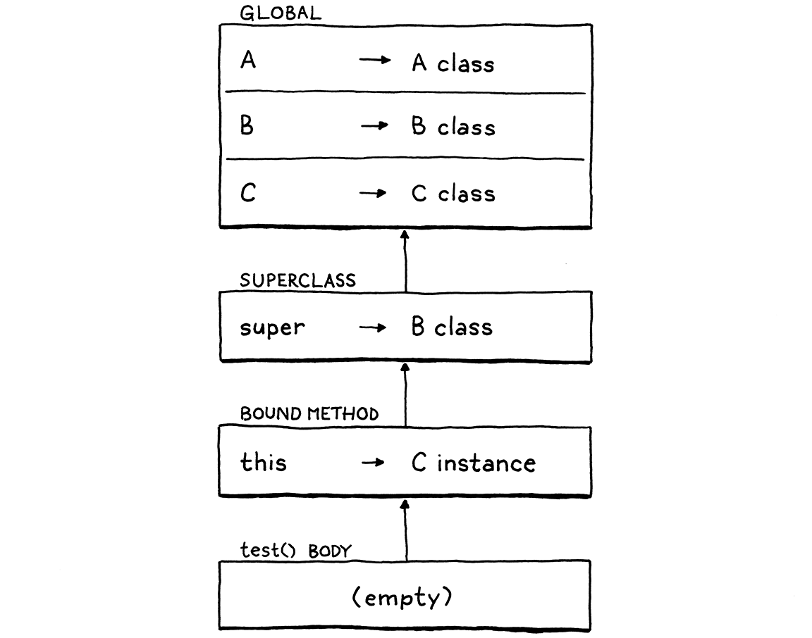

# 13. Inheritance 繼承

> Once we were blobs in the sea, and then fishes, and then lizards and rats and then monkeys, and hundreds of things in between. This hand was once a fin, this hand once had claws! In my human mouth I have the pointy teeth of a wolf and the chisel teeth of a rabbit and the grinding teeth of a cow! Our blood is as salty as the sea we used to live in! When we’re frightened, the hair on our skin stands up, just like it did when we had fur. We are history! Everything we’ve ever been on the way to becoming us, we still are.
>
> ​																																		—— Terry Pratchett, *A Hat Full of Sky*

我們曾經是海里一團一團的東西，然後是魚，然後是蜥蜴、老鼠、猴子，以及介於其間的數百種形態。這隻手曾經是鰭，這隻手曾經是爪子！在我人類的嘴裏，有狼的尖牙，有兔子的鑿齒，還有牛的磨牙！我們的血和我們曾經生活的大海一樣鹹！當我們受到驚嚇時，我們皮膚上的毛髮會豎起來，就像我們有毛時一樣。我們就是歷史！我們在成為我們的路上曾擁有的一切，我們仍然擁有。

> Can you believe it? We’ve reached the last chapter of [Part II](http://craftinginterpreters.com/a-tree-walk-interpreter.html). We’re almost done with our first Lox interpreter. The [previous chapter](http://craftinginterpreters.com/classes.html) was a big ball of intertwined object-orientation features. I couldn’t separate those from each other, but I did manage to untangle one piece. In this chapter, we’ll finish off Lox’s class support by adding inheritance.

你能相信嗎？我們已經到了第二部分的最後一章。我們幾乎已經完成了第一個Lox解釋器。上一章中是一大堆錯綜複雜的面向對象特性。我無法將這些內容完全解開，但是我設法拆出來一塊。在這一章，我們會添加繼承來完成Lox中對類的支持。

> Inheritance appears in object-oriented languages all the way back to the first one, [Simula](https://en.wikipedia.org/wiki/Simula). Early on, Kristen Nygaard and Ole-Johan Dahl noticed commonalities across classes in the simulation programs they wrote. Inheritance gave them a way to reuse the code for those similar parts.

繼承出現在面嚮對象語言中，可以追溯到第一種語言Simula。早些時候，克里斯汀·尼加德(Kristen Nygaard)和奧勒-約翰·達爾(Ole-Johan Dahl)注意到，在他們編寫的模擬程序中，不同類之間存在共性。繼承為他們提供了一種重用相似部分代碼的方法。

> ## 13 . 1 Superclasses and Subclasses

## 13.1 超類和子類

> Given that the concept is “inheritance”, you would hope they would pick a consistent metaphor and call them “parent” and “child” classes, but that would be too easy. Way back when, C. A. R. Hoare coined the term “subclass” to refer to a record type that refines another type. Simula borrowed that term to refer to a *class* that inherits from another. I don’t think it was until Smalltalk came along that someone flipped the Latin prefix to get “superclass” to refer to the other side of the relationship. From C++, you also hear “base” and “derived” classes. I’ll mostly stick with “superclass” and “subclass”.

鑑於這個概念叫“繼承”，你可能希望他們會選擇一個一致的比喻，把類稱為“父”類和“子”類，但這太簡單了。早在很久以前，C. A. R. Hoare就創造了“subclass”這個術語，指的是完善另一種類型的記錄類型。Simula借用了這個術語來指代一個繼承自另一個類的類。我認為直到Smalltalk出現後，才有人將這個詞的拉丁前綴取反義[^1]，用超類（superclass）指代這種關係的另一方。在 C++ 中，你也會聽到"基礎類別"和"衍生類別"。我將主要使用"超類"和"子類"。

> Our first step towards supporting inheritance in Lox is a way to specify a superclass when declaring a class. There’s a lot of variety in syntax for this. C++ and C# place a `:` after the subclass’s name, followed by the superclass name. Java uses `extends` instead of the colon. Python puts the superclass(es) in parentheses after the class name. Simula puts the superclass’s name *before* the `class` keyword.

我們在Lox中支持繼承的第一步是找到聲明類時指定超類的方法。這方面有很多不同的語法。C++和C#在子類的名字後面加一個`:`，然後是超類的名字。Java 使用 `extends` 而不是冒號。Python 則把超類放在類名後面的小括號裏。Simula 把超類的名字放在關鍵字`class`之前。

> This late in the game, I’d rather not add a new reserved word or token to the lexer. We don’t have `extends` or even `:`, so we’ll follow Ruby and use a less-than sign (`<`).

遊戲已經到了後期，我寧願不在詞法分析器中添加新的保留字或標記。我們沒有`extends`或`:`，所以我們遵循Ruby來使用小於號（`<`）。

```java
class Doughnut {
  // General doughnut stuff...
}

class BostonCream < Doughnut {
  // Boston Cream-specific stuff...
}
```

> To work this into the grammar, we add a new optional clause in our existing `classDecl` rule.

為了在語法中實現這一點，我們在目前的`classDecl`規則中加一個新的可選子句。

```
classDecl      → "class" IDENTIFIER ( "<" IDENTIFIER )?
                 "{" function* "}" ;
```

> After the class name, you can have a `<` followed by the superclass’s name. The superclass clause is optional because you don’t *have* to have a superclass. Unlike some other object-oriented languages like Java, Lox has no root “Object” class that everything inherits from, so when you omit the superclass clause, the class has *no* superclass, not even an implicit one.

在類的名稱後面，可以有一個`<`，後跟超類的名稱。超類子句是可選的，因為一個類不一定要有超類。與Java等面向對象的語言不同，Lox沒有所有東西都繼承的一個根“Object”類，所以當你省略超類子句時，該類就沒有超類，甚至連隱含的都沒有。

> We want to capture this new syntax in the class declaration’s AST node.

我們想在類聲明的AST節點中捕捉這個新語法。

*<u>tool/GenerateAst.java，在 main()方法中，替換一行：</u>*

```java
      "Block      : List<Stmt> statements",
      // 替換部分開始
      "Class      : Token name, Expr.Variable superclass, List<Stmt.Function> methods",
      // 替換部分結束            
      "Expression : Expr expression",
```

> You might be surprised that we store the superclass name as an Expr.Variable, not a Token. The grammar restricts the superclass clause to a single identifier, but at runtime, that identifier is evaluated as a variable access. Wrapping the name in an Expr.Variable early on in the parser gives us an object that the resolver can hang the resolution information off of.

你可能會驚訝，我們把超類的名字存為一個Expr.Variable，而不是一個Token。語法將一個超類子句限制為一個標識符，但是在運行時，這個標識符是當作變量訪問來執行的。在解析器早期將名稱封裝在Expr.Variable內部，這樣可以給我們提供一個對象，在分析器中可以將分析信息附加在其中。

> The new parser code follows the grammar directly.

新的解析器代碼直接遵循語法。

*<u>lox/Parser.java，在 classDeclaration()中添加：</u>*

```java
    Token name = consume(IDENTIFIER, "Expect class name.");
    // 新增部分開始
    Expr.Variable superclass = null;
    if (match(LESS)) {
      consume(IDENTIFIER, "Expect superclass name.");
      superclass = new Expr.Variable(previous());
    }
    // 新增部分結束
    consume(LEFT_BRACE, "Expect '{' before class body.");
```

> Once we’ve (possibly) parsed a superclass declaration, we store it in the AST.

一旦我們（可能）解析到一個超類聲明，就將其保存到AST節點中。

*<u>lox/Parser.java，在 classDeclaration()方法中，替換一行：</u>*

```java
    consume(RIGHT_BRACE, "Expect '}' after class body.");
    // 替換部分開始
    return new Stmt.Class(name, superclass, methods);
    // 替換部分結束
  }
```

> If we didn’t parse a superclass clause, the superclass expression will be `null`. We’ll have to make sure the later passes check for that. The first of those is the resolver.

如果我們沒有解析到超類子句，超類表達式將是`null`。我們必須確保後面的操作會對其進行檢查。首先是分析器。

*<u>lox/Resolver.java，在 visitClassStmt()方法中添加：</u>*

```java
    define(stmt.name);
    // 新增部分開始
    if (stmt.superclass != null) {
      resolve(stmt.superclass);
    }
    // 新增部分結束
    beginScope();
```

> The class declaration AST node has a new subexpression, so we traverse into and resolve that. Since classes are usually declared at the top level, the superclass name will most likely be a global variable, so this doesn’t usually do anything useful. However, Lox allows class declarations even inside blocks, so it’s possible the superclass name refers to a local variable. In that case, we need to make sure it’s resolved.

類聲明的AST節點有一個新的子表達式，所以我們要遍歷並分析它。因為類通常是在頂層聲明的，超類的名稱很可能是一個全局變量，所以這一步通常沒有什麼作用。然而，Lox運行在區塊內的類聲明，所以超類名稱有可能指向一個局部變量。在那種情況下，我們需要保證能被它被分析。

> Because even well-intentioned programmers sometimes write weird code, there’s a silly edge case we need to worry about while we’re in here. Take a look at this:

即使是善意的程序員有時也會寫出奇怪的代碼，所以在這裏我們需要考慮一個愚蠢的邊緣情況。看看這個：

```ruby
class Oops < Oops {}
```

> There’s no way this will do anything useful, and if we let the runtime try to run this, it will break the expectation the interpreter has about there not being cycles in the inheritance chain. The safest thing is to detect this case statically and report it as an error.

這種代碼不可能做什麼有用的事情，如果我們嘗試讓運行時去執行它，將會打破解釋器對繼承鏈中沒有循環的期望。最安全的做法是靜態地檢測這種情況，並將其作為一個錯誤報告出來。

*<u>lox/Resolver.java，在 visitClassStmt()方法中添加：</u>*

```java
    define(stmt.name);
    // 新增部分開始
    if (stmt.superclass != null &&
        stmt.name.lexeme.equals(stmt.superclass.name.lexeme)) {
      Lox.error(stmt.superclass.name,
          "A class can't inherit from itself.");
    }
    // 新增部分結束
    if (stmt.superclass != null) {
```

> Assuming the code resolves without error, the AST travels to the interpreter.

如果代碼分析沒有問題，AST節點就會被傳遞到解釋器。

*<u>lox/Interpreter.java，在 visitClassStmt()方法中添加：</u>*

```java
  public Void visitClassStmt(Stmt.Class stmt) {
    // 新增部分開始
    Object superclass = null;
    if (stmt.superclass != null) {
      superclass = evaluate(stmt.superclass);
      if (!(superclass instanceof LoxClass)) {
        throw new RuntimeError(stmt.superclass.name,
            "Superclass must be a class.");
      }
    }
    // 新增部分結束
    environment.define(stmt.name.lexeme, null);
```

> If the class has a superclass expression, we evaluate it. Since that could potentially evaluate to some other kind of object, we have to check at runtime that the thing we want to be the superclass is actually a class. Bad things would happen if we allowed code like:

如果類中有超類表達式，我們就對其求值。因為我們可能會得到其它類型的對象，我們在運行時必須檢查我們希望作為超類的對象是否確實是一個類。如果我們允許下面這樣的代碼，就會發生不好的事情：

```ruby
var NotAClass = "I am totally not a class";

class Subclass < NotAClass {} // ?!
```

> Assuming that check passes, we continue on. Executing a class declaration turns the syntactic representation of a class—its AST node—into its runtime representation, a LoxClass object. We need to plumb the superclass through to that too. We pass the superclass to the constructor.

假設檢查通過，我們繼續。執行類聲明語句會把類的語法表示（AST節點）轉換為其運行時表示（一個LoxClass對象）。我們也需要把超類對象傳入該類對象中。我們將超類傳遞給構造函數。

*<u>lox/Interpreter.java，在 visitClassStmt()方法中替換一行：</u>*

```java
      methods.put(method.name.lexeme, function);
    }
    // 替換部分開始
    LoxClass klass = new LoxClass(stmt.name.lexeme,
        (LoxClass)superclass, methods);
    // 替換部分結束    
    environment.assign(stmt.name, klass);
```

> The constructor stores it in a field.

構造函數將它存儲到一個字段中。

*<u>lox/LoxClass.java， LoxClass()構造函數中，替換一行：</u>*

```java
  // 替換部分開始
  LoxClass(String name, LoxClass superclass,
           Map<String, LoxFunction> methods) {
    this.superclass = superclass;
    // 替換部分結束
    this.name = name;
```

> Which we declare here:

字段我們在這裏聲明：

*<u>lox/LoxClass.java，在 LoxClass類中添加：</u>*

```java
  final String name;
  // 新增部分開始
  final LoxClass superclass;
  // 新增部分結束
  private final Map<String, LoxFunction> methods;
```

> With that, we can define classes that are subclasses of other classes. Now, what does having a superclass actually *do?*

有了這個，我們就可以定義一個類作為其它類的子類。現在，擁有一個超類究竟有什麼用呢？

> ## 13 . 2 Inheriting Methods

## 13.2 繼承方法

> Inheriting from another class means that everything that’s true of the superclass should be true, more or less, of the subclass. In statically typed languages, that carries a lot of implications. The sub*class* must also be a sub*type*, and the memory layout is controlled so that you can pass an instance of a subclass to a function expecting a superclass and it can still access the inherited fields correctly.

繼承自另一個類，意味着對於超類適用的一切，對於子類或多或少也應該適用。在靜態類型的語言中，這包含了很多含義。子類也必須是一個子類型，而且內存佈局是可控的，這樣你就可以把一個子類實例傳遞給一個期望超類的函數，而它仍然可以正確地訪問繼承的字段。

> Lox is a dynamically typed language, so our requirements are much simpler. Basically, it means that if you can call some method on an instance of the superclass, you should be able to call that method when given an instance of the subclass. In other words, methods are inherited from the superclass.

Lox是一種動態類型的語言，所以我們的要求要簡單得多。基本上，這意味着如果你能在超類的實例上調用某些方法，那麼當給你一個子類的實例時，你也應該能調用這個方法。換句話説，方法是從超類繼承的。

> This lines up with one of the goals of inheritance—to give users a way to reuse code across classes. Implementing this in our interpreter is astonishingly easy.

這符合繼承的目標之一——為用户提供一種跨類重用代碼的方式。在我們的解釋器中實現這一點是非常容易的。

*<u>lox/LoxClass.java，在 findMethod()方法中添加：</u>*

```java
      return methods.get(name);
    }
    // 新增部分開始
    if (superclass != null) {
      return superclass.findMethod(name);
    }
    // 新增部分結束
    return null;
```

> That’s literally all there is to it. When we are looking up a method on an instance, if we don’t find it on the instance’s class, we recurse up through the superclass chain and look there. Give it a try:

這就是它的全部內容。當我們在一個實例上查找一個方法時，如果我們在實例的類中找不到它，就沿着超類繼承鏈遞歸查找。試一下這個：

```javascript
class Doughnut {
  cook() {
    print "Fry until golden brown.";
  }
}

class BostonCream < Doughnut {}

BostonCream().cook();
```

> There we go, half of our inheritance features are complete with only three lines of Java code.

好了，一半的繼承特性只用了三行Java代碼就完成了。

> ## 13 . 3 Calling Superclass Methods

## 13.3 調用超類方法

> In `findMethod()` we look for a method on the current class *before* walking up the superclass chain. If a method with the same name exists in both the subclass and the superclass, the subclass one takes precedence or **overrides** the superclass method. Sort of like how variables in inner scopes shadow outer ones.

在`findMethod()`方法中，我們首先在當前類中查找，然後遍歷超類鏈。如果在子類和超類中包含相同的方法，那麼子類中的方法將優先於或**覆蓋**超類的方法。這有點像內部作用域中的變量對外部作用域的遮蔽。

> That’s great i**f the subclass wants to *replace* some superclass behavior completely. But, in practice, subclasses often want to *refine* the superclass’s behavior. They want to do a little work specific to the subclass, but also execute the original superclass behav**ior too.

如果子類想要完全*替換*超類的某些行為，那就正好。但是，在實踐中，子類通常想改進超類的行為。他們想要做一些專門針對子類的操作，但是也想要執行原來超類中的行為。

> However, since the subclass has overridden the method, there’s no way to refer to the original one. If the subclass method tries to call it by name, it will just recursively hit its own override. We need a way to say “Call this method, but look for it directly on my superclass and ignore my override”. Java uses `super` for this, and we’ll use that same syntax in Lox. Here is an example:

然而，由於子類已經重寫了該方法，所有沒有辦法指向原始的方法。如果子類的方法試圖通過名字來調用它，將會遞歸到自身的重寫方法上。我們需要一種方式來表明“調用這個方法，但是要直接在我的超類上尋找，忽略我內部的重寫方法”。Java中使用`super`實現這一點，我們在Lox中使用相同的語法。下面是一個例子：

```javascript
class Doughnut {
  cook() {
    print "Fry until golden brown.";
  }
}

class BostonCream < Doughnut {
  cook() {
    super.cook();
    print "Pipe full of custard and coat with chocolate.";
  }
}

BostonCream().cook();
```

> If you run this, it should print:

如果你運行該代碼，應該打印出：

```
Fry until golden brown.
Pipe full of custard and coat with chocolate.
```

> We have a new expression form. The `super` keyword, followed by a dot and an identifier, looks for a method with that name. Unlike calls on `this`, the search starts at the superclass.

我們有了一個新的表達式形式。`super`關鍵字，後跟一個點和一個標識符，以使用該名稱查找方法。與`this`調用不同，該搜索是從超類開始的。

> ### 13 . 3 . 1 Syntax

### 13.3.1 語法

> With `this`, the keyword works sort of like a magic variable, and the expression is that one lone token. But with `super`, the subsequent `.` and property name are inseparable parts of the `super` expression. You can’t have a bare `super` token all by itself.

在`this`使用中，關鍵字有點像一個魔法變量，而表達式是一個單獨的標記。但是對於`super`，隨後的`.`和屬性名是`super`表達式不可分割的一部分。你不可能只有一個單獨的`super`標記。

```java
print super; // Syntax error.
```

> So the new clause we add to the `primary` rule in our grammar includes the property access as well.

因此，我們在語法中的`primary`規則添加新子句時要包含屬性訪問。

```scala
primary        → "true" | "false" | "nil" | "this"
               | NUMBER | STRING | IDENTIFIER | "(" expression ")"
               | "super" "." IDENTIFIER ;
```

> Typically, a `super` expression is used for a method call, but, as with regular methods, the argument list is *not* part of the expression. Instead, a super *call* is a super *access* followed by a function call. Like other method calls, you can get a handle to a superclass method and invoke it separately.

通常情況下，`super`表達式用於方法調用，但是，與普通方法一樣，參數列表並不是表達式的一部分。相反，`super`調用是一個`super`屬性訪問，然後跟一個函數調用。與其它方法調用一樣，你可以獲得超類方法的句柄，然後單獨運行它。

```javascript
var method = super.cook;
method();
```

> So the `super` expression itself contains only the token for the `super` keyword and the name of the method being looked up. The corresponding syntax tree node is thus:

因此，`super`表達式本身只包含`super`關鍵字和要查找的方法名稱。對應的語法樹節點為：

*<u>tool/GenerateAst.java，在 main()方法中添加：</u>*

```java
      "Set      : Expr object, Token name, Expr value",
      // 新增部分開始
      "Super    : Token keyword, Token method",
      // 新增部分結束
      "This     : Token keyword",
```

> Following the grammar, the new parsing code goes inside our existing `primary()` method.

按照語法，需要在我們現有的`primary`方法中添加新代碼。

*<u>lox/Parser.java，在 primary()方法中添加：</u>*

```java
      return new Expr.Literal(previous().literal);
    }
    // 新增部分開始
    if (match(SUPER)) {
      Token keyword = previous();
      consume(DOT, "Expect '.' after 'super'.");
      Token method = consume(IDENTIFIER,
          "Expect superclass method name.");
      return new Expr.Super(keyword, method);
    }
    // 新增部分結束
    if (match(THIS)) return new Expr.This(previous());
```

> A leading `super` keyword tells us we’ve hit a `super` expression. After that we consume the expected `.` and method name.

開頭的`super`關鍵字告訴我們遇到了一個`super`表達式，之後我們消費預期中的`.`和方法名稱。

> ### 13 . 3 . 2 Semantics

### 13.3.2 語義

> Earlier, I said a `super` expression starts the method lookup from “the superclass”, but *which* superclass? The naïve answer is the superclass of `this`, the object the surrounding method was called on. That coincidentally produces the right behavior in a lot of cases, but that’s not actually correct. Gaze upon:

之前，我説過`super`表達式從“超類”開始查找方法，但是是哪個超類？一個不太成熟的答案是方法被調用時的外圍對象`this`的超類。在很多情況下，這碰巧產生了正確的行為，但實際上這是不正確的。請看：

```javascript
class A {
  method() {
    print "A method";
  }
}

class B < A {
  method() {
    print "B method";
  }

  test() {
    super.method();
  }
}

class C < B {}

C().test();
```

> Translate this program to Java, C#, or C++ and it will print “A method”, which is what we want Lox to do too. When this program runs, inside the body of `test()`, `this` is an instance of C. The superclass of C is B, but that is *not* where the lookup should start. If it did, we would hit B’s `method()`.

將這個程序轉換為Java、c#或c++，它將輸出“A method”，這也是我們希望Lox做的。當這個程序運行時，在`test`方法體中，`this`是C的一個實例，C是超類是B，但這不是查找應該開始的地方。如果是這樣，我們就會命中B的`method()`。

> Instead, lookup should start on the superclass of *the class containing the `super` expression*. In this case, since `test()` is defined inside B, the `super` expression inside it should start the lookup on *B*’s superclass—A.

相反，查找應該從包含`super`表達式的類的超類開始。在這個例子中，由於`test()`是在B中定義的，它內部的`super`表達式應該在B的超類A中開始查找。


> The execution flow looks something like this:

執行流程看起來是這樣的：

1. > We call `test()` on an instance of C.

   我們在C的一個實例上調用`test()`。

2. > That enters the `test()` method inherited from B. That calls `super.method()`.

   這就進入了從B中繼承的`test()`方法，其中又會調用`super.method()`。

3. > The superclass of B is A, so that chains to `method()` on A, and the program prints “A method”.

   B的超類是A，所以鏈接到A中的`method()`，程序會打印出“A method”。

> Thus, in order to evaluate a `super` expression, we need access to the superclass of the class definition surrounding the call. Alack and alas, at the point in the interpreter where we are executing a `super` expression, we don’t have that easily available.

因此，為了對`super`表達式求值，我們需要訪問圍繞方法調用的類的超類。可惜的是，在解釋器中執行`super`表達式的地方，我們並沒有那麼容易獲得。

> We *could* add a field to LoxFunction to store a reference to the LoxClass that owns that method. The interpreter would keep a reference to the currently executing LoxFunction so that we could look it up later when we hit a `super` expression. From there, we’d get the LoxClass of the method, then its superclass.

我們可以從LoxFunction添加一個字段，以存儲指向擁有該方法的LoxClass的引用。解釋器會保存當前正在執行的LoxFunction的引用，這樣稍後在遇到`super`表達式時就可以找到它。從它開始，可以得到方法的LoxClass，然後找到它的超類。

> That’s a lot of plumbing. In the [last chapter](http://craftinginterpreters.com/classes.html), we had a similar problem when we needed to add support for `this`. In that case, we used our existing environment and closure mechanism to store a reference to the current object. Could we do something similar for storing the superclass? Well, I probably wouldn’t be talking about it if the answer was no, so . . . yes.

這需要很多管道。在上一章中，我們添加對`this`的支持時遇到了類似的問題。在那種情況下，我們使用已有的環境和閉包機制保存了指向當前對象的引用。那我們是否可以做類似的事情來存儲超類？嗯，如果答案是否定的，我就不會問這個問題了，所以……是的。

> One important difference is that we bound `this` when the method was *accessed*. The same method can be called on different instances and each needs its own `this`. With `super` expressions, the superclass is a fixed property of the *class declaration itself*. Every time you evaluate some `super` expression, the superclass is always the same.

一個重要的區別是，我們在方法被訪問時綁定了`this`。同一個方法可以在不同的實例上被調用，而且每個實例都需要有自己的`this`。對於`super`表達式，超類是*類聲明本身*的一個固定屬性。每次對某個`super`表達式求值時，超類都是同一個。

> That means we can create the environment for the superclass once, when the class definition is executed. Immediately before we define the methods, we make a new environment to bind the class’s superclass to the name `super`.

這意味着我們可以在執行類定義時，為超類創建一個環境。在定義方法之前，我們創建一個新環境，將類的超類與名稱`super`綁定。


> When we create the LoxFunction runtime representation for each method, that is the environment they will capture in their closure. Later, when a method is invoked and `this` is bound, the superclass environment becomes the parent for the method’s environment, like so:

當我們為每個方法創建LoxFunction運行時表示時，也就是這個方法閉包中獲取的環境。之後，放方法被調用時會綁定`this`，超類環境會成為方法環境的父環境，就像這樣：



> That’s a lot of machinery, but we’ll get through it a step at a time. Before we can get to creating the environment at runtime, we need to handle the corresponding scope chain in the resolver.

這是一個複雜的機制，但是我們會一步一步完成它。在我們可以在運行時創建環境之前，我們需要在分析器中處理對應的作用域。

*<u>lox/Resolver.java，在 visitClassStmt()方法中添加：</u>*

```java
      resolve(stmt.superclass);
    }
    // 新增部分開始
    if (stmt.superclass != null) {
      beginScope();
      scopes.peek().put("super", true);
    }
    // 新增部分結束
    beginScope();
```

> If the class declaration has a superclass, then we create a new scope surrounding all of its methods. In that scope, we define the name “super”. Once we’re done resolving the class’s methods, we discard that scope.

如果該類聲明有超類，那麼我們就在其所有方法的外圍創建一個新的作用域。在這個作用域中，我們會定義名稱`super`。一旦我們完成了對該類中方法的分析，就丟棄這個作用域。

*<u>lox/Resolver.java，在 visitClassStmt()方法中添加：</u>*

```java
    endScope();
    // 新增部分開始
    if (stmt.superclass != null) endScope();
    // 新增部分結束
    currentClass = enclosingClass;
```

> It’s a minor optimization, but we only create the superclass environment if the class actually *has* a superclass. There’s no point creating it when there isn’t a superclass since there’d be no superclass to store in it anyway.

這是一個小優化，但是我們只在類真的有超類時才會創建超類環境。在沒有超類的情況下，創建超類環境是沒有意義的，因為無論如何裏面都不會存儲超類。

> With “super” defined in a scope chain, we are able to resolve the `super` expression itself.

在作用域鏈中定義`super`後，我們就能夠分析`super`表達式了。

*<u>lox/Resolver.java，在 visitSetExpr()方法後添加：</u>*

```java
  @Override
  public Void visitSuperExpr(Expr.Super expr) {
    resolveLocal(expr, expr.keyword);
    return null;
  }
```

> We resolve the `super` token exactly as if it were a variable. The resolution stores the number of hops along the environment chain that the interpreter needs to walk to find the environment where the superclass is stored.

我們把`super`標記當作一個變量進行分析。分析結果保存瞭解釋器要在環境鏈上找到超類所在的環境需要的跳數。

> This code is mirrored in the interpreter. When we evaluate a subclass definition, we create a new environment.

這段代碼在解釋器中也有對應。當我們執行子類定義時，創建一個新環境。

*<u>lox/Interpreter.java，在 visitClassStmt()方法中添加：</u>*

```java
        throw new RuntimeError(stmt.superclass.name,
            "Superclass must be a class.");
      }
    }

    environment.define(stmt.name.lexeme, null);
    // 新增部分開始
    if (stmt.superclass != null) {
      environment = new Environment(environment);
      environment.define("super", superclass);
    }
    // 新增部分結束
    Map<String, LoxFunction> methods = new HashMap<>();
```

> Inside that environment, we store a reference to the superclass—the actual LoxClass object for the superclass which we have now that we are in the runtime. Then we create the LoxFunctions for each method. Those will capture the current environment—the one where we just bound “super”—as their closure, holding on to the superclass like we need. Once that’s done, we pop the environment.

在這個環境中，我們保存指向超類的引用——即我們在運行時現在擁有的超類的實際LoxClass對象。然後我們為每個方法創建LoxFunction。這些函數將捕獲當前環境（也就是我們剛剛綁定“super”的那個）作為其閉包，像我們需要的那樣維繫着超類。一旦這些完成，我們就彈出環境。

*<u>lox/Interpreter.java，在 visitClassStmt()方法中添加：</u>*

```java
    LoxClass klass = new LoxClass(stmt.name.lexeme,
        (LoxClass)superclass, methods);
    // 新增部分開始    
    if (superclass != null) {
      environment = environment.enclosing;
    }
    // 新增部分結束
    environment.assign(stmt.name, klass);
```

> We’re ready to interpret `super` expressions themselves. There are a few moving parts, so we’ll build this method up in pieces.

我們現在已經準備好解釋`super`表達式了。這會分為很多部分，所以我們逐步構建這個方法。

*<u>lox/Interpreter.java，在 visitSetExpr()方法後添加：</u>*

```java
  @Override
  public Object visitSuperExpr(Expr.Super expr) {
    int distance = locals.get(expr);
    LoxClass superclass = (LoxClass)environment.getAt(
        distance, "super");
  }
```

> First, the work we’ve been leading up to. We look up the surrounding class’s superclass by looking up “super” in the proper environment.

首先，我們要做之前鋪墊的工作。我們通過在適當環境中查找“super”來找到外圍類的超類。

> When we access a method, we also need to bind `this` to the object the method is accessed from. In an expression like `doughnut.cook`, the object is whatever we get from evaluating `doughnut`. In a `super` expression like `super.cook`, the current object is implicitly the *same* current object that we’re using. In other words, `this`. Even though we are looking up the *method* on the superclass, the *instance* is still `this`.

當我們訪問方法時，還需要將`this`與訪問該方法的對象進行綁定。在像`doughnut.cook`這樣的表達式中，對象是我們通過對`doughnut`求值得到的內容。在像`super.cook`這樣的`super`表達式中，當前對象隱式地與我們正使用的當前對象相同。換句話説，就是`this`。即使我們在超類中查找方法，*實例*仍然是`this`。

> Unfortunately, inside the `super` expression, we don’t have a convenient node for the resolver to hang the number of hops to `this` on. Fortunately, we do control the layout of the environment chains. The environment where “this” is bound is always right inside the environment where we store “super”.

不幸的是，在`super`表達式中，我們沒有一個方便的節點可以讓分析器將`this`對應的跳數保存起來。幸運的是，我們可以控制環境鏈的佈局。綁定`this`的環境總是存儲在保存`super`的環境中。

*<u>lox/Interpreter.java，在 visitSuperExpr()方法中添加：</u>*

```java
    LoxClass superclass = (LoxClass)environment.getAt(
        distance, "super");
    // 新增部分開始
    LoxInstance object = (LoxInstance)environment.getAt(
        distance - 1, "this");
    // 新增部分結束
  }
```

> Offsetting the distance by one looks up “this” in that inner environment. I admit this isn’t the most elegant code, but it works.

將距離偏移1，在那個內部環境中查找“this”。我承認這個代碼不是最優雅的，但是它是有效的。

> Now we’re ready to look up and bind the method, starting at the superclass.

現在我們準備查找並綁定方法，從超類開始。

*<u>lox/Interpreter.java，在 visitSuperExpr()方法中添加：</u>*

```java
    LoxInstance object = (LoxInstance)environment.getAt(
        distance - 1, "this");
    // 新增部分開始    
    LoxFunction method = superclass.findMethod(expr.method.lexeme);
    return method.bind(object);
    // 新增部分結束
  }
```

> This is almost exactly like the code for looking up a method of a get expression, except that we call `findMethod()` on the superclass instead of on the class of the current object.

這幾乎與查找get表達式方法的代碼完全一樣，區別在於，我們是在超類上調用`findMethod()` ，而不是在當前對象的類。

> That’s basically it. Except, of course, that we might *fail* to find the method. So we check for that too.

基本上就是這樣了。當然，除了我們可能找不到方法之外。所以，我們要對其檢查。

*<u>lox/Interpreter.java，在 visitSuperExpr()方法中添加：</u>*

```java
    LoxFunction method = superclass.findMethod(expr.method.lexeme);
    // 新增部分開始
    if (method == null) {
      throw new RuntimeError(expr.method,
          "Undefined property '" + expr.method.lexeme + "'.");
    }
    // 新增部分結束
    return method.bind(object);
  }
```

> There you have it! Take that BostonCream example earlier and give it a try. Assuming you and I did everything right, it should fry it first, then stuff it with cream.

這就對了！試着運行一下前面那個BostonCream的例子。如果你我都做對了，它的結果應該是：

```
Fry until golden brown.
Pipe full of custard and coat with chocolate.
```

> ### 13 . 3 . 3 Invalid uses of super

### 13.3.3 super的無效使用

> As with previous language features, our implementation does the right thing when the user writes correct code, but we haven’t bulletproofed the intepreter against bad code. In particular, consider:

像以前的語言特性一樣，當用户寫出正確的代碼時，我們的語言實現也會做成正確的事情，但我們還沒有在解釋器中對錯誤代碼進行防禦。具體來説，考慮以下代碼：

```java
class Eclair {
  cook() {
    super.cook();
    print "Pipe full of crème pâtissière.";
  }
}
```

> This class has a `super` expression, but no superclass. At runtime, the code for evaluating `super` expressions assumes that “super” was successfully resolved and will be found in the environment. That’s going to fail here because there is no surrounding environment for the superclass since there is no superclass. The JVM will throw an exception and bring our interpreter to its knees.

這個類中有一個`super`表達式，但是沒有超類。在運行時，計算`super`表達式的代碼假定`super`已經被成功分析，並且可以在環境中找到超類。但是在這裏會失敗，因為沒有超類，也就沒有超類對應的外圍環境。JVM會拋出一個異常，我們的解釋器也會因此崩潰。

> Heck, there are even simpler broken uses of super:

見鬼，還有更簡單的`super`錯誤用法：

```java
super.notEvenInAClass();
```

> We could handle errors like these at runtime by checking to see if the lookup of “super” succeeded. But we can tell statically—just by looking at the source code—that Eclair has no superclass and thus no `super` expression will work inside it. Likewise, in the second example, we know that the `super` expression is not even inside a method body.

我們可以在運行時通過檢查“super”是否查找成功而處理此類錯誤。但是我們可以只通過查看源代碼靜態地知道，Eclair沒有超類，因此也就沒有`super`表達式可以在其中生效。同樣的，在第二個例子中，我們知道`super`表達式甚至不在方法體內。

> Even though Lox is dynamically typed, that doesn’t mean we want to defer *everything* to runtime. If the user made a mistake, we’d like to help them find it sooner rather than later. So we’ll report these errors statically, in the resolver.

儘管Lox是動態類型的，但這並不意味着我們要將一切都推遲到運行時。如果用户犯了錯誤，我們希望能幫助他們儘早發現，所以我們會在分析器中靜態地報告這些錯誤。

> First, we add a new case to the enum we use to keep track of what kind of class is surrounding the current code being visited.

首先，在我們用來追蹤當前訪問代碼外圍類的類型的枚舉中添加一個新值。

*<u>lox/Resolver.java，在 ClassType枚舉中添加代碼，首先在上一行後面加“,”：</u>*

```java
    NONE,
    CLASS,
    // 新增部分開始
    SUBCLASS
    // 新增部分結束
  }
```

> We’ll use that to distinguish when we’re inside a class that has a superclass versus one that doesn’t. When we resolve a class declaration, we set that if the class is a subclass.

我們將用它來區分我們是否在一個有超類的類中。當我們分析一個類的聲明時，如果該類是一個子類，我們就設置該值。

*<u>lox/Resolver.java，在 visitClassStmt()方法中添加：</u>*

```java
    if (stmt.superclass != null) {
      // 新增部分開始
      currentClass = ClassType.SUBCLASS;
      // 新增部分結束
      resolve(stmt.superclass);
```

> Then, when we resolve a `super` expression, we check to see that we are currently inside a scope where that’s allowed.

然後，當我們分析`super`表達式時，會檢查當前是否在一個允許使用`super`表達式的作用域中。

*<u>lox/Resolver.java，在 visitSuperExpr()方法中添加：</u>*

```java
  public Void visitSuperExpr(Expr.Super expr) {
    // 新增部分開始
    if (currentClass == ClassType.NONE) {
      Lox.error(expr.keyword,
          "Can't use 'super' outside of a class.");
    } else if (currentClass != ClassType.SUBCLASS) {
      Lox.error(expr.keyword,
          "Can't use 'super' in a class with no superclass.");
    }
    // 新增部分結束
    resolveLocal(expr, expr.keyword);
```

> If not—oopsie!—the user made a mistake.

如果不是，那就是用户出錯了。

> ## 13 . 4 Conclusion

## 13.4 總結

> We made it! That final bit of error handling is the last chunk of code needed to complete our Java implementation of Lox. This is a real accomplishment and one you should be proud of. In the past dozen chapters and a thousand or so lines of code, we have learned and implemented . . . 

我們成功了！最後的錯誤處理是完成Lox語言的Java實現所需的最後一塊代碼。這是一項真正的成就，你應該為此感到自豪。在過去的十幾章和一千多行代碼中，我們已經學習並實現了：

- [tokens and lexing](http://craftinginterpreters.com/scanning.html),  標記與詞法
- [abstract syntax trees](http://craftinginterpreters.com/representing-code.html),  抽象語法樹
- [recursive descent parsing](http://craftinginterpreters.com/parsing-expressions.html),  遞歸下降分析
- prefix and infix expressions,  前綴、中綴表達式
- runtime representation of objects,  對象的運行時表示
- [interpreting code using the Visitor pattern](http://craftinginterpreters.com/evaluating-expressions.html), 使用Visitor模式解釋代碼
- [lexical scope](http://craftinginterpreters.com/statements-and-state.html),  詞法作用域
- environment chains for storing variables,  保存變量的環境鏈
- [control flow](http://craftinginterpreters.com/control-flow.html), 控制流
- [functions with parameters](http://craftinginterpreters.com/functions.html), 有參函數
- closures, 閉包
- [static variable resolution and error detection](http://craftinginterpreters.com/resolving-and-binding.html), 靜態變量分析與錯誤檢查
- [classes](http://craftinginterpreters.com/classes.html), 類
- constructors, 構造函數
- fields, 字段
- methods, and finally,  方法
- inheritance.  繼承


> We did all of that from scratch, with no external dependencies or magic tools. Just you and I, our respective text editors, a couple of collection classes in the Java standard library, and the JVM runtime.

所有這些都是我們從頭開始做的，沒有藉助外部依賴和神奇工具。只有你和我，我們的文本編輯器，Java標準庫中的幾個集合類，以及JVM運行時。

> This marks the end of Part II, but not the end of the book. Take a break. Maybe write a few fun Lox programs and run them in your interpreter. (You may want to add a few more native methods for things like reading user input.) When you’re refreshed and ready, we’ll embark on our [next adventure](http://craftinginterpreters.com/a-bytecode-virtual-machine.html).

這標誌着第二部分的結束，但不是這本書的結束。休息一下，也許可以編寫幾個Lox程序在你的解釋器中運行一下（你可能需要添加一些本地方法來支持讀取用户的輸入等操作）。當你重新振作之後，我們將開始下一次冒險。


[^1]: “Super-”和“sub-”在拉丁語中表示“上面”和“下面”。把繼承樹想象成一個根在頂部的家族樹——在這個圖上，子類就在超類的下面。更一般地説，“sub-”指的是細化或被更一般的概念所包含的事物。在動物學中，子類指的是對更大的生物類的一個精細分類。在集合論中，子集被一個更大的超集包含，該超集中包含子集的所有元素，可能還有更多元素。集合論和編程語言在類型論中相遇，就產生了“超類型”和“子類型”。在靜態類型的面嚮對象語言中，一個子類通常也是其超類的一個子類型。

------

> ## CHALLENGES

## 習題

1. > Lox supports only *single inheritance*—a class may have a single superclass and that’s the only way to reuse methods across classes. Other languages have explored a variety of ways to more freely reuse and share capabilities across classes: mixins, traits, multiple inheritance, virtual inheritance, extension methods, etc.

   > If you were to add some feature along these lines to Lox, which would you pick and why? If you’re feeling courageous (and you should be at this point), go ahead and add it.

   Lox只支持*單繼承*——一個類可以有一個超類，這是唯一跨類複用方法的方式。其它語言中已經探索出了各種方法來更自由地跨類重用和共享功能：mixins, traits, multiple inheritance, virtual inheritance, extension methods, 等等。

   如果你要在Lox中添加一些類似的功能，你會選擇哪種，為什麼？如果你有勇氣的話（這時候你應該有勇氣了），那就去添加它。

2. > In Lox, as in most other object-oriented languages, when looking up a method, we start at the bottom of the class hierarchy and work our way up—a subclass’s method is preferred over a superclass’s. In order to get to the superclass method from within an overriding method, you use `super`.

   在Lox中，與其它大多數面嚮對象語言一樣，當查找一個方法時，我們從類的底層開始向上查找——子類的方法優先於超類的方法。為了在覆蓋方法中訪問超類方法，你可以使用`super`。

   > The language [BETA](https://beta.cs.au.dk/) takes the [opposite approach](http://journal.stuffwithstuff.com/2012/12/19/the-impoliteness-of-overriding-methods/). When you call a method, it starts at the *top* of the class hierarchy and works *down*. A superclass method wins over a subclass method. In order to get to the subclass method, the superclass method can call `inner`, which is sort of like the inverse of `super`. It chains to the next method down the hierarchy.

   [BEAT](https://beta.cs.au.dk/)語言採用了[相反的方法](http://journal.stuffwithstuff.com/2012/12/19/the-impoliteness-of-overriding-methods/)。當你調用一個方法時，它從類繼承結構的頂層開始向下尋找。超類方法的優先級高於子類方法。為了訪問子類的方法，超類方法可以調用`inner`，這有點像是`super`的反義詞。它與繼承層次結構中的下一級方法相連接。

   > The superclass method controls when and where the subclass is allowed to refine its behavior. If the superclass method doesn’t call `inner` at all, then the subclass has no way of overriding or modifying the superclass’s behavior.

   超類方法控制着子類何時何地可以改進其行為。如果超類方法根本沒有調用`inner`，那麼子類就無法覆蓋或修改超類的行為。

   > Take out Lox’s current overriding and `super` behavior and replace it with BETA’s semantics. In short:

   去掉Lox目前的覆蓋和`super`行為，用BEAT的語義來替換。簡而言之：

   - > When calling a method on a class, prefer the method *highest* on the class’s inheritance chain.

     當調用類上的方法時，優先選擇類繼承鏈中最高的方法。

   - > Inside the body of a method, a call to `inner` looks for a method with the same name in the nearest subclass along the inheritance chain between the class containing the `inner` and the class of `this`. If there is no matching method, the `inner` call does nothing.

     在方法體內部，`inner`調用會在繼承鏈中包含`inner`的類和包含`this`的類之間，查找具有相同名稱的最近的子類中的方法。如果沒有匹配的方法，`inner`調用不做任何事情。

   

   > For example:

   舉例來説：

   ```java
   class Doughnut {
     cook() {
       print "Fry until golden brown.";
       inner();
       print "Place in a nice box.";
     }
   }
   
   class BostonCream < Doughnut {
     cook() {
       print "Pipe full of custard and coat with chocolate.";
     }
   }
   
   BostonCream().cook();
   ```

   > This should print:

   這應該輸出：

   ```
   Fry until golden brown.
   Pipe full of custard and coat with chocolate.
   Place in a nice box.
   ```

3. > In the chapter where I introduced Lox, [I challenged you](http://craftinginterpreters.com/the-lox-language.html#challenges) to come up with a couple of features you think the language is missing. Now that you know how to build an interpreter, implement one of those features.

   在介紹Lox的那一章，我讓你想出幾個你認為該語言缺少的功能。現在你知道了如何構建一個解釋器，請實現其中的一個功能。

