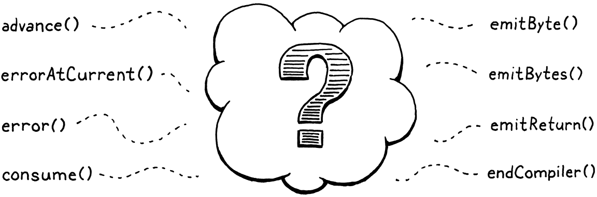
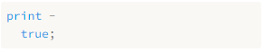

# 17. Compiling Expressions 編譯表達式

> In the middle of the journey of our life I found myself within a dark woods where the straight way was lost.
>
> ​																	—— Dante Alighieri, *Inferno*

方吾生之半路，恍餘處乎幽林，失正軌而迷誤。（但丁，《地獄》）

【譯者注：這裏引用的是大名鼎鼎的《神曲》，所以我也直接引用了錢稻孫先生的譯文】

> This chapter is exciting for not one, not two, but *three* reasons. First, it provides the final segment of our VM’s execution pipeline. Once in place, we can plumb the user’s source code from scanning all the way through to executing it.

這一章令人激動，原因不止一個，也不止兩個，而是三個。首先，它補齊了虛擬機執行管道的最後一段。一旦到位，我們就可以處理用户的源代碼，從掃描一直到執行。


> Second, we get to write an actual, honest-to-God *compiler*. It parses source code and outputs a low-level series of binary instructions. Sure, it’s bytecode and not some chip’s native instruction set, but it’s way closer to the metal than jlox was. We’re about to be real language hackers.

第二，我們要編寫一個真正的*編譯器*。它會解析源代碼並輸出低級的二進制指令序列。當然，它是字節碼，而不是某個芯片的原生指令集，但它比jlox更接近於硬件。我們即將成為真正的語言黑客了。

> Third and finally, I get to show you one of my absolute favorite algorithms: Vaughan Pratt’s “top-down operator precedence parsing”. It’s the most elegant way I know to parse expressions. It gracefully handles prefix operators, postfix, infix, *mixfix*, any kind of *-fix* you got. It deals with precedence and associativity without breaking a sweat. I love it.

第三，也是最後一個，我可以向你們展示我們最喜歡的算法之一：Vaughan Pratt的“自頂向下算符優先解析”。這是我所知道的解析表達的最優雅的方法。它可以優雅地處理前綴、後綴、中綴、多元運算符，以及任何類型的運算符。它能處理優先級和結合性，而且毫不費力。我喜歡它。

> As usual, before we get to the fun stuff, we’ve got some preliminaries to work through. You have to eat your vegetables before you get dessert. First, let’s ditch that temporary scaffolding we wrote for testing the scanner and replace it with something more useful.

與往常一樣，在我們開始真正有趣的工作之前，還有一些準備工作需要做。在得到甜點之前，你得先吃點蔬菜。首先，讓我們拋棄我們為測試掃描器而編寫的臨時腳手架，用更有效的東西來替換它。

*<u>vm.c，在interpret() 方法中替換2行：</u>*

```c
InterpretResult interpret(const char* source) {
  // 替換部分開始
  Chunk chunk;
  initChunk(&chunk);

  if (!compile(source, &chunk)) {
    freeChunk(&chunk);
    return INTERPRET_COMPILE_ERROR;
  }

  vm.chunk = &chunk;
  vm.ip = vm.chunk->code;

  InterpretResult result = run();

  freeChunk(&chunk);
  return result;
  // 替換部分結束
}
```

> We create a new empty chunk and pass it over to the compiler. The compiler will take the user’s program and fill up the chunk with bytecode. At least, that’s what it will do if the program doesn’t have any compile errors. If it does encounter an error, `compile()` returns `false` and we discard the unusable chunk.

我們創建一個新的空字節碼塊，並將其傳遞給編譯器。編譯器會獲取用户的程序，並將字節碼填充到該塊中。至少在程序沒有任何編譯錯誤的情況下，它就會這麼做。如果遇到錯誤，`compile()`方法會返回`false`，我們就會丟棄不可用的字節碼塊。

> Otherwise, we send the completed chunk over to the VM to be executed. When the VM finishes, we free the chunk and we’re done. As you can see, the signature to `compile()` is different now.

否則，我們將完整的字節碼塊發送到虛擬機中去執行。當虛擬機完成後，我們會釋放該字節碼塊，這樣就完成了。如你所見，現在`compile()`的簽名已經不同了。

<u>*compiler.h，替換一行代碼：*</u>

```c
#define clox_compiler_h
// 替換部分開始
#include "vm.h"

bool compile(const char* source, Chunk* chunk);
// 替換部分結束
#endif
```

> We pass in the chunk where the compiler will write the code, and then `compile()` returns whether or not compilation succeeded. We make the same change to the signature in the implementation.

我們將字節碼塊傳入，而編譯器會向其中寫入代碼，如何`compile()`返回編譯是否成功。我們在實現方法中對簽名進行相同的修改。

*<u>compiler.c，在compile()方法中替換1行：</u>*

```c
#include "scanner.h"
// 替換部分開始
bool compile(const char* source, Chunk* chunk) {
// 替換部分結束
  initScanner(source);
```

> That call to `initScanner()` is the only line that survives this chapter. Rip out the temporary code we wrote to test the scanner and replace it with these three lines:

對`initScanner()`的調用是本章中唯一保留下來的代碼行。刪除我們為測試掃描器而編寫的臨時代碼，將其替換為以下三行：

*<u>compiler.c，在compile()方法中替換13行：</u>*

```c
  initScanner(source);
  // 替換部分開始
  advance();
  expression();
  consume(TOKEN_EOF, "Expect end of expression.");
  // 替換部分結束
}
```

> The call to `advance()` “primes the pump” on the scanner. We’ll see what it does soon. Then we parse a single expression. We aren’t going to do statements yet, so that’s the only subset of the grammar we support. We’ll revisit this when we [add statements in a few chapters](http://www.craftinginterpreters.com/global-variables.html). After we compile the expression, we should be at the end of the source code, so we check for the sentinel EOF token.

對`advance()`的調用會在掃描器上“啓動泵”。我們很快會看到它的作用。然後我們解析一個表達式。我們還不打算處理語句，所以表達式是我們支持的唯一的語法子集。等到我們在後面的章節中添加語句時，會重新審視這個問題。在編譯表達式之後，我們應該處於源代碼的末尾，所以我們要檢查EOF標識。

> We’re going to spend the rest of the chapter making this function work, especially that little `expression()` call. Normally, we’d dive right into that function definition and work our way through the implementation from top to bottom.

我們將用本章的剩餘時間讓這個函數工作起來。尤其是那個小小的`expression()`調用。通常情況下，我們會直接進入函數定義，並從上到下地進行實現。

> This chapter is different. Pratt’s parsing technique is remarkably simple once you have it all loaded in your head, but it’s a little tricky to break into bite-sized pieces. It’s recursive, of course, which is part of the problem. But it also relies on a big table of data. As we build up the algorithm, that table grows additional columns.

這一章則不同。Pratt的解析技術，你一旦理解了就非常簡單，但是要把它分解成小塊就比較麻煩了[^1]。當然，它是遞歸的，這也是問題的一部分。但它也依賴於一個很大的數據表。等我們構建算法時，這個表格會增加更多的列。

> I don’t want to revisit 40-something lines of code each time we extend the table. So we’re going to work our way into the core of the parser from the outside and cover all of the surrounding bits before we get to the juicy center. This will require a little more patience and mental scratch space than most chapters, but it’s the best I could do.

我不想在每次擴展表時都要重新查看40多行代碼。因此，我們要從外部進入解析器的核心，並在進入有趣的中心之前覆蓋其外圍的所有部分。與大多數章節相比，這將需要更多的耐心和思考空間，但這是我能做到的最好的了。

> ## 17 . 1 Single-Pass Compilation

## 17.1 單遍編譯

> A compiler has roughly two jobs. It parses the user’s source code to understand what it means. Then it takes that knowledge and outputs low-level instructions that produce the same semantics. Many languages split those two roles into two separate passes in the implementation. A parser produces an AST—just like jlox does—and then a code generator traverses the AST and outputs target code.

一個編譯器大約有兩項工作[^2]。它會解析用户的源代碼以理解其含義。然後，它利用這些知識並輸出產生相同語義的低級指令。許多語言在實現中將這兩個角色分成兩遍獨立的執行部分。一個解析器生成AST——就像jlox那樣——還有一個代碼生成器遍歷AST並輸出目標代碼。

> In clox, we’re taking an old-school approach and merging these two passes into one. Back in the day, language hackers did this because computers literally didn’t have enough memory to store an entire source file’s AST. We’re doing it because it keeps our compiler simpler, which is a real asset when programming in C.

在clox中，我們採用了一種老派的方法，將這兩遍處理合而為一。在過去，語言黑客們這樣做是因為計算機沒有足夠的內存來存儲整個源文件的AST。我們這樣做是因為它使我們的編譯器更簡單，這是用C語言編程時的真正優勢。

> Single-pass compilers like we’re going to build don’t work well for all languages. Since the compiler has only a peephole view into the user’s program while generating code, the language must be designed such that you don’t need much surrounding context to understand a piece of syntax. Fortunately, tiny, dynamically typed Lox is well-suited to that.

像我們要構建的單遍編譯器並不是對所有語言都有效。因為編譯器在生產代碼時只能“管窺”用户的程序，所以語言必須設計成不需要太多外圍的上下文環境就能理解一段語法。幸運的是，微小的、動態類型的Lox非常適合這種情況。

> What this means in practical terms is that our “compiler” C module has functionality you’ll recognize from jlox for parsing—consuming tokens, matching expected token types, etc. And it also has functions for code gen—emitting bytecode and adding constants to the destination chunk. (And it means I’ll use “parsing” and “compiling” interchangeably throughout this and later chapters.)

在實踐中，這意味着我們的“編譯器”C模塊具有你在jlox中認識到的解析功能——消費標識，匹配期望的標識類型，等等。而且它還具有代碼生成的功能——生成字節碼和向目標塊中添加常量。（這也意味着我會在本章和後面的章節中交替使用“解析”和“編譯”。）

> We’ll build the parsing and code generation halves first. Then we’ll stitch them together with the code in the middle that uses Pratt’s technique to parse Lox’s particular grammar and output the right bytecode.

我們首先分別構建解析和代碼生成兩個部分。然後，我們會用中間代碼將它們縫合在一起，該代碼使用Pratt的技術來解析Lox 的語法並輸出正確的字節碼。

> ## 17 . 2 Parsing Tokens

## 17.2 解析標識

> First up, the front half of the compiler. This function’s name should sound familiar.

首先是編譯器的前半部分。這個函數的名字聽起來應該很熟悉。
*<u>compiler.c，添加代碼：</u>*

```c
#include "scanner.h"
// 新增部分開始
static void advance() {
  parser.previous = parser.current;

  for (;;) {
    parser.current = scanToken();
    if (parser.current.type != TOKEN_ERROR) break;

    errorAtCurrent(parser.current.start);
  }
}
// 新增部分結束
```

> Just like in jlox, it steps forward through the token stream. It asks the scanner for the next token and stores it for later use. Before doing that, it takes the old `current` token and stashes that in a `previous` field. That will come in handy later so that we can get at the lexeme after we match a token.

就像在jlox中一樣，該函數向前通過標識流。它會向掃描器請求下一個詞法標識，並將其存儲起來以供後面使用。在此之前，它會獲取舊的`current`標識，並將其存儲在`previous`字段中。這在以後會派上用場，讓我們可以在匹配到標識之後獲得詞素。

> The code to read the next token is wrapped in a loop. Remember, clox’s scanner doesn’t report lexical errors. Instead, it creates special *error tokens* and leaves it up to the parser to report them. We do that here.

讀取下一個標識的代碼被包在一個循環中。記住，clox的掃描器不會報告詞法錯誤。相反地，它創建了一個特殊的*錯誤標識*，讓解析器來報告這些錯誤。我們這裏就是這樣做的。

> We keep looping, reading tokens and reporting the errors, until we hit a non-error one or reach the end. That way, the rest of the parser sees only valid tokens. The current and previous token are stored in this struct:

我們不斷地循環，讀取標識並報告錯誤，直到遇到一個沒有錯誤的標識或者到達標識流終點。這樣一來，解析器的其它部分只能看到有效的標記。當前和之前的標記被存儲在下面的結構體中：

*<u>compiler.c，新增代碼：</u>*

```c
#include "scanner.h"
// 新增部分開始
typedef struct {
  Token current;
  Token previous;
} Parser;

Parser parser;
// 新增部分結束
static void advance() {
```

> Like we did in other modules, we have a single global variable of this struct type so we don’t need to pass the state around from function to function in the compiler.

就像我們在其它模塊中所做的那樣，我們維護一個這種結構體類型的單一全局變量，所以我們不需要在編譯器中將狀態從一個函數傳遞到另一個函數。

> ### 17 . 2 . 1 Handling syntax errors

### 17.2.1 處理語法錯誤

> If the scanner hands us an error token, we need to actually tell the user. That happens using this:

如果掃描器交給我們一個錯誤標識，我們必須明確地告訴用户。這就需要使用下面的語句：

*<u>compiler.c，在變量parser後添加代碼：</u>*

```c
static void errorAtCurrent(const char* message) {
  errorAt(&parser.current, message);
}
```

> We pull the location out of the current token in order to tell the user where the error occurred and forward it to `errorAt()`. More often, we’ll report an error at the location of the token we just consumed, so we give the shorter name to this other function:

我們從當前標識中提取位置信息，以便告訴用户錯誤發生在哪裏，並將其轉發給`errorAt()`。更常見的情況是，我們會在剛剛消費的令牌的位置報告一個錯誤，所以我們給另一個函數取了一個更短的名字：

*<u>compiler.c，在變量parser後添加代碼：</u>*

```c
static void error(const char* message) {
  errorAt(&parser.previous, message);
}
```

> The actual work happens here:

實際的工作發生在這裏：

*<u>compiler.c，在變量parser後添加代碼：</u>*

```c
static void errorAt(Token* token, const char* message) {
  fprintf(stderr, "[line %d] Error", token->line);

  if (token->type == TOKEN_EOF) {
    fprintf(stderr, " at end");
  } else if (token->type == TOKEN_ERROR) {
    // Nothing.
  } else {
    fprintf(stderr, " at '%.*s'", token->length, token->start);
  }

  fprintf(stderr, ": %s\n", message);
  parser.hadError = true;
}
```

> First, we print where the error occurred. We try to show the lexeme if it’s human-readable. Then we print the error message itself. After that, we set this `hadError` flag. That records whether any errors occurred during compilation. This field also lives in the parser struct.

首先，我們打印出錯誤發生的位置。如果詞素是人類可讀的，我們就儘量顯示詞素。然後我們打印錯誤信息。之後，我們設置這個`hadError`標誌。該標誌記錄了編譯過程中是否有任何錯誤發生。這個字段也存在於解析器結構體中。

*<u>compiler.c，在結構體Parser中添加代碼：</u>*

```c
  Token previous;
  // 新增部分開始
  bool hadError;
  // 新增部分結束
} Parser;
```

> Earlier I said that `compile()` should return `false` if an error occurred. Now we can make it do that.

前面我説過，如果發生錯誤，`compile()`應該返回`false`。現在我們可以這樣做：

*<u>compiler.c，在compile()函數中添加代碼：</u>*

```c
  consume(TOKEN_EOF, "Expect end of expression.");
  // 新增部分開始
  return !parser.hadError;
  // 新增部分結束
}
```

> I’ve got another flag to introduce for error handling. We want to avoid error cascades. If the user has a mistake in their code and the parser gets confused about where it is in the grammar, we don’t want it to spew out a whole pile of meaningless knock-on errors after the first one.

我還要引入另一個用於錯誤處理的標誌。我們想要避免錯誤的級聯效應。如果用户在他們的代碼中犯了一個錯誤，而解析器又不理解它在語法中的含義，我們不希望解析器在第一個錯誤之後，又拋出一大堆無意義的連帶錯誤。

> We fixed that in jlox using panic mode error recovery. In the Java interpreter, we threw an exception to unwind out of all of the parser code to a point where we could skip tokens and resynchronize. We don’t have exceptions in C. Instead, we’ll do a little smoke and mirrors. We add a flag to track whether we’re currently in panic mode.

我們在jlox中使用緊急模式錯誤恢復來解決這個問題。在Java解釋器中，我們拋出一個異常，跳出解析器代碼直到可以跳過標識並重新同步。我們在C語言中沒有異常[^3]。相反，我們會做一些欺騙性行為。我們添加一個標誌來跟蹤當前是否在緊急模式中。

*<u>compiler.c，在結構體Parser中添加代碼：</u>*

```c
  bool hadError;
  // 新增部分開始
  bool panicMode;
  // 新增部分結束
} Parser;
```

> When an error occurs, we set it.

當出現錯誤時，我們為其賦值。

*<u>compiler.c，在errorAt()方法中添加代碼：</u>*

```c
static void errorAt(Token* token, const char* message) {
  // 新增部分開始
  parser.panicMode = true;
  // 新增部分結束
  fprintf(stderr, "[line %d] Error", token->line);
```

> After that, we go ahead and keep compiling as normal as if the error never occurred. The bytecode will never get executed, so it’s harmless to keep on trucking. The trick is that while the panic mode flag is set, we simply suppress any other errors that get detected.

之後，我們繼續進行編譯，就像錯誤從未發生過一樣。字節碼永遠不會被執行，所以繼續運行也是無害的。訣竅在於，雖然設置了緊急模式標誌，但我們只是簡單地屏蔽了檢測到的其它錯誤。

*<u>compiler.c，在errorAt()方法中添加代碼：</u>*

```c
static void errorAt(Token* token, const char* message) {
  // 新增部分開始
  if (parser.panicMode) return;
  // 新增部分結束
  parser.panicMode = true;
```

There’s a good chance the parser will go off in the weeds, but the user won’t know because the errors all get swallowed. Panic mode ends when the parser reaches a synchronization point. For Lox, we chose statement boundaries, so when we later add those to our compiler, we’ll clear the flag there.

解析器很有可能會崩潰，但是用户不會知道，因為錯誤都會被吞掉。當解析器到達一個同步點時，緊急模式就結束了。對於Lox，我們選擇了語句作為邊界，所以當我們稍後將語句添加到編譯器時，將會清除該標誌。

> These new fields need to be initialized.

這些新字段需要被初始化。

*<u>compiler.c，在compile()方法中添加代碼：</u>*

```c
  initScanner(source);
  // 新增部分開始
  parser.hadError = false;
  parser.panicMode = false;
  // 新增部分結束
  advance();
```

> And to display the errors, we need a standard header.

為了展示這些錯誤，我們需要一個標準的頭文件。

*<u>compiler.c，添加代碼：</u>*

```c
#include <stdio.h>
// 新增部分開始
#include <stdlib.h>
// 新增部分結束
#include "common.h"
```

> There’s one last parsing function, another old friend from jlox.

還有最後一個解析函數，是jlox中的另一個老朋友。

*<u>compiler.c，在advance()方法後添加代碼：</u>*

```c
static void consume(TokenType type, const char* message) {
  if (parser.current.type == type) {
    advance();
    return;
  }

  errorAtCurrent(message);
}
```

> It’s similar to `advance()` in that it reads the next token. But it also validates that the token has an expected type. If not, it reports an error. This function is the foundation of most syntax errors in the compiler.

它類似於`advance()`，都是讀取下一個標識。但它也會驗證標識是否具有預期的類型。如果不是，則報告錯誤。這個函數是編譯器中大多數語法錯誤的基礎。

> OK, that’s enough on the front end for now.

好了，關於前端的介紹就到此為止。

> ## 17 . 3 Emitting Bytecode

## 17.3 發出字節碼

> After we parse and understand a piece of the user’s program, the next step is to translate that to a series of bytecode instructions. It starts with the easiest possible step: appending a single byte to the chunk.

在我們解析並理解了用户的一段程序之後，下一步是將其轉換為一系列字節碼指令。它從最簡單的步驟開始：向塊中追加一個字節。

*<u>compiler.c，在consume()方法後添加代碼：</u>*

```c
static void emitByte(uint8_t byte) {
  writeChunk(currentChunk(), byte, parser.previous.line);
}
```

> It’s hard to believe great things will flow through such a simple function. It writes the given byte, which may be an opcode or an operand to an instruction. It sends in the previous token’s line information so that runtime errors are associated with that line.

很難相信偉大的東西會流經這樣一個簡單的函數。它將給定的字節寫入一個指令，該字節可以是操作碼或操作數。它會發送前一個標記的行信息，以便將運行時錯誤與該行關聯起來。

> The chunk that we’re writing gets passed into `compile()`, but it needs to make its way to `emitByte()`. To do that, we rely on this intermediary function:

我們正在寫入的字節碼塊被傳遞給`compile()`，但是它也需要進入`emitByte()`中。要做到這一點，我們依靠這個中間函數：

*<u>compiler.c，在變量parser後添加代碼：</u>*

```c
Parser parser;
// 新增部分開始
Chunk* compilingChunk;

static Chunk* currentChunk() {
  return compilingChunk;
}
// 新增部分結束
static void errorAt(Token* token, const char* message) {
```

> Right now, the chunk pointer is stored in a module-level variable like we store other global state. Later, when we start compiling user-defined functions, the notion of “current chunk” gets more complicated. To avoid having to go back and change a lot of code, I encapsulate that logic in the `currentChunk()` function.

現在，chunk指針存儲在一個模塊級變量中，就像我們存儲其它全局狀態一樣。以後，當我們開始編譯用户定義的函數時，“當前塊”的概念會變得更加複雜。為了避免到時候需要回頭修改大量代碼，我把這個邏輯封裝在`currentChunk()`函數中。

> We initialize this new module variable before we write any bytecode:

在寫入任何字節碼之前，我們先初始化這個新的模塊變量：

*<u>compiler.c，在compile()方法中添加代碼：</u>*

```c
bool compile(const char* source, Chunk* chunk) {
  initScanner(source);
  // 新增部分開始
  compilingChunk = chunk;
  // 新增部分結束
  parser.hadError = false;
```

> Then, at the very end, when we’re done compiling the chunk, we wrap things up.

然後，在最後，當我們編譯完字節碼塊後，對全部內容做個了結。

*<u>compiler.c，在compile()方法中添加代碼：</u>*

```c
  consume(TOKEN_EOF, "Expect end of expression.");
  // 新增部分開始
  endCompiler();
  // 新增部分結束
  return !parser.hadError;
```

> That calls this:

會調用下面的函數：

*<u>compiler.c，在emitByte()方法後添加代碼：</u>*

```c
static void endCompiler() {
  emitReturn();
}
```

> In this chapter, our VM deals only with expressions. When you run clox, it will parse, compile, and execute a single expression, then print the result. To print that value, we are temporarily using the `OP_RETURN` instruction. So we have the compiler add one of those to the end of the chunk.

在本章中，我們的虛擬機只處理表達式。當你運行clox時，它會解析、編譯並執行一個表達式，然後打印結果。為了打印這個值，我們暫時使用`OP_RETURN`指令。我們讓編譯器在塊的模塊添加一條這樣的指令。

*<u>compiler.c，在emitByte()方法後添加代碼：</u>*

```c
static void emitReturn() {
  emitByte(OP_RETURN);
}
```

> While we’re here in the back end we may as well make our lives easier.

既然已經在編寫後端，不妨讓我們的工作更輕鬆一點。

*<u>compiler.c，在emitByte()方法後添加代碼：</u>*

```c
static void emitBytes(uint8_t byte1, uint8_t byte2) {
  emitByte(byte1);
  emitByte(byte2);
}
```

> Over time, we’ll have enough cases where we need to write an opcode followed by a one-byte operand that it’s worth defining this convenience function.

隨着時間的推移，我們將遇到很多的情況中需要寫一個操作碼，後面跟一個單字節的操作數，因此值得定義這個便利的函數。

> ## 17 . 4 Parsing Prefix Expressions

## 17.4 解析前綴表達式

> We’ve assembled our parsing and code generation utility functions. The missing piece is the code in the middle that connects those together.

我們已經組裝瞭解析和生成代碼的工具函數。缺失的部分就是將它們連接在一起的的中間代碼。



> The only step in `compile()` that we have left to implement is this function:

`compile()`中唯一還未實現的步驟就是這個函數：

*<u>compiler.c，在endCompiler()方法後添加代碼：</u>*

```c
static void expression() {
  // What goes here?
}
```

> We aren’t ready to implement every kind of expression in Lox yet. Heck, we don’t even have Booleans. For this chapter, we’re only going to worry about four:

我們還沒有準備好在Lox中實現每一種表達式。見鬼，我們甚至還沒有布爾值。在本章中，我們只考慮四個問題：

> - Number literals: `123`
> - Parentheses for grouping: `(123)`
> - Unary negation: `-123`
> - The Four Horsemen of the Arithmetic: `+`, `-`, `*`, `/`

* 數值字面量：`123`
* 用於分組的括號：`(123)`
* 一元取負：`-123`
* 算術運算四騎士：`+`、`-`、`*`、`/`

> As we work through the functions to compile each of those kinds of expressions, we’ll also assemble the requirements for the table-driven parser that calls them.

當我們通過函數編譯每種類型的表達式時，我們也會對調用這些表達式的表格驅動的解析器的要求進行彙總。

> ### 17 . 4 . 1 Parsers for tokens

### 17.4.1 標識解析器

> For now, let’s focus on the Lox expressions that are each only a single token. In this chapter, that’s just number literals, but there will be more later. Here’s how we can compile them:

現在，讓我們把注意力集中在那些只由單個 token 組成的Lox表達式上。在本章中，這隻包括數值字面量，但後面會有更多。下面是我們如何編譯它們：

> We map each token type to a different kind of expression. We define a function for each expression that outputs the appropriate bytecode. Then we build an array of function pointers. The indexes in the array correspond to the `TokenType` enum values, and the function at each index is the code to compile an expression of that token type.

我們將每種標識類型映射到不同類型的表達式。我們為每個表達式定義一個函數，該函數會輸出對應的字節碼。然後我們構建一個函數指針的數組。數組中的索引對應於`TokenType`枚舉值，每個索引處的函數是編譯該標識類型的表達式的代碼。

> To compile number literals, we store a pointer to the following function at the `TOKEN_NUMBER` index in the array.

為了編譯數值字面量，我們在數組的`TOKEN_NUMBER`索引處存儲一個指向下面函數的指針，

*<u>compiler.c，在endCompiler()方法後添加代碼：</u>*

```c
static void number() {
  double value = strtod(parser.previous.start, NULL);
  emitConstant(value);
}
```

> We assume the token for the number literal has already been consumed and is stored in `previous`. We take that lexeme and use the C standard library to convert it to a double value. Then we generate the code to load that value using this function:

我們假定數值字面量標識已經被消耗了，並被存儲在`previous`中。我們獲取該詞素，並使用C標準庫將其轉換為一個double值。然後我們用下面的函數生成加載該double值的字節碼：

*<u>compiler.c，在emitReturn()方法後添加代碼：</u>*

```c
static void emitConstant(Value value) {
  emitBytes(OP_CONSTANT, makeConstant(value));
}
```

> First, we add the value to the constant table, then we emit an `OP_CONSTANT` instruction that pushes it onto the stack at runtime. To insert an entry in the constant table, we rely on:

首先，我們將值添加到常量表中，然後我們發出一條`OP_CONSTANT`指令，在運行時將其壓入棧中。要在常量表中插入一條數據，我們需要依賴：

*<u>compiler.c，在emitReturn()方法後添加代碼：</u>*

```c
static uint8_t makeConstant(Value value) {
  int constant = addConstant(currentChunk(), value);
  if (constant > UINT8_MAX) {
    error("Too many constants in one chunk.");
    return 0;
  }

  return (uint8_t)constant;
}
```

> Most of the work happens in `addConstant()`, which we defined back in an [earlier chapter](http://www.craftinginterpreters.com/chunks-of-bytecode.html). That adds the given value to the end of the chunk’s constant table and returns its index. The new function’s job is mostly to make sure we don’t have too many constants. Since the `OP_CONSTANT` instruction uses a single byte for the index operand, we can store and load only up to 256 constants in a chunk.

大部分的工作發生在`addConstant()`中，我們在前面的章節中定義了這個函數。它將給定的值添加到字節碼塊的常量表的末尾，並返回其索引。這個新函數的工作主要是確保我們沒有太多常量。由於`OP_CONSTANT`指令使用單個字節來索引操作數，所以我們在一個塊中最多隻能存儲和加載256個常量[^4]。

> That’s basically all it takes. Provided there is some suitable code that consumes a `TOKEN_NUMBER` token, looks up `number()` in the function pointer array, and then calls it, we can now compile number literals to bytecode.

這基本就是所有的事情了。只要有了這些合適的代碼，能夠消耗一個`TOKEN_NUMBER`標識，在函數指針數組中查找`number()`方法，然後調用它，我們現在就可以將數值字面量編譯為字節碼。

> ### 17 . 4 . 2 Parentheses for grouping

### 17.4.2 括號分組

> Our as-yet-imaginary array of parsing function pointers would be great if every expression was only a single token long. Alas, most are longer. However, many expressions *start* with a particular token. We call these *prefix* expressions. For example, when we’re parsing an expression and the current token is `(`, we know we must be looking at a parenthesized grouping expression.

如果每個表達式只有一個標識，那我們這個尚未成型的解析函數指針數組就很好處理了。不幸的是，大多數表達式都比較長。然而，許多表達式以一個特定的標識*開始*。我們稱之為*前綴*表達式。舉例來説，當我們解析一個表達式，而當前標識是`(`，我們就知道當前處理的一定是一個帶括號的分組表達式。

> It turns out our function pointer array handles those too. The parsing function for an expression type can consume any additional tokens that it wants to, just like in a regular recursive descent parser. Here’s how parentheses work:

事實證明，我們的函數指針數組也能處理這些。一個表達式類型的解析函數可以消耗任何它需要的標識，就像在常規的遞歸下降解析器中一樣。下面是小括號的工作原理：

*<u>compiler.c，在endCompiler()方法後添加代碼：</u>*

```c
static void grouping() {
  expression();
  consume(TOKEN_RIGHT_PAREN, "Expect ')' after expression.");
}
```

> Again, we assume the initial `(` has already been consumed. We recursively call back into `expression()` to compile the expression between the parentheses, then parse the closing `)` at the end.

同樣，我們假定初始的`(`已經被消耗了。我們遞歸地[^5]調用`expression()`來編譯括號之間的表達式，然後解析結尾的`)`。

> As far as the back end is concerned, there’s literally nothing to a grouping expression. Its sole function is syntactic—it lets you insert a lower-precedence expression where a higher precedence is expected. Thus, it has no runtime semantics on its own and therefore doesn’t emit any bytecode. The inner call to `expression()` takes care of generating bytecode for the expression inside the parentheses.

就後端而言，分組表達式實際上沒有任何意義。它的唯一功能是語法上的——它允許你在需要高優先級的地方插入一個低優先級的表達式。因此，它本身沒有運行時語法，也就不會發出任何字節碼。對`expression()`的內部調用負責為括號內的表達式生成字節碼。

> ### 17 . 4 . 3 Unary negation

### 17.4.3 一元取負

> Unary minus is also a prefix expression, so it works with our model too.

一元減號也是一個前綴表達式，因此也適用於我們的模型。

*<u>compiler.c，在number()方法後添加代碼：</u>*

```c
static void unary() {
  TokenType operatorType = parser.previous.type;

  // Compile the operand.
  expression();

  // Emit the operator instruction.
  switch (operatorType) {
    case TOKEN_MINUS: emitByte(OP_NEGATE); break;
    default: return; // Unreachable.
  }
}
```

> The leading `-` token has been consumed and is sitting in `parser.previous`. We grab the token type from that to note which unary operator we’re dealing with. It’s unnecessary right now, but this will make more sense when we use this same function to compile the `!` operator in [the next chapter](http://www.craftinginterpreters.com/types-of-values.html).

前導的`-`標識已經被消耗掉了，並被放在`parser.previous`中。我們從中獲取標識類型，以瞭解當前正在處理的是哪個一元運算符。現在還沒必要這樣做，但當下一章中我們使用這個函數來編譯`!`時，這將會更有意義。

> As in `grouping()`, we recursively call `expression()` to compile the operand. After that, we emit the bytecode to perform the negation. It might seem a little weird to write the negate instruction *after* its operand’s bytecode since the `-` appears on the left, but think about it in terms of order of execution:

就像在`grouping()`中一樣，我們會遞歸地調用`expression()`來編譯操作數。之後，我們發出字節碼執行取負運算。因為`-`出現在左邊，將取負指令放在其操作數的*後面*似乎有點奇怪，但是從執行順序的角度來考慮：

> 1. We evaluate the operand first which leaves its value on the stack.
> 2. Then we pop that value, negate it, and push the result.

1. 首先計算操作數，並將其值留在堆棧中。
2. 然後彈出該值，對其取負，並將結果壓入棧中。

> So the `OP_NEGATE` instruction should be emitted last. This is part of the compiler’s job—parsing the program in the order it appears in the source code and rearranging it into the order that execution happens.

所以`OP_NEGATE`指令應該是最後發出的[^6]。這也是編譯器工作的一部分——按照源代碼中的順序對程序進行解析，並按照執行的順序對其重新排序。

> There is one problem with this code, though. The `expression()` function it calls will parse any expression for the operand, regardless of precedence. Once we add binary operators and other syntax, that will do the wrong thing. Consider:

不過，這段代碼有一個問題。它所調用的`expression()`函數會解析操作數中的任何表達式，而不考慮優先級。一旦我們加入二元運算符和其它語法，就會出錯。考慮一下：

```c
-a.b + c;
```

> Here, the operand to `-` should be just the `a.b` expression, not the entire `a.b + c`. But if `unary()` calls `expression()`, the latter will happily chew through all of the remaining code including the `+`. It will erroneously treat the `-` as lower precedence than the `+`.

在這裏`-`的操作數應該只是`a.b`表達式，而不是整個`a.b+c`。但如果`unary()`調用`expression()`，後者會愉快地處理包括`+`在內的所有剩餘代碼。它會錯誤地把`-`視為比`+`的優先級低。

> When parsing the operand to unary `-`, we need to compile only expressions at a certain precedence level or higher. In jlox’s recursive descent parser we accomplished that by calling into the parsing method for the lowest-precedence expression we wanted to allow (in this case, `call()`). Each method for parsing a specific expression also parsed any expressions of higher precedence too, so that included the rest of the precedence table.

當解析一元`-`的操作數時，只需要編譯具有某一優先級或更高優先級的表達式。在jlox的遞歸下降解析器中，我們通過調用我們想要允許的最低優先級的表達式的解析方法（在本例中是`call()`）來實現這一點。每個解析特定表達式的方法也會解析任何優先級更高的表達式，也就是包括優先級表的其餘部分。

> The parsing functions like `number()` and `unary()` here in clox are different. Each only parses exactly one type of expression. They don’t cascade to include higher-precedence expression types too. We need a different solution, and it looks like this:

clox中的`number()`和`unary()`這樣的解析函數是不同的。每個函數只解析一種類型的表達式。它們不會級聯處理更高優先級的表達式類型。我們需要一個不同的解決方案，看起來是這樣的：

*<u>compiler.c，在unary()方法後添加代碼：</u>*

```c
static void parsePrecedence(Precedence precedence) {
  // What goes here?
}
```

> This function—once we implement it—starts at the current token and parses any expression at the given precedence level or higher. We have some other setup to get through before we can write the body of this function, but you can probably guess that it will use that table of parsing function pointers I’ve been talking about. For now, don’t worry too much about how it works. In order to take the “precedence” as a parameter, we define it numerically.

這個函數（一旦實現）從當前的標識開始，解析給定優先級或更高優先級的任何表達式。在編寫這個函數的主體之前，我們還有一些其它的設置要完成，但你可能也猜得到，它會使用我一直在談論的解析函數指針列表。現在，還不用太擔心它的如何工作的。為了把“優先級”作為一個參數，我們用數值來定義它。

*<u>compiler.c，在結構體Parser後添加代碼：</u>*

```c
} Parser;
// 新增部分開始
typedef enum {
  PREC_NONE,
  PREC_ASSIGNMENT,  // =
  PREC_OR,          // or
  PREC_AND,         // and
  PREC_EQUALITY,    // == !=
  PREC_COMPARISON,  // < > <= >=
  PREC_TERM,        // + -
  PREC_FACTOR,      // * /
  PREC_UNARY,       // ! -
  PREC_CALL,        // . ()
  PREC_PRIMARY
} Precedence;
// 新增部分結束
Parser parser;
```

> These are all of Lox’s precedence levels in order from lowest to highest. Since C implicitly gives successively larger numbers for enums, this means that `PREC_CALL` is numerically larger than `PREC_UNARY`. For example, say the compiler is sitting on a chunk of code like:

這些是Lox中的所有優先級，按照從低到高的順序排列。由於C語言會隱式地為枚舉賦值連續遞增的數字，這就意味着`PREC_CALL`在數值上比`PREC_UNARY`要大。舉例來説，假設編譯器正在處理這樣的代碼：

```c
-a.b + c
```

> If we call `parsePrecedence(PREC_ASSIGNMENT)`, then it will parse the entire expression because `+` has higher precedence than assignment. If instead we call `parsePrecedence(PREC_UNARY)`, it will compile the `-a.b` and stop there. It doesn’t keep going through the `+` because the addition has lower precedence than unary operators.

如果我們調用`parsePrecedence(PREC_ASSIGNMENT)`，那麼它就會解析整個表達式，因為`+`的優先級高於賦值。如果我們調用`parsePrecedence(PREC_UNARY)`，它就會編譯`-a.b`並停止。它不會徑直解析`+`，因為加法的優先級比一元取負運算符要低。

> With this function in hand, it’s a snap to fill in the missing body for `expression()`.

有了這個函數，我們就可以輕鬆地填充`expression()`的缺失部分。

*<u>compiler.c，在expression()方法中替換1行：</u>*

```c
static void expression() {
  // 替換部分開始
  parsePrecedence(PREC_ASSIGNMENT);
  // 替換部分結束
}
```

> We simply parse the lowest precedence level, which subsumes all of the higher-precedence expressions too. Now, to compile the operand for a unary expression, we call this new function and limit it to the appropriate level:

我們只需要解析最低優先級，它也包含了所有更高優先級的表達式。現在，為了編譯一元表達式的操作數，我們調用這個新函數並將其限制在適當的優先級：

*<u>compiler.c，在unary()方法中替換1行：</u>*

```c
  // Compile the operand.
  // 替換部分開始
  parsePrecedence(PREC_UNARY);
  // 替換部分結束
  // Emit the operator instruction.
```

> We use the unary operator’s own `PREC_UNARY` precedence to permit nested unary expressions like `!!doubleNegative`. Since unary operators have pretty high precedence, that correctly excludes things like binary operators. Speaking of which . . . 

我們使用一元運算符本身的`PREC_UNARY`優先級來允許嵌套的一元表達式，如`!!doubleNegative`。因為一元運算符的優先級很高，所以正確地排除了二元運算符之類的東西。説到這一點……

> ## 17 . 5 Parsing Infix Expressions

## 17.5 解析中綴表達式

> Binary operators are different from the previous expressions because they are *infix*. With the other expressions, we know what we are parsing from the very first token. With infix expressions, we don’t know we’re in the middle of a binary operator until *after* we’ve parsed its left operand and then stumbled onto the operator token in the middle.

二元運算符與之前的表達式不同，因為它們是中綴的。對於其它表達式，我們從第一個標識就知道我們在解析什麼，對於中綴表達式，只有在解析了左操作數並發現了中間的運算符時，才知道自己正在處理二元運算符。

> Here’s an example:

下面是一個例子：

```c
1 + 2
```

> Let’s walk through trying to compile it with what we know so far:

讓我們用目前已知的邏輯走一遍，試着編譯一下它：

> 1. We call `expression()`. That in turn calls `parsePrecedence(PREC_ASSIGNMENT)`.
> 2. That function (once we implement it) sees the leading number token and recognizes it is parsing a number literal. It hands off control to `number()`.
> 3. `number()` creates a constant, emits an `OP_CONSTANT`, and returns back to `parsePrecedence()`.

1. 我們調用`expression()`，它會進一步調用`parsePrecedence(PREC_ASSIGNMENT)`
2. 該函數（一旦實現後）會看到前面的數字標識，並意識到正在解析一個數值字面量。它將控制權交給`number()`。
3. `number()`創建一個常數，發出一個`OP_CONSTANT`指令，然後返回到`parsePrecedence()`

> Now what? The call to `parsePrecedence()` should consume the entire addition expression, so it needs to keep going somehow. Fortunately, the parser is right where we need it to be. Now that we’ve compiled the leading number expression, the next token is `+`. That’s the exact token that `parsePrecedence()` needs to detect that we’re in the middle of an infix expression and to realize that the expression we already compiled is actually an operand to that.

現在怎麼辦？對 `parsePrecedence()`的調用應該要消費整個加法表達式，所以它需要以某種方式繼續進行解析。幸運的是，解析器就在我們需要它的地方。現在我們已經編譯了前面的數字表達式，下一個標識就是`+`。這正是`parsePrecedence()`用於判斷我們是否在處理中綴表達式所需的標識，並意識到我們已經編譯的表達式實際上是中綴表達式的操作數。

> So this hypothetical array of function pointers doesn’t just list functions to parse expressions that start with a given token. Instead, it’s a *table* of function pointers. One column associates prefix parser functions with token types. The second column associates infix parser functions with token types.

所以，這個假定的函數指針數組，不只是列出用於解析以指定標識開頭的表達式的函數。相反，這個一個函數指針的*表格*。一列將前綴解析函數與標識類型關聯起來，第二列將中綴解析函數與標識類型相關聯。

> The function we will use as the infix parser for `TOKEN_PLUS`, `TOKEN_MINUS`, `TOKEN_STAR`, and `TOKEN_SLASH` is this:

我們將使用下面的函數作為`TOKEN_PLUS`， `TOKEN_MINUS`，`TOKEN_STAR`和`TOKEN_SLASH` 的中綴解析函數：

*<u>compiler.c，在endCompiler()方法後添加代碼：</u>*

```c
static void binary() {
  TokenType operatorType = parser.previous.type;
  ParseRule* rule = getRule(operatorType);
  parsePrecedence((Precedence)(rule->precedence + 1));

  switch (operatorType) {
    case TOKEN_PLUS:          emitByte(OP_ADD); break;
    case TOKEN_MINUS:         emitByte(OP_SUBTRACT); break;
    case TOKEN_STAR:          emitByte(OP_MULTIPLY); break;
    case TOKEN_SLASH:         emitByte(OP_DIVIDE); break;
    default: return; // Unreachable.
  }
}
```

> When a prefix parser function is called, the leading token has already been consumed. An infix parser function is even more *in medias res*—the entire left-hand operand expression has already been compiled and the subsequent infix operator consumed.

當前綴解析函數被調用時，前綴標識已經被消耗了。中綴解析函數被調用時，情況更進一步——整個左操作數已經被編譯，而隨後的中綴操作符也已經被消耗掉。

> The fact that the left operand gets compiled first works out fine. It means at runtime, that code gets executed first. When it runs, the value it produces will end up on the stack. That’s right where the infix operator is going to need it.

首先左操作數已經被編譯的事實是很好的。這意味着在運行時，其代碼已經被執行了。當它運行時，它產生的值最終進入棧中。而這正是中綴操作符需要它的地方。

> Then we come here to `binary()` to handle the rest of the arithmetic operators. This function compiles the right operand, much like how `unary()` compiles its own trailing operand. Finally, it emits the bytecode instruction that performs the binary operation.

然後我們使用`binary()`來處理算術操作符的其餘部分。這個函數會編譯右邊的操作數，就像`unary()`編譯自己的尾操作數那樣。最後，它會發出執行對應二元運算的字節碼指令。

> When run, the VM will execute the left and right operand code, in that order, leaving their values on the stack. Then it executes the instruction for the operator. That pops the two values, computes the operation, and pushes the result.

當運行時，虛擬機會按順序執行左、右操作數的代碼，將它們的值留在棧上。然後它會執行操作符的指令。這時，會從棧中彈出這兩個值，計算結果，並將結果推入棧中。

> The code that probably caught your eye here is that `getRule()` line. When we parse the right-hand operand, we again need to worry about precedence. Take an expression like:

這裏可能會引起你注意的代碼是`getRule()`這一行。當我們解析右操作數時，我們又一次需要考慮優先級的問題。以下面這個表達式為例：

```c
2 * 3 + 4
```

> When we parse the right operand of the `*` expression, we need to just capture `3`, and not `3 + 4`, because `+` is lower precedence than `*`. We could define a separate function for each binary operator. Each would call `parsePrecedence()` and pass in the correct precedence level for its operand.

當我們解析`*`表達式的右操作數時，我們只需要獲取`3`，而不是`3+4`，因為`+`的優先級比`*`低。我們可以為每個二元運算符定義一個單獨的函數。每個函數都會調用 `parsePrecedence()` 並傳入正確的優先級來解析其操作數。

> But that’s kind of tedious. Each binary operator’s right-hand operand precedence is one level higher than its own. We can look that up dynamically with this `getRule()` thing we’ll get to soon. Using that, we call `parsePrecedence()` with one level higher than this operator’s level.

但這有點乏味。每個二元運算符的右操作數的優先級都比自己高一級[^7]。我們可以通過`getRule()`動態地查找，我們很快就會講到。有了它，我們就可以使用比當前運算符高一級的優先級來調用`parsePrecedence()`。

> This way, we can use a single `binary()` function for all binary operators even though they have different precedences.

這樣，我們就可以對所有的二元運算符使用同一個`binary()`函數，即使它們的優先級各不相同。

> ## 17 . 6 A Pratt Parser

## 17.6 Pratt解析器

> We now have all of the pieces and parts of the compiler laid out. We have a function for each grammar production: `number()`, `grouping()`, `unary()`, and `binary()`. We still need to implement `parsePrecedence()`, and `getRule()`. We also know we need a table that, given a token type, lets us find

現在我們已經排列好了編譯器的所有部分。對於每個語法生成式都有對應的函數：`number()`，`grouping()`，`unary()` 和 `binary()`。我們仍然需要實現 `parsePrecedence()`和`getRule()`。我們還知道，我們需要一個表格，給定一個標識類型，可以從中找到：

> - the function to compile a prefix expression starting with a token of that type,
> - the function to compile an infix expression whose left operand is followed by a token of that type, and
> - the precedence of an infix expression that uses that token as an operator.
>

* 編譯以該類型標識為起點的前綴表達式的函數
* 編譯一個左操作數後跟該類型標識的中綴表達式的函數，以及
* 使用該標識作為操作符的中綴表達式的優先級[^8]

> We wrap these three properties in a little struct which represents a single row in the parser table.

我們將這三個屬性封裝在一個小結構體中[^9]，該結構體表示解析器表格中的一行。

*<u>compiler.c，在枚舉Precedence後添加代碼：</u>*

```c
} Precedence;
// 新增部分開始
typedef struct {
  ParseFn prefix;
  ParseFn infix;
  Precedence precedence;
} ParseRule;
// 新增部分結束
Parser parser;
```

> That ParseFn type is a simple typedef for a function type that takes no arguments and returns nothing.

這個ParseFn類型是一個簡單的函數類型定義，這類函數不需要任何參數且不返回任何內容。

*<u>compiler.c，在枚舉 Precedence後添加代碼：</u>*

```c
} Precedence;
// 新增部分開始
typedef void (*ParseFn)();
// 新增部分結束
typedef struct {
```

> The table that drives our whole parser is an array of ParseRules. We’ve been talking about it forever, and finally you get to see it.

驅動整個解析器的表格是一個ParserRule的數組。我們討論了這麼久，現在你終於可以看到它了[^10]。

*<u>compiler.c，在unary()方法後添加代碼：</u>*

```c
ParseRule rules[] = {
  [TOKEN_LEFT_PAREN]    = {grouping, NULL,   PREC_NONE},
  [TOKEN_RIGHT_PAREN]   = {NULL,     NULL,   PREC_NONE},
  [TOKEN_LEFT_BRACE]    = {NULL,     NULL,   PREC_NONE}, 
  [TOKEN_RIGHT_BRACE]   = {NULL,     NULL,   PREC_NONE},
  [TOKEN_COMMA]         = {NULL,     NULL,   PREC_NONE},
  [TOKEN_DOT]           = {NULL,     NULL,   PREC_NONE},
  [TOKEN_MINUS]         = {unary,    binary, PREC_TERM},
  [TOKEN_PLUS]          = {NULL,     binary, PREC_TERM},
  [TOKEN_SEMICOLON]     = {NULL,     NULL,   PREC_NONE},
  [TOKEN_SLASH]         = {NULL,     binary, PREC_FACTOR},
  [TOKEN_STAR]          = {NULL,     binary, PREC_FACTOR},
  [TOKEN_BANG]          = {NULL,     NULL,   PREC_NONE},
  [TOKEN_BANG_EQUAL]    = {NULL,     NULL,   PREC_NONE},
  [TOKEN_EQUAL]         = {NULL,     NULL,   PREC_NONE},
  [TOKEN_EQUAL_EQUAL]   = {NULL,     NULL,   PREC_NONE},
  [TOKEN_GREATER]       = {NULL,     NULL,   PREC_NONE},
  [TOKEN_GREATER_EQUAL] = {NULL,     NULL,   PREC_NONE},
  [TOKEN_LESS]          = {NULL,     NULL,   PREC_NONE},
  [TOKEN_LESS_EQUAL]    = {NULL,     NULL,   PREC_NONE},
  [TOKEN_IDENTIFIER]    = {NULL,     NULL,   PREC_NONE},
  [TOKEN_STRING]        = {NULL,     NULL,   PREC_NONE},
  [TOKEN_NUMBER]        = {number,   NULL,   PREC_NONE},
  [TOKEN_AND]           = {NULL,     NULL,   PREC_NONE},
  [TOKEN_CLASS]         = {NULL,     NULL,   PREC_NONE},
  [TOKEN_ELSE]          = {NULL,     NULL,   PREC_NONE},
  [TOKEN_FALSE]         = {NULL,     NULL,   PREC_NONE},
  [TOKEN_FOR]           = {NULL,     NULL,   PREC_NONE},
  [TOKEN_FUN]           = {NULL,     NULL,   PREC_NONE},
  [TOKEN_IF]            = {NULL,     NULL,   PREC_NONE},
  [TOKEN_NIL]           = {NULL,     NULL,   PREC_NONE},
  [TOKEN_OR]            = {NULL,     NULL,   PREC_NONE},
  [TOKEN_PRINT]         = {NULL,     NULL,   PREC_NONE},
  [TOKEN_RETURN]        = {NULL,     NULL,   PREC_NONE},
  [TOKEN_SUPER]         = {NULL,     NULL,   PREC_NONE},
  [TOKEN_THIS]          = {NULL,     NULL,   PREC_NONE},
  [TOKEN_TRUE]          = {NULL,     NULL,   PREC_NONE},
  [TOKEN_VAR]           = {NULL,     NULL,   PREC_NONE},
  [TOKEN_WHILE]         = {NULL,     NULL,   PREC_NONE},
  [TOKEN_ERROR]         = {NULL,     NULL,   PREC_NONE},
  [TOKEN_EOF]           = {NULL,     NULL,   PREC_NONE},
};
```

> You can see how `grouping` and `unary` are slotted into the prefix parser column for their respective token types. In the next column, `binary` is wired up to the four arithmetic infix operators. Those infix operators also have their precedences set in the last column.

你可以看到`grouping`和`unary`是如何被插入到它們各自標識類型對應的前綴解析器列中的。在下一列中，`binary`被連接到四個算術中綴操作符上。這些中綴操作符的優先級也設置在最後一列。

> Aside from those, the rest of the table is full of `NULL` and `PREC_NONE`. Most of those empty cells are because there is no expression associated with those tokens. You can’t start an expression with, say, `else`, and `}` would make for a pretty confusing infix operator.

除此之外，表格的其餘部分都是`NULL`和`PREC_NONE`。這些空的單元格中大部分是因為沒有與這些標識相關聯的表達式。比如説，你不能用`else`作為表達式開頭，而`}`如果作為中綴操作符也會變得很混亂。

> But, also, we haven’t filled in the entire grammar yet. In later chapters, as we add new expression types, some of these slots will get functions in them. One of the things I like about this approach to parsing is that it makes it very easy to see which tokens are in use by the grammar and which are available.

但是，我們還沒有填入整個語法。在後面的章節中，當我們添加新的表達式類型時，其中一些槽會插入函數。我喜歡這種解析方法的一點是，它使我們很容易看到哪些標識被語法使用，以及哪些標識是可用的。

Now that we have the table, we are finally ready to write the code that uses it. This is where our Pratt parser comes to life. The easiest function to define is `getRule()`.

我們現在有了這個表格，終於準備好編寫使用它的代碼了。這就是我們的Pratt解析器發揮作用的地方。最容易定義的函數是`getRule()`。

*<u>compiler.c，在parsePrecedence()方法後添加代碼：</u>*

```c
static ParseRule* getRule(TokenType type) {
  return &rules[type];
}
```

> It simply returns the rule at the given index. It’s called by `binary()` to look up the precedence of the current operator. This function exists solely to handle a declaration cycle in the C code. `binary()` is defined *before* the rules table so that the table can store a pointer to it. That means the body of `binary()` cannot access the table directly.

它只是簡單地返回指定索引處的規則。`binary()`調用該函數來查詢當前操作符的優先級。這個函數的存在只是為了處理C代碼中的聲明循環。`binary()`在規則表之前定義，以便規則表中可以存儲指向它的指針。這也就意味着`binary()`的函數體不能直接訪問表格。

> Instead, we wrap the lookup in a function. That lets us forward declare `getRule()` before the definition of `binary()`, and then *define* `getRule()` after the table. We’ll need a couple of other forward declarations to handle the fact that our grammar is recursive, so let’s get them all out of the way.

相反地，我們將查詢封裝在一個函數中。這樣我們可以在`binary()`函數定義之前聲明`getRule()`，然後在表格之後*定義*`getRule()`。我們還需要一些其它的前置聲明來處理語法的遞歸，所以讓我們一次性全部理出來。

*<u>compiler.c，在endCompiler()方法後添加代碼：</u>*

```c
  emitReturn();
}
// 新增部分開始
static void expression();
static ParseRule* getRule(TokenType type);
static void parsePrecedence(Precedence precedence);
// 新增部分結束
static void binary() {
```

> If you’re following along and implementing clox yourself, pay close attention to the little annotations that tell you where to put these code snippets. Don’t worry, though, if you get it wrong, the C compiler will be happy to tell you.

如果你正在跟隨本文實現自己的clox，請密切注意那些告訴你代碼片段應該加在哪裏的小注釋。不過不用擔心，如果你弄錯了，C編譯器會很樂意告訴你。

> ### 17 . 6 . 1 Parsing with precedence

### 17.6.1 帶優先級解析

> Now we’re getting to the fun stuff. The maestro that orchestrates all of the parsing functions we’ve defined is `parsePrecedence()`. Let’s start with parsing prefix expressions.

現在，我們要開始做有趣的事情了。我們定義的所有解析函數的協調者是 `parsePrecedence()`。讓我們從解析前綴表達式開始。

*<u>compiler.c，在parsePrecedence()方法中替換一行：</u>*

```c
static void parsePrecedence(Precedence precedence) {
  // 替換部分開始
  advance();
  ParseFn prefixRule = getRule(parser.previous.type)->prefix;
  if (prefixRule == NULL) {
    error("Expect expression.");
    return;
  }

  prefixRule();
  // 替換部分結束
}
```

> We read the next token and look up the corresponding ParseRule. If there is no prefix parser, then the token must be a syntax error. We report that and return to the caller.

我們讀取下一個標識並查找對應的ParseRule。如果沒有前綴解析器，那麼這個標識一定是語法錯誤。我們會報告這個錯誤並返回給調用方。

> Otherwise, we call that prefix parse function and let it do its thing. That prefix parser compiles the rest of the prefix expression, consuming any other tokens it needs, and returns back here. Infix expressions are where it gets interesting since precedence comes into play. The implementation is remarkably simple.

否則，我們就調用前綴解析函數，讓它做自己的事情。該前綴解析器會編譯表達式的其餘部分，消耗它需要的任何其它標識，然後返回這裏。中綴表達式是比較有趣的地方，因為優先級開始發揮作用了。這個實現非常簡單。
*<u>compiler.c，在parsePrecedence()方法中添加代碼：</u>*

```c
  prefixRule();
  // 新增部分開始
  while (precedence <= getRule(parser.current.type)->precedence) {
    advance();
    ParseFn infixRule = getRule(parser.previous.type)->infix;
    infixRule();
  }
  // 新增部分結束
}
```

> That’s the whole thing. Really. Here’s how the entire function works: At the beginning of `parsePrecedence()`, we look up a prefix parser for the current token. The first token is *always* going to belong to some kind of prefix expression, by definition. It may turn out to be nested as an operand inside one or more infix expressions, but as you read the code from left to right, the first token you hit always belongs to a prefix expression.

這就是全部內容了，真的。下面是整個函數的工作原理：在`parsePrecedence()`的開頭，我們會為當前標識查找對應的前綴解析器。根據定義，第一個標識*總是*屬於某種前綴表達式。它可能作為一個操作數嵌套在一個或多箇中綴表達式中，但是當你從左到右閲讀代碼時，你碰到的第一個標識總是屬於一個前綴表達式。

> After parsing that, which may consume more tokens, the prefix expression is done. Now we look for an infix parser for the next token. If we find one, it means the prefix expression we already compiled might be an operand for it. But only if the call to `parsePrecedence()` has a `precedence` that is low enough to permit that infix operator.

解析之後（可能會消耗更多的標識），前綴表達式就完成了。現在我們要為下一個標識尋找一箇中綴解析器。如果我們找到了，就意味着我們剛剛編譯的前綴表達式可能是它的一個操作數。但前提是調用 `parsePrecedence()` 時傳入的`precedence`允許該中綴操作符。

> If the next token is too low precedence, or isn’t an infix operator at all, we’re done. We’ve parsed as much expression as we can. Otherwise, we consume the operator and hand off control to the infix parser we found. It consumes whatever other tokens it needs (usually the right operand) and returns back to `parsePrecedence()`. Then we loop back around and see if the *next* token is also a valid infix operator that can take the entire preceding expression as its operand. We keep looping like that, crunching through infix operators and their operands until we hit a token that isn’t an infix operator or is too low precedence and stop.

如果下一個標識的優先級太低，或者根本不是一箇中綴操作符，我們就結束了。我們已經儘可能多地解析了表達式。否則，我們就消耗操作符，並將控制權移交給我們發現的中綴解析器。它會消耗所需要的其它標識（通常是右操作數）並返回到`parsePrecedence()`。然後我們再次循環，並查看*下一個*標識符是否也是一個有效的中綴操作符，且該操作符可以把前面的整個表達式作為其操作數。我們就這樣一直循環下去，直到遇見一個不是中綴操作符或優先級太低的標識，然後停止。

> That’s a lot of prose, but if you really want to mind meld with Vaughan Pratt and fully understand the algorithm, step through the parser in your debugger as it works through some expressions. Maybe a picture will help. There’s only a handful of functions, but they are marvelously intertwined:
>

這是一篇冗長的文章，但是如果你真的想與Vaughan Pratt心意相通，完全理解這個算法，你可以讓解析器處理一些表達式，然後在調試器中逐步查看解析器。也許圖片會有幫助，只有少數幾個函數，但它們奇妙地交織在一起[^11]。


> Later, we’ll need to tweak the code in this chapter to handle assignment. But, otherwise, what we wrote covers all of our expression compiling needs for the rest of the book. We’ll plug additional parsing functions into the table when we add new kinds of expressions, but `parsePrecedence()` is complete.

稍後，我們在處理賦值的時候需要調整本章中的代碼。但是，除此之外，我們所寫的內容涵蓋了本書中其餘部分所有表達式編譯的需求。在添加新的表達式類型時，我們會在表格中插入額外的解析函數，但是 `parsePrecedence()` 是完整的。

> ## 17 . 7 Dumping Chunks

## 17.7 轉儲字節碼塊

> While we’re here in the core of our compiler, we should put in some instrumentation. To help debug the generated bytecode, we’ll add support for dumping the chunk once the compiler finishes. We had some temporary logging earlier when we hand-authored the chunk. Now we’ll put in some real code so that we can enable it whenever we want.

既然我們已經進入了編譯器的核心，我們就應該加入一些工具。為了有助於調試生成的字節碼，我們會增加對編譯器完成後轉儲字節碼塊的支持。在之前我們手工編寫字節碼塊時，進行了一些臨時的日誌記錄。現在，我們要填入一些實際的代碼，以便我們可以隨時啓用它。

> Since this isn’t for end users, we hide it behind a flag.

因為這不是為終端用户準備的，所以我們把它隱藏在一個標誌後面。

*<u>common.h，添加代碼：</u>*

```c
#include <stdint.h>
// 新增部分開始
#define DEBUG_PRINT_CODE
// 新增部分結束
#define DEBUG_TRACE_EXECUTION
```

> When that flag is defined, we use our existing “debug” module to print out the chunk’s bytecode.

當這個標誌被定義後，我們使用現有的“debug”模塊打印出塊中的字節碼。

*<u>compiler.c，在endCompiler()方法中添加代碼：</u>*

```c
  emitReturn();
// 新增部分開始  
#ifdef DEBUG_PRINT_CODE
  if (!parser.hadError) {
    disassembleChunk(currentChunk(), "code");
  }
#endif
// 新增部分結束
}
```

> We do this only if the code was free of errors. After a syntax error, the compiler keeps on going but it’s in kind of a weird state and might produce broken code. That’s harmless because it won’t get executed, but we’ll just confuse ourselves if we try to read it.

只有在代碼沒有錯誤的情況下，我們才會這樣做。在出現語法錯誤後，編譯器會繼續運行，但它會處於一種奇怪的狀態，可能會產生錯誤的代碼。不過這是無害的，因為它不會被執行，但如果我們試圖閲讀它，只會把我們弄糊塗。

> Finally, to access `disassembleChunk()`, we need to include its header.

最後，為了訪問`disassembleChunk()`，我們需要包含它的頭文件。

*<u>compiler.c，添加代碼：</u>*

```c
#include "scanner.h"
// 新增部分開始
#ifdef DEBUG_PRINT_CODE
#include "debug.h"
#endif
// 新增部分結束
typedef struct {
```

> We made it! This was the last major section to install in our VM’s compilation and execution pipeline. Our interpreter doesn’t *look* like much, but inside it is scanning, parsing, compiling to bytecode, and executing.

我們成功了！這是我們的虛擬機的編譯和執行管道中需要安裝的最後一個主要部分。我們的解釋器*看起來*不大，但它內部有掃描、解析、編譯字節碼並執行。

> Fire up the VM and type in an expression. If we did everything right, it should calculate and print the result. We now have a very over-engineered arithmetic calculator. We have a lot of language features to add in the coming chapters, but the foundation is in place.
>

啓動虛擬機，輸入一個表達式。如果我們所有操作都正確，它應該會計算並打印結果。我們現在有了一個過度設計的算術計算器。在接下來的章節中，我們還好添加很多語言特性，但是基礎已經準備好了。


[^1]: 如果你對這一章不感興趣，而你又希望從另一個角度瞭解這些概念，我寫過一篇文章講授了同樣的算法，但使用了Java和麪向對象的風格：[“Pratt Parsing: Expression Parsing Made Easy”](http://journal.stuffwithstuff.com/2011/03/19/pratt-parsers-expression-parsing-made-easy/)
[^2]: 事實上，大多數複雜的優化編譯器都不止兩遍執行過程。不僅要確定需要進行哪些優化，還要確定如何安排它們的順序——因為優化往往以複雜的方式相互作用——這是介於“開放的研究領域”和“黑暗的藝術”之間的問題。
[^3]: 有`setjmp()`和`longjmp()`，但我不想使用它們。這些使我們很容易泄漏內存、忘記維護不變量，或者説寢食難安。
[^4]: 確實，這個限制是很低的。如果這是一個完整的語言實現，我們應該添加另一個指令，比如`OP_CONSTANT_16`，將索引存儲為兩字節的操作數，這樣就可以在需要時處理更多的常量。支持這個指令的代碼不是特別有啓發性，所以我在clox中省略了它，但你會希望你的虛擬機能夠擴展成更大的程序。
[^5]: Pratt解析器不是遞歸下降解析器，但它仍然是遞歸的。這是意料之中的，因為語法本身是遞歸的。
[^6]: 在操作數之後發出`OP_NEGATE`確實意味着寫入字節碼時的當前標識不是`-`標識。但這並不重要，除了我們使用標識中的行號與指令相關聯。這意味着，如果你有一個多行的取負表達式，比如<BR> <BR>那麼運行時錯誤會報告在錯誤的代碼行上。這裏，它將在第2行顯示錯誤，而`-`是在第一行。一個更穩健的方法是在編譯器操作數之前存儲標識中的行號，然後將其傳遞給`emitByte()`，當我想在本書中儘量保持簡單。
[^7]: 我們對右操作數使用高一級的優先級，因為二元操作符是左結合的。給出一系列相同的運算符，如：<br>`1+2+3+4`<br>我們想這樣解析它：<br>`((1+2)+3)+4`<br>因此，當解析第一個`+`的右側操作數時，我們希望消耗`2`，但不消耗其餘部分，所以我們使用比`+`高一個優先級的操作數。但如果我們的操作符是右結合的，這就錯了。考慮一下：<br>`a=b=c=d`<br>因為賦值是右結合的，我們希望將其解析為：<br>`a=(b=(c=d))`<br>為了實現這一點，我們會使用與當前操作符*相同*的優先級來調用`parsePrecedence()`。
[^8]: 我們不需要跟蹤以指定標識開頭的前綴表達式的優先級，因為Lox中的所有前綴操作符都有相同的優先級。
[^9]: C語言中函數指針類型的語法非常糟糕，所以我總是把它隱藏在類型定義之後。我理解這種語法背後的意圖——整個“聲明反映使用”之類的——但我認為這是一個失敗的語法實驗。
[^10]: 現在明白我所説的“不想每次需要新列時都重新審視這個表格”是什麼意思了吧？這就是個野獸。也許你沒有見過C語言數組字面量中的`[TOKEN_DOT]=`語法，這是C99指定的初始化器語法。這比手動計算數組索引要清楚得多。
[^11]: 箭頭連接一個函數與其直接調用的另一個函數，箭頭連接表格中的指針與解析函數。

---

> ## CHALLENGES

## 習題

1. > To really understand the parser, you need to see how execution threads through the interesting parsing functions—`parsePrecedence()` and the parser functions stored in the table. Take this (strange) expression:

   要真正理解解析器，你需要查看執行線程如何通過有趣的解析函數——`parsePrecedence()`和表格中的解析器函數。以這個（奇怪的）表達式為例：

   ```c
   (-1 + 2) * 3 - -4
   ```

   > Write a trace of how those functions are called. Show the order they are called, which calls which, and the arguments passed to them.

   寫一下關於這些函數如何被調用的追蹤信息。顯示它們被調用的順序，哪個調用哪個，以及傳遞給它們的參數。

2. > The ParseRule row for `TOKEN_MINUS` has both prefix and infix function pointers. That’s because `-` is both a prefix operator (unary negation) and an infix one (subtraction).
   >
   > In the full Lox language, what other tokens can be used in both prefix and infix positions? What about in C or in another language of your choice?

   `TOKEN_MINUS`的ParseRule行同時具有前綴和中綴函數指針。這是因為`-`既是前綴操作符（一元取負），也是一箇中綴操作符（減法）。

   在完整的Lox語言中，還有哪些標識可以同時用於前綴和中綴位置？在C語言或你選擇的其它語言中呢？

3. > You might be wondering about complex “mixfix” expressions that have more than two operands separated by tokens. C’s conditional or “ternary” operator, `?:`, is a widely known one.
   >
   > Add support for that operator to the compiler. You don’t have to generate any bytecode, just show how you would hook it up to the parser and handle the operands.

   你可能會好奇負責的“多元”表達式，他有兩個以上的操作數，操作數之間由標識分開。C語言中的條件運算符或“三元”運算符`?:`就是一個廣為人知的多元操作符。

   向編譯器中添加對該運算符的支持。你不需要生成任何字節碼，只需要展示如何將其連接到解析器中並處理操作數。

---

> ## DESIGN NOTE: IT’S JUST PARSING

## 設計筆記：只是解析

> I’m going to make a claim here that will be unpopular with some compiler and language people. It’s OK if you don’t agree. Personally, I learn more from strongly stated opinions that I disagree with than I do from several pages of qualifiers and equivocation. My claim is that *parsing doesn’t matter*.
>
> Over the years, many programming language people, especially in academia, have gotten *really* into parsers and taken them very seriously. Initially, it was the compiler folks who got into compiler-compilers, LALR, and other stuff like that. The first half of the dragon book is a long love letter to the wonders of parser generators.
>
> All of us suffer from the vice of “when all you have is a hammer, everything looks like a nail”, but perhaps none so visibly as compiler people. You wouldn’t believe the breadth of software problems that miraculously seem to require a new little language in their solution as soon as you ask a compiler hacker for help.
>
> Yacc and other compiler-compilers are the most delightfully recursive example. “Wow, writing compilers is a chore. I know, let’s write a compiler to write our compiler for us.”
>
> For the record, I don’t claim immunity to this affliction.
>
> Later, the functional programming folks got into parser combinators, packrat parsers, and other sorts of things. Because, obviously, if you give a functional programmer a problem, the first thing they’ll do is whip out a pocketful of higher-order functions.
>
> Over in math and algorithm analysis land, there is a long legacy of research into proving time and memory usage for various parsing techniques, transforming parsing problems into other problems and back, and assigning complexity classes to different grammars.
>
> At one level, this stuff is important. If you’re implementing a language, you want some assurance that your parser won’t go exponential and take 7,000 years to parse a weird edge case in the grammar. Parser theory gives you that bound. As an intellectual exercise, learning about parsing techniques is also fun and rewarding.
>
> But if your goal is just to implement a language and get it in front of users, almost all of that stuff doesn’t matter. It’s really easy to get worked up by the enthusiasm of the people who *are* into it and think that your front end *needs* some whiz-bang generated combinator-parser-factory thing. I’ve seen people burn tons of time writing and rewriting their parser using whatever today’s hot library or technique is.
>
> That’s time that doesn’t add any value to your user’s life. If you’re just trying to get your parser done, pick one of the bog-standard techniques, use it, and move on. Recursive descent, Pratt parsing, and the popular parser generators like ANTLR or Bison are all fine.
>
> Take the extra time you saved not rewriting your parsing code and spend it improving the compile error messages your compiler shows users. Good error handling and reporting is more valuable to users than almost anything else you can put time into in the front end.

我在這裏要提出一個主張，這個主張可能不被一些編譯器和語言人士所歡迎。如果你不同意也沒關係。就我個人而言，比起幾頁的限定詞和含糊其辭，從那些我不同意的強烈的觀點中學習到的東西更多。我的主張是，解析並不重要。

多年來，許多從事編程語言的人，尤其是在學術界，確實是真正地深入瞭解析器，並且非常認真地對待它們[^12]。最初，是編譯器研究者，他們深入研究編譯器的編譯器、LALR，以及其它類似的東西。龍書的前半部分就是寫給對解析器生成器好奇的人的一封長信。

後來，函數式編程人員開始研究解析器組合子、packrat解析器和其它類型的東西。原因很明顯，如果你給函數式程序員提出一個問題，他們要做的第一件事就是拿出一堆高階函數。

在數學和算法分析領域，長期以來一直在研究證明各種解析技術的時間和內存使用情況，將解析問題轉換為其它問題，併為不同的語法進行復雜性分類。

在某種程度上，這些東西很重要。如果你正在實現一門語言，你希望能夠確保你的解析器複雜度不會是指數級，不會花費7000年時間來解析語法中的一個奇怪的邊界情況。解析器理論給了你這種約束。作為一項智力練習，學習解析技術也是很有趣和有意義的。

但是，如果你的目標只是實現一門語言並將其送到用户面前，那麼幾乎所有這些都不重要了。你很容易被那些對語言感興趣的人們的熱情所感染，認為你的前端*需要*一些快速生成的解析器組合子工廠之類的東西。我見過人們花費大量的時間，使用當下最熱門的庫或技術，編寫或重寫他們的解析器。

這些時間並不會給用户的生活帶來任何價值。如果你只是想完成解析器，那麼可以選擇一個普通的標準技術，使用它，然後繼續前進。遞歸下降法，Pratt解析和流行的解析器生成器（如ANTLR或Bison）都很不錯。

把你不用重寫解析代碼而節省下來的額外時間，花在改進編譯器向用户顯示的編譯錯誤信息上。對用户來説，良好的錯誤處理和報告比你在語言前端投入時間所做的幾乎任何事情都更有價值。


[^12]: 我們所有人都有這樣的毛病：“當你只有一把錘子時，一切看起來都像是釘子”，但也許沒有人向編譯器人員那樣明顯。你不會相信，只要你向編譯器黑客尋求幫助，在他們的解決方案中有那麼多的軟件問題需要一種新的小語言來解決。<br>Yacc和其它編譯器的編譯器是最令人愉快的遞歸示例。“哇，寫編譯器是一件苦差事。我知道，讓我們寫一個編譯器來為我們編寫編譯器吧”。<br>鄭重聲明一下，我對這種疾病並沒有免疫力。
