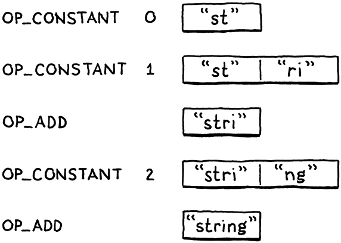

# 19. Strings 字符串

> “Ah? A small aversion to menial labor?” The doctor cocked an eyebrow. “Understandable, but misplaced. One should treasure those hum-drum tasks that keep the body occupied but leave the mind and heart unfettered.”
>
> ​															——Tad Williams, *The Dragonbone Chair*

“啊？對瑣碎的勞動有點反感？”醫生挑了挑眉毛，“可以理解，但這是錯誤的。一個人應該珍惜那些讓身體忙碌，但讓思想和心靈不受束縛的瑣碎工作。”（泰德-威廉姆斯，《龍骨椅》）

> Our little VM can represent three types of values right now: numbers, Booleans, and `nil`. Those types have two important things in common: they’re immutable and they’re small. Numbers are the largest, and they still fit into two 64-bit words. That’s a small enough price that we can afford to pay it for all values, even Booleans and nils which don’t need that much space.

我們的小虛擬機現在可以表示三種類型的值：數字，布爾值和`nil`。這些類型有兩個重要的共同點：它們是不可變的，它們很小。數字是最大的，而它仍可以被2個64比特的字容納。這是一個足夠小的代價，我們可以為所有值都支付這個代價，即使是不需要那麼多空間的布爾值和nil。

> Strings, unfortunately, are not so petite. There’s no maximum length for a string. Even if we were to artificially cap it at some contrived limit like 255 characters, that’s still too much memory to spend on every single value.

不幸的是，字符串就沒有這麼小了。一個字符串沒有最大的長度，即使我們人為地將其限制在255個字符[^1]，這對於每個單獨的值來説仍然花費了太多的內存。

> We need a way to support values whose sizes vary, sometimes greatly. This is exactly what dynamic allocation on the heap is designed for. We can allocate as many bytes as we need. We get back a pointer that we’ll use to keep track of the value as it flows through the VM.

我們需要一種方法來支持那些大小變化（有時變化很大）的值。這正是堆上動態分配的設計目的。我們可以根據需要分配任意多的字節。我們會得到一個指針，當值在虛擬機中流動時，我們會用該指針來跟蹤它。

> ## 19 . 1 Values and Objects

## 19.1 值與對象

> Using the heap for larger, variable-sized values and the stack for smaller, atomic ones leads to a two-level representation. Every Lox value that you can store in a variable or return from an expression will be a Value. For small, fixed-size types like numbers, the payload is stored directly inside the Value struct itself.

將堆用於較大的、可變大小的值，將棧用於較小的、原子性的值，這就導致了兩級表示形式。每個可以存儲在變量中或從表達式返回的Lox值都是一個Value。對於小的、固定大小的類型（如數字），有效載荷直接存儲在Value結構本身。

> If the object is larger, its data lives on the heap. Then the Value’s payload is a *pointer* to that blob of memory. We’ll eventually have a handful of heap-allocated types in clox: strings, instances, functions, you get the idea. Each type has its own unique data, but there is also state they all share that [our future garbage collector](http://www.craftinginterpreters.com/garbage-collection.html) will use to manage their memory.

如果對象比較大，它的數據就駐留在堆中。那麼Value的有效載荷就是指向那塊內存的一個指針。我們最終會在clox中擁有一些堆分配的類型：字符串、實例、函數，你懂的。每個類型都有自己獨特的數據，但它們也有共同的狀態，我們未來的垃圾收集器會用這些狀態來管理它們的內存。


> We’ll call this common representation “Obj”. Each Lox value whose state lives on the heap is an Obj. We can thus use a single new ValueType case to refer to all heap-allocated types.

我們將這個共同的表示形式稱為“Obj”[^2]。每個狀態位於堆上的Lox值都是一個Obj。因此，我們可以使用一個新的ValueType來指代所有堆分配的類型。

*<u>value.h，在枚舉ValueType中添加代碼：</u>*

```c
  VAL_NUMBER,
  // 新增部分開始
  VAL_OBJ
  // 新增部分結束
} ValueType;
```

> When a Value’s type is `VAL_OBJ`, the payload is a pointer to the heap memory, so we add another case to the union for that.

當Value的類型是`VAL_OBJ`時，有效載荷是一個指向堆內存的指針，因此我們在聯合體中為其添加另一種情況。

*<u>value.h，在結構體Value中添加代碼：</u>*

```c
    double number;
    // 新增部分開始
    Obj* obj;
    // 新增部分結束
  } as; 
```

> As we did with the other value types, we crank out a couple of helpful macros for working with Obj values.

正如我們對其它值類型所做的那樣，我們提供了幾個有用的宏來處理Obj值。

*<u>value.h，在結構體Value後添加代碼：</u>*

```c
#define IS_NUMBER(value)  ((value).type == VAL_NUMBER)
// 新增部分開始
#define IS_OBJ(value)     ((value).type == VAL_OBJ)
// 新增部分結束
#define AS_BOOL(value)    ((value).as.boolean)
```

> This evaluates to `true` if the given Value is an Obj. If so, we can use this:

如果給定的Value是一個Obj，則該值計算結果為`true`。如果這樣，我們可以使用這個：

*<u>value.h，添加代碼：</u>*

```c
#define IS_OBJ(value)     ((value).type == VAL_OBJ)
// 新增部分開始
#define AS_OBJ(value)     ((value).as.obj)
// 新增部分結束
#define AS_BOOL(value)    ((value).as.boolean)
```

> It extracts the Obj pointer from the value. We can also go the other way.

它會從值中提取Obj指針。我們也可以反其道而行之。

*<u>value.h，添加代碼：</u>*

```c
#define NUMBER_VAL(value) ((Value){VAL_NUMBER, {.number = value}})
// 新增部分開始
#define OBJ_VAL(object)   ((Value){VAL_OBJ, {.obj = (Obj*)object}})
// 新增部分結束
typedef struct {
```

> This takes a bare Obj pointer and wraps it in a full Value.

該方法會接受一個Obj指針，並將其包裝成一個完整的Value。

> ## 19 . 2 Struct Inheritance

## 19.2 結構體繼承

> Every heap-allocated value is an Obj, but Objs are not all the same. For strings, we need the array of characters. When we get to instances, they will need their data fields. A function object will need its chunk of bytecode. How do we handle different payloads and sizes? We can’t use another union like we did for Value since the sizes are all over the place.

每個堆分配的值都是一個Obj，但Obj並不都是一樣的。對於字符串，我們需要字符數組。等我們有了實例，它們需要自己的數據字段。一個函數對象需要的是其字節碼塊。我們如何處理不同的有效載荷和大小？我們不能像Value那樣使用另一個聯合體，因為這些大小各不相同。

> Instead, we’ll use another technique. It’s been around for ages, to the point that the C specification carves out specific support for it, but I don’t know that it has a canonical name. It’s an example of [*type punning*](https://en.wikipedia.org/wiki/Type_punning), but that term is too broad. In the absence of any better ideas, I’ll call it **struct inheritance**, because it relies on structs and roughly follows how single-inheritance of state works in object-oriented languages.

相對地，我們會使用另一種技術。它已經存在了很久，以至於C語言規範為它提供了明確的支持，但我不知道它是否有一個正式的名字。這是一個[類型雙關](https://en.wikipedia.org/wiki/Type_punning)的例子，但這個術語太寬泛了。鑑於沒有更好的想法，我將其稱為**結構體繼承**，因為它依賴於結構體，並大致遵循了面嚮對象語言中狀態的單繼承工作方式。

> Like a tagged union, each Obj starts with a tag field that identifies what kind of object it is—string, instance, etc. Following that are the payload fields. Instead of a union with cases for each type, each type is its own separate struct. The tricky part is how to treat these structs uniformly since C has no concept of inheritance or polymorphism. I’ll explain that soon, but first lets get the preliminary stuff out of the way.

與帶標籤的聯合體一樣，每個Obj開頭都是一個標籤字段，用於識別它是什麼類型的對象——字符串、實例，等等。接下來是有效載荷字段。每種類型都有自己單獨的結構，而不是各類型結構的聯合體。棘手的部分是如何統一處理這些結構，因為C沒有繼承或多態的概念。我很快就會對此進行解釋，但是首先讓我們先弄清楚一些基本的東西。

> The name “Obj” itself refers to a struct that contains the state shared across all object types. It’s sort of like the “base class” for objects. Because of some cyclic dependencies between values and objects, we forward-declare it in the “value” module.

“Obj”這個名稱本身指的是一個結構體，它包含所有對象類型共享的狀態。它有點像對象的“基類”。由於值和對象之間存在一些循環依賴關係，我們在“value”模塊中對其進行前置聲明。

*<u>value.h，添加代碼：</u>*

```c
#include "common.h"
// 新增部分開始
typedef struct Obj Obj;
// 新增部分結束
typedef enum {
```

> And the actual definition is in a new module.

實際的定義是在一個新的模塊中。

*<u>object.h，創建新文件：</u>*

```c
#ifndef clox_object_h
#define clox_object_h

#include "common.h"
#include "value.h"

struct Obj {
  ObjType type;
};

#endif
```

> Right now, it contains only the type tag. Shortly, we’ll add some other bookkeeping information for memory management. The type enum is this:

現在，它只包含一個類型標記。不久之後，我們將為內存管理添加一些其它的簿記信息。類型枚舉如下：

*<u>object.h，添加代碼：</u>*

```c
#include "value.h"
// 新增部分開始
typedef enum {
  OBJ_STRING,
} ObjType;
// 新增部分結束
struct Obj {
```

> Obviously, that will be more useful in later chapters after we add more heap-allocated types. Since we’ll be accessing these tag types frequently, it’s worth making a little macro that extracts the object type tag from a given Value.

顯然，等我們在後面的章節中添加了更多的堆分配類型之後，這個枚舉會更有用。因為我們會經常訪問這些標記類型，所以有必要編寫一個宏，從給定的Value中提取對象類型標籤。

*<u>object.h，添加代碼：</u>*

```c
#include "value.h"
// 新增部分開始
#define OBJ_TYPE(value)        (AS_OBJ(value)->type)
// 新增部分結束
typedef enum {
```

> That’s our foundation.

這是我們的基礎。

> Now, let’s build strings on top of it. The payload for strings is defined in a separate struct. Again, we need to forward-declare it.

現在，讓我們在其上建立字符串。字符串的有效載荷定義在一個單獨的結構體中。同樣，我們需要對其進行前置聲明。

*<u>value.h，添加代碼：</u>*

```c
typedef struct Obj Obj;
// 新增部分開始
typedef struct ObjString ObjString;
// 新增部分結束
typedef enum {
```

> The definition lives alongside Obj.

這個定義與Obj是並列的。

*<u>object.h，在結構體Obj後添加代碼：</u>*

```c
};
// 新增部分開始
struct ObjString {
  Obj obj;
  int length;
  char* chars;
};
// 新增部分結束
#endif
```

> A string object contains an array of characters. Those are stored in a separate, heap-allocated array so that we set aside only as much room as needed for each string. We also store the number of bytes in the array. This isn’t strictly necessary but lets us tell how much memory is allocated for the string without walking the character array to find the null terminator.

字符串對象中包含一個字符數組。這些字符存儲在一個單獨的、由堆分配的數組中，這樣我們就可以按需為每個字符串留出空間。我們還會保存數組中的字節數。這並不是嚴格必需的，但可以讓我們迅速知道為字符串分配了多少內存，而不需要遍歷字符數組尋找空結束符。

> Because ObjString is an Obj, it also needs the state all Objs share. It accomplishes that by having its first field be an Obj. C specifies that struct fields are arranged in memory in the order that they are declared. Also, when you nest structs, the inner struct’s fields are expanded right in place. So the memory for Obj and for ObjString looks like this:

因為ObjString是一個Obj，它也需要所有Obj共有的狀態。它通過將第一個字段置為Obj來實現這一點。C語言規定，結構體的字段在內存中是按照它們的聲明順序排列的。此外，當結構體嵌套時，內部結構體的字段會在適當的位置展開。所以Obj和ObjString的內存看起來是這樣的：


> Note how the first bytes of ObjString exactly line up with Obj. This is not a coincidence—C mandates it. This is designed to enable a clever pattern: You can take a pointer to a struct and safely convert it to a pointer to its first field and back.

注意ObjString的第一個字節是如何與Obj精確對齊的。這並非巧合——是C語言強制要求的[^3]。這是為實現一個巧妙的模式而設計的：你可以接受一個指向結構體的指針，並安全地將其轉換為指向其第一個字段的指針，反之亦可。

> Given an `ObjString*`, you can safely cast it to `Obj*` and then access the `type` field from it. Every ObjString “is” an Obj in the OOP sense of “is”. When we later add other object types, each struct will have an Obj as its first field. Any code that wants to work with all objects can treat them as base `Obj*` and ignore any other fields that may happen to follow.

給定一個`ObjString*`，你可以安全地將其轉換為`Obj*`，然後訪問其中的`type`字段。每個ObjString“是”一個Obj，這裏的“是”指OOP意義上的“是”。等我們稍後添加其它對象類型時，每個結構體都會有一個Obj作為其第一個字段。任何代碼若想要面向所有對象，都可以把它們當做基礎的`Obj*`，並忽略後面可能出現的任何其它字段。

> You can go in the other direction too. Given an `Obj*`, you can “downcast” it to an `ObjString*`. Of course, you need to ensure that the `Obj*` pointer you have does point to the `obj` field of an actual ObjString. Otherwise, you are unsafely reinterpreting random bits of memory. To detect that such a cast is safe, we add another macro.

你也能反向操作。給定一個`Obj*`，你可以將其“向下轉換”為一個`ObjString*`。當然，你需要確保你的`Obj*`指針確實指向一個實際的ObjString中的`obj`字段。否則，你就會不安全地重新解釋內存中的隨機比特位。為了檢測這種類型轉換是否安全，我們再添加另一個宏。

*<u>object.h，添加代碼：</u>*

```c
#define OBJ_TYPE(value)        (AS_OBJ(value)->type)
// 新增部分開始
#define IS_STRING(value)       isObjType(value, OBJ_STRING)
// 新增部分結束
typedef enum {
```

> It takes a Value, not a raw `Obj*` because most code in the VM works with Values. It relies on this inline function:

它接受一個Value，而不是原始的`Obj*`，因為虛擬機中的大多數代碼都使用Value。它依賴於這個內聯函數：

*<u>object.h，在結構體ObjString後添加代碼：</u>*

```c
};
// 新增部分開始
static inline bool isObjType(Value value, ObjType type) {
  return IS_OBJ(value) && AS_OBJ(value)->type == type;
}
// 新增部分結束
#endif
```

> Pop quiz: Why not just put the body of this function right in the macro? What’s different about this one compared to the others? Right, it’s because the body uses `value` twice. A macro is expanded by inserting the argument *expression* every place the parameter name appears in the body. If a macro uses a parameter more than once, that expression gets evaluated multiple times.

突擊測試：為什麼不直接把這個函數體放在宏中？與其它函數相比，這個函數有什麼不同？對，這是因為函數體使用了兩次`value`。宏的展開方式是在主體中形參名稱出現的每個地方插入實參*表達式*。如果一個宏中使用某個參數超過一次，則該表達式就會被求值多次。

> That’s bad if the expression has side effects. If we put the body of `isObjType()` into the macro definition and then you did, say,
>
> ```
> IS_STRING(POP())
> ```
>
> then it would pop two values off the stack! Using a function fixes that.

如果這個表達式有副作用，那就不好了。如果我們把`isObjType()`的主體放到宏的定義中，假設你這麼使用

```c
IS_STRING(POP())
```

那麼它就會從堆棧中彈出兩個值！使用函數可以解決這個問題。

> As long as we ensure that we set the type tag correctly whenever we create an Obj of some type, this macro will tell us when it’s safe to cast a value to a specific object type. We can do that using these:

只要我們確保在創建某種類型的Obj時正確設置了類型標籤，這個宏就會告訴我們何時將一個值轉換為特定的對象類型是安全的。我們可以用下面這些函數來做轉換：

*<u>object.h，添加代碼：</u>*

```c
#define IS_STRING(value)       isObjType(value, OBJ_STRING)
// 新增部分開始
#define AS_STRING(value)       ((ObjString*)AS_OBJ(value))
#define AS_CSTRING(value)      (((ObjString*)AS_OBJ(value))->chars)
// 新增部分結束
typedef enum {
```

> These two macros take a Value that is expected to contain a pointer to a valid ObjString on the heap. The first one returns the `ObjString*` pointer. The second one steps through that to return the character array itself, since that’s often what we’ll end up needing.

這兩個宏會接受一個Value，其中應當包含一個指向堆上的有效ObjString指針。第一個函數返回 `ObjString*` 指針。第二個函數更進一步返回了字符數組本身，因為這往往是我們最終需要的。

> ## 19 . 3 Strings

## 19.3 字符串

> OK, our VM can now represent string values. It’s time to add strings to the language itself. As usual, we begin in the front end. The lexer already tokenizes string literals, so it’s the parser’s turn.

好了，我們的虛擬機現在可以表示字符串值了。現在是時候向語言本身添加字符串了。像往常一樣，我們從前端開始。詞法解析器已經將字符串字面量標識化了，所以現在輪到解析器了。

*<u>compiler.c，替換1行：</u>*

```c
  [TOKEN_IDENTIFIER]    = {NULL,     NULL,   PREC_NONE},
  // 替換一行開始
  [TOKEN_STRING]        = {string,   NULL,   PREC_NONE},
  // 替換一行結束
  [TOKEN_NUMBER]        = {number,   NULL,   PREC_NONE},
```

> When the parser hits a string token, it calls this parse function:

當解析器遇到一個字符串標識時，會調用這個解析函數：

*<u>compiler.c，在number()方法後添加代碼：</u>*

```c
static void string() {
  emitConstant(OBJ_VAL(copyString(parser.previous.start + 1,
                                  parser.previous.length - 2)));
}
```

> This takes the string’s characters directly from the lexeme. The `+ 1` and `- 2` parts trim the leading and trailing quotation marks. It then creates a string object, wraps it in a Value, and stuffs it into the constant table.

這裏直接從詞素中獲取字符串的字符[^4]。`+1`和`-2`部分去除了開頭和結尾的引號。然後，它創建了一個字符串對象，將其包裝為一個Value，並塞入常量表中。

> To create the string, we use `copyString()`, which is declared in `object.h`.

為了創建字符串，我們使用了在`object.h`中聲明的`copyString()`。

*<u>object.h，在結構體ObjString後添加代碼：</u>*

```c
};
// 新增部分開始
ObjString* copyString(const char* chars, int length);
// 新增部分結束
static inline bool isObjType(Value value, ObjType type) {
```

> The compiler module needs to include that.

編譯器模塊需要引入它。

*<u>compiler.h，添加代碼：</u>*

```c
#define clox_compiler_h
// 新增部分開始
#include "object.h"
// 新增部分結束
#include "vm.h"
```

> Our “object” module gets an implementation file where we define the new function.

我們的“object”模塊有了一個實現文件，我們在其中定義新函數。

*<u>object.c，創建新文件：</u>*

```c
#include <stdio.h>
#include <string.h>

#include "memory.h"
#include "object.h"
#include "value.h"
#include "vm.h"

ObjString* copyString(const char* chars, int length) {
  char* heapChars = ALLOCATE(char, length + 1);
  memcpy(heapChars, chars, length);
  heapChars[length] = '\0';
  return allocateString(heapChars, length);
}
```

> First, we allocate a new array on the heap, just big enough for the string’s characters and the trailing terminator, using this low-level macro that allocates an array with a given element type and count:

首先，我們在堆上分配一個新數組，其大小剛好可以容納字符串中的字符和末尾的結束符，使用這個底層宏來分配一個具有給定元素類型和數量的數組：

*<u>memory.h，添加代碼：</u>*

```c
#include "common.h"
// 新增部分開始
#define ALLOCATE(type, count) \
    (type*)reallocate(NULL, 0, sizeof(type) * (count))
// 新增部分結束    
#define GROW_CAPACITY(capacity) \
```

> Once we have the array, we copy over the characters from the lexeme and terminate it.

有了數組以後，就把詞素中的字符複製過來並終止[^5]。

> You might wonder why the ObjString can’t just point back to the original characters in the source string. Some ObjStrings will be created dynamically at runtime as a result of string operations like concatenation. Those strings obviously need to dynamically allocate memory for the characters, which means the string needs to *free* that memory when it’s no longer needed.

你可能想知道為什麼ObjString不能直接執行源字符串中的原始字符。由於連接等字符串操作，一些ObjString會在運行時被動態創建。這些字符串顯然需要為字符動態分配內存，這也意味着該字符串不再需要這些內存時，要*釋放*它們。

> If we had an ObjString for a string literal, and tried to free its character array that pointed into the original source code string, bad things would happen. So, for literals, we preemptively copy the characters over to the heap. This way, every ObjString reliably owns its character array and can free it.

如果我們有一個ObjString存儲字符串字面量，並且試圖釋放其中指向原始的源代碼字符串的字符數組，糟糕的事情就會發生。因此，對於字面量，我們預先將字符複製到堆中。這樣一來，每個ObjString都能可靠地擁有自己的字符數組，並可以釋放它。

> The real work of creating a string object happens in this function:

創建字符串對象的真正工作發生在這個函數中：

*<u>object.c，添加代碼：</u>*

```c
#include "vm.h"
// 新增部分開始
static ObjString* allocateString(char* chars, int length) {
  ObjString* string = ALLOCATE_OBJ(ObjString, OBJ_STRING);
  string->length = length;
  string->chars = chars;
  return string;
}
// 新增部分結束
```

> It creates a new ObjString on the heap and then initializes its fields. It’s sort of like a constructor in an OOP language. As such, it first calls the “base class” constructor to initialize the Obj state, using a new macro.

它在堆上創建一個新的ObjString，然後初始化其字段。這有點像OOP語言中的構建函數。因此，它首先調用“基類”的構造函數來初始化Obj狀態，使用了一個新的宏。

*<u>object.c，添加代碼：</u>*

```c
#include "vm.h"
// 新增部分開始
#define ALLOCATE_OBJ(type, objectType) \
    (type*)allocateObject(sizeof(type), objectType)
// 新增部分結束    
static ObjString* allocateString(char* chars, int length) {
```

> Like the previous macro, this exists mainly to avoid the need to redundantly cast a `void*` back to the desired type. The actual functionality is here:

跟前面的宏一樣，這個宏[^6]的存在主要是為了避免重複地將`void*`轉換回期望的類型。實際的功能在這裏：

*<u>object.c，添加代碼：</u>*

```c
#define ALLOCATE_OBJ(type, objectType) \
    (type*)allocateObject(sizeof(type), objectType)
// 新增部分開始    
static Obj* allocateObject(size_t size, ObjType type) {
  Obj* object = (Obj*)reallocate(NULL, 0, size);
  object->type = type;
  return object;
}
// 新增部分結束
static ObjString* allocateString(char* chars, int length) {
```

> It allocates an object of the given size on the heap. Note that the size is *not* just the size of Obj itself. The caller passes in the number of bytes so that there is room for the extra payload fields needed by the specific object type being created.

它在堆上分配了一個給定大小的對象。注意，這個大小*不僅僅*是Obj本身的大小。調用者傳入字節數，以便為被創建的對象類型留出額外的載荷字段所需的空間。

> Then it initializes the Obj state—right now, that’s just the type tag. This function returns to `allocateString()`, which finishes initializing the ObjString fields. *Voilà*, we can compile and execute string literals.

然後它初始化Obj狀態——現在這只是個類型標籤。這個函數會返回到 `allocateString()`，它來完成對ObjString字段的初始化。就是這樣，我們可以編譯和執行字符串字面量了。

> ## 19 . 4 Operations on Strings

## 19.4 字符串操作

> Our fancy strings are there, but they don’t do much of anything yet. A good first step is to make the existing print code not barf on the new value type.

我們的花哨的字符串已經就位了，但是它們還沒有發揮什麼作用。一個好的第一步是使現有的打印代碼不要排斥新的值類型。

*<u>value.c，在printValue()方法中添加代碼：</u>*

```c
    case VAL_NUMBER: printf("%g", AS_NUMBER(value)); break;
    // 新增部分開始
    case VAL_OBJ: printObject(value); break;
    // 新增部分結束
  }
```

> If the value is a heap-allocated object, it defers to a helper function over in the “object” module.

如果該值是一個堆分配的對象，它會調用“object”模塊中的一個輔助函數。

*<u>object.h，在copyString()方法後添加代碼：</u>*

```c
ObjString* copyString(const char* chars, int length);
// 新增部分開始
void printObject(Value value);
// 新增部分結束
static inline bool isObjType(Value value, ObjType type) {
```

> The implementation looks like this:

對應的實現的這樣的：

*<u>object.c，在copyString()方法後添加代碼：</u>*

```c
void printObject(Value value) {
  switch (OBJ_TYPE(value)) {
    case OBJ_STRING:
      printf("%s", AS_CSTRING(value));
      break;
  }
}
```

> We have only a single object type now, but this function will sprout additional switch cases in later chapters. For string objects, it simply prints the character array as a C string.

我們現在只有一個對象類型，但是這個函數在後續的章節中會出現更多case分支。對於字符串對象，只是簡單地將字符數組作為C字符串打印出來[^7]。

> The equality operators also need to gracefully handle strings. Consider:

相等運算符也需要優雅地處理字符串。考慮一下：

```c
"string" == "string"
```

> These are two separate string literals. The compiler will make two separate calls to `copyString()`, create two distinct ObjString objects and store them as two constants in the chunk. They are different objects in the heap. But our users (and thus we) expect strings to have value equality. The above expression should evaluate to `true`. That requires a little special support.

這是兩個獨立的字符串字面量。編譯器會對`copyString()`進行兩次單獨的調用，創建兩個不同的ObjString對象，並將它們作為兩個常量存儲在字節碼塊中。它們是堆中的不同對象。但是我們的用户（也就是我們）希望字符串的值是相等的。上面的表達式計算結果應該是`true`。這需要一點特殊的支持。

*<u>value.c，在valuesEqual()中添加代碼：</u>*

```c
    case VAL_NUMBER: return AS_NUMBER(a) == AS_NUMBER(b);
    // 新增部分開始
    case VAL_OBJ: {
      ObjString* aString = AS_STRING(a);
      ObjString* bString = AS_STRING(b);
      return aString->length == bString->length &&
          memcmp(aString->chars, bString->chars,
                 aString->length) == 0;
    }
    // 新增部分結束
    default:         return false; // Unreachable.
```

> If the two values are both strings, then they are equal if their character arrays contain the same characters, regardless of whether they are two separate objects or the exact same one. This does mean that string equality is slower than equality on other types since it has to walk the whole string. We’ll revise that [later](http://www.craftinginterpreters.com/hash-tables.html), but this gives us the right semantics for now.

如果兩個值都是字符串，那麼當它們的字符數組中包含相同的字符時，它們就是相等的，不管它們是兩個獨立的對象還是完全相同的一個對象。這確實意味着字符串相等比其它類型的相等要慢，因為它必須遍歷整個字符串。我們稍後會對此進行修改，但目前這為我們提供了正確的語義。

> Finally, in order to use `memcmp()` and the new stuff in the “object” module, we need a couple of includes. Here:

最後，為了使用`memcmp()`和“object”模塊中的新內容，我們需要一些引入。這裏：

*<u>value.c，添加代碼：</u>*

```c
#include <stdio.h>
// 新增部分開始
#include <string.h>
// 新增部分結束
#include "memory.h"
```

> And here:

還有這裏：

*<u>value.c，添加代碼：</u>*

```c
#include <string.h>
// 新增部分開始
#include "object.h"
// 新增部分結束
#include "memory.h"
```

> ### 19 . 4 . 1 Concatenation

### 19.4.1 連接

> Full-grown languages provide lots of operations for working with strings—access to individual characters, the string’s length, changing case, splitting, joining, searching, etc. When you implement your language, you’ll likely want all that. But for this book, we keep things *very* minimal.

成熟的語言都提供了很多處理字符串的操作——訪問單個字符、字符串長度、改變大小寫、分割、連接、搜索等。當你實現自己的語言時，你可能會想要所有這些。但是在本書中，我們還是讓事情保持簡單。

> The only interesting operation we support on strings is `+`. If you use that operator on two string objects, it produces a new string that’s a concatenation of the two operands. Since Lox is dynamically typed, we can’t tell which behavior is needed at compile time because we don’t know the types of the operands until runtime. Thus, the `OP_ADD` instruction dynamically inspects the operands and chooses the right operation.

我們對字符串支持的唯一有趣的操作是`+`。如果你在兩個字符串對象上使用這個操作符，它會產生一個新的字符串，是兩個操作數的連接。由於Lox是動態類型的，因此我們在編譯時無法判斷需要哪種行為，因為我們在運行時才知道操作數的類型。因此，`OP_ADD`指令會動態地檢查操作數，並選擇正確的操作。

*<u>vm.c，在run()方法中替換1行：</u>*

```c
      case OP_LESS:     BINARY_OP(BOOL_VAL, <); break;
      // 替換部分開始
      case OP_ADD: {
        if (IS_STRING(peek(0)) && IS_STRING(peek(1))) {
          concatenate();
        } else if (IS_NUMBER(peek(0)) && IS_NUMBER(peek(1))) {
          double b = AS_NUMBER(pop());
          double a = AS_NUMBER(pop());
          push(NUMBER_VAL(a + b));
        } else {
          runtimeError(
              "Operands must be two numbers or two strings.");
          return INTERPRET_RUNTIME_ERROR;
        }
        break;
      }
      // 替換部分結束
      case OP_SUBTRACT: BINARY_OP(NUMBER_VAL, -); break;
```

> If both operands are strings, it concatenates. If they’re both numbers, it adds them. Any other combination of operand types is a runtime error.

如果兩個操作數都是字符串，則連接。如果都是數字，則相加。任何其它操作數類型的組合都是一個運行時錯誤[^8]。

> To concatenate strings, we define a new function.

為了連接字符串，我們定義一個新函數。

*<u>vm.c，在isFalsey()方法後添加代碼：</u>*

```c
static void concatenate() {
  ObjString* b = AS_STRING(pop());
  ObjString* a = AS_STRING(pop());

  int length = a->length + b->length;
  char* chars = ALLOCATE(char, length + 1);
  memcpy(chars, a->chars, a->length);
  memcpy(chars + a->length, b->chars, b->length);
  chars[length] = '\0';

  ObjString* result = takeString(chars, length);
  push(OBJ_VAL(result));
}
```

> It’s pretty verbose, as C code that works with strings tends to be. First, we calculate the length of the result string based on the lengths of the operands. We allocate a character array for the result and then copy the two halves in. As always, we carefully ensure the string is terminated.

這是相當繁瑣的，因為處理字符串的C語言代碼往往是這樣。首先，我們根據操作數的長度計算結果字符串的長度。我們為結果分配一個字符數組，然後將兩個部分複製進去。與往常一樣，我們要小心地確保這個字符串被終止了。

> In order to call `memcpy()`, the VM needs an include.

為了調用`memcpy()`，虛擬機需要引入頭文件。

*<u>vm.c，添加代碼：</u>*

```c
#include <stdio.h>
// 新增部分開始
#include <string.h>
// 新增部分結束
#include "common.h"
```

> Finally, we produce an ObjString to contain those characters. This time we use a new function, `takeString()`.

最後，我們生成一個ObjString來包含這些字符。這次我們使用一個新函數`takeString()`。

*<u>object.h，在結構體ObjString後添加代碼：</u>*

```c
};
// 新增部分開始
ObjString* takeString(char* chars, int length);
// 新增部分結束
ObjString* copyString(const char* chars, int length);
```

> The implementation looks like this:

其實現如下：

*<u>object.c，在allocateString()方法後添加代碼：</u>*

```c
ObjString* takeString(char* chars, int length) {
  return allocateString(chars, length);
}
```

> The previous `copyString()` function assumes it *cannot* take ownership of the characters you pass in. Instead, it conservatively creates a copy of the characters on the heap that the ObjString can own. That’s the right thing for string literals where the passed-in characters are in the middle of the source string.

前面的`copyString()`函數假定它*不能*擁有傳入的字符的所有權。相對地，它保守地在堆上創建了一個ObjString可以擁有的字符的副本。對於傳入的字符位於源字符串中間的字面量來説，這樣做是正確的。

> But, for concatenation, we’ve already dynamically allocated a character array on the heap. Making another copy of that would be redundant (and would mean `concatenate()` has to remember to free its copy). Instead, this function claims ownership of the string you give it.

但是，對於連接，我們已經在堆上動態地分配了一個字符數組。再做一個副本是多餘的（而且意味着`concatenate()`必須記得釋放它的副本）。相反，這個函數要求擁有傳入字符串的所有權。

> As usual, stitching this functionality together requires a couple of includes.

通常，將這個功能拼接在一起需要引入一些頭文件。

*<u>vm.c，添加代碼：</u>*

```c
#include "debug.h"
// 新增部分開始
#include "object.h"
#include "memory.h"
// 新增部分結束
#include "vm.h"
```

> ## 19 . 5 Freeing Objects

## 19.5 釋放對象

> Behold this innocuous-seeming expression:

看看這個看似無害的表達式：

```c
"st" + "ri" + "ng"
```

> When the compiler chews through this, it allocates an ObjString for each of those three string literals and stores them in the chunk’s constant table and generates this bytecode:

當編譯器在處理這個表達式時，會為這三個字符串字面量分別分配一個ObjString，將它們存儲到字節碼塊的常量表中[^9]，並生成這個字節碼：

```c
0000    OP_CONSTANT         0 "st"
0002    OP_CONSTANT         1 "ri"
0004    OP_ADD
0005    OP_CONSTANT         2 "ng"
0007    OP_ADD
0008    OP_RETURN
```

> The first two instructions push `"st"` and `"ri"` onto the stack. Then the `OP_ADD` pops those and concatenates them. That dynamically allocates a new `"stri"` string on the heap. The VM pushes that and then pushes the `"ng"` constant. The last `OP_ADD` pops `"stri"` and `"ng"`, concatenates them, and pushes the result: `"string"`. Great, that’s what we expect.

前兩條指令將`"st"`和`"ri"`壓入棧中。然後`OP_ADD`將它們彈出並連接。這會在堆上動態分配一個新的`"stri"`字符串。虛擬機將它壓入棧中，然後壓入`"ng"`常量。最後一個`OP_ADD`會彈出`"stri"`和`"ng"`，將它們連接起來，並將結果`"string"`壓入棧。很好，這就是我們所期望的。

> But, wait. What happened to that `"stri"` string? We dynamically allocated it, then the VM discarded it after concatenating it with `"ng"`. We popped it from the stack and no longer have a reference to it, but we never freed its memory. We’ve got ourselves a classic memory leak.

但是，請等一下。那個`"stri"`字符串怎麼樣了？我們動態分配了它，然後虛擬機在將其與`"ng"`連接後丟棄了它。我們把它從棧中彈出，不再持有對它的引用，但是我們從未釋放它的內存。我們遇到了典型的內存泄露。

> Of course, it’s perfectly fine for the *Lox program* to forget about intermediate strings and not worry about freeing them. Lox automatically manages memory on the user’s behalf. The responsibility to manage memory doesn’t *disappear*. Instead, it falls on our shoulders as VM implementers.

當然，Lox程序完全可以忘記中間的字符串，也不必擔心釋放它們。Lox代表用户自動管理內存。管理內存的責任並沒有*消失*，相反，它落到了我們這些虛擬機實現者的肩上。

> The full solution is a [garbage collector](http://www.craftinginterpreters.com/garbage-collection.html) that reclaims unused memory while the program is running. We’ve got some other stuff to get in place before we’re ready to tackle that project. Until then, we are living on borrowed time. The longer we wait to add the collector, the harder it is to do.

完整的解決方案是一個[垃圾回收器](http://www.craftinginterpreters.com/garbage-collection.html)，在程序運行時回收不使用的內存。在我們準備着手那個項目之前，還有一些其它的事情要做[^10]。在那之前，我們只是僥倖運行。我們等待添加收集器的時間越長，它就越難做。

> Today, we should at least do the bare minimum: avoid *leaking* memory by making sure the VM can still find every allocated object even if the Lox program itself no longer references them. There are many sophisticated techniques that advanced memory managers use to allocate and track memory for objects. We’re going to take the simplest practical approach.

今天我們至少應該做到最基本的一點：確保虛擬機可以找到每一個分配的對象，即使Lox程序本身不再引用它們，從而避免*泄露*內存。高級內存管理程序會使用很多複雜的技術來分配和跟蹤對象的內存。我們將採取最簡單的實用方法。

> We’ll create a linked list that stores every Obj. The VM can traverse that list to find every single object that has been allocated on the heap, whether or not the user’s program or the VM’s stack still has a reference to it.

我們會創建一個鏈表存儲每個Obj。虛擬機可以遍歷這個列表，找到在堆上分配的每一個對象，無論用户的程序或虛擬機的堆棧是否仍然有對它的引用。

> We could define a separate linked list node struct but then we’d have to allocate those too. Instead, we’ll use an **intrusive list**—the Obj struct itself will be the linked list node. Each Obj gets a pointer to the next Obj in the chain.

我們可以定義一個單獨的鏈表節點結構體，但那樣我們也必須分配這些節點。相反，我們會使用**侵入式列表**——Obj結構體本身將作為鏈表節點。每個Obj都有一個指向鏈中下一個Obj的指針。

*<u>object.h，在結構體Obj中添加代碼：</u>*

```c
struct Obj {
  ObjType type;
  // 新增部分開始
  struct Obj* next;
  // 新增部分結束
};
```

> The VM stores a pointer to the head of the list.

VM存儲一個指向表頭的指針。

*<u>vm.h，在結構體VM中添加代碼：</u>*

```c
  Value* stackTop;
  // 新增部分開始
  Obj* objects;
  // 新增部分結束
} VM;
```

> When we first initialize the VM, there are no allocated objects.

當我們第一次初始化VM時，沒有分配的對象。

*<u>vm.c，在initVM()方法中添加代碼：</u>*

```c
  resetStack();
  // 新增部分開始
  vm.objects = NULL;
  // 新增部分結束
}
```

> Every time we allocate an Obj, we insert it in the list.

每當我們分配一個Obj時，就將其插入到列表中。

*<u>object.c，在allocateObject()方法中添加代碼：</u>*

```c
  object->type = type;
  // 新增部分開始
  object->next = vm.objects;
  vm.objects = object;
  // 新增部分結束
  return object;
```

> Since this is a singly linked list, the easiest place to insert it is as the head. That way, we don’t need to also store a pointer to the tail and keep it updated.

由於這是一個單鏈表，所以最容易插入的地方是頭部。這樣，我們就不需要同時存儲一個指向尾部的指針並保持對其更新。

> The “object” module is directly using the global `vm` variable from the “vm” module, so we need to expose that externally.

“object”模塊直接使用了“vm”模塊的`vm`變量，所以我們需要將該變量公開到外部。

*<u>vm.h，在枚舉InterpretResult後添加代碼：</u>*

```c
} InterpretResult;
// 新增部分開始
extern VM vm;
// 新增部分結束
void initVM();
```

> Eventually, the garbage collector will free memory while the VM is still running. But, even then, there will usually be unused objects still lingering in memory when the user’s program completes. The VM should free those too.

最終，垃圾收集器會在虛擬機仍在運行時釋放內存。但是，即便如此，當用户的程序完成時，通常仍會有未使用的對象駐留在內存中。VM也應該釋放這些對象。

> There’s no sophisticated logic for that. Once the program is done, we can free *every* object. We can and should implement that now.

這方面沒有什麼複雜的邏輯。一旦程序完成，我們就可以釋放*每個*對象。我們現在可以也應該實現它。

*<u>vm.c，在freeVM()方法中添加代碼：</u>*

```c
void freeVM() {
  // 新增部分開始
  freeObjects();
  // 新增部分結束
}
```

> That empty function we defined [way back when](http://www.craftinginterpreters.com/a-virtual-machine.html#an-instruction-execution-machine) finally does something! It calls this:

我們早先定義的空函數終於有了用武之地！它調用了這個方法：

*<u>memory.h，在reallocate()方法後添加代碼：</u>*

```c
void* reallocate(void* pointer, size_t oldSize, size_t newSize);
// 新增部分開始
void freeObjects();
// 新增部分結束
#endif
```

> Here’s how we free the objects:

下面是釋放對象的方法：

*<u>memory.c，在reallocate()後添加代碼：</u>*

```c
void freeObjects() {
  Obj* object = vm.objects;
  while (object != NULL) {
    Obj* next = object->next;
    freeObject(object);
    object = next;
  }
}
```

> This is a CS 101 textbook implementation of walking a linked list and freeing its nodes. For each node, we call:

這是CS 101教科書中關於遍歷鏈表並釋放其節點的實現。對於每個節點，我們調用：

*<u>memory.c，在reallocate()方法後添加代碼：</u>*

```c
static void freeObject(Obj* object) {
  switch (object->type) {
    case OBJ_STRING: {
      ObjString* string = (ObjString*)object;
      FREE_ARRAY(char, string->chars, string->length + 1);
      FREE(ObjString, object);
      break;
    }
  }
}
```

> We aren’t only freeing the Obj itself. Since some object types also allocate other memory that they own, we also need a little type-specific code to handle each object type’s special needs. Here, that means we free the character array and then free the ObjString. Those both use one last memory management macro.

我們不僅釋放了Obj本身。因為有些對象類型還分配了它們所擁有的其它內存，我們還需要一些特定於類型的代碼來處理每種對象類型的特殊需求。在這裏，這意味着我們釋放字符數組，然後釋放ObjString。它們都使用了最後一個內存管理宏。

*<u>memory.h，添加代碼：</u>*

```c
    (type*)reallocate(NULL, 0, sizeof(type) * (count))
// 新增部分開始    
#define FREE(type, pointer) reallocate(pointer, sizeof(type), 0)
// 新增部分結束
#define GROW_CAPACITY(capacity) \
```

> It’s a tiny wrapper around `reallocate()` that “resizes” an allocation down to zero bytes.

這是圍繞`reallocate()`的一個小包裝[^11]，可以將分配的內存“調整”為零字節。

Using `reallocate()` to free memory might seem pointless. Why not just call `free()`? Later, this will help the VM track how much memory is still being used. If all allocation and freeing goes through `reallocate()`, it’s easy to keep a running count of the number of bytes of allocated memory.


> As usual, we need an include to wire everything together.

像往常一樣，我們需要一個include將所有東西連接起來

*<u>memory.h，添加代碼：</u>*

```c
#include "common.h"
// 新增部分開始
#include "object.h"
// 新增部分結束
#define ALLOCATE(type, count) \
```

> Then in the implementation file:

然後是實現文件：

*<u>memory.c，添加代碼：</u>*

```c
#include "memory.h"
// 新增部分開始
#include "vm.h"
// 新增部分結束
void* reallocate(void* pointer, size_t oldSize, size_t newSize) {
```

> With this, our VM no longer leaks memory. Like a good C program, it cleans up its mess before exiting. But it doesn’t free any objects while the VM is running. Later, when it’s possible to write longer-running Lox programs, the VM will eat more and more memory as it goes, not relinquishing a single byte until the entire program is done.

這樣一來，我們的虛擬機就不會再泄露內存了。像一個好的C程序一樣，它會在退出之前進行清理。但在虛擬機運行時，它不會釋放任何對象。稍後，當可以編寫長時間運行的Lox程序時，虛擬機在運行過程中會消耗越來越多的內存，在整個程序完成之前不會釋放任何一個字節。

We won’t address that until we’ve added [a real garbage collector](http://www.craftinginterpreters.com/garbage-collection.html), but this is a big step. We now have the infrastructure to support a variety of different kinds of dynamically allocated objects. And we’ve used that to add strings to clox, one of the most used types in most programming languages. Strings in turn enable us to build another fundamental data type, especially in dynamic languages: the venerable [hash table](http://www.craftinginterpreters.com/hash-tables.html). But that’s for the next chapter . . . 

在添加真正的垃圾收集器之前，我們不會解決這個問題，但這是一個很大的進步。我們現在擁有了支持各種不同類型的動態分配對象的基礎設施。我們利用這一點在clox中加入了字符串，這是大多數編程語言中最常用的類型之一。字符串反過來又使我們能夠構建另一種基本的數據類型，尤其是在動態語言中：古老的哈希表。但這是下一章的內容了……


[^1]: UCSD Pascal，Pascal最早的實現之一，就有這個確切的限制。Pascal字符串開頭是長度值，而不是像C語言那樣用一個終止的空字符表示字符串的結束。因為UCSD只使用一個字節來存儲長度，所以字符串不能超過255個字符。
[^2]: 當然，“Obj”是“對象（object）”的簡稱。
[^3]: 語言規範中的關鍵部分是：<BR>$ 6.7.2.1 13<BR>在一個結構體對象中，非位域成員和位域所在的單元的地址按照它們被聲明的順序遞增。一個指向結構對象的指針，經過適當轉換後，指向其第一個成員（如果該成員是一個位域，則指向其所在的單元），反之亦然。在結構對象中可以有未命名的填充，但不允許在其開頭。
[^4]: 如果Lox支持像`\n`這樣的字符串轉義序列，我們會在這裏對其進行轉換。既然不支持，我們就可以原封不動地接受這些字符。
[^5]: 我們需要自己終止字符串，因為詞素指向整個源字符串中的一個字符範圍，並且沒有終止符。<BR>由於ObjString明確存儲了長度，我們*可以*讓字符數組不終止，但是在結尾處添加一個終止符只花費一個字節，並且可以讓我們將字符數組傳遞給期望帶終止符的C標準庫函數。
[^6]: 我承認這一章涉及了大量的輔助函數和宏。我試圖讓代碼保持良好的分解，但這導致了一些分散的小函數。等我們以後重用它們時，將會得到回報。
[^7]: 我説過，終止字符串會有用的。
[^8]: 這比大多數語言都要保守。在其它語言中，如果一個操作數是字符串，另一個操作數可以是任何類型，在連接這兩個操作數之前會隱式地轉換為字符串。<BR>我認為這是一個很好的特性，但是需要為每種類型編寫冗長的“轉換為字符串”的代碼，所以我在Lox中沒有支持它。
[^9]: 下面是每條指令執行後的堆棧：
[^10]: 我見過很多人在實現看語言的大部分內容之後，才試圖開始實現GC。對於在開發語言時通常會運行的那種玩具程序，實際上不會在程序結束之前耗盡內存，所以在需要GC之前，你可以開發出很多的特性。<BR>但是，這低估了以後添加垃圾收集器的難度。收集器必須確保它能夠找到每一點仍在使用的內存，這樣它就不會收集活躍數據。一個語言的實現可以在數百個地方存儲對某個對象的引用。如果你不能找到所有這些地方，你就會遇到噩夢般的漏洞。<BR>我曾見過一些語言實現因為後來的GC太困難而夭折。如果你的語言需要GC，請儘快實現它。它是涉及整個代碼庫的橫切關注點。
[^11]: 使用`reallocate()`來釋放內存似乎毫無意義。為什麼不直接調用`free()`呢？稍後，這將幫助虛擬機跟蹤仍在使用的內存數量。如果所有的分配和釋放都通過`reallocate()`進行，那麼就很容易對已分配的內存字節數進行記錄。

---

## 習題

1. > Each string requires two separate dynamic allocations—one for the ObjString and a second for the character array. Accessing the characters from a value requires two pointer indirections, which can be bad for performance. A more efficient solution relies on a technique called **[flexible array members](https://en.wikipedia.org/wiki/Flexible_array_member)**. Use that to store the ObjString and its character array in a single contiguous allocation.

   每個字符串都需要兩次單獨的動態分配——一個是ObjString，另一個是字符數組。從一個值中訪問字符需要兩個指針間接訪問，這對性能是不利的。一個更有效的解決方案是依靠一種名為[**靈活數組成員**](https://en.wikipedia.org/wiki/Flexible_array_member)的技術。用該方法將ObjString和它的字符數據存儲在一個連續分配的內存中。

2. > When we create the ObjString for each string literal, we copy the characters onto the heap. That way, when the string is later freed, we know it is safe to free the characters too.
   >
   > This is a simpler approach but wastes some memory, which might be a problem on very constrained devices. Instead, we could keep track of which ObjStrings own their character array and which are “constant strings” that just point back to the original source string or some other non-freeable location. Add support for this.

   當我們為每個字符串字面量創建ObjString時，會將字符複製到堆中。這樣，當字符串後來被釋放時，我們知道釋放這些字符也是安全的。

   這是一個簡單但是會浪費一下內存的方法，這在非常受限的設備上可能是一個問題。相反，我們可以追蹤哪些ObjString擁有自己的字符數組，哪些是“常量字符串”，只是指向原始的源字符串或其它不可釋放的位置。添加對此的支持。

3. > If Lox was your language, what would you have it do when a user tries to use `+` with one string operand and the other some other type? Justify your choice. What do other languages do?

   如果Lox是你的語言，當用户試圖用一個字符串操作數使用`+`，而另一個操作數是其它類型時，你會讓它做什麼？證明你的選擇是正確的，其它的語言是怎麼做的？

---

> ## DESIGN NOTE: STRING ENCODING

## 設計筆記：字符串編碼

> In this book, I try not to shy away from the gnarly problems you’ll run into in a real language implementation. We might not always use the most *sophisticated* solution—it’s an intro book after all—but I don’t think it’s honest to pretend the problem doesn’t exist at all. However, I did skirt around one really nasty conundrum: deciding how to represent strings.
>
> There are two facets to a string encoding:
>
> - **What is a single “character” in a string?** How many different values are there and what do they represent? The first widely adopted standard answer to this was [ASCII](https://en.wikipedia.org/wiki/ASCII). It gave you 127 different character values and specified what they were. It was great . . . if you only ever cared about English. While it has weird, mostly forgotten characters like “record separator” and “synchronous idle”, it doesn’t have a single umlaut, acute, or grave. It can’t represent “jalapeño”, “naïve”, “Gruyère”, or “Mötley Crüe”.
>
>   Next came [Unicode](https://en.wikipedia.org/wiki/Unicode). Initially, it supported 16,384 different characters (**code points**), which fit nicely in 16 bits with a couple of bits to spare. Later that grew and grew, and now there are well over 100,000 different code points including such vital instruments of human communication as 💩 (Unicode Character ‘PILE OF POO’, `U+1F4A9`).
>
>   Even that long list of code points is not enough to represent each possible visible glyph a language might support. To handle that, Unicode also has **combining characters** that modify a preceding code point. For example, “a” followed by the combining character “¨” gives you “ä”. (To make things more confusing Unicode *also* has a single code point that looks like “ä”.)
>
>   If a user accesses the fourth “character” in “naïve”, do they expect to get back “v” or “¨”? The former means they are thinking of each code point and its combining character as a single unit—what Unicode calls an **extended grapheme cluster**—the latter means they are thinking in individual code points. Which do your users expect?
>
> - **How is a single unit represented in memory?** Most systems using ASCII gave a single byte to each character and left the high bit unused. Unicode has a handful of common encodings. UTF-16 packs most code points into 16 bits. That was great when every code point fit in that size. When that overflowed, they added *surrogate pairs* that use multiple 16-bit code units to represent a single code point. UTF-32 is the next evolution of UTF-16—it gives a full 32 bits to each and every code point.
>
>   UTF-8 is more complex than either of those. It uses a variable number of bytes to encode a code point. Lower-valued code points fit in fewer bytes. Since each character may occupy a different number of bytes, you can’t directly index into the string to find a specific code point. If you want, say, the 10th code point, you don’t know how many bytes into the string that is without walking and decoding all of the preceding ones.
>
> Choosing a character representation and encoding involves fundamental trade-offs. Like many things in engineering, there’s no perfect solution:
>
> - ASCII is memory efficient and fast, but it kicks non-Latin languages to the side.
> - UTF-32 is fast and supports the whole Unicode range, but wastes a lot of memory given that most code points do tend to be in the lower range of values, where a full 32 bits aren’t needed.
> - UTF-8 is memory efficient and supports the whole Unicode range, but its variable-length encoding makes it slow to access arbitrary code points.
> - UTF-16 is worse than all of them—an ugly consequence of Unicode outgrowing its earlier 16-bit range. It’s less memory efficient than UTF-8 but is still a variable-length encoding thanks to surrogate pairs. Avoid it if you can. Alas, if your language needs to run on or interoperate with the browser, the JVM, or the CLR, you might be stuck with it, since those all use UTF-16 for their strings and you don’t want to have to convert every time you pass a string to the underlying system.
>
> One option is to take the maximal approach and do the “rightest” thing. Support all the Unicode code points. Internally, select an encoding for each string based on its contents—use ASCII if every code point fits in a byte, UTF-16 if there are no surrogate pairs, etc. Provide APIs to let users iterate over both code points and extended grapheme clusters.
>
> This covers all your bases but is really complex. It’s a lot to implement, debug, and optimize. When serializing strings or interoperating with other systems, you have to deal with all of the encodings. Users need to understand the two indexing APIs and know which to use when. This is the approach that newer, big languages tend to take—like Raku and Swift.
>
> A simpler compromise is to always encode using UTF-8 and only expose an API that works with code points. For users that want to work with grapheme clusters, let them use a third-party library for that. This is less Latin-centric than ASCII but not much more complex. You lose fast direct indexing by code point, but you can usually live without that or afford to make it *O(n)* instead of *O(1)*.
>
> If I were designing a big workhorse language for people writing large applications, I’d probably go with the maximal approach. For my little embedded scripting language [Wren](http://wren.io/), I went with UTF-8 and code points.

在本書中，我儘量不迴避你在真正的語言實現中會遇到的棘手問題。我們也許並不總是使用最複雜的解決方案——畢竟這只是一本入門書——但我認為假裝問題根本不存在是不誠實的。但是，我們確實繞過了一個非常棘手的難題：決定如何表示字符串。

字符串編碼有兩個方面：

* 什麼是字符串中的一個“字符”？有多少個不同的值，它們代表什麼？第一個被廣泛採用的標準答案是ASCII。它給出了127個不同的字符值，並指明瞭它們是什麼。這太棒了……如果你只關心英語的話。雖然它包含有像“記錄分隔符”和“同步空閒”這樣奇怪的、幾乎被遺忘的字符，但它沒有元音變音、鋭音或鈍音。它無法表示 “jalapeño”，“naïve”，“Gruyère”或 “Mötley Crüe”。

  接下來是Unicode。最初，它支持16384個不同的字符（碼點），這非常適合在16比特位中使用，還有幾位是多餘的。後來，這個數字不斷增加，現在已經有了超過100,000個不同的碼點，包括諸如💩（Unicode字符 "PILE OF POO"，U+1F4A9）等人類交流的重要工具。

  即使是這麼長的碼點列表，也不足以表示一種語言可能支持的每個可見字形。為了處理這個問題，Unicode還有一些組合字符，可以修改前面的碼點。例如，“a”後面跟組合字符“¨”，就可以得到“ä”。（為了使事情更混亂，Unicode也有一個看起來像“ä”的單一碼點）

  如果用户訪問“naïve”中的第四個“字符”，他們希望得到的是“v”還是“¨”？前者意味着他們把每個碼點及其組合符看着一個單元——Unicode稱之為擴展的字母簇，後者意味着它們以單獨的碼點來思考。你的用户期望的是哪一種？

* 單一單元在內存中是如何表示的？大多數使用ASCII的系統給每個字符分配一個字節，高位不使用。Unicode有幾種常見的編碼方式。UTF-16將大多數碼點打包成16比特。當每個碼點都在這個範圍內時，是很好的。當碼點溢出時，它們增加了*代理對*，使用多個16比特碼來表示一個碼點。UTF-32是UTF-16的進一步演變，它為每個碼點都提供了完整的32比特。

  UTF-8比這兩個都要複雜。它使用可變數量的字節來對碼點編碼。低值的碼點適合於較少的字節。因為每個字符可能佔用不同數量的字節，你不能直接在字符串中索引到特定的碼點。如果你想要訪問，比如説，第10個碼點，在不遍歷和解碼前面所有碼點的情況下，你不知道它在字符串中佔用多少個字節。

選擇字符表示形式和編碼涉及到基本的權衡。就像工程領域的許多事情一樣，沒有完美的解決方案：

【關於這個問題有多難的一個例子就是Python 。從Python 2到3的漫長轉變之所以令人痛苦，主要是因為它圍繞字符串編碼的變化】

* ASCII內存效率高，速度快，但它把非拉丁語系的語言踢到了一邊。
* UTF-32速度快，並且支持整個Unicode範圍，但考慮到大多數碼點往往都位於較低的值範圍內，不需要完整的32比特，所以浪費了大量的內存。
* UTF-8的內存效率高，支持整個Unicode範圍，但是它的可變長度編碼使得在訪問任意碼點時速度很慢。
* UTF-16比所有這些都糟糕——這是Unicode超出其早期16比特範圍的醜陋後果。它的內存效率低於UTF-8，但由於代理對的存在，它仍然是一種可變長度的編碼。儘量避免使用它。唉，如果你的語言需要在瀏覽器、JVM或CLR上運行或與之交互，你也許就只能用它了，因為這些系統的字符串都使用UTF-16，而你並不想每次向底層系統傳遞字符串時都進行轉換。

一種選擇是採取最大限度的方法，做“最正確”的事情。支持所有的Unicode碼點。在內部，根據每個字符串的內容選擇編碼——如果每個碼點都在一個字節內，就使用ASCII；如果沒有代理對，就使用UTF-16，等等。提供API，讓用户對碼點和擴展字母簇進行遍歷。

這涵蓋了所有的基礎，但真的很複雜。需要實現、調試和優化的東西很多。當序列化字符串或與其它系統進行交互時，你必須處理所有的編碼。用户需要理解這兩種索引API，並知道何時使用哪一種。這是較新的大型語言傾向於採取的方法，比如Raku和Swift。

一種更簡單的折衷辦法是始終使用UTF-8編碼，並且只暴露與碼點相關的API。對於想要處理字母簇的用户，讓他們使用第三方庫來處理。這不像ASCII那樣以拉丁語為中心，但也沒有多複雜，雖然會失去通過碼點快速直接索引的能力，但通常沒有索引也可以，或者可以將索引改為O(n)而不是O(1)。

如果我要為編寫大型應用程序的人設計一種大型工作語言，我可能會採用最大的方法。至於我的小型嵌入式腳本語言[Wren](http://wren.io/)，我採用了UTF-8和碼點。
