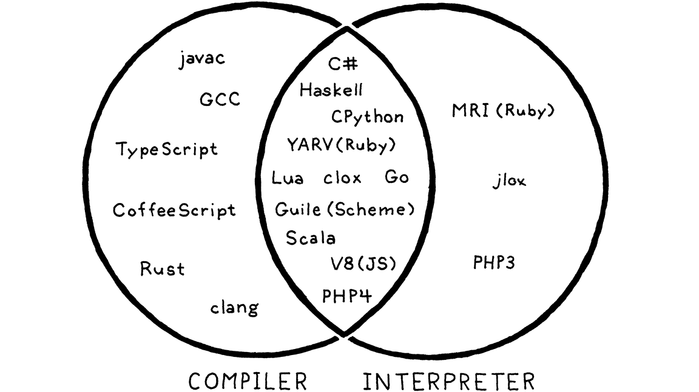

# 2. A Map of the Territory 領土地圖

> You must have a map, no matter how rough. Otherwise you wander all over the place. In “The Lord of the Rings” I never made anyone go farther than he could on a given day.
>
> ​																								——J.R.R. Tolkien

你必須要有一張地圖，無論它是多麼粗糙。否則你就會到處亂逛。在《指環王》中，我從未讓任何人在某一天走得超出他力所能及的範圍。

> We don’t want to wander all over the place, so before we set off, let’s scan the territory charted by previous language implementers. It will help us understand where we are going and alternate routes others take.

我們不想到處亂逛，所以在我們開始之前，讓我們先瀏覽一下以前的語言實現者所繪製的領土。它能幫助我們瞭解我們的目的地和其他人採用的備選路線。

> First, let me establish a shorthand. Much of this book is about a language’s *implementation*, which is distinct from the *language itself* in some sort of Platonic ideal form. Things like “stack”, “bytecode”, and “recursive descent”, are nuts and bolts one particular implementation might use. From the user’s perspective, as long as the resulting contraption faithfully follows the language’s specification, it’s all implementation detail.

首先，我先做個簡單説明。本書的大部分內容都是關於語言的*實現*，它與*語言本身*這種柏拉圖式的理想形式有所不同。諸如“堆棧”，“字節碼”和“遞歸下降”之類的東西是某個特定實現中可能使用的基本要素。從用户的角度來説，只要最終產生的裝置能夠忠實地遵循語言規範，這些都是東西不過是他們不關心的實現細節罷了。

> We’re going to spend a lot of time on those details, so if I have to write “language *implementation*” every single time I mention them, I’ll wear my fingers off. Instead, I’ll use “language” to refer to either a language or an implementation of it, or both, unless the distinction matters.

我們將會花很多時間在這些細節上，所以如果我每次提及的時候都寫“語言實現”，我的手指都會被磨掉。相反，除非有重要的區別，否則我將使用“語言”來指代一種語言或該語言的一種實現，或兩者皆有。

> ## 2 . 1 The Parts of a Language

## 2.1 語言的各部分

> Engineers have been building programming languages since the Dark Ages of computing. As soon as we could talk to computers, we discovered doing so was too hard, and we enlisted their help. I find it fascinating that even though today’s machines are literally a million times faster and have orders of magnitude more storage, the way we build programming languages is virtually unchanged.

自計算機的黑暗時代以來，工程師們就一直在構建編程語言。當我們可以和計算機對話的時候，我們發現這樣做太難了，於是我們尋求電腦的幫助。我覺得很有趣的是，即使今天的機器確實快了一百萬倍，存儲空間也大了幾個數量級，但我們構建編程語言的方式幾乎沒有改變。

> Though the area explored by language designers is vast, the trails they’ve carved through it are few. Not every language takes the exact same path—some take a shortcut or two—but otherwise they are reassuringly similar from Rear Admiral Grace Hopper’s first COBOL compiler all the way to some hot new transpile-to-JavaScript language whose “documentation” consists entirely of a single poorly-edited README in a Git repository somewhere.

儘管語言設計師所探索的領域遼闊，但他們往往都走到相似的幾條路上。 並非每種語言都採用完全相同的路徑（有些會採用一種或兩種捷徑），但除此之外，從海軍少將Grace Hopper的第一個COBOL編譯器，一直到一些熱門的可以轉譯到JavaScript的語言（JS的 "文檔 "甚至完全是由Git倉庫中一個編輯得很差的README組成的[^1]），都呈現出相似的特徵，這令人十分欣慰。

> I visualize the network of paths an implementation may choose as climbing a mountain. You start off at the bottom with the program as raw source text, literally just a string of characters. Each phase analyzes the program and transforms it to some higher-level representation where the semantics—what the author wants the computer to do—becomes more apparent.

我把一個語言實現可能選擇的路徑網絡類比為爬山。你從最底層開始，程序是原始的源文本，實際上只是一串字符。每個階段都會對程序進行分析，並將其轉換為更高層次的表現形式，從而使語義（作者希望計算機做什麼）變得更加明顯。

> Eventually we reach the peak. We have a bird’s-eye view of the users’s program and can see what their code *means*. We begin our descent down the other side of the mountain. We transform this highest-level representation down to successively lower-level forms to get closer and closer to something we know how to make the CPU actually execute.

最終我們達到了峯頂。我們可以鳥瞰用户的程序，可以看到他們的代碼含義是什麼。我們開始從山的另一邊下山。我們將這個最高級的表示形式轉化為連續的較低級別的形式，從而越來越接近我們所知道的如何讓CPU真正執行的形式。


> Let’s trace through each of those trails and points of interest. Our journey begins on the left with the bare text of the user’s source code:

讓我們追隨着這一條條路徑和點前進吧。我們的旅程從左邊的用户源代碼的純文本開始：


> ### 2.1.1 Scanning

### 2.1.1 掃描

> The first step is **scanning**, also known as **lexing**, or (if you’re trying to impress someone) **lexical analysis**. They all mean pretty much the same thing. I like “lexing” because it sounds like something an evil supervillain would do, but I’ll use “scanning” because it seems to be marginally more commonplace.

第一步是**掃描**，也就是所謂的**詞法分析** ( lexing 或者強調寫法 lexical analysis )。掃描和詞法分析的意思相近。我喜歡詞法分析這個描述，因為這聽起來像是一個邪惡的超級大壞蛋會做的事情，但我還是用掃描，因為它似乎更常見一些。

> A **scanner** (or **lexer**) takes in the linear stream of characters and chunks them together into a series of something more akin to “words”. In programming languages, each of these words is called a **token**. Some tokens are single characters, like `(` and `,`. Others may be several characters long, like numbers (`123`), string literals (`"hi!"`), and identifiers (`min`).

掃描器(或詞法解析器)接收線性字符流，並將它們切分成一系列更類似於“單詞”的東西。在編程語言中，這些詞的每一個都被稱為**詞法單元**。有些詞法單元是單個字符，比如`(`和 `,`。其他的可能是幾個字符長的，比如數字（`123`）、字符串字元（`"hi!"`）和標識符（`min`）。

> Some characters in a source file don’t actually mean anything. Whitespace is often insignificant and comments, by definition, are ignored by the language. The scanner usually discards these, leaving a clean sequence of meaningful tokens.

源文件中的一些字符實際上沒有任何意義。空格通常是無關緊要的，而註釋，從定義就能看出來，會被變成語言忽略。掃描器通常會丟棄這些字符，留下一個乾淨的有意義的詞法單元序列。

![[var] [average] [=] [(] [min] [+] [max] [)] [/] [2] [;]](2.領土地圖/tokens.png)

> ### 2.1.2 Parsing

### 2.1.2 語法分析

> The next step is **parsing**. This is where our syntax gets a **grammar**—the ability to compose larger expressions and statements out of smaller parts. Did you ever diagram sentences in English class? If so, you’ve done what a parser does, except that English has thousands and thousands of “keywords” and an overflowing cornucopia of ambiguity. Programming languages are much simpler.

下一步是**解析**。 這就是我們從句法中得到**語法**的地方——語法能夠將較小的部分組成較大的表達式和語句。你在英語課上做過語法圖解嗎？如果有，你就做了解析器所做的事情，區別在於，英語中有成千上萬的“關鍵字”和大量的歧義，而編程語言要簡單得多。

> A **parser** takes the flat sequence of tokens and builds a tree structure that mirrors the nested nature of the grammar. These trees have a couple of different names—**“parse tree”** or **“abstract syntax tree”**—depending on how close to the bare syntactic structure of the source language they are. In practice, language hackers usually call them **“syntax trees”**, **“ASTs”**, or often just **“trees”**.

**解析器**將扁平的詞法單元序列轉化為樹形結構，樹形結構能更好地反映語法的嵌套本質。這些樹有兩個不同的名稱:**解析樹**或**抽象語法樹**，這取決於它們與源語言的語法結構有多接近。在實踐中，語言黑客通常稱它們為“**語法樹**”、“**AST**”，或者乾脆直接説“**樹**”。


> Parsing has a long, rich history in computer science that is closely tied to the artificial intelligence community. Many of the techniques used today to parse programming languages were originally conceived to parse *human* languages by AI researchers who were trying to get computers to talk to us.

解析在計算機科學中有着悠久而豐富的歷史，它與人工智能界有着密切的聯繫。今天用於解析編程語言的許多技術最初被人工智能研究人員用於解析人類語言，人工智能研究人員試圖通過這些技術讓計算機能與我們對話。

> It turns out human languages are too messy for the rigid grammars those parsers could handle, but they were a perfect fit for the simpler artificial grammars of programming languages. Alas, we flawed humans still manage to use those simple grammars incorrectly, so the parser’s job also includes letting us know when we do by reporting **syntax errors**.

事實證明，人類語言對於只能處理僵化語法的解析器來説太混亂了，但面對編程語言這種簡單的人造語法時，解析器表現得十分合適。唉，可惜我們這些有缺陷的人類在使用這些簡單的語法時，仍然會不停地出錯，因此解析器的工作還包括通過報告**語法錯誤**讓我們知道出錯了。

> ### 2 . 1 . 3 Static analysis

### 2.1.3 靜態分析

> The first two stages are pretty similar across all implementations. Now, the individual characteristics of each language start coming into play. At this point, we know the syntactic structure of the code—things like which expressions are nested in which others—but we don’t know much more than that.

在所有實現中，前兩個階段都非常相似。 現在，每種語言的個性化特徵開始發揮作用。 至此，我們知道了代碼的語法結構（諸如哪些表達式嵌套在其他表達式中）之類的東西，但是我們知道的也就僅限於此了。

> In an expression like `a + b`, we know we are adding `a` and `b`, but we don’t know what those names refer to. Are they local variables? Global? Where are they defined?

在`a + b`這樣的表達式中，我們知道我們要把`a`和`b`相加，但我們不知道這些名字指的是什麼。它們是局部變量嗎？全局變量？它們在哪裏被定義？

> The first bit of analysis that most languages do is called **binding** or **resolution**. For each **identifier** we find out where that name is defined and wire the two together. This is where **scope** comes into play—the region of source code where a certain name can be used to refer to a certain declaration.

大多數語言所做的第一點分析叫做**綁定**或**決議**。對於每一個**標識符**，我們都要找出定義該名稱的地方，並將兩者連接起來。這就是**作用域**的作用——在這個源代碼區域中，某個名字可以用來引用某個聲明。

> If the language is statically typed, this is when we type check. Once we know where `a` and `b` are declared, we can also figure out their types. Then if those types don’t support being added to each other, we report a **type error**.

如果語言是靜態類型的，這就是我們進行類型檢查的時機。一旦我們知道了`a`和`b`的聲明位置，我們也可以弄清楚它們的類型。然後如果這些類型不支持相加，我們就會報告一個**類型錯誤**[^2]。

> Take a deep breath. We have attained the summit of the mountain and a sweeping view of the user’s program. All this semantic insight that is visible to us from analysis needs to be stored somewhere. There are a few places we can squirrel it away:
>
> - Often, it gets stored right back as **attributes** on the syntax tree itself—extra fields in the nodes that aren’t initialized during parsing but get filled in later.
> - Other times, we may store data in a look-up table off to the side. Typically, the keys to this table are identifiers—names of variables and declarations. In that case, we call it a **symbol table** and the values it associates with each key tell us what that identifier refers to.
> - The most powerful bookkeeping tool is to transform the tree into an entirely new data structure that more directly expresses the semantics of the code. That’s the next section.

深吸一口氣。 我們已經到達了山頂，並對用户的程序有了全面的瞭解。從分析中可見的所有語義信息都需要存儲在某個地方。我們可以把它存儲在幾個地方：

* 通常，它會被直接存儲在語法樹本身的**屬性**中——屬性是節點中的額外字段，這些字段在解析時不會初始化，但在稍後會進行填充。
* 有時，我們可能會將數據存儲在外部的查找表中。 通常，該表的關鍵字是標識符，即變量和聲明的名稱。 在這種情況下，我們稱其為**符號表**，並且其中與每個鍵關聯的值告訴我們該標識符所指的是什麼。
* 最強大的記錄工具是將樹轉化為一個全新的數據結構，更直接地表達代碼的語義。這是下一節的內容。

> Everything up to this point is considered the **front end** of the implementation. You might guess everything after this is the **back end**, but no. Back in the days of yore when “front end” and “back end” were coined, compilers were much simpler. Later researchers invented new phases to stuff between the two halves. Rather than discard the old terms, William Wulf and company lumped them into the charming but spatially paradoxical name **middle end**.

到目前為止，所有內容都被視為實現的**前端**。 你可能會猜至此以後是**後端**，其實並不是。 在過去的年代，當“前端”和“後端”被創造出來時，編譯器要簡單得多。 後來，研究人員在兩個半部之間引入了新階段。 威廉·沃爾夫（William Wulf）和他的同伴沒有放棄舊術語，而是新添加了一個迷人但有點自相矛盾的名稱“**中端**”。

> ### 2 . 1 . 4 Intermediate representations

### 2.1.4 中間碼

> You can think of the compiler as a pipeline where each stage’s job is to organize the data representing the user’s code in a way that makes the next stage simpler to implement. The front end of the pipeline is specific to the source language the program is written in. The back end is concerned with the final architecture where the program will run.

你可以把編譯器看成是一條流水線，每個階段的工作是把代表用户代碼的數據組織起來，使下一階段的實現更加簡單。管道的前端是針對程序所使用的源語言編寫的。後端關注的是程序運行的最終架構。

> In the middle, the code may be stored in some **intermediate representation** (or **IR**) that isn’t tightly tied to either the source or destination forms (hence “intermediate”). Instead, the IR acts as an interface between these two languages.

在中間階段，代碼可能被存儲在一些**中間代碼**（**intermediate representation**， 也叫**IR**）中，這些中間代碼與源文件或目的文件形式都沒有緊密的聯繫（因此叫作 "中間"）。相反，IR充當了這兩種語言之間的接口[^3]。

> This lets you support multiple source languages and target platforms with less effort. Say you want to implement Pascal, C and Fortran compilers and you want to target x86, ARM, and, I dunno, SPARC. Normally, that means you’re signing up to write *nine* full compilers: Pascal→x86, C→ARM, and every other combination.

這可以讓你更輕鬆地支持多種源語言和目標平台。假設你想在x86、ARM、SPARC 平台上實現Pascal、C和Fortran編譯器。通常情況下，這意味着你需要寫九個完整的編譯器：Pascal→x86，C→ARM，以及其他各種組合[^4]。

> A shared intermediate representation reduces that dramatically. You write *one* front end for each source language that produces the IR. Then *one* back end for each target architecture. Now you can mix and match those to get every combination.

一個共享的中間代碼可以大大減少這種情況。你為每個產生IR的源語言寫*一個*前端。然後為每個目標平台寫*一個*後端。現在，你可以將這些混搭起來，得到每一種組合。

> There’s another big reason we might want to transform the code into a form that makes the semantics more apparent…

我們希望將代碼轉化為某種語義更加明確的形式，還有一個重要的原因是。。。

> ### 2 . 1 . 5 Optimization

### 2.1.5 優化

> Once we understand what the user’s program means, we are free to swap it out with a different program that has the *same semantics* but implements them more efficiently—we can **optimize** it.

一旦我們理解了用户程序的含義，我們就可以自由地用另一個具有相同語義但實現效率更高的程序來交換它——我們可以對它進行**優化**。

> A simple example is **constant folding**: if some expression always evaluates to the exact same value, we can do the evaluation at compile time and replace the code for the expression with its result. If the user typed in:

一個簡單的例子是**常量摺疊**：如果某個表達式求值得到的始終是完全相同的值，我們可以在編譯時進行求值，並用其結果替換該表達式的代碼。 如果用户輸入：

```java
pennyArea = 3.14159 * (0.75 / 2) * (0.75 / 2);
```

> We can do all of that arithmetic in the compiler and change the code to:

我們可以在編譯器中完成所有的算術運算，並將代碼更改為：

```java
pennyArea = 0.4417860938;
```

> Optimization is a huge part of the programming language business. Many language hackers spend their entire careers here, squeezing every drop of performance they can out of their compilers to get their benchmarks a fraction of a percent faster. It can become a sort of obsession.

優化是編程語言業務的重要組成部分。許多語言黑客把他們的整個職業生涯都花在了這裏，竭盡所能地從他們的編譯器中擠出每一點性能，以使他們的基準測試速度提高百分之幾。有的時候這也會變成一種痴迷, 無法自拔。

> We’re mostly going to hop over that rathole in this book. Many successful languages have surprisingly few compile-time optimizations. For example, Lua and CPython generate relatively unoptimized code, and focus most of their performance effort on the runtime.

我們在本書中通常會跳過這些棘手問題。令人驚訝的是許多成功的語言只有很少的編譯期優化。 例如，Lua和CPython生成沒怎麼優化過的代碼，並將其大部分性能工作集中在運行時上[^5]。

> ### 2 . 1 . 6 Code generation

### 2.1.6 代碼生成

> We have applied all of the optimizations we can think of to the user’s program. The last step is converting it to a form the machine can actually run. In other words **generating code** (or **code gen**), where “code” here usually refers to the kind of primitive assembly-like instructions a CPU runs and not the kind of “source code” a human might want to read.

我們已經將所有可以想到的優化應用到了用户程序中。 最後一步是將其轉換為機器可以實際運行的形式。 換句話説，**生成代碼**（或**代碼生成**），這裏的“代碼”通常是指CPU運行的類似於彙編的原始指令，而不是人類可能想要閲讀的“源代碼”。

> Finally, we are in the **back end**, descending the other side of the mountain. From here on out, our representation of the code becomes more and more primitive, like evolution run in reverse, as we get closer to something our simple-minded machine can understand.

最後，我們到了**後端**，從山的另一側開始向下。 從現在開始，隨着我們越來越接近於思維簡單的機器可以理解的東西，我們對代碼的表示變得越來越原始，就像逆向進化。

> We have a decision to make. Do we generate instructions for a real CPU or a virtual one? If we generate real machine code, we get an executable that the OS can load directly onto the chip. Native code is lightning fast, but generating it is a lot of work. Today’s architectures have piles of instructions, complex pipelines, and enough historical baggage to fill a 747’s luggage bay.

我們需要做一個決定。 我們是為真實CPU還是虛擬CPU生成指令？ 如果我們生成真實的機器代碼，則會得到一個可執行文件，操作系統可以將其直接加載到芯片上。 原生代碼快如閃電，但生成它需要大量工作。 當今的體系結構包含大量指令，複雜的管線和足夠塞滿一架747行李艙的歷史包袱。

> Speaking the chip’s language also means your compiler is tied to a specific architecture. If your compiler targets [x86](https://en.wikipedia.org/wiki/X86) machine code, it’s not going to run on an [ARM](https://en.wikipedia.org/wiki/ARM_architecture) device. All the way back in the 60s, during the Cambrian explosion of computer architectures, that lack of portability was a real obstacle.

使用芯片的語言也意味着你的編譯器是與特定的架構相綁定的。如果你的編譯器以x86機器代碼為目標，那麼它就無法在[ARM](https://en.wikipedia.org/wiki/ARM_architecture)設備上運行。追朔到上世紀60年代計算機體系結構 “寒武紀大爆發” 期間，這種缺乏可移植性的情況是一個真正的障礙[^6]。

> To get around that, hackers like Martin Richards and Niklaus Wirth, of BCPL and Pascal fame, respectively, made their compilers produce *virtual* machine code. Instead of instructions for some real chip, they produced code for a hypothetical, idealized machine. Wirth called this **“p-code”** for “portable”, but today, we generally call it **bytecode** because each instruction is often a single byte long.

為了解決這個問題，專家開始讓他們的編譯器生成虛擬機代碼，包括BCPL的設計者Martin Richards以及Pascal設計者Niklaus Wirth。他們不是為真正的芯片編寫指令，而是為一個假設的、理想化的機器編寫代碼。Wirth稱這種**p-code**為“可移植代碼”，但今天，我們通常稱它為**字節碼**，因為每條指令通常都是一個字節長。

> These synthetic instructions are designed to map a little more closely to the language’s semantics, and not be so tied to the peculiarities of any one computer architecture and its accumulated historical cruft. You can think of it like a dense, binary encoding of the language’s low-level operations.

這些合成指令的設計是為了更緊密地映射到語言的語義上，而不必與任何一個計算機體系結構的特性和它積累的歷史錯誤綁定在一起。你可以把它想象成語言底層操作的密集二進制編碼。

> ### 2 . 1 . 7 Virtual machine

### 2.1.7 虛擬機

> If your compiler produces bytecode, your work isn’t over once that’s done. Since there is no chip that speaks that bytecode, it’s your job to translate. Again, you have two options. You can write a little mini-compiler for each target architecture that converts the bytecode to native code for that machine. You still have to do work for each chip you support, but this last stage is pretty simple and you get to reuse the rest of the compiler pipeline across all of the machines you support. You’re basically using your bytecode as an intermediate representation.

如果你的編譯器產生了字節碼，你的工作還沒有結束。因為沒有芯片可以解析這些字節碼，因此你還需要進行翻譯。同樣，你有兩個選擇。你可以為每個目標體系結構編寫一個小型編譯器，將字節碼轉換為該機器的本機代碼[^7]。你仍然需要針對你支持的每個芯片做一些工作，但最後這個階段非常簡單，你可以在你支持的所有機器上重複使用編譯器流水線的其餘部分。你基本上是把你的字節碼作為一種中間代碼。

> Or you can write a **virtual machine** (**VM**), a program that emulates a hypothetical chip supporting your virtual architecture at runtime. Running bytecode in a VM is slower than translating it to native code ahead of time because every instruction must be simulated at runtime each time it executes. In return, you get simplicity and portability. Implement your VM in, say, C, and you can run your language on any platform that has a C compiler. This is how the second interpreter we build in this book works.

或者，你可以編寫**虛擬機（VM）**[^8]，該程序可在運行時模擬支持虛擬架構的虛擬芯片。在虛擬機中運行字節碼比提前將其翻譯成本地代碼要慢，因為每條指令每次執行時都必須在運行時模擬。作為回報，你得到的是簡單性和可移植性。用比如説C語言實現你的虛擬機，你就可以在任何有C編譯器的平台上運行你的語言。這就是我們在本書中構建的第二個解釋器的工作原理。

> ### 2 . 1 . 8 Runtime

### 2.1.8 運行時

> We have finally hammered the user’s program into a form that we can execute. The last step is running it. If we compiled it to machine code, we simply tell the operating system to load the executable and off it goes. If we compiled it to bytecode, we need to start up the VM and load the program into that.

我們終於將用户程序錘鍊成可以執行的形式。最後一步是運行它。如果我們將其編譯為機器碼，我們只需告訴操作系統加載可執行文件，然後就可以運行了。如果我們將它編譯成字節碼，我們需要啓動VM並將程序加載到其中。

> In both cases, for all but the basest of low-level languages, we usually need some services that our language provides while the program is running. For example, if the language automatically manages memory, we need a garbage collector going in order to reclaim unused bits. If our language supports “instance of” tests so you can see what kind of object you have, then we need some representation to keep track of the type of each object during execution.

在這兩種情況下，除了最基本的底層語言外，我們通常需要我們的語言在程序運行時提供一些服務。例如，如果語言自動管理內存，我們需要一個垃圾收集器去回收未使用的比特位。如果我們的語言支持用 "instance of "測試我們擁有什麼類型的對象，那麼我們就需要一些表示方法來跟蹤執行過程中每個對象的類型。

> All of this stuff is going at runtime, so it’s called, appropriately, the **runtime**. In a fully compiled language, the code implementing the runtime gets inserted directly into the resulting executable. In, say, [Go](https://golang.org/), each compiled application has its own copy of Go’s runtime directly embedded in it. If the language is run inside an interpreter or VM, then the runtime lives there. This is how most implementations of languages like Java, Python, and JavaScript work.

所有這些東西都是在運行時進行的，所以它被恰當地稱為，**運行時**。在一個完全編譯的語言中，實現運行時的代碼會直接插入到生成的可執行文件中。比如説，在[Go](https://golang.org/)中，每個編譯後的應用程序都有自己的一份Go的運行時副本直接嵌入其中。如果語言是在解釋器或虛擬機內運行，那麼運行時將駐留於虛擬機中。這也就是Java、Python和JavaScript等大多數語言實現的工作方式。

> ## 2 . 2 Shortcuts and Alternate Routes

## 2.2 捷徑和備選路線

> That’s the long path covering every possible phase you might implement. Many languages do walk the entire route, but there are a few shortcuts and alternate paths.

這是一條漫長的道路，涵蓋了你要實現的每個可能的階段。許多語言的確走完了整條路線，但也有一些捷徑和備選路徑。

> ### 2 . 2 . 1 Single-pass compilers

### 2.2.1 單遍編譯器

> Some simple compilers interleave parsing, analysis, and code generation so that they produce output code directly in the parser, without ever allocating any syntax trees or other IRs. These **single-pass compilers** restrict the design of the language. You have no intermediate data structures to store global information about the program, and you don’t revisit any previously parsed part of the code. That means as soon as you see some expression, you need to know enough to correctly compile it.

一些簡單的編譯器將解析、分析和代碼生成交織在一起，這樣它們就可以直接在解析器中生成輸出代碼，而無需分配任何語法樹或其他IR。這些**單遍編譯器**限制了語言的設計。你沒有中間數據結構來存儲程序的全局信息，也不會重新訪問任何之前解析過的代碼部分。 這意味着，一旦你看到某個表達式，就需要足夠的知識來正確地對其進行編譯[^9]。

> Pascal and C were designed around this limitation. At the time, memory was so precious that a compiler might not even be able to hold an entire *source file* in memory, much less the whole program. This is why Pascal’s grammar requires type declarations to appear first in a block. It’s why in C you can’t call a function above the code that defines it unless you have an explicit forward declaration that tells the compiler what it needs to know to generate code for a call to the later function.

Pascal和C語言就是圍繞這個限制而設計的。在當時，內存非常珍貴，一個編譯器可能連整個源文件都無法存放在內存中，更不用説整個程序了。這也是為什麼Pascal的語法要求類型聲明要先出現在一個塊中。這也是為什麼在C語言中，你不能在定義函數的代碼上面調用函數，除非你有一個明確的前向聲明，告訴編譯器它需要知道什麼，以便生成調用後面函數的代碼。

> ### 2 . 2 . 2 Tree-walk interpreters

### 2.2.2 樹遍歷解釋器

> Some programming languages begin executing code right after parsing it to an AST (with maybe a bit of static analysis applied). To run the program, the interpreter traverses the syntax tree one branch and leaf at a time, evaluating each node as it goes.

有些編程語言在將代碼解析為AST後就開始執行代碼（可能應用了一點靜態分析）。為了運行程序，解釋器每次都會遍歷語法樹的一個分支和葉子，並在運行過程中計算每個節點。

> This implementation style is common for student projects and little languages, but is not widely used for general-purpose languages since it tends to be slow. Some people use “interpreter” to mean only these kinds of implementations, but others define that word more generally, so I’ll use the inarguably explicit **“tree-walk interpreter”** to refer to these. Our first interpreter rolls this way.

這種實現風格在學生項目和小型語言中很常見，但在通用語言中並不廣泛使用，因為它往往很慢。有些人使用“解釋器”僅指這類實現，但其他人對“解釋器”一詞的定義更寬泛，因此我將使用沒有歧義的“**樹遍歷解釋器**”來指代這些實現。我們的第一個解釋器就是這樣工作的[^10]。

> ### 2 . 2 . 3 Transpilers

### 2.2.3 轉譯器

> Writing a complete back end for a language can be a lot of work. If you have some existing generic IR to target, you could bolt your front end onto that. Otherwise, it seems like you’re stuck. But what if you treated some other *source language* as if it were an intermediate representation?

為一種語言編寫一個完整的後端可能需要大量的工作。 如果你有一些現有的通用IR作為目標，則可以將前端轉換到該IR上。 否則，你可能會陷入困境。 但是，如果你將某些其他*源語言*視為中間代碼，該怎麼辦？

> You write a front end for your language. Then, in the back end, instead of doing all the work to *lower* the semantics to some primitive target language, you produce a string of valid source code for some other language that’s about as high level as yours. Then, you use the existing compilation tools for *that* language as your escape route off the mountain and down to something you can execute.

你需要為你的語言編寫一個前端。然後，在後端，你可以生成一份與你的語言級別差不多的其他語言的有效源代碼字符串，而不是將所有代碼*降低*到某個原始目標語言的語義。然後，你可以使用該語言現有的編譯工具作為逃離大山的路徑，得到某些可執行的內容。

> They used to call this a **source-to-source compiler** or a **transcompiler**. After the rise of languages that compile to JavaScript in order to run in the browser, they’ve affected the hipster sobriquet **transpiler**.

人們過去稱之為**源到源編譯器**或**轉換編譯器**[^11]。隨着那些為了在瀏覽器中運行而編譯成JavaScript的各類語言的興起，它們有了一個時髦的名字——**轉譯器**。

> While the first transcompiler translated one assembly language to another, today, most transpilers work on higher-level languages. After the viral spread of UNIX to machines various and sundry, there began a long tradition of compilers that produced C as their output language. C compilers were available everywhere UNIX was and produced efficient code, so targeting C was a good way to get your language running on a lot of architectures.

雖然第一個編譯器是將一種彙編語言翻譯成另一種彙編語言，但現今，大多數編譯器都適用於高級語言。在UNIX廣泛運行在各種各樣的機器上之後，編譯器開始長期以C作為輸出語言。C編譯器在UNIX存在的地方都可以使用，並能生成有效的代碼，因此，以C為目標是讓語言在許多體系結構上運行的好方法。

> Web browsers are the “machines” of today, and their “machine code” is JavaScript, so these days it seems [almost every language out there](https://github.com/jashkenas/coffeescript/wiki/list-of-languages-that-compile-to-js) has a compiler that targets JS since that’s the main way to get your code running in a browser.

Web瀏覽器是今天的 "機器"，它們的 "機器代碼 "是JavaScript，所以現在似乎[幾乎所有的語言都有一個以JS為目標的編譯器](https://github.com/jashkenas/coffeescript/wiki/list-of-languages-that-compile-to-js)，因為這是讓你的代碼在瀏覽器中運行的主要方式[^12]。

> The front end—scanner and parser—of a transpiler looks like other compilers. Then, if the source language is only a simple syntactic skin over the target language, it may skip analysis entirely and go straight to outputting the analogous syntax in the destination language.

轉譯器的前端（掃描器和解析器）看起來跟其他編譯器相似。 然後，如果源語言只是在目標語言在語法方面的換皮版本，則它可能會完全跳過分析，並直接輸出目標語言中的類似語法。

> If the two languages are more semantically different, then you’ll see more of the typical phases of a full compiler including analysis and possibly even optimization. Then, when it comes to code generation, instead of outputting some binary language like machine code, you produce a string of grammatically correct source (well, destination) code in the target language.

如果兩種語言的語義差異較大，那麼你就會看到完整編譯器的更多典型階段，包括分析甚至優化。然後，在代碼生成階段，無需輸出一些像機器代碼一樣的二進制語言，而是生成一串語法正確的目標語言的源碼（好吧，目標代碼）。

> Either way, you then run that resulting code through the output language’s existing compilation pipeline and you’re good to go.

不管是哪種方式，你再通過目標語言已有的編譯流水線運行生成的代碼就可以了。

> ### 2 . 2 . 4 Just-in-time compilation

### 2.2.4 即時編譯

> This last one is less of a shortcut and more a dangerous alpine scramble best reserved for experts. The fastest way to execute code is by compiling it to machine code, but you might not know what architecture your end user’s machine supports. What to do?

最後一個與其説是捷徑，不如説是危險的高山爭霸賽，最好留給專家。執行代碼最快的方法是將代碼編譯成機器代碼，但你可能不知道你的最終用户的機器支持什麼架構。該怎麼做呢？

> You can do the same thing that the HotSpot JVM, Microsoft’s CLR and most JavaScript interpreters do. On the end user’s machine, when the program is loaded—either from source in the case of JS, or platform-independent bytecode for the JVM and CLR—you compile it to native for the architecture their computer supports. Naturally enough, this is called **just-in-time compilation.** Most hackers just say “JIT”, pronounced like it rhymes with “fit”.

你可以做和HotSpot JVM、Microsoft的CLR和大多數JavaScript解釋器相同的事情。 在終端用户的機器上，當程序加載時（無論是JS源代碼還者是平台無關的JVM和CLR字節碼），都可以將其編譯為對應的本地代碼，以適應本機支持的體系結構。 自然地，這被稱為**即時編譯**。 大多數黑客只是説“ JIT”，其發音與“ fit”押韻。

> The most sophisticated JITs insert profiling hooks into the generated code to see which regions are most performance critical and what kind of data is flowing through them. Then, over time, they will automatically recompile those hot spots with more advanced optimizations.

最複雜的JIT將性能分析鈎子插入到生成的代碼中，以查看哪些區域對性能最為關鍵，以及哪些類型的數據正在流經其中。 然後，隨着時間的推移，它們將通過更高級的優化功能自動重新編譯那些熱點部分[^13]。

> ## 2 . 3 Compilers and Interpreters

## 2.3 編譯器和解釋器

> Now that I’ve stuffed your head with a dictionary’s worth of programming language jargon, we can finally address a question that’s plagued coders since time immemorial: “What’s the difference between a compiler and an interpreter?”

現在我已經向你的腦袋裏塞滿了一大堆編程語言術語，我們終於可以解決一個自遠古以來一直困擾着程序員的問題:編譯器和解釋器之間有什麼區別?

> It turns out this is like asking the difference between a fruit and a vegetable. That seems like a binary either-or choice, but actually “fruit” is a *botanical* term and “vegetable” is *culinary*. One does not strictly imply the negation of the other. There are fruits that aren’t vegetables (apples) and vegetables that are not fruits (carrots), but also edible plants that are both fruits *and* vegetables, like tomatoes.

事實證明，這就像問水果和蔬菜的區別一樣。這看上去似乎是一個非此即彼的選擇，但實際上 "水果 "是一個植物學術語，"蔬菜 "是烹飪學術語。嚴格來説，一個並不意味着對另一個的否定。有不是蔬菜的水果（蘋果），也有不是水果的蔬菜（胡蘿蔔），也有既是水果又是蔬菜的可食用植物，比如西紅柿[^14]。


> So, back to languages:
>
> - **Compiling** is an *implementation technique* that involves translating a source language to some other—usually lower-level—form. When you generate bytecode or machine code, you are compiling. When you transpile to another high-level language you are compiling too.
> - When we say a language implementation “is a **compiler**”, we mean it translates source code to some other form but doesn’t execute it. The user has to take the resulting output and run it themselves.
> - Conversely, when we say an implementation “is an **interpreter**”, we mean it takes in source code and executes it immediately. It runs programs “from source”.

好，回到語言上：

* **編譯**是一種實現技術，其中涉及到將源語言翻譯成其他語言——通常是較低級的形式。當你生成字節碼或機器代碼時，你就是在編譯。當你移植到另一種高級語言時，你也在編譯。
* 當我們説語言實現“是**編譯器**”時，是指它會將源代碼轉換為其他形式，但不會執行。 用户必須獲取結果輸出並自己運行。
* 相反，當我們説一個實現“是一個**解釋器**”時，是指它接受源代碼並立即執行它。 它“從源代碼”運行程序。

> Like apples and oranges, some implementations are clearly compilers and *not* interpreters. GCC and Clang take your C code and compile it to machine code. An end user runs that executable directly and may never even know which tool was used to compile it. So those are *compilers* for C.

像蘋果和橘子一樣，某些實現顯然是編譯器，而不是解釋器。 GCC和Clang接受你的C代碼並將其編譯為機器代碼。 最終用户直接運行該可執行文件，甚至可能永遠都不知道使用了哪個工具來編譯它。 所以這些是C的*編譯器*。

> In older versions of Matz’ canonical implementation of Ruby, the user ran Ruby from source. The implementation parsed it and executed it directly by traversing the syntax tree. No other translation occurred, either internally or in any user-visible form. So this was definitely an *interpreter* for Ruby.

由 Matz 實現的老版本 Ruby 中，用户從源代碼中運行Ruby。該實現通過遍歷語法樹對其進行解析並直接執行。期間都沒有發生其他的轉換，無論是在實現內部還是以任何用户可見的形式。所以這絕對是一個Ruby的*解釋器*。

> But what of CPython? When you run your Python program using it, the code is parsed and converted to an internal bytecode format, which is then executed inside the VM. From the user’s perspective, this is clearly an interpreter—they run their program from source. But if you look under CPython’s scaly skin, you’ll see that there is definitely some compiling going on.

但是 CPython 呢？當你使用它運行你的Python程序時，代碼會被解析並轉換為內部字節碼格式，然後在虛擬機內部執行。從用户的角度來看，這顯然是一個解釋器——他們是從源代碼開始運行自己的程序。但如果你看一下CPython的內部，你會發現肯定有一些編譯工作在進行。

> The answer is that it is both. CPython *is* an interpreter, and it *has* a compiler. In practice, most scripting languages work this way, as you can see:

答案是兩者兼而有之。 CPython是一個解釋器，但他也*有*一個編譯器。 實際上，大多數腳本語言都以這種方式工作[^15]，如你所見：



> That overlapping region in the center is where our second interpreter lives too, since it internally compiles to bytecode. So while this book is nominally about interpreters, we’ll cover some compilation too.

中間那個重疊的區域也是我們第二個解釋器所在的位置，因為它會在內部編譯成字節碼。所以，雖然本書名義上是關於解釋器的，但我們也會涉及一些編譯的內容。

> ## 2 . 4 Our Journey

## 2.4 我們的旅程

> That’s a lot to take in all at once. Don’t worry. This isn’t the chapter where you’re expected to *understand* all of these pieces and parts. I just want you to know that they are out there and roughly how they fit together.

一下子有太多東西要消化掉。別擔心。這一章並不是要求你理解所有這些零碎的內容。我只是想讓你們知道它們是存在的，以及大致瞭解它們是如何組合在一起的。

> This map should serve you well as you explore the territory beyond the guided path we take in this book. I want to leave you yearning to strike out on your own and wander all over that mountain.

當你探索本書本書所指導的路徑之外的領域時，這張地圖應該對你很有用。我希望你自己出擊，在那座山裏到處遊走。

> But, for now, it’s time for our own journey to begin. Tighten your bootlaces, cinch up your pack, and come along. From here on out, all you need to focus on is the path in front of you.

但是，現在，是我們自己的旅程開始的時候了。繫好你的鞋帶，背好你的包，走吧。從這裏開始，你需要關注的是你面前的路。


[^1]: 毫無疑問，CS論文也有死衚衕，被引為零的悲慘小眾論文以及如今被遺忘的優化方法，這些優化方法只有在以單個字節為單位來衡量內存時才有意義。
[^2]: 我們在本書中構建的語言是動態類型的，因此將在稍後的運行時中進行類型檢查。
[^3]: 有幾種成熟的IR風格。點擊你熟悉的搜索引擎，搜索 "控制流圖"、"靜態單賦值形式"、"延續傳遞形式 "和 "三位址碼"。
[^4]: 如果你曾經好奇[GCC](https://en.wikipedia.org/wiki/GNU_Compiler_Collection)如何支持這麼多瘋狂的語言和體系結構，例如Motorola 68k上的Modula-3，現在你就明白了。 語言前端針對的是少數IR，主要是[GIMPLE](https://gcc.gnu.org/onlinedocs/gccint/GIMPLE.html)和[RTL](https://gcc.gnu.org/onlinedocs/gccint/RTL.html)。 目標後端如68k，會接受這些IR並生成本機代碼。
[^5]: 如果你無法抗拒要進入這個領域，可以從以下關鍵字開始，例如“常量摺疊”，“公共表達式消除”，“循環不變代碼外提”，“全局值編號”，“強度降低”，“ 聚合量標量替換”，“死碼刪除”和“循環展開”。
[^6]: 例如，[AAD](http://www.felixcloutier.com/x86/AAD.html)（"ASCII Adjust AX Before Division",除法前ASCII調整AX）指令可以讓你執行除法，這聽起來很有用。除了該指令將兩個二進制編碼的十進制數字作為操作數打包到一個16位寄存器中。你最後一次在16位機器上使用BCD是什麼時候？
[^7]: 這裏的基本原則是，你把特定於體系架構的工作推得越靠後，你就可以在不同架構之間共享更多的早期階段。不過，這裏存在一些矛盾。 許多優化（例如寄存器分配和指令選擇）在瞭解特定芯片的優勢和功能時才能發揮最佳效果。 弄清楚編譯器的哪些部分可以共享，哪些應該針對特定目標是一門藝術。
[^8]: 術語“虛擬機”也指另一種抽象。 “系統虛擬機”在軟件中模擬整個硬件平台和操作系統。 這就是你可以在Linux機器上玩Windows遊戲的原因，也是雲提供商為什麼可以給客户提供控制自己的“服務器”的用户體驗，而無需為每個用户實際分配單獨的計算機。在本書中，我們將要討論的虛擬機類型是“語言虛擬機”或“進程虛擬機”（如果你需要明確的話）。
[^9]: [語法導向翻譯](https://en.wikipedia.org/wiki/Syntax-directed_translation)是一種結構化的技術，用於構建這些一次性編譯器。你可以將一個操作與語法的每個片段(通常是生成輸出代碼的語法片段)相關聯。然後，每當解析器匹配該語法塊時，它就執行操作，一次構建一個規則的目標代碼。
[^10]: 一個明顯的例外是早期版本的Ruby，它們是樹遍歷型解釋器。在1.9時，Ruby的規範實現從最初的MRI（"Matz' Ruby Interpreter"）切換到了Koichi Sasada的YARV（"Yet Another Ruby VM"）。YARV是一個字節碼虛擬機。
[^11]: 第一個轉編譯器XLT86將8080程序集轉換為8086程序集。 這看似簡單，但請記住8080是8位芯片，而8086是16位芯片，可以將每個寄存器用作一對8位寄存器。 XLT86進行了數據流分析，以跟蹤源程序中的寄存器使用情況，然後將其有效地映射到8086的寄存器集。它是由悲慘的計算機科學英雄加里·基爾達爾（Gary Kildall）撰寫的。 他是最早認識到微型計算機前景的人之一，他創建了PL / M和CP / M，這是它們的第一種高級語言和操作系統。
[^12]: JS曾經是在瀏覽器中執行代碼的唯一方式。多虧了[Web Assembly](https://github.com/webassembly/)，編譯器現在有了第二種可以在Web上運行的低級語言。
[^13]: 當然，這正是HotSpot JVM名稱的來源。
[^14]: 花生（連真正的堅果都算不上）和小麥等穀類其實都是水果，但我把這個圖畫錯了。我能説什麼呢，我是個軟件工程師，不是植物學家。我也許應該抹掉這個花生小傢伙，但他太可愛了，我不忍心。
[^15]: [Go工具](https://golang.org/)更是一個奇葩。如果你運行`go build`，它就會把你的go源代碼編譯成機器代碼然後停止。如果你輸入`go run`，它也會這樣做，然後立即執行生成的可執行文件。所以，可以説go是一個編譯器（你可以把它當做一個工具來編譯代碼而不運行）；也可以説是一個解釋器（你可以調用它立即從源碼中運行一個程序），並且有一個編譯器（當你把它當做解釋器使用時，它仍然在內部編譯）。


------

> ## CHALLENGES

## 習題

> 1、Pick an open source implementation of a language you like. Download the source code and poke around in it. Try to find the code that implements the scanner and parser. Are they hand-written, or generated using tools like Lex and Yacc? (`.l` or `.y` files usually imply the latter.)

1、選擇一個你喜歡的語言的開源實現。下載源代碼，並在其中探索。試着找到實現掃描器和解析器的代碼，它們是手寫的，還是用Lex和Yacc等工具生成的？（存在`.l`或`.y`文件通常意味着後者）

> 2、Just-in-time compilation tends to be the fastest way to implement a dynamically-typed language, but not all of them use it. What reasons are there to *not* JIT?

2、實時編譯往往是實現動態類型語言最快的方法，但並不是所有的語言都使用它。有什麼理由不採用JIT呢？

> 3、Most Lisp implementations that compile to C also contain an interpreter that lets them execute Lisp code on the fly as well. Why?

3、大多數可編譯為C的Lisp實現也包含一個解釋器，該解釋器還使它們能夠即時執行Lisp代碼。 為什麼？
