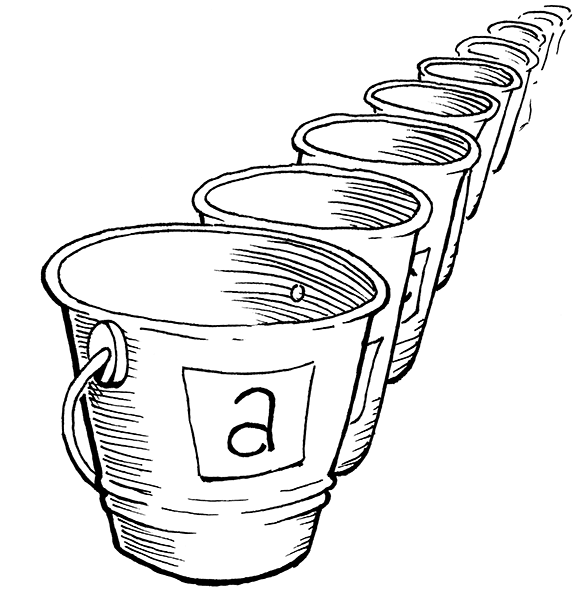
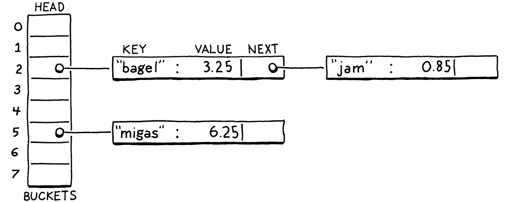
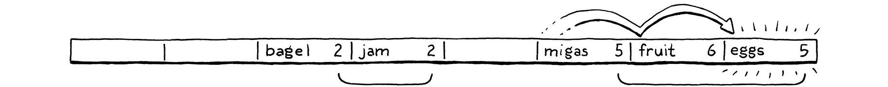
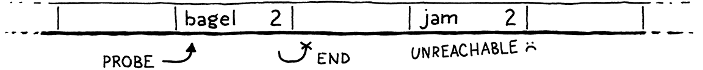

# 20. Hash Tables 哈希表

> Hash, x. There is no definition for this word—nobody knows what hash is.
>
> ​								      ——Ambrose Bierce, *The Unabridged Devil’s Dictionary*

哈希，未知。這個詞沒有定義——沒人知道哈希是什麼。（安布羅斯·比爾斯，《無刪減魔鬼詞典》）

> Before we can add variables to our burgeoning virtual machine, we need some way to look up a value given a variable’s name. Later, when we add classes, we’ll also need a way to store fields on instances. The perfect data structure for these problems and others is a hash table.

在向這個發展迅速的虛擬機中添加變量之前，我們需要某種方法來根據給定的變量名稱查詢變量值。稍後，等到我們添加類時，也需要某種方法來存儲實例中的字段。對於這些問題和其它問題，完美的數據結構就是哈希表。

> You probably already know what a hash table is, even if you don’t know it by that name. If you’re a Java programmer, you call them “HashMaps”. C# and Python users call them “dictionaries”. In C++, it’s an “unordered map”. “Objects” in JavaScript and “tables” in Lua are hash tables under the hood, which is what gives them their flexibility.

你可能已經知道什麼是哈希表了，即使你不知道它的名字。如果你是Java程序員，你把它們稱為“HashMap”。C#和Python用户則稱它們為“字典”。在C++中，它是“無序映射”。JavaScript中的“對象”和Lua中的“表”本質上都是哈希表，這賦予了它們靈活性。

> A hash table, whatever your language calls it, associates a set of **keys** with a set of **values**. Each key/value pair is an **entry** in the table. Given a key, you can look up its corresponding value. You can add new key/value pairs and remove entries by key. If you add a new value for an existing key, it replaces the previous entry.

哈希表（無論你的語言中怎麼稱呼它）是將一組**鍵**和一組**值**關聯起來。每個鍵/值對是表中的一個**條目**。給定一個鍵，可以查找它對應的值。你可以按鍵添加新的鍵/值對或刪除條目。如果你為已有的鍵添加新值，它就會替換原先的條目。

> Hash tables appear in so many languages because they are incredibly powerful. Much of this power comes from one metric: given a key, a hash table returns the corresponding value in constant time, *regardless of how many keys are in the hash table*.

哈希表之所以出現在這麼多的語言中，是因為它們非常強大。這種強大的能力主要來自於一個指標：給定一個鍵，哈希表會在常量時間[^1]內返回對應的值，*不管哈希表中有多少鍵*。

> That’s pretty remarkable when you think about it. Imagine you’ve got a big stack of business cards and I ask you to find a certain person. The bigger the pile is, the longer it will take. Even if the pile is nicely sorted and you’ve got the manual dexterity to do a binary search by hand, you’re still talking *O(log n)*. But with a hash table, it takes the same time to find that business card when the stack has ten cards as when it has a million.

仔細想想，這是非常了不起的。想象一下，你有一大堆名片，我讓你去找出某個人。這堆名片越大，花的時間就越長。即使這堆名片被很好地排序，而且你有足夠的能力來手動進行二分查找，你的複雜度仍然是O(log n)。但是對於哈希表來説，無論這摞名片有10張還是100萬張，你找到那張特定名片所需的時間都是一樣的。

> ## 20 . 1 An Array of Buckets

## 20.1 桶數組

> A complete, fast hash table has a couple of moving parts. I’ll introduce them one at a time by working through a couple of toy problems and their solutions. Eventually, we’ll build up to a data structure that can associate any set of names with their values.

一個完整、快速的哈希表需要一些組件。我會通過幾個小問題及其解決方案來逐一介紹它們。最終，我們將構建一個數據結構，可以將任何一組名稱和它們的值關聯起來。

> For now, imagine if Lox was a *lot* more restricted in variable names. What if a variable’s name could only be a single lowercase letter. How could we very efficiently represent a set of variable names and their values?

現在，假定Lox在變量名稱上有*更多*的限制。如果一個變量的名稱只能是一個小寫字母該怎麼辦[^2]？我們如何高效地表示一組變量名和它們的值？

> With only 26 possible variables (27 if you consider underscore a “letter”, I guess), the answer is easy. Declare a fixed-size array with 26 elements. We’ll follow tradition and call each element a **bucket**. Each represents a variable with `a` starting at index zero. If there’s a value in the array at some letter’s index, then that key is present with that value. Otherwise, the bucket is empty and that key/value pair isn’t in the data structure.

由於只有26個可能的變量（如果你認為下劃線是一個“字母”，我猜是27個），答案很簡單。聲明一個具有26個元素的固定大小的數組。我們遵循傳統，將每個元素稱為一個**桶（bucket）**。每個元素代表一個變量，`a`從索引下標0開始。如果數組中某個字母對應的索引位置有值，那麼這個鍵就與該值相對應。否則的話，桶是空的，該鍵/值對在數據結構中不存在。



> Memory usage is great—just a single, reasonably sized array. There’s some waste from the empty buckets, but it’s not huge. There’s no overhead for node pointers, padding, or other stuff you’d get with something like a linked list or tree.

這個方案的內存佔用情況很好——只是一個大小合理的數組。空桶會有一些浪費，但不是很大。沒有節點指針、填充以及其它類似於鏈表或樹的開銷。

> Performance is even better. Given a variable name—its character—you can subtract the ASCII value of `a` and use the result to index directly into the array. Then you can either look up the existing value or store a new value directly into that slot. It doesn’t get much faster than that.

性能就更好了。給定一個變量名——它的字符——你可以減去`a`的ASCII值，並使用結果直接在數組中進行索引。然後，你可以查找已有的值或將新值存儲到對應的槽中。沒有比這更快的了。

> This is sort of our Platonic ideal data structure. Lightning fast, dead simple, and compact in memory. As we add support for more complex keys, we’ll have to make some concessions, but this is what we’re aiming for. Even once you add in hash functions, dynamic resizing, and collision resolution, this is still the core of every hash table out there—a contiguous array of buckets that you index directly into.

這是一種柏拉圖式的理想數據結構。快如閃電，非常簡單，而且內存緊湊。當我們進一步支持更復雜的鍵時，就必須作出一些讓步，但這仍是我們的目標所在。即使加入了哈希函數、動態調整大小和衝突解決，這仍然是每個哈希表的核心——一個可以直接索引到的連續桶數組。

> ### 20 . 1 . 1 Load factor and wrapped keys
>

### 20.1.1 負載因子和封裝鍵

> Confining Lox to single-letter variables would make our job as implementers easier, but it’s probably no fun programming in a language that gives you only 26 storage locations. What if we loosened it a little and allowed variables up to eight characters long?

將Lox限制為單字母變量，會使我們作為實現者的工作更容易，但在一種只提供26個存儲位置的語言中編程可能沒有什麼樂趣。如果我們稍微放寬限制，允許變量的長度到8個字符呢[^3]？

> That’s small enough that we can pack all eight characters into a 64-bit integer and easily turn the string into a number. We can then use it as an array index. Or, at least, we could if we could somehow allocate a 295,148 *petabyte* array. Memory’s gotten cheaper over time, but not quite *that* cheap. Even if we could make an array that big, it would be heinously wasteful. Almost every bucket would be empty unless users started writing way bigger Lox programs than we’ve anticipated.

它足夠小，我們可以將所有8個字符打包成一個64比特的整數，輕鬆地將字符串變成一個數字。然後我們可以把它作為數組索引。至少，如果我們能夠以某種方式分配295,148 PB的數組，也是可以的。隨着時間的推移，內存越來越便宜了，但還沒那麼便宜。即便我們可以創建這麼大的數組，也會造成嚴重的浪費。除非用户會編寫比我們的預期大得多的Lox程序，否則幾乎每個桶都是空的。

> Even though our variable keys cover the full 64-bit numeric range, we clearly don’t need an array that large. Instead, we allocate an array with more than enough capacity for the entries we need, but not unreasonably large. We map the full 64-bit keys down to that smaller range by taking the value modulo the size of the array. Doing that essentially folds the larger numeric range onto itself until it fits the smaller range of array elements.

儘管我們的變量鍵覆蓋了整個64位數字範圍，但我們顯然不需要那麼大的數組。相反地，我們會分配一個數組，它的容量足以容納我們需要的條目，但又不會大得不合理。通過對數組的大小進行取模，我們將完整的64位鍵值映射到較小的範圍。這樣做本質上是將較大的數值範圍不斷摺疊，直到適合較小的數組元素範圍。

> For example, say we want to store “bagel”. We allocate an array with eight elements, plenty enough to store it and more later. We treat the key string as a 64-bit integer. On a little-endian machine like Intel, packing those characters into a 64-bit word puts the first letter, “b” (ASCII value 98), in the least-significant byte. We take that integer modulo the array size (8) to fit it in the bounds and get a bucket index, 2. Then we store the value there as usual.

例如，假設我們想要存儲“bagel”。我們分配一個有8個元素的數組[^4]，足夠存儲它，之後還可以存儲更多。我們把鍵字符串當作一個64位整數。在Intel這樣的小端機器上，將這些字符打包成一個64位的字時，會將第一個字母“b”（ASCII值 98）放在最低的有效字節中。我們將這個整數與數組大小（8）取模以適應邊界，並得到桶索引2。然後我們像往常一樣，將值存儲在那裏。

> Using the array size as a modulus lets us map the key’s numeric range down to fit an array of any size. We can thus control the number of buckets independently of the key range. That solves our waste problem, but introduces a new one. Any two variables whose key number has the same remainder when divided by the array size will end up in the same bucket. Keys can **collide**. For example, if we try to add “jam”, it also ends up in bucket 2.
>

使用數組的大小作為模數，可以讓我們將鍵的數值範圍向下適配到任意大小的數組。因此，我們可以獨立於鍵的範圍來控制桶的數量。這就解決了我們的浪費問題，但是也引入了一個新的問題。任意兩個變量，如果它們的鍵值除以數組大小時有相同的餘數，最後都會被放在同一個桶中。鍵會發生**衝突**。舉例來説，如果我們嘗試添加“jam”，它也會出現在2號桶中。


> We have some control over this by tuning the array size. The bigger the array, the fewer the indexes that get mapped to the same bucket and the fewer the collisions that are likely to occur. Hash table implementers track this collision likelihood by measuring the table’s **load factor**. It’s defined as the number of entries divided by the number of buckets. So a hash table with five entries and an array of 16 elements has a load factor of 0.3125. The higher the load factor, the greater the chance of collisions.

我們可以通過調整數組的大小來控制這個問題。數組越大，映射到同一個桶的索引就越少，可能發生的衝突也就越少。哈希表實現者評估這種衝突的可能性的方式就是計算表的**負載因子**。它的定義是條目的數量除以桶的數量。因此，一個包含5個條目和16個元素的數組的哈希表，其負載係數為0.3125。負載因子越大，發生衝突的可能性就越大。

> One way we mitigate collisions is by resizing the array. Just like the dynamic arrays we implemented earlier, we reallocate and grow the hash table’s array as it fills up. Unlike a regular dynamic array, though, we won’t wait until the array is *full*. Instead, we pick a desired load factor and grow the array when it goes over that.

減少衝突的一種方法是調整數組的大小。就像我們前面實現的動態數組一樣，我們在哈希表的數組被填滿時，重新分配並擴大該數組。但與常規的動態數組不同的是，我們不會等到數組填滿。相反，我們選擇一個理想的負載因子，當數組的負載因子超過該值時，我們就擴大數組。

> ## 20 . 2 Collision Resolution
>

## 20.2 衝突解決

> Even with a very low load factor, collisions can still occur. The [*birthday paradox*](https://en.wikipedia.org/wiki/Birthday_problem) tells us that as the number of entries in the hash table increases, the chance of collision increases very quickly. We can pick a large array size to reduce that, but it’s a losing game. Say we wanted to store a hundred items in a hash table. To keep the chance of collision below a still-pretty-high 10%, we need an array with at least 47,015 elements. To get the chance below 1% requires an array with 492,555 elements, over 4,000 empty buckets for each one in use.

即使負載因子很低，仍可能發生碰撞。[生日悖論](https://en.wikipedia.org/wiki/Birthday_problem)告訴我們，隨着哈希表中條目數量的增加，碰撞的概率會很快增加。我們可以選擇一個很大的數組規模來減少這種情況，但這是註定失敗的。假設我們想在哈希表中存儲100個條目，要想使碰撞幾率保持在10%以下，我們需要一個至少有47,105個元素的數組。要想使碰撞幾率低於1%，需要一個有492,555個元素的數組，每使用一個元素就需要超過4000個空桶。

> A low load factor can make collisions rarer, but the [*pigeonhole principle*](https://en.wikipedia.org/wiki/Pigeonhole_principle) tells us we can never eliminate them entirely. If you’ve got five pet pigeons and four holes to put them in, at least one hole is going to end up with more than one pigeon. With 18,446,744,073,709,551,616 different variable names, any reasonably sized array can potentially end up with multiple keys in the same bucket.

低負載因子可以使衝突變少，但是[鴿籠原理](https://en.wikipedia.org/wiki/Pigeonhole_principle)告訴我們，我們永遠無法完全消除衝突。如果你有5只寵物鴿，有4個洞來放它們，至少有一個洞最終會有不止一個鴿子。既然有18,446,744,073,709,551,616個不同的變量名，任何大小合理的數組都有可能在同一個桶中出現多個鍵。

> Thus we still have to handle collisions gracefully when they occur. Users don’t like it when their programming language can look up variables correctly only *most* of the time.

因此，當衝突發生時，我們仍然需要優雅地處理它們。用户並不喜歡他們的編程語言只在*大多數*情況下能正確地查找變量。

> ### 20 . 2 . 1 Separate chaining

### 20.2.1 拉鍊法

> Techniques for resolving collisions fall into two broad categories. The first is **separate chaining**. Instead of each bucket containing a single entry, we let it contain a collection of them. In the classic implementation, each bucket points to a linked list of entries. To look up an entry, you find its bucket and then walk the list until you find an entry with the matching key.

解決衝突的技術可以分為兩大類。第一類是**拉鍊法**。每個桶中不再包含一個條目，而是包含條目的集合。在經典的實現中，每個桶都指向一個條目的鏈表。要查找一個條目，你要先找到它的桶，然後遍歷列表，直到找到包含匹配鍵的條目。



> In catastrophically bad cases where every entry collides in the same bucket, the data structure degrades into a single unsorted linked list with *O(n)* lookup. In practice, it’s easy to avoid that by controlling the load factor and how entries get scattered across buckets. In typical separate-chained hash tables, it’s rare for a bucket to have more than one or two entries.

在最壞的情況下，每個條目都碰撞到同一個桶中，數據結構會退化成一個無序鏈表，查詢複雜度為*O(n)*。在實踐中，通過控制負載因子和條目在桶中的分散方式，可以很容易地避免這種情況。在典型的拉鍊哈希表中，一個桶中很少會有超過一個或兩個條目的情況。

> Separate chaining is conceptually simple—it’s literally an array of linked lists. Most operations are straightforward to implement, even deletion which, as we’ll see, can be a pain. But it’s not a great fit for modern CPUs. It has a lot of overhead from pointers and tends to scatter little linked list nodes around in memory which isn’t great for cache usage.
>

拉鍊法在概念上很簡單——它實際上就是一個鏈表數組。大多數操作實現都可以直接實現，甚至是刪除（正如我們將看到的，這可能會很麻煩）。但它並不適合現代的CPU。它有很多指針帶來的開銷[^5]，並且傾向於在內存中分散的小的鏈表節點，這對緩存的使用不是很好。

> ### 20 . 2 . 2 Open addressing

### 20.2.2 開放地址法

> The other technique is called **open addressing** or (confusingly) **closed hashing**. With this technique, all entries live directly in the bucket array, with one entry per bucket. If two entries collide in the same bucket, we find a different empty bucket to use instead.

另一種技術稱為**開放地址**或（令人困惑的）**封閉哈希**[^6]。使用這種技術時，所有的條目都直接存儲在桶數組中，每個桶有一個條目。如果兩個條目在同一個桶中發生衝突，我們會找一個其它的空桶來代替。

> Storing all entries in a single, big, contiguous array is great for keeping the memory representation simple and fast. But it makes all of the operations on the hash table more complex. When inserting an entry, its bucket may be full, sending us to look at another bucket. That bucket itself may be occupied and so on. This process of finding an available bucket is called **probing**, and the order that you examine buckets is a **probe sequence**.

將所有條目存儲在一個單一的、大的、連續的數組中，對於保持內存表示方式的簡單和快速是非常好的。但它使得哈希表上的所有操作變得非常複雜。當插入一個條目時，它的桶可能已經滿了，這就會讓我們去查看另一個桶。而那個桶本身可能也被佔用了，等等。這個查找可用存儲桶的過程被稱為**探測**，而檢查存儲桶的順序是**探測序列**。

> There are a number of algorithms for determining which buckets to probe and how to decide which entry goes in which bucket. There’s been a ton of research here because even slight tweaks can have a large performance impact. And, on a data structure as heavily used as hash tables, that performance impact touches a very large number of real-world programs across a range of hardware capabilities.

有很多算法[^7]可以用來確定要探測哪些桶，以及如何決定哪個條目要放在哪個桶中。這方面有大量的研究，因為即使是輕微的調整也會對性能產生很大的影響。而且，對於像哈希表這樣大量使用的數據結構來説，這種性能影響涉及到跨一系列硬件功能的大量實際的程序。

> As usual in this book, we’ll pick the simplest one that gets the job done efficiently. That’s good old **linear probing**. When looking for an entry, we look in the first bucket its key maps to. If it’s not in there, we look in the very next element in the array, and so on. If we reach the end, we wrap back around to the beginning.

依照本書的慣例，我們會選擇最簡單的方法來有效地完成工作。這就是良好的老式**線性探測法**。當查找一個條目時，我們先在它的鍵映射的桶中查找。如果它不在裏面，我們就在數組的下一個元素中查找，以此類推。如果我們到了數組終點，就繞回到起點。

> The good thing about linear probing is that it’s cache friendly. Since you walk the array directly in memory order, it keeps the CPU’s cache lines full and happy. The bad thing is that it’s prone to **clustering**. If you have a lot of entries with numerically similar key values, you can end up with a lot of colliding, overflowing buckets right next to each other.

線性探測的好處是它對緩存友好。因為你是直接按照內存順序遍歷數組，所以它可以保持CPU緩存行完整且正常。壞處是，它容易**聚集**。如果你有很多具有相似鍵值的條目，那最終可能會產生許多相互緊挨的衝突、溢出的桶。

> Compared to separate chaining, open addressing can be harder to wrap your head around. I think of open addressing as similar to separate chaining except that the “list” of nodes is threaded through the bucket array itself. Instead of storing the links between them in pointers, the connections are calculated implicitly by the order that you look through the buckets.

與拉鍊法相比，開放地址法可能更難理解。我認為開放地址法與拉鍊法是類似的，區別在於“列表”中的節點是通過桶數組本身進行的。它們之間的鏈接並沒有存儲在指針中，而是通過查看桶的順序隱式計算的。

> The tricky part is that more than one of these implicit lists may be interleaved together. Let’s walk through an example that covers all the interesting cases. We’ll ignore values for now and just worry about a set of keys. We start with an empty array of 8 buckets.

棘手的部分是，這些隱式的列表中可能會有多個交錯在一起。讓我們通過一個例子，涵蓋所有有意思的情況。我們現在先不考慮值，只關心一組鍵。首先從一個包含8個桶的數組開始。


> We decide to insert “bagel”. The first letter, “b” (ASCII value 98), modulo the array size (8) puts it in bucket 2.
>

我們決定插入“bagel”。第一個字母“b”（ASCII值是98），對數組大小（8）取模後，將其放入2號桶中。


> Next, we insert “jam”. That also wants to go in bucket 2 (106 mod 8 = 2), but that bucket’s taken. We keep probing to the next bucket. It’s empty, so we put it there.

接下來，我們插入“jam”。它也應該放在2號桶中（106 mod 8 = 2），但是這個桶已經被佔用了。我們繼續探測下一個桶。它是空的，所以我們把它放入其中。


> We insert “fruit”, which happily lands in bucket 6.

我們插入“fruit”，它愉快地落在6號桶中。


> Likewise, “migas” can go in its preferred bucket 5.

同樣，“migas”可以放在其首選的5號桶中。


> When we try to insert “eggs”, it also wants to be in bucket 5. That’s full, so we skip to 6. Bucket 6 is also full. Note that the entry in there is *not* part of the same probe sequence. “Fruit” is in its preferred bucket, 6. So the 5 and 6 sequences have collided and are interleaved. We skip over that and finally put “eggs” in bucket 7.

當我們嘗試插入“eggs”時，它也想放在5號桶中。滿了，我們跳到6號桶。6號桶也滿了。請注意，其中的條目並*不是*當前探測序列的一部分。“Fruit” 在其首選的6號桶中。因此，這裏是5號和6號序列發生了碰撞，並交錯在一起。我們跳過這個，最後把“eggs”放在7號桶中。



> We run into a similar problem with “nuts”. It can’t land in 6 like it wants to. Nor can it go into 7. So we keep going. But we’ve reached the end of the array, so we wrap back around to 0 and put it there.

我們在“nuts”上遇到了同樣的問題。它不能按預期進入6號桶中，也不能進入7號桶中。所以我們繼續前進，但是我們已經到了數組的末端，所以我們回到0並將其放入0號桶。


> In practice, the interleaving turns out to not be much of a problem. Even in separate chaining, we need to walk the list to check each entry’s key because multiple keys can reduce to the same bucket. With open addressing, we need to do that same check, and that also covers the case where you are stepping over entries that “belong” to a different original bucket.

在實踐中，這種交錯並不是什麼大問題。即使是在拉鍊法中，我們也需要遍歷列表來檢查每個條目的鍵，因為多個鍵會落入同一個桶中。使用開放地址法，我們需要做同樣的檢查，這也涵蓋了你需要遍歷“屬於”不同原始桶的條目的情況。

> ## 20 . 3 Hash Functions

## 20.3 哈希函數

> We can now build ourselves a reasonably efficient table for storing variable names up to eight characters long, but that limitation is still annoying. In order to relax the last constraint, we need a way to take a string of any length and convert it to a fixed-size integer.

現在，我們可以為自己構建一個相當有效的表，來存儲長度不超過8字符的變量名，但這個限制仍然令人討厭。為了放寬最後一個限制，我們需要一種方法，將任意長度的字符串轉換成固定大小的整數。

> Finally, we get to the “hash” part of “hash table”. A **hash function** takes some larger blob of data and “hashes” it to produce a fixed-size integer **hash code** whose value depends on all of the bits of the original data. A good hash function has three main goals:

終於，我們來到了“哈希表”的“哈希”部分。哈希函數接受一些更大的數據塊，並將其“哈希”生成一個固定大小的整數**哈希碼**，該值取決於原始數據的每一個比特。一個好的哈希函數有三個主要目標[^8]：

- > **It must be *deterministic*.** The same input must always hash to the same number. If the same variable ends up in different buckets at different points in time, it’s gonna get really hard to find it.

  **它必須是*確定性*的**。相同的輸入必須總是哈希到相同的數字。如果同一個變量在不同的時間點出現在不同的桶中，那就很難找到它了。

- > **It must be *uniform*.** Given a typical set of inputs, it should produce a wide and evenly distributed range of output numbers, with as few clumps or patterns as possible. We want it to scatter values across the whole numeric range to minimize collisions and clustering.

  **它必須是*均勻*的**。給定一組典型的輸入，它應該產生一個廣泛而均勻分佈的輸出數字範圍，儘可能少地出現簇或模式。我們希望它能在整個數字範圍內分散數值，以儘量減少碰撞和聚類[^9]。

- > **It must be *fast*.** Every operation on the hash table requires us to hash the key first. If hashing is slow, it can potentially cancel out the speed of the underlying array storage.

  **它必須是*快速*的**。對哈希表的每個操作都需要我們首先對鍵進行哈希。如果哈希計算很慢，就有可能會抵消底層數組存儲的速度優勢。

> There is a veritable pile of hash functions out there. Some are old and optimized for architectures no one uses anymore. Some are designed to be fast, others cryptographically secure. Some take advantage of vector instructions and cache sizes for specific chips, others aim to maximize portability.

這裏有一堆名副其實的哈希函數。有些是舊的，並且針對已經不再使用的架構進行了優化。有些是為了快速設計的，有些則是加密安全的。有的利用了特定芯片的矢量指令和緩存大小，有的則旨在最大限度地提高可移植性。

> There are people out there for whom designing and evaluating hash functions is, like, their *jam*. I admire them, but I’m not mathematically astute enough to *be* one. So for clox, I picked a simple, well-worn hash function called [FNV-1a](http://www.isthe.com/chongo/tech/comp/fnv/) that’s served me fine over the years. Consider trying out different ones in your code and see if they make a difference.

有些人把設計和計算哈希函數當作自己的工作。我很佩服他們，但我在數學上還不夠精明，不足以成為其中一員。所以對於clox來説。我選擇了一個簡單、常用的哈希函數[FNV-1a](http://www.isthe.com/chongo/tech/comp/fnv/)，多年來它一直為我所用。可以考慮在你的代碼中嘗試不同的方法，看看它們是否有什麼不同。

> OK, that’s a quick run through of buckets, load factors, open addressing, collision resolution, and hash functions. That’s an awful lot of text and not a lot of real code. Don’t worry if it still seems vague. Once we’re done coding it up, it will all click into place.

好了，我們快速瀏覽了桶、負載因子、開放地址法、衝突解決和哈希函數。這裏有非常多的文字，但沒有多少真正的代碼。如果它看起來仍然很模糊，不要擔心。一旦我們完成了編碼，一切都會全部就位。

> ## 20 . 4 Building a Hash Table

## 20.4 構建哈希表

> The great thing about hash tables compared to other classic techniques like balanced search trees is that the actual data structure is so simple. Ours goes into a new module.

與平衡搜索樹等其它經典技術相比，哈希表的好處在於，它實際的數據結構非常簡單。我們進入一個新的模塊。

*<u>table.h，創建新文件：</u>*

```c
#ifndef clox_table_h
#define clox_table_h

#include "common.h"
#include "value.h"

typedef struct {
  int count;
  int capacity;
  Entry* entries;
} Table;

#endif
```

> A hash table is an array of entries. As in our dynamic array earlier, we keep track of both the allocated size of the array (`capacity`) and the number of key/value pairs currently stored in it (`count`). The ratio of count to capacity is exactly the load factor of the hash table.

哈希表是一個條目數組。就像前面的動態數組一樣，我們既要跟蹤數組的分配大小（容量，`capacity`）和當前存儲在其中的鍵/值對數量（計數，`count`）。數量與容量的比值正是哈希表的負載因子。

> Each entry is one of these:

每個條目都是這樣的：

*<u>table.h，添加代碼：</u>*

```c
#include "value.h"
// 新增部分開始
typedef struct {
  ObjString* key;
  Value value;
} Entry;
// 新增部分結束
typedef struct {
```

> It’s a simple key/value pair. Since the key is always a string, we store the ObjString pointer directly instead of wrapping it in a Value. It’s a little faster and smaller this way.

這是一個簡單的鍵/值對。因為鍵總是一個字符串[^10]，我們直接存儲ObjString指針，而不是將其包裝在Value中。這樣做速度更快，體積更小。

> To create a new, empty hash table, we declare a constructor-like function.

為了創建一個新的、空的哈希表，我們聲明一個類似構造器的函數。

*<u>table.h，在結構體Table後添加代碼：</u>*

```c
} Table;
// 新增部分開始
void initTable(Table* table);
// 新增部分結束
#endif
```

> We need a new implementation file to define that. While we’re at it, let’s get all of the pesky includes out of the way.

我們需要一個新的實現文件來定義它。既然説到這裏，讓我們把所有討厭的依賴文件都搞定。

*<u>table.c，創建新文件：</u>*

```c
#include <stdlib.h>
#include <string.h>

#include "memory.h"
#include "object.h"
#include "table.h"
#include "value.h"

void initTable(Table* table) {
  table->count = 0;
  table->capacity = 0;
  table->entries = NULL;
}
```

> As in our dynamic value array type, a hash table initially starts with zero capacity and a `NULL` array. We don’t allocate anything until needed. Assuming we do eventually allocate something, we need to be able to free it too.

就像動態值數組類型一樣，哈希表最初以容量0和`NULL`數組開始。等到需要的時候我們才會分配一些東西。假設我們最終分配了什麼，我們也需要能夠釋放它。

*<u>table.h，在initTable()方法後添加代碼：</u>*

```c
void initTable(Table* table);
// 新增部分開始
void freeTable(Table* table);
// 新增部分結束
#endif
```

> And its glorious implementation:

以及其絢麗的實現：

*<u>table.c，在initTable()方法後添加代碼：</u>*

```c
void freeTable(Table* table) {
  FREE_ARRAY(Entry, table->entries, table->capacity);
  initTable(table);
}
```

> Again, it looks just like a dynamic array. In fact, you can think of a hash table as basically a dynamic array with a really strange policy for inserting items. We don’t need to check for `NULL` here since `FREE_ARRAY()` already handles that gracefully.

同樣，它看起來就像一個動態數組。實際上，你基本可以把哈希表看作是一個動態數組，它具有一個非常奇怪的插入條目策略。在這裏我們不需要檢查`NULL`，因為`FREE_ARRAY()`已經優雅地處理了這個問題。

> ### 20 . 4 . 1 Hashing strings

### 20.4.1 哈希字符串

> Before we can start putting entries in the table, we need to, well, hash them. To ensure that the entries get distributed uniformly throughout the array, we want a good hash function that looks at all of the bits of the key string. If it looked at, say, only the first few characters, then a series of strings that all shared the same prefix would end up colliding in the same bucket.

在我們開始向表中加入條目之前，我們需要，嗯，哈希它們。為了確保條目均勻分佈在整個數組中，我們需要一個能考慮鍵字符串所有比特位的好的哈希函數。如果它只着眼於前幾個字符，那麼共享相同前綴的一系列字符串最終會碰撞在同一個桶中。

> On the other hand, walking the entire string to calculate the hash is kind of slow. We’d lose some of the performance benefit of the hash table if we had to walk the string every time we looked for a key in the table. So we’ll do the obvious thing: cache it.

另一方面，遍歷整個字符串來計算哈希值是有點慢的。如果我們每次在哈希表中查找鍵時都要遍歷字符串，就會失去哈希表的一些性能優勢。所以我們要做一件顯而易見的事：緩存它。

> Over in the “object” module in ObjString, we add:

在“object”模塊的ObjString中，添加：

*<u>object.h，在結構體ObjString中添加代碼：</u>*

```c
  char* chars;
  // 新增部分開始
  uint32_t hash;
  // 新增部分結束
};
```

> Each ObjString stores the hash code for its string. Since strings are immutable in Lox, we can calculate the hash code once up front and be certain that it will never get invalidated. Caching it eagerly makes a kind of sense: allocating the string and copying its characters over is already an *O(n)* operation, so it’s a good time to also do the *O(n)* calculation of the string’s hash.

每個ObjString 會存儲其字符串的哈希碼。由於字符串在Lox中是不可變的，所以我們可以預先計算一次哈希代碼，並確保它永遠不會失效。提前緩存它是有道理的：分配字符串並複製其字符已然是一個O(n)的操作了，所以這是一個很好的時機來執行字符串哈希的O(n)計算。

> Whenever we call the internal function to allocate a string, we pass in its hash code.

每當我們調用內部函數來分配字符串時，我們就會傳入其哈希碼。

*<u>object.c，在allocateString()方法中替換1行：</u>*

```c
// 替換部分開始
static ObjString* allocateString(char* chars, int length,
                                 uint32_t hash) {
  // 替換部分結束                              
  ObjString* string = ALLOCATE_OBJ(ObjString, OBJ_STRING);
```

> That function simply stores the hash in the struct.

該函數只是將哈希值存儲在結構體中

*<u>object.c，在allocateString()方法中添加代碼：</u>*

```c
  string->chars = chars;
  // 新增部分開始
  string->hash = hash;
  // 新增部分結束
  return string;
}
```

> The fun happens over at the callers. `allocateString()` is called from two places: the function that copies a string and the one that takes ownership of an existing dynamically allocated string. We’ll start with the first.

有趣的部分是在調用者中。`allocateString()`方法在兩個地方被調用：複製字符串的函數和獲取現有動態分配字符串所有權的函數。我們從第一個開始。

*<u>object.c，在copyString()方法中添加代碼：</u>*

```c
ObjString* copyString(const char* chars, int length) {
  // 新增部分開始
  uint32_t hash = hashString(chars, length);
  // 新增部分結束
  char* heapChars = ALLOCATE(char, length + 1);
```

> No magic here. We calculate the hash code and then pass it along.

沒有魔法。我們計算哈希碼，然後把它傳遞出去。

*<u>object.c，在copyString()方法中替換1行：</u>*

```c
  memcpy(heapChars, chars, length);
  heapChars[length] = '\0';
  // 替換部分開始
  return allocateString(heapChars, length, hash);
  // 替換部分結束
}
```

> The other string function is similar.

另一個字符串函數是類似的。

*<u>object.c，在takeString()方法中替換1行：</u>*

```c
ObjString* takeString(char* chars, int length) {
  // 替換部分開始
  uint32_t hash = hashString(chars, length);
  return allocateString(chars, length, hash);
  // 替換部分結束
}
```

> The interesting code is over here:

有趣的代碼在這裏：

*<u>object.c，在allocateString()方法後添加代碼：</u>*

```c
static uint32_t hashString(const char* key, int length) {
  uint32_t hash = 2166136261u;
  for (int i = 0; i < length; i++) {
    hash ^= (uint8_t)key[i];
    hash *= 16777619;
  }
  return hash;
}
```

> This is the actual bona fide “hash function” in clox. The algorithm is called “FNV-1a”, and is the shortest decent hash function I know. Brevity is certainly a virtue in a book that aims to show you every line of code.

這就是clox中真正的“哈希函數”。該算法被稱為“FNV-1a”，是我所知道的最短的正統哈希函數。對於一本旨在向您展示每一行代碼的書來説，簡潔無疑是一種美德。

> The basic idea is pretty simple, and many hash functions follow the same pattern. You start with some initial hash value, usually a constant with certain carefully chosen mathematical properties. Then you walk the data to be hashed. For each byte (or sometimes word), you mix the bits into the hash value somehow, and then scramble the resulting bits around some.

基本思想非常簡單，許多哈希函數都遵循同樣的模式。從一些初始哈希值開始，通常是一個帶有某些精心選擇的數學特性的常量。然後遍歷需要哈希的數據。對於每個字節（有些是每個字），以某種方式將比特與哈希值混合，然後將結果比特進行一些擾亂。

> What it means to “mix” and “scramble” can get pretty sophisticated. Ultimately, though, the basic goal is *uniformity*—we want the resulting hash values to be as widely scattered around the numeric range as possible to avoid collisions and clustering.

“混合”和“擾亂”的含義可以變得相當複雜。不過，最終的基本目標是均勻——我們希望得到的哈希值儘可能廣泛地分散在數組範圍內，以避免碰撞和聚集。

> ### 20 . 4 . 2 Inserting entries

### 20.4.2 插入條目

> Now that string objects know their hash code, we can start putting them into hash tables.

現在字符串對象已經知道了它們的哈希碼，我們可以開始將它們放入哈希表了。

*<u>table.h，在freeTable()方法後添加代碼：</u>*

```c
void freeTable(Table* table);
// 新增部分開始
bool tableSet(Table* table, ObjString* key, Value value);
// 新增部分結束
#endif
```

> This function adds the given key/value pair to the given hash table. If an entry for that key is already present, the new value overwrites the old value. The function returns `true` if a new entry was added. Here’s the implementation:

這個函數將給定的鍵/值對添加到給定的哈希表中。如果該鍵的條目已存在，新值將覆蓋舊值。如果添加了新條目，則該函數返回`true`。下面是實現：

*<u>table.c，在freeTable()方法後添加代碼：</u>*

```c
bool tableSet(Table* table, ObjString* key, Value value) {
  Entry* entry = findEntry(table->entries, table->capacity, key);
  bool isNewKey = entry->key == NULL;
  if (isNewKey) table->count++;

  entry->key = key;
  entry->value = value;
  return isNewKey;
}
```

> Most of the interesting logic is in `findEntry()` which we’ll get to soon. That function’s job is to take a key and figure out which bucket in the array it should go in. It returns a pointer to that bucket—the address of the Entry in the array.

大部分有趣的邏輯都在`findEntry()`中，我們很快就會講到。該函數的作用是接受一個鍵，並找到它應該放在數組中的哪個桶裏。它會返回一個指向該桶的指針——數組中Entry的地址。

> Once we have a bucket, inserting is straightforward. We update the hash table’s size, taking care to not increase the count if we overwrote the value for an already-present key. Then we copy the key and value into the corresponding fields in the Entry.

一旦有了桶，插入就很簡單了。我們更新哈希表的大小，如果我們覆蓋了一個已經存在的鍵的值，注意不要增加計數。然後，我們將鍵和值複製到Entry中的對應字段中。

> We’re missing a little something here, though. We haven’t actually allocated the Entry array yet. Oops! Before we can insert anything, we need to make sure we have an array, and that it’s big enough.

不過，我們這裏還少了點什麼，我們還沒有分配Entry數組。糟糕！在我們向其中插入數據之前，需要確保已經有一個數組，而且足夠大。

*<u>table.c，在tableSet()方法中添加代碼：</u>*

```c
bool tableSet(Table* table, ObjString* key, Value value) {
  // 新增部分開始
  if (table->count + 1 > table->capacity * TABLE_MAX_LOAD) {
    int capacity = GROW_CAPACITY(table->capacity);
    adjustCapacity(table, capacity);
  }
  // 新增部分結束
  Entry* entry = findEntry(table->entries, table->capacity, key);
```

> This is similar to the code we wrote a while back for growing a dynamic array. If we don’t have enough capacity to insert an item, we reallocate and grow the array. The `GROW_CAPACITY()` macro takes an existing capacity and grows it by a multiple to ensure that we get amortized constant performance over a series of inserts.

這與我們之前為擴展動態數組所寫的代碼相似。如果沒有足夠的容量插入條目，我們就重新分配和擴展數組。`GROW_CAPACITY()`宏會接受現有容量，並將其增長一倍，以確保在一系列插入操作中得到攤銷的常數性能。

> The interesting difference here is that `TABLE_MAX_LOAD` constant.

這裏一個有趣的區別是`TABLE_MAX_LOAD`常量。

*<u>table.c，添加代碼：</u>*

```c
#include "value.h"
// 新增部分開始
#define TABLE_MAX_LOAD 0.75
// 新增部分結束
void initTable(Table* table) {
```

> This is how we manage the table’s load factor. We don’t grow when the capacity is completely full. Instead, we grow the array before then, when the array becomes at least 75% full.

這就是我們管理表負載因子的方式。我們不會在容量全滿的時候才進行擴展。相反，當數組達到75%滿時[^11]，我們會提前擴展數組。

> We’ll get to the implementation of `adjustCapacity()` soon. First, let’s look at that `findEntry()` function you’ve been wondering about.

我們很快就會討論`adjustCapacity()`的實現。首先，我們看看你一直很好奇的`findEntry()`函數。

*<u>table.c，在freeTable()方法後添加代碼：</u>*

```c
static Entry* findEntry(Entry* entries, int capacity,
                        ObjString* key) {
  uint32_t index = key->hash % capacity;
  for (;;) {
    Entry* entry = &entries[index];
    if (entry->key == key || entry->key == NULL) {
      return entry;
    }

    index = (index + 1) % capacity;
  }
}
```

> This function is the real core of the hash table. It’s responsible for taking a key and an array of buckets, and figuring out which bucket the entry belongs in. This function is also where linear probing and collision handling come into play. We’ll use `findEntry()` both to look up existing entries in the hash table and to decide where to insert new ones.

這個函數是哈希表的真正核心。它負責接受一個鍵和一個桶數組，並計算出該條目屬於哪個桶。這個函數也是線性探測和衝突處理發揮作用的地方。我們在查詢哈希表中的現有條目以及決定在哪裏插入新條目時，都會使用`findEntry()`方法。

> For all that, there isn’t much to it. First, we use modulo to map the key’s hash code to an index within the array’s bounds. That gives us a bucket index where, ideally, we’ll be able to find or place the entry.

儘管如此，其中也沒什麼特別的。首先，我們通過取餘操作將鍵的哈希碼映射為數值邊界內的一個索引值。這就給了我們一個桶索引，理想情況下，我們可以在這裏找到或放置條目。

> There are a few cases to check for:

有幾種情況需要檢查：

- > If the key for the Entry at that array index is `NULL`, then the bucket is empty. If we’re using `findEntry()` to look up something in the hash table, this means it isn’t there. If we’re using it to insert, it means we’ve found a place to add the new entry.

  如果數組索引處的Entry的鍵為`NULL`，則表示桶為空。如果我們使用`findEntry()`在哈希表中查找東西，這意味着它不存在。如果我們用來插入，這表明我們找到了一個可以插入新條目的地方。

- > If the key in the bucket is equal to the key we’re looking for, then that key is already present in the table. If we’re doing a lookup, that’s good—we’ve found the key we seek. If we’re doing an insert, this means we’ll be replacing the value for that key instead of adding a new entry.

  如果桶中的鍵等於我們要找的鍵[^12]，那麼這個鍵已經存在於表中了。如果我們在做查找，這很好——我們已經找到了要查找的鍵。如果我們在做插入，這意味着我們要替換該鍵的值，而不是添加一個新條目。

- > Otherwise, the bucket has an entry in it, but with a different key. This is a collision. In that case, we start probing. That’s what that `for` loop does. We start at the bucket where the entry would ideally go. If that bucket is empty or has the same key, we’re done. Otherwise, we advance to the next element—this is the *linear* part of “linear probing”—and check there. If we go past the end of the array, that second modulo operator wraps us back around to the beginning.

  否則，就是桶中有一個條目，但具有不同的鍵。這就是一個衝突。在這種情況下，我們要開始探測。這也就是`for`循環所做的。我們從條目理想的存放位置開始。如果這個桶是空的或者有相同的鍵，我們就完成了。否則，我們就前進到下一個元素——這就是“線性探測”的*線性*部分——並進行檢查。如果我們超過了數組的末端，第二個模運算符就會把我們重新帶回起點。

> We exit the loop when we find either an empty bucket or a bucket with the same key as the one we’re looking for. You might be wondering about an infinite loop. What if we collide with *every* bucket? Fortunately, that can’t happen thanks to our load factor. Because we grow the array as soon as it gets close to being full, we know there will always be empty buckets.

當我們找到空桶或者與我們要找的桶具有相同鍵的桶時，我們就退出循環。你可能會考慮無限循環的問題。如果我們與所有的桶都衝突怎麼辦？幸運的是，因為負載因子的原因，這種情況不會發生。因為一旦數組接近滿。我們就會擴展數組，所以我們知道總是會有空桶。

> We return directly from within the loop, yielding a pointer to the found Entry so the caller can either insert something into it or read from it. Way back in `tableSet()`, the function that first kicked this off, we store the new entry in that returned bucket and we’re done.
>

我們會從循環中直接返回，得到一個指向找到的Entry的指針，這樣調用方就可以向其中插入內容或從中讀取內容。回到`tableSet()`——最先調用它的函數，我們將新條目存儲到返回的桶中，然後就完成了。

> ### 20 . 4 . 3 Allocating and resizing

### 20.4.3 分配和調整

> Before we can put entries in the hash table, we do need a place to actually store them. We need to allocate an array of buckets. That happens in this function:

在我們將條目放入哈希表之前，我們確實需要一個地方來實際存儲它們。我們需要分配一個桶數組。發生在這個函數中：

*<u>table.c，在findEntry()方法後添加代碼：</u>*

```c
static void adjustCapacity(Table* table, int capacity) {
  Entry* entries = ALLOCATE(Entry, capacity);
  for (int i = 0; i < capacity; i++) {
    entries[i].key = NULL;
    entries[i].value = NIL_VAL;
  }

  table->entries = entries;
  table->capacity = capacity;
}
```

> We create a bucket array with `capacity` entries. After we allocate the array, we initialize every element to be an empty bucket and then store the array (and its capacity) in the hash table’s main struct. This code is fine for when we insert the very first entry into the table, and we require the first allocation of the array. But what about when we already have one and we need to grow it?

我們創建一個包含`capacity`個條目的桶數組。分配完數組後，我們將每個元素初始化為空桶，然後將數組（及其容量）存儲到哈希表的主結構體中。當我們將第一個條目插入表中時，這段代碼是沒有問題的，而且我們需要對數組進行第一次分配。但如果我們已經有了一個數組，並且需要增加它的容量時，怎麼辦？

> Back when we were doing a dynamic array, we could just use `realloc()` and let the C standard library copy everything over. That doesn’t work for a hash table. Remember that to choose the bucket for each entry, we take its hash key *modulo the array size*. That means that when the array size changes, entries may end up in different buckets.

在我們做動態數組時，我們只需使用`realloc()`，讓C標準庫把所有內容都複製過來。這對哈希表是行不通的。請記住，為了給每個條目選擇存儲桶，我們要用其哈希鍵與數組大小*取模*。這意味着，當數組大小發生變化時，條目可能會出現在不同的桶中。

> Those new buckets may have new collisions that we need to deal with. So the simplest way to get every entry where it belongs is to rebuild the table from scratch by re-inserting every entry into the new empty array.

這些新的桶可能會出現新的衝突，我們需要處理這些衝突。因此，獲取每個條目所屬位置的最簡單的方法是從頭重新構建哈希表，將每個條目都重新插入到新的空數組中。

*<u>table.c，在adjustCapacity()方法中添加代碼：</u>*

```c
    entries[i].value = NIL_VAL;
  }
  // 新增部分開始
  for (int i = 0; i < table->capacity; i++) {
    Entry* entry = &table->entries[i];
    if (entry->key == NULL) continue;

    Entry* dest = findEntry(entries, capacity, entry->key);
    dest->key = entry->key;
    dest->value = entry->value;
  }
  // 新增部分結束
  table->entries = entries;
```

We walk through the old array front to back. Any time we find a non-empty bucket, we insert that entry into the new array. We use `findEntry()`, passing in the *new* array instead of the one currently stored in the Table. (This is why `findEntry()` takes a pointer directly to an Entry array and not the whole `Table` struct. That way, we can pass the new array and capacity before we’ve stored those in the struct.)

我們從前到後遍歷舊數組。只要發現一個非空的桶，我們就把這個條目插入到新的數組中。我們使用`findEntry()`，傳入的是*新*數組，而不是當前存儲在哈希表中的舊數組。（這就是為什麼`findEntry()`接受一個直接指向Entry數組的指針，而不是整個`Table`結構體。這樣，我們就可以在將新數組和容量存儲到結構體之前傳遞這些數據）

> After that’s done, we can release the memory for the old array.

完成之後，我們就可以釋放舊數組的內存。

*<u>table.c，在adjustCapacity()方法中添加代碼：</u>*

```c
    dest->value = entry->value;
  }
  // 新增部分開始
  FREE_ARRAY(Entry, table->entries, table->capacity);
  // 新增部分結束
  table->entries = entries;
```

> With that, we have a hash table that we can stuff as many entries into as we like. It handles overwriting existing keys and growing itself as needed to maintain the desired load capacity.

這樣，我們就有了一個哈希表，我們可以隨心所欲地向其中塞入很多條目。它可以處理覆蓋現有鍵，以及按需擴展自身，以保持所需的負載容量。

> While we’re at it, let’s also define a helper function for copying all of the entries of one hash table into another.

既然如此，我們也來定義一個輔助函數，將一個哈希表的所有條目複製到另一個哈希表中。

*<u>table.h，在tableSet()方法後添加代碼：</u>*

```c
bool tableSet(Table* table, ObjString* key, Value value);
// 新增部分開始
void tableAddAll(Table* from, Table* to);
// 新增部分結束
#endif
```

> We won’t need this until much later when we support method inheritance, but we may as well implement it now while we’ve got all the hash table stuff fresh in our minds.

等到很久之後我們要支持方法繼承時，才會需要這個能力，但是我們不妨現在就實現它，趁着我們還記得哈希表的一切內容。

*<u>table.c，在tableSet()方法後添加代碼：</u>*

```c
void tableAddAll(Table* from, Table* to) {
  for (int i = 0; i < from->capacity; i++) {
    Entry* entry = &from->entries[i];
    if (entry->key != NULL) {
      tableSet(to, entry->key, entry->value);
    }
  }
}
```

> There’s not much to say about this. It walks the bucket array of the source hash table. Whenever it finds a non-empty bucket, it adds the entry to the destination hash table using the `tableSet()` function we recently defined.
>

這沒什麼可説的。它會遍歷源哈希表的桶數組。只要發現一個非空的桶，就使用我們剛定義的`tableSet()`函數將條目添加到目標哈希表中。

> ### 20 . 4 . 4 Retrieving values

### 20.4.4 檢索值

> Now that our hash table contains some stuff, let’s start pulling things back out. Given a key, we can look up the corresponding value, if there is one, with this function:

現在，我們的哈希表中已經包含了一些東西，讓我們開始把它們取出來。給定一個鍵，如果有對應的條目，我們可以用這個函數來查找對應的值：

*<u>table.h，在freeTable()方法後添加代碼：</u>*

```c
void freeTable(Table* table);
// 新增部分開始
bool tableGet(Table* table, ObjString* key, Value* value);
// 新增部分結束
bool tableSet(Table* table, ObjString* key, Value value);
```

> You pass in a table and a key. If it finds an entry with that key, it returns `true`, otherwise it returns `false`. If the entry exists, the `value` output parameter points to the resulting value.

傳入一個表和一個鍵。如果它找到一個帶有該鍵的條目，則返回`true`，否則返回`false`。如果該條目存在，輸出的`value`參數會指向結果值。

> Since `findEntry()` already does the hard work, the implementation isn’t bad.

因為`findEntry()`已經完成了這項艱苦的工作，所以實現起來並不難。

*<u>table.c，在findEntry()方法後添加代碼：</u>*

```c
bool tableGet(Table* table, ObjString* key, Value* value) {
  if (table->count == 0) return false;

  Entry* entry = findEntry(table->entries, table->capacity, key);
  if (entry->key == NULL) return false;

  *value = entry->value;
  return true;
}
```

> If the table is completely empty, we definitely won’t find the entry, so we check for that first. This isn’t just an optimization—it also ensures that we don’t try to access the bucket array when the array is `NULL`. Otherwise, we let `findEntry()` work its magic. That returns a pointer to a bucket. If the bucket is empty, which we detect by seeing if the key is `NULL`, then we didn’t find an Entry with our key. If `findEntry()` does return a non-empty Entry, then that’s our match. We take the Entry’s value and copy it to the output parameter so the caller can get it. Piece of cake.

如果表完全是空的，我們肯定找不到這個條目，所以我們先檢查一下。這不僅僅是一種優化——它還確保當數組為`NULL`時，我們不會試圖訪問桶數組。其它情況下，我們就讓`findEntry()`發揮它的魔力。這將返回一個指向桶的指針。如果桶是空的（我們通過查看鍵是否為`NULL`來檢測），那麼我們就沒有找到包含對應鍵的Entry。如果`findEntry()`確實返回了一個非空的Entry，那麼它就是我們的匹配項。我們獲取Entry的值並將其複製到輸出參數中，這樣調用方就可以得到該值。小菜一碟。

> ### 20 . 4 . 5 Deleting entries

### 20.4.5 刪除條目

> There is one more fundamental operation a full-featured hash table needs to support: removing an entry. This seems pretty obvious, if you can add things, you should be able to *un*-add them, right? But you’d be surprised how many tutorials on hash tables omit this.

全功能的哈希表還需要支持一個更基本的操作：刪除一個條目。這看起來很明顯，如果你能添加東西，你應該就能刪除它，對嗎？但你會驚訝於有多少關於哈希表的教程省略了這一點。

> I could have taken that route too. In fact, we use deletion in clox only in a tiny edge case in the VM. But if you want to actually understand how to completely implement a hash table, this feels important. I can sympathize with their desire to overlook it. As we’ll see, deleting from a hash table that uses open addressing is tricky.

我也可以走這條路。事實上，我們在clox中只在VM的一個很小的邊緣情況下會使用刪除。但如果你想真正理解如何完全實現一個哈希表，這一點很重要。我能理解它們忽略這一點的想法。正如我們將看到的，從使用開放地址法的哈希表中刪除數據是很棘手的[^13]。

> At least the declaration is simple.

至少聲明是簡單的。

*<u>table.h，在tableSet()方法後添加代碼：</u>*

```c
bool tableSet(Table* table, ObjString* key, Value value);
// 新增部分開始
bool tableDelete(Table* table, ObjString* key);
// 新增部分結束
void tableAddAll(Table* from, Table* to);
```

> The obvious approach is to mirror insertion. Use `findEntry()` to look up the entry’s bucket. Then clear out the bucket. Done!

一個明顯的方法就是插入的鏡像操作。使用`findEntry()`找到條目的桶，然後把桶清空。完成了！

> In cases where there are no collisions, that works fine. But if a collision has occurred, then the bucket where the entry lives may be part of one or more implicit probe sequences. For example, here’s a hash table containing three keys all with the same preferred bucket, 2:

在沒有衝突的情況下，這樣做沒問題。但是如果發生了衝突，那麼條目所在的桶可能是一個或多個隱式探測序列的一部分。舉例來説，下面是一個哈希表，包含三個鍵，它們有着相同的首選桶，2：


> Remember that when we’re walking a probe sequence to find an entry, we know we’ve reached the end of a sequence and that the entry isn’t present when we hit an empty bucket. It’s like the probe sequence is a list of entries and an empty entry terminates that list.

請記住，我們在遍歷探測序列來查找一個條目時，如果碰到一個空桶，我們就知道已經到達了序列的末端而且該條目不存在。這就好像探測序列是一個條目的列表，而空條目終止了這個列表。

> If we delete “biscuit” by simply clearing the Entry, then we break that probe sequence in the middle, leaving the trailing entries orphaned and unreachable. Sort of like removing a node from a linked list without relinking the pointer from the previous node to the next one.

如果我們通過簡單地清除Entry來刪除“biscuit”，那麼我們就會中斷探測序列，讓後面的條目變得孤立、不可訪問。這有點像是從鏈表中刪除了一個節點，而沒有把指針從上一個節點重新鏈接到下一個節點。

> If we later try to look for “jam”, we’d start at “bagel”, stop at the next empty Entry, and never find it.

如果我們後面嘗試查找“jam”，我們會從“bagel”開始，在下一個空條目處停止，並且永遠找不到它。



> To solve this, most implementations use a trick called **tombstones**. Instead of clearing the entry on deletion, we replace it with a special sentinel entry called a “tombstone”. When we are following a probe sequence during a lookup, and we hit a tombstone, we *don’t* treat it like an empty slot and stop iterating. Instead, we keep going so that deleting an entry doesn’t break any implicit collision chains and we can still find entries after it.

為了解決這個問題，大多數實現都使用了一個叫作**墓碑**的技巧。我們不會在刪除時清除條目，而是將其替換為一個特殊的哨兵條目，稱為“墓碑”[^14]。當我們在查找過程中順着探測序列遍歷時，如果遇到墓碑，我們*不會*把它當作是空槽而停止遍歷。相反，我們會繼續前進，這樣刪除一個條目不會破壞任何隱式衝突鏈，我們仍然可以找到它之後的條目。


> The code looks like this:

這段代碼看起來像這樣：

*<u>table.c，在tableSet()方法後添加代碼：</u>*

```c
bool tableDelete(Table* table, ObjString* key) {
  if (table->count == 0) return false;

  // Find the entry.
  Entry* entry = findEntry(table->entries, table->capacity, key);
  if (entry->key == NULL) return false;

  // Place a tombstone in the entry.
  entry->key = NULL;
  entry->value = BOOL_VAL(true);
  return true;
}
```

> First, we find the bucket containing the entry we want to delete. (If we don’t find it, there’s nothing to delete, so we bail out.) We replace the entry with a tombstone. In clox, we use a `NULL` key and a `true` value to represent that, but any representation that can’t be confused with an empty bucket or a valid entry works.

首先，我們找到包含待刪除條目的桶（如果我們沒有找到，就沒有什麼可刪除的，所以我們退出）。我們將該條目替換為墓碑。在clox中，我們使用`NULL`鍵和`true`值來表示，但任何不會與空桶或有效條目相混淆的表示形式都是可行的。

> That’s all we need to do to delete an entry. Simple and fast. But all of the other operations need to correctly handle tombstones too. A tombstone is a sort of “half” entry. It has some of the characteristics of a present entry, and some of the characteristics of an empty one.

這就是刪除一個條目所需要做的全部工作。簡單而快速。但是所有其它操作也需要正確處理墓碑。墓碑有點像“半個”條目。它既有當前條目的一些特徵，也有空條目的一些特徵。

> When we are following a probe sequence during a lookup, and we hit a tombstone, we note it and keep going.

當我們在查詢中遵循探測序列時，如果遇到了墓碑，我們會記錄它並繼續前進。

*<u>table.c，在findEntry()方法中替換3行：</u>*

```c
  for (;;) {
    Entry* entry = &entries[index];
    // 替換部分開始
    if (entry->key == NULL) {
      if (IS_NIL(entry->value)) {
        // Empty entry.
        return tombstone != NULL ? tombstone : entry;
      } else {
        // We found a tombstone.
        if (tombstone == NULL) tombstone = entry;
      }
    } else if (entry->key == key) {
      // We found the key.
      return entry;
    }
    // 替換部分結束
    index = (index + 1) % capacity;
```

> The first time we pass a tombstone, we store it in this local variable:

第一次通過一個墓碑條目時，我們將它存儲在這個局部變量中：

*<u>table.c，在findEntry()方法中添加代碼：</u>*

```c
  uint32_t index = key->hash % capacity;
  // 新增部分開始
  Entry* tombstone = NULL;
  // 新增部分結束
  for (;;) {
```

> If we reach a truly empty entry, then the key isn’t present. In that case, if we have passed a tombstone, we return its bucket instead of the later empty one. If we’re calling `findEntry()` in order to insert a node, that lets us treat the tombstone bucket as empty and reuse it for the new entry.

如果我們遇到一個真正的空條目，那麼這個鍵就不存在。在這種情況下，若我們經過了一個墓碑，就返回它的桶，而不是返回後面的空桶。如果我們為了插入一個節點而調用`findEntry()`，這時我們可以把墓碑桶視為空桶，並重用它來存儲新條目。

> Reusing tombstone slots automatically like this helps reduce the number of tombstones wasting space in the bucket array. In typical use cases where there is a mixture of insertions and deletions, the number of tombstones grows for a while and then tends to stabilize.

像這樣自動重用墓碑槽，有助於減少墓碑在桶數組中浪費的空間。在插入與刪除混合使用的典型用例中，墓碑的數量會增長一段時間，然後趨於穩定。

> Even so, there’s no guarantee that a large number of deletes won’t cause the array to be full of tombstones. In the very worst case, we could end up with *no* empty buckets. That would be bad because, remember, the only thing preventing an infinite loop in `findEntry()` is the assumption that we’ll eventually hit an empty bucket.

即便如此，也不能保證大量的刪除操作不會導致數組中滿是墓碑。在最壞的情況下，我們最終可能沒有空桶。這是很糟糕的。因為，請記住，唯一能阻止`findEntry()`中無限循環的原因是假設我們最終會命中一個空桶。

> So we need to be thoughtful about how tombstones interact with the table’s load factor and resizing. The key question is, when calculating the load factor, should we treat tombstones like full buckets or empty ones?

所以我們需要仔細考慮墓碑如何與表的負載因子和大小調整進行互動。關鍵問題是，在計算負載因子時，我們應該把墓碑當作滿桶還是空桶？

> ### 20 . 4 . 6 Counting tombstones

### 20.4.6 墓碑計數

> If we treat tombstones like full buckets, then we may end up with a bigger array than we probably need because it artificially inflates the load factor. There are tombstones we could reuse, but they aren’t treated as unused so we end up growing the array prematurely.

如果我們把墓碑當作滿桶，那麼我們最終得到的數組可能會比我們需要的更大，因為它人為地抬高了負載因子。有些墓碑我們可以重複使用，但是它們沒有被視為未使用，所以我們最終會過早地擴展數組。

> But if we treat tombstones like empty buckets and *don’t* include them in the load factor, then we run the risk of ending up with *no* actual empty buckets to terminate a lookup. An infinite loop is a much worse problem than a few extra array slots, so for load factor, we consider tombstones to be full buckets.

但是，如果我們把墓碑當作空桶，並且*不*將它們計入負載因子中，那麼我們就有可能*沒有*真正的空桶來終止查找。無限循環比幾個多餘的數組槽要糟糕得多，所以對於負載因子，我們把墓碑看作是滿桶。

> That’s why we don’t reduce the count when deleting an entry in the previous code. The count is no longer the number of entries in the hash table, it’s the number of entries plus tombstones. That implies that we increment the count during insertion only if the new entry goes into an entirely empty bucket.

這就是我們在前面的代碼中刪除條目卻不減少計數的原因。這個計數不再是哈希表中的條目數，而是條目數加上墓碑數。這意味着，只有當新條目進入一個完全空的桶中時，才會在插入操作中增加計數。

*<u>table.c，在tableSet()方法中替換1行：</u>*

```c
  bool isNewKey = entry->key == NULL;
  // 替換部分開始
  if (isNewKey && IS_NIL(entry->value)) table->count++;
  // 替換部分結束
  entry->key = key;
```

> If we are replacing a tombstone with a new entry, the bucket has already been accounted for and the count doesn’t change.

如果我們用新條目替換墓碑，因為這個桶已經被統計過了，所以計數不會改變。

> When we resize the array, we allocate a new array and re-insert all of the existing entries into it. During that process, we *don’t* copy the tombstones over. They don’t add any value since we’re rebuilding the probe sequences anyway, and would just slow down lookups. That means we need to recalculate the count since it may change during a resize. So we clear it out:

當我們調整數組的大小時，我們會分配一個新數組，並重新插入所有的現存條目。在這個過程中，我們不會把墓碑複製過來。因為無論如何我們都要重新構建探測序列，它們不會增加任何價值，而且只會減慢查找速度。這意味着我們需要重算計數，因為它可能會在調整大小的期間發生變化。所以我們把它清除掉：

*<u>table.c，在adjustCapacity()方法中添加代碼：</u>*

```c
  }
  // 新增部分開始
  table->count = 0;
  // 新增部分結束
  for (int i = 0; i < table->capacity; i++) {
```

> Then each time we find a non-tombstone entry, we increment it.

然後，每當我們找到一個非墓碑的條目，就給它加1。

*<u>table.c，在adjustCapacity()方法中添加代碼：</u>*

```c
    dest->value = entry->value;
    // 新增部分開始
    table->count++;
    // 新增部分結束
  }
```

> This means that when we grow the capacity, we may end up with *fewer* entries in the resulting larger array because all of the tombstones get discarded. That’s a little wasteful, but not a huge practical problem.

這意味着，當我們增加容量時，最終在更大的數組中的條目可能會*更少*，因為所有的墓碑都被丟棄了。這有點浪費，但不是一個嚴重的實際問題。

> I find it interesting that much of the work to support deleting entries is in `findEntry()` and `adjustCapacity()`. The actual delete logic is quite simple and fast. In practice, deletions tend to be rare, so you’d expect a hash table to do as much work as it can in the delete function and leave the other functions alone to keep them faster. With our tombstone approach, deletes are fast, but lookups get penalized.

我發現一個有趣的現象，支持刪除條目的大部分工作都是在`findEntry()` 和`adjustCapacity()`中完成的。實際的刪除邏輯是相當簡單和快速的。在實踐中，刪除操作往往是少見的，所以你會希望哈希表在刪除函數中完成儘可能多的工作，而讓其它函數保持更快的速度。使用我們的墓碑方案，刪除是快速的，但查找會受到影響。

> I did a little benchmarking to test this out in a few different deletion scenarios. I was surprised to discover that tombstones did end up being faster overall compared to doing all the work during deletion to reinsert the affected entries.

我做了一個小小的基準測試，在一些不同的刪除場景中驗證這一點。我驚訝地發現，與在刪除過程中做所有的工作來重新插入受影響的條目相比，墓碑方案最終確實更快。

> But if you think about it, it’s not that the tombstone approach pushes the work of fully deleting an entry to other operations, it’s more that it makes deleting *lazy*. At first, it does the minimal work to turn the entry into a tombstone. That can cause a penalty when later lookups have to skip over it. But it also allows that tombstone bucket to be reused by a later insert too. That reuse is a very efficient way to avoid the cost of rearranging all of the following affected entries. You basically recycle a node in the chain of probed entries. It’s a neat trick.

但如果你仔細想想，墓碑方案並不是將刪除的工作完全推給了其它操作，它更像是讓刪除*延遲*了。首先，它只做了很少的工作，把條目變成墓碑。當以後的查找不得不跳過它時，這可能會造成損失。但是，它也允許墓碑桶被後續的插入操作重用。這種重用是一種非常有效的方法，可以避免重新安排後續受影響的條目的成本。你基本上是回收了探測條目鏈中的一個節點。這是一個很巧妙的技巧。

> ## 20 . 5 String Interning

## 20.5 字符串駐留

> We’ve got ourselves a hash table that mostly works, though it has a critical flaw in its center. Also, we aren’t using it for anything yet. It’s time to address both of those and, in the process, learn a classic technique used by interpreters.

我們已經有了一個基本可用的哈希表，儘管它的中心有一個嚴重的缺陷。此外，我們還沒有用它做任何事情。現在是時候解決這兩個問題了，在這個過程中，我們要學習解釋器中使用的一個經典技術。

> The reason the hash table doesn’t totally work is that when `findEntry()` checks to see if an existing key matches the one it’s looking for, it uses `==` to compare two strings for equality. That only returns true if the two keys are the exact same string in memory. Two separate strings with the same characters should be considered equal, but aren’t.

哈希表不能完全工作的原因在於，當`findEntry()`檢查一個現有的鍵是否與要查找的鍵相匹配時，它使用了`==`來比較兩個字符串是否相等。只有當兩個鍵在內存中是完全相同的字符串時，才會返回true。兩個具有相同字符的單獨的字符串也應該被認為是相等的，但是並沒有。

> Remember, back when we added strings in the last chapter, we added [explicit support to compare the strings character-by-character](http://www.craftinginterpreters.com/strings.html#operations-on-strings) in order to get true value equality. We could do that in `findEntry()`, but that’s slow.

還記得嗎？在上一章我們添加字符串時，也顯式支持了逐字符比較字符串，以實現真正的值相等。我們在`findEntry()`中也可以這樣做，但這很慢[^15]。

> Instead, we’ll use a technique called **string interning**. The core problem is that it’s possible to have different strings in memory with the same characters. Those need to behave like equivalent values even though they are distinct objects. They’re essentially duplicates, and we have to compare all of their bytes to detect that.

相反，我們將使用一種叫作**字符串駐留**的技術，核心問題是，在內存中不同的字符串可能包含相同的字符。儘管它們是不同的對象，它們的行為也需要像等效值一樣。它們本質上是相同的，而我們必須比較它們所有的字節來檢查這一點。

> String interning is a process of deduplication. We create a collection of “interned” strings. Any string in that collection is guaranteed to be textually distinct from all others. When you intern a string, you look for a matching string in the collection. If found, you use that original one. Otherwise, the string you have is unique, so you add it to the collection.

字符串駐留是一個數據去重的過程[^16]。我們創建一個“駐留”字符串的集合。該集合中的任何字符串都保證與其它字符串在文本上不相同。當你要駐留一個字符串時，首先從集合中查找匹配的字符串，如果找到了，就使用原來的那個。否則，説明你持有的字符串是唯一的，所以你將其添加到集合中。

> In this way, you know that each sequence of characters is represented by only one string in memory. This makes value equality trivial. If two strings point to the same address in memory, they are obviously the same string and must be equal. And, because we know strings are unique, if two strings point to different addresses, they must be distinct strings.

通過這種方式，你知道每個字符序列在內存中只由一個字符串表示。這使得值相等變得很簡單。如果兩個字符串在內存中指向相同的地址，它們顯然是同一個字符串，並且必須相等。而且，因為我們知道字符串是唯一的，如果兩個字符串指向不同的地址，它們一定是不同的。

> Thus, pointer equality exactly matches value equality. Which in turn means that our existing `==` in `findEntry()` does the right thing. Or, at least, it will once we intern all the strings. In order to reliably deduplicate all strings, the VM needs to be able to find every string that’s created. We do that by giving it a hash table to store them all.

因此，指針相等與值相等完全匹配。這反過來又意味着，我們在`findEntry()`中使用的`==`做了正確的事情。或者説，至少在我們實現字符串駐留之後，它是對的。為了可靠地去重所有字符串，虛擬機需要能夠找到創建的每個字符串。我們用一個哈希表存儲這些字符串，從而實現這一點。

*<u>vm.h，在結構體VM中添加代碼：</u>*

```c
  Value* stackTop;
  // 新增部分開始
  Table strings;
  // 新增部分結束
  Obj* objects;
```

> As usual, we need an include.

像往常一樣，我們需要引入頭文件。

*<u>vm.h，添加代碼：</u>*

```c
#include "chunk.h"
// 新增部分開始
#include "table.h"
// 新增部分結束
#include "value.h"
```

> When we spin up a new VM, the string table is empty.

當我們啓動一個新的虛擬機時，字符串表是空的。

*<u>vm.c，在initVM()方法中添加代碼：</u>*

```c
  vm.objects = NULL;
  // 新增部分開始
  initTable(&vm.strings);
  // 新增部分結束
}
```

> And when we shut down the VM, we clean up any resources used by the table.

而當我們關閉虛擬機時，我們要清理該表使用的所有資源。

*<u>vm.c，在freeVM()方法中添加代碼：</u>*

```c
void freeVM() {
  // 新增部分開始
  freeTable(&vm.strings);
  // 新增部分結束
  freeObjects();
```

> Some languages have a separate type or an explicit step to intern a string. For clox, we’ll automatically intern every one. That means whenever we create a new unique string, we add it to the table.

一些語言中有單獨的類型或顯式步驟來駐留字符串。對於clox，我們會自動駐留每個字符串。這意味着，每當我們創建了一個新的唯一字符串，就將其添加到表中。

*<u>object.c，在allocateString()方法中添加代碼：</u>*

```c
  string->hash = hash;
  // 新增部分開始
  tableSet(&vm.strings, string, NIL_VAL);
  // 新增部分結束
  return string;
```

> We’re using the table more like a hash *set* than a hash *table*. The keys are the strings and those are all we care about, so we just use `nil` for the values.

我們使用這個表的方式更像是哈希*集合*而不是哈希*表*。鍵是字符串，而我們只關心這些，所以我們用`nil`作為值。

> This gets a string into the table assuming that it’s unique, but we need to actually check for duplication before we get here. We do that in the two higher-level functions that call `allocateString()`. Here’s one:

假定一個字符串是唯一的，這就會把它放入表中，但在此之前，我們需要實際檢查字符串是否有重複。我們在兩個調用`allocateString()`的高級函數中做到了這一點。這裏有一個：

*<u>object.c，在copyString()方法中添加代碼：</u>*

```c
  uint32_t hash = hashString(chars, length);
  // 新增部分開始
  ObjString* interned = tableFindString(&vm.strings, chars, length,
                                        hash);
  if (interned != NULL) return interned;
  // 新增部分結束
  char* heapChars = ALLOCATE(char, length + 1);
```

> When copying a string into a new LoxString, we look it up in the string table first. If we find it, instead of “copying”, we just return a reference to that string. Otherwise, we fall through, allocate a new string, and store it in the string table.

當把一個字符串複製到新的LoxString中時，我們首先在字符串表中查找它。如果找到了，我們就不“複製”，而是直接返回該字符串的引用。如果沒有找到，我們就是落空了，則分配一個新字符串，並將其存儲到字符串表中。

> Taking ownership of a string is a little different.

獲取字符串的所有權有點不同。

*<u>object.c，在takeString()方法中添加代碼：</u>*

```c
  uint32_t hash = hashString(chars, length);
  // 新增部分開始
  ObjString* interned = tableFindString(&vm.strings, chars, length,
                                        hash);
  if (interned != NULL) {
    FREE_ARRAY(char, chars, length + 1);
    return interned;
  }
  // 新增部分結束
  return allocateString(chars, length, hash);
```

> Again, we look up the string in the string table first. If we find it, before we return it, we free the memory for the string that was passed in. Since ownership is being passed to this function and we no longer need the duplicate string, it’s up to us to free it.

同樣，我們首先在字符串表中查找該字符串。如果找到了，在返回它之前，我們釋放傳入的字符串的內存。因為所有權被傳遞給了這個函數，我們不再需要這個重複的字符串，所以由我們釋放它。

> Before we get to the new function we need to write, there’s one more include.

在開始編寫新函數之前，還需要引入一個頭文件。

*<u>object.c，添加代碼：</u>*

```c
#include "object.h"
// 新增部分開始
#include "table.h"
// 新增部分結束
#include "value.h"
```

> To look for a string in the table, we can’t use the normal `tableGet()` function because that calls `findEntry()`, which has the exact problem with duplicate strings that we’re trying to fix right now. Instead, we use this new function:

要在表中查找字符串，我們不能使用普通的`tableGet()`函數，因為它調用了`findEntry()`，這正是我們現在試圖解決的重複字符串的問題。相反地，我們使用這個新函數：

*<u>table.h，在tableAddAll()方法後添加代碼：</u>*

```c
void tableAddAll(Table* from, Table* to);
// 新增部分開始
ObjString* tableFindString(Table* table, const char* chars,
                           int length, uint32_t hash);
// 新增部分結束                           
#endif
```

> The implementation looks like so:

其實現如下：

*<u>table.c，在tableAddAll()方法後添加代碼：</u>*

```c
ObjString* tableFindString(Table* table, const char* chars,
                           int length, uint32_t hash) {
  if (table->count == 0) return NULL;

  uint32_t index = hash % table->capacity;
  for (;;) {
    Entry* entry = &table->entries[index];
    if (entry->key == NULL) {
      // Stop if we find an empty non-tombstone entry.
      if (IS_NIL(entry->value)) return NULL;
    } else if (entry->key->length == length &&
        entry->key->hash == hash &&
        memcmp(entry->key->chars, chars, length) == 0) {
      // We found it.
      return entry->key;
    }

    index = (index + 1) % table->capacity;
  }
}
```

> It appears we have copy-pasted `findEntry()`. There is a lot of redundancy, but also a couple of key differences. First, we pass in the raw character array of the key we’re looking for instead of an ObjString. At the point that we call this, we haven’t created an ObjString yet.

看起來我們是複製粘貼了`findEntry()`。這裏確實有很多冗餘，但也有幾個關鍵的區別。首先，我們傳入的是我們要查找的鍵的原始字符數組，而不是ObjString。在我們調用這個方法時，還沒有創建ObjString。

> Second, when checking to see if we found the key, we look at the actual strings. We first see if they have matching lengths and hashes. Those are quick to check and if they aren’t equal, the strings definitely aren’t the same.

其次，在檢查是否找到鍵時，我們要看一下實際的字符串。我們首先看看它們的長度和哈希值是否匹配。這些都是快速檢查，如果它們不相等，那些字符串肯定不一樣。

> If there is a hash collision, we do an actual character-by-character string comparison. This is the one place in the VM where we actually test strings for textual equality. We do it here to deduplicate strings and then the rest of the VM can take for granted that any two strings at different addresses in memory must have different contents.

如果存在哈希衝突，我們就進行實際的逐字符的字符串比較。這是虛擬機中我們真正測試字符串是否相等的一個地方。我們在這裏這樣做是為了對字符串去重，然後虛擬機的其它部分可以想當然地認為，內存中不同地址的任意兩個字符串一定有着不同的內容。

> In fact, now that we’ve interned all the strings, we can take advantage of it in the bytecode interpreter. When a user does `==` on two objects that happen to be strings, we don’t need to test the characters any more.

事實上，既然我們已經駐留了所有的字符串，我們就可以在字節碼解釋器中利用這一優勢。當用户對兩個字符串對象進行`==`時，我們不需要再檢查字符了。

*<u>value.c，在valuesEqual()方法中替換7行：</u>*

```c
    case VAL_NUMBER: return AS_NUMBER(a) == AS_NUMBER(b);
    // 替換部分開始
    case VAL_OBJ:    return AS_OBJ(a) == AS_OBJ(b);
    // 替換部分結束
    default:         return false; // Unreachable.
```

> We’ve added a little overhead when creating strings to intern them. But in return, at runtime, the equality operator on strings is much faster. With that, we have a full-featured hash table ready for us to use for tracking variables, instances, or any other key-value pairs that might show up.

在創建字符串時，我們增加了一點開銷來進行駐留。但作為回報，在運行時，字符串的相等操作符要快得多。這樣，我們就有了一個全功能的哈希表，可以用來跟蹤變量、實例或其它可能出現的任何鍵值對。

> We also sped up testing strings for equality. This is nice for when the user does `==` on strings. But it’s even more critical in a dynamically typed language like Lox where method calls and instance fields are looked up by name at runtime. If testing a string for equality is slow, then that means looking up a method by name is slow. And if *that’s* slow in your object-oriented language, then *everything* is slow.

我們還加快了測試字符串是否相等的速度。這對於用户在字符串上的`==`操作是很好的。但在Lox這樣的動態類型語言中，這一點更為關鍵，因為在這種語言中，方法調用和實例屬性都是在運行時根據名稱查找的。如果測試字符串是否相等是很慢的，那就意味着按名稱查找方法也很慢。在面向對象的語言中，如果這一點很慢，那麼一切都會變得很慢。


[^1]: 更確切地説，平均查找時間是常數。最壞情況下，性能可能會更糟。在實踐中，很容易可以避免退化行為並保持在快樂的道路上。
[^2]: 這種限制並不算*太*牽強。達特茅斯大學的初版BASIC只允許變量名是一個字母，後面可以跟一個數字。
[^3]: 同樣，這個限制也不是那麼瘋狂。早期的C語言鏈接器只將外部標識符的前6個字符視為有意義的。後面的一切都被忽略了。如果你曾好奇為什麼C語言標準庫對縮寫如此着迷——比如，`strncmp()`——事實證明，這並不完全是因為當時的小屏幕（或小電視）。
[^4]: 我這裏使用了2的冪作為數組的大小，但其實不需要這樣。有些類型的哈希表在使用2的冪時效果最好，包括我們將在本書中建立的哈希表。其它類型則更偏愛素數作為數組大小或者是其它規則。
[^5]: 有一些技巧可以優化這一點。許多實現將第一個條目直接存儲在桶中，因此在通常只有一個條目的情況下，不需要額外的間接指針。你也可以讓每個鏈表節點存儲幾個條目以減少指針的開銷。
[^6]: 它被稱為“開放”地址，是因為條目最終可能會出現在其首選地址（桶）之外的地方。它被稱為“封閉”哈希，是因為所有的條目都存儲在桶數組內。
[^7]: 如果你想了解更多（你應該瞭解，因為其中一些真的很酷），可以看看“雙重哈希(double hashing)”、“布穀鳥哈希(cuckoo hashing)”以及“羅賓漢哈希(Robin Hood hashing)”。
[^8]: 哈希函數也被用於密碼學。在該領域中，“好”有一個更嚴格的定義，以避免暴露有關被哈希的數據的細節。值得慶幸的是，我們在本書中不需要擔心這些問題。
[^9]: 哈希表最初的名稱之一是“散列表”，因為它會獲取條目並將其分散到整個數組中。“哈希”這個詞來自於這樣的想法：哈希函數將輸入數據分割開來，然後將其組合成一堆，從所有這些比特位中得出一個數字。
[^10]: 在clox中，我們只需要支持字符串類型的鍵。處理其它類型的鍵不會增加太多複雜性。只要你能比較兩個對象是否相等，並把它們簡化為比特序列，就很容易將它們用作哈希鍵。
[^11]: 理想的最大負載因子根據哈希函數、衝突處理策略和你將會看到的典型鍵集而變化。由於像Lox這樣的玩具語言沒有“真實世界”的數據集，所以很難對其進行優化，所以我隨意地選擇了75%。當你構建自己的哈希表時，請對其進行基準測試和調整。
[^12]: 看起來我們在用`==`判斷兩個字符串是否相等。這行不通，對吧？相同的字符串可能會在內存的不同地方有兩個副本。不要害怕，聰明的讀者。我們會進一步解決這個問題。而且，奇怪的是，是一個哈希表提供了我們需要的工具。
[^13]: 使用拉鍊法時，刪除條目就像從鏈表中刪除一個節點一樣容易。
[^14]: 
[^15]: 在實踐中，我們會首先比較兩個字符串的哈希碼。這樣可以快速檢測到幾乎所有不同的字符串——如果不能，它就不是一個很好的哈希函數。但是，當兩個哈希值相同時，我們仍然需要比較字符，以確保沒有在不同的字符串上出現哈希衝突。
[^16]: 我猜想“intern”是“internal（內部）”的縮寫。我認為這個想法是，語言的運行時保留了這些字符串的“內部”集合，而其它字符串可以由用户創建並漂浮在內存中。當你要駐留一個字符串時，你要求運行時將該字符串添加到該內部集合，並返回一個指向該字符串的指針。<BR>不同語言在字符串駐留程度以及對用户的暴露方式上有所不同。Lua會駐留*所有*字符串，這也是clox要做的事情。Lisp、Scheme、Smalltalk、Ruby和其他語言都有一個單獨的類似字符串的類型“symbol（符號）”，它是隱式駐留的。（這就是為什麼他們説Ruby中的符號“更快”）Java默認會駐留常量字符串，並提供一個API讓你顯式地駐留傳入的任何字符串。


---

## 習題

1. > In clox, we happen to only need keys that are strings, so the hash table we built is hardcoded for that key type. If we exposed hash tables to Lox users as a first-class collection, it would be useful to support different kinds of keys.
   >
   > Add support for keys of the other primitive types: numbers, Booleans, and `nil`. Later, clox will support user-defined classes. If we want to support keys that are instances of those classes, what kind of complexity does that add?

   在clox中，我們碰巧只需要字符串類型的鍵，所以我們構建的哈希表是針對這種鍵類型硬編碼的。如果我們將哈希表作為一級集合暴露給Lox用户，那麼支持不同類型的鍵就會很有用。

   添加對其它基本類型鍵的支持：數字、布爾值和`nil`。稍後，clox會支持用户定義的類。如果我們想支持那些類的實例作為鍵，那會增加什麼樣的複雜性呢？

2. > Hash tables have a lot of knobs you can tweak that affect their performance. You decide whether to use separate chaining or open addressing. Depending on which fork in that road you take, you can tune how many entries are stored in each node, or the probing strategy you use. You control the hash function, load factor, and growth rate.
   >
   > All of this variety wasn’t created just to give CS doctoral candidates something to publish theses on: each has its uses in the many varied domains and hardware scenarios where hashing comes into play. Look up a few hash table implementations in different open source systems, research the choices they made, and try to figure out why they did things that way.

   哈希表中有很多你可以調整的旋鈕，它們會影響哈希表的性能。你可以決定使用拉鍊法還是開放地址法。根據你採取的方式，你可以調整每個節點中存儲的條目數量，或者是使用的探測策略。你可以控制哈希函數、負載因子和增長率。

   所有這些變化不僅僅是為了給CS博士發表論文（至少這不是它們被創造的唯一原因，是否是主要原因還有待商榷）：在哈希表能發揮作用的許多不同領域和硬件場景中，每一種都有其用途。在不同的開源系統中查找一些哈希表的實現，研究他們所做的選擇，並嘗試弄清楚他們為什麼這樣做。

3. > Benchmarking a hash table is notoriously difficult. A hash table implementation may perform well with some keysets and poorly with others. It may work well at small sizes but degrade as it grows, or vice versa. It may choke when deletions are common, but fly when they aren’t. Creating benchmarks that accurately represent how your users will use the hash table is a challenge.
   >
   > Write a handful of different benchmark programs to validate our hash table implementation. How does the performance vary between them? Why did you choose the specific test cases you chose?

   對哈希表進行基準測試是出了名的困難。一個哈希表的實現可能在某些鍵集上表現良好，而在其它鍵集上則表現不佳。它可能是規模較小時工作得很好，但隨着規則擴展會退化，或者正好反過來。當刪除操作很多時，它可能被卡住，但刪除不常見時，它可能會飛起來。創建能夠準確代表用户使用哈希表方式的基準是一項挑戰。

   編寫一些不同的基準程序來驗證我們的哈希表實現。它們之間的表現有什麼不同？你為什麼選擇這些測試用例？