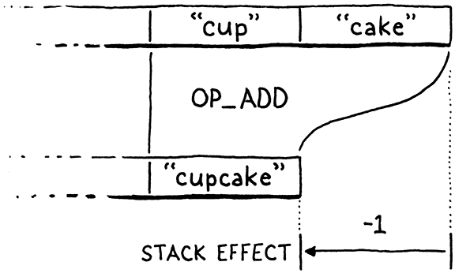

# 21. Global Variables 全局變量

> If only there could be an invention that bottled up a memory, like scent. And it never faded, and it never got stale. And then, when one wanted it, the bottle could be uncorked, and it would be like living the moment all over again.
>
> ​																		  —— Daphne du Maurier, *Rebecca*

如果有一種發明能把一段記憶裝進瓶子裏就好了，像香味一樣。它永遠不會褪色，也不會變質。然後，當一個人想要的時候，可以打開瓶塞，就像重新活在那個時刻一樣。（達芙妮-杜穆裏埃，《蝴蝶夢》）

> The [previous chapter](http://www.craftinginterpreters.com/hash-tables.html) was a long exploration of one big, deep, fundamental computer science data structure. Heavy on theory and concept. There may have been some discussion of big-O notation and algorithms. This chapter has fewer intellectual pretensions. There are no large ideas to learn. Instead, it’s a handful of straightforward engineering tasks. Once we’ve completed them, our virtual machine will support variables.

上一章對一個大的、深入的、基本的計算機科學數據結構進行了長時間的探索。偏重理論和概念。可能有一些關於大O符號和算法的討論。這一章沒有那麼多知識分子的自吹自擂。沒有什麼偉大的思想需要學習。相反，它是一些簡單的工程任務。一旦我們完成了這些任務，我們的虛擬機就可以支持變量。

> Actually, it will support only *global* variables. Locals are coming in the [next chapter](http://www.craftinginterpreters.com/local-variables.html). In jlox, we managed to cram them both into a single chapter because we used the same implementation technique for all variables. We built a chain of environments, one for each scope, all the way up to the top. That was a simple, clean way to learn how to manage state.

事實上，它將只支持*全局*變量。局部變量將在下一章中支持。在jlox中，我們設法將它們塞進了一個章節，因為我們對所有變量都使用了相同的實現技術。我們建立了一個環境鏈，每個作用域都有一個，一直到頂部作用域。這是學習如何管理狀態的一種簡單、乾淨的方法。

> But it’s also *slow*. Allocating a new hash table each time you enter a block or call a function is not the road to a fast VM. Given how much code is concerned with using variables, if variables go slow, everything goes slow. For clox, we’ll improve that by using a much more efficient strategy for local variables, but globals aren’t as easily optimized.

但它也很慢。每次進入一個代碼塊或調用一個函數時，都要分配一個新的哈希表，這不是通往快速虛擬機的道路。鑑於很多代碼都與使用變量有關，如果變量操作緩慢，一切都會變慢。對於clox，我們會通過對局部變量使用更有效的策略來改善這一點，但全局變量不那麼容易優化[^1]。

This is a common meta-strategy in sophisticated language implementations. Often, the same language feature will have multiple implementation techniques, each tuned for different use patterns. For example, JavaScript VMs often have a faster representation for objects that are used more like instances of classes compared to other objects whose set of properties is more freely modified. C and C++ compilers usually have a variety of ways to compile `switch` statements based on the number of cases and how densely packed the case values are.

> A quick refresher on Lox semantics: Global variables in Lox are “late bound”, or resolved dynamically. This means you can compile a chunk of code that refers to a global variable before it’s defined. As long as the code doesn’t *execute* before the definition happens, everything is fine. In practice, that means you can refer to later variables inside the body of functions.

快速複習一下Lox語義：Lox中的全局變量是“後期綁定”的，或者説是動態解析的。這意味着，你可以在全局變量被定義之前，編譯引用它的一大塊代碼。只要代碼在定義發生之前沒有執行，就沒有問題。在實踐中，這意味着你可以在函數的主體中引用後面的變量。

```c
fun showVariable() {
  print global;
}

var global = "after";
showVariable();
```

> Code like this might seem odd, but it’s handy for defining mutually recursive functions. It also plays nicer with the REPL. You can write a little function in one line, then define the variable it uses in the next.

這樣的代碼可能看起來很奇怪，但它對於定義相互遞歸的函數很方便。它與REPL的配合也更好。你可以在一行中編寫一個小函數，然後在下一行中定義它使用的變量。

> Local variables work differently. Since a local variable’s declaration *always* occurs before it is used, the VM can resolve them at compile time, even in a simple single-pass compiler. That will let us use a smarter representation for locals. But that’s for the next chapter. Right now, let’s just worry about globals.

局部變量的工作方式不同。因為局部變量的聲明總是發生在使用之前，虛擬機可以在編譯時解析它們，即使是在簡單的單遍編譯器中。這讓我們可以為局部變量使用更聰明的表示形式。但這是下一章的內容。現在，我們只考慮全局變量。

> ## 21 . 1 Statements

## 21.1 語句

> Variables come into being using variable declarations, which means now is also the time to add support for statements to our compiler. If you recall, Lox splits statements into two categories. “Declarations” are those statements that bind a new name to a value. The other kinds of statements—control flow, print, etc.—are just called “statements”. We disallow declarations directly inside control flow statements, like this:

變量是通過變量聲明產生的，這意味着現在是時候向編譯器中添加對語句的支持了。如果你還記得的話，Lox將語句分為兩類。“聲明”是那些將一個新名稱與值綁定的語句。其它類型的語句——控制流、打印等——只被稱為“語句”。我們不允許在控制流語句中直接使用聲明，像這樣：

```c
if (monday) var croissant = "yes"; // Error.
```

> Allowing it would raise confusing questions around the scope of the variable. So, like other languages, we prohibit it syntactically by having a separate grammar rule for the subset of statements that *are* allowed inside a control flow body.

允許這種做法會引發圍繞變量作用域的令人困惑的問題。因此，像其它語言一樣，對於允許出現在控制流主體內的語句子集，我們制定單獨的語法規則，從而禁止這種做法。

```c
statement      → exprStmt
               | forStmt
               | ifStmt
               | printStmt
               | returnStmt
               | whileStmt
               | block ;
```

> Then we use a separate rule for the top level of a script and inside a block.

然後，我們為腳本的頂層和代碼塊內部使用單獨的規則。

```c
declaration    → classDecl
               | funDecl
               | varDecl
               | statement ;
```

> The `declaration` rule contains the statements that declare names, and also includes `statement` so that all statement types are allowed. Since `block` itself is in `statement`, you can put declarations inside a control flow construct by nesting them inside a block.

`declaration`包含聲明名稱的語句，也包含`statement`規則，這樣所有的語句類型都是允許的。因為`block`本身就在`statement`中，你可以通過將聲明嵌套在代碼塊中的方式將它們放在控制流結構中[^2]。

> In this chapter, we’ll cover only a couple of statements and one declaration.

在本章中，我們只討論幾個語句和一個聲明。

```c
statement      → exprStmt
               | printStmt ;

declaration    → varDecl
               | statement ;
```

> Up to now, our VM considered a “program” to be a single expression since that’s all we could parse and compile. In a full Lox implementation, a program is a sequence of declarations. We’re ready to support that now.

到目前為止，我們的虛擬機都認為“程序”是一個表達式，因為我們只能解析和編譯一條表達式。在完整的Lox實現中，程序是一連串的聲明。我們現在已經準備要支持它了。

*<u>compiler.c，在compile()方法中替換2行：</u>*

```c
  advance();
  // 替換部分開始
  while (!match(TOKEN_EOF)) {
    declaration();
  }
  // 替換部分結束
  endCompiler();
```

> We keep compiling declarations until we hit the end of the source file. We compile a single declaration using this:

我們會一直編譯聲明語句，直到到達源文件的結尾。我們用這個方法來編譯一條聲明語句：

*<u>compiler.c，在expression()方法後添加代碼：</u>*

```c
static void declaration() {
  statement();
}
```

> We’ll get to variable declarations later in the chapter, so for now, we simply forward to `statement()`.

我們將在本章後面討論變量聲明，所以現在，我們直接使用`statement()`。

*<u>compiler.c，在declaration()方法後添加代碼：</u>*

```c
static void statement() {
  if (match(TOKEN_PRINT)) {
    printStatement();
  }
}
```

> Blocks can contain declarations, and control flow statements can contain other statements. That means these two functions will eventually be recursive. We may as well write out the forward declarations now.

代碼塊可以包含聲明，而控制流語句可以包含其它語句。這意味着這兩個函數最終是遞歸的。我們不妨現在就把前置聲明寫出來。

*<u>compiler.c，在expression()方法後添加代碼：</u>*

```c
static void expression();
// 新增部分開始
static void statement();
static void declaration();
// 新增部分結束
static ParseRule* getRule(TokenType type);
```

> ### 21 . 1 . 1 Print statements

### 21.1.1 Print語句

> We have two statement types to support in this chapter. Let’s start with `print` statements, which begin, naturally enough, with a `print` token. We detect that using this helper function:

在本章中，我們有兩種語句類型需要支持。我們從`print`語句開始，它自然是以`print`標識開頭的。我們使用這個輔助函數來檢測：

*<u>compiler.c，在consume()方法後添加代碼：</u>*

```c
static bool match(TokenType type) {
  if (!check(type)) return false;
  advance();
  return true;
}
```

> You may recognize it from jlox. If the current token has the given type, we consume the token and return `true`. Otherwise we leave the token alone and return `false`. This helper function is implemented in terms of this other helper:

你可能看出它是從jlox來的。如果當前的標識是指定類型，我們就消耗該標識並返回`true`。否則，我們就不處理該標識並返回`false`。這個輔助函數是通過另一個輔助函數實現的：

*<u>compiler.c，在consume()方法後添加代碼：</u>*

```c
static bool check(TokenType type) {
  return parser.current.type == type;
}
```

> The `check()` function returns `true` if the current token has the given type. It seems a little silly to wrap this in a function, but we’ll use it more later, and I think short verb-named functions like this make the parser easier to read.

如果當前標識符合給定的類型，`check()`函數返回`true`。將它封裝在一個函數中似乎有點傻，但我們以後會更多地使用它，而且我們認為像這樣簡短的動詞命名的函數使解析器更容易閲讀[^3]。

> If we did match the `print` token, then we compile the rest of the statement here:

如果我們確實匹配到了`print`標識，那麼我們在下面這個方法中編譯該語句的剩餘部分：

*<u>compiler.c，在expression()方法後添加代碼：</u>*

```c
static void printStatement() {
  expression();
  consume(TOKEN_SEMICOLON, "Expect ';' after value.");
  emitByte(OP_PRINT);
}
```

> A `print` statement evaluates an expression and prints the result, so we first parse and compile that expression. The grammar expects a semicolon after that, so we consume it. Finally, we emit a new instruction to print the result.

`print`語句會對錶達式求值並打印出結果，所以我們首先解析並編譯這個表達式。語法要求在表達式之後有一個分號，所以我們消耗一個分號標識。最後，我們生成一條新指令來打印結果。

*<u>chunk.h，在枚舉OpCode中添加代碼：</u>*

```c
  OP_NEGATE,
  // 新增部分開始
  OP_PRINT,
  // 新增部分結束
  OP_RETURN,
```

> At runtime, we execute this instruction like so:

在運行時，我們這樣執行這條指令：

*<u>vm.c，在run()方法中添加代碼：</u>*

```c
        break;
      // 新增部分開始  
      case OP_PRINT: {
        printValue(pop());
        printf("\n");
        break;
      }
      // 新增部分結束
      case OP_RETURN: {
```

> When the interpreter reaches this instruction, it has already executed the code for the expression, leaving the result value on top of the stack. Now we simply pop and print it.

當解釋器到達這條指令時，它已經執行了表達式的代碼，將結果值留在了棧頂。現在我們只需要彈出該值並打印。

> Note that we don’t push anything else after that. This is a key difference between expressions and statements in the VM. Every bytecode instruction has a **stack effect** that describes how the instruction modifies the stack. For example, `OP_ADD` pops two values and pushes one, leaving the stack one element smaller than before.

請注意，在此之後我們不會再向棧中壓入任何內容。這是虛擬機中表達式和語句之間的一個關鍵區別。每個字節碼指令都有**堆棧效應**，這個值用於描述指令如何修改堆棧內容。例如，`OP_ADD`會彈出兩個值並壓入一個值，使得棧中比之前少了一個元素[^4]。

> You can sum the stack effects of a series of instructions to get their total effect. When you add the stack effects of the series of instructions compiled from any complete expression, it will total one. Each expression leaves one result value on the stack.

你可以把一系列指令的堆棧效應相加，得到它們的總體效應。如果把從任何一個完整的表達式中編譯得到的一系列指令的堆棧效應相加，其總數是1。每個表達式會在棧中留下一個結果值。

> The bytecode for an entire statement has a total stack effect of zero. Since a statement produces no values, it ultimately leaves the stack unchanged, though it of course uses the stack while it’s doing its thing. This is important because when we get to control flow and looping, a program might execute a long series of statements. If each statement grew or shrank the stack, it might eventually overflow or underflow.

整個語句對應字節碼的總堆棧效應為0。因為語句不產生任何值，所以它最終會保持堆棧不變，儘管它在執行自己的操作時難免會使用堆棧。這一點很重要，因為等我們涉及到控制流和循環時，一個程序可能會執行一長串的語句。如果每條語句都增加或減少堆棧，最終就可能會溢出或下溢。

> While we’re in the interpreter loop, we should delete a bit of code.

在解釋器循環中，我們應該刪除一些代碼。

*<u>vm.c，在run()方法中替換2行：</u>*

```c
      case OP_RETURN: {
        // 替換部分開始
        // Exit interpreter.
        // 替換部分結束
        return INTERPRET_OK;
```

> When the VM only compiled and evaluated a single expression, we had some temporary code in `OP_RETURN` to output the value. Now that we have statements and `print`, we don’t need that anymore. We’re one step closer to the complete implementation of clox.

當虛擬機只編譯和計算一條表達式時，我們在`OP_RETURN`中使用一些臨時代碼來輸出值。現在我們已經有了語句和`print`，就不再需要這些了。我們離clox的完全實現又近了一步[^5]。

> As usual, a new instruction needs support in the disassembler.

像往常一樣，一條新指令需要反彙編程序的支持。

*<u>debug.c，在disassembleInstruction()方法中添加代碼：</u>*

```c
      return simpleInstruction("OP_NEGATE", offset);
    // 新增部分開始  
    case OP_PRINT:
      return simpleInstruction("OP_PRINT", offset);
    // 新增部分結束  
    case OP_RETURN:
```

> That’s our `print` statement. If you want, give it a whirl:

這就是我們的`print`語句。如果你願意，可以試一試：

```c
print 1 + 2;
print 3 * 4;
```

> Exciting! OK, maybe not thrilling, but we can build scripts that contain as many statements as we want now, which feels like progress.

令人興奮！好吧，也許沒有那麼激動人心，但是我們現在可以構建包含任意多語句的腳本，這感覺是一種進步。

> ### 21 . 1 . 2 Expression statements

### 21.1.2 表達式語句

> Wait until you see the next statement. If we *don’t* see a `print` keyword, then we must be looking at an expression statement.

等待，直到你看到下一條語句。如果沒有看到`print`關鍵字，那麼我們看到的一定是一條表達式語句。

*<u>compiler.c，在statement()方法中添加代碼：</u>*

```c
    printStatement();
  // 新增部分開始  
  } else {
    expressionStatement();
  // 新增部分結束  
  }
```

> It’s parsed like so:

它是這樣解析的：

*<u>compiler.c，在expression()方法後添加代碼：</u>*

```c
static void expressionStatement() {
  expression();
  consume(TOKEN_SEMICOLON, "Expect ';' after expression.");
  emitByte(OP_POP);
}
```

> An “expression statement” is simply an expression followed by a semicolon. They’re how you write an expression in a context where a statement is expected. Usually, it’s so that you can call a function or evaluate an assignment for its side effect, like this:

“表達式語句”就是一個表達式後面跟着一個分號。這是在需要語句的上下文中寫表達式的方式。通常來説，這樣你就可以調用函數或執行賦值操作以觸發其副作用，像這樣：

```c
brunch = "quiche";
eat(brunch);
```

> Semantically, an expression statement evaluates the expression and discards the result. The compiler directly encodes that behavior. It compiles the expression, and then emits an `OP_POP` instruction.

從語義上説，表達式語句會對錶達式求值並丟棄結果。編譯器直接對這種行為進行編碼。它會編譯表達式，然後生成一條`OP_POP`指令。

*<u>chunk.h，在枚舉OpCode中添加代碼：</u>*

```c
  OP_FALSE,
  // 新增部分開始
  OP_POP,
  // 新增部分結束
  OP_EQUAL,
```

> As the name implies, that instruction pops the top value off the stack and forgets it.

顧名思義，該指令會彈出棧頂的值並將其遺棄。

*<u>vm.c，在run()方法中添加代碼：</u>*

```c
      case OP_FALSE: push(BOOL_VAL(false)); break;
      // 新增部分開始 
      case OP_POP: pop(); break;
      // 新增部分結束
      case OP_EQUAL: {
```

> We can disassemble it too.

我們也可以對它進行反彙編。

*<u>debug.c，在disassembleInstruction()方法中添加代碼：</u>*

```c
      return simpleInstruction("OP_FALSE", offset);
    // 新增部分開始  
    case OP_POP:
      return simpleInstruction("OP_POP", offset);
    // 新增部分結束
    case OP_EQUAL:
```

> Expression statements aren’t very useful yet since we can’t create any expressions that have side effects, but they’ll be essential when we [add functions later](http://www.craftinginterpreters.com/calls-and-functions.html). The majority of statements in real-world code in languages like C are expression statements.

表達式語句現在還不是很有用，因為我們無法創建任何有副作用的表達式，但等我們後面添加函數時，它們將是必不可少的。在像C這樣的真正語言中，大部分語句都是表達式語句[^6]。

> ### 21 . 1 . 3 Error synchronization

### 21.1.3 錯誤同步

> While we’re getting this initial work done in the compiler, we can tie off a loose end we left [several chapters back](http://www.craftinginterpreters.com/compiling-expressions.html#handling-syntax-errors). Like jlox, clox uses panic mode error recovery to minimize the number of cascaded compile errors that it reports. The compiler exits panic mode when it reaches a synchronization point. For Lox, we chose statement boundaries as that point. Now that we have statements, we can implement synchronization.

當我們在編譯器中完成這些初始化工作時，我們可以把前幾章遺留的一個小尾巴處理一下。與jlox一樣，clox也使用了恐慌模式下的錯誤恢復來減少它所報告的級聯編譯錯誤。當編譯器到達同步點時，就退出恐慌模式。對於Lox來説，我們選擇語句邊界作為同步點。現在我們有了語句，就可以實現同步了。

*<u>compiler.c，在declaration()方法中添加代碼：</u>*

```c
  statement();
  // 新增部分開始
  if (parser.panicMode) synchronize();
  // 新增部分結束
}
```

> If we hit a compile error while parsing the previous statement, we enter panic mode. When that happens, after the statement we start synchronizing.

如果我們在解析前一條語句時遇到編譯錯誤，我們就會進入恐慌模式。當這種情況發生時，我們會在這條語句之後開始同步。

*<u>compiler.c，在printStatement()方法後添加代碼：</u>*

```c
static void synchronize() {
  parser.panicMode = false;

  while (parser.current.type != TOKEN_EOF) {
    if (parser.previous.type == TOKEN_SEMICOLON) return;
    switch (parser.current.type) {
      case TOKEN_CLASS:
      case TOKEN_FUN:
      case TOKEN_VAR:
      case TOKEN_FOR:
      case TOKEN_IF:
      case TOKEN_WHILE:
      case TOKEN_PRINT:
      case TOKEN_RETURN:
        return;

      default:
        ; // Do nothing.
    }

    advance();
  }
}
```

> We skip tokens indiscriminately until we reach something that looks like a statement boundary. We recognize the boundary by looking for a preceding token that can end a statement, like a semicolon. Or we’ll look for a subsequent token that begins a statement, usually one of the control flow or declaration keywords.

我們會不分青紅皂白地跳過標識，直到我們到達一個看起來像是語句邊界的位置。我們識別邊界的方式包括，查找可以結束一條語句的前驅標識，如分號；或者我們可以查找能夠開始一條語句的後續標識，通常是控制流或聲明語句的關鍵字之一。

> ## 21 . 2 Variable Declarations

## 21.2 變量聲明

> Merely being able to *print* doesn’t win your language any prizes at the programming language fair, so let’s move on to something a little more ambitious and get variables going. There are three operations we need to support:

僅僅能夠*打印*並不能為你的語言在編程語言博覽會上贏得任何獎項，所以讓我們繼續做一些更有野心的事，讓變量發揮作用。我們需要支持三種操作：

- > Declaring a new variable using a `var` statement.

  使用`var`語句聲明一個新變量

- > Accessing the value of a variable using an identifier expression.

  使用標識符表達式訪問一個變量的值

- > Storing a new value in an existing variable using an assignment expression.

  使用賦值表達式將一個新的值存儲在現有的變量中

> We can’t do either of the last two until we have some variables, so we start with declarations.

等我們有了變量以後，才能做後面兩件事，所以我們從聲明開始。

*<u>compiler.c，在declaration()方法中替換1行：</u>*

```c
static void declaration() {
  // 替換部分開始
  if (match(TOKEN_VAR)) {
    varDeclaration();
  } else {
    statement();
  }
  // 替換部分結束
  if (parser.panicMode) synchronize();
```

> The placeholder parsing function we sketched out for the declaration grammar rule has an actual production now. If we match a `var` token, we jump here:
>

我們為聲明語法規則建立的佔位解析函數現在已經有了實際的生成式。如果我們匹配到一個`var`標識，就跳轉到這裏：

*<u>compiler.c，在expression()方法後添加代碼：</u>*

```c
static void varDeclaration() {
  uint8_t global = parseVariable("Expect variable name.");

  if (match(TOKEN_EQUAL)) {
    expression();
  } else {
    emitByte(OP_NIL);
  }
  consume(TOKEN_SEMICOLON,
          "Expect ';' after variable declaration.");

  defineVariable(global);
}
```

> The keyword is followed by the variable name. That’s compiled by `parseVariable()`, which we’ll get to in a second. Then we look for an `=` followed by an initializer expression. If the user doesn’t initialize the variable, the compiler implicitly initializes it to `nil` by emitting an `OP_NIL` instruction. Either way, we expect the statement to be terminated with a semicolon.

關鍵字後面跟着變量名。它是由`parseVariable()`編譯的，我們馬上就會講到。然後我們會尋找一個`=`，後跟初始化表達式。如果用户沒有初始化變量，編譯器會生成`OP_NIL`指令隱式地將其初始化為`nil`[^7]。無論哪種方式，我們都希望語句以分號結束。

> There are two new functions here for working with variables and identifiers. Here is the first:

這裏有兩個新函數用於處理變量和標識符。下面是第一個：

*<u>compiler.c，在parsePrecedence()方法後添加代碼：</u>*

```c
static void parsePrecedence(Precedence precedence);
// 新增部分開始
static uint8_t parseVariable(const char* errorMessage) {
  consume(TOKEN_IDENTIFIER, errorMessage);
  return identifierConstant(&parser.previous);
}
// 新增部分結束
```

> It requires the next token to be an identifier, which it consumes and sends here:

它要求下一個標識是一個標識符，它會消耗該標識併發送到這裏：

*<u>compiler.c，在parsePrecedence()方法後添加代碼：</u>*

```c
static void parsePrecedence(Precedence precedence);
// 新增部分開始
static uint8_t identifierConstant(Token* name) {
  return makeConstant(OBJ_VAL(copyString(name->start,
                                         name->length)));
}
// 新增部分結束
```

> This function takes the given token and adds its lexeme to the chunk’s constant table as a string. It then returns the index of that constant in the constant table.

這個函數接受給定的標識，並將其詞素作為一個字符串添加到字節碼塊的常量表中。然後，它會返回該常量在常量表中的索引。

> Global variables are looked up *by name* at runtime. That means the VM—the bytecode interpreter loop—needs access to the name. A whole string is too big to stuff into the bytecode stream as an operand. Instead, we store the string in the constant table and the instruction then refers to the name by its index in the table.

全局變量在運行時是按*名稱*查找的。這意味着虛擬機（字節碼解釋器循環）需要訪問該名稱。整個字符串太大，不能作為操作數塞進字節碼流中。相反，我們將字符串存儲到常量表中，然後指令通過該名稱在表中的索引來引用它。

> This function returns that index all the way to `varDeclaration()` which later hands it over to here:

這個函數會將索引一直返回給`varDeclaration()`，隨後又將其傳遞到這裏：

*<u>compiler.c，在parseVariable()方法後添加代碼：</u>*

```c
static void defineVariable(uint8_t global) {
  emitBytes(OP_DEFINE_GLOBAL, global);
}
```

> This outputs the bytecode instruction that defines the new variable and stores its initial value. The index of the variable’s name in the constant table is the instruction’s operand. As usual in a stack-based VM, we emit this instruction last. At runtime, we execute the code for the variable’s initializer first. That leaves the value on the stack. Then this instruction takes that value and stores it away for later.

它會輸出字節碼指令，用於定義新變量並存儲其初始化值。變量名在常量表中的索引是該指令的操作數。在基於堆棧的虛擬機中，我們通常是最後發出這條指令。在運行時，我們首先執行變量初始化器的代碼，將值留在棧中。然後這條指令會獲取該值並保存起來，以供日後使用[^8]。

> Over in the runtime, we begin with this new instruction:

在運行時，我們從這條新指令開始：

*<u>chunk.h，在枚舉OpCode中添加代碼：</u>*

```c
  OP_POP,
  // 新增部分開始
  OP_DEFINE_GLOBAL,
  // 新增部分結束
  OP_EQUAL,
```

> Thanks to our handy-dandy hash table, the implementation isn’t too hard.

多虧了我們方便的哈希表，實現起來並不太難。

*<u>vm.c，在run()方法中添加代碼：</u>*

```c
      case OP_POP: pop(); break;
      // 新增部分開始
      case OP_DEFINE_GLOBAL: {
        ObjString* name = READ_STRING();
        tableSet(&vm.globals, name, peek(0));
        pop();
        break;
      }
      // 新增部分結束
      case OP_EQUAL: {
```

> We get the name of the variable from the constant table. Then we take the value from the top of the stack and store it in a hash table with that name as the key.

我們從常量表中獲取變量的名稱，然後我們從棧頂獲取值，並以該名稱為鍵將其存儲在哈希表中[^9]。

> This code doesn’t check to see if the key is already in the table. Lox is pretty lax with global variables and lets you redefine them without error. That’s useful in a REPL session, so the VM supports that by simply overwriting the value if the key happens to already be in the hash table.

這段代碼並沒有檢查鍵是否已經在表中。Lox對全局變量的處理非常寬鬆，允許你重新定義它們而且不會出錯。這在REPL會話中很有用，如果鍵恰好已經在哈希表中，虛擬機通過簡單地覆蓋值來支持這一點。

> There’s another little helper macro:

還有另一個小的輔助宏：

*<u>vm.c，在run()方法中添加代碼：</u>*

```c
#define READ_CONSTANT() (vm.chunk->constants.values[READ_BYTE()])
// 新增部分開始
#define READ_STRING() AS_STRING(READ_CONSTANT())
// 新增部分結束
#define BINARY_OP(valueType, op) \
```

> It reads a one-byte operand from the bytecode chunk. It treats that as an index into the chunk’s constant table and returns the string at that index. It doesn’t check that the value *is* a string—it just indiscriminately casts it. That’s safe because the compiler never emits an instruction that refers to a non-string constant.

它從字節碼塊中讀取一個1字節的操作數。它將其視為字節碼塊的常量表的索引，並返回該索引處的字符串。它不檢查該值是否是字符串——它只是不加區分地進行類型轉換。這是安全的，因為編譯器永遠不會發出引用非字符串常量的指令。

> Because we care about lexical hygiene, we also undefine this macro at the end of the interpret function.

因為我們關心詞法衞生，所以在解釋器函數的末尾也取消了這個宏的定義。

*<u>vm.c，在run()方法中添加代碼：</u>*

```c
#undef READ_CONSTANT
// 新增部分開始
#undef READ_STRING
// 新增部分結束
#undef BINARY_OP
```

> I keep saying “the hash table”, but we don’t actually have one yet. We need a place to store these globals. Since we want them to persist as long as clox is running, we store them right in the VM.

我一直在説“哈希表”，但實際上我們還沒有哈希表。我們需要一個地方來存儲這些全局變量。因為我們希望它們在clox運行期間一直存在，所以我們將它們之間存儲在虛擬機中。

*<u>vm.h，在結構體VM中添加代碼：</u>*

```c
  Value* stackTop;
  // 新增部分開始
  Table globals;
  // 新增部分結束
  Table strings;
```

> As we did with the string table, we need to initialize the hash table to a valid state when the VM boots up.

正如我們對字符串表所做的那樣，我們需要在虛擬機啓動時將哈希表初始化為有效狀態。

*<u>vm.c，在initVM()方法中添加代碼：</u>*

```c
  vm.objects = NULL;
  // 新增部分開始
  initTable(&vm.globals);
  // 新增部分結束
  initTable(&vm.strings);
```

> And we tear it down when we exit.

當我們退出時，就將其刪掉[^10]。

*<u>vm.c，在freeVM()方法中添加代碼：</u>*

```c
void freeVM() {
  // 新增部分開始
  freeTable(&vm.globals);
  // 新增部分結束
  freeTable(&vm.strings);
```

> As usual, we want to be able to disassemble the new instruction too.

跟往常一樣，我們也希望能夠對新指令進行反彙編。

*<u>debug.c，在disassembleInstruction()方法中添加代碼：</u>*

```c
      return simpleInstruction("OP_POP", offset);
    // 新增部分開始  
    case OP_DEFINE_GLOBAL:
      return constantInstruction("OP_DEFINE_GLOBAL", chunk,
                                 offset);
    // 新增部分結束                             
    case OP_EQUAL:
```

> And with that, we can define global variables. Not that users can *tell* that they’ve done so, because they can’t actually *use* them. So let’s fix that next.
>

有了這個，我們就可以定義全局變量了。但用户並不能説他們可以定義全局變量，因為他們實際上還不能使用這些變量。所以，接下來我們解決這個問題。

> ## 21 . 3 Reading Variables

## 21.3 讀取變量

> As in every programming language ever, we access a variable’s value using its name. We hook up identifier tokens to the expression parser here:

像所有編程語言中一樣，我們使用變量的名稱來訪問它的值。我們在這裏將標識符和表達式解析器進行掛鈎：

*<u>compiler.c，替換1行：</u>*

```c
  [TOKEN_LESS_EQUAL]    = {NULL,     binary, PREC_COMPARISON},
  // 替換部分開始
  [TOKEN_IDENTIFIER]    = {variable, NULL,   PREC_NONE},
  // 替換部分結束
  [TOKEN_STRING]        = {string,   NULL,   PREC_NONE},
```

> That calls this new parser function:

這裏調用了這個新解析器函數：

*<u>compiler.c，在string()方法後添加代碼：</u>*

```c
static void variable() {
  namedVariable(parser.previous);
}
```

> Like with declarations, there are a couple of tiny helper functions that seem pointless now but will become more useful in later chapters. I promise.

和聲明一樣，這裏有幾個小的輔助函數，現在看起來毫無意義，但在後面的章節中會變得更加有用。我保證。

*<u>compiler.c，在string()方法後添加代碼：</u>*

```c
static void namedVariable(Token name) {
  uint8_t arg = identifierConstant(&name);
  emitBytes(OP_GET_GLOBAL, arg);
}
```

> This calls the same `identifierConstant()` function from before to take the given identifier token and add its lexeme to the chunk’s constant table as a string. All that remains is to emit an instruction that loads the global variable with that name. Here’s the instruction:

這裏會調用與之前相同的`identifierConstant()`函數，以獲取給定的標識符標識，並將其詞素作為字符串添加到字節碼塊的常量表中。剩下的工作就是生成一條指令，加載具有該名稱的全局變量。下面是這個指令：

*<u>chunk.h，在枚舉OpCode中添加代碼：</u>*

```c
  OP_POP,
  // 新增部分開始
  OP_GET_GLOBAL,
  // 新增部分結束
  OP_DEFINE_GLOBAL,
```

> Over in the interpreter, the implementation mirrors `OP_DEFINE_GLOBAL`.

在解釋器中，它的實現是`OP_DEFINE_GLOBAL`的鏡像操作。

*<u>vm.c，在run()方法中添加代碼：</u>*

```c
      case OP_POP: pop(); break;
      // 新增部分開始
      case OP_GET_GLOBAL: {
        ObjString* name = READ_STRING();
        Value value;
        if (!tableGet(&vm.globals, name, &value)) {
          runtimeError("Undefined variable '%s'.", name->chars);
          return INTERPRET_RUNTIME_ERROR;
        }
        push(value);
        break;
      }
      // 新增部分結束
      case OP_DEFINE_GLOBAL: {
```

> We pull the constant table index from the instruction’s operand and get the variable name. Then we use that as a key to look up the variable’s value in the globals hash table.

我們從指令操作數中提取常量表索引並獲得變量名稱。然後我們使用它作為鍵，在全局變量哈希表中查找變量的值。

> If the key isn’t present in the hash table, it means that global variable has never been defined. That’s a runtime error in Lox, so we report it and exit the interpreter loop if that happens. Otherwise, we take the value and push it onto the stack.

如果該鍵不在哈希表中，就意味着這個全局變量從未被定義過。這在Lox中是運行時錯誤，所以如果發生這種情況，我們要報告錯誤並退出解釋器循環。否則，我們獲取該值並將其壓入棧中。

*<u>debug.c，在disassembleInstruction()方法中添加代碼：</u>*

```c
      return simpleInstruction("OP_POP", offset);
    // 新增部分開始  
    case OP_GET_GLOBAL:
      return constantInstruction("OP_GET_GLOBAL", chunk, offset);
    // 新增部分結束  
    case OP_DEFINE_GLOBAL:
```

> A little bit of disassembling, and we’re done. Our interpreter is now able to run code like this:

稍微反彙編一下，就完成了。我們的解釋器現在可以運行這樣的代碼了：

```ruby
var beverage = "cafe au lait";
var breakfast = "beignets with " + beverage;
print breakfast;
```

> There’s only one operation left.

只剩一個操作了。

> ## 21 . 4 Assignment

## 21.4 賦值

> Throughout this book, I’ve tried to keep you on a fairly safe and easy path. I don’t avoid hard *problems*, but I try to not make the *solutions* more complex than they need to be. Alas, other design choices in our bytecode compiler make assignment annoying to implement.

在這本書中，我一直試圖讓你走在一條相對安全和簡單的道路上。我並不迴避困難的*問題*，但是我儘量不讓解決方案過於複雜。可惜的是，我們的字節碼編譯器中的其它設計選擇使得賦值的實現變得很麻煩[^11]。

> Our bytecode VM uses a single-pass compiler. It parses and generates bytecode on the fly without any intermediate AST. As soon as it recognizes a piece of syntax, it emits code for it. Assignment doesn’t naturally fit that. Consider:

我們的字節碼虛擬機使用的是單遍編譯器。它在不需要任何中間AST的情況下，動態地解析並生成字節碼。一旦它識別出某個語法，它就會生成對應的字節碼。賦值操作天然不符合這一點。請考慮一下：

```c
menu.brunch(sunday).beverage = "mimosa";
```

> In this code, the parser doesn’t realize `menu.brunch(sunday).beverage` is the target of an assignment and not a normal expression until it reaches `=`, many tokens after the first `menu`. By then, the compiler has already emitted bytecode for the whole thing.

在這段代碼中，直到解析器遇見`=`（第一個`menu`之後很多個標識），它才能意識到`menu.brunch(sunday).beverage`是賦值操作的目標，而不是常規的表達式。到那時，編譯器已經為整個代碼生成字節碼了。

> The problem is not as dire as it might seem, though. Look at how the parser sees that example:

不過，這個問題並不像看上去那麼可怕。看看解析器是如何處理這個例子的：


> Even though the `.beverage` part must not be compiled as a get expression, everything to the left of the `.` is an expression, with the normal expression semantics. The `menu.brunch(sunday)` part can be compiled and executed as usual.

儘管`.beverage`部分無法被編譯為一個get表達式，`.`左側的其它部分是一個表達式，有着正常的表達式語義。`menu.brunch(sunday)`部分可以像往常一樣編譯和執行。

> Fortunately for us, the only semantic differences on the left side of an assignment appear at the very right-most end of the tokens, immediately preceding the `=`. Even though the receiver of a setter may be an arbitrarily long expression, the part whose behavior differs from a get expression is only the trailing identifier, which is right before the `=`. We don’t need much lookahead to realize `beverage` should be compiled as a set expression and not a getter.

幸運的是，賦值語句左側部分唯一的語義差異在於其最右側的標識，緊挨着`=`之前。儘管setter的接收方可能是一個任意長的表達式，但與get表達式不同的部分在於尾部的標識符，它就在`=`之前。我們不需要太多的前瞻就可以意識到`beverage`應該被編譯為set表達式而不是getter。

> Variables are even easier since they are just a single bare identifier before an `=`. The idea then is that right *before* compiling an expression that can also be used as an assignment target, we look for a subsequent `=` token. If we see one, we compile it as an assignment or setter instead of a variable access or getter.

變量就更簡單了，因為它們在`=`之前就是一個簡單的標識符。那麼我們的想法是，在編譯一個也可以作為賦值目標的表達式*之前*，我們會尋找隨後的`=`標識。如果我們看到了，那表明我們將其一個賦值表達式或setter來編譯，而不是變量訪問或getter。

> We don’t have setters to worry about yet, so all we need to handle are variables.

我們還不需要考慮setter，所以我們需要處理的就是變量。

*<u>compiler.c，在namedVariable()方法中替換1行：</u>*

```c
  uint8_t arg = identifierConstant(&name);
  // 替換部分開始
  if (match(TOKEN_EQUAL)) {
    expression();
    emitBytes(OP_SET_GLOBAL, arg);
  } else {
    emitBytes(OP_GET_GLOBAL, arg);
  }
  // 替換部分結束
}
```

> In the parse function for identifier expressions, we look for an equals sign after the identifier. If we find one, instead of emitting code for a variable access, we compile the assigned value and then emit an assignment instruction.

在標識符表達式的解析函數中，我們會查找標識符後面的等號。如果找到了，我們就不會生成變量訪問的代碼，我們會編譯所賦的值，然後生成一個賦值指令。

> That’s the last instruction we need to add in this chapter.

這就是我們在本章中需要添加的最後一條指令。

*<u>chunk.h，在枚舉OpCode中添加代碼：</u>*

```c
  OP_DEFINE_GLOBAL,
  // 新增部分開始
  OP_SET_GLOBAL,
  // 新增部分結束
  OP_EQUAL,
```

> As you’d expect, its runtime behavior is similar to defining a new variable.

如你所想，它的運行時行為類似於定義一個新變量。

*<u>vm.c，在run()方法中添加代碼[^12]：</u>*

```c
      }
      // 新增部分開始
      case OP_SET_GLOBAL: {
        ObjString* name = READ_STRING();
        if (tableSet(&vm.globals, name, peek(0))) {
          tableDelete(&vm.globals, name); 
          runtimeError("Undefined variable '%s'.", name->chars);
          return INTERPRET_RUNTIME_ERROR;
        }
        break;
      }
      // 新增部分結束
      case OP_EQUAL: {
```

> The main difference is what happens when the key doesn’t already exist in the globals hash table. If the variable hasn’t been defined yet, it’s a runtime error to try to assign to it. Lox [doesn’t do implicit variable declaration](http://www.craftinginterpreters.com/statements-and-state.html#design-note).

主要的區別在於，當鍵在全局變量哈希表中不存在時會發生什麼。如果這個變量還沒有定義，對其進行賦值就是一個運行時錯誤。Lox不做隱式的變量聲明。

> The other difference is that setting a variable doesn’t pop the value off the stack. Remember, assignment is an expression, so it needs to leave that value there in case the assignment is nested inside some larger expression.

另一個區別是，設置變量並不會從棧中彈出值。記住，賦值是一個表達式，所以它需要把這個值保留在那裏，以防賦值嵌套在某個更大的表達式中。

> Add a dash of disassembly:

加一點反彙編代碼：

*<u>debug.c，在disassembleInstruction()方法中添加代碼：</u>*

```c
      return constantInstruction("OP_DEFINE_GLOBAL", chunk,
                                 offset);
    // 新增部分開始                             
    case OP_SET_GLOBAL:
      return constantInstruction("OP_SET_GLOBAL", chunk, offset);
    // 新增部分結束  
    case OP_EQUAL:
```

> So we’re done, right? Well . . . not quite. We’ve made a mistake! Take a gander at:

我們已經完成了，是嗎？嗯……不完全是。我們犯了一個錯誤！看一下這個：

```c
a * b = c + d;
```

> According to Lox’s grammar, `=` has the lowest precedence, so this should be parsed roughly like:

根據Lox語法，`=`的優先級最低，所以這大致應該解析為：


> Obviously, `a * b` isn’t a valid assignment target, so this should be a syntax error. But here’s what our parser does:

顯然，`a*b`不是一個有效的賦值目標[^13]，所以這應該是一個語法錯誤。但我們的解析器是這樣的：

> 1. First, `parsePrecedence()` parses `a` using the `variable()` prefix parser.
> 2. After that, it enters the infix parsing loop.
> 3. It reaches the `*` and calls `binary()`.
> 4. That recursively calls `parsePrecedence()` to parse the right-hand operand.
> 5. That calls `variable()` again for parsing `b`.
> 6. Inside that call to `variable()`, it looks for a trailing `=`. It sees one and thus parses the rest of the line as an assignment.

1. 首先，`parsePrecedence()`使用`variable()`前綴解析器解析`a`。
2. 之後，會進入中綴解析循環。
3. 達到`*`，並調用`binary()`。
4. 遞歸地調用`parsePrecedence()`解析右操作數。
5. 再次調用`variable()`解析`b`。
6. 在對`variable()`的調用中，會查找尾部的`=`。它看到了，因此會將本行的其餘部分解析為一個賦值表達式。

> In other words, the parser sees the above code like:

換句話説，解析器將上面的代碼看作：


> We’ve messed up the precedence handling because `variable()` doesn’t take into account the precedence of the surrounding expression that contains the variable. If the variable happens to be the right-hand side of an infix operator, or the operand of a unary operator, then that containing expression is too high precedence to permit the `=`.

我們搞砸了優先級處理，因為`variable()`沒有考慮包含變量的外圍表達式的優先級。如果變量恰好是中綴操作符的右操作數，或者是一元操作符的操作數，那麼這個包含表達式的優先級太高，不允許使用`=`。

> To fix this, `variable()` should look for and consume the `=` only if it’s in the context of a low-precedence expression. The code that knows the current precedence is, logically enough, `parsePrecedence()`. The `variable()` function doesn’t need to know the actual level. It just cares that the precedence is low enough to allow assignment, so we pass that fact in as a Boolean.

為了解決這個問題，`variable()`應該只在低優先級表達式的上下文中尋找並使用`=`。從邏輯上講，知道當前優先級的代碼是`parsePrecedence()`。`variable()`函數不需要知道實際的級別。它只關心優先級是否低到允許賦值表達式，所以我們把這個情況以布爾值傳入。

*<u>compiler.c，在parsePrecedence()方法中替換1行：</u>*

```c
    error("Expect expression.");
    return;
  }
  // 替換部分開始
  bool canAssign = precedence <= PREC_ASSIGNMENT;
  prefixRule(canAssign);
  // 替換部分結束
  while (precedence <= getRule(parser.current.type)->precedence) {
```

> Since assignment is the lowest-precedence expression, the only time we allow an assignment is when parsing an assignment expression or top-level expression like in an expression statement. That flag makes its way to the parser function here:

因為賦值是最低優先級的表達式，只有在解析賦值表達式或如表達式語句等頂層表達式時，才允許出現賦值。這個標誌會被傳入這個解析器函數：

*<u>compiler.c，在variable()函數中替換3行：</u>*

```c
static void variable(bool canAssign) {
  namedVariable(parser.previous, canAssign);
}
```

> Which passes it through a new parameter:

通過一個新參數透傳該值：

*<u>compiler.c，在namedVariable()方法中替換1行：</u>*

```c
// 替換部分開始
static void namedVariable(Token name, bool canAssign) {
  // 替換部分結束
  uint8_t arg = identifierConstant(&name);
```

> And then finally uses it here:

最後在這裏使用它：

```
  uint8_t arg = identifierConstant(&name);
```

*<u>compiler.c，在namedVariable()方法中替換1行：</u>*

```c
  uint8_t arg = identifierConstant(&name);
  // 替換部分開始
  if (canAssign && match(TOKEN_EQUAL)) {
  // 替換部分結束
    expression();
```

> That’s a lot of plumbing to get literally one bit of data to the right place in the compiler, but arrived it has. If the variable is nested inside some expression with higher precedence, `canAssign` will be `false` and this will ignore the `=` even if there is one there. Then `namedVariable()` returns, and execution eventually makes its way back to `parsePrecedence()`.

為了把字面上的1比特數據送到編譯器的正確位置需要做很多工作，但它已經到達了。如果變量嵌套在某個優先級更高的表達式中，`canAssign`將為`false`，即使有`=`也會被忽略。然後`namedVariable()`返回，執行最終返回到了`parsePrecedence()`。

> Then what? What does the compiler do with our broken example from before? Right now, `variable()` won’t consume the `=`, so that will be the current token. The compiler returns back to `parsePrecedence()` from the `variable()` prefix parser and then tries to enter the infix parsing loop. There is no parsing function associated with `=`, so it skips that loop.

然後呢？編譯器會對我們前面的負面例子做什麼？現在，`variable()`不會消耗`=`，所以它將是當前的標識。編譯器從`variable()`前綴解析器返回到`parsePrecedence()`，然後嘗試進入中綴解析循環。沒有與`=`相關的解析函數，因此也會跳過這個循環。

> Then `parsePrecedence()` silently returns back to the caller. That also isn’t right. If the `=` doesn’t get consumed as part of the expression, nothing else is going to consume it. It’s an error and we should report it.

然後`parsePrecedence()`默默地返回到調用方。這也是不對的。如果`=`沒有作為表達式的一部分被消耗，那麼其它任何東西都不會消耗它。這是一個錯誤，我們應該報告它。

*<u>compiler.c，在parsePrecedence()方法中添加代碼：</u>*

```c
    infixRule();
  }
  // 新增部分開始
  if (canAssign && match(TOKEN_EQUAL)) {
    error("Invalid assignment target.");
  }
  // 新增部分結束
}
```

> With that, the previous bad program correctly gets an error at compile time. OK, *now* are we done? Still not quite. See, we’re passing an argument to one of the parse functions. But those functions are stored in a table of function pointers, so all of the parse functions need to have the same type. Even though most parse functions don’t support being used as an assignment target—setters are the only other one—our friendly C compiler requires them *all* to accept the parameter.

這樣，前面的錯誤程序在編譯時就會正確地得到一個錯誤。好了，現在我們完成了嗎？也不盡然。看，我們正向一個解析函數傳遞參數。但是這些函數是存儲在一個函數指令表格中的，所以所有的解析函數需要具有相同的類型。儘管大多數解析函數都不支持被用作賦值目標——setter是唯一的一個[^14]——但我們這個友好的C編譯器要求它們*都*接受相同的參數。

> So we’re going to finish off this chapter with some grunt work. First, let’s go ahead and pass the flag to the infix parse functions.

所以我們要做一些苦差事來結束這一章。首先，讓我們繼續前進，將標誌傳給中綴解析函數。

*<u>compiler.c，在parsePrecedence()方法中替換1行：</u>*

```c
    ParseFn infixRule = getRule(parser.previous.type)->infix;
    // 替換部分開始
    infixRule(canAssign);
    // 替換部分結束
  }
```

> We’ll need that for setters eventually. Then we’ll fix the typedef for the function type.

我們最終會在setter中需要它。然後，我們要修復函數類型的類型定義。

*<u>compiler.c，在枚舉Precedence後替換1行：</u>*

```c
} Precedence;
// 替換部分開始
typedef void (*ParseFn)(bool canAssign);
// 替換部分結束
typedef struct {
```

> And some completely tedious code to accept this parameter in all of our existing parse functions. Here:

還有一些非常乏味的代碼，為了在所有的現有解析函數中接受這個參數。這裏：

*<u>compiler.c，在binary()方法中替換1行：</u>*

```c
// 替換部分開始
static void binary(bool canAssign) {
// 替換部分結束
  TokenType operatorType = parser.previous.type;
```

這裏:

*<u>compiler.c，在literal()方法中替換1行：</u>*

```c
// 替換部分開始
static void literal(bool canAssign) {
// 替換部分結束
  switch (parser.previous.type) {
```

這裏:

*<u>compiler.c，在grouping()方法中替換1行：</u>*

```c
// 替換部分開始
static void grouping(bool canAssign) {
// 替換部分結束
  expression();
```

這裏:

*<u>compiler.c，在number()方法中替換1行：</u>*

```c
// 替換部分開始
static void number(bool canAssign) {
// 替換部分結束
  double value = strtod(parser.previous.start, NULL);
```

還有這裏:

*<u>compiler.c，在string()方法中替換1行：</u>*

```c
// 替換部分開始
static void string(bool canAssign) {
// 替換部分結束
  emitConstant(OBJ_VAL(copyString(parser.previous.start + 1,
```

最後:

*<u>compiler.c，在unary()方法中替換1行：</u>*

```c
// 替換部分開始
static void unary(bool canAssign) {
// 替換部分結束
  TokenType operatorType = parser.previous.type;
```

> Phew! We’re back to a C program we can compile. Fire it up and now you can run this:

籲！我們又回到了可以編譯的C程序。啓動它，新增你可以運行這個：

```javascript
var breakfast = "beignets";
var beverage = "cafe au lait";
breakfast = "beignets with " + beverage;

print breakfast;
```

> It’s starting to look like real code for an actual language!

它開始看起來像是實際語言的真正代碼了！


[^1]: 這是複雜的語言實現中常見的元策略。通常情況下，同一種語言特性會有多種實現技術，每種技術都針對不同的使用模式進行了優化。舉例來説，與屬性集可以自由修改的其它對象相比，Java Script虛擬機通常對那些使用起來像類實例對象有着更快的表示形式。C和C++編譯器通常由多種方法能夠根據case分支數量和case值的密集程度來編譯`switch`語句。
[^2]: 代碼塊的作用有點像表達式中的括號。塊可以讓你把“低級別的”聲明語句放在只允許“高級別的”非聲明語句的地方。
[^3]: 這聽起來微不足道，但是非玩具型語言的手寫解析器非常大。當你有數千行代碼時，如果一個實用函數可以將兩行代碼簡化為一行代碼，並使結果更易於閲讀，那它就很容易被接受。
[^4]: `OP_ADD`執行過後堆棧會少一個元素，所以它的效應是`-1`：
[^5]: 不過，我們只是近了一步。等我們添加函數時，還會重新審視`OP_RETURN`。現在，它退出整個解釋器的循環即可。
[^6]: 據我統計，在本章末尾的`compiler.c`版本中，149條語句中有80條是表達式語句。
[^7]: 基本上，編譯器會對變量聲明進行脱糖處理，如`var a;`變成`var a = nil;`，它為前者生成的代碼和為後者生成的代碼是相同的。
[^8]: 我知道這裏有一些函數現在看起來沒什麼意義。但是，隨着我們增加更多與名稱相關的語言特性，我們會從中獲得更多的好處。函數和類聲明都聲明瞭新的變量，而變量表達式和賦值表達式會訪問它們。
[^9]: 請注意，直到將值添加到哈希表之後，我們才會彈出它。這確保瞭如果在將值添加到哈希表的過程中觸發了垃圾回收，虛擬機仍然可以找到這個值。這顯然是很可能的，因為哈希表在調整大小時需要動態分配。
[^10]: 這個進程在退出時會釋放所有的東西，但要求操作系統來收拾我們的爛攤子，總感覺很不體面。
[^11]: 如果你還記得，在jlox中賦值是很容易的。
[^12]: 對`tableSet()`的調用會將值存儲在全局變量表中，即使該變量之前沒有定義。這個問題在REPL會話中是用户可見的，因為即使報告了運行時錯誤，它仍然在運行。因此，我們也要注意從表中刪除殭屍值。
[^13]: 如果`a*b`是一個有效的賦值目標，這豈不是很瘋狂？你可以想象一些類似代數的語言，試圖以某種合理的方式劃分所賦的值，並將其分配給`a`和`b`……這可能是一個很糟糕的主意。
[^14]: 如果Lox有數組和下標操作符，如`array[index]`，那麼中綴操作符`[`也能允許賦值，支持：`array[index] = value`。


---

## 習題

1. > The compiler adds a global variable’s name to the constant table as a string every time an identifier is encountered. It creates a new constant each time, even if that variable name is already in a previous slot in the constant table. That’s wasteful in cases where the same variable is referenced multiple times by the same function. That, in turn, increases the odds of filling up the constant table and running out of slots since we allow only 256 constants in a single chunk.
   >
   > Optimize this. How does your optimization affect the performance of the compiler compared to the runtime? Is this the right trade-off?

   每次遇到標識符時，編譯器都會將全局變量的名稱作為字符串添加到常量表中。它每次都會創建一個新的常量，即使這個變量的名字已經在常量表中的前一個槽中存在。在同一個函數多次引用同一個變量的情況下，這是一種浪費。這反過來又增加了填滿常量表的可能性，因為我們在一個字節碼塊中只允許有256個常量。

   對此進行優化。與運行時相比，你的優化對編譯器的性能有何影響？這是正確的取捨嗎？

2. > Looking up a global variable by name in a hash table each time it is used is pretty slow, even with a good hash table. Can you come up with a more efficient way to store and access global variables without changing the semantics?

   每次使用全局變量時，根據名稱在哈希表中查找變量是很慢的，即使有一個很好的哈希表。你能否想出一種更有效的方法來存儲和訪問全局變量而不改變語義？

3. > When running in the REPL, a user might write a function that references an unknown global variable. Then, in the next line, they declare the variable. Lox should handle this gracefully by not reporting an “unknown variable” compile error when the function is first defined.
   >
   > But when a user runs a Lox *script*, the compiler has access to the full text of the entire program before any code is run. Consider this program:

   當在REPL中運行時，用户可能會編寫一個引用未知全局變量的函數。然後，在下一行中，他們聲明瞭這個變量。Lox應該優雅地處理這個問題，在第一次定義函數時不報告“未知變量”的編譯錯誤。

   但是，當用户運行Lox腳本時，編譯器可以在任何代碼運行之前訪問整個程序的全部文本。考慮一下這個程序：

   ```javascript
   fun useVar() {
     print oops;
   }
   
   var ooops = "too many o's!";
   ```

   > Here, we can tell statically that `oops` will not be defined because there is *no* declaration of that global anywhere in the program. Note that `useVar()` is never called either, so even though the variable isn’t defined, no runtime error will occur because it’s never used either.
   >
   > We could report mistakes like this as compile errors, at least when running from a script. Do you think we should? Justify your answer. What do other scripting languages you know do?

   這裏，我們可以靜態地告知用户`oops`不會被定義，因為在程序中沒有任何地方對該全局變量進行了聲明。請注意，`useVar()`也從未被調用，所以即使變量沒有被定義，也不會發生運行時錯誤，因為它從未被使用。

   我們可以將這樣的錯誤報告為編譯錯誤，至少在運行腳本時是這樣。你認為我們應該這樣做嗎？請説明你的答案。你知道其它腳本語言是怎麼做的嗎？