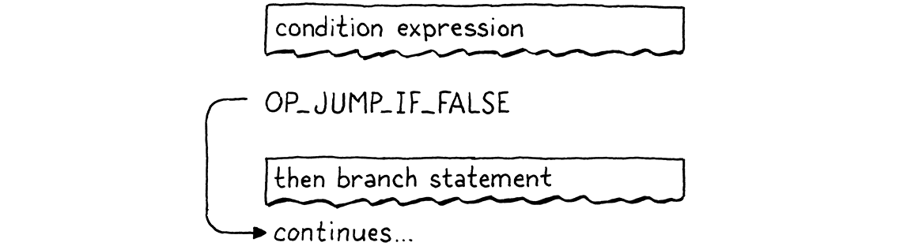
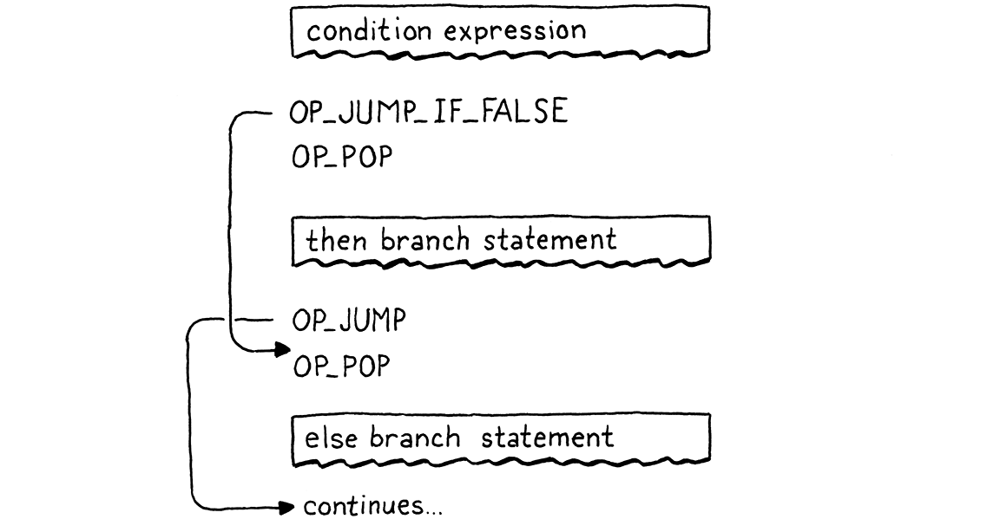
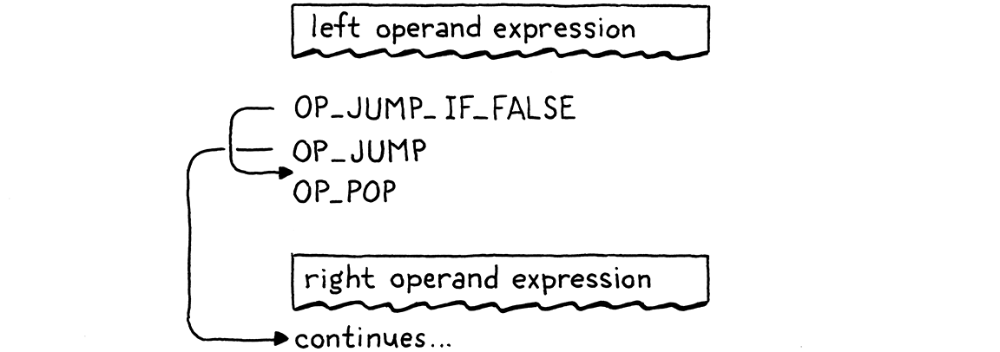

# 23. Jumping Back and Forth 來回跳轉

> The order that our mind imagines is like a net, or like a ladder, built to attain something. But afterward you must throw the ladder away, because you discover that, even if it was useful, it was meaningless.
>
> ​																——Umberto Eco, *The Name of the Rose*

我們頭腦中想象的秩序就像一張網，或者像一架梯子，用來達到某種目的。但事後你必須把梯子扔掉，因為你會發現，即使它有用，也毫無意義。（翁貝託·艾柯，《玫瑰之名》）

> It’s taken a while to get here, but we’re finally ready to add control flow to our virtual machine. In the tree-walk interpreter we built for jlox, we implemented Lox’s control flow in terms of Java’s. To execute a Lox `if` statement, we used a Java `if` statement to run the chosen branch. That works, but isn’t entirely satisfying. By what magic does the *JVM itself* or a native CPU implement `if` statements? Now that we have our own bytecode VM to hack on, we can answer that.

雖然花了一些時間，但我們終於準備好向虛擬機中添加控制流了。在我們為jlox構建的樹遍歷解釋器中，我們以Java的方式實現了控制流。為了執行Lox的`if`語句，我們使用Java的`if`語句來執行所選的分支。這是可行的，但並不是完全令人滿意。JVM本身或原生CPU如何實現`if`語句呢？現在我們有了自己的字節碼虛擬機，我們可以回答這個問題。

> When we talk about “control flow”, what are we referring to? By “flow” we mean the way execution moves through the text of the program. Almost like there is a little robot inside the computer wandering through our code, executing bits and pieces here and there. Flow is the path that robot takes, and by *controlling* the robot, we drive which pieces of code it executes.

當我們談論“控制流”時，我們指的是什麼？我們所説的“流”是指執行過程在程序文本中的移動方式。就好像電腦裏有一個小機器人在我們的代碼裏遊蕩，在這裏或那裏執行一些零零碎碎的片段。流就是機器人所走的路徑，通過*控制*機器人，我們驅動它執行某些代碼片段。

> In jlox, the robot’s locus of attention—the *current* bit of code—was implicit based on which AST nodes were stored in various Java variables and what Java code we were in the middle of running. In clox, it is much more explicit. The VM’s `ip` field stores the address of the current bytecode instruction. The value of that field is exactly “where we are” in the program.

在jlox中，機器人的關注點（*當前*代碼位）是隱式的，它取決於哪些AST節點被存儲在各種Java變量中，以及我們正在運行的Java代碼是什麼。在clox中，它要明確得多。VM的`ip`字段存儲了當前字節碼指令的地址。該字段的值正是我們在程序中的“位置”。

> Execution proceeds normally by incrementing the `ip`. But we can mutate that variable however we want to. In order to implement control flow, all that’s necessary is to change the `ip` in more interesting ways. The simplest control flow construct is an `if` statement with no `else` clause:

執行操作通常是通過增加`ip`進行的。但是我們可以隨意地改變這個變量。為了實現控制流，所需要做的就是以更有趣的方式改變`ip`。最簡單的控制流結構是沒有`else`子句的`if`語句：

```c
if (condition) print("condition was truthy");
```

> The VM evaluates the bytecode for the condition expression. If the result is truthy, then it continues along and executes the `print` statement in the body. The interesting case is when the condition is falsey. When that happens, execution skips over the then branch and proceeds to the next statement.

虛擬機會計算條件表達式對應的字節碼。如果結構是真，則繼續執行主體中的`print`語句。有趣的是當條件為假的時候，這種情況下，執行會跳過then分支並執行下一條語句。

> To skip over a chunk of code, we simply set the `ip` field to the address of the bytecode instruction following that code. To *conditionally* skip over some code, we need an instruction that looks at the value on top of the stack. If it’s falsey, it adds a given offset to the `ip` to jump over a range of instructions. Otherwise, it does nothing and lets execution proceed to the next instruction as usual.

要想跳過一大塊代碼，我們只需將`ip`字段設置為其後代碼的字節碼指令的地址。為了*有條件地*跳過一些代碼，我們需要一條指令來查看棧頂的值。如果它是假，就在`ip`上增加一個給定的偏移量，跳過一系列指令。否則，它什麼也不做，並照常執行下一條指令。

> When we compile to bytecode, the explicit nested block structure of the code evaporates, leaving only a flat series of instructions behind. Lox is a [structured programming](https://en.wikipedia.org/wiki/Structured_programming) language, but clox bytecode isn’t. The right—or wrong, depending on how you look at it—set of bytecode instructions could jump into the middle of a block, or from one scope into another.
>

當我們編譯成字節碼時，代碼中顯式的嵌套塊結構就消失了，只留下一系列扁平的指令。Lox是一種[結構化的編程語言](https://en.wikipedia.org/wiki/Structured_programming)，但clox字節碼卻不是。正確的（或者説錯誤的，取決於你怎麼看待它）字節碼指令集可以跳轉到代碼塊的中間位置，或從一個作用域跳到另一個作用域。

> The VM will happily execute that, even if the result leaves the stack in an unknown, inconsistent state. So even though the bytecode is unstructured, we’ll take care to ensure that our compiler only generates clean code that maintains the same structure and nesting that Lox itself does.
>

虛擬機會很高興地執行這些指令，即使其結果會導致堆棧處於未知的、不一致的狀態。因此，儘管字節碼是非結構化的，我們也要確保編譯成只生成與Lox本身保持相同結構和嵌套的乾淨代碼。

> This is exactly how real CPUs behave. Even though we might program them using higher-level languages that mandate structured control flow, the compiler lowers that down to raw jumps. At the bottom, it turns out goto is the only real control flow.

這就是真正的CPU的行為方式。即使我們可能會使用高級語言對它們進行編程，這些語言能夠規定格式化控制流，但編譯器也會將其降級為原生跳轉。在底層，事實證明goto是唯一真正的控制流。

> Anyway, I didn’t mean to get all philosophical. The important bit is that if we have that one conditional jump instruction, that’s enough to implement Lox’s `if` statement, as long as it doesn’t have an `else` clause. So let’s go ahead and get started with that.

不管這麼説，我並不是故意要搞得這麼哲學化。重要的是，如果我們有一個條件跳轉指令，就足以實現Lox的`if`語句了，只要它沒有`else`子句。讓我們開始吧。

> ## 23 . 1 If Statements

## 23.1 If語句

> This many chapters in, you know the drill. Any new feature starts in the front end and works its way through the pipeline. An `if` statement is, well, a statement, so that’s where we hook it into the parser.

這麼多章了，你知道該怎麼做。任何新特性都是從前端開始的，如果沿着管道進行工作。`if`語句是一個，嗯，語句，所以我們通過語句將它連接到解析器。

*<u>compiler.c，在statement()語句中添加代碼：</u>*

```c
  if (match(TOKEN_PRINT)) {
    printStatement();
  // 新增部分開始  
  } else if (match(TOKEN_IF)) {
    ifStatement();
  // 新增部分結束  
  } else if (match(TOKEN_LEFT_BRACE)) {
```

> When we see an `if` keyword, we hand off compilation to this function:

如果我們看到`if`關鍵字，就把編譯工作交給這個函數[^1]：

*<u>compiler.c，在expressionStatement()方法後添加代碼：</u>*

```c
static void ifStatement() {
  consume(TOKEN_LEFT_PAREN, "Expect '(' after 'if'.");
  expression();
  consume(TOKEN_RIGHT_PAREN, "Expect ')' after condition."); 

  int thenJump = emitJump(OP_JUMP_IF_FALSE);
  statement();

  patchJump(thenJump);
}
```

> First we compile the condition expression, bracketed by parentheses. At runtime, that will leave the condition value on top of the stack. We’ll use that to determine whether to execute the then branch or skip it.

首先我們編譯條件表達式（用小括號括起來）。在運行時，這會將條件值留在棧頂。我們將通過它來決定是執行then分支還是跳過它。

> Then we emit a new `OP_JUMP_IF_FALSE` instruction. It has an operand for how much to offset the `ip`—how many bytes of code to skip. If the condition is falsey, it adjusts the `ip` by that amount. Something like this:

然後我們生成一個新的`OP_JUMP_IF_ELSE`指令。這條指令有一個操作數，用來表示`ip`的偏移量——要跳過多少字節的代碼。如果條件是假，它就按這個值調整`ip`，就像這樣：



> But we have a problem. When we’re writing the `OP_JUMP_IF_FALSE` instruction’s operand, how do we know how far to jump? We haven’t compiled the then branch yet, so we don’t know how much bytecode it contains.

但我們有個問題。當我們寫`OP_JUMP_IF_FALSE`指令的操作數時，我們怎麼知道要跳多遠？我們還沒有編譯then分支，所以我們不知道它包含多少字節碼。

> To fix that, we use a classic trick called **backpatching**. We emit the jump instruction first with a placeholder offset operand. We keep track of where that half-finished instruction is. Next, we compile the then body. Once that’s done, we know how far to jump. So we go back and replace that placeholder offset with the real one now that we can calculate it. Sort of like sewing a patch onto the existing fabric of the compiled code.

為了解決這個問題，我們使用了一個經典的技巧，叫作**回填（backpatching）**。我們首先生成跳轉指令，並附上一個佔位的偏移量操作數，我們跟蹤這個半成品指令的位置。接下來，我們編譯then主體。一旦完成，我們就知道要跳多遠。所以我們回去將佔位符替換為真正的偏移量，現在我們可以計算它了。這有點像在已編譯代碼的現有結構上打補丁。


> We encode this trick into two helper functions.

我們將這個技巧編碼為兩個輔助函數。

*<u>compiler.c，在emitBytes()方法後添加代碼：</u>*

```c
static int emitJump(uint8_t instruction) {
  emitByte(instruction);
  emitByte(0xff);
  emitByte(0xff);
  return currentChunk()->count - 2;
}
```

> The first emits a bytecode instruction and writes a placeholder operand for the jump offset. We pass in the opcode as an argument because later we’ll have two different instructions that use this helper. We use two bytes for the jump offset operand. A 16-bit offset lets us jump over up to 65,535 bytes of code, which should be plenty for our needs.

第一個程序會生成一個字節碼指令，併為跳轉偏移量寫入一個佔位符操作數。我們把操作碼作為參數傳入，因為稍後我們會有兩個不同的指令都使用這個輔助函數。我們使用兩個字節作為跳轉偏移量的操作數。一個16位的偏移量可以讓我們跳轉65535個字節的代碼，這對於我們的需求來説應該足夠了[^2]。

> The function returns the offset of the emitted instruction in the chunk. After compiling the then branch, we take that offset and pass it to this:

該函數會返回生成的指令在字節碼塊中的偏移量。編譯完then分支後，我們將這個偏移量傳遞給這個函數：

*<u>compiler.c，在emitConstant()方法後添加代碼：</u>*

```c
static void patchJump(int offset) {
  // -2 to adjust for the bytecode for the jump offset itself.
  int jump = currentChunk()->count - offset - 2;

  if (jump > UINT16_MAX) {
    error("Too much code to jump over.");
  }

  currentChunk()->code[offset] = (jump >> 8) & 0xff;
  currentChunk()->code[offset + 1] = jump & 0xff;
}
```

> This goes back into the bytecode and replaces the operand at the given location with the calculated jump offset. We call `patchJump()` right before we emit the next instruction that we want the jump to land on, so it uses the current bytecode count to determine how far to jump. In the case of an `if` statement, that means right after we compile the then branch and before we compile the next statement.

這個函數會返回到字節碼中，並將給定位置的操作數替換為計算出的跳轉偏移量。我們在生成下一條希望跳轉的指令之前調用`patchJump()`，因此會使用當前字節碼計數來確定要跳轉的距離。在`if`語句的情況下，就是在編譯完then分支之後，並在編譯下一個語句之前。

> That’s all we need at compile time. Let’s define the new instruction.

這就是在編譯時需要做的。讓我們來定義新指令。

*<u>chunk.h，在枚舉OpCode中添加代碼：</u>*

```c
  OP_PRINT,
  // 新增部分開始
  OP_JUMP_IF_FALSE,
  // 新增部分結束
  OP_RETURN,
```

> Over in the VM, we get it working like so:

在虛擬機中，我們讓它這樣工作：

*<u>vm.c，在run()方法中添加代碼：</u>*

```c
        break;
      }
      // 新增部分開始
      case OP_JUMP_IF_FALSE: {
        uint16_t offset = READ_SHORT();
        if (isFalsey(peek(0))) vm.ip += offset;
        break;
      }
      // 新增部分結束
      case OP_RETURN: {
```

> This is the first instruction we’ve added that takes a 16-bit operand. To read that from the chunk, we use a new macro.

這是我們添加的第一個需要16位操作數的指令。為了從字節碼塊中讀出這個指令，需要使用一個新的宏。

*<u>vm.c，在run()方法中添加代碼：</u>*

```c
#define READ_CONSTANT() (vm.chunk->constants.values[READ_BYTE()])
// 新增部分開始
#define READ_SHORT() \
    (vm.ip += 2, (uint16_t)((vm.ip[-2] << 8) | vm.ip[-1]))
// 新增部分結束    
#define READ_STRING() AS_STRING(READ_CONSTANT())
```

> It yanks the next two bytes from the chunk and builds a 16-bit unsigned integer out of them. As usual, we clean up our macro when we’re done with it.

它從字節碼塊中抽取接下來的兩個字節，並從中構建出一個16位無符號整數。和往常一樣，當我們結束之後要清理宏。

*<u>vm.c，在run()方法中添加代碼：</u>*

```c
#undef READ_BYTE
// 新增部分開始
#undef READ_SHORT
// 新增部分結束
#undef READ_CONSTANT
```

> After reading the offset, we check the condition value on top of the stack. If it’s falsey, we apply this jump offset to the `ip`. Otherwise, we leave the `ip` alone and execution will automatically proceed to the next instruction following the jump instruction.

讀取偏移量之後，我們檢查棧頂的條件值。如果是假，我們就將這個跳轉偏移量應用到`ip`上。否則，我們就保持`ip`不變，執行會自動進入跳轉指令的下一條指令。

> In the case where the condition is falsey, we don’t need to do any other work. We’ve offset the `ip`, so when the outer instruction dispatch loop turns again, it will pick up execution at that new instruction, past all of the code in the then branch.

在條件為假的情況下，我們不需要做任何其它工作。我們已經移動了`ip`，所以當外部指令調度循環再次啓動時，將會在新指令處執行，跳過了then分支的所有代碼[^3]。

> Note that the jump instruction doesn’t pop the condition value off the stack. So we aren’t totally done here, since this leaves an extra value floating around on the stack. We’ll clean that up soon. Ignoring that for the moment, we do have a working `if` statement in Lox now, with only one little instruction required to support it at runtime in the VM.
>

請注意，跳轉指令並沒有將條件值彈出棧。因此，我們在這裏還沒有全部完成，因為還在堆棧上留下了一個額外的值。我們很快就會把它清理掉。暫時先忽略這個問題，我們現在在Lox中已經有了可用的`if`語句，只需要一條小指令在虛擬機運行時支持它。

> ### 23 . 1 . 1 Else clauses

### 23.1.1 Else子句

> An `if` statement without support for `else` clauses is like Morticia Addams without Gomez. So, after we compile the then branch, we look for an `else` keyword. If we find one, we compile the else branch.

一個不支持`else`子句的`if`語句就像沒有Gomez的Morticia Addams（《亞當斯一家》）。因此，在我們編譯完then分支之後，我們要尋找`else`關鍵字。如果找到了，則編譯else分支。

*<u>compiler.c，在ifStatement()方法中添加代碼：</u>*

```c
  patchJump(thenJump);
  // 新增部分開始
  if (match(TOKEN_ELSE)) statement();
  // 新增部分結束
}
```

> When the condition is falsey, we’ll jump over the then branch. If there’s an else branch, the `ip` will land right at the beginning of its code. But that’s not enough, though. Here’s the flow that leads to:

當條件為假時，我們會跳過then分支。如果存在else分支，`ip`就會出現在其字節碼的開頭處。但這還不夠。下面是對應的流：


> If the condition is truthy, we execute the then branch like we want. But after that, execution rolls right on through into the else branch. Oops! When the condition is true, after we run the then branch, we need to jump over the else branch. That way, in either case, we only execute a single branch, like this:

如果條件是真，則按照要求執行then分支。但在那之後，執行會直接轉入到else分支。糟糕！當條件為真時，執行完then分支後，我們需要跳過else分支。這樣，無論哪種情況，我們都只執行一個分支，像這樣：


> To implement that, we need another jump from the end of the then branch.

為了實現這一點，我們需要從then分支的末端再進行一次跳轉。

*<u>compiler.c，在ifStatement()方法中添加代碼：</u>*

```c
  statement();
  // 新增部分開始
  int elseJump = emitJump(OP_JUMP);
  // 新增部分結束
  patchJump(thenJump);
```

> We patch that offset after the end of the else body.

我們在else主體結束後修補這個偏移量。

*<u>compiler.c，在ifStatement()方法中添加代碼：</u>*

```c
  if (match(TOKEN_ELSE)) statement();
  // 新增部分開始
  patchJump(elseJump);
  // 新增部分結束
}
```

> After executing the then branch, this jumps to the next statement after the else branch. Unlike the other jump, this jump is unconditional. We always take it, so we need another instruction that expresses that.

在執行完then分支後，會跳轉到else分支之後的下一條語句。與其它跳轉不同，這個跳轉是無條件的。我們一定會接受該跳轉，所以我們需要另一條指令來表達它。

*<u>chunk.h，在枚舉OpCode中添加代碼：</u>*

```c
  OP_PRINT,
  // 新增部分開始
  OP_JUMP,
  // 新增部分結束
  OP_JUMP_IF_FALSE,
```

> We interpret it like so:

我們這樣來解釋它：

*<u>vm.c，在run()方法中添加代碼：</u>*

```c
        break;
      }
      // 新增部分開始
      case OP_JUMP: {
        uint16_t offset = READ_SHORT();
        vm.ip += offset;
        break;
      }
      // 新增部分結束
      case OP_JUMP_IF_FALSE: {
```

> Nothing too surprising here—the only difference is that it doesn’t check a condition and always applies the offset.

這裏沒有什麼特別出人意料的——唯一的區別就是它不檢查條件，並且一定會應用偏移量。

> We have then and else branches working now, so we’re close. The last bit is to clean up that condition value we left on the stack. Remember, each statement is required to have zero stack effect—after the statement is finished executing, the stack should be as tall as it was before.

我們現在有了then和else分支，所以已經接近完成了。最後一點是清理我們遺留在棧上的條件值。請記住，每個語句都要求是0堆棧效應——在語句執行完畢後，堆棧應該與之前一樣高。

> We could have the `OP_JUMP_IF_FALSE` instruction pop the condition itself, but soon we’ll use that same instruction for the logical operators where we don’t want the condition popped. Instead, we’ll have the compiler emit a couple of explicit `OP_POP` instructions when compiling an `if` statement. We need to take care that every execution path through the generated code pops the condition.

我們可以讓`OP_JUMP_IF_FALSE`指令自身彈出條件值，但很快我們會對不希望彈出條件值的邏輯運算符使用相同的指令。相對地，我們在編譯`if`語句時，會讓編譯器生成幾條顯式的`OP_POP`指令，我們需要注意生成的代碼中的每一條執行路徑都要彈出條件值。

> When the condition is truthy, we pop it right before the code inside the then branch.

當條件為真時，我們會在進入then分支的代碼前彈出該值。

*<u>compiler.c，在ifStatement()方法中添加代碼：</u>*

```c
  int thenJump = emitJump(OP_JUMP_IF_FALSE);
  // 新增部分開始
  emitByte(OP_POP);
  // 新增部分結束
  statement();
```

> Otherwise, we pop it at the beginning of the else branch.

否則，我們就在else分支的開頭彈出它。

*<u>compiler.c，在ifStatement()方法中添加代碼：</u>*

```c
  patchJump(thenJump);
  // 新增部分開始
  emitByte(OP_POP);
  // 新增部分結束
  if (match(TOKEN_ELSE)) statement();
```

> This little instruction here also means that every `if` statement has an implicit else branch even if the user didn’t write an `else` clause. In the case where they left it off, all the branch does is discard the condition value.

這裏的這個小指令也意味着每個`if`語句都有一個隱含的else分支，即使用户沒有寫`else`子句。在用户沒有寫else子句的情況下，這個分支所做的就是丟棄條件值。

> The full correct flow looks like this:

完整正確的流看起來是這樣的：



> If you trace through, you can see that it always executes a single branch and ensures the condition is popped first. All that remains is a little disassembler support.

如果你跟蹤整個過程，可以看到它總是隻執行一個分支，並確保條件值首先被彈出。剩下的就是一點反彙編程序的支持了。

*<u>debug.c，在disassembleInstruction()方法中添加代碼：</u>*

```c
      return simpleInstruction("OP_PRINT", offset);
    // 新增部分開始  
    case OP_JUMP:
      return jumpInstruction("OP_JUMP", 1, chunk, offset);
    case OP_JUMP_IF_FALSE:
      return jumpInstruction("OP_JUMP_IF_FALSE", 1, chunk, offset);
    // 新增部分結束  
    case OP_RETURN:
```

> These two instructions have a new format with a 16-bit operand, so we add a new utility function to disassemble them.

這兩條指令具有新格式，有着16位的操作數，因此我們添加了一個新的工具函數來反彙編它們。

*<u>debug.c，在byteInstruction()方法後添加代碼：</u>*

```c
static int jumpInstruction(const char* name, int sign,
                           Chunk* chunk, int offset) {
  uint16_t jump = (uint16_t)(chunk->code[offset + 1] << 8);
  jump |= chunk->code[offset + 2];
  printf("%-16s %4d -> %d\n", name, offset,
         offset + 3 + sign * jump);
  return offset + 3;
}
```

> There we go, that’s one complete control flow construct. If this were an ’80s movie, the montage music would kick in and the rest of the control flow syntax would take care of itself. Alas, the ’80s are long over, so we’ll have to grind it out ourselves.

就這樣，這就是一個完整的控制流結構。如果這是一部80年代的電影，蒙太奇音樂就該響起了，剩下的控制流語法就會自行完成。唉，80年代已經過去很久了，所以我們得自己打磨了。

> ## 23 . 2 Logical Operators

## 23.2 邏輯運算符

> You probably remember this from jlox, but the logical operators `and` and `or` aren’t just another pair of binary operators like `+` and `-`. Because they short-circuit and may not evaluate their right operand depending on the value of the left one, they work more like control flow expressions.

你可能還記得jlox中的實現，但是邏輯運算符`and`和`or`並不僅僅是另一對像`+`和`-`一樣的二元運算符。因為它們是短路的，根據左操作數的值，有可能不會對右操作數求值，它們的工作方式 更像是控制流表達式。

> They’re basically a little variation on an `if` statement with an `else` clause. The easiest way to explain them is to just show you the compiler code and the control flow it produces in the resulting bytecode. Starting with `and`, we hook it into the expression parsing table here:
>

它們基本上是帶有`else`子句的`if`語句的小變體。解釋它們的最簡單的方法是向你展示編譯器代碼以及它在字節碼中生成的控制流。從`and`開始，我們把它掛接到表達式解析表中：

*<u>compiler.c，替換1行：</u>*

```c
  [TOKEN_NUMBER]        = {number,   NULL,   PREC_NONE},
  // 替換部分開始
  [TOKEN_AND]           = {NULL,     and_,   PREC_AND},
  // 替換部分結束
  [TOKEN_CLASS]         = {NULL,     NULL,   PREC_NONE},
```

> That hands off to a new parser function.

這就交給了一個新的解析器函數。

*<u>compiler.c，在defineVariable()方法後添加代碼：</u>*

```c
static void and_(bool canAssign) {
  int endJump = emitJump(OP_JUMP_IF_FALSE);

  emitByte(OP_POP);
  parsePrecedence(PREC_AND);

  patchJump(endJump);
}
```

> At the point this is called, the left-hand side expression has already been compiled. That means at runtime, its value will be on top of the stack. If that value is falsey, then we know the entire `and` must be false, so we skip the right operand and leave the left-hand side value as the result of the entire expression. Otherwise, we discard the left-hand value and evaluate the right operand which becomes the result of the whole `and` expression.

在這個方法被調用時，左側的表達式已經被編譯了。這意味着，在運行時，它的值將會在棧頂。如果這個值為假，我們就知道整個`and`表達式的結果一定是假，所以我們跳過右邊的操作數，將左邊的值作為整個表達式的結果。否則，我們就丟棄左值，計算右操作數，並將它作為整個`and`表達式的結果。

> Those four lines of code right there produce exactly that. The flow looks like this:

這四行代碼正是產生這樣的結果。流程看起來像這樣：


> Now you can see why `OP_JUMP_IF_FALSE` leaves the value on top of the stack. When the left-hand side of the `and` is falsey, that value sticks around to become the result of the entire expression.

現在你可以看到為什麼`OP_JUMP_IF_FALSE`要將值留在棧頂。當`and`左側的值為假時，這個值會保留下來，成為整個表達式的結果[^4]。

> ### 23 . 2 . 1 Logical or operator

### 23.2.1 邏輯or運算符

> The `or` operator is a little more complex. First we add it to the parse table.

`or`運算符有點複雜。首先，我們將它添加到解析表中。

*<u>compiler.c，替換1行：</u>*

```c
  [TOKEN_NIL]           = {literal,  NULL,   PREC_NONE},
  // 替換部分開始
  [TOKEN_OR]            = {NULL,     or_,    PREC_OR},
  // 替換部分結束
  [TOKEN_PRINT]         = {NULL,     NULL,   PREC_NONE},
```

> When that parser consumes an infix `or` token, it calls this:

當解析器處理中綴`or`標識時，會調用這個：

*<u>compiler.c，在number()方法後添加代碼：</u>*

```c
static void or_(bool canAssign) {
  int elseJump = emitJump(OP_JUMP_IF_FALSE);
  int endJump = emitJump(OP_JUMP);

  patchJump(elseJump);
  emitByte(OP_POP);

  parsePrecedence(PREC_OR);
  patchJump(endJump);
}
```

> In an `or` expression, if the left-hand side is *truthy*, then we skip over the right operand. Thus we need to jump when a value is truthy. We could add a separate instruction, but just to show how our compiler is free to map the language’s semantics to whatever instruction sequence it wants, I implemented it in terms of the jump instructions we already have.

在`or`表達式中，如果左側值為*真*，那麼我們就跳過右側的操作數。因此，當值為真時，我們需要跳過。我們可以添加一條單獨的指令，但為了説明編譯器如何自由地將語言的語義映射為它想要的任何指令序列，我會使用已有的跳轉指令來實現它。

> When the left-hand side is falsey, it does a tiny jump over the next statement. That statement is an unconditional jump over the code for the right operand. This little dance effectively does a jump when the value is truthy. The flow looks like this:

當左側值為假時，它會做一個小跳躍，跳過下一條語句。該語句會無條件跳過右側操作數的代碼。當值為真時，就會進行該跳轉。流程看起來是這樣的：



> If I’m honest with you, this isn’t the best way to do this. There are more instructions to dispatch and more overhead. There’s no good reason why `or` should be slower than `and`. But it is kind of fun to see that it’s possible to implement both operators without adding any new instructions. Forgive me my indulgences.

説實話，這並不是最好的方法。（這種方式中）需要調度的指令更多，開銷也更大。沒有充足的理由説明為什麼`or`要比`and`慢。但是，可以在不增加任何新指令的前提下實現兩個運算符，這是有趣的。請原諒我的放縱。

> OK, those are the three *branching* constructs in Lox. By that, I mean, these are the control flow features that only jump *forward* over code. Other languages often have some kind of multi-way branching statement like `switch` and maybe a conditional expression like `?:`, but Lox keeps it simple.

好了，這就是Lox中的三個分支結構。我的意思是，這些控制流特性只能在代碼上*向前*跳轉。其它語言中通常有某種多路分支語句，如`switch`，也許還有條件表達式`?:`，但Lox保持簡單。

> ## 23 . 3 While Statements

## 23.3 While語句

> That takes us to the *looping* statements, which jump *backward* so that code can be executed more than once. Lox only has two loop constructs, `while` and `for`. A `while` loop is (much) simpler, so we start the party there.

這就將我們帶到了*循環*語句，循環語句會向後跳轉，使代碼可以多次執行。Lox只有兩種循環結構`while`和`for`。`while`循環要簡單（得多），所以我們從這裏開始。

*<u>compiler.c，在statement()方法中添加代碼：</u>*

```c
    ifStatement();
  // 新增部分開始  
  } else if (match(TOKEN_WHILE)) {
    whileStatement();
  // 新增部分結束  
  } else if (match(TOKEN_LEFT_BRACE)) {
```

> When we reach a `while` token, we call:

當我們遇到`while`標識時，調用：

*<u>compiler.c，在printStatement()方法後添加代碼：</u>*

```c
static void whileStatement() {
  consume(TOKEN_LEFT_PAREN, "Expect '(' after 'while'.");
  expression();
  consume(TOKEN_RIGHT_PAREN, "Expect ')' after condition.");

  int exitJump = emitJump(OP_JUMP_IF_FALSE);
  emitByte(OP_POP);
  statement();

  patchJump(exitJump);
  emitByte(OP_POP);
}
```

> Most of this mirrors `if` statements—we compile the condition expression, surrounded by mandatory parentheses. That’s followed by a jump instruction that skips over the subsequent body statement if the condition is falsey.

大部分跟`if`語句相似——我們編譯條件表達式（強制用括號括起來）。之後是一個跳轉指令，如果條件為假，會跳過後續的主體語句。

> We patch the jump after compiling the body and take care to pop the condition value from the stack on either path. The only difference from an `if` statement is the loop. That looks like this:

我們在編譯完主體之後對跳轉指令進行修補，並注意在每個執行路徑上都要彈出棧頂的條件值。與`if`語句的唯一區別就是循環[^5]。看起來像這樣：

*<u>compiler.c，在whileStatement()方法中添加代碼：</u>*

```c
  statement();
  // 新增部分開始
  emitLoop(loopStart);
  // 新增部分結束
  patchJump(exitJump);
```

> After the body, we call this function to emit a “loop” instruction. That instruction needs to know how far back to jump. When jumping forward, we had to emit the instruction in two stages since we didn’t know how far we were going to jump until after we emitted the jump instruction. We don’t have that problem now. We’ve already compiled the point in code that we want to jump back to—it’s right before the condition expression.

在主體之後，我們調用這個函數來生成一個“循環”指令。該指令需要知道往回跳多遠。當向前跳時，我們必須分兩個階段發出指令，因為在發出跳躍指令前，我們不知道要跳多遠。現在我們沒有這個問題了。我們已經編譯了要跳回去的代碼位置——就在條件表達式之前。

> All we need to do is capture that location as we compile it.

我們所需要做的就是在編譯時捕獲這個位置。

*<u>compiler.c，在whileStatement()方法中添加代碼：</u>*

```c
static void whileStatement() {
  // 新增部分開始
  int loopStart = currentChunk()->count;
  // 新增部分結束
  consume(TOKEN_LEFT_PAREN, "Expect '(' after 'while'.");
```

> After executing the body of a `while` loop, we jump all the way back to before the condition. That way, we re-evaluate the condition expression on each iteration. We store the chunk’s current instruction count in `loopStart` to record the offset in the bytecode right before the condition expression we’re about to compile. Then we pass that into this helper function:

在執行完`while`循環後，我們會一直跳到條件表達式之前。這樣，我們就可以在每次迭代時都重新對條件表達式求值。我們在`loopStar`中存儲字節碼塊中當前的指令數，作為我們即將編譯的條件表達式在字節碼中的偏移量。然後我們將該值傳給這個輔助函數：

*<u>compiler.c，在emitBytes()方法後添加代碼：</u>*

```c
static void emitLoop(int loopStart) {
  emitByte(OP_LOOP);

  int offset = currentChunk()->count - loopStart + 2;
  if (offset > UINT16_MAX) error("Loop body too large.");

  emitByte((offset >> 8) & 0xff);
  emitByte(offset & 0xff);
}
```

> It’s a bit like `emitJump()` and `patchJump()` combined. It emits a new loop instruction, which unconditionally jumps *backwards* by a given offset. Like the jump instructions, after that we have a 16-bit operand. We calculate the offset from the instruction we’re currently at to the `loopStart` point that we want to jump back to. The `+ 2` is to take into account the size of the `OP_LOOP` instruction’s own operands which we also need to jump over.

這有點像`emitJump()`和`patchJump()` 的結合。它生成一條新的循環指令，該指令會無條件地*向回*跳轉給定的偏移量。和跳轉指令一樣，其後還有一個16位的操作數。我們計算當前指令到我們想要跳回的`loopStart`之間的偏移量。`+2`是考慮到了`OP_LOOP`指令自身操作數的大小，這個操作數我們也需要跳過。

> From the VM’s perspective, there really is no semantic difference between `OP_LOOP` and `OP_JUMP`. Both just add an offset to the `ip`. We could have used a single instruction for both and given it a signed offset operand. But I figured it was a little easier to sidestep the annoying bit twiddling required to manually pack a signed 16-bit integer into two bytes, and we’ve got the opcode space available, so why not use it?

從虛擬機的角度看，`OP_LOOP` 和`OP_JUMP`之間實際上沒有語義上的區別。兩者都只是在`ip`上加了一個偏移量。我們本可以用一條指令來處理這兩者，並給該指令傳入一個有符號的偏移量操作數。但我認為，這樣做更容易避免手動將一個有符號的16位整數打包到兩個字節所需要的煩人的位操作，況且我們有可用的操作碼空間，為什麼不使用呢？

> The new instruction is here:

新指令如下：

*<u>chunk.h，在枚舉OpCode中添加代碼：</u>*

```c
  OP_JUMP_IF_FALSE,
  // 新增部分開始
  OP_LOOP,
  // 新增部分結束
  OP_RETURN,
```

> And in the VM, we implement it thusly:

在虛擬機中，我們這樣實現它：

*<u>vm.c，在run()方法中添加代碼：</u>*

```c
      }
      // 新增部分開始
      case OP_LOOP: {
        uint16_t offset = READ_SHORT();
        vm.ip -= offset;
        break;
      }
      // 新增部分結束
      case OP_RETURN: {
```

> The only difference from `OP_JUMP` is a subtraction instead of an addition. Disassembly is similar too.

與`OP_JUMP`唯一的區別就是這裏使用了減法而不是加法。反彙編也是相似的。

*<u>debug.c，在disassembleInstruction()方法中添加代碼：</u>*

```c
      return jumpInstruction("OP_JUMP_IF_FALSE", 1, chunk, offset);
    // 新增部分開始  
    case OP_LOOP:
      return jumpInstruction("OP_LOOP", -1, chunk, offset);
    // 新增部分結束
    case OP_RETURN:
```

> That’s our `while` statement. It contains two jumps—a conditional forward one to escape the loop when the condition is not met, and an unconditional loop backward after we have executed the body. The flow looks like this:

這就是我們的`while`語句。它包含兩個跳轉——一個是有條件的前向跳轉，用於在不滿足條件的時候退出循環；另一個是在執行完主體代碼後的無條件跳轉。流程看起來如下：


> ## 23 . 4 For Statements

## 23.4 For語句

> The other looping statement in Lox is the venerable `for` loop, inherited from C. It’s got a lot more going on with it compared to a `while` loop. It has three clauses, all of which are optional:

Lox中的另一個循環語句是古老的`for`循環，繼承自C語言。與`while`循環相比，它有着更多的功能。它有三個子句，都是可選的：

> - The initializer can be a variable declaration or an expression. It runs once at the beginning of the statement.
> - The condition clause is an expression. Like in a `while` loop, we exit the loop when it evaluates to something falsey.
> - The increment expression runs once at the end of each loop iteration.

- 初始化器可以是一個變量聲明或一個表達式。它會在整個語句的開頭運行一次。
- 條件子句是一個表達式。就像`while`循環一樣，如果其計算結果為假，就退出循環。
- 增量表達式在每次循環迭代結束時運行一次。

> In jlox, the parser desugared a `for` loop to a synthesized AST for a `while` loop with some extra stuff before it and at the end of the body. We’ll do something similar, though we won’t go through anything like an AST. Instead, our bytecode compiler will use the jump and loop instructions we already have.

在jlox中，解析器將`for`循環解構為一個`while`循環與其主體前後的一些額外內容的合成AST。我們會做一些類似的事情，不過我們不會使用AST之類的東西。相反，我們的字節碼編譯器將使用我們已有的跳轉和循環指令。

> We’ll work our way through the implementation a piece at a time, starting with the `for` keyword.

我們將從`for`關鍵字開始，逐步完成整個實現。

*<u>compiler.c，在statement()方法中添加代碼：</u>*

```c
    printStatement();
  // 新增部分開始  
  } else if (match(TOKEN_FOR)) {
    forStatement();
  // 新增部分結束  
  } else if (match(TOKEN_IF)) {
```

> It calls a helper function. If we only supported `for` loops with empty clauses like `for (;;)`, then we could implement it like this:

它會調用一個輔助函數。如果我們只支持`for(;;)`這樣帶有空子句的`for`循環，那麼我們可以這樣實現它：

*<u>compiler.c，在expressionStatement()方法後添加代碼：</u>*

```c
static void forStatement() {
  consume(TOKEN_LEFT_PAREN, "Expect '(' after 'for'.");
  consume(TOKEN_SEMICOLON, "Expect ';'.");

  int loopStart = currentChunk()->count;
  consume(TOKEN_SEMICOLON, "Expect ';'.");
  consume(TOKEN_RIGHT_PAREN, "Expect ')' after for clauses.");

  statement();
  emitLoop(loopStart);
}
```

> There’s a bunch of mandatory punctuation at the top. Then we compile the body. Like we did for `while` loops, we record the bytecode offset at the top of the body and emit a loop to jump back to that point after it. We’ve got a working implementation of infinite loops now.

首先是一堆強制性的標點符號。然後我們編譯主體。與`while`循環一樣，我們在主體的頂部記錄字節碼的偏移量，並在之後生成一個循環指令跳回該位置。現在我們已經有了一個無限循環的有效實現。

> ### 23 . 4 . 1 Initializer clause

### 23.4.1 初始化子句

> Now we’ll add the first clause, the initializer. It executes only once, before the body, so compiling is straightforward.

現在我們要添加第一個子句，初始化器。它只在主體之前執行一次，因此編譯很簡單。

*<u>compiler.c，在forStatement()方法中替換1行：</u>*

```c
  consume(TOKEN_LEFT_PAREN, "Expect '(' after 'for'.");
  // 替換部分開始
  if (match(TOKEN_SEMICOLON)) {
    // No initializer.
  } else if (match(TOKEN_VAR)) {
    varDeclaration();
  } else {
    expressionStatement();
  }
  // 替換部分結束
  int loopStart = currentChunk()->count;
```

> The syntax is a little complex since we allow either a variable declaration or an expression. We use the presence of the `var` keyword to tell which we have. For the expression case, we call `expressionStatement()` instead of `expression()`. That looks for a semicolon, which we need here too, and also emits an `OP_POP` instruction to discard the value. We don’t want the initializer to leave anything on the stack.

語法有點複雜，因為我們允許出現變量聲明或表達式。我們通過是否存在`var`關鍵字來判斷是哪種類型。對於表達式，我們調用`expressionStatement()`而不是`expression()`。它會查找分號（我們這裏也需要一個分號），並生成一個`OP_POP`指令來丟棄表達式的值。我們不希望初始化器在堆棧中留下任何東西。

> If a `for` statement declares a variable, that variable should be scoped to the loop body. We ensure that by wrapping the whole statement in a scope.

如果`for`語句聲明瞭一個變量，那麼該變量的作用域應該限制在循環體中。我們通過將整個語句包裝在一個作用域中來確保這一點。

*<u>compiler.c，在forStatement()方法中添加代碼：</u>*

```c
static void forStatement() {
  // 新增部分開始
  beginScope();
  // 新增部分結束
  consume(TOKEN_LEFT_PAREN, "Expect '(' after 'for'.");
```

> Then we close it at the end.

然後我們在結尾關閉這個作用域。

*<u>compiler.c，在forStatement()方法中添加代碼：</u>*

```c
  emitLoop(loopStart);
  // 新增部分開始
  endScope();
  // 新增部分結束
}
```

> ### 23 . 4 . 2 Condition clause

### 23.4.2 條件子句

> Next, is the condition expression that can be used to exit the loop.

接下來，是可以用來退出循環的條件表達式。

*<u>compiler.c，在forStatement()方法中替換1行：</u>*

```c
  int loopStart = currentChunk()->count;
  // 替換部分開始
  int exitJump = -1;
  if (!match(TOKEN_SEMICOLON)) {
    expression();
    consume(TOKEN_SEMICOLON, "Expect ';' after loop condition.");

    // Jump out of the loop if the condition is false.
    exitJump = emitJump(OP_JUMP_IF_FALSE);
    emitByte(OP_POP); // Condition.
  }
  // 替換部分結束
  consume(TOKEN_RIGHT_PAREN, "Expect ')' after for clauses.");
```

> Since the clause is optional, we need to see if it’s actually present. If the clause is omitted, the next token must be a semicolon, so we look for that to tell. If there isn’t a semicolon, there must be a condition expression.

因為子句是可選的，我們需要查看它是否存在。如果子句被省略，下一個標識一定是分號，所以我們通過查找分號來進行判斷。如果沒有分號，就一定有一個條件表達式。

> In that case, we compile it. Then, just like with while, we emit a conditional jump that exits the loop if the condition is falsey. Since the jump leaves the value on the stack, we pop it before executing the body. That ensures we discard the value when the condition is true.

在這種情況下，我們對它進行編譯。然後，就像`while`一樣，我們生成一個條件跳轉指令，如果條件為假則退出循環。因為跳轉指令將值留在了棧上，我們在執行主體之前將值彈出。這樣可以確保當條件值為真時，我們會丟棄這個值。

> After the loop body, we need to patch that jump.

在循環主體之後，我們需要修補跳轉指令。

*<u>compiler.c，在forStatement()方法中添加代碼：</u>*

```c
  emitLoop(loopStart);
  // 新增部分開始
  if (exitJump != -1) {
    patchJump(exitJump);
    emitByte(OP_POP); // Condition.
  }
  // 新增部分結束
  endScope();
}
```

> We do this only when there is a condition clause. If there isn’t, there’s no jump to patch and no condition value on the stack to pop.

我們只在有條件子句的時候才會這樣做。如果沒有條件子句，就沒有需要修補的跳轉指令，堆棧中也沒有條件值需要彈出。

> ### 23 . 4 . 3 Increment clause

### 23.4.3 增量子句

> I’ve saved the best for last, the increment clause. It’s pretty convoluted. It appears textually before the body, but executes *after* it. If we parsed to an AST and generated code in a separate pass, we could simply traverse into and compile the `for` statement AST’s body field before its increment clause.

我把非常複雜的增量子句部分留到最後。從文本上看，它出現在循環主體之前，但卻是在主體*之後*執行。如果我們將其解析為AST，並在單獨的處理過程中生成代碼，就可以簡單地遍歷並編譯`for`語句AST的主體字段，然後再編譯其增量子句。

> Unfortunately, we can’t compile the increment clause later, since our compiler only makes a single pass over the code. Instead, we’ll *jump over* the increment, run the body, jump *back* up to the increment, run it, and then go to the next iteration.

不幸的是，我們不能稍後再編譯增量子句，因為我們的編譯器只對代碼做了一次遍歷。相對地，我們會*跳過*增量子句，運行主體，*跳回*增量子句，運行它，然後進入下一個迭代。

> I know, a little weird, but hey, it beats manually managing ASTs in memory in C, right? Here’s the code:

我知道，這有點奇怪，但是，這總比在C語言中手動管理內存中的AST要好，對嗎？代碼如下：

*<u>compiler.c，在forStatement()方法中替換1行：</u>*

```c
  }
  // 替換部分開始
  if (!match(TOKEN_RIGHT_PAREN)) {
    int bodyJump = emitJump(OP_JUMP);
    int incrementStart = currentChunk()->count;
    expression();
    emitByte(OP_POP);
    consume(TOKEN_RIGHT_PAREN, "Expect ')' after for clauses.");

    emitLoop(loopStart);
    loopStart = incrementStart;
    patchJump(bodyJump);
  }
  // 替換部分結束
  statement();
```

> Again, it’s optional. Since this is the last clause, when omitted, the next token will be the closing parenthesis. When an increment is present, we need to compile it now, but it shouldn’t execute yet. So, first, we emit an unconditional jump that hops over the increment clause’s code to the body of the loop.

同樣，它也是可選的。因為這是最後一個子句，下一個標識是右括號。當存在增加子句時，我們需要立即編譯它，但是它還不應該執行。因此，首先我們生成一個無條件跳轉指令，該指令會跳過增量子句的代碼進入循環體中。

> Next, we compile the increment expression itself. This is usually an assignment. Whatever it is, we only execute it for its side effect, so we also emit a pop to discard its value.

接下來，我們編譯增量表達式本身。這通常是一個賦值語句。不管它是什麼，我們執行它只是為了它的副作用，所以我們也生成一個彈出指令丟棄該值。

> The last part is a little tricky. First, we emit a loop instruction. This is the main loop that takes us back to the top of the `for` loop—right before the condition expression if there is one. That loop happens right after the increment, since the increment executes at the end of each loop iteration.

最後一部分有點棘手。首先，我們生成一個循環指令。這是主循環，會將我們帶到`for`循環的頂部——如果有條件表達式的話，就回在它前面。這個循環發生在增量語句之後，因此增量語句是在每次循環迭代結束時執行的。

> Then we change `loopStart` to point to the offset where the increment expression begins. Later, when we emit the loop instruction after the body statement, this will cause it to jump up to the *increment* expression instead of the top of the loop like it does when there is no increment. This is how we weave the increment in to run after the body.

然後我們更改`loopStart`，指向增量表達式開始處的偏移量。之後，當我們在主體語句結束之後生成循環指令時，就會跳轉到增量表達式，而不是像沒有增量表達式時那樣跳轉到循環頂部。這就是我們如何在主體之後運行增量子句的辦法。

> It’s convoluted, but it all works out. A complete loop with all the clauses compiles to a flow like this:

這很複雜，但一切都解決了。一個包含所有子句的完整循環會被編譯為類似這樣的流程：


> As with implementing `for` loops in jlox, we didn’t need to touch the runtime. It all gets compiled down to primitive control flow operations the VM already supports. In this chapter, we’ve taken a big leap forward—clox is now Turing complete. We’ve also covered quite a bit of new syntax: three statements and two expression forms. Even so, it only took three new simple instructions. That’s a pretty good effort-to-reward ratio for the architecture of our VM.

與jlox中實現`for`循環一樣，我們不需要接觸運行時。所有這些都被編譯到虛擬機已經支持的原始控制流中。在這一章中，我們向前邁出了一大步——clox現在圖靈完整了。我們還討論了相當多的新語法：三種語句和兩種表達式形式。即便如此，我們也只用了三個簡單的新指令。對於我們的虛擬機架構來説，這是一個相當不錯的努力-回報比。


[^1]: 你有沒有注意到，`if`關鍵字後面的`(`實際上沒有什麼用處？如果沒有它，語言也會很明確，而且容易解析，比如：<BR>`if condition) print("looks weird");`<BR>結尾的`)`是有用的，因為它將條件表達式和主體分隔開。有些語言使用`then`關鍵字來代替。但是開頭的`(`沒有任何作用。它之所以存在，是因為不匹配的括號在我們人類看來很糟糕。
[^2]: 一些指令集中有單獨的“長”跳轉指令，這些指令會接受更大的操作數，當你需要跳轉更遠的距離時可以使用。
[^3]: 我説過我們不會使用C的`if`語句來實現Lox的控制流，但我們在這裏確實使用了`if`語句來決定是否偏移指令指針。但我們並沒有真正使用C語言來實現控制流。如果我們想的話，可以用純粹的算術做到同樣的事情。假設我們有一個函數`falsey()`，它接受一個Lox Value，如果是假則返回1，否則返回0。那我們可以這樣實現跳轉指令：<BR><BR>`falsey()`函數可能會使用一些控制流來處理不同的值類型，但這是該函數的實現細節，並不影響我們的虛擬機如何處理自己的控制流。
[^4]: 我們的操作碼範圍中還有足夠的空間，所以我們可以為隱式彈出值的條件跳轉和不彈出值的條件跳轉制定單獨的指令。但我想盡量在書中保持簡約。在你的字節碼虛擬機中，值得探索添加更多的專用指令，看看它們是如何影響性能的。
[^5]: 真的開始懷疑我對邏輯運算符使用相同的跳轉指令的決定了。

---

## 習題

1. > In addition to `if` statements, most C-family languages have a multi-way `switch` statement. Add one to clox. The grammar is:

   除了`if`語句，大多數C家族語言都要一個多路`switch`語句。在clox中添加一個。語法如下：

   ```c
   switchStmt     → "switch" "(" expression ")"
                    "{" switchCase* defaultCase? "}" ;
   switchCase     → "case" expression ":" statement* ;
   defaultCase    → "default" ":" statement* ;
   ```

   > To execute a `switch` statement, first evaluate the parenthesized switch value expression. Then walk the cases. For each case, evaluate its value expression. If the case value is equal to the switch value, execute the statements under the case and then exit the `switch` statement. Otherwise, try the next case. If no case matches and there is a `default` clause, execute its statements.
   >
   > To keep things simpler, we’re omitting fallthrough and `break` statements. Each case automatically jumps to the end of the switch statement after its statements are done.

   為了執行`switch`語句，首先要計算括號內的switch值表達式。然後遍歷分支。對於每個分支，計算其值表達式。如果case值等於switch值，就執行case下的語句，然後退出`switch`語句。否則，就嘗試下一個case分支。如果沒有匹配的分支，並且有`default`子句，就執行其中的語句。

   為了讓事情更簡單，我們省略了fall through和`break`語句。每個case子句在其語句完成後會自動跳轉到switch語句的結尾。

2. > In jlox, we had a challenge to add support for `break` statements. This time, let’s do `continue`:

   在jlox中，我們有一個習題是添加對`break`語句的支持。這一次，我們來做`continue`：

   ```
   continueStmt   → "continue" ";" ;
   ```

   > A `continue` statement jumps directly to the top of the nearest enclosing loop, skipping the rest of the loop body. Inside a `for` loop, a `continue` jumps to the increment clause, if there is one. It’s a compile-time error to have a `continue` statement not enclosed in a loop.
   >
   > Make sure to think about scope. What should happen to local variables declared inside the body of the loop or in blocks nested inside the loop when a `continue` is executed?

   `continue`語句直接跳轉到最內層的封閉循環的頂部，跳過循環體的其餘部分。在`for`循環中，如果有增量子句，`continue`會跳到增量子句。如果`continue`子句沒有被包含在循環中，則是一個編譯時錯誤。

   一定要考慮作用域問題。當執行`continue`語句時，在循環體內或嵌套在循環體中的代碼塊內聲明的局部變量應該如何處理？

3. > Control flow constructs have been mostly unchanged since Algol 68. Language evolution since then has focused on making code more declarative and high level, so imperative control flow hasn’t gotten much attention.
   >
   > For fun, try to invent a useful novel control flow feature for Lox. It can be a refinement of an existing form or something entirely new. In practice, it’s hard to come up with something useful enough at this low expressiveness level to outweigh the cost of forcing a user to learn an unfamiliar notation and behavior, but it’s a good chance to practice your design skills.

   自Algol 68以來，控制流結構基本沒有變化。從那時起，語言的發展就專注於使代碼更具有聲明性和高層次，因此命令式控制流並沒有得到太多的關注。

   為了好玩，可以試着為Lox發明一個有用的新的控制流功能。它可以是現有形式的改進，也可以是全新的東西。實踐中，在這種較低的表達層次上，很難想出足夠有用的東西來抵消迫使用户學習不熟悉的符號和行為的代價，但這是一個練習設計技能的好機會。


---

> ## DESIGN NOTE: CONSIDERING GOTO HARMFUL

## 設計筆記：認為GOTO有害

> Discovering that all of our beautiful structured control flow in Lox is actually compiled to raw unstructured jumps is like the moment in Scooby Doo when the monster rips the mask off their face. It was goto all along! Except in this case, the monster is *under* the mask. We all know goto is evil. But . . . why?
>
> It is true that you can write outrageously unmaintainable code using goto. But I don’t think most programmers around today have seen that first hand. It’s been a long time since that style was common. These days, it’s a boogie man we invoke in scary stories around the campfire.
>
> The reason we rarely confront that monster in person is because Edsger Dijkstra slayed it with his famous letter “Go To Statement Considered Harmful”, published in *Communications of the ACM* (March, 1968). Debate around structured programming had been fierce for some time with adherents on both sides, but I think Dijkstra deserves the most credit for effectively ending it. Most new languages today have no unstructured jump statements.
>
> A one-and-a-half page letter that almost single-handedly destroyed a language feature must be pretty impressive stuff. If you haven’t read it, I encourage you to do so. It’s a seminal piece of computer science lore, one of our tribe’s ancestral songs. Also, it’s a nice, short bit of practice for reading academic CS writing, which is a useful skill to develop.
>
> That is, if you can get past Dijkstra’s insufferable faux-modest self-aggrandizing writing style:
>
> > More recently I discovered why the use of the go to statement has such disastrous effects. . . . At that time I did not attach too much importance to this discovery; I now submit my considerations for publication because in very recent discussions in which the subject turned up, I have been urged to do so.
>
> Ah, yet another one of my many discoveries. I couldn’t even be bothered to write it up until the clamoring masses begged me to.
>
> I’ve read it through a number of times, along with a few critiques, responses, and commentaries. I ended up with mixed feelings, at best. At a very high level, I’m with him. His general argument is something like this:
>
> 1. As programmers, we write programs—static text—but what we care about is the actual running program—its dynamic behavior.
> 2. We’re better at reasoning about static things than dynamic things. (He doesn’t provide any evidence to support this claim, but I accept it.)
> 3. Thus, the more we can make the dynamic execution of the program reflect its textual structure, the better.
>
> This is a good start. Drawing our attention to the separation between the code we write and the code as it runs inside the machine is an interesting insight. Then he tries to define a “correspondence” between program text and execution. For someone who spent literally his entire career advocating greater rigor in programming, his definition is pretty hand-wavey. He says:
>
> > Let us now consider how we can characterize the progress of a process. (You may think about this question in a very concrete manner: suppose that a process, considered as a time succession of actions, is stopped after an arbitrary action, what data do we have to fix in order that we can redo the process until the very same point?)
>
> Imagine it like this. You have two computers with the same program running on the exact same inputs—so totally deterministic. You pause one of them at an arbitrary point in its execution. What data would you need to send to the other computer to be able to stop it exactly as far along as the first one was?
>
> If your program allows only simple statements like assignment, it’s easy. You just need to know the point after the last statement you executed. Basically a breakpoint, the `ip` in our VM, or the line number in an error message. Adding branching control flow like `if` and `switch` doesn’t add any more to this. Even if the marker points inside a branch, we can still tell where we are.
>
> Once you add function calls, you need something more. You could have paused the first computer in the middle of a function, but that function may be called from multiple places. To pause the second machine at exactly the same point in *the entire program’s* execution, you need to pause it on the *right* call to that function.
>
> So you need to know not just the current statement, but, for function calls that haven’t returned yet, you need to know the locations of the callsites. In other words, a call stack, though I don’t think that term existed when Dijkstra wrote this. Groovy.
>
> He notes that loops make things harder. If you pause in the middle of a loop body, you don’t know how many iterations have run. So he says you also need to keep an iteration count. And, since loops can nest, you need a stack of those (presumably interleaved with the call stack pointers since you can be in loops in outer calls too).
>
> This is where it gets weird. So we’re really building to something now, and you expect him to explain how goto breaks all of this. Instead, he just says:
>
> > The unbridled use of the go to statement has an immediate consequence that it becomes terribly hard to find a meaningful set of coordinates in which to describe the process progress.
>
> He doesn’t prove that this is hard, or say why. He just says it. He does say that one approach is unsatisfactory:
>
> > With the go to statement one can, of course, still describe the progress uniquely by a counter counting the number of actions performed since program start (viz. a kind of normalized clock). The difficulty is that such a coordinate, although unique, is utterly unhelpful.
>
> But . . . that’s effectively what loop counters do, and he was fine with those. It’s not like every loop is a simple “for every integer from 0 to 10” incrementing count. Many are `while` loops with complex conditionals.
>
> Taking an example close to home, consider the core bytecode execution loop at the heart of clox. Dijkstra argues that that loop is tractable because we can simply count how many times the loop has run to reason about its progress. But that loop runs once for each executed instruction in some user’s compiled Lox program. Does knowing that it executed 6,201 bytecode instructions really tell us VM maintainers *anything* edifying about the state of the interpreter?
>
> In fact, this particular example points to a deeper truth. Böhm and Jacopini [proved](https://en.wikipedia.org/wiki/Structured_program_theorem) that *any* control flow using goto can be transformed into one using just sequencing, loops, and branches. Our bytecode interpreter loop is a living example of that proof: it implements the unstructured control flow of the clox bytecode instruction set without using any gotos itself.
>
> That seems to offer a counter-argument to Dijkstra’s claim: you *can* define a correspondence for a program using gotos by transforming it to one that doesn’t and then use the correspondence from that program, which—according to him—is acceptable because it uses only branches and loops.
>
> But, honestly, my argument here is also weak. I think both of us are basically doing pretend math and using fake logic to make what should be an empirical, human-centered argument. Dijkstra is right that some code using goto is really bad. Much of that could and should be turned into clearer code by using structured control flow.
>
> By eliminating goto completely from languages, you’re definitely prevented from writing bad code using gotos. It may be that forcing users to use structured control flow and making it an uphill battle to write goto-like code using those constructs is a net win for all of our productivity.
>
> But I do wonder sometimes if we threw out the baby with the bathwater. In the absence of goto, we often resort to more complex structured patterns. The “switch inside a loop” is a classic one. Another is using a guard variable to exit out of a series of nested loops:
>
> 
>
> ```
> // See if the matrix contains a zero.
> bool found = false;
> for (int x = 0; x < xSize; x++) {
>   for (int y = 0; y < ySize; y++) {
>     for (int z = 0; z < zSize; z++) {
>       if (matrix[x][y][z] == 0) {
>         printf("found");
>         found = true;
>         break;
>       }
>     }
>     if (found) break;
>   }
>   if (found) break;
> }
> ```
>
> Is that really better than:
>
> ```
> for (int x = 0; x < xSize; x++) {
>   for (int y = 0; y < ySize; y++) {
>     for (int z = 0; z < zSize; z++) {
>       if (matrix[x][y][z] == 0) {
>         printf("found");
>         goto done;
>       }
>     }
>   }
> }
> done:
> ```
>
> You could do this without `break` statements—themselves a limited goto-ish construct—by inserting `!found &&` at the beginning of the condition clause of each loop.
>
> I guess what I really don’t like is that we’re making language design and engineering decisions today based on fear. Few people today have any subtle understanding of the problems and benefits of goto. Instead, we just think it’s “considered harmful”. Personally, I’ve never found dogma a good starting place for quality creative work.

發現我們在Lox中的所有漂亮的結構化控制流實際上都被編譯成原始的非結構化跳轉，就像《Scooby Doo》中怪獸撕下臉上的面具一樣。一直以來都是goto！只不過這一次，怪物藏在面具下。我們都知道goto是魔鬼。但是……為什麼呢？

的確，你可以用goto編寫極度難以維護的代碼。但我認為現在的大多數程序員都沒有親身經歷過這種情況。這種風格已經很久沒有出現了。如今，它只是我們在篝火旁的恐怖故事裏會提到的一個惡棍。

我們之所以很少親自面對這個怪物，是因為Edsger Dijkstra用他那封著名的信件“Go To Statement Considered Harmful”殺死了它，這封信發表在《ACM通訊》(1968年3月刊)上。彼時圍繞結構化編程的爭論已經激烈了一段時間，雙方都有支持者，但我認為Dijkstra最突出的貢獻就是有效地結束了爭論。今天的大多數新語言都沒有非結構化的跳轉語句。

一封一頁半的信，幾乎以一己之力摧毀了一種語言特性，這一定是相當令人印象深刻的東西。如果你還沒有讀過，我鼓勵你讀一下。它是計算機科學知識的開山之作，是我們部落的祖傳歌曲之一。同時，它也是閲讀學術性CS文章的一個很好的、簡短的練習，這是一個很有用的技能。

【也就是説，你是否能克服Dijkstra那令人難以忍受的虛偽謙虛、自我吹噓的寫作風格：

> 最近，我發現了為什麼goto語句是使用會產生災難性的影響。……當時我並沒有太重視這個發現；現在我把我的想法提交出來進行發表，是因為在最近關於這個問題的討論中，有人敦促我這樣做。

嗯，這是我眾多發現中的又一項。我甚至懶得把它寫下來，都是吵吵嚷嚷的羣眾求我寫。】

我把它讀了好幾遍，還有一些批評、回覆和評論。我最後的感受充其量是喜憂參半。在很高的層次上來説，我是支持他的。他的總體論點是這樣的：

1. 作為程序員，我們編寫程序——靜態文本——但我們關心的是實際運行的程序——它的動態行為。
2. 相比之下，我們更擅長對靜態事物進行推理，而不是動態事物。（他沒有提供任何證據來支持這一説法，但我接受這個説法）
3. 因此，我們越能使程序的動態執行反映其文本結構，就越好。

這是一個良好的開端。讓我們注意到編寫的代碼和機器內部運行的代碼之間的分離是一個有趣的見解。然後，他試圖在程序文本和執行之間定義一種“對應關係”。對於一個幾乎在整個職業生涯中都倡導更嚴格的編程的人來説，他的定義是相當簡單的。他説：

> 現在讓我們考慮一下，如何能夠描述一個過程的進展。（你可以用一種非常具體的方式來思考這個問題：假設一個過程，被看做是一系列操作的時間序列，在一個任意的操作之後停止，我們必須要固定哪些數據，才能重做整個過程，並達到完全相同的點）

想象一下這樣的情況，你有兩台計算機，在完全相同的輸入上運行相同的程序，所以這是完全確定性的。在執行過程中，你可以在任意點暫停其中一個函數。你需要向另一台計算機發送什麼數據才能讓它完全像第一台那樣暫停。

如果你的程序只允許像賦值這樣的簡單語句，這很容易。你只需要知道你執行的最後一條語句之後的那一個點。基本上就是一個斷點，即我們虛擬機中的`ip`或錯誤信息中的行號。添加`if`和`switch`這樣的分支控制流並不會改變什麼。即時標記點指向分支內部，我們仍然可以知道我們在哪裏。

一旦增加了函數調用，就需要更多的數據才行。你可以在函數中間位置暫停第一台計算機，但是該函數可能會從多個地方調用。要想在*整個程序執行*的同一時刻暫停第二台機器，你就需要在*正確*調用該函數的時機暫停它。

因此，你不僅需要知道當前的語句，而且，對於尚未返回的函數調用，你也需要知道調用點的位置。換句話説，就是調用堆棧，儘管我認為Dijkstra寫這個的時候，這個術語還不存在。有趣。

他指出，循環使事情變得更難。如果你在循環體中間暫停，你就不知道運行了多少次迭代。所以他説你還需要記錄迭代數。而且，由於循環可以嵌套，所以你需要一個堆棧（估計是與調用棧指針交錯在一起，因為你也可能在外部調用的循環中）。

這就是奇怪的地方。所以，我們現在真的有了一些進展，你希望他解釋goto是如何破壞這一切的。相反，他説：

> 無節制地使用goto語句會產生一個直接的後果，那就是很難找到一組有意義的座標來描述進程的進展。

他沒有證明這很困難，也沒有説明原因。他就是這麼説了一下。他確實説過有一種方法是無法令人滿意的：

> 當然，有了goto語句，我們仍然可以通過一個計數器來唯一性地描述進程，計數器計算自程序啓動以來所執行的操作的數量（即一種規範化的時鐘）。困難的是，這樣的座標雖然是唯一的，但完全沒有幫助。

但是……這就是循環計數器的作用，而且他對這些計數器很滿意。並不是每個循環都是簡單地“對於0到10的每個整數”的遞增計數。許多是帶有複雜條件的`while`循環。

舉一個比較接近的例子，考慮一下clox中的核心字節碼執行循環。Dijkstra認為這個循環很容易處理，因為我們可以簡單地計算循環運行了多少次來推斷它的進度。但是，對於某些用户編譯的Lox程序中執行的每條指令，該循環都會運行一次。知道它執行了6201條字節碼指令真的能告訴我們這些虛擬機維護者關於解釋器狀態的任何信息嗎？

事實上，這個特殊的例子指出了一個更深層次的事實。Böhm和Jacopini證明，*任何*使用goto的控制流都可以轉換為只使用排序、循環和分支的控制流。我們的字節碼解釋器核心循環就是一個活生生的例子：它實現了clox字節碼指令集的非結構化控制流，而本身沒有使用任何goto。

這似乎提供了一種反駁Dijkstra主張的論點：你可以為使用goto的程序定義一個對應關係，將其轉換為不使用goto的程序，然後使用該程序的對應關係，根據他的説法，這是可接受的，因為它只使用了分支和循環。

但是，老實説，我的論點也很弱。我認為我們兩個人基本上都在做假數學，用假邏輯來做一個應該是經驗性的、以人為本的論證。Dijkstra是對的，一些使用goto的代碼真的很糟糕。通過使用結構化控制流，其中的大部分內容可以也應該變成更清晰的代碼。

從語言中消除goto，你肯定可以避免使用goto寫出糟糕的代碼。對我們所有的生產力來説，迫使用户使用結構化控制流，並使用這些結構寫出類似goto的代碼，可能是一場淨勝。

但我有時會懷疑我們是否把孩子和洗澡水一起倒掉了。在沒有goto的情況下，我們常常求助於更復雜的結構化模式。“循環中的分支”就是一個典型的例子。另一個例子是使用保護變量退出一系列的嵌套循環：

```c
// See if the matrix contains a zero.
bool found = false;
for (int x = 0; x < xSize; x++) {
  for (int y = 0; y < ySize; y++) {
    for (int z = 0; z < zSize; z++) {
      if (matrix[x][y][z] == 0) {
        printf("found");
        found = true;
        break;
      }
    }
    if (found) break;
  }
  if (found) break;
}
```

【你可以在每個循環的條件子句的開頭插入`!found &&`，而不需要使用`break`語句（它們本身就是一種有限的goto式結構）】

這真的比下面的形式好嗎：

```c
for (int x = 0; x < xSize; x++) {
  for (int y = 0; y < ySize; y++) {
    for (int z = 0; z < zSize; z++) {
      if (matrix[x][y][z] == 0) {
        printf("found");
        goto done;
      }
    }
  }
}
done:
```

我想我真正不喜歡的是，我們現在基於恐懼來進行語言設計和工程決策。如今，很少有人對goto的問題和好處有任何微妙的瞭解。相反，我們只是認為它“被認為是有害的”。就我個人而言，我從不覺得教條是高質量創造性工作的良好開端。
