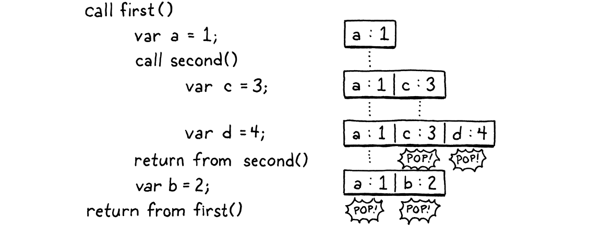
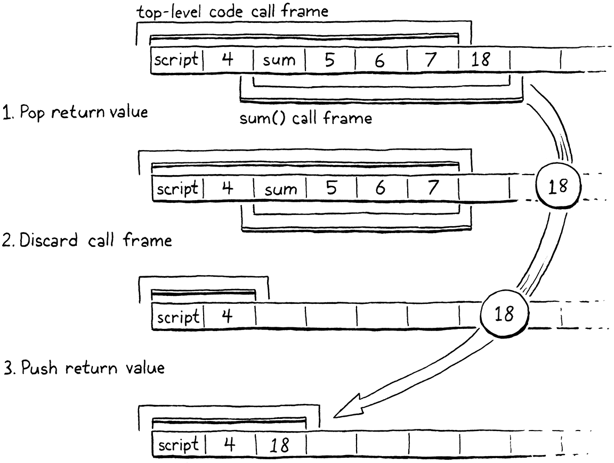

# 24. Calls and Functions 調用和函數

> Any problem in computer science can be solved with another level of indirection. Except for the problem of too many layers of indirection.
>
> ​																						——David Wheeler

計算機科學中的任何問題都可以通過引入一箇中間層來解決。除了中間層太多的問題。（David Wheeler）

> This chapter is a beast. I try to break features into bite-sized pieces, but sometimes you gotta swallow the whole meal. Our next task is functions. We could start with only function declarations, but that’s not very useful when you can’t call them. We could do calls, but there’s nothing to call. And all of the runtime support needed in the VM to support both of those isn’t very rewarding if it isn’t hooked up to anything you can see. So we’re going to do it all. It’s a lot, but we’ll feel good when we’re done.

這一章是一頭猛獸。我試圖把功能分解成小塊，但有時候你不得不吞下整頓飯。我們的下一個任務是函數。我們可以只從函數聲明開始，但是如果你不能調用它們，那就沒什麼用了。我們可以實現調用，但是也沒什麼可調用的。而且，為了實現這兩個功能所需的所有運行時支持，如果不能與你能直觀看到的東西相掛鈎，就不是很有價值。所以我們都要做。雖然內容很多，但等我們完成時，我們會感覺很好。

> ## 24 . 1 Function Objects

## 24.1 函數對象

> The most interesting structural change in the VM is around the stack. We already *have* a stack for local variables and temporaries, so we’re partway there. But we have no notion of a *call* stack. Before we can make much progress, we’ll have to fix that. But first, let’s write some code. I always feel better once I start moving. We can’t do much without having some kind of representation for functions, so we’ll start there. From the VM’s perspective, what is a function?

虛擬機中最有趣的結構變化是圍繞堆棧進行的。我們已經有了用於局部變量和臨時變量的棧，所以我們已經完成了一半。但是我們還沒有調用堆棧的概念。在我們取得更大進展之前，必須先解決這個問題。但首先，讓我們編寫一些代碼。一旦開始行動，我就感覺好多了。如果沒有函數的某種表示形式，我們就做不了太多事，所以我們先從這裏開始。從虛擬機的角度來看，什麼是函數？

> A function has a body that can be executed, so that means some bytecode. We could compile the entire program and all of its function declarations into one big monolithic Chunk. Each function would have a pointer to the first instruction of its code inside the Chunk.

函數有一個可以被執行的主體，也就是一些字節碼。我們可以把整個程序和所有的函數聲明編譯成一個大的字節碼塊。每個函數都有一個指針指向其在字節碼塊中的第一條指令。

> This is roughly how compilation to native code works where you end up with one solid blob of machine code. But for our bytecode VM, we can do something a little higher level. I think a cleaner model is to give each function its own Chunk. We’ll want some other metadata too, so let’s go ahead and stuff it all in a struct now.

這大概就是編譯為本地代碼的工作原理，你最終得到的是一大堆機器碼。但是對於我們的字節碼虛擬機，我們可以做一些更高層次的事情。我認為一個更簡潔的模型是給每個函數它自己的字節碼塊。我們還需要一些其它的元數據，所以我們現在來把它們塞進一個結構體中。

*<u>object.h，在結構體Obj後添加代碼：</u>*

```c
  struct Obj* next;
};
// 新增部分開始
typedef struct {
  Obj obj;
  int arity;
  Chunk chunk;
  ObjString* name;
} ObjFunction;
// 新增部分結束
struct ObjString {
```

> Functions are first class in Lox, so they need to be actual Lox objects. Thus ObjFunction has the same Obj header that all object types share. The `arity` field stores the number of parameters the function expects. Then, in addition to the chunk, we store the function’s name. That will be handy for reporting readable runtime errors.

函數是Lox中的一等公民，所以它們需要作為實際的Lox對象。因此，ObjFunction具有所有對象類型共享的Obj頭。`arity`字段存儲了函數所需要的參數數量。然後，除了字節碼塊，我們還需要存儲函數名稱。這有助於報告可讀的運行時錯誤[^1]。

> This is the first time the “object” module has needed to reference Chunk, so we get an include.

這是“object”模塊第一次需要引用Chunk，所以我們需要引入一下。

*<u>object.h，添加代碼：</u>*

```c
#include "common.h"
// 新增部分開始
#include "chunk.h"
// 新增部分結束
#include "value.h"
```

> Like we did with strings, we define some accessories to make Lox functions easier to work with in C. Sort of a poor man’s object orientation. First, we’ll declare a C function to create a new Lox function.

就像我們處理字符串一樣，我們定義一些輔助程序，使Lox函數更容易在C語言中使用。有點像窮人版的面向對象。首先，我們會聲明一個C函數來創建新Lox函數。

*<u>object.h，在結構體ObjString後添加代碼：</u>*

```c
  uint32_t hash;
};
// 新增部分開始
ObjFunction* newFunction();
// 新增部分結束
ObjString* takeString(char* chars, int length);
```

> The implementation is over here:

實現如下：

*<u>object.c，在allocateObject()方法後添加代碼：</u>*

```c
ObjFunction* newFunction() {
  ObjFunction* function = ALLOCATE_OBJ(ObjFunction, OBJ_FUNCTION);
  function->arity = 0;
  function->name = NULL;
  initChunk(&function->chunk);
  return function;
}
```

> We use our friend `ALLOCATE_OBJ()` to allocate memory and initialize the object’s header so that the VM knows what type of object it is. Instead of passing in arguments to initialize the function like we did with ObjString, we set the function up in a sort of blank state—zero arity, no name, and no code. That will get filled in later after the function is created.

我們使用好朋友`ALLOCATE_OBJ()`來分配內存並初始化對象的頭信息，以便虛擬機知道它是什麼類型的對象。我們沒有像對ObjString那樣傳入參數來初始化函數，而是將函數設置為一種空白狀態——零參數、無名稱、無代碼。這裏會在稍後創建函數後被填入數據。

> Since we have a new kind of object, we need a new object type in the enum.

因為有了一個新類型的對象，我們需要在枚舉中添加一個新的對象類型。

*<u>object.h，在枚舉ObjType中添加代碼：</u>*

```c
typedef enum {
  // 新增部分開始
  OBJ_FUNCTION,
  // 新增部分結束
  OBJ_STRING,
} ObjType;
```

> When we’re done with a function object, we must return the bits it borrowed back to the operating system.

當我們使用完一個函數對象後，必須將它借用的比特位返還給操作系統。

*<u>memory.c，在freeObject()方法中添加代碼：</u>*

```c
  switch (object->type) {
    // 新增部分開始
    case OBJ_FUNCTION: {
      ObjFunction* function = (ObjFunction*)object;
      freeChunk(&function->chunk);
      FREE(ObjFunction, object);
      break;
    }
    // 新增部分結束
    case OBJ_STRING: {
```

> This switch case is responsible for freeing the ObjFunction itself as well as any other memory it owns. Functions own their chunk, so we call Chunk’s destructor-like function.

這個switch語句負責釋放ObjFunction本身以及它所佔用的其它內存。函數擁有自己的字節碼塊，所以我們調用Chunk中類似析構器的函數[^2]。

> Lox lets you print any object, and functions are first-class objects, so we need to handle them too.

Lox允許你打印任何對象，而函數是一等對象，所以我們也需要處理它們。

*<u>object.c，在printObject()方法中添加代碼：</u>*

```c
  switch (OBJ_TYPE(value)) {
    // 新增部分開始
    case OBJ_FUNCTION:
      printFunction(AS_FUNCTION(value));
      break;
    // 新增部分結束  
    case OBJ_STRING:
```

> This calls out to:

這就引出了：

*<u>object.c，在copyString()方法後添加代碼：</u>*

```c
static void printFunction(ObjFunction* function) {
  printf("<fn %s>", function->name->chars);
}
```

> Since a function knows its name, it may as well say it.

既然函數知道它的名稱，那就應該説出來。

> Finally, we have a couple of macros for converting values to functions. First, make sure your value actually *is* a function.

最後，我們有幾個宏用於將值轉換為函數。首先，確保你的值實際上*是*一個函數。

*<u>object.h，添加代碼：</u>*

```c
#define OBJ_TYPE(value)        (AS_OBJ(value)->type)
// 新增部分開始
#define IS_FUNCTION(value)     isObjType(value, OBJ_FUNCTION)
// 新增部分結束
#define IS_STRING(value)       isObjType(value, OBJ_STRING)
```

> Assuming that evaluates to true, you can then safely cast the Value to an ObjFunction pointer using this:

假設計算結果為真，你就可以使用這個方法將Value安全地轉換為一個ObjFunction指針：

*<u>object.h，添加代碼：</u>*

```c
#define IS_STRING(value)       isObjType(value, OBJ_STRING)
// 新增部分開始
#define AS_FUNCTION(value)     ((ObjFunction*)AS_OBJ(value))
// 新增部分結束
#define AS_STRING(value)       ((ObjString*)AS_OBJ(value))
```

> With that, our object model knows how to represent functions. I’m feeling warmed up now. You ready for something a little harder?

這樣，我們的對象模型就知道如何表示函數了。我現在感覺已經熱身了。你準備好來點更難的東西了嗎？

> ## 24 . 2 Compiling to Function Objects

## 24.2 編譯為函數對象

> Right now, our compiler assumes it is always compiling to one single chunk. With each function’s code living in separate chunks, that gets more complex. When the compiler reaches a function declaration, it needs to emit code into the function’s chunk when compiling its body. At the end of the function body, the compiler needs to return to the previous chunk it was working with.

現在，我們的編譯器假定它總會編譯到單個字節碼塊中。由於每個函數的代碼都位於不同的字節碼塊，這就變得更加複雜了。當編譯器碰到函數聲明時，需要在編譯函數主體時將代碼寫入函數自己的字節碼塊中。在函數主體的結尾，編譯器需要返回到它之前正處理的前一個字節碼塊。

> That’s fine for code inside function bodies, but what about code that isn’t? The “top level” of a Lox program is also imperative code and we need a chunk to compile that into. We can simplify the compiler and VM by placing that top-level code inside an automatically defined function too. That way, the compiler is always within some kind of function body, and the VM always runs code by invoking a function. It’s as if the entire program is wrapped inside an implicit `main()` function.

這對於函數主體內的代碼來説很好，但是對於不在其中的代碼呢？Lox程序的“頂層”也是命令式代碼，而且我們需要一個字節碼塊來編譯它。我們也可以將頂層代碼放入一個自動定義的函數中，從而簡化編譯器和虛擬機的工作。這樣一來，編譯器總是在某種函數主體內，而虛擬機總是通過調用函數來運行代碼。這就像整個程序被包裹在一個隱式的`main()`函數中一樣[^3]。

> Before we get to user-defined functions, then, let’s do the reorganization to support that implicit top-level function. It starts with the Compiler struct. Instead of pointing directly to a Chunk that the compiler writes to, it instead has a reference to the function object being built.

在我們討論用户定義的函數之前，讓我們先重新組織一下，支持隱式的頂層函數。這要從Compiler結構體開始。它不再直接指向編譯器寫入的Chunk，而是指向正在構建的函數對象的引用。

*<u>compiler.c，在結構體Compiler中添加代碼：</u>*

```c
typedef struct {
  // 新增部分開始
  ObjFunction* function;
  FunctionType type;
  // 新增部分結束
  Local locals[UINT8_COUNT];
```

> We also have a little FunctionType enum. This lets the compiler tell when it’s compiling top-level code versus the body of a function. Most of the compiler doesn’t care about this—that’s why it’s a useful abstraction—but in one or two places the distinction is meaningful. We’ll get to one later.

我們也有一個小小的FunctionType枚舉。這讓編譯器可以區分它在編譯頂層代碼還是函數主體。大多數編譯器並不關心這一點——這就是為什麼它是一個有用的抽象——但是在一兩個地方，這種區分是有意義的。我們稍後會講到其中一個。

*<u>compiler.c，在結構體Local後添加代碼：</u>*

```
typedef enum {
  TYPE_FUNCTION,
  TYPE_SCRIPT
} FunctionType;
```

> Every place in the compiler that was writing to the Chunk now needs to go through that `function` pointer. Fortunately, many chapters ago, we encapsulated access to the chunk in the `currentChunk()` function. We only need to fix that and the rest of the compiler is happy.

編譯器中所有寫入Chunk的地方，現在都需要通過`function`指針。幸運的是，在很多章節之前，我們在`currentChunk()`函數中封裝了對字節碼塊的訪問。我們只需要修改它，編譯器的其它部分就可以了[^4]。

*<u>compiler.c，在變量current後，替換5行：</u>*

```c
Compiler* current = NULL;
// 替換部分開始
static Chunk* currentChunk() {
  return &current->function->chunk;
}
// 替換部分結束
static void errorAt(Token* token, const char* message) {
```

> The current chunk is always the chunk owned by the function we’re in the middle of compiling. Next, we need to actually create that function. Previously, the VM passed a Chunk to the compiler which filled it with code. Instead, the compiler will create and return a function that contains the compiled top-level code—which is all we support right now—of the user’s program.

當前的字節碼塊一定是我們正在編譯的函數所擁有的塊。接下來，我們需要實際創建該函數。之前，虛擬機將一個Chunk傳遞給編譯器，編譯器會將代碼填入其中。現在取而代之的是，編譯器創建並返回一個包含已編譯頂層代碼的函數——這就是我們目前所支持的。

> ### 24 . 2 . 1 Creating functions at compile time

### 24.2.1 編譯時創建函數

> We start threading this through in `compile()`, which is the main entry point into the compiler.

我們在`compile()`中開始執行此操作，該方法是進入編譯器的主要入口點。

*<u>compiler.c，在compile()方法中替換1行：</u>*

```c
  Compiler compiler;
  // 替換部分開始
  initCompiler(&compiler, TYPE_SCRIPT);
  // 替換部分結束
  parser.hadError = false;
```

> There are a bunch of changes in how the compiler is initialized. First, we initialize the new Compiler fields.

在如何初始化編譯器方面有很多改變。首先，我們初始化新的Compiler字段。

*<u>compiler.c，在函數initCompiler()中替換3行：</u>*

```c
  // 替換部分開始
static void initCompiler(Compiler* compiler, FunctionType type) {
  compiler->function = NULL;
  compiler->type = type;
  // 替換部分結束
  compiler->localCount = 0;
```

> Then we allocate a new function object to compile into.

然後我們分配一個新的函數對象用於編譯。

*<u>compiler.c，在initCompiler()方法中添加代碼[^5]：</u>*

```c
  compiler->scopeDepth = 0;
  // 新增部分開始
  compiler->function = newFunction();
  // 新增部分結束
  current = compiler;
```

> Creating an ObjFunction in the compiler might seem a little strange. A function object is the *runtime* representation of a function, but here we are creating it at compile time. The way to think of it is that a function is similar to a string or number literal. It forms a bridge between the compile time and runtime worlds. When we get to function *declarations*, those really *are* literals—they are a notation that produces values of a built-in type. So the compiler creates function objects during compilation. Then, at runtime, they are simply invoked.

在編譯器中創建ObjFunction可能看起來有點奇怪。函數對象是一個函數的運行時表示，但這裏我們是在編譯時創建它。我們可以這樣想：函數類似於一個字符串或數字字面量。它在編譯時和運行時之間形成了一座橋樑。當我們碰到函數*聲明*時，它們確實*是*字面量——它們是一種生成內置類型值的符號。因此，編譯器在編譯期間創建函數對象[^6]。然後，在運行時，它們被簡單地調用。

> Here is another strange piece of code:

下面是另一段奇怪的代碼：

*<u>compiler.c，在initCompiler()方法中添加代碼：</u>*

```c
  current = compiler;
  // 新增部分開始
  Local* local = &current->locals[current->localCount++];
  local->depth = 0;
  local->name.start = "";
  local->name.length = 0;
  // 新增部分結束
}
```

> Remember that the compiler’s `locals` array keeps track of which stack slots are associated with which local variables or temporaries. From now on, the compiler implicitly claims stack slot zero for the VM’s own internal use. We give it an empty name so that the user can’t write an identifier that refers to it. I’ll explain what this is about when it becomes useful.

請記住，編譯器的`locals`數組記錄了哪些棧槽與哪些局部變量或臨時變量相關聯。從現在開始，編譯器隱式地要求棧槽0供虛擬機自己內部使用。我們給它一個空的名稱，這樣用户就不能向一個指向它的標識符寫值。等它起作用時，我會解釋這是怎麼回事。

> That’s the initialization side. We also need a couple of changes on the other end when we finish compiling some code.

這就是初始化這一邊的工作。當我們完成一些代碼的編譯時，還需要在另一邊做一些改變。

*<u>compiler.c，在函數endCompiler()中替換1行：</u>*

```c
// 替換部分開始
static ObjFunction* endCompiler() {
// 替換部分結束
  emitReturn();
```

> Previously, when `interpret()` called into the compiler, it passed in a Chunk to be written to. Now that the compiler creates the function object itself, we return that function. We grab it from the current compiler here:

以前，當調用`interpret()`方法進入編譯器時，會傳入一個要寫入的Chunk。現在，編譯器自己創建了函數對象，我們返回該函數。我們從當前編譯器中這樣獲取它：

*<u>compiler.c，在endCompiler()方法中添加代碼：</u>*

```c
  emitReturn();
  // 新增部分開始
  ObjFunction* function = current->function;
  // 新增部分結束
#ifdef DEBUG_PRINT_CODE
```

> And then return it to `compile()` like so:

然後這樣將其返回給`compile()`：

*<u>compiler.c，在endCompiler()方法中添加代碼：</u>*

```c
#endif
  // 新增部分開始
  return function;
  // 新增部分結束
}
```

> Now is a good time to make another tweak in this function. Earlier, we added some diagnostic code to have the VM dump the disassembled bytecode so we could debug the compiler. We should fix that to keep working now that the generated chunk is wrapped in a function.

現在是對該函數進行另一個調整的好時機。之前，我們添加了一些診斷性代碼，讓虛擬機轉儲反彙編的字節碼，以便我們可以調試編譯器。現在生成的字節碼塊包含在一個函數中，我們要修復這些代碼，使其繼續工作。

*compiler.c*，在*endCompiler*()方法中替換1行：

```c
#ifdef DEBUG_PRINT_CODE
  if (!parser.hadError) {
    // 替換部分開始
    disassembleChunk(currentChunk(), function->name != NULL
        ? function->name->chars : "<script>");
    // 替換部分結束    
  }
#endif
```

> Notice the check in here to see if the function’s name is `NULL`? User-defined functions have names, but the implicit function we create for the top-level code does not, and we need to handle that gracefully even in our own diagnostic code. Speaking of which:

注意到這裏檢查了函數名稱是否為`NULL`嗎？用户定義的函數有名稱，但我們為頂層代碼創建的隱式函數卻沒有，即使在我們自己的診斷代碼中，我們也需要優雅地處理這個問題。説到這一點：

*<u>object.c，在printFunction()方法中添加代碼：</u>*

```c
static void printFunction(ObjFunction* function) {
  // 新增部分開始
  if (function->name == NULL) {
    printf("<script>");
    return;
  }
  // 新增部分結束
  printf("<fn %s>", function->name->chars);
```

> There’s no way for a *user* to get a reference to the top-level function and try to print it, but our `DEBUG_TRACE_EXECUTION` diagnostic code that prints the entire stack can and does.

用户沒有辦法獲取對頂層函數的引用並試圖打印它，但我們用來打印整個堆棧的診斷代碼`DEBUG_TRACE_EXECUTION`可以而且確實這樣做了[^7]。

> Bumping up a level to `compile()`, we adjust its signature.

為了給`compile()`提升一級，我們調整其簽名。

*compiler.h*，在函數*compile*()中替換1行：

```c
#include "vm.h"
// 替換部分開始
ObjFunction* compile(const char* source);
// 替換部分結束
#endif
```

> Instead of taking a chunk, now it returns a function. Over in the implementation:

現在它不再接受字節碼塊，而是返回一個函數。在實現中：

*<u>compiler.c，在函數compile()中替換1行：</u>*

```c
// 替換部分開始
ObjFunction* compile(const char* source) {
// 替換部分結束
  initScanner(source);
```

> Finally we get to some actual code. We change the very end of the function to this:

最後，我們得到了一些實際的代碼。我們把方法的最後部分改成這樣：
*<u>compiler.c，在compile()方法中替換2行：</u>*

```c
  while (!match(TOKEN_EOF)) {
    declaration();
  }
  // 替換部分開始
  ObjFunction* function = endCompiler();
  return parser.hadError ? NULL : function;
  // 替換部分結束
}
```

> We get the function object from the compiler. If there were no compile errors, we return it. Otherwise, we signal an error by returning `NULL`. This way, the VM doesn’t try to execute a function that may contain invalid bytecode.

我們從編譯器獲取函數對象。如果沒有編譯錯誤，就返回它。否則，我們通過返回`NULL`表示錯誤。這樣，虛擬機就不會試圖執行可能包含無效字節碼的函數。

> Eventually, we will update `interpret()` to handle the new declaration of `compile()`, but first we have some other changes to make.

最終，我們會更新`interpret()`來處理`compile()`的新聲明，但首先我們要做一些其它的改變。

> ## 24 . 3 Call Frames

## 24.3 調用幀

> It’s time for a big conceptual leap. Before we can implement function declarations and calls, we need to get the VM ready to handle them. There are two main problems we need to worry about:

是時候進行一次重大的概念性飛躍了。在我們實現函數聲明和調用之前，需要讓虛擬機準備好處理它們。我們需要考慮兩個主要問題：

> ### 24 . 3 . 1 Allocating local variables

### 24.3.1 分配局部變量

> The compiler allocates stack slots for local variables. How should that work when the set of local variables in a program is distributed across multiple functions?

編譯器為局部變量分配了堆棧槽。當程序中的局部變量集分佈在多個函數中時，應該如何操作？

> One option would be to keep them totally separate. Each function would get its own dedicated set of slots in the VM stack that it would own forever, even when the function isn’t being called. Each local variable in the entire program would have a bit of memory in the VM that it keeps to itself.

一種選擇是將它們完全分開。每個函數在虛擬機堆棧中都有自己的一組專用槽，即使在函數沒有被調用的情況下，它也會永遠擁有這些槽。整個程序中的每個局部變量在虛擬機中都有自己保留的一小塊內存[^8]。

> Believe it or not, early programming language implementations worked this way. The first Fortran compilers statically allocated memory for each variable. The obvious problem is that it’s really inefficient. Most functions are not in the middle of being called at any point in time, so sitting on unused memory for them is wasteful.

信不信由你，早期的編程語言實現就是這樣工作的。第一個Fortran編譯器為每個變量靜態地分配了內存。最顯而易見的問題是效率很低。大多數函數不會隨時都在被調用，所以一直佔用未使用的內存是浪費的。

> The more fundamental problem, though, is recursion. With recursion, you can be “in” multiple calls to the same function at the same time. Each needs its own memory for its local variables. In jlox, we solved this by dynamically allocating memory for an environment each time a function was called or a block entered. In clox, we don’t want that kind of performance cost on every function call.

不過，更根本的問題是遞歸。通過遞歸，你可以在同一時刻處於對同一個函數的多次調用“中”。每個函數的局部變量都需要自己的內存。在jlox中，我們通過在每次調用函數或進入代碼塊時為環境動態分配內存來解決這個問題[^9]。在clox中，我們不希望在每次調用時都付出這樣的性能代價。

> Instead, our solution lies somewhere between Fortran’s static allocation and jlox’s dynamic approach. The value stack in the VM works on the observation that local variables and temporaries behave in a last-in first-out fashion. Fortunately for us, that’s still true even when you add function calls into the mix. Here’s an example:

相反，我們的解決方案介於Fortran的靜態分配和jlox的動態方法之間。虛擬機中的值棧的工作原理是：局部變量和臨時變量的後進先出的行為模式。幸運的是，即使你把函數調用考慮在內，這仍然是正確的。這裏有一個例子：

```javascript
fun first() {
  var a = 1;
  second();
  var b = 2;
}

fun second() {
  var c = 3;
  var d = 4;
}

first();
```

> Step through the program and look at which variables are in memory at each point in time:

逐步執行程序，看看在每個時間點上內存中有哪些變量：



> As execution flows through the two calls, every local variable obeys the principle that any variable declared after it will be discarded before the first variable needs to be. This is true even across calls. We know we’ll be done with `c` and `d` before we are done with `a`. It seems we should be able to allocate local variables on the VM’s value stack.

在這兩次調用的執行過程中，每個局部變量都遵循這樣的原則：當某個變量需要被丟棄時，在它之後聲明的任何變量都會被丟棄。甚至在不同的調用中也是如此。我們知道，在我們用完`a`之前，已經用完了`c`和`d`。看起來我們應該能夠在虛擬機的值棧上分配局部變量。

> Ideally, we still determine *where* on the stack each variable will go at compile time. That keeps the bytecode instructions for working with variables simple and fast. In the above example, we could imagine doing so in a straightforward way, but that doesn’t always work out. Consider:

理想情況下，我們仍然在編譯時確定每個變量在棧中的位置。這使得處理變量的字節碼指令變得簡單而快速。在上面的例子中，我們可以想象[^10]以一種直接的方式這樣做，但這並不總是可行的。考慮一下：

```
fun first() {
  var a = 1;
  second();
  var b = 2;
  second();
}

fun second() {
  var c = 3;
  var d = 4;
}

first();
```

> In the first call to `second()`, `c` and `d` would go into slots 1 and 2. But in the second call, we need to have made room for `b`, so `c` and `d` need to be in slots 2 and 3. Thus the compiler can’t pin down an exact slot for each local variable across function calls. But *within* a given function, the *relative* locations of each local variable are fixed. Variable `d` is always in the slot right after `c`. This is the key insight.

在對`second()`的第一次調用中，`c`和`d`將進入槽1和2。但在第二次調用中，我們需要為`b`騰出空間，所以`c`和`d`需要放在槽2和3裏。因此，編譯器不能在不同的函數調用中為每個局部變量指定一個確切的槽。但是在特定的函數中，每個局部變量的相對位置是固定的。變量`d`總是在變量`c`後面的槽裏。這是關鍵的見解。

> When a function is called, we don’t know where the top of the stack will be because it can be called from different contexts. But, wherever that top happens to be, we do know where all of the function’s local variables will be relative to that starting point. So, like many problems, we solve our allocation problem with a level of indirection.

當函數被調用時，我們不知道棧頂在什麼位置，因為它可以從不同的上下文中被調用。但是，無論棧頂在哪裏，我們都知道該函數的所有局部變量相對於起始點的位置。因此，像很多問題一樣，我們使用一箇中間層來解決分配問題。

> At the beginning of each function call, the VM records the location of the first slot where that function’s own locals begin. The instructions for working with local variables access them by a slot index relative to that, instead of relative to the bottom of the stack like they do today. At compile time, we calculate those relative slots. At runtime, we convert that relative slot to an absolute stack index by adding the function call’s starting slot.

在每次函數調用開始時，虛擬機都會記錄函數自身的局部變量開始的第一個槽的位置。使用局部變量的指令通過相對於該槽的索引來訪問它們，而不是像現在這樣使用相對於棧底的索引。在編譯時，我們可以計算出這些相對槽位。在運行時，加上函數調用時的起始槽位，就能將相對位置轉換為棧中的絕對索引。

> It’s as if the function gets a “window” or “frame” within the larger stack where it can store its locals. The position of the **call frame** is determined at runtime, but within and relative to that region, we know where to find things.

這就好像是函數在更大的堆棧中得到了一個“窗口”或“幀”，它可以在其中存儲局部變量。**調用幀**的位置是在運行時確定的，但在該區域內部及其相對位置上，我們知道在哪裏可以找到目標。


> The historical name for this recorded location where the function’s locals start is a **frame pointer** because it points to the beginning of the function’s call frame. Sometimes you hear **base pointer**, because it points to the base stack slot on top of which all of the function’s variables live.

這個記錄了函數局部變量開始的位置的歷史名稱是**幀指針**，因為它指向函數調用幀的開始處。有時你會聽到**基指針**，因為它指向一個基本棧槽，函數的所有變量都在其之上。

> That’s the first piece of data we need to track. Every time we call a function, the VM determines the first stack slot where that function’s variables begin.

這是我們需要跟蹤的第一塊數據。每次我們調用函數時，虛擬機都會確定該函數變量開始的第一個棧槽。

> ### 24 . 3 . 2 Return addresses

### 24.3.2 返回地址

> Right now, the VM works its way through the instruction stream by incrementing the `ip` field. The only interesting behavior is around control flow instructions which offset the `ip` by larger amounts. *Calling* a function is pretty straightforward—simply set `ip` to point to the first instruction in that function’s chunk. But what about when the function is done?

現在，虛擬機通過遞增`ip`字段的方式在指令流中工作。唯一有趣的行為是關於控制流指令的，這些指令會以較大的數值對`ip`進行偏移。調用函數非常直接——將`ip`簡單地設置為指向函數塊中的第一條指令。但是等函數完成後怎麼辦？

> The VM needs to return back to the chunk where the function was called from and resume execution at the instruction immediately after the call. Thus, for each function call, we need to track where we jump back to when the call completes. This is called a **return address** because it’s the address of the instruction that the VM returns to after the call.

虛擬機需要返回到調用函數的字節碼塊，並在調用之後立即恢復執行指令。因此，對於每個函數調用，在調用完成後，需要記錄調用完成後需要跳回什麼地方。這被稱為**返回地址**，因為它是虛擬機在調用後返回的指令的地址。

> Again, thanks to recursion, there may be multiple return addresses for a single function, so this is a property of each *invocation* and not the function itself.

同樣，由於遞歸的存在，一個函數可能會對應多個返回地址，所以這是每個調用的屬性，而不是函數本身的屬性[^11]。

> ### 24 . 3 . 3 The call stack

### 24.3.3 調用棧

> So for each live function invocation—each call that hasn’t returned yet—we need to track where on the stack that function’s locals begin, and where the caller should resume. We’ll put this, along with some other stuff, in a new struct.

因此，對於每個活動的函數執行（每個尚未返回的調用），我們需要跟蹤該函數的局部變量在堆棧中的何處開始，以及調用方應該在何處恢復。我們會將這些信息以及其它一些數據放在新的結構體中。

*<u>vm.h，添加代碼：</u>*

```c
#define STACK_MAX 256
// 新增部分開始
typedef struct {
  ObjFunction* function;
  uint8_t* ip;
  Value* slots;
} CallFrame;
// 新增部分結束
typedef struct {
```

> A CallFrame represents a single ongoing function call. The `slots` field points into the VM’s value stack at the first slot that this function can use. I gave it a plural name because—thanks to C’s weird “pointers are sort of arrays” thing—we’ll treat it like an array.

一個CallFrame代表一個正在進行的函數調用。`slots`字段指向虛擬機的值棧中該函數可以使用的第一個槽。我給它取了一個複數的名字是因為我們會把它當作一個數組來對待（感謝C語言中“指針是一種數組”這個奇怪的概念）。

> The implementation of return addresses is a little different from what I described above. Instead of storing the return address in the callee’s frame, the caller stores its own `ip`. When we return from a function, the VM will jump to the `ip` of the caller’s CallFrame and resume from there.

返回地址的實現與我上面的描述有所不同。調用者不是將返回地址存儲在被調用者的幀中，而是將自己的`ip`存儲起來。等到從函數中返回時，虛擬機會跳轉到調用方的CallFrame的`ip`，並從那裏繼續執行。

> I also stuffed a pointer to the function being called in here. We’ll use that to look up constants and for a few other things.

我還在這裏塞了一個指向被調用函數的指針。我們會用它來查詢常量和其它一些事情。

> Each time a function is called, we create one of these structs. We could dynamically allocate them on the heap, but that’s slow. Function calls are a core operation, so they need to be as fast as possible. Fortunately, we can make the same observation we made for variables: function calls have stack semantics. If `first()` calls `second()`, the call to `second()` will complete before `first()` does.

每次函數被調用時，我們會創建一個這樣的結構體。我們可以在堆上動態地分配它們，但那樣會很慢。函數調用是核心操作，所以它們需要儘可能快。幸運的是，我們意識到它和變量很相似：函數調用具有堆棧語義。如果`first()`調用`second()`，對`second()`的調用將在`first()`之前完成[^12]。

> So over in the VM, we create an array of these CallFrame structs up front and treat it as a stack, like we do with the value array.

因此在虛擬機中，我們預先創建一個CallFrame結構體的數組，並將其作為堆棧對待，就像我們對值數組所做的那樣。

*<u>vm.h，在結構體VM中替換2行：</u>*

```c
typedef struct {
  // 替換部分開始
  CallFrame frames[FRAMES_MAX];
  int frameCount;
  // 替換部分結束
  Value stack[STACK_MAX];
```

> This array replaces the `chunk` and `ip` fields we used to have directly in the VM. Now each CallFrame has its own `ip` and its own pointer to the ObjFunction that it’s executing. From there, we can get to the function’s chunk.

這個數組取代了我們過去在VM中直接使用的`chunk`和`ip`字段。現在，每個CallFrame都有自己的`ip`和指向它正在執行的ObjFunction的指針。通過它們，我們可以得到函數的字節碼塊。

> The new `frameCount` field in the VM stores the current height of the CallFrame stack—the number of ongoing function calls. To keep clox simple, the array’s capacity is fixed. This means, as in many language implementations, there is a maximum call depth we can handle. For clox, it’s defined here:

VM中新的`frameCount`字段存儲了CallFrame棧的當前高度——正在進行的函數調用的數量。為了使clox簡單，數組的容量是固定的。這意味着，和許多語言的實現一樣，存在一個我們可以處理的最大調用深度。對於clox，在這裏定義它：

*<u>vm.h，替換1行：</u>*

```c
#include "value.h"
// 替換部分開始
#define FRAMES_MAX 64
#define STACK_MAX (FRAMES_MAX * UINT8_COUNT)
// 替換部分結束
typedef struct {
```

> We also redefine the value stack’s size in terms of that to make sure we have plenty of stack slots even in very deep call trees. When the VM starts up, the CallFrame stack is empty.

我們還以此重新定義了值棧的大小，以確保即使在很深的調用樹中我們也有足夠的棧槽[^13]。當虛擬機啓動時，CallFrame棧是空的。

*<u>vm.c，在resetStack()方法中添加代碼：</u>*

```c
  vm.stackTop = vm.stack;
  // 新增部分開始
  vm.frameCount = 0;
  // 新增部分結束
}
```

> The “vm.h” header needs access to ObjFunction, so we add an include.

“vm.h”頭文件需要訪問ObjFunction，所以我們加一個引入。

*<u>vm.h，替換1行：</u>*

```c
#define clox_vm_h
// 替換部分開始
#include "object.h"
// 替換部分結束
#include "table.h"
```

> Now we’re ready to move over to the VM’s implementation file. We’ve got some grunt work ahead of us. We’ve moved `ip` out of the VM struct and into CallFrame. We need to fix every line of code in the VM that touches `ip` to handle that. Also, the instructions that access local variables by stack slot need to be updated to do so relative to the current CallFrame’s `slots` field.

現在我們準備轉移到VM的實現文件中。我們還有很多艱鉅的工作要做。我們已經將`ip`從VM結構體移到了CallFrame中。我們需要修改VM中使用了`ip`的每一行代碼來解決這個問題。此外，需要更新根據棧槽訪問局部變量的指令，使其相對於當前CallFrame的`slots`字段進行訪問。

> We’ll start at the top and plow through it.

我們從最上面開始，徹底解決這個問題。

*<u>vm.c，在run()方法中替換4行：</u>*

```c
static InterpretResult run() {
  // 替換部分開始
  CallFrame* frame = &vm.frames[vm.frameCount - 1];

#define READ_BYTE() (*frame->ip++)

#define READ_SHORT() \
    (frame->ip += 2, \
    (uint16_t)((frame->ip[-2] << 8) | frame->ip[-1]))

#define READ_CONSTANT() \
    (frame->function->chunk.constants.values[READ_BYTE()])
// 替換部分結束    
#define READ_STRING() AS_STRING(READ_CONSTANT())
```

> First, we store the current topmost CallFrame in a local variable inside the main bytecode execution function. Then we replace the bytecode access macros with versions that access `ip` through that variable.

首先，我們將當前最頂部的CallFrame存儲在主字節碼執行函數中的一個局部變量中。然後我們將字節碼訪問宏替換為通過該變量訪問`ip`的版本[^14]。

> Now onto each instruction that needs a little tender loving care.

現在我們來看看每條需要温柔呵護的指令。

*<u>vm.c，在run()方法中替換1行：</u>*

```c
      case OP_GET_LOCAL: {
        uint8_t slot = READ_BYTE();
        // 替換部分開始
        push(frame->slots[slot]);
        // 替換部分結束
        break;
```

> Previously, `OP_GET_LOCAL` read the given local slot directly from the VM’s stack array, which meant it indexed the slot starting from the bottom of the stack. Now, it accesses the current frame’s `slots` array, which means it accesses the given numbered slot relative to the beginning of that frame.

以前，`OP_GET_LOCAL`直接從虛擬機的棧數組中讀取給定的局部變量槽，這意味着它是從棧底開始對槽進行索引。現在，它訪問的是當前幀的`slots`數組，這意味着它是訪問相對於該幀起始位置的給定編號的槽。

> Setting a local variable works the same way.

設置局部變量的方法也是如此。

*<u>vm.c，在run()方法中替換1行：</u>*

```c
      case OP_SET_LOCAL: {
        uint8_t slot = READ_BYTE();
        // 替換部分開始
        frame->slots[slot] = peek(0);
        // 替換部分結束
        break;
```

> The jump instructions used to modify the VM’s `ip` field. Now, they do the same for the current frame’s `ip`.

跳轉指令之前是修改VM的`ip`字段。現在，它會對當前幀的`ip`做相同的操作。

*<u>vm.c，在run()方法中替換1行：</u>*

```c
      case OP_JUMP: {
        uint16_t offset = READ_SHORT();
        // 替換部分開始
        frame->ip += offset;
        // 替換部分結束
        break;
```

> Same with the conditional jump:

條件跳轉也是如此：

*<u>vm.c，在run()方法中替換1行：</u>*

```c
      case OP_JUMP_IF_FALSE: {
        uint16_t offset = READ_SHORT();
        // 替換部分開始
        if (isFalsey(peek(0))) frame->ip += offset;
        // 替換部分結束
        break;
```

> And our backward-jumping loop instruction:

還有向後跳轉的循環指令：

*<u>vm.c，在run()方法中替換1行：</u>*

```c
      case OP_LOOP: {
        uint16_t offset = READ_SHORT();
        // 替換部分開始
        frame->ip -= offset;
        // 替換部分結束
        break;
```

> We have some diagnostic code that prints each instruction as it executes to help us debug our VM. That needs to work with the new structure too.

我們還有一些診斷代碼，可以在每條指令執行時將其打印出來，幫助我們調試虛擬機。這也需要能處理新的結構體。

*<u>vm.c，在run()方法中替換2行：</u>*

```c
    printf("\n");
    // 替換部分開始
    disassembleInstruction(&frame->function->chunk,
        (int)(frame->ip - frame->function->chunk.code));
    // 替換部分結束    
#endif
```

> Instead of passing in the VM’s `chunk` and `ip` fields, now we read from the current CallFrame.

現在我們從當前的CallFrame中讀取數據，而不是傳入VM的`chunk` 和`ip` 字段。

> You know, that wasn’t too bad, actually. Most instructions just use the macros so didn’t need to be touched. Next, we jump up a level to the code that calls `run()`.

其實，這不算太糟。大多數指令只是使用了宏，所以不需要修改。接下來，我們向上跳到調用`run()`的代碼。

*<u>vm.c，在interpret() 方法中替換10行：</u>*

```c
InterpretResult interpret(const char* source) {
  // 替換部分開始
  ObjFunction* function = compile(source);
  if (function == NULL) return INTERPRET_COMPILE_ERROR;

  push(OBJ_VAL(function));
  CallFrame* frame = &vm.frames[vm.frameCount++];
  frame->function = function;
  frame->ip = function->chunk.code;
  frame->slots = vm.stack;
  // 替換部分結束
  InterpretResult result = run();
```

> We finally get to wire up our earlier compiler changes to the back-end changes we just made. First, we pass the source code to the compiler. It returns us a new ObjFunction containing the compiled top-level code. If we get `NULL` back, it means there was some compile-time error which the compiler has already reported. In that case, we bail out since we can’t run anything.

我們終於可以將之前的編譯器修改與我們剛剛做的後端更改聯繫起來。首先，我們將源代碼傳遞給編譯器。它返回給我們一個新的ObjFunction，其中包含編譯好的頂層代碼。如果我們得到的是`NULL`，這意味着存在一些編譯時錯誤，編譯器已經報告過了。在這種情況下，我們就退出，因為我們沒有可以運行的代碼。

> Otherwise, we store the function on the stack and prepare an initial CallFrame to execute its code. Now you can see why the compiler sets aside stack slot zero—that stores the function being called. In the new CallFrame, we point to the function, initialize its `ip` to point to the beginning of the function’s bytecode, and set up its stack window to start at the very bottom of the VM’s value stack.

否則，我們將函數存儲在堆棧中，並準備一個初始CallFrame來執行其代碼。現在你可以看到為什麼編譯器將棧槽0留出來——其中存儲着正在被調用的函數。在新的CallFrame中，我們指向該函數，將`ip`初始化為函數字節碼的起始位置，並將堆棧窗口設置為從VM值棧的最底部開始。

> This gets the interpreter ready to start executing code. After finishing, the VM used to free the hardcoded chunk. Now that the ObjFunction owns that code, we don’t need to do that anymore, so the end of `interpret()` is simply this:

這樣解釋器就準備好開始執行代碼了。完成後，虛擬機原本會釋放硬編碼的字節碼塊。現在ObjFunction持有那段代碼，我們就不需要再這樣做了，所以`interpret()`的結尾是這樣的：

*<u>vm.c，在interpret()方法中替換4行：</u>*

```c
  frame->slots = vm.stack;
  // 替換部分開始
  return run();
  // 替換部分結束
}
```

> The last piece of code referring to the old VM fields is `runtimeError()`. We’ll revisit that later in the chapter, but for now let’s change it to this:

最後一段引用舊的VM字段的代碼是`runtimeError()`。我們會在本章後面重新討論這個問題，但現在我們先將它改成這樣：

*<u>vm.c，在runtimeError()方法中替換2行：</u>*

```c
  fputs("\n", stderr);
  // 替換部分開始
  CallFrame* frame = &vm.frames[vm.frameCount - 1];
  size_t instruction = frame->ip - frame->function->chunk.code - 1;
  int line = frame->function->chunk.lines[instruction];
  // 替換部分結束
  fprintf(stderr, "[line %d] in script\n", line);
```

> Instead of reading the chunk and `ip` directly from the VM, it pulls those from the topmost CallFrame on the stack. That should get the function working again and behaving as it did before.

它不是直接從VM中讀取字節碼塊和`ip`，而是從棧頂的CallFrame中獲取這些信息。這應該能讓函數重新工作，並且表現像以前一樣。

> Assuming we did all of that correctly, we got clox back to a runnable state. Fire it up and it does . . . exactly what it did before. We haven’t added any new features yet, so this is kind of a let down. But all of the infrastructure is there and ready for us now. Let’s take advantage of it.
>

假如我們都正確執行了所有這些操作，就可以讓clox回到可運行的狀態。啓動它，它就會……像以前一樣。我們還沒有添加任何新功能，所以這有點讓人失望。但是所有的基礎設施都已經就緒了。讓我們好好利用它。

> ## 24 . 4 Function Declarations

## 24.4 函數聲明

> Before we can do call expressions, we need something to call, so we’ll do function declarations first. The fun starts with a keyword.

在我們確實可以調用表達式之前，首先需要一些可以用來調用的東西，所以我們首先要處理函數聲明。一切從關鍵字開始。【譯者注：作者這裏使用了一個小小的雙關，實在不好翻譯】

*<u>compiler.c，在declaration()方法中替換1行：</u>*

```c
static void declaration() {
  // 替換部分開始
  if (match(TOKEN_FUN)) {
    funDeclaration();
  } else if (match(TOKEN_VAR)) {
  // 替換部分結束
    varDeclaration();
```

> That passes control to here:

它將控制權傳遞到這裏：

*<u>compiler.c，在block()方法後添加：</u>*

```c
static void funDeclaration() {
  uint8_t global = parseVariable("Expect function name.");
  markInitialized();
  function(TYPE_FUNCTION);
  defineVariable(global);
}
```

> Functions are first-class values, and a function declaration simply creates and stores one in a newly declared variable. So we parse the name just like any other variable declaration. A function declaration at the top level will bind the function to a global variable. Inside a block or other function, a function declaration creates a local variable.

函數是一等公民，函數聲明只是在新聲明的變量中創建並存儲一個函數。因此，我們像其它變量聲明一樣解析名稱。頂層的函數聲明會將函數綁定到一個全局變量。在代碼塊或其它函數內部，函數聲明會創建一個局部變量。

> In an earlier chapter, I explained how variables [get defined in two stages](http://www.craftinginterpreters.com/local-variables.html#another-scope-edge-case). This ensures you can’t access a variable’s value inside the variable’s own initializer. That would be bad because the variable doesn’t *have* a value yet.

在前面的章節中，我解釋了變量是如何分兩個階段定義的。這確保了你不能在變量自己的初始化器中訪問該變量的值。這很糟糕，因為變量還*沒有*值。

> Functions don’t suffer from this problem. It’s safe for a function to refer to its own name inside its body. You can’t *call* the function and execute the body until after it’s fully defined, so you’ll never see the variable in an uninitialized state. Practically speaking, it’s useful to allow this in order to support recursive local functions.

函數不會遇到這個問題。函數在其主體內引用自己的名稱是安全的。在函數被完全定義之後，你才能調用函數並執行函數體，所以你永遠不會看到處於未初始化狀態的變量。實際上，為了支持遞歸局部函數，允許這樣做是很有用的。

> To make that work, we mark the function declaration’s variable “initialized” as soon as we compile the name, before we compile the body. That way the name can be referenced inside the body without generating an error.

為此，在我們編譯函數名稱時（編譯函數主體之前），就將函數聲明的變量標記為“已初始化”。這樣就可以在主體中引用該名稱，而不會產生錯誤。

> We do need one check, though.

不過，我們確實需要做一個檢查。

*<u>compiler.c，在markInitialized()方法中添加代碼：</u>*

```c
static void markInitialized() {
  // 新增部分開始
  if (current->scopeDepth == 0) return;
  // 新增部分結束
  current->locals[current->localCount - 1].depth =
```

> Before, we called `markInitialized()` only when we already knew we were in a local scope. Now, a top-level function declaration will also call this function. When that happens, there is no local variable to mark initialized—the function is bound to a global variable.

以前，只有在已經知道當前處於局部作用域中時，我們才會調用`markInitialized()`。現在，頂層的函數聲明也會調用這個函數。當這種情況發生時，沒有局部變量需要標記為已初始化——函數被綁定到了一個全局變量。

> Next, we compile the function itself—its parameter list and block body. For that, we use a separate helper function. That helper generates code that leaves the resulting function object on top of the stack. After that, we call `defineVariable()` to store that function back into the variable we declared for it.

接下來，我們編譯函數本身——它的參數列表和代碼塊主體。為此，我們使用一個單獨的輔助函數。該函數生成的代碼會將生成的函數對象留在棧頂。之後，我們調用`defineVariable()`，將該函數存儲到我們為其聲明的變量中。

> I split out the code to compile the parameters and body because we’ll reuse it later for parsing method declarations inside classes. Let’s build it incrementally, starting with this:

我將編譯參數和主體的代碼分開，因為我們稍後會重用它來解析類中的方法聲明。我們來逐步構建它，從這裏開始：

*<u>compiler.c，在block()方法後添加代碼[^15]：</u>*

```c
static void function(FunctionType type) {
  Compiler compiler;
  initCompiler(&compiler, type);
  beginScope(); 

  consume(TOKEN_LEFT_PAREN, "Expect '(' after function name.");
  consume(TOKEN_RIGHT_PAREN, "Expect ')' after parameters.");
  consume(TOKEN_LEFT_BRACE, "Expect '{' before function body.");
  block();

  ObjFunction* function = endCompiler();
  emitBytes(OP_CONSTANT, makeConstant(OBJ_VAL(function)));
}
```

> For now, we won’t worry about parameters. We parse an empty pair of parentheses followed by the body. The body starts with a left curly brace, which we parse here. Then we call our existing `block()` function, which knows how to compile the rest of a block including the closing brace.

現在，我們不需要考慮參數。我們解析一對空括號，然後是主體。主體以左大括號開始，我們在這裏會解析它。然後我們調用現有的`block()`函數，該函數知道如何編譯代碼塊的其餘部分，包括結尾的右大括號。

> ### 24 . 4 . 1 A stack of compilers

### 24.4.1 編譯器棧

> The interesting parts are the compiler stuff at the top and bottom. The Compiler struct stores data like which slots are owned by which local variables, how many blocks of nesting we’re currently in, etc. All of that is specific to a single function. But now the front end needs to handle compiling multiple functions nested within each other.

有趣的部分是頂部和底部的編譯器。Compiler結構體存儲的數據包括哪些棧槽被哪些局部變量擁有，目前處於多少層的嵌套塊中，等等。所有這些都是針對單個函數的。但是現在，前端需要處理編譯相互嵌套的多個函數的編譯[^16]。

> The trick for managing that is to create a separate Compiler for each function being compiled. When we start compiling a function declaration, we create a new Compiler on the C stack and initialize it. `initCompiler()` sets that Compiler to be the current one. Then, as we compile the body, all of the functions that emit bytecode write to the chunk owned by the new Compiler’s function.

管理這個問題的訣竅是為每個正在編譯的函數創建一個單獨的Compiler。當我們開始編譯函數聲明時，會在C語言棧中創建一個新的Compiler並初始化它。`initCompiler()`將該Compiler設置為當前編譯器。然後，在編譯主體時，所有產生字節碼的函數都寫入新Compiler的函數所持有的字節碼塊。

> After we reach the end of the function’s block body, we call `endCompiler()`. That yields the newly compiled function object, which we store as a constant in the *surrounding* function’s constant table. But, wait, how do we get back to the surrounding function? We lost it when `initCompiler()` overwrote the current compiler pointer.

在我們到達函數主體塊的末尾時，會調用`endCompiler()`。這就得到了新編譯的函數對象，我們將其作為常量存儲在*外圍*函數的常量表中。但是，等等。我們怎樣才能回到外圍的函數中呢？在`initCompiler()`覆蓋當前編譯器指針時，我們把它丟了。

> We fix that by treating the series of nested Compiler structs as a stack. Unlike the Value and CallFrame stacks in the VM, we won’t use an array. Instead, we use a linked list. Each Compiler points back to the Compiler for the function that encloses it, all the way back to the root Compiler for the top-level code.

我們通過將一系列嵌套的Compiler結構體視為一個棧來解決這個問題。與VM中的Value和CallFrame棧不同，我們不會使用數組。相反，我們使用鏈表。每個Compiler都指向包含它的函數的Compiler，一直到頂層代碼的根Compiler。

*<u>compiler.c，在枚舉FunctionType後替換1行：</u>*

```c
} FunctionType;
// 替換部分開始
typedef struct Compiler {
  struct Compiler* enclosing;
  // 替換部分結束
  ObjFunction* function;
```

> Inside the Compiler struct, we can’t reference the Compiler *typedef* since that declaration hasn’t finished yet. Instead, we give a name to the struct itself and use that for the field’s type. C is weird.

在Compiler結構體內部，我們不能引用Compiler*類型定義*，因為聲明還沒有結束。相反，我們要為結構體本身提供一個名稱，並將其用作字段的類型。C語言真奇怪。

> When initializing a new Compiler, we capture the about-to-no-longer-be-current one in that pointer.

在初始化一個新的Compiler時，我們捕獲即將更換的當前編譯器。

*<u>compiler.c，在initCompiler()方法中添加代碼：</u>*

```c
static void initCompiler(Compiler* compiler, FunctionType type) {
  // 新增部分開始
  compiler->enclosing = current;
  // 新增部分結束
  compiler->function = NULL;
```

> Then when a Compiler finishes, it pops itself off the stack by restoring the previous compiler to be the new current one.

然後，當編譯器完成時，將之前的編譯器恢復為新的當前編譯器，從而將自己從棧中彈出。

*<u>compiler.c，在endCompiler()方法中添加代碼：</u>*

```c
#endif
  // 新增部分開始
  current = current->enclosing;
  // 新增部分結束
  return function;
```

> Note that we don’t even need to dynamically allocate the Compiler structs. Each is stored as a local variable in the C stack—either in `compile()` or `function()`. The linked list of Compilers threads through the C stack. The reason we can get an unbounded number of them is because our compiler uses recursive descent, so `function()` ends up calling itself recursively when you have nested function declarations.

請注意，我們甚至不需要動態地分配Compiler結構體。每個結構體都作為局部變量存儲在C語言棧中——不是`compile()`就是`function()`。編譯器鏈表在C語言棧中存在。我們之所以能得到無限多的編譯器[^17]，是因為我們的編譯器使用了遞歸下降，所以當有嵌套的函數聲明時，`function()`最終會遞歸地調用自己。

> ### 24 . 4 . 2 Function parameters

### 24.4.2 函數參數

> Functions aren’t very useful if you can’t pass arguments to them, so let’s do parameters next.

如果你不能向函數傳遞參數，那函數就不是很有用，所以接下來我們實現參數。

*<u>compiler.c，在function()方法中添加代碼：</u>*

```c
  consume(TOKEN_LEFT_PAREN, "Expect '(' after function name.");
  // 新增部分開始
  if (!check(TOKEN_RIGHT_PAREN)) {
    do {
      current->function->arity++;
      if (current->function->arity > 255) {
        errorAtCurrent("Can't have more than 255 parameters.");
      }
      uint8_t constant = parseVariable("Expect parameter name.");
      defineVariable(constant);
    } while (match(TOKEN_COMMA));
  }
  // 新增部分結束
  consume(TOKEN_RIGHT_PAREN, "Expect ')' after parameters.");
```

> Semantically, a parameter is simply a local variable declared in the outermost lexical scope of the function body. We get to use the existing compiler support for declaring named local variables to parse and compile parameters. Unlike local variables, which have initializers, there’s no code here to initialize the parameter’s value. We’ll see how they are initialized later when we do argument passing in function calls.

語義上講，形參就是在函數體最外層的詞法作用域中聲明的一個局部變量。我們可以使用現有的編譯器對聲明命名局部變量的支持來解析和編譯形參。與有初始化器的局部變量不同，這裏沒有代碼來初始化形參的值。稍後在函數調用中傳遞參數時，我們會看到它們是如何初始化的。

> While we’re at it, we note the function’s arity by counting how many parameters we parse. The other piece of metadata we store with a function is its name. When compiling a function declaration, we call `initCompiler()` right after we parse the function’s name. That means we can grab the name right then from the previous token.

在此過程中，我們通過計算所解析的參數數量來確定函數的元數。函數中存儲的另一個元數據是它的名稱。在編譯函數聲明時，我們在解析完函數名稱之後，會立即調用`initCompiler()`。這意味着我們可以立即從上一個標識中獲取名稱。

*<u>compiler.c，在initCompiler()方法中添加代碼：</u>*

```c
  current = compiler;
  // 新增部分開始
  if (type != TYPE_SCRIPT) {current->function->name = copyString(parser.previous.start, parser.previous.length);
  }
  // 新增部分結束
  Local* local = &current->locals[current->localCount++];
```

> Note that we’re careful to create a copy of the name string. Remember, the lexeme points directly into the original source code string. That string may get freed once the code is finished compiling. The function object we create in the compiler outlives the compiler and persists until runtime. So it needs its own heap-allocated name string that it can keep around.

請注意，我們謹慎地創建了名稱字符串的副本。請記住，詞素直接指向了源代碼字符串。一旦代碼編譯完成，該字符串就可能被釋放。我們在編譯器中創建的函數對象比編譯器的壽命更長，並持續到運行時。所以它需要自己的堆分配的名稱字符串，以便隨時可用。

> Rad. Now we can compile function declarations, like this:

太棒了。現在我們可以編譯函數聲明瞭，像這樣：

```javascript
fun areWeHavingItYet() {
  print "Yes we are!";
}

print areWeHavingItYet;
```

> We just can’t do anything useful with them.

只是我們還不能用它們來做任何有用的事情。

> ## 24 . 5 Function Calls

## 24.5 函數調用

> By the end of this section, we’ll start to see some interesting behavior. The next step is calling functions. We don’t usually think of it this way, but a function call expression is kind of an infix `(` operator. You have a high-precedence expression on the left for the thing being called—usually just a single identifier. Then the `(` in the middle, followed by the argument expressions separated by commas, and a final `)` to wrap it up at the end.

在本小節結束時，我們將開始看到一些有趣的行為。下一步是調用函數。我們通常不會這樣想，但是函數調用表達式有點像是一箇中綴`(`操作符。在左邊有一個高優先級的表達式，表示被調用的內容——通常只是一個標識符。然後是中間的`(`，後跟由逗號分隔的參數表達式，最後是一個`)`把它包起來。

> That odd grammatical perspective explains how to hook the syntax into our parsing table.

這個奇怪的語法視角解釋瞭如何將語法掛接到我們的解析表格中。

*<u>compiler.c，在unary()方法後添加，替換1行：</u>*

```c
ParseRule rules[] = {
  // 替換部分開始
  [TOKEN_LEFT_PAREN]    = {grouping, call,   PREC_CALL},
  // 替換部分結束
  [TOKEN_RIGHT_PAREN]   = {NULL,     NULL,   PREC_NONE},
```

> When the parser encounters a left parenthesis following an expression, it dispatches to a new parser function.

當解析器遇到表達式後面的左括號時，會將其分派到一個新的解析器函數。

*<u>compiler.c，在binary()方法後添加代碼：</u>*

```c
static void call(bool canAssign) {
  uint8_t argCount = argumentList();
  emitBytes(OP_CALL, argCount);
}
```

> We’ve already consumed the `(` token, so next we compile the arguments using a separate `argumentList()` helper. That function returns the number of arguments it compiled. Each argument expression generates code that leaves its value on the stack in preparation for the call. After that, we emit a new `OP_CALL` instruction to invoke the function, using the argument count as an operand.

我們已經消費了`(`標識，所以接下來我們用一個單獨的`argumentList()`輔助函數來編譯參數。該函數會返回它所編譯的參數的數量。每個參數表達式都會生成代碼，將其值留在棧中，為調用做準備。之後，我們發出一條新的`OP_CALL`指令來調用該函數，將參數數量作為操作數。

> We compile the arguments using this friend:

我們使用這個助手來編譯參數：

*<u>compiler.c，在defineVariable()方法後添加代碼：</u>*

```c
static uint8_t argumentList() {
  uint8_t argCount = 0;
  if (!check(TOKEN_RIGHT_PAREN)) {
    do {
      expression();
      argCount++;
    } while (match(TOKEN_COMMA));
  }
  consume(TOKEN_RIGHT_PAREN, "Expect ')' after arguments.");
  return argCount;
}
```

> That code should look familiar from jlox. We chew through arguments as long as we find commas after each expression. Once we run out, we consume the final closing parenthesis and we’re done.

這段代碼看起來跟jlox很相似。只要我們在每個表達式後面找到逗號，就會仔細分析函數。一旦運行完成，消耗最後的右括號，我們就完成了。

> Well, almost. Back in jlox, we added a compile-time check that you don’t pass more than 255 arguments to a call. At the time, I said that was because clox would need a similar limit. Now you can see why—since we stuff the argument count into the bytecode as a single-byte operand, we can only go up to 255. We need to verify that in this compiler too.

嗯，大概就這樣。在jlox中，我們添加了一個編譯時檢查，即一次調用傳遞的參數不超過255個。當時，我説這是因為clox需要類似的限制。現在你可以明白為什麼了——因為我們把參數數量作為單字節操作數填充到字節碼中，所以最多隻能達到255。我們也需要在這個編譯器中驗證。

*<u>compiler.c，在argumentList()方法中添加代碼：</u>*

```c
      expression();
      // 新增部分開始
      if (argCount == 255) {
        error("Can't have more than 255 arguments.");
      }
      // 新增部分結束
      argCount++;
```

> That’s the front end. Let’s skip over to the back end, with a quick stop in the middle to declare the new instruction.

這就是前端。讓我們跳到後端繼續，不過要在中間快速暫停一下，聲明一個新指令。

*<u>chunk.h，在枚舉OpCode中添加代碼：</u>*

```c
  OP_LOOP,
  // 新增部分開始
  OP_CALL,
  // 新增部分結束
  OP_RETURN,
```

> ### 24 . 5 . 1 Binding arguments to parameters

### 24.5.1 綁定形參與實參

> Before we get to the implementation, we should think about what the stack looks like at the point of a call and what we need to do from there. When we reach the call instruction, we have already executed the expression for the function being called, followed by its arguments. Say our program looks like this:

在我們開始實現之前，應該考慮一下堆棧在調用時是什麼樣子的，以及我們需要從中做什麼。當我們到達調用指令時，我們已經執行了被調用函數的表達式，後面是其參數。假設我們的程序是這樣的：

```javascript
fun sum(a, b, c) {
  return a + b + c;
}

print 4 + sum(5, 6, 7);
```

> If we pause the VM right on the `OP_CALL` instruction for that call to `sum()`, the stack looks like this:

如果我們在調用`sum()`的`OP_CALL`指令處暫停虛擬機，棧看起來是這樣的：


> Picture this from the perspective of `sum()` itself. When the compiler compiled `sum()`, it automatically allocated slot zero. Then, after that, it allocated local slots for the parameters `a`, `b`, and `c`, in order. To perform a call to `sum()`, we need a CallFrame initialized with the function being called and a region of stack slots that it can use. Then we need to collect the arguments passed to the function and get them into the corresponding slots for the parameters.

從`sum()`本身的角度來考慮這個問題。當編譯器編譯`sum()`時，它自動分配了槽位0。然後，它在該位置後為參數`a`、`b`、`c`依次分配了局部槽。為了執行對`sum()`的調用，我們需要一個通過被調用函數和可用棧槽區域初始化的CallFrame。然後我們需要收集傳遞給函數的參數，並將它們放入參數對應的槽中。

> When the VM starts executing the body of `sum()`, we want its stack window to look like this:

當VM開始執行`sum()`函數體時，我們需要棧窗口看起來像這樣：


> Do you notice how the argument slots that the caller sets up and the parameter slots the callee needs are both in exactly the right order? How convenient! This is no coincidence. When I talked about each CallFrame having its own window into the stack, I never said those windows must be *disjoint*. There’s nothing preventing us from overlapping them, like this:

你是否注意到，調用者設置的實參槽和被調用者需要的形參槽的順序是完全匹配的？多麼方便啊！這並非巧合。當我談到每個CallFrame在棧中都有自己的窗口時，從未説過這些窗口一定是不相交的。沒有什麼能阻止我們將它們重疊起來，就像這樣：


> The top of the caller’s stack contains the function being called followed by the arguments in order. We know the caller doesn’t have any other slots above those in use because any temporaries needed when evaluating argument expressions have been discarded by now. The bottom of the callee’s stack overlaps so that the parameter slots exactly line up with where the argument values already live.

調用者棧的頂部包括被調用的函數，後面依次是參數。我們知道調用者在這些正在使用的槽位之上沒有佔用其它槽，因為在計算參數表達式時需要的所有臨時變量都已經被丟棄了。被調用者棧的底部是重疊的，這樣形參的槽位與已有的實參值的位置就完全一致[^18]。

> This means that we don’t need to do *any* work to “bind an argument to a parameter”. There’s no copying values between slots or across environments. The arguments are already exactly where they need to be. It’s hard to beat that for performance.

這意味着我們不需要做*任何*工作來“將形參綁定到實參”。不用在槽之間或跨環境複製值。這些實參已經在它們需要在的位置了。很難有比這更好的性能了。

> Time to implement the call instruction.

是時候來實現調用指令了。

*<u>vm.c，在run()方法中添加代碼：</u>*

```c
      }
      // 新增部分開始
      case OP_CALL: {
        int argCount = READ_BYTE();
        if (!callValue(peek(argCount), argCount)) {
          return INTERPRET_RUNTIME_ERROR;
        }
        break;
      }
      // 新增部分結束
      case OP_RETURN: {
```

> We need to know the function being called and the number of arguments passed to it. We get the latter from the instruction’s operand. That also tells us where to find the function on the stack by counting past the argument slots from the top of the stack. We hand that data off to a separate `callValue()` function. If that returns `false`, it means the call caused some sort of runtime error. When that happens, we abort the interpreter.

我們需要知道被調用的函數以及傳遞給它的參數數量。我們從指令的操作數中得到後者。它還告訴我們，從棧頂向下跳過參數數量的槽位，就可以在棧中找到該函數。我們將這些數據傳給一個單獨的`callValue()`函數。如果函數返回`false`，意味着該調用引發了某種運行時錯誤。當這種情況發生時，我們中止解釋器。

> If `callValue()` is successful, there will be a new frame on the CallFrame stack for the called function. The `run()` function has its own cached pointer to the current frame, so we need to update that.

如果`callValue()`成功，將會在CallFrame棧中為被調用函數創建一個新幀。`run()`函數有它自己緩存的指向當前幀的指針，所以我們需要更新它。

*<u>vm.c，在run()方法中添加代碼：</u>*

```c
          return INTERPRET_RUNTIME_ERROR;
        }
        // 新增部分開始
        frame = &vm.frames[vm.frameCount - 1];
        // 新增部分結束
        break;
```

> Since the bytecode dispatch loop reads from that `frame` variable, when the VM goes to execute the next instruction, it will read the `ip` from the newly called function’s CallFrame and jump to its code. The work for executing that call begins here:

因為字節碼調度循環會從`frame`變量中讀取數據，當VM執行下一條指令時，它會從新的被調用函數CallFrame中讀取`ip`，並跳轉到其代碼處。執行該調用的工作從這裏開始：

*<u>vm.c，在peek()方法後添加代碼[^19]：</u>*

```c
static bool callValue(Value callee, int argCount) {
  if (IS_OBJ(callee)) {
    switch (OBJ_TYPE(callee)) {
      case OBJ_FUNCTION: 
        return call(AS_FUNCTION(callee), argCount);
      default:
        break; // Non-callable object type.
    }
  }
  runtimeError("Can only call functions and classes.");
  return false;
}
```

> There’s more going on here than just initializing a new CallFrame. Because Lox is dynamically typed, there’s nothing to prevent a user from writing bad code like:

這裏要做的不僅僅是初始化一個新的CallFrame，因為Lox是動態類型的，所以沒有什麼可以防止用户編寫這樣的糟糕代碼：

```javascript
var notAFunction = 123;
notAFunction();
```

> If that happens, the runtime needs to safely report an error and halt. So the first thing we do is check the type of the value that we’re trying to call. If it’s not a function, we error out. Otherwise, the actual call happens here:

如果發生這種情況，運行時需要安全報告錯誤並停止。所以我們要做的第一件事就是檢查我們要調用的值的類型。如果不是函數，我們就報錯退出。否則，真正的調用就發生在這裏：

*<u>vm.c，在peek()方法後添加代碼：</u>*

```c
static bool call(ObjFunction* function, int argCount) {
  CallFrame* frame = &vm.frames[vm.frameCount++];
  frame->function = function;
  frame->ip = function->chunk.code;
  frame->slots = vm.stackTop - argCount - 1;
  return true;
}
```

> This simply initializes the next CallFrame on the stack. It stores a pointer to the function being called and points the frame’s `ip` to the beginning of the function’s bytecode. Finally, it sets up the `slots` pointer to give the frame its window into the stack. The arithmetic there ensures that the arguments already on the stack line up with the function’s parameters:

這裏只是初始化了棧上的下一個CallFrame。其中存儲了一個指向被調用函數的指針，並將調用幀的`ip`指向函數字節碼的開始處。最後，它設置`slots`指針，告訴調用幀它在棧上的窗口位置。這裏的算法可以確保棧中已存在的實參與函數的形參是對齊的。


> The funny little `- 1` is to account for stack slot zero which the compiler set aside for when we add methods later. The parameters start at slot one so we make the window start one slot earlier to align them with the arguments.
>

這個有趣的`-1`是為了處理棧槽0，編譯器留出了這個槽，以便稍後添加方法時使用。形參從棧槽1開始，所以我們讓窗口提前一個槽開始，以使它們與實參對齊。

> Before we move on, let’s add the new instruction to our disassembler.
>

在我們更進一步之前，讓我們把新指令添加到反彙編程序中。

*<u>debug.c，在disassembleInstruction()方法中添加代碼：</u>*

```c
      return jumpInstruction("OP_LOOP", -1, chunk, offset);
    // 新增部分開始  
    case OP_CALL:
      return byteInstruction("OP_CALL", chunk, offset);
    // 新增部分結束  
    case OP_RETURN:
```

> And one more quick side trip. Now that we have a handy function for initiating a CallFrame, we may as well use it to set up the first frame for executing the top-level code.
>

還有一個快速的小改動。現在我們有一個方便的函數用來初始化CallFrame，我們不妨用它來設置用於執行頂層代碼的第一個幀。

*<u>vm.c，在interpret()方法中替換4行：</u>*

```c
  push(OBJ_VAL(function));
  // 替換部分開始
  call(function, 0);
  // 替換部分結束
  return run();
```

> OK, now back to calls . . . 

好了，現在回到調用……

> ### 24 . 5 . 2 Runtime error checking

### 24.5.2 運行時錯誤檢查

> The overlapping stack windows work based on the assumption that a call passes exactly one argument for each of the function’s parameters. But, again, because Lox ain’t statically typed, a foolish user could pass too many or too few arguments. In Lox, we’ve defined that to be a runtime error, which we report like so:

重疊的棧窗口的工作基於這樣一個假設：一次調用中正好為函數的每個形參傳入一個實參。但是，同樣的，由於Lox不是靜態類型的，某個愚蠢的用户可以會傳入太多或太少的參數。在Lox中，我們將其定義為運行時錯誤，並像這樣報告：

*<u>vm.c，在call()方法中添加代碼：</u>*

```c
static bool call(ObjFunction* function, int argCount) {
  // 新增部分開始
  if (argCount != function->arity) {
    runtimeError("Expected %d arguments but got %d.",
        function->arity, argCount);
    return false;
  }
  // 新增部分結束
  CallFrame* frame = &vm.frames[vm.frameCount++];
```

> Pretty straightforward. This is why we store the arity of each function inside the ObjFunction for it.

非常簡單直接。這就是為什麼我們要在ObjFunction中存儲每個函數的元數。

> There’s another error we need to report that’s less to do with the user’s foolishness than our own. Because the CallFrame array has a fixed size, we need to ensure a deep call chain doesn’t overflow it.

還有一個需要報告的錯誤，與其説是用户的愚蠢行為，不如説是我們自己的愚蠢行為。因為CallFrame數組具有固定的大小，我們需要確保一個深的調用鏈不會溢出。

*<u>vm.c，在call()方法中添加代碼：</u>*

```c
  }
  // 新增部分開始
  if (vm.frameCount == FRAMES_MAX) {
    runtimeError("Stack overflow.");
    return false;
  }
  // 新增部分結束
  CallFrame* frame = &vm.frames[vm.frameCount++];
```

> In practice, if a program gets anywhere close to this limit, there’s most likely a bug in some runaway recursive code.

在實踐中，如果一個程序接近這個極限，那麼很可能在某些失控的遞歸代碼中出現了錯誤。

> ### 24 . 5 . 3 Printing stack traces

### 24.5.3 打印棧跟蹤記錄

> While we’re on the subject of runtime errors, let’s spend a little time making them more useful. Stopping on a runtime error is important to prevent the VM from crashing and burning in some ill-defined way. But simply aborting doesn’t help the user fix their code that *caused* that error.

既然我們在討論運行時錯誤，那我們就花一點時間讓它們變得更有用。在出現運行時錯誤時停止很重要，可以防止虛擬機以某種不明確的方式崩潰。但是簡單的中止並不能幫助用户修復導致錯誤的代碼。

> The classic tool to aid debugging runtime failures is a **stack trace**—a print out of each function that was still executing when the program died, and where the execution was at the point that it died. Now that we have a call stack and we’ve conveniently stored each function’s name, we can show that entire stack when a runtime error disrupts the harmony of the user’s existence. It looks like this:

幫助調試運行時故障的經典工具是**堆棧跟蹤**——打印出程序死亡時仍在執行的每個函數，以及程序死亡時執行的位置。現在我們有了一個調度棧，並且方便地存儲了每個函數的名稱。當運行時錯誤破壞了用户的和諧時，我們可以顯示整個堆棧。它看起來像這樣：

*<u>vm.c，在runtimeError()方法中替換4行[^20]：</u>*

```c
  fputs("\n", stderr);
  // 替換部分開始
  for (int i = vm.frameCount - 1; i >= 0; i--) {
    CallFrame* frame = &vm.frames[i];
    ObjFunction* function = frame->function;
    size_t instruction = frame->ip - function->chunk.code - 1;
    fprintf(stderr, "[line %d] in ", 
            function->chunk.lines[instruction]);
    if (function->name == NULL) {
      fprintf(stderr, "script\n");
    } else {
      fprintf(stderr, "%s()\n", function->name->chars);
    }
  }
  // 替換部分結束
  resetStack();
}
```

> After printing the error message itself, we walk the call stack from top (the most recently called function) to bottom (the top-level code). For each frame, we find the line number that corresponds to the current `ip` inside that frame’s function. Then we print that line number along with the function name.

在打印完錯誤信息本身之後，我們從頂部（最近調用的函數）到底部（頂層代碼）遍歷調用棧[^21]。對於每個調用幀，我們找到與該幀的函數內的當前`ip`相對應的行號。然後我們將該行號與函數名稱一起打印出來。

> For example, if you run this broken program:

舉例來説，如果你運行這個壞掉的程序：

```c
fun a() { b(); }
fun b() { c(); }
fun c() {
  c("too", "many");
}

a();
```

> It prints out:

它會打印：

```
Expected 0 arguments but got 2.
[line 4] in c()
[line 2] in b()
[line 1] in a()
[line 7] in script
```

> That doesn’t look too bad, does it?

看起來還不錯，是吧？

> ### 24 . 5 . 4 Returning from functions

### 24.5.4 從函數中返回

> We’re getting close. We can call functions, and the VM will execute them. But we can’t *return* from them yet. We’ve had an `OP_RETURN` instruction for quite some time, but it’s always had some kind of temporary code hanging out in it just to get us out of the bytecode loop. The time has arrived for a real implementation.

我們快完成了。我們可以調用函數，而虛擬機會執行它們。但是我們還不能從函數中返回。我們支持`OP_RETURN`指令已經有一段時間了，但其中一直有一些臨時代碼，只是為了讓我們脱離字節碼循環。現在是真正實現它的時候了。

*<u>vm.c，在run()方法中替換2行：</u>*

```c
      case OP_RETURN: {
        // 替換部分開始
        Value result = pop();
        vm.frameCount--;
        if (vm.frameCount == 0) {
          pop();
          return INTERPRET_OK;
        }

        vm.stackTop = frame->slots;
        push(result);
        frame = &vm.frames[vm.frameCount - 1];
        break;
        // 替換部分結束
      }
```

> When a function returns a value, that value will be on top of the stack. We’re about to discard the called function’s entire stack window, so we pop that return value off and hang on to it. Then we discard the CallFrame for the returning function. If that was the very last CallFrame, it means we’ve finished executing the top-level code. The entire program is done, so we pop the main script function from the stack and then exit the interpreter.

當函數返回一個值時，該值會在棧頂。我們將會丟棄被調用函數的整個堆棧窗口，因此我們將返回值彈出棧並保留它。然後我們丟棄CallFrame，從函數中返回。如果是最後一個CallFrame，這意味着我們已經完成了頂層代碼的執行。整個程序已經完成，所以我們從堆棧中彈出主腳本函數，然後退出解釋器。

> Otherwise, we discard all of the slots the callee was using for its parameters and local variables. That includes the same slots the caller used to pass the arguments. Now that the call is done, the caller doesn’t need them anymore. This means the top of the stack ends up right at the beginning of the returning function’s stack window.

否則，我們會丟棄所有被調用者用於存儲參數和局部變量的棧槽，其中包括調用者用來傳遞實參的相同的槽。現在調用已經完成，調用者不再需要它們了。這意味着棧頂的結束位置正好在返回函數的棧窗口的開頭。

> We push the return value back onto the stack at that new, lower location. Then we update the `run()` function’s cached pointer to the current frame. Just like when we began a call, on the next iteration of the bytecode dispatch loop, the VM will read `ip` from that frame, and execution will jump back to the caller, right where it left off, immediately after the `OP_CALL` instruction.

我們把返回值壓回堆棧，放在新的、較低的位置。然後我們更新`run`函數中緩存的指針，將其指向當前幀。就像我們開始調用一樣，在字節碼調度循環的下一次迭代中，VM會從該幀中讀取`ip`，執行程序會跳回調用者，就在它離開的地方，緊挨着`OP_CALL`指令之後。



> Note that we assume here that the function *did* actually return a value, but a function can implicitly return by reaching the end of its body:

請注意，我們這裏假設函數確實返回了一個值，但是函數可以在到達主體末尾時隱式返回：

```c
fun noReturn() {
  print "Do stuff";
  // No return here.
}

print noReturn(); // ???
```

> We need to handle that correctly too. The language is specified to implicitly return `nil` in that case. To make that happen, we add this:

我們也需要正確地處理這個問題。在這種情況下，語言被指定為隱式返回`nil`。為了實現這一點，我們添加了以下內容：

*<u>compiler.c，在emitReturn()方法中添加代碼：</u>*

```c
static void emitReturn() {
  // 新增部分開始
  emitByte(OP_NIL);
  // 新增部分結束
  emitByte(OP_RETURN);
}
```

> The compiler calls `emitReturn()` to write the `OP_RETURN` instruction at the end of a function body. Now, before that, it emits an instruction to push `nil` onto the stack. And with that, we have working function calls! They can even take parameters! It almost looks like we know what we’re doing here.

編譯器調用`emitReturn()`，在函數體的末尾寫入`OP_RETURN`指令。現在，在此之前，它會生成一條指令將`nil`壓入棧中。這樣，我們就有了可行的函數調用！它們甚至可以接受參數！看起來我們好像知道自己在做什麼。

> ## 24 . 6 Return Statements

## 24.6 Return語句

> If you want a function that returns something other than the implicit `nil`, you need a `return` statement. Let’s get that working.

如果你想讓某個函數返回一些數據，而不是隱式的`nil`，你就需要一個`return`語句。我們來完成它。

*<u>compiler.c，在statement()方法中添加代碼：</u>*

```c
    ifStatement();
  // 新增部分開始  
  } else if (match(TOKEN_RETURN)) {
    returnStatement();
  // 新增部分結束  
  } else if (match(TOKEN_WHILE)) {
```

> When the compiler sees a `return` keyword, it goes here:

當編譯器看到`return`關鍵字時，會進入這裏：

*<u>compiler.c，在printStatement()方法後添加代碼：</u>*

```c
static void returnStatement() {
  if (match(TOKEN_SEMICOLON)) {
    emitReturn();
  } else {
    expression();
    consume(TOKEN_SEMICOLON, "Expect ';' after return value.");
    emitByte(OP_RETURN);
  }
}
```

> The return value expression is optional, so the parser looks for a semicolon token to tell if a value was provided. If there is no return value, the statement implicitly returns `nil`. We implement that by calling `emitReturn()`, which emits an `OP_NIL` instruction. Otherwise, we compile the return value expression and return it with an `OP_RETURN` instruction.

返回值表達式是可選的，因此解析器會尋找分號標識來判斷是否提供了返回值。如果沒有返回值，語句會隱式地返回`nil`。我們通過調用`emitReturn()`來實現，該函數會生成一個`OP_NIL`指令。否則，我們編譯返回值表達式，並用`OP_RETURN`指令將其返回。

> This is the same `OP_RETURN` instruction we’ve already implemented—we don’t need any new runtime code. This is quite a difference from jlox. There, we had to use exceptions to unwind the stack when a `return` statement was executed. That was because you could return from deep inside some nested blocks. Since jlox recursively walks the AST, that meant there were a bunch of Java method calls we needed to escape out of.

這與我們已經實現的`OP_RETURN`指令相同——我們不需要任何新的運行時代碼。這與jlox有很大的不同。在jlox中，當執行`return`語句時，我們必須使用異常來跳出堆棧。這是因為你可以從某些嵌套的代碼塊深處返回。因為jlox遞歸地遍歷AST。這意味着我們需要從一堆Java方法調用中退出。

> Our bytecode compiler flattens that all out. We do recursive descent during parsing, but at runtime, the VM’s bytecode dispatch loop is completely flat. There is no recursion going on at the C level at all. So returning, even from within some nested blocks, is as straightforward as returning from the end of the function’s body.

我們的字節碼編譯器把這些都扁平化了。我們在解析時進行遞歸下降，但在運行時，虛擬機的字節碼調度循環是完全扁平的。在C語言級別上根本沒有發生遞歸。因此，即使從一些嵌套代碼塊中返回，也和從函數體的末端返回一樣簡單。

> We’re not totally done, though. The new `return` statement gives us a new compile error to worry about. Returns are useful for returning from functions but the top level of a Lox program is imperative code too. You shouldn’t be able to return from there.

不過，我們還沒有完全完成。新的`return`語句為我們帶來了一個新的編譯錯誤。return語句從函數中返回是很有用的，但是Lox程序的頂層代碼也是命令式代碼。你不能從那裏返回[^22]。

```c
return "What?!";
```

> We’ve specified that it’s a compile error to have a `return` statement outside of any function, which we implement like so:

我們已經規定，在任何函數之外有`return`語句都是編譯錯誤，我們這樣實現：

*<u>compiler.c，在returnStatement()方法中添加代碼：</u>*

```c
static void returnStatement() {
  // 新增部分開始
  if (current->type == TYPE_SCRIPT) {
    error("Can't return from top-level code.");
  }
  // 新增部分結束
  if (match(TOKEN_SEMICOLON)) {
```

> This is one of the reasons we added that FunctionType enum to the compiler.

這是我們在編譯器中添加FunctionType枚舉的原因之一。

> ## 24 . 7 Native Functions

## 24.7 本地函數

> Our VM is getting more powerful. We’ve got functions, calls, parameters, returns. You can define lots of different functions that can call each other in interesting ways. But, ultimately, they can’t really *do* anything. The only user-visible thing a Lox program can do, regardless of its complexity, is print. To add more capabilities, we need to expose them to the user.

我們的虛擬機越來越強大。我們已經支持了函數、調用、參數、返回。你可以定義許多不同的函數，它們可以以有趣的方式相互調用。但是，最終，它們什麼都做不了。不管Lox程序有多複雜，它唯一能做的用户可見的事情就是打印。為了添加更多的功能，我們需要將函數暴露給用户。

> A programming language implementation reaches out and touches the material world through **native functions**. If you want to be able to write programs that check the time, read user input, or access the file system, we need to add native functions—callable from Lox but implemented in C—that expose those capabilities.

編程語言的實現通過**本地函數**向外延伸並接觸物質世界。如果你想編寫檢查時間、讀取用户輸入或訪問文件系統的程序，則需要添加本地函數——可以從Lox調用，但是使用C語言實現——來暴露這些能力。

> At the language level, Lox is fairly complete—it’s got closures, classes, inheritance, and other fun stuff. One reason it feels like a toy language is because it has almost no native capabilities. We could turn it into a real language by adding a long list of them.

在語言層面，Lox是相當完整的——它支持閉包、類、繼承和其它有趣的東西。它之所以給人一種玩具語言的感覺，是因為它幾乎沒有原生功能。我們可以通過添加一系列功能將其變成一種真正的語言。

> However, grinding through a pile of OS operations isn’t actually very educational. Once you’ve seen how to bind one piece of C code to Lox, you get the idea. But you do need to see *one*, and even a single native function requires us to build out all the machinery for interfacing Lox with C. So we’ll go through that and do all the hard work. Then, when that’s done, we’ll add one tiny native function just to prove that it works.

然而，辛辛苦苦地完成一堆操作系統的操作，實際上並沒有什麼教育意義。只要你看到如何將一段C代碼與Lox綁定，你就會明白了。但你確實需要看到一個例子，即使只是一個本地函數，我們也需要構建將Lox與C語言對接的所有機制。所以我們將詳細討論這個問題並完成所有困難的工作。等這些工作完成之後，我們會添加一個小小的本地函數，以證明它是可行的。

> The reason we need new machinery is because, from the implementation’s perspective, native functions are different from Lox functions. When they are called, they don’t push a CallFrame, because there’s no bytecode code for that frame to point to. They have no bytecode chunk. Instead, they somehow reference a piece of native C code.

我們需要新機制的原因是，從實現的角度來看，本地函數與Lox函數不同。當它們被調用時，它們不會壓入一個CallFrame，因為沒有這個幀要指向的字節碼。它們沒有字節碼塊。相反，它們會以某種方式引用一段本地C代碼。

> We handle this in clox by defining native functions as an entirely different object type.

在clox中，我們通過將本地函數定義為一個完全不同的對象類型來處理這個問題。

*<u>object.h，在結構體ObjFunction後添加代碼：</u>*

```c
} ObjFunction;
// 新增部分開始
typedef Value (*NativeFn)(int argCount, Value* args);

typedef struct {
  Obj obj;
  NativeFn function;
} ObjNative;
// 新增部分結束
struct ObjString {
```

> The representation is simpler than ObjFunction—merely an Obj header and a pointer to the C function that implements the native behavior. The native function takes the argument count and a pointer to the first argument on the stack. It accesses the arguments through that pointer. Once it’s done, it returns the result value.

其表示形式比ObjFunction更簡單——僅僅是一個Obj頭和一個指向實現本地行為的C函數的指針。該本地函數接受參數數量和指向棧中第一個參數的指針。它通過該指針訪問參數。一旦執行完成，它就返回結果值。

> As always, a new object type carries some accoutrements with it. To create an ObjNative, we declare a constructor-like function.

一如既往，一個新的對象類型會帶有一些附屬品。為了創建ObjNative，我們聲明一個類似構造器的函數。

*<u>object.h，在newFunction()方法後添加代碼：</u>*

```c
ObjFunction* newFunction();
// 新增部分開始
ObjNative* newNative(NativeFn function);
// 新增部分結束
ObjString* takeString(char* chars, int length);
```

> We implement that like so:

我們這樣實現它：

*<u>object.c，在newFunction()方法後添加代碼：</u>*

```c
ObjNative* newNative(NativeFn function) {
  ObjNative* native = ALLOCATE_OBJ(ObjNative, OBJ_NATIVE);
  native->function = function;
  return native;
}
```

> The constructor takes a C function pointer to wrap in an ObjNative. It sets up the object header and stores the function. For the header, we need a new object type.

該構造函數接受一個C函數指針，並將其包裝在ObjNative中。它會設置對象頭並保存傳入的函數。至於對象頭，我們需要一個新的對象類型。

*<u>object.h，在枚舉ObjType中添加代碼：</u>*

```c
typedef enum {
  OBJ_FUNCTION,
  // 新增部分結束
  OBJ_NATIVE,
  // 新增部分開始
  OBJ_STRING,
} ObjType;
```

> The VM also needs to know how to deallocate a native function object.

虛擬機也需要知道如何釋放本地函數對象。

*<u>memory.c，在freeObject()方法中添加代碼：</u>*

```c
    }
    // 新增部分開始
    case OBJ_NATIVE:
      FREE(ObjNative, object);
      break;
    // 新增部分結束  
    case OBJ_STRING: {
```

> There isn’t much here since ObjNative doesn’t own any extra memory. The other capability all Lox objects support is being printed.

因為ObjNative並沒有佔用任何額外的內存，所以這裏沒有太多要做的。所有Lox對象需要支持的另一個功能是能夠被打印。

*<u>object.c，在printObject()方法中添加代碼：</u>*

```c
      break;
    // 新增部分開始  
    case OBJ_NATIVE:
      printf("<native fn>");
      break;
    // 新增部分結束  
    case OBJ_STRING:
```

> In order to support dynamic typing, we have a macro to see if a value is a native function.

為了支持動態類型，我們用一個宏來檢查某個值是否本地函數。

*<u>object.h，添加代碼：</u>*

```c
#define IS_FUNCTION(value)     isObjType(value, OBJ_FUNCTION)
// 新增部分開始
#define IS_NATIVE(value)       isObjType(value, OBJ_NATIVE)
// 新增部分結束
#define IS_STRING(value)       isObjType(value, OBJ_STRING)
```

> Assuming that returns true, this macro extracts the C function pointer from a Value representing a native function:

如果返回值為真，下面這個宏可以從一個代表本地函數的Value中提取C函數指針：

*<u>object.h，添加代碼：</u>*

```c
#define AS_FUNCTION(value)     ((ObjFunction*)AS_OBJ(value))
// 新增部分開始
#define AS_NATIVE(value) \
    (((ObjNative*)AS_OBJ(value))->function)
// 新增部分結束    
#define AS_STRING(value)       ((ObjString*)AS_OBJ(value))
```

> All of this baggage lets the VM treat native functions like any other object. You can store them in variables, pass them around, throw them birthday parties, etc. Of course, the operation we actually care about is *calling* them—using one as the left-hand operand in a call expression.

所有這些使得虛擬機可以像對待其它對象一樣對待本地函數。你可以將它們存儲在變量中，傳遞它們，給它們舉辦生日派對，等等。當然，我們真正關心的是*調用*它們——將一個本地函數作為調用表達式的左操作數。

> Over in `callValue()` we add another type case.

在 `callValue()`中，我們添加另一個類型的case分支。

*<u>vm.c，在callValue()方法中添加代碼：</u>*

```c
      case OBJ_FUNCTION: 
        return call(AS_FUNCTION(callee), argCount);
      // 新增部分開始  
      case OBJ_NATIVE: {
        NativeFn native = AS_NATIVE(callee);
        Value result = native(argCount, vm.stackTop - argCount);
        vm.stackTop -= argCount + 1;
        push(result);
        return true;
      }
      // 新增部分結束
      default:
```

> If the object being called is a native function, we invoke the C function right then and there. There’s no need to muck with CallFrames or anything. We just hand off to C, get the result, and stuff it back in the stack. This makes native functions as fast as we can get.

如果被調用的對象是一個本地函數，我們就會立即調用C函數。沒有必要使用CallFrames或其它任何東西。我們只需要交給C語言，得到結果，然後把結果塞回棧中。這使得本地函數的運行速度能夠儘可能快。

> With this, users should be able to call native functions, but there aren’t any to call. Without something like a foreign function interface, users can’t define their own native functions. That’s our job as VM implementers. We’ll start with a helper to define a new native function exposed to Lox programs.

有了這個，用户應該能夠調用本地函數了，但是還沒有任何函數可供調用。如果沒有外部函數接口之類的東西，用户就不能定義自己的本地函數。這就是我們作為虛擬機實現者的工作。我們將從一個輔助函數開始，定義一個新的本地函數暴露給Lox程序。

*<u>vm.c，在runtimeError()方法後添加代碼：</u>*

```c
static void defineNative(const char* name, NativeFn function) {
  push(OBJ_VAL(copyString(name, (int)strlen(name))));
  push(OBJ_VAL(newNative(function)));
  tableSet(&vm.globals, AS_STRING(vm.stack[0]), vm.stack[1]);
  pop();
  pop();
}
```

> It takes a pointer to a C function and the name it will be known as in Lox. We wrap the function in an ObjNative and then store that in a global variable with the given name.

它接受一個指向C函數的指針及其在Lox中的名稱。我們將函數包裝在ObjNative中，然後將其存儲在一個帶有指定名稱的全局變量中。

> You’re probably wondering why we push and pop the name and function on the stack. That looks weird, right? This is the kind of stuff you have to worry about when garbage collection gets involved. Both `copyString()` and `newNative()` dynamically allocate memory. That means once we have a GC, they can potentially trigger a collection. If that happens, we need to ensure the collector knows we’re not done with the name and ObjFunction so that it doesn’t free them out from under us. Storing them on the value stack accomplishes that.

你可能像知道為什麼我們要在棧中壓入和彈出名稱與函數。看起來很奇怪，是吧？當涉及到垃圾回收時，你必須考慮這類問題。`copyString()`和`newNative()`都是動態分配內存的。這意味着一旦我們有了GC，它們就有可能觸發一次收集。如果發生這種情況，我們需要確保收集器知道我們還沒有用完名稱和ObjFunction ，這樣垃圾回收就不會將這些數據從我們手下釋放出來。將它們存儲在值棧中可以做到這一點[^23]。

> It feels silly, but after all of that work, we’re going to add only one little native function.

這感覺很傻，但是在完成所有這些工作之後，我們只會添加一個小小的本地函數。

*<u>vm.c，在變量vm後添加代碼：</u>*

```c
static Value clockNative(int argCount, Value* args) {
  return NUMBER_VAL((double)clock() / CLOCKS_PER_SEC);
}
```

> This returns the elapsed time since the program started running, in seconds. It’s handy for benchmarking Lox programs. In Lox, we’ll name it `clock()`.

該函數會返回程序開始運行以來經過的時間，單位是秒。它對Lox程序的基準測試很有幫助。在Lox中，我們將其命名為`clock()`。

*<u>vm.c，在initVM()方法中添加代碼：</u>*

```c
  initTable(&vm.strings);
  // 新增部分開始
  defineNative("clock", clockNative);
  // 新增部分結束
}
```

> To get to the C standard library `clock()` function, the “vm” module needs an include.

為了獲得C語言標準庫中的`clock()`函數，`vm`模塊需要引入頭文件。

*<u>vm.c，添加代碼：</u>*

```c
#include <string.h>
// 新增部分開始
#include <time.h>
// 新增部分結束
#include "common.h"
```

> That was a lot of material to work through, but we did it! Type this in and try it out:

這部分有很多內容要處理，但是我們做到了！輸入這段代碼試試：

```
fun fib(n) {
  if (n < 2) return n;
  return fib(n - 2) + fib(n - 1);
}

var start = clock();
print fib(35);
print clock() - start;
```

> We can write a really inefficient recursive Fibonacci function. Even better, we can measure just *how* inefficient it is. This is, of course, not the smartest way to calculate a Fibonacci number. But it is a good way to stress test a language implementation’s support for function calls. On my machine, running this in clox is about five times faster than in jlox. That’s quite an improvement.

我們已經可以編寫一個非常低效的遞歸斐波那契函數。更妙的是，我們可以測量它有多低效。當然，這不是計算斐波那契數的最聰明的方法，但這是一個針對語言實現對函數調用的支持進行壓力測試的好方法。在我的機器上，clox中運行這個程序大約比jlox快5倍。這是個相當大的提升[^24]。


[^1]: 人們似乎並不覺得數值型的字節碼偏移量在崩潰轉儲中特別有意義。
[^2]: 我們不需要顯式地釋放函數名稱，因為它是一個ObjString。這意味着我們可以讓垃圾收集器為我們管理它的生命週期。或者説，至少在實現垃圾收集器之後，我們就可以這樣做了。
[^3]: 這種類比在語義上有個行不通的地方就是全局變量。它們具有與局部變量不同的特殊作用域規則，因此從這個角度來説，腳本的頂層並不像一個函數體。
[^4]: 這就像我有一個可以看到未來的水晶球，知道我們以後需要修改代碼。但是，實際上，這是因為我在寫文字之前已經寫了本書中的所有代碼。
[^5]: 我知道，讓`function`字段為空，但在幾行之後又立即為其賦值，這看起來很蠢。更像是與垃圾回收有關的偏執。
[^6]: 我們可以在編譯時創建函數，是因為它們只包含編譯時可用的數據。函數的代碼、名稱和元都是固定的。等我們在下一章中添加閉包時（在運行時捕獲變量），情況就變得更加複雜了。
[^7]: 如果我們用來尋找bug的診斷代碼本身導致虛擬機發生故障，那就不好玩了。
[^8]: 這基本就是你在C語言中使用`static`聲明每個局部變量的結果。
[^9]: Fortran完全不允許遞歸，從而避免了這個問題。遞歸在當時被認為是一種高級、深奧的特性。
[^10]: 我説“想象”是因為編譯器實際上無法弄清這一點。因為函數在Lox中是一等公民，我們無法在編譯時確定哪些函數調用了哪些函數。
[^11]: 早期Fortran編譯器的作者在實現返回地址方面有一個巧妙的技巧。由於它們*不*支持遞歸，任何給定的函數在任何時間點都只需要一個返回地址。因此，當函數在運行時被調用時，程序會修改自己的代碼，更改函數末尾的跳轉指針，以跳回調用方。有時候，天才和瘋子之間只有一線之隔。
[^12]: 許多Lisp實現都是動態地分配堆棧幀的，因為它簡化實現了[續延](https://en.wikipedia.org/wiki/Continuation)。如果你的語言支持續延，那麼函數調用並不一定具有堆棧語義。
[^13]: 如果除了局部變量之外，還有足夠多的臨時變量，仍然有可能溢出堆棧。一個健壯的實現可以防止這種情況，但我想盡量保持簡單。
[^14]: 我們可以通過每次查看CallFrame數組來訪問當前幀，但這太繁瑣了。更重要的是，將幀存儲在一個局部變量中，可以促使C編譯器將該指針保存在一個寄存器中。這樣就能加快對幀中`ip`的訪問。我們不能保證編譯器會這樣做，但很有可能會這樣做。
[^15]: 這裏的`beginScope()`並沒有對應的`endScope()`調用。因為當達到函數體的末尾時，我們會完全結束整個Compiler，所以沒必要關閉逗留的最外層作用域。
[^16]: 請記住，編譯器將頂層代碼視為隱式函數的主體，因此只要添加任何函數聲明，我們就會進入一個嵌套函數的世界。
[^17]: 使用本地堆棧存儲編譯器結構體確實意味着我們的編譯器對函數聲明的嵌套深度有一個實際限制。如果嵌套太多，可能會導致C語言堆棧溢出。如果我們想讓編譯器能夠更健壯地抵禦錯誤甚至惡意的代碼（這是JavaScript虛擬機等工具真正關心的問題），那麼最好是人為地讓編譯器限制所允許的函數嵌套層級。
[^18]: 不同的字節碼虛擬機和真實的CPU架構有不同的調用約定，也就是它們傳遞參數、存儲返回地址等的具體機制。我在這裏使用的機制是基於Lua乾淨、快速的虛擬機。
[^19]: 使用`switch`語句來檢查一個類型現在看有些多餘，但當我們添加case來處理其它調用類型時，就有意義了。
[^20]: 這裏的`-1`是因為IP已經指向了下一條待執行的指令上 ，但我們希望堆棧跟蹤指向前一條失敗的指令。
[^21]: 關於棧幀在跟蹤信息中顯示的順序，存在一些不同的意見。大部分把最內部的函數放在第一行，然後向堆棧的底部。Python則以相反的順序打印出來。因此，從上到下閲讀可以告訴你程序是如何達到現在的位置的，而最後一行是錯誤實際發生的地方。<BR>這種風格有一個邏輯。它可以確保你始終可以看到最裏面的函數，即使堆棧跟蹤信息太長而無法在一個屏幕上顯示。另一方面，新聞業中的“[倒金字塔](https://en.wikipedia.org/wiki/Inverted_pyramid_(journalism))”告訴我們，我們應該把最重要的信息放在一段文字的前面。在堆棧跟蹤中，這就是實際發生錯誤的函數。大多數其它語言的實現都是如此。
[^22]: 允許在頂層返回並不是世界上最糟糕的主意。它可以為你提供一種自然的方式來提前終止腳本。你甚至可以用返回的數字來表示進程的退出碼。
[^23]: 如果你沒搞懂也不用擔心，一旦我們開始實現GC，它就會變得更有意義。
[^24]: 它比在Ruby 2.4.3p205中運行的同類Ruby程序稍慢，比在Python 3.7.3中運行的程序快3倍左右。而且我們仍然可以在我們的虛擬機中做很多簡單的優化。


---

## 習題

1. > Reading and writing the `ip` field is one of the most frequent operations inside the bytecode loop. Right now, we access it through a pointer to the current CallFrame. That requires a pointer indirection which may force the CPU to bypass the cache and hit main memory. That can be a real performance sink.
   >
   > Ideally, we’d keep the `ip` in a native CPU register. C doesn’t let us *require* that without dropping into inline assembly, but we can structure the code to encourage the compiler to make that optimization. If we store the `ip` directly in a C local variable and mark it `register`, there’s a good chance the C compiler will accede to our polite request.
   >
   > This does mean we need to be careful to load and store the local `ip` back into the correct CallFrame when starting and ending function calls. Implement this optimization. Write a couple of benchmarks and see how it affects the performance. Do you think the extra code complexity is worth it?

   讀寫`ip`字段是字節碼循環中最頻繁的操作之一。新增，我們通過一個指向當前CallFrame的指針來訪問它。這裏需要一次指針間接引用，可能會迫使CPU繞過緩存而進入主存。這可能是一個真正的性能損耗。

   理想情況下，我們一個將`ip`保存在一個本地CPU寄存器中。在不引入內聯彙編的情況下，C語言中不允許我們這樣做，但是我們可以通過結構化的代碼來鼓勵編譯器進行優化。如果我們將`ip`直接存儲在C局部變量中，並將其標記為`register`，那麼C編譯器很可能會同意我們的禮貌請求。

   這確實意味着在開始和結束函數調用時，我們需要謹慎地從正確的CallFrame中加載和保存局部變量`ip`。請實現這一優化。寫幾個基準測試，看看它對性能有什麼影響。您認為增加的代碼複雜性值得嗎？

2. > Native function calls are fast in part because we don’t validate that the call passes as many arguments as the function expects. We really should, or an incorrect call to a native function without enough arguments could cause the function to read uninitialized memory. Add arity checking.

   本地函數調用之所以快，部分原因是我們沒有驗證調用時傳入的參數是否與期望的一樣多。我們確實應該這樣做，否則在沒有足夠參數的情況下錯誤地調用本地函數，會導致函數讀取未初始化的內存空間。請添加參數數量檢查。

3. > Right now, there’s no way for a native function to signal a runtime error. In a real implementation, this is something we’d need to support because native functions live in the statically typed world of C but are called from dynamically typed Lox land. If a user, say, tries to pass a string to `sqrt()`, that native function needs to report a runtime error.
   >
   > Extend the native function system to support that. How does this capability affect the performance of native calls?

   目前，本機函數還沒有辦法發出運行時錯誤的信號。在一個真正的語言實現中，這是我們需要支持的，因為本機函數存在於靜態類型的C語言世界中，卻被動態類型的Lox調用。假如説，用户試圖向`sqrt()`傳遞一個字符串，則該本地函數需要報告一個運行時錯誤。

   擴展本地函數系統，以支持該功能。這個功能會如何影響本地調用的性能？

4. > Add some more native functions to do things you find useful. Write some programs using those. What did you add? How do they affect the feel of the language and how practical it is?

   添加一些本地函數來做你認為有用的事情。用它們寫一些程序。你添加了什麼？它們是如何影響語言的感覺和實用性的？
