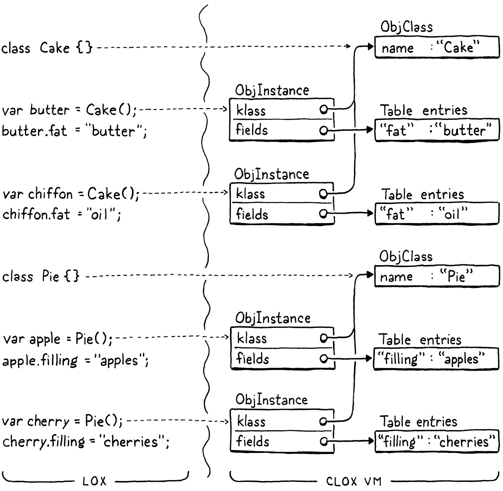

# 27. Classes and Instances 類與實例

> Caring too much for objects can destroy you. Only—if you care for a thing enough, it takes on a life of its own, doesn’t it? And isn’t the whole point of things—beautiful things—that they connect you to some larger beauty?
>
> ​															——Donna Tartt, *The Goldfinch*

對物品過於關心會毀了你。只是，如果你對一件事物足夠關心，它就有了自己的生命，不是嗎？而事物——美麗的事物——的全部意義不就是把你和一些更大的美聯繫起來嗎？（唐娜 塔特，《金翅雀》）

> The last area left to implement in clox is object-oriented programming. OOP is a bundle of intertwined features: classes, instances, fields, methods, initializers, and inheritance. Using relatively high-level Java, we packed all that into two chapters. Now that we’re coding in C, which feels like building a model of the Eiffel tower out of toothpicks, we’ll devote three chapters to covering the same territory. This makes for a leisurely stroll through the implementation. After strenuous chapters like [closures](http://www.craftinginterpreters.com/closures.html) and the [garbage collector](http://www.craftinginterpreters.com/garbage-collection.html), you have earned a rest. In fact, the book should be easy from here on out.

clox中需要實現的最後一個領域是面向對象編程。OOP是一堆交織在一起的特性：類、實例、字段、方法、初始化式和繼承[^1]。使用相對高級的Java，我們可以把這些內容都裝進兩章中。現在我們用C語言編寫代碼，感覺就像用牙籤搭建埃菲爾鐵塔的模型，我們將用三章的篇幅來涵蓋這些內容。這使得我們可以悠閒地漫步在實現中。在經歷了閉包和垃圾回收器這樣艱苦的章節之後，你贏得了休息的機會。事實上，從這裏開始，這本書都是很容易的。

> In this chapter, we cover the first three features: classes, instances, and fields. This is the stateful side of object orientation. Then in the next two chapters, we will hang behavior and code reuse off of those objects.

在本章中，我們會介紹前三個特性：類、實例和字段。這就是面向對象中表現出狀態的一面。然後在接下來的兩章中，我們會對這些對象掛上行為和代碼重用能力。

> ## 27 . 1 Class Objects

## 27.1 Class對象

> In a class-based object-oriented language, everything begins with classes. They define what sorts of objects exist in the program and are the factories used to produce new instances. Going bottom-up, we’ll start with their runtime representation and then hook that into the language.

在一門基於類的面向對象的語言中，一切都從類開始。它們定義了程序中存在什麼類型的對象，並且它們也是用來生產新實例的工廠。自下向上，我們將從它們的運行時表示形式開始，然後將其掛接到語言中。

> By this point, we’re well-acquainted with the process of adding a new object type to the VM. We start with a struct.

至此，我們已經非常熟悉向VM添加新對象類型的過程了。我們從一個結構體開始。

*<u>object.h，在結構體ObjClosure後添加代碼：</u>*

```c
} ObjClosure;
// 新增部分開始
typedef struct {
  Obj obj;
  ObjString* name;
} ObjClass;
// 新增部分結束
ObjClosure* newClosure(ObjFunction* function);
```

> After the Obj header, we store the class’s name. This isn’t strictly needed for the user’s program, but it lets us show the name at runtime for things like stack traces.
>

在Obj頭文件之後，我們存儲了類的名稱。對於用户的程序來説，這一信息並不是嚴格需要的，但是它讓我們可以在運行時顯示名稱，例如堆棧跟蹤。

> The new type needs a corresponding case in the ObjType enum.
>

新類型需要在ObjType枚舉中有一個對應的項。

*<u>object.h，在枚舉ObjType中添加代碼：</u>*

```c
typedef enum {  
  // 新增部分開始
  OBJ_CLASS,
  // 新增部分結束
  OBJ_CLOSURE,
```

> And that type gets a corresponding pair of macros. First, for testing an object’s type:
>

而該類型會有一組對應的宏。首先，用於測試對象的類型：

*<u>object.h，添加代碼：</u>*

```c
#define OBJ_TYPE(value)        (AS_OBJ(value)->type)
// 新增部分開始
#define IS_CLASS(value)        isObjType(value, OBJ_CLASS)
// 新增部分結束
#define IS_CLOSURE(value)      isObjType(value, OBJ_CLOSURE)
```

> And then for casting a Value to an ObjClass pointer:
>

然後是用於將一個Value轉換為一個ObjClass指針：

*<u>object.h，添加代碼：</u>*

```c
#define IS_STRING(value)       isObjType(value, OBJ_STRING)
// 新增部分開始
#define AS_CLASS(value)        ((ObjClass*)AS_OBJ(value))
// 新增部分結束
#define AS_CLOSURE(value)      ((ObjClosure*)AS_OBJ(value))
```

> The VM creates new class objects using this function:

VM使用這個函數創建新的類對象：

*<u>object.h，在結構體ObjClass後添加代碼：</u>*

```c
} ObjClass;
// 新增部分開始
ObjClass* newClass(ObjString* name);
// 新增部分結束
ObjClosure* newClosure(ObjFunction* function);
```

> The implementation lives over here:

實現在這裏：

*<u>object.c，在allocateObject()方法後添加代碼：</u>*

```c
ObjClass* newClass(ObjString* name) {
  ObjClass* klass = ALLOCATE_OBJ(ObjClass, OBJ_CLASS);
  klass->name = name; 
  return klass;
}
```

> Pretty much all boilerplate. It takes in the class’s name as a string and stores it. Every time the user declares a new class, the VM will create a new one of these ObjClass structs to represent it.

幾乎都是模板代碼。它接受並保存字符串形式的類名。每當用户聲明一個新類時，VM會創建一個新的ObjClass結構體來表示它[^2]。

> When the VM no longer needs a class, it frees it like so:

當VM不再需要某個類時，這樣釋放它：

*<u>memory.c，在freeObject()方法中添加代碼：</u>*

```c
  switch (object->type) {
    // 新增部分開始
    case OBJ_CLASS: {
      FREE(ObjClass, object);
      break;
    } 
    // 新增部分結束
    case OBJ_CLOSURE: {
```

> We have a memory manager now, so we also need to support tracing through class objects.
>

我們現在有一個內存管理器，所以我們也需要支持通過類對象進行跟蹤。

*<u>memory.c，在blackenObject()方法中添加代碼：</u>*

```c
  switch (object->type) {
    // 新增部分開始
    case OBJ_CLASS: {
      ObjClass* klass = (ObjClass*)object;
      markObject((Obj*)klass->name);
      break;
    }
    // 新增部分結束
    case OBJ_CLOSURE: {
```

> When the GC reaches a class object, it marks the class’s name to keep that string alive too.

當GC到達一個類對象時，它會標記該類的名稱，以保持該字符串也能存活。

> The last operation the VM can perform on a class is printing it.
>

VM可以對類執行的最後一個操作是打印它。

*<u>object.c，在printObject()方法中添加代碼：</u>*

```c
  switch (OBJ_TYPE(value)) {
    // 新增部分開始
    case OBJ_CLASS:
      printf("%s", AS_CLASS(value)->name->chars);
      break;
    // 新增部分結束  
    case OBJ_CLOSURE:
```

> A class simply says its own name.
>

類只是簡單地説出它的名稱。

> ## 27 . 2 Class Declarations

## 27.2 類聲明

> Runtime representation in hand, we are ready to add support for classes to the language. Next, we move into the parser.

有了運行時表示形式，我們就可以向語言中添加對類的支持了。接下來，我們進入語法分析部分。

*<u>compiler.c，在declaration()方法中替換1行：</u>*

```c
static void declaration() {
  // 替換部分開始
  if (match(TOKEN_CLASS)) {
    classDeclaration();
  } else if (match(TOKEN_FUN)) {
  // 替換部分結束
    funDeclaration();
```

> Class declarations are statements, and the parser recognizes one by the leading `class` keyword. The rest of the compilation happens over here:

類聲明是語句，解釋器通過前面的`class`關鍵字識別聲明語句。剩下部分的編譯工作在這裏進行：

*<u>compiler.c，在function()方法後添加代碼：</u>*

```c
static void classDeclaration() {
  consume(TOKEN_IDENTIFIER, "Expect class name.");
  uint8_t nameConstant = identifierConstant(&parser.previous);
  declareVariable();

  emitBytes(OP_CLASS, nameConstant);
  defineVariable(nameConstant);

  consume(TOKEN_LEFT_BRACE, "Expect '{' before class body.");
  consume(TOKEN_RIGHT_BRACE, "Expect '}' after class body.");
}
```

> Immediately after the `class` keyword is the class’s name. We take that identifier and add it to the surrounding function’s constant table as a string. As you just saw, printing a class shows its name, so the compiler needs to stuff the name string somewhere that the runtime can find. The constant table is the way to do that.

緊跟在`class`關鍵字之後的是類名。我們將這個標識符作為字符串添加到外圍函數的常量表中。正如你剛才看到的，打印一個類會顯示它的名稱，所以編譯器需要把這個名稱字符串放在運行時可以找到的地方。常量表就是實現這一目的的方法。

> The class’s name is also used to bind the class object to a variable of the same name. So we declare a variable with that identifier right after consuming its token.

類名也被用來將類對象與一個同名變量綁定。因此，我們在使用完它的詞法標識後，馬上用這個標識符聲明一個變量[^3]。

> Next, we emit a new instruction to actually create the class object at runtime. That instruction takes the constant table index of the class’s name as an operand.

接下來我們發出一條新指令，在運行時實際創建類對象。該指令以類名的常量表索引作為操作數。

> After that, but before compiling the body of the class, we define the variable for the class’s name. *Declaring* the variable adds it to the scope, but recall from [a previous chapter](http://www.craftinginterpreters.com/local-variables.html#another-scope-edge-case) that we can’t *use* the variable until it’s *defined*. For classes, we define the variable before the body. That way, users can refer to the containing class inside the bodies of its own methods. That’s useful for things like factory methods that produce new instances of the class.

在此之後，但是在編譯類主體之前，我們使用類名定義變量。*聲明*變量會將其添加到作用域中，但請回想一下前一章的內容，在定義變量之前我們不能使用它。對於類，我們在解析主體之前定義變量。這樣，用户就可以在類自己的方法主體中引用類本身。這對於產生類的新實例的工廠方法等場景來説是很有用的。

> Finally, we compile the body. We don’t have methods yet, so right now it’s simply an empty pair of braces. Lox doesn’t require fields to be declared in the class, so we’re done with the body—and the parser—for now.

最後，我們編譯主體。我們現在還沒有方法，所以現在它只是一對空的大括號。Lox不要求在類中聲明字段，因此我們目前已經完成了主體（和解析器）的工作。

> The compiler is emitting a new instruction, so let’s define that.

編譯器會發出一條新指令，所以我們來定義它。

*<u>chunk.h，在枚舉OpCode中添加代碼：</u>*

```c
  OP_RETURN,
  // 新增部分開始
  OP_CLASS,
  // 新增部分結束
} OpCode;
```

> And add it to the disassembler:

然後將其添加到反彙編程序中：

*<u>debug.c，在disassembleInstruction()方法中添加代碼：</u>*

```c
    case OP_RETURN:
      return simpleInstruction("OP_RETURN", offset);
    // 新增部分開始
    case OP_CLASS:
      return constantInstruction("OP_CLASS", chunk, offset);
    // 新增部分結束
    default:
```

> For such a large-seeming feature, the interpreter support is minimal.

對於這樣一個看起來很大的特性，解釋器支持是最小的。

*<u>vm.c，在run()方法中添加代碼：</u>*

```c
        break;
      }
      // 新增部分開始
      case OP_CLASS:
        push(OBJ_VAL(newClass(READ_STRING())));
        break;
      // 新增部分結束  
    }
```

> We load the string for the class’s name from the constant table and pass that to `newClass()`. That creates a new class object with the given name. We push that onto the stack and we’re good. If the class is bound to a global variable, then the compiler’s call to `defineVariable()` will emit code to store that object from the stack into the global variable table. Otherwise, it’s right where it needs to be on the stack for a new local variable.

我們從常量表中加載類名的字符串，並將其傳遞給`newClass()`。這將創建一個具有給定名稱的新類對象。我們把它推入棧中就可以了。如果該類被綁定到一個全局變量上，那麼編譯器對`defineVariable()`的調用就會生成字節碼，將該對象從棧中存儲到全局變量表。否則，它就正好位於棧中新的局部變量所在的位置[^4]。

> There you have it, our VM supports classes now. You can run this:

好了，我們的虛擬機現在支持類了。你可以運行這段代碼：

```c
class Brioche {}
print Brioche;
```

> Unfortunately, printing is about *all* you can do with classes, so next is making them more useful.

不幸的是，打印是你對類所能做的全部事情，所以接下來是讓它們更有用。

> ## 27 . 3 Instances of Classes

## 27.3 類的實例

> Classes serve two main purposes in a language:

類在一門語言中主要有兩個作用：

> - **They are how you create new instances.** Sometimes this involves a `new` keyword, other times it’s a method call on the class object, but you usually mention the class by name *somehow* to get a new instance.
> - **They contain methods.** These define how all instances of the class behave.

* **它們是你創建新實例的方式**。有時這會涉及到`new`關鍵字，有時則是對類對象的方法調用，但是你通常會以某種方式通過類的名稱來獲得一個新的實例。
* **它們包含方法**。這些方法定義了類的所有實例的行為方式。

> We won’t get to methods until the next chapter, so for now we will only worry about the first part. Before classes can create instances, we need a representation for them.

我們要到下一章才會講到方法，所以我們現在只關心第一部分。在類能夠創建實例之前，我們需要為它們提供一個表示形式。

*<u>object.h，在結構體ObjClass後添加代碼：</u>*

```c
} ObjClass;
// 新增部分開始
typedef struct {
  Obj obj;
  ObjClass* klass;
  Table fields; 
} ObjInstance;
// 新增部分結束
ObjClass* newClass(ObjString* name);
```

> Instances know their class—each instance has a pointer to the class that it is an instance of. We won’t use this much in this chapter, but it will become critical when we add methods.

實例知道它們的類——每個實例都有一個指向它所屬類的指針。在本章中我們不會過多地使用它，但是等我們添加方法時，它將會變得非常重要。

> More important to this chapter is how instances store their state. Lox lets users freely add fields to an instance at runtime. This means we need a storage mechanism that can grow. We could use a dynamic array, but we also want to look up fields by name as quickly as possible. There’s a data structure that’s just perfect for quickly accessing a set of values by name and—even more conveniently—we’ve already implemented it. Each instance stores its fields using a hash table.

對本章來説，更重要的是實例如何存儲它們的狀態。Lox允許用户在運行時自由地向實例中添加字段。這意味着我們需要一種可以增長的存儲機制。我們可以使用動態數組，但我們也希望儘可能快地按名稱查找字段。有一種數據結構非常適合於按名稱快速訪問一組值——甚至更方便的是——我們已經實現了它。每個實例都使用哈希表來存儲其字段[^5]。

> We only need to add an include, and we’ve got it.

我們只需要添加一個頭文件引入，就可以了。

*<u>object.h，添加代碼：</u>*

```c
#include "chunk.h"
// 新增部分開始
#include "table.h"
// 新增部分結束
#include "value.h"
```

> This new struct gets a new object type.

新結構體有新的對象類型。

*<u>object.h，在枚舉ObjType中添加代碼：</u>*

```c
  OBJ_FUNCTION,
  // 新增部分開始
  OBJ_INSTANCE,
  // 新增部分結束
  OBJ_NATIVE,
```

> I want to slow down a bit here because the Lox *language’s* notion of “type” and the VM *implementation’s* notion of “type” brush against each other in ways that can be confusing. Inside the C code that makes clox, there are a number of different types of Obj—ObjString, ObjClosure, etc. Each has its own internal representation and semantics.

這裏我想放慢一點速度，因為Lox*語言*中的“type”概念和*虛擬機實現*中的“type”概念是相互牴觸的，可能會造成混淆。在生成clox 的C語言代碼中，有許多不同類型的Obj——ObjString、ObjClosure等等。每個都有自己的內部表示和語義。

> In the Lox *language*, users can define their own classes—say Cake and Pie—and then create instances of those classes. From the user’s perspective, an instance of Cake is a different type of object than an instance of Pie. But, from the VM’s perspective, every class the user defines is simply another value of type ObjClass. Likewise, each instance in the user’s program, no matter what class it is an instance of, is an ObjInstance. That one VM object type covers instances of all classes. The two worlds map to each other something like this:

在Lox*語言*中，用户可以定義自己的類——比如Cake和Pie——然後創建這些類的實例。從用户的角度來看，Cake實例與Pie實例是不同類型的對象。但是，從虛擬機的角度來看，用户定義的每個類都只是另一個ObjClass類型的值。同樣，用户程序中的每個實例，無論它是什麼類的實例，都是一個ObjInstance。這一虛擬機對象類型涵蓋了所有類的實例。這兩個世界之間的映射是這樣的：



> Got it? OK, back to the implementation. We also get our usual macros.

明白了嗎？好了，回到實現中。我們新增了一些熟悉的宏。

*<u>object.h，添加代碼：</u>*

```c
#define IS_FUNCTION(value)     isObjType(value, OBJ_FUNCTION)
// 新增部分開始
#define IS_INSTANCE(value)     isObjType(value, OBJ_INSTANCE)
// 新增部分結束
#define IS_NATIVE(value)       isObjType(value, OBJ_NATIVE)
```

> And:

以及：

*<u>object.h，添加代碼：</u>*

```c
#define AS_FUNCTION(value)     ((ObjFunction*)AS_OBJ(value))
// 新增部分開始
#define AS_INSTANCE(value)     ((ObjInstance*)AS_OBJ(value))
// 新增部分結束
#define AS_NATIVE(value) \
```

> Since fields are added after the instance is created, the “constructor” function only needs to know the class.

因為字段是在實例創建之後添加的，所以“構造器”函數只需要知道類。

*<u>object.h，在newFunction()方法後添加代碼：</u>*

```c
ObjFunction* newFunction();
// 新增部分開始
ObjInstance* newInstance(ObjClass* klass);
// 新增部分結束
ObjNative* newNative(NativeFn function);
```

> We implement that function here:

我們在這裏實現該函數：

*<u>object.c，在newFunction()方法後添加代碼：</u>*

```c
ObjInstance* newInstance(ObjClass* klass) {
  ObjInstance* instance = ALLOCATE_OBJ(ObjInstance, OBJ_INSTANCE);
  instance->klass = klass;
  initTable(&instance->fields);
  return instance;
}
```

> We store a reference to the instance’s class. Then we initialize the field table to an empty hash table. A new baby object is born!

我們存儲了對實例的類的引用。然後我們將字段表初始化為一個空的哈希表。一個全新的對象誕生了！

> At the sadder end of the instance’s lifespan, it gets freed.

在實例生命週期的最後階段，它被釋放了。

*<u>memory.c，在freeObject()方法中添加代碼：</u>*

```c
      FREE(ObjFunction, object);
      break;
    }
    // 新增部分開始
    case OBJ_INSTANCE: {
      ObjInstance* instance = (ObjInstance*)object;
      freeTable(&instance->fields);
      FREE(ObjInstance, object);
      break;
    }
    // 新增部分結束
    case OBJ_NATIVE:
```

> The instance owns its field table so when freeing the instance, we also free the table. We don’t explicitly free the entries *in* the table, because there may be other references to those objects. The garbage collector will take care of those for us. Here we free only the entry array of the table itself.

實例擁有自己的字段表，所以當釋放實例時，我們也會釋放該表。我們沒有顯式地釋放表中的條目，因為可能存在對這些對象的其它引用。垃圾回收器會幫我們處理這些問題。這裏我們只釋放表本身的條目數組。

> Speaking of the garbage collector, it needs support for tracing through instances.

説到垃圾回收，它需要支持通過實例進行跟蹤。

*<u>memory.c，在blackenObject()方法中添加代碼：</u>*

```c
      markArray(&function->chunk.constants);
      break;
    }
    // 新增部分開始
    case OBJ_INSTANCE: {
      ObjInstance* instance = (ObjInstance*)object;
      markObject((Obj*)instance->klass);
      markTable(&instance->fields);
      break;
    }
    // 新增部分結束
    case OBJ_UPVALUE:
```

> If the instance is alive, we need to keep its class around. Also, we need to keep every object referenced by the instance’s fields. Most live objects that are not roots are reachable because some instance refers to the object in a field. Fortunately, we already have a nice `markTable()` function to make tracing them easy.

如果這個實例是活動的，我們需要保留它的類。此外，我們還需要保留每個被實例字段引用的對象。大多數不是根的活動對象都是可達的，因為某些實例會在某個字段中引用該對象。幸運的是，我們已經有了一個很好的`markTable()`函數，可以輕鬆地跟蹤它們。

> Less critical but still important is printing.

不太關鍵但仍然重要的是打印。

*<u>object.c，在printObject()方法中添加代碼：</u>*

```c
      break;
    // 新增部分開始  
    case OBJ_INSTANCE:
      printf("%s instance",
             AS_INSTANCE(value)->klass->name->chars);
      break;
    // 新增部分結束  
    case OBJ_NATIVE:
```

> An instance prints its name followed by “instance”. (The “instance” part is mainly so that classes and instances don’t print the same.)

實例會打印它的名稱，並在後面加上“instance”[^6]。（“instance”部分主要是為了使類和實例不會打印出相同的內容）

> The real fun happens over in the interpreter. Lox has no special `new` keyword. The way to create an instance of a class is to invoke the class itself as if it were a function. The runtime already supports function calls, and it checks the type of object being called to make sure the user doesn’t try to invoke a number or other invalid type.

真正有趣的部分在解釋器中，Lox沒有特殊的`new`關鍵字。創建類實例的方法是調用類本身，就像調用函數一樣。運行時已經支持函數調用，它會檢查被調用對象的類型，以確保用户不會試圖調用數字或其它無效類型。

> We extend that runtime checking with a new case.

我們用一個新的case分支來擴展運行時的檢查。

*<u>vm.c，在callValue()方法中添加代碼：</u>*

```c
    switch (OBJ_TYPE(callee)) {
      // 新增部分開始
      case OBJ_CLASS: {
        ObjClass* klass = AS_CLASS(callee);
        vm.stackTop[-argCount - 1] = OBJ_VAL(newInstance(klass));
        return true;
      }
      // 新增部分結束
      case OBJ_CLOSURE:
```

> If the value being called—the object that results when evaluating the expression to the left of the opening parenthesis—is a class, then we treat it as a constructor call. We create a new instance of the called class and store the result on the stack.

如果被調用的值（在左括號左邊的表達式求值得到的對象）是一個類，則將其視為一個構造函數調用。我們創建一個被調用類的新實例，並將結果存儲在棧中[^7]。

> We’re one step farther. Now we can define classes and create instances of them.

我們又前進了一步。現在我們可以定義類並創建它們的實例了。

```c
class Brioche {}
print Brioche();
```

> Note the parentheses after `Brioche` on the second line now. This prints “Brioche instance”.

注意第二行`Brioche`後面的括號。這裏會打印“Brioche instance”。

> ## 27 . 4 Get and Set Expressions

## 27.4 Get和SET表達式

> Our object representation for instances can already store state, so all that remains is exposing that functionality to the user. Fields are accessed and modified using get and set expressions. Not one to break with tradition, Lox uses the classic “dot” syntax:

實例的對象表示形式已經可以存儲狀態了，所以剩下的就是把這個功能暴露給用户。字段是使用get和set表達式進行訪問和修改的。Lox並不喜歡打破傳統，這裏也沿用了經典的“點”語法：

```c
eclair.filling = "pastry creme";
print eclair.filling;
```

> The period—full stop for my English friends—works sort of like an infix operator. There is an expression to the left that is evaluated first and produces an instance. After that is the `.` followed by a field name. Since there is a preceding operand, we hook this into the parse table as an infix expression.

句號——對英國朋友來説是句號——其作用有點像一箇中綴運算符[^8]。左邊有一個表達式，首先被求值併產生一個實例。之後是`.`後跟一個字段名稱。由於前面有一個操作數，我們將其作為中綴表達式放到解析表中。

*<u>compiler.c，替換1行：</u>*

```c
  [TOKEN_COMMA]         = {NULL,     NULL,   PREC_NONE},
  // 替換部分開始
  [TOKEN_DOT]           = {NULL,     dot,    PREC_CALL},
  // 替換部分結束
  [TOKEN_MINUS]         = {unary,    binary, PREC_TERM},
```

> As in other languages, the `.` operator binds tightly, with precedence as high as the parentheses in a function call. After the parser consumes the dot token, it dispatches to a new parse function.

和其它語言一樣，`.`操作符綁定緊密，其優先級和函數調用中的括號一樣高。解析器消費了點標識之後，會分發給一個新的解析函數。

*<u>compiler.c，在call()方法後添加代碼：</u>*

```c
static void dot(bool canAssign) {
  consume(TOKEN_IDENTIFIER, "Expect property name after '.'.");
  uint8_t name = identifierConstant(&parser.previous);

  if (canAssign && match(TOKEN_EQUAL)) {
    expression();
    emitBytes(OP_SET_PROPERTY, name);
  } else {
    emitBytes(OP_GET_PROPERTY, name);
  }
}
```

> The parser expects to find a property name immediately after the dot. We load that token’s lexeme into the constant table as a string so that the name is available at runtime.

解析器希望在點運算符後面立即找到一個屬性名稱[^9]。我們將該詞法標識的詞素作為字符串加載到常量表中，這樣該名稱在運行時就是可用的。

> We have two new expression forms—getters and setters—that this one function handles. If we see an equals sign after the field name, it must be a set expression that is assigning to a field. But we don’t *always* allow an equals sign after the field to be compiled. Consider:

我們將兩種新的表達式形式——getter和setter——都交由這一個函數處理。如果我們看到字段名稱後有一個等號，那麼它一定是一個賦值給字段的set表達式。但我們並不總是允許編譯字段後面的等號。考慮一下：

```c
a + b.c = 3
```

> This is syntactically invalid according to Lox’s grammar, which means our Lox implementation is obligated to detect and report the error. If `dot()` silently parsed the `= 3` part, we would incorrectly interpret the code as if the user had written:

根據Lox的文法，這在語法上是無效的，這意味着我們的Lox實現有義務檢測和報告這個錯誤。如果`dot()`默默地解析`=3`的部分，我們就會錯誤地解釋代碼，就像用户寫的是：

```c
a + (b.c = 3)
```

> The problem is that the `=` side of a set expression has much lower precedence than the `.` part. The parser may call `dot()` in a context that is too high precedence to permit a setter to appear. To avoid incorrectly allowing that, we parse and compile the equals part only when `canAssign` is true. If an equals token appears when `canAssign` is false, `dot()` leaves it alone and returns. In that case, the compiler will eventually unwind up to `parsePrecedence()`, which stops at the unexpected `=` still sitting as the next token and reports an error.

問題是，set表達式中的`=`側優先級遠低於`.`部分。解析器有可能會在一個優先級高到不允許出現setter的上下文中調用`dot()`。為了避免錯誤地允許這種情況，我們只有在`canAssign`為true時才去解析和編譯等號部分。如果在`canAssign`為false時出現等號標識，`dot()`會保留它並返回。在這種情況下，編譯器最終會進入`parsePrecedence()`，而該方法會在非預期的`=`（仍然作為下一個標識）處停止，並報告一個錯誤。

> If we find an `=` in a context where it *is* allowed, then we compile the expression that follows. After that, we emit a new `OP_SET_PROPERTY` instruction. That takes a single operand for the index of the property name in the constant table. If we didn’t compile a set expression, we assume it’s a getter and emit an `OP_GET_PROPERTY` instruction, which also takes an operand for the property name.

如果我們在允許使用等號的上下文中找到`=`，則編譯後面的表達式。之後，我們發出一條新的`OP_SET_PROPERTY`指令[^10]。這條指令接受一個操作數，作為屬性名稱在常量表中的索引。如果我們沒有編譯set表達式，就假定它是getter，併發出一條`OP_GET_PROPERTY`指令，它也接受一個操作數作為屬性名。

> Now is a good time to define these two new instructions.

現在是定義這兩條新指令的好時機。

*<u>chunk.h，在枚舉OpCode中添加代碼：</u>*

```c
  OP_SET_UPVALUE,
  // 新增部分開始
  OP_GET_PROPERTY,
  OP_SET_PROPERTY,
  // 新增部分結束
  OP_EQUAL,
```

> And add support for disassembling them:

並在反彙編程序中為它們添加支持：

*<u>debug.c，在disassembleInstruction()方法中添加代碼：</u>*

```c
      return byteInstruction("OP_SET_UPVALUE", chunk, offset);
    // 新增部分開始
    case OP_GET_PROPERTY:
      return constantInstruction("OP_GET_PROPERTY", chunk, offset);
    case OP_SET_PROPERTY:
      return constantInstruction("OP_SET_PROPERTY", chunk, offset);
    // 新增部分結束
    case OP_EQUAL:
```

> ### 27 . 4 . 1 Interpreting getter and setter expressions

### 27.4.1 解釋getter和setter表達式

> Sliding over to the runtime, we’ll start with get expressions since those are a little simpler.

進入運行時，我們從獲取表達式開始，因為它們更簡單一些。

*<u>vm.c，在run()方法中添加代碼：</u>*

```c
      }
      // 新增部分開始
      case OP_GET_PROPERTY: {
        ObjInstance* instance = AS_INSTANCE(peek(0));
        ObjString* name = READ_STRING();

        Value value;
        if (tableGet(&instance->fields, name, &value)) {
          pop(); // Instance.
          push(value);
          break;
        }
      }
      // 新增部分結束
      case OP_EQUAL: {
```

> When the interpreter reaches this instruction, the expression to the left of the dot has already been executed and the resulting instance is on top of the stack. We read the field name from the constant pool and look it up in the instance’s field table. If the hash table contains an entry with that name, we pop the instance and push the entry’s value as the result.

當解釋器到達這條指令時，點左邊的表達式已經被執行，得到的實例就在棧頂。我們從常量池中讀取字段名，並在實例的字段表中查找該名稱。如果哈希表中包含具有該名稱的條目，我們就彈出實例，並將該條目的值作為結果壓入棧。

> Of course, the field might not exist. In Lox, we’ve defined that to be a runtime error. So we add a check for that and abort if it happens.

當然，這個字段可能不存在。在Lox中，我們將其定義為運行時錯誤。所以我們添加了一個檢查，如果發生這種情況就中止。

*<u>vm.c，在run()方法中添加代碼：</u>*

```c
          push(value);
          break;
        }
        // 新增部分開始
        runtimeError("Undefined property '%s'.", name->chars);
        return INTERPRET_RUNTIME_ERROR;
        // 新增部分結束
      }
      case OP_EQUAL: {
```

> There is another failure mode to handle which you’ve probably noticed. The above code assumes the expression to the left of the dot did evaluate to an ObjInstance. But there’s nothing preventing a user from writing this:

你可能已經注意到了，還有另一種需要處理的失敗模式。上面的代碼中假定了點左邊的表達式計算結果確實是一個ObjInstance。但是沒有什麼可以阻止用户這樣寫：

```javascript
var obj = "not an instance";
print obj.field;
```

> The user’s program is wrong, but the VM still has to handle it with some grace. Right now, it will misinterpret the bits of the ObjString as an ObjInstance and, I don’t know, catch on fire or something definitely not graceful.

用户的程序是錯誤的，但是虛擬機仍然需要以某種優雅的方式來處理它。現在，它會把ObjString 數據誤認為是一個ObjInstance ，並且，我不確定，代碼起火或發生其它事情絕對是不優雅的。

> In Lox, only instances are allowed to have fields. You can’t stuff a field onto a string or number. So we need to check that the value is an instance before accessing any fields on it.

在Lox中，只有實例才允許有字段。你不能把字段塞到字符串或數字中。因此，在訪問某個值上的任何字段之前，檢查該值是否是一個實例[^11]。

*<u>vm.c，在run()方法中添加代碼：</u>*

```c
      case OP_GET_PROPERTY: {
        // 新增部分開始
        if (!IS_INSTANCE(peek(0))) {
          runtimeError("Only instances have properties.");
          return INTERPRET_RUNTIME_ERROR;
        }
        // 新增部分結束
        ObjInstance* instance = AS_INSTANCE(peek(0));
```

> If the value on the stack isn’t an instance, we report a runtime error and safely exit.

如果棧中的值不是實例，則報告一個運行時錯誤並安全退出。

> Of course, get expressions are not very useful when no instances have any fields. For that we need setters.

當然，如果實例沒有任何字段，get表達式就不太有用了。因此，我們需要setter。

*<u>vm.c，在run()方法中添加代碼：</u>*

```c
        return INTERPRET_RUNTIME_ERROR;
      }
      // 新增部分開始
      case OP_SET_PROPERTY: {
        ObjInstance* instance = AS_INSTANCE(peek(1));
        tableSet(&instance->fields, READ_STRING(), peek(0));
        Value value = pop();
        pop();
        push(value);
        break;
      }
      // 新增部分結束
      case OP_EQUAL: {
```

> This is a little more complex than `OP_GET_PROPERTY`. When this executes, the top of the stack has the instance whose field is being set and above that, the value to be stored. Like before, we read the instruction’s operand and find the field name string. Using that, we store the value on top of the stack into the instance’s field table.

這比`OP_GET_PROPERTY`要複雜一些。當執行此指令時，棧頂有待設置字段的實例，在該實例之上有要存儲的值。與前面一樣，我們讀取指令的操作數，並查找字段名稱字符串。使用該方法，我們將棧頂的值存儲到實例的字段表中。

> After that is a little stack juggling. We pop the stored value off, then pop the instance, and finally push the value back on. In other words, we remove the *second* element from the stack while leaving the top alone. A setter is itself an expression whose result is the assigned value, so we need to leave that value on the stack. Here’s what I mean:

在那之後是一些棧技巧。我們將存儲的值彈出，然後彈出實例，最後再把值壓回棧中。換句話説，我們從棧中刪除第二個元素，而保留最上面的元素。setter本身是一個表達式，其結果就是所賦的值，所以我們需要將值保留在棧上。我的意思是[^12]：

```javascript
class Toast {}
var toast = Toast();
print toast.jam = "grape"; // Prints "grape".
```

> Unlike when reading a field, we don’t need to worry about the hash table not containing the field. A setter implicitly creates the field if needed. We do need to handle the user incorrectly trying to store a field on a value that isn’t an instance.

與讀取字段不同，我們不需要擔心哈希表中不包含該字段。如果需要的話，setter會隱式地創建這個字段。我們確實需要處理用户不正確地試圖在非實例的值上存儲字段的情況。

*<u>vm.c，在run()方法中添加代碼：</u>*

```c
      case OP_SET_PROPERTY: {
        // 新增部分開始
        if (!IS_INSTANCE(peek(1))) {
          runtimeError("Only instances have fields.");
          return INTERPRET_RUNTIME_ERROR;
        }
        // 新增部分結束
        ObjInstance* instance = AS_INSTANCE(peek(1));
```

> Exactly like with get expressions, we check the value’s type and report a runtime error if it’s invalid. And, with that, the stateful side of Lox’s support for object-oriented programming is in place. Give it a try:

就像get表達式一樣，我們檢查值的類型，如果無效就報告一個運行時錯誤。這樣一來，Lox對面向對象編程中有狀態部分的支持就到位了。試一試：

```javascript
class Pair {}

var pair = Pair();
pair.first = 1;
pair.second = 2;
print pair.first + pair.second; // 3.
```

> This doesn’t really feel very *object*-oriented. It’s more like a strange, dynamically typed variant of C where objects are loose struct-like bags of data. Sort of a dynamic procedural language. But this is a big step in expressiveness. Our Lox implementation now lets users freely aggregate data into bigger units. In the next chapter, we will breathe life into those inert blobs.

這感覺不太面向對象。它更像是一種奇怪的、動態類型的C語言變體，其中的對象是鬆散的類似結構體的數據包。有點像動態過程化語言。但這是表達能力的一大進步。我們的Lox實現現在允許用户自由地將數據聚合成更大的單元。在下一章中，我們將為這些遲緩的數據注入活力。


[^1]: 那些對面向對象編程有強烈看法的人——讀作“每個人”——往往認為OOP意味着一些非常具體的語言特性清單，但實際上有一個完整的空間可以探索，而每種語言都有自己的成分和配方。<BR>Self有對象但沒有類。CLOS有方法，當沒有把它們附加到特定的類中。C++最初沒有運行時多態——沒有虛方法。Python有多重繼承，但Java沒有。Ruby把方法附加在類上，但你也可以在單個對象上定義方法。
[^2]: 我將變量命名為“klass”，不僅僅是為了給虛擬機一種古怪的幼兒園的"Kidz Korner "感覺。它使得clox更容易被編譯為C++，而C++中“class”是一個保留字。
[^3]: 我們可以讓類聲明成為表達式而不是語句——比較它們本質上是一個產生值的字面量。然後用户必須自己顯式地將類綁定到一個變量，比如：`var Pie = class {}`。這有點像lambda函數，但只是針對類的。但由於我們通常希望類被命名，所以將其視為聲明是有意義的。
[^4]: “局部（Local）”類——在函數或塊主體中聲明的類，是一個不尋常的概念。許多語言根本不允許這一特性。但由於Lox是一種動態類型腳本語言，它會對程序的頂層代碼和函數以及塊的主體進行統一處理。類只是另一種聲明，既然你可以在塊中聲明變量和函數，那你也可以在塊中聲明類。
[^5]: 能夠在運行時自由地向對象添加字段，是大多數動態語言和靜態語言之間的一個很大的實際區別。靜態類型語言通常要求顯式聲明字段。這樣，編譯器就確切知道每個實例有哪些字段。它可以利用這一點來確定每個實例所需的精確內存量，以及每個字段在內存中的偏移量。<BR>在Lox和其它動態語言中，訪問字段通常是一次哈希表查詢。常量時間複雜度，但仍然是相當重的。在C++這樣的語言中，訪問一個字段就像對指針偏移一個整數常量一樣快。
[^6]: 大多數面向對象的語言允許類定義某種形式的`toString()`方法，讓該類指定如何將其實例轉換為字符串並打印出來。如果Lox不是一門玩具語言，我也想要支持它。
[^7]: 我們暫時忽略傳遞給調用的所有參數。在下一章添加對初始化器的支持時，我們會重新審視這一段代碼。
[^8]: 我説“有點”是因為`.`右邊的不是表達式，而是一個標識符，其語義由get或set表達式本身來處理。它實際上更接近於一個後綴表達式。
[^9]: 編譯器在這裏使用“屬性（property）”而不是“字段（field）”，因為，請記住，Lox還允許你使用點語法來訪問一個方法而不調用它。“屬性”是一個通用術語，我們用來指代可以在實例上訪問的任何命名實體。字段是基於實例狀態的屬性子集。
[^10]: 你不能設置非字段屬性，所以我認為這個指令本該是`OP_SET_FIELD`，但是我認為它與get指令一致看起來更漂亮。
[^11]: Lox*可以*支持向其它類型的值中添加字段。這是我們的語言，我們可以做我們想做的。但這可能是個壞主意。它大大增加了實現的複雜性，從而損害了性能——例如，字符串駐留變得更加困難。<BR>此外，它還引起了關於數值的相等和同一性的複雜語義問題。如果我給數字`3`附加一個字段，那麼`1+2`的結果也有這個字段嗎？如果是的話，實現上如何跟蹤它？如果不是，這兩個結果中的“3”仍然被認為是相等的嗎？
[^12]: 棧的操作是這樣的：


---

## 習題

1. > Trying to access a non-existent field on an object immediately aborts the entire VM. The user has no way to recover from this runtime error, nor is there any way to see if a field exists *before* trying to access it. It’s up to the user to ensure on their own that only valid fields are read.
   >
   > How do other dynamically typed languages handle missing fields? What do you think Lox should do? Implement your solution.

   試圖訪問一個對象上不存在的字段會立即中止整個虛擬機。用户沒有辦法從這個運行時錯誤中恢復過來，也沒有辦法在試圖訪問一個字段之前看它是否存在。需要由用户自己來確保只讀取有效字段。

   其它動態類型語言是如何處理缺少字段的？你認為Lox應該怎麼做？實現你的解決方案。

2. > Fields are accessed at runtime by their *string* name. But that name must always appear directly in the source code as an *identifier token*. A user program cannot imperatively build a string value and then use that as the name of a field. Do you think they should be able to? Devise a language feature that enables that and implement it.

   字段在運行時是通過它們的*字符串*名稱來訪問的。但是該名稱必須總是作為標識符直接出現在源代碼中。用户程序不能命令式地構建字符串值，然後將其用作字段名。你認為應該這樣做嗎？那就設計一種語言特性來實現它。

3. > Conversely, Lox offers no way to *remove* a field from an instance. You can set a field’s value to `nil`, but the entry in the hash table is still there. How do other languages handle this? Choose and implement a strategy for Lox.

   反過來説，Lox沒有提供從實例中*刪除*字段的方法。你可以將一個字段的值設置為`nil`，但哈希表中的條目仍然存在。其它語言如何處理這個問題？為Lox選擇一個策略並實現。

4. > Because fields are accessed by name at runtime, working with instance state is slow. It’s technically a constant-time operation—thanks, hash tables—but the constant factors are relatively large. This is a major component of why dynamic languages are slower than statically typed ones.
   >
   > How do sophisticated implementations of dynamically typed languages cope with and optimize this?

   因為字段在運行時是按照名稱訪問的，所以對實例狀態的操作是很慢的。從技術上講，這是一個常量時間的操作（感謝哈希表），但是常量因子比較大。這就是動態語言比靜態語言慢的一個主要原因。

   動態類型語言的複雜實現是如何應對和優化這一問題的？
