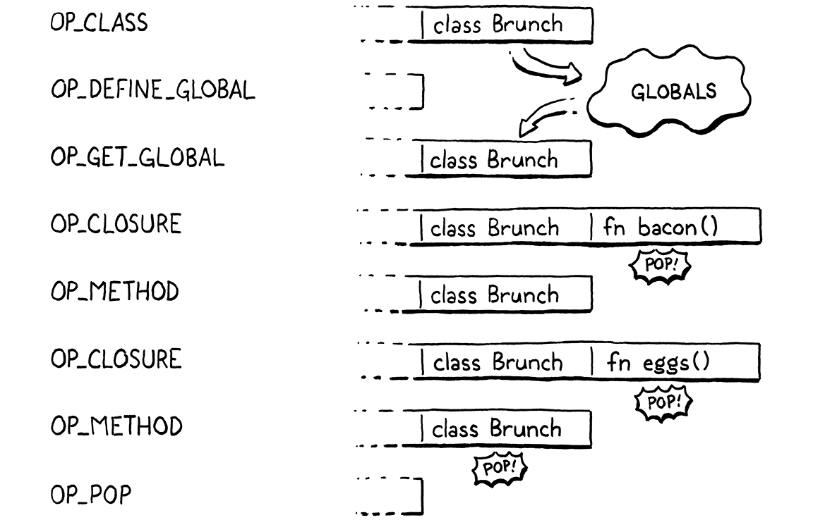

# 28. Methods and Initializers 方法和初始化器

> When you are on the dancefloor, there is nothing to do but dance.
>
> ​							—— Umberto Eco, *The Mysterious Flame of Queen Loana*

當你在舞池裏時，除了跳舞，別無選擇。（翁貝託·艾柯，《洛安娜女王的神秘火焰》）

> It is time for our virtual machine to bring its nascent objects to life with behavior. That means methods and method calls. And, since they are a special kind of method, initializers too.

對於我們的虛擬機來説，現在是時候通過賦予行為的方式為新生對象賦予生命了。也就是方法和方法調用。而且由於初始化器同樣也屬於這種特殊的方法，所以也要予以考慮。

> All of this is familiar territory from our previous jlox interpreter. What’s new in this second trip is an important optimization we’ll implement to make method calls over seven times faster than our baseline performance. But before we get to that fun, we gotta get the basic stuff working.

所有這些都是我們以前的jlox解釋器中所熟悉的領域。第二次旅行中的新內容是我們將實現一個重要的優化，使方法調用的速度比基線性能快7倍以上。但在此之前，我們得先把基本的東西弄好。

> ## 28 . 1 Method Declarations

## 28.1 方法聲明

> We can’t optimize method calls before we have method calls, and we can’t call methods without having methods to call, so we’ll start with declarations.

沒有方法調用，我們就無法優化方法調用，而沒有可供調用的方法，我們就無法調用方法，因此我們從聲明開始。

> ### 28 . 1 . 1 Representing methods

### 28.1.1 表示方法

> We usually start in the compiler, but let’s knock the object model out first this time. The runtime representation for methods in clox is similar to that of jlox. Each class stores a hash table of methods. Keys are method names, and each value is an ObjClosure for the body of the method.

我們通常從編譯器開始，但這次讓我們先搞定對象模型。clox中方法的運行時表示形式與jlox相似。每個類都存儲了一個方法的哈希表。鍵是方法名，每個值都是方法主體對應的ObjClosure。

*<u>object.h，在結構體ObjClass中添加代碼：</u>*

```c
typedef struct {
  Obj obj;
  ObjString* name;
  // 新增部分開始
  Table methods;
  // 新增部分結束
} ObjClass;
```

> A brand new class begins with an empty method table.

一個全新的類初始時得到的是空方法表。

*<u>object.c，在newClass()方法中添加代碼：</u>*

```c
  klass->name = name;
  // 新增部分開始
  initTable(&klass->methods);
  // 新增部分結束
  return klass;
```

> The ObjClass struct owns the memory for this table, so when the memory manager deallocates a class, the table should be freed too.

ObjClass 結構體擁有該表的內存，因此當內存管理器釋放某個類時，該表也應該被釋放。

*<u>memory.c，在freeObject()方法中添加代碼：</u>*

```c
    case OBJ_CLASS: {
      // 新增部分開始
      ObjClass* klass = (ObjClass*)object;
      freeTable(&klass->methods);
      // 新增部分結束
      FREE(ObjClass, object);
```

> Speaking of memory managers, the GC needs to trace through classes into the method table. If a class is still reachable (likely through some instance), then all of its methods certainly need to stick around too.

説到內存管理器，GC需要通過類追蹤到方法表。如果某個類仍然是可達的（可能是通過某個實例），那麼它的所有方法當然也需要保留。

*<u>memory.c，在blackenObject()方法中添加代碼：</u>*

```c
      markObject((Obj*)klass->name);
      // 新增部分開始
      markTable(&klass->methods);
      // 新增部分結束
      break;
```

> We use the existing `markTable()` function, which traces through the key string and value in each table entry.

我們使用現有的`markTable()`函數，該函數可以追蹤每個表項中的鍵字符串和值。

> Storing a class’s methods is pretty familiar coming from jlox. The different part is how that table gets populated. Our previous interpreter had access to the entire AST node for the class declaration and all of the methods it contained. At runtime, the interpreter simply walked that list of declarations.

存儲類方法的方式與jlox是非常類似的。不同之處在於如何填充該表。我們以前的解釋器可以訪問整個類聲明及其包含的所有方法對應的AST節點。在運行時，解釋器只是簡單地遍歷聲明列表。

> Now every piece of information the compiler wants to shunt over to the runtime has to squeeze through the interface of a flat series of bytecode instructions. How do we take a class declaration, which can contain an arbitrarily large set of methods, and represent it as bytecode? Let’s hop over to the compiler and find out.

現在，編譯器想要分發到運行時的每一條信息都必須通過一個扁平的字節碼指令序列形式。我們如何接受一個可以包含任意大的方法集的類聲明，並以字節碼的形式將其表現出來？讓我們跳到編譯器上看看。

> ### 28 . 1 . 2 Compiling method declarations

### 28.1.2 編譯方法聲明

> The last chapter left us with a compiler that parses classes but allows only an empty body. Now we insert a little code to compile a series of method declarations between the braces.

上一章留給我們一個能解析類但只允許空主體的編譯器。現在我們添加一些代碼來解析大括號之間的一系列方法聲明。

*<u>compiler.c，在classDeclaration()方法中添加代碼：</u>*

```c
  consume(TOKEN_LEFT_BRACE, "Expect '{' before class body.");
  // 新增部分開始
  while (!check(TOKEN_RIGHT_BRACE) && !check(TOKEN_EOF)) {
    method();
  }
  // 新增部分結束
  consume(TOKEN_RIGHT_BRACE, "Expect '}' after class body.");
```

> Lox doesn’t have field declarations, so anything before the closing brace at the end of the class body must be a method. We stop compiling methods when we hit that final curly or if we reach the end of the file. The latter check ensures our compiler doesn’t get stuck in an infinite loop if the user accidentally forgets the closing brace.

Lox沒有字段聲明，因此，在主體塊末尾的右括號之前的任何內容都必須是方法。當我們碰到最後的大括號或到達文件結尾時，就會停止編譯方法。後一項檢查可以確保我們的編譯器不會在用户不小心忘記關閉大括號時陷入無限循環。

> The tricky part with compiling a class declaration is that a class may declare any number of methods. Somehow the runtime needs to look up and bind all of them. That would be a lot to pack into a single `OP_CLASS` instruction. Instead, the bytecode we generate for a class declaration will split the process into a *series* of instructions. The compiler already emits an `OP_CLASS` instruction that creates a new empty ObjClass object. Then it emits instructions to store the class in a variable with its name.

編譯類聲明的棘手之處在於，一個類可以聲明任意數量的方法。運行時需要以某種方式查找並綁定所有這些方法。這會導致一個`OP_CLASS`指令中納入了太多內容。相反，我們為類聲明生成的字節碼將這個過程分為一系列的指令。編譯器已經發出了一條`OP_CLASS`指令，用來創建一個新的空ObjClass對象。然後它發出指令，將類存儲在一個具有其名稱的變量中[^1]。

> Now, for each method declaration, we emit a new `OP_METHOD` instruction that adds a single method to that class. When all of the `OP_METHOD` instructions have executed, we’re left with a fully formed class. While the user sees a class declaration as a single atomic operation, the VM implements it as a series of mutations.

現在，對於每個方法聲明，我們發出一條新的`OP_METHOD`指令，將一個方法添加到該類中。當所有的`OP_METHOD`指令都執行完畢後，我們就得到了一個完整的類。儘管用户將類聲明看作是單個原子操作，但虛擬機卻將其實現為一系列的變化。

> To define a new method, the VM needs three things:

要定義一個新方法，VM需要三樣東西：

> 1. The name of the method.
> 2. The closure for the method body.
> 3. The class to bind the method to.

1. 方法名稱。
2. 方法主體的閉包。
3. 綁定該方法的類。

> We’ll incrementally write the compiler code to see how those all get through to the runtime, starting here:

我們會逐步編寫編譯器代碼，看看它們是如何進入運行時的，從這裏開始：

*<u>compiler.c，在function()方法後添加代碼：</u>*

```c
static void method() {
  consume(TOKEN_IDENTIFIER, "Expect method name.");
  uint8_t constant = identifierConstant(&parser.previous);
  emitBytes(OP_METHOD, constant);
}
```

> Like `OP_GET_PROPERTY` and other instructions that need names at runtime, the compiler adds the method name token’s lexeme to the constant table, getting back a table index. Then we emit an `OP_METHOD` instruction with that index as the operand. That’s the name. Next is the method body:

像`OP_GET_PROPERTY`和其它在運行時需要名稱的指令一樣，編譯器將方法名稱標識的詞素添加到常量表中，獲得表索引。然後發出一個`OP_METHOD`指令，以該索引作為操作數。這就是名稱。接下來是方法主體：

*<u>compiler.c，在method()方法中添加代碼：</u>*

```c
  uint8_t constant = identifierConstant(&parser.previous);
  // 新增部分開始
  FunctionType type = TYPE_FUNCTION;
  function(type);
  // 新增部分結束
  emitBytes(OP_METHOD, constant);
```

> We use the same `function()` helper that we wrote for compiling function declarations. That utility function compiles the subsequent parameter list and function body. Then it emits the code to create an ObjClosure and leave it on top of the stack. At runtime, the VM will find the closure there.

我們使用為編譯函數聲明而編寫的`function()`輔助函數。該工具函數會編譯後續的參數列表和函數主體。然後它發出創建ObjClosure的代碼，並將其留在棧頂。在運行時，VM會在那裏找到這個閉包。

> Last is the class to bind the method to. Where can the VM find that? Unfortunately, by the time we reach the `OP_METHOD` instruction, we don’t know where it is. It could be on the stack, if the user declared the class in a local scope. But a top-level class declaration ends up with the ObjClass in the global variable table.

最後是要綁定方法的類。VM在哪裏可以找到它呢？不幸的是，當我們到達`OP_METHOD`指令時，我們還不知道它在哪裏。如果用户在局部作用域中聲明該類，那它可能在棧上。但是頂層的類聲明最終會成為全局變量表中的ObjClass[^2]。

> Fear not. The compiler does know the *name* of the class. We can capture it right after we consume its token.

不要擔心。編譯器確實知道類的*名稱*。我們可以在消費完名稱標識後捕獲這個值。

*<u>compiler.c，在classDeclaration()方法中添加代碼：</u>*

```c
  consume(TOKEN_IDENTIFIER, "Expect class name.");
  // 新增部分開始
  Token className = parser.previous;
  // 新增部分結束
  uint8_t nameConstant = identifierConstant(&parser.previous);
```

> And we know that no other declaration with that name could possibly shadow the class. So we do the easy fix. Before we start binding methods, we emit whatever code is necessary to load the class back on top of the stack.

我們知道，其它具有該名稱的聲明不可能會遮蔽這個類。所以我們選擇了簡單的處理方式。在我們開始綁定方法之前，通過一些必要的代碼，將類加載回棧頂。

*<u>compiler.c，在classDeclaration()方法中添加代碼：</u>*

```c
  defineVariable(nameConstant);
  // 新增部分開始
  namedVariable(className, false);
  // 新增部分結束
  consume(TOKEN_LEFT_BRACE, "Expect '{' before class body.");
```

> Right before compiling the class body, we call `namedVariable()`. That helper function generates code to load a variable with the given name onto the stack. Then we compile the methods.

在編譯類主體之前，我們調用`namedVariable()`。這個輔助函數會生成代碼，將一個具有給定名稱的變量加載到棧中[^3]。然後，我們編譯方法。

> This means that when we execute each `OP_METHOD` instruction, the stack has the method’s closure on top with the class right under it. Once we’ve reached the end of the methods, we no longer need the class and tell the VM to pop it off the stack.

這意味着，當我們執行每一條`OP_METHOD`指令時，棧頂是方法的閉包，它下面就是類。一旦我們到達了方法的末尾，我們就不再需要這個類，並告訴虛擬機將該它從棧中彈出。

*<u>compiler.c，在classDeclaration()方法中添加代碼：</u>*

```c
  consume(TOKEN_RIGHT_BRACE, "Expect '}' after class body.");
  // 新增部分開始
  emitByte(OP_POP);
  // 新增部分結束
}
```

> Putting all of that together, here is an example class declaration to throw at the compiler:

把所有這些放在一起，下面是一個可以扔給編譯器的類聲明示例：

```typescript
class Brunch {
  bacon() {}
  eggs() {}
}
```

> Given that, here is what the compiler generates and how those instructions affect the stack at runtime:

鑑於此，下面是編譯器生成的內容以及這些指令在運行時如何影響堆棧：



> All that remains for us is to implement the runtime for that new `OP_METHOD` instruction.

我們剩下要做的就是為這個新的`OP_METHOD`指令實現運行時。

> ### 28 . 1 . 3 Executing method declarations

### 28.1.3 執行方法聲明

> First we define the opcode.

首先我們定義操作碼。

*<u>chunk.h，在枚舉OpCode中添加代碼：</u>*

```c
  OP_CLASS,
  // 新增部分開始
  OP_METHOD
  // 新增部分結束
} OpCode;
```

> We disassemble it like other instructions that have string constant operands.

我們像其它具有字符串常量操作數的指令一樣對它進行反彙編。

*<u>debug.c，在disassembleInstruction()方法中添加代碼：</u>*

```c
    case OP_CLASS:
      return constantInstruction("OP_CLASS", chunk, offset);
    // 新增部分開始
    case OP_METHOD:
      return constantInstruction("OP_METHOD", chunk, offset);
    // 新增部分結束
    default:
```

> And over in the interpreter, we add a new case too.

在解釋器中，我們也添加一個新的case分支。

*<u>vm.c，在run()方法中添加代碼：</u>*

```c
        break;
      // 新增部分開始
      case OP_METHOD:
        defineMethod(READ_STRING());
        break;
      // 新增部分結束  
    }
```

> There, we read the method name from the constant table and pass it here:

其中，我們從常量表中讀取方法名稱，並將其傳遞到這裏：

*<u>vm.c，在closeUpvalues()方法後添加代碼：</u>*

```c
static void defineMethod(ObjString* name) {
  Value method = peek(0);
  ObjClass* klass = AS_CLASS(peek(1));
  tableSet(&klass->methods, name, method);
  pop();
}
```

> The method closure is on top of the stack, above the class it will be bound to. We read those two stack slots and store the closure in the class’s method table. Then we pop the closure since we’re done with it.

方法閉包位於棧頂，在它將綁定的類的上方。我們讀取這兩個棧槽並將閉包存儲到類的方法表中。然後彈出閉包，因為我們已經用完了。

> Note that we don’t do any runtime type checking on the closure or class object. That `AS_CLASS()` call is safe because the compiler itself generated the code that causes the class to be in that stack slot. The VM trusts its own compiler.

注意，我們沒有對閉包或類對象做任何的運行時類型檢查。`AS_CLASS()`調用是安全的，因為編譯器本身會生成使類位於棧槽的代碼。虛擬機信任自己的編譯器[^4]。

> After the series of `OP_METHOD` instructions is done and the `OP_POP` has popped the class, we will have a class with a nicely populated method table, ready to start doing things. The next step is pulling those methods back out and using them.

在完成一系列的`OP_METHOD`指令並且`OP_POP`彈出類後，我們將得到一個已填充好方法表的類，可以開始做事情了。下一步是將這些方法拉出來並使用它們。

> ## 28 . 2 Method References

## 28.2 方法引用

> Most of the time, methods are accessed and immediately called, leading to this familiar syntax:

大多數情況下，方法被訪問並立即被調用，導致了這種熟悉的語法：

```c
instance.method(argument);
```

> But remember, in Lox and some other languages, those two steps are distinct and can be separated.

但是請記住，在Lox和其它一些語言中，這兩個步驟是不同的，可以分開。

```javascript
var closure = instance.method;
closure(argument);
```

> Since users *can* separate the operations, we have to implement them separately. The first step is using our existing dotted property syntax to access a method defined on the instance’s class. That should return some kind of object that the user can then call like a function.

由於用户可以將這些操作分開，所以我們必須分別實現它們。第一步是使用現有的點屬性語法來訪問實例的類中定義的方法。這應該返回某種類型的對象，然後用户可以向函數一樣調用它。

> The obvious approach is to look up the method in the class’s method table and return the ObjClosure associated with that name. But we also need to remember that when you access a method, `this` gets bound to the instance the method was accessed from. Here’s the example from [when we added methods to jlox](http://www.craftinginterpreters.com/classes.html#methods-on-classes):

明顯的方式是，在類的方法表中查找該方法，並返回與該名稱關聯的ObjClosure。但是我們也需要記住，當你訪問一個方法時，`this`綁定到訪問該方法的實例上。下面是我們在向jlox添加方法時的例子：

```typescript
class Person {
  sayName() {
    print this.name;
  }
}

var jane = Person();
jane.name = "Jane";

var method = jane.sayName;
method(); // ?
```

> This should print “Jane”, so the object returned by `.sayName` somehow needs to remember the instance it was accessed from when it later gets called. In jlox, we implemented that “memory” using the interpreter’s existing heap-allocated Environment class, which handled all variable storage.

這裏應該打印“Jane”，因此`.sayName`返回的對象在以後被調用時需要記住訪問它的實例。在jlox中，我們通過解釋器已有的堆分配的Environment類來實現這個“記憶”，該Environment類會處理所有的變量存儲。。

> Our bytecode VM has a more complex architecture for storing state. [Local variables and temporaries](http://www.craftinginterpreters.com/local-variables.html#representing-local-variables) are on the stack, [globals](http://www.craftinginterpreters.com/global-variables.html#variable-declarations) are in a hash table, and variables in closures use [upvalues](http://www.craftinginterpreters.com/closures.html#upvalues). That necessitates a somewhat more complex solution for tracking a method’s receiver in clox, and a new runtime type.

我們的字節碼虛擬機用一個更復雜的結構來存儲狀態。局部變量和臨時變量在棧中，全局變量在哈希表中，而閉包中的變量使用上值。這就需要一個更復雜的跟蹤clox中方法接收者的解決方案，以及一個新的運行時類型。

> ### 28 . 2 . 1 Bound methods

### 28.2.1 已綁定方法

> When the user executes a method access, we’ll find the closure for that method and wrap it in a new “bound method” object that tracks the instance that the method was accessed from. This bound object can be called later like a function. When invoked, the VM will do some shenanigans to wire up `this` to point to the receiver inside the method’s body.

當用户執行一個方法訪問時，我們會找到該方法的閉包，並將其包裝在一個新的“已綁定方法（bound method）”對象中[^5]，該對象會跟蹤訪問該方法的實例。這個已綁定對象可以像一個函數一樣在稍後被調用。當被調用時，虛擬機會做一些小動作，將`this`連接到方法主體中的接收器。

> Here’s the new object type:

下面是新的對象類型：

*<u>object.h，在結構體ObjInstance後添加代碼：</u>*

```c
} ObjInstance;
// 新增部分開始
typedef struct {
  Obj obj;
  Value receiver;
  ObjClosure* method;
} ObjBoundMethod;
// 新增部分結束
ObjClass* newClass(ObjString* name);
```

> It wraps the receiver and the method closure together. The receiver’s type is Value even though methods can be called only on ObjInstances. Since the VM doesn’t care what kind of receiver it has anyway, using Value means we don’t have to keep converting the pointer back to a Value when it gets passed to more general functions.
>

它將接收器和方法閉包包裝在一起。儘管方法只能在ObjInstances上調用，但接收器類型是Value。因為虛擬機並不關心它擁有什麼樣的接收器，使用Value意味着當它需要傳遞給更多通用函數時，我們不必將指針轉換回Value。

> The new struct implies the usual boilerplate you’re used to by now. A new case in the object type enum:
>

新的結構體暗含了你現在已經熟悉的常規模板。對象類型枚舉中的新值：

*<u>object.h，在枚舉ObjType中添加代碼：</u>*

```c
typedef enum {  
  // 新增部分開始
  OBJ_BOUND_METHOD,
  // 新增部分結束
  OBJ_CLASS,
```

> A macro to check a value’s type:
>

一個檢查值類型的宏：

*<u>object.h，添加代碼：</u>*

```c
#define OBJ_TYPE(value)        (AS_OBJ(value)->type)
// 新增部分開始
#define IS_BOUND_METHOD(value) isObjType(value, OBJ_BOUND_METHOD)
// 新增部分結束
#define IS_CLASS(value)        isObjType(value, OBJ_CLASS)
```

> Another macro to cast the value to an ObjBoundMethod pointer:
>

另一個將值轉換為ObjBoundMethod 指針的宏：

*<u>object.h，添加代碼：</u>*

```c
#define IS_STRING(value)       isObjType(value, OBJ_STRING)
// 新增部分開始
#define AS_BOUND_METHOD(value) ((ObjBoundMethod*)AS_OBJ(value))
// 新增部分結束
#define AS_CLASS(value)        ((ObjClass*)AS_OBJ(value))
```

> A function to create a new ObjBoundMethod:
>

一個創建新ObjBoundMethod的函數：

*<u>object.h，在結構體ObjBoundMethod後添加代碼：</u>*

```c
} ObjBoundMethod;
// 新增部分開始
ObjBoundMethod* newBoundMethod(Value receiver,
                               ObjClosure* method);
// 新增部分結束
ObjClass* newClass(ObjString* name);
```

> And an implementation of that function here:
>

以及該函數的實現：

*<u>object.c，在allocateObject()方法後添加代碼：</u>*

```c
ObjBoundMethod* newBoundMethod(Value receiver,
                               ObjClosure* method) {
  ObjBoundMethod* bound = ALLOCATE_OBJ(ObjBoundMethod,
                                       OBJ_BOUND_METHOD);
  bound->receiver = receiver;
  bound->method = method;
  return bound;
}
```

> The constructor-like function simply stores the given closure and receiver. When the bound method is no longer needed, we free it.
>

這個類似構造器的函數簡單地存儲了給定的閉包和接收器。當不再需要某個已綁定方法時，我們將其釋放。

*<u>memory.c，在freeObject()方法中添加代碼：</u>*

```c
  switch (object->type) {
    // 新增部分開始
    case OBJ_BOUND_METHOD:
      FREE(ObjBoundMethod, object);
      break;
    // 新增部分結束
    case OBJ_CLASS: {
```

> The bound method has a couple of references, but it doesn’t *own* them, so it frees nothing but itself. However, those references do get traced by the garbage collector.
>

已綁定方法有幾個引用，但並不*擁有*它們，所以它只釋放自己。但是，這些引用確實要被垃圾回收器跟蹤到。

*<u>memory.c，在blackenObject()方法中添加代碼：</u>*

```c
  switch (object->type) {
    // 新增部分開始
    case OBJ_BOUND_METHOD: {
      ObjBoundMethod* bound = (ObjBoundMethod*)object;
      markValue(bound->receiver);
      markObject((Obj*)bound->method);
      break;
    }
    // 新增部分結束
    case OBJ_CLASS: {
```

> This ensures that a handle to a method keeps the receiver around in memory so that `this` can still find the object when you invoke the handle later. We also trace the method closure.
>

這可以確保方法的句柄會將接收器保持在內存中，以便後續當你調用這個句柄時，`this`仍然可以找到這個對象。我們也會跟蹤方法閉包[^6]。

> The last operation all objects support is printing.
>

所有對象要支持的最後一個操作是打印。

*<u>object.c，在printObject()方法中添加代碼：</u>*

```c
  switch (OBJ_TYPE(value)) {
    // 新增部分開始
    case OBJ_BOUND_METHOD:
      printFunction(AS_BOUND_METHOD(value)->method->function);
      break;
    // 新增部分結束
    case OBJ_CLASS:
```

> A bound method prints exactly the same way as a function. From the user’s perspective, a bound method *is* a function. It’s an object they can call. We don’t expose that the VM implements bound methods using a different object type.
>

已綁定方法的打印方式與函數完全相同。從用户的角度來看，已綁定方法*就是*一個函數，是一個可以被他們調用的對象。我們不會暴露虛擬機中使用不同的對象類型來實現已綁定方法的事實。

> Put on your party hat because we just reached a little milestone. ObjBoundMethod is the very last runtime type to add to clox. You’ve written your last `IS_` and `AS_` macros. We’re only a few chapters from the end of the book, and we’re getting close to a complete VM.
>

慶祝一下，因為我們剛剛到達了一個小小的里程碑。ObjBoundMethod是要添加到clox中的最後一個運行時類型。你已經寫完了最後的`IS_`和`AS_`宏。我們離本書的結尾只有幾章了，而且我們已經接近一個完整的虛擬機了。

> ### 28 . 2 . 2 Accessing methods

### 28.2.2 訪問方法

> Let’s get our new object type doing something. Methods are accessed using the same “dot” property syntax we implemented in the last chapter. The compiler already parses the right expressions and emits `OP_GET_PROPERTY` instructions for them. The only changes we need to make are in the runtime.

我們來讓新對象類型做點什麼。方法是通過我們在上一章中實現的“點”屬性語法進行訪問的。編譯器已經能夠解析正確的表達式，併為它們發出`OP_GET_PROPERTY`指令。我們接下來只需要在運行時做適當改動。

> When a property access instruction executes, the instance is on top of the stack. The instruction’s job is to find a field or method with the given name and replace the top of the stack with the accessed property.

當執行某個屬性訪問指令時，實例在棧頂。該指令的任務是找到一個具有給定名稱的字段或方法，並將棧頂替換為所訪問的屬性。

> The interpreter already handles fields, so we simply extend the `OP_GET_PROPERTY` case with another section.

解釋器已經處理了字段，所以我們只需要在`OP_GET_PROPERTY`分支中擴展另一部分。

*<u>vm.c，在run()方法中替換2行：</u>*

```c
          pop(); // Instance.
          push(value);
          break;
        }
        // 替換部分開始
        if (!bindMethod(instance->klass, name)) {
          return INTERPRET_RUNTIME_ERROR;
        }
        break;
        // 替換部分結束
      }
```

> We insert this after the code to look up a field on the receiver instance. Fields take priority over and shadow methods, so we look for a field first. If the instance does not have a field with the given property name, then the name may refer to a method.

我們在查找接收器實例上字段的代碼後面插入這部分邏輯。字段優先於方法，因此我們首先查找字段。如果實例確實不包含具有給定屬性名稱的字段，那麼這個名稱可能指向的是一個方法。

> We take the instance’s class and pass it to a new `bindMethod()` helper. If that function finds a method, it places the method on the stack and returns `true`. Otherwise it returns `false` to indicate a method with that name couldn’t be found. Since the name also wasn’t a field, that means we have a runtime error, which aborts the interpreter.

我們獲取實例的類，並將其傳遞給新的`bindMethod()`輔助函數。如果該函數找到了方法，它會將該方法放在棧中並返回`true`。否則返回`false`，表示找不到具有該名稱的方法。因為這個名稱也不是字段，這意味着我們遇到了一個運行時錯誤，從而中止瞭解釋器。

> Here is the good stuff:

下面是這段精彩的邏輯：

*<u>vm.c，在callValue()方法後添加代碼：</u>*

```c
static bool bindMethod(ObjClass* klass, ObjString* name) {
  Value method;
  if (!tableGet(&klass->methods, name, &method)) {
    runtimeError("Undefined property '%s'.", name->chars);
    return false;
  }

  ObjBoundMethod* bound = newBoundMethod(peek(0),
                                         AS_CLOSURE(method));
  pop();
  push(OBJ_VAL(bound));
  return true;
}
```

> First we look for a method with the given name in the class’s method table. If we don’t find one, we report a runtime error and bail out. Otherwise, we take the method and wrap it in a new ObjBoundMethod. We grab the receiver from its home on top of the stack. Finally, we pop the instance and replace the top of the stack with the bound method.

首先，我們在類的方法表中查找具有指定名稱的方法。如果我們沒有找到，我們就報告一個運行時錯誤並退出。否則，我們獲取該方法，並將其包裝為一個新的ObjBoundMethod。我們從棧頂獲得接收器。最後，我們彈出實例，並將這個已綁定方法替換到棧頂。

> For example:

舉例來説：

```typescript
class Brunch {
  eggs() {}
}

var brunch = Brunch();
var eggs = brunch.eggs;
```

> Here is what happens when the VM executes the `bindMethod()` call for the `brunch.eggs` expression:

下面是虛擬機執行`brunch.eggs`表達式的`bindMethod()`調用時發生的情況：


> That’s a lot of machinery under the hood, but from the user’s perspective, they simply get a function that they can call.

在底層有很多機制，但從用户的角度來看，他們只是得到了一個可以調用的函數。

> ### 28 . 2 . 3 Calling methods

### 28.2.3 調用方法

> Users can declare methods on classes, access them on instances, and get bound methods onto the stack. They just can’t *do* anything useful with those bound method objects. The operation we’re missing is calling them. Calls are implemented in `callValue()`, so we add a case there for the new object type.

用户可以在類上聲明方法，在實例上訪問這些方法，並將已綁定的方法放到棧上[^7]。他們目前還不能使用這些已綁定方法做任何有意義的事。我們所缺少的操作就是調用他們。調用在`callValue()`中實現，所以我們在其中為新的對象類型添加一個case分支。

*<u>vm.c，在callValue()方法中添加代碼：</u>*

```c
    switch (OBJ_TYPE(callee)) {  
      // 新增部分開始
      case OBJ_BOUND_METHOD: {
        ObjBoundMethod* bound = AS_BOUND_METHOD(callee);
        return call(bound->method, argCount);
      }
      // 新增部分結束
      case OBJ_CLASS: {
```

> We pull the raw closure back out of the ObjBoundMethod and use the existing `call()` helper to begin an invocation of that closure by pushing a CallFrame for it onto the call stack. That’s all it takes to be able to run this Lox program:

我們從ObjBoundMethod中抽取原始閉包，並使用現有的`call()`輔助函數，通過將對應CallFrame壓入調用棧，來開始對該閉包的調用。有了這些，就能夠運行下面這個Lox程序：

```typescript
class Scone {
  topping(first, second) {
    print "scone with " + first + " and " + second;
  }
}

var scone = Scone();
scone.topping("berries", "cream");
```

> That’s three big steps. We can declare, access, and invoke methods. But something is missing. We went to all that trouble to wrap the method closure in an object that binds the receiver, but when we invoke the method, we don’t use that receiver at all.

這是三大步。我們可以聲明、訪問和調用方法。但我們缺失了一些東西。我們費盡心思將方法閉包包裝在一個綁定了接收器的對象中，但當我們調用方法時，根本沒有使用那個接收器。

## 28 . 3 This

> The reason bound methods need to keep hold of the receiver is so that it can be accessed inside the body of the method. Lox exposes a method’s receiver through `this` expressions. It’s time for some new syntax. The lexer already treats `this` as a special token type, so the first step is wiring that token up in the parse table.

已綁定方法中需要保留接收器的原因在於，這樣就可以在方法體內部訪問接收器實例。Lox通過`this`表達式暴露方法的接收器。現在是時候用一些新語法了。詞法解析器已經將`this`當作一個特殊的標識類型，因此第一步是將該標識鏈接到解析表中。

*<u>compiler.c，替換1行：</u>*

```c
  [TOKEN_SUPER]         = {NULL,     NULL,   PREC_NONE},
  // 替換部分開始
  [TOKEN_THIS]          = {this_,    NULL,   PREC_NONE},
  // 替換部分結束
  [TOKEN_TRUE]          = {literal,  NULL,   PREC_NONE},
```

> When the parser encounters a `this` in prefix position, it dispatches to a new parser function.

當解析器在前綴位置遇到一個`this`時，會派發給新的解析器函數[^8]。

*<u>compiler.c，在variable()方法後添加：</u>*

```c
static void this_(bool canAssign) {
  variable(false);
} 
```

> We’ll apply the same implementation technique for `this` in clox that we used in jlox. We treat `this` as a lexically scoped local variable whose value gets magically initialized. Compiling it like a local variable means we get a lot of behavior for free. In particular, closures inside a method that reference `this` will do the right thing and capture the receiver in an upvalue.

對於clox中的`this`，我們將使用與jlox相同的技術。我們將`this`看作是一個具有詞法作用域的局部變量，它的值被神奇地初始化了。像局部變量一樣編譯它意味着我們可以免費獲得很多行為。特別是，引用`this`的方法對應的閉包會做正確的事情，並在上值中捕獲接收器。

> When the parser function is called, the `this` token has just been consumed and is stored as the previous token. We call our existing `variable()` function which compiles identifier expressions as variable accesses. It takes a single Boolean parameter for whether the compiler should look for a following `=` operator and parse a setter. You can’t assign to `this`, so we pass `false` to disallow that.

當解析器函數被調用時，`this`標識剛剛被使用，並且存儲在上一個標識中。我們調用已有的`variable()`函數，它將標識符表達式編譯為變量訪問。它需要一個Boolean參數，用於判斷編譯器是否應該查找後續的`=`運算符並解析setter。你不能給`this`賦值，所以我們傳入`false`來禁止它。

> The `variable()` function doesn’t care that `this` has its own token type and isn’t an identifier. It is happy to treat the lexeme “this” as if it were a variable name and then look it up using the existing scope resolution machinery. Right now, that lookup will fail because we never declared a variable whose name is “this”. It’s time to think about where the receiver should live in memory.

`variable()`函數並不關心`this`是否有自己的標識類型，也不關心它是否是一個標識符。它很樂意將詞素`this`當作一個變量名，然後用現有的作用域解析機制來查找它。現在，這種查找會失敗，因為我們從未聲明過名稱為`this`的變量。現在是時候考慮一下接收器在內存中的位置了。

> At least until they get captured by closures, clox stores every local variable on the VM’s stack. The compiler keeps track of which slots in the function’s stack window are owned by which local variables. If you recall, the compiler sets aside stack slot zero by declaring a local variable whose name is an empty string.

至少在每個局部變量被閉包捕獲之前，clox會將其存儲在VM的棧中。編譯器持續跟蹤函數棧窗口中的哪個槽由哪些局部變量所擁有。如果你還記得，編譯器通過聲明一個名稱為空字符串的局部變量來預留出棧槽0。

> For function calls, that slot ends up holding the function being called. Since the slot has no name, the function body never accesses it. You can guess where this is going. For *method* calls, we can repurpose that slot to store the receiver. Slot zero will store the instance that `this` is bound to. In order to compile `this` expressions, the compiler simply needs to give the correct name to that local variable.

對於函數調用來説，這個槽會存儲被調用的函數。因為這個槽沒有名字，所以函數主體永遠不會訪問它。你可以猜到接下來會發生什麼。對於方法調用，我們可以重新利用這個槽來存儲接收器。槽0會存儲`this`綁定的實例。為了編譯`this`表達式，編譯器只需要給這個局部變量一個正確的名稱。

*<u>compiler.c，在initCompiler()方法中替換2行：</u>*

```c
  local->isCaptured = false;
  // 替換部分開始
  if (type != TYPE_FUNCTION) {
    local->name.start = "this";
    local->name.length = 4;
  } else {
    local->name.start = "";
    local->name.length = 0;
  }
  // 替換部分結束
}
```

> We want to do this only for methods. Function declarations don’t have a `this`. And, in fact, they *must not* declare a variable named “this”, so that if you write a `this` expression inside a function declaration which is itself inside a method, the `this` correctly resolves to the outer method’s receiver.

我們只想對方法這樣做。函數聲明中沒有`this`。事實上，它們不能聲明一個名為`this`的變量，因此，如果你在函數聲明中寫了一個`this`表達式，而該函數本身又在某個方法中，這個`this`會被正確地解析為外部方法的接收器。

```typescript
class Nested {
  method() {
    fun function() {
      print this;
    }

    function();
  }
}

Nested().method();
```

> This program should print “Nested instance”. To decide what name to give to local slot zero, the compiler needs to know whether it’s compiling a function or method declaration, so we add a new case to our FunctionType enum to distinguish methods.

這個程序應該打印“Nested instance”。為了決定給局部槽0取什麼名字，編譯器需要知道它正在編譯一個函數還是方法聲明，所以我們向FunctionType枚舉中增加一個新的類型來區分方法。

*<u>compiler.c，在枚舉FunctionType中添加代碼：</u>*

```c
  TYPE_FUNCTION,
  // 新增部分開始
  TYPE_METHOD,
  // 新增部分結束
  TYPE_SCRIPT
```

> When we compile a method, we use that type.

當我們編譯方法時，就使用這個類型。

*<u>compiler.c，在method()方法中替換1行：</u>*

```c
  uint8_t constant = identifierConstant(&parser.previous);
  // 替換部分開始
  FunctionType type = TYPE_METHOD;
  // 替換部分結束
  function(type);
```

> Now we can correctly compile references to the special “this” variable, and the compiler will emit the right `OP_GET_LOCAL` instructions to access it. Closures can even capture `this` and store the receiver in upvalues. Pretty cool.

現在我們可以正確地編譯對特殊的`this`變量的引用，編譯器會發出正確的`OP_GET_LOCAL`來訪問它。閉包甚至可以捕獲`this`，並將接收器存儲在上值中。非常酷。

> Except that at runtime, the receiver isn’t actually *in* slot zero. The interpreter isn’t holding up its end of the bargain yet. Here is the fix:

除了在運行時，接收器實際上並不在槽0*中*。解釋器還沒有履行它的承諾。下面是修復方法：

*<u>vm.c，在callValue()方法中添加代碼：</u>*

```c
      case OBJ_BOUND_METHOD: {
        ObjBoundMethod* bound = AS_BOUND_METHOD(callee);
        // 新增部分開始
        vm.stackTop[-argCount - 1] = bound->receiver;
        // 新增部分結束
        return call(bound->method, argCount);
      }
```

> When a method is called, the top of the stack contains all of the arguments, and then just under those is the closure of the called method. That’s where slot zero in the new CallFrame will be. This line of code inserts the receiver into that slot. For example, given a method call like this:

當某個方法被調用時，棧頂包含所有的參數，然後在這些參數下面是被調用方法的閉包。這就是新的CallFrame中槽0所在的位置。這一行代碼會向該槽中插入接收器。例如，給出一個這樣的方法調用：

```typescript
scone.topping("berries", "cream");
```

> We calculate the slot to store the receiver like so:

我們像這樣計算存儲接收器的槽：


> The `-argCount` skips past the arguments and the `- 1` adjusts for the fact that `stackTop` points just *past* the last used stack slot.

`-argCount`跳過傳遞的參數，而`-1`則是因為`stackTop`指向剛剛最後一個實用的棧槽而做的調整。

> ### 28 . 3 . 1 Misusing this

### 28.3.1 誤用this

> Our VM now supports users *correctly* using `this`, but we also need to make sure it properly handles users *mis*using `this`. Lox says it is a compile error for a `this` expression to appear outside of the body of a method. These two wrong uses should be caught by the compiler:

我們的虛擬機現在支持用户正確地使用`this`，但我們還需要確保它能正確地處理用户誤用`this`的情況。Lox表示，如果`this`表達式出現在方法主體之外，就是一個編譯錯誤。這兩個錯誤的用法是編譯器應該捕獲的：

```typescript
print this; // At top level.

fun notMethod() {
  print this; // In a function.
}
```

> So how does the compiler know if it’s inside a method? The obvious answer is to look at the FunctionType of the current Compiler. We did just add an enum case there to treat methods specially. However, that wouldn’t correctly handle code like the earlier example where you are inside a function which is, itself, nested inside a method.

那麼編譯器如何知道它是否在一個方法中呢？顯而易見的答案是，查看當前Compiler的FunctionType。我們在其中添加了一個新的枚舉值來特殊對待方法。但是，這並不能正確地處理前面那個示例中的代碼，即你在一個函數里面，而這個函數本身又嵌套在一個方法中。

> We could try to resolve “this” and then report an error if it wasn’t found in any of the surrounding lexical scopes. That would work, but would require us to shuffle around a bunch of code, since right now the code for resolving a variable implicitly considers it a global access if no declaration is found.

我們可以嘗試解析`this`，如果在外圍的詞法作用域中沒有找到它，就報告一個錯誤。這樣做是可行的，但需要我們修改一堆代碼，因為如果沒有找到聲明，解析變量的代碼現在會隱式地將其視為全局變量訪問。

> In the next chapter, we will need information about the nearest enclosing class. If we had that, we could use it here to determine if we are inside a method. So we may as well make our future selves’ lives a little easier and put that machinery in place now.

在下一章中，我們將需要關於最近鄰外層類的信息。如果我們有這些信息，就可以在這裏使用它來確定我們是否在某個方法中。因此，我們不妨讓未來的自己生活得輕鬆一些，現在就把這種機制搞定。

*<u>compiler.c，在變量current後添加代碼：</u>*

```c
Compiler* current = NULL;
// 新增部分開始
ClassCompiler* currentClass = NULL;
// 新增部分結束
static Chunk* currentChunk() {
```

> This module variable points to a struct representing the current, innermost class being compiled. The new type looks like this:

這個模塊變量指向一個表示當前正在編譯的最內部類的結構體，新的類型看起來像這樣：

*<u>compiler.c，在結構體Compiler後添加代碼：</u>*

```c
} Compiler;
// 新增部分開始
typedef struct ClassCompiler {
  struct ClassCompiler* enclosing;
} ClassCompiler;
// 新增部分結束
Parser parser;
```

> Right now we store only a pointer to the ClassCompiler for the enclosing class, if any. Nesting a class declaration inside a method in some other class is an uncommon thing to do, but Lox supports it. Just like the Compiler struct, this means ClassCompiler forms a linked list from the current innermost class being compiled out through all of the enclosing classes.

現在，我們只存儲一個指向外層類（如果存在的話）的ClassCompiler的指針。將類聲明嵌套在其它類的某個方法中並不常見，但Lox支持這種做法。就像Compiler結構體一樣，這意味着ClassCompiler形成了一個鏈表，從當前正在被編譯的最內層類一直到所有的外層類。

> If we aren’t inside any class declaration at all, the module variable `currentClass` is `NULL`. When the compiler begins compiling a class, it pushes a new ClassCompiler onto that implicit linked stack.

如果我們根本不在任何類的聲明中，則模塊變量`currentClass`是`NULL`。當編譯器開始編譯某個類時，它會將一個新的ClassCompiler推入這個隱式的鏈棧中。

*<u>compiler.c，在classDeclaration()方法中添加代碼：</u>*

```c
  defineVariable(nameConstant);
  // 新增部分開始
  ClassCompiler classCompiler;
  classCompiler.enclosing = currentClass;
  currentClass = &classCompiler;
  // 新增部分結束
  namedVariable(className, false);
```

> The memory for the ClassCompiler struct lives right on the C stack, a handy capability we get by writing our compiler using recursive descent. At the end of the class body, we pop that compiler off the stack and restore the enclosing one.

ClassCompiler結構體的內存正好位於C棧中，這是通過使用遞歸下降來編寫編譯器而獲得的便利。在類主體的最後，我們將該編譯器從棧中彈出，並恢復外層的編譯器。

*<u>compiler.c，在classDeclaration()方法中添加代碼：</u>*

```c
  emitByte(OP_POP);
  // 新增部分開始
  currentClass = currentClass->enclosing;
  // 新增部分結束
}
```

> When an outermost class body ends, `enclosing` will be `NULL`, so this resets `currentClass` to `NULL`. Thus, to see if we are inside a class—and therefore inside a method—we simply check that module variable.

當最外層的類主體結束時，`enclosing`將是`NULL`，因此這裏會將`currentClass`重置為`NULL`。因此，要想知道我們是否在一個類內部——也就是是否在一個方法中——我們只需要檢查模塊變量。

*<u>compiler.c，在this_()方法中添加代碼：</u>*

```c
static void this_(bool canAssign) {
  // 新增部分開始
  if (currentClass == NULL) {
    error("Can't use 'this' outside of a class.");
    return;
  }
  // 新增部分結束
  variable(false);
```

> With that, `this` outside of a class is correctly forbidden. Now our methods really feel like *methods* in the object-oriented sense. Accessing the receiver lets them affect the instance you called the method on. We’re getting there!

有個這個，類之外的`this`就被正確地禁止了。現在我們的方法就像是面向對象意義上的*方法*。對接收器的訪問使得它們可以影響調用方法的實例。我們正在走向成功！

> ## 28 . 4 Instance Initializers

## 28.4 實例初始化器

> The reason object-oriented languages tie state and behavior together—one of the core tenets of the paradigm—is to ensure that objects are always in a valid, meaningful state. When the only way to touch an object’s state is through its methods, the methods can make sure nothing goes awry. But that presumes the object is *already* in a proper state. What about when it’s first created?

面嚮對象語言之所以將狀態和行為結合在一起（範式的核心原則之一），是為了確保對象總是處於有效的、有意義的狀態。當接觸對象狀態的唯一形式是通過它的方法時，這些方法可以確保不會出錯[^9]。但前提是對象*已經*處於正常狀態。那麼，當對象第一次被創建時呢？

> Object-oriented languages ensure that brand new objects are properly set up through constructors, which both produce a new instance and initialize its state. In Lox, the runtime allocates new raw instances, and a class may declare an initializer to set up any fields. Initializers work mostly like normal methods, with a few tweaks:

面向對象的語言通過構造函數確保新對象是被正確設置的，構造函數會生成一個新實例並初始化其狀態。在Lox中，運行時會分配新的原始實例，而類可以聲明一個初始化器來設置任何字段。初始化器的工作原理和普通方法差不多，只是做了一些調整：

> 1. The runtime automatically invokes the initializer method whenever an instance of a class is created.
> 2. The caller that constructs an instance always gets the instance back after the initializer finishes, regardless of what the initializer function itself returns. The initializer method doesn’t need to explicitly return `this`.
> 3. In fact, an initializer is *prohibited* from returning any value at all since the value would never be seen anyway.

1. 每當一個類的實例被創建時，運行時會自動調用初始化器方法。
2. 構建實例的調用方總是在初始化器完成後得到實例，而不管初始化器本身返回什麼。初始化器方法不需要顯式地返回`this`[^10]。
3. 事實上，初始化器根本不允許返回任何值，因為這些值無論如何都不會被看到。

> Now that we support methods, to add initializers, we merely need to implement those three special rules. We’ll go in order.

既然我們支持方法，為了添加初始化式，我們只需要實現這三條特殊規則。我們按順序進行。

> ### 28 . 4 . 1 Invoking initializers

### 28.4.1 調用初始化器

> First, automatically calling `init()` on new instances:

首先，在新實例上自動調用`init()`：

*<u>vm.c，在callValue()方法中添加代碼：</u>*

```c
        vm.stackTop[-argCount - 1] = OBJ_VAL(newInstance(klass));
        // 新增部分開始
        Value initializer;
        if (tableGet(&klass->methods, vm.initString,
                     &initializer)) {
          return call(AS_CLOSURE(initializer), argCount);
        }
        // 新增部分結束
        return true;
```

> After the runtime allocates the new instance, we look for an `init()` method on the class. If we find one, we initiate a call to it. This pushes a new CallFrame for the initializer’s closure. Say we run this program:

在運行時分配了新實例後，我們在類中尋找`init()`方法。如果找到了，就對其發起調用。這就為初始化器的閉包壓入了一個新的CallFrame。假設我們運行這個程序：

```typescript
class Brunch {
  init(food, drink) {}
}

Brunch("eggs", "coffee");
```

> When the VM executes the call to `Brunch()`, it goes like this:

當VM執行對`Brunch()`的調用時，情況是這樣的：


> Any arguments passed to the class when we called it are still sitting on the stack above the instance. The new CallFrame for the `init()` method shares that stack window, so those arguments implicitly get forwarded to the initializer.

我們在調用該類時傳入的所有參數都仍然在實例上方的棧中。`init()`方法的新CallFrame共享了這個棧窗口，因此這些參數會隱式地轉發給初始化器。

> Lox doesn’t require a class to define an initializer. If omitted, the runtime simply returns the new uninitialized instance. However, if there is no `init()` method, then it doesn’t make any sense to pass arguments to the class when creating the instance. We make that an error.

Lox並不要求類定義初始化器。如果省略，運行時只是簡單地返回新的未初始化的實例。然而，如果沒有`init()`方法，那麼在創建實例時向類傳遞參數就沒有意義了。我們將其當作一個錯誤。

*<u>vm.c，在callValue()方法中添加代碼：</u>*

```c
          return call(AS_CLOSURE(initializer), argCount);
        // 新增部分開始  
        } else if (argCount != 0) {
          runtimeError("Expected 0 arguments but got %d.",
                       argCount);
          return false;
        // 新增部分結束
        }
```

> When the class *does* provide an initializer, we also need to ensure that the number of arguments passed matches the initializer’s arity. Fortunately, the `call()` helper does that for us already.

當類*確實*提供了初始化器時，我們還需要確保傳入參數的數量與初始化器的元數匹配。幸運的是，`call()`輔助函數已經為我們做到了這一點。

> To call the initializer, the runtime looks up the `init()` method by name. We want that to be fast since it happens every time an instance is constructed. That means it would be good to take advantage of the string interning we’ve already implemented. To do that, the VM creates an ObjString for “init” and reuses it. The string lives right in the VM struct.

為了調用初始化器，運行時會按名稱查找`init()`方法。我們希望這個過程是快速的，因為這在每次構造實例時都會發生。這意味着我們可以很好地利用已經實現的字符串駐留。為此，VM為“init”創建了一個ObjString並重用它。這個字符串就位於VM結構體中。

*<u>vm.h，在結構體VM中添加代碼：</u>*

```c
  Table strings;
  // 新增部分開始
  ObjString* initString;
  // 新增部分結束
  ObjUpvalue* openUpvalues;
```

> We create and intern the string when the VM boots up.

當虛擬機啓動時，我們創建並駐留該字符串。

*<u>vm.c，在initVM()方法中添加代碼：</u>*

```c
  initTable(&vm.strings);
  // 新增部分開始
  vm.initString = copyString("init", 4);
  // 新增部分結束
  defineNative("clock", clockNative);
```

> We want it to stick around, so the GC considers it a root.

我們希望它一直存在，因此GC將其視為根。

*<u>memory.c，在markRoots()方法中添加代碼：</u>*

```c
  markCompilerRoots();
  // 新增部分開始
  markObject((Obj*)vm.initString);
  // 新增部分結束
}
```

> Look carefully. See any bug waiting to happen? No? It’s a subtle one. The garbage collector now reads `vm.initString`. That field is initialized from the result of calling `copyString()`. But copying a string allocates memory, which can trigger a GC. If the collector ran at just the wrong time, it would read `vm.initString` before it had been initialized. So, first we zero the field out.

仔細觀察。看到什麼潛藏的bug了嗎？沒有嗎？這是一個微妙的問題。垃圾回收器現在讀取`vm.initString`。這個字段是由調用`copyString()`的結果來初始化的。但複製字符串會分配內存，這可能會觸發GC。如果回收器在錯誤的時間運行時，它就會在`vm.initString`初始化之前讀取它。所以，我們首先將這個字段清零。

*<u>vm.c，在initVM()方法中添加代碼：</u>*

```c
  initTable(&vm.strings);
  // 新增部分開始
  vm.initString = NULL;
  // 新增部分結束
  vm.initString = copyString("init", 4);
```

> We clear the pointer when the VM shuts down since the next line will free it.

我們在VM關閉時清除指針，因為下一行會釋放它。

*<u>vm.c，在freeVM()方法中添加代碼：</u>*

```c
  freeTable(&vm.strings);
  // 新增部分開始
  vm.initString = NULL;
  // 新增部分結束
  freeObjects();
```

> OK, that lets us call initializers.

好，這樣我們就可以調用初始化器了。

> ### 28 . 4 . 2 Initializer return values

### 28.4.2 返回值的初始化器

> The next step is ensuring that constructing an instance of a class with an initializer always returns the new instance, and not `nil` or whatever the body of the initializer returns. Right now, if a class defines an initializer, then when an instance is constructed, the VM pushes a call to that initializer onto the CallFrame stack. Then it just keeps on trucking.

下一步是確保用初始化器構造類實例時，總是返回新的實例，而不是`nil`或初始化式返回的任何內容。現在，如果某個類定義了一個初始化器，那麼當構建一個實例時，虛擬機會把對該初始化器的調用壓入CallFrame棧。然後，它就可以自動被執行了。

> The user’s invocation on the class to create the instance will complete whenever that initializer method returns, and will leave on the stack whatever value the initializer puts there. That means that unless the user takes care to put `return this;` at the end of the initializer, no instance will come out. Not very helpful.

只要初始化器方法返回，用户對類的創建實例的調用就會結束，並把初始化器方法放入棧中的值遺留在那裏。這意味着，除非用户特意在初始化器的末尾寫上`return this;`，否則不會出現任何實例。不太有用。

> To fix this, whenever the front end compiles an initializer method, it will emit different bytecode at the end of the body to return `this` from the method instead of the usual implicit `nil` most functions return. In order to do *that*, the compiler needs to actually know when it is compiling an initializer. We detect that by checking to see if the name of the method we’re compiling is “init”.

為了解決這個問題，每當前端編譯初始化器方法時，都會在主體末尾生成一個特殊的字節碼，以便從方法中返回`this`，而不是大多數函數通常會隱式返回的`nil`。為了做到這一點，編譯器需要真正知道它在何時編譯一個初始化器。我們通過檢查正在編譯的方法名稱是否為“init”進行確認。

*<u>compiler.c，在method()方法中添加代碼：</u>*

```c
  FunctionType type = TYPE_METHOD;
  // 新增部分開始
  if (parser.previous.length == 4 &&
      memcmp(parser.previous.start, "init", 4) == 0) {
    type = TYPE_INITIALIZER;
  }
  // 新增部分結束
  function(type);
```

> We define a new function type to distinguish initializers from other methods.

我們定義一個新的函數類型來區分初始化器和其它方法。

*<u>compiler.c，在枚舉FunctionType中添加代碼：</u>*

```c
  TYPE_FUNCTION,
  // 新增部分開始
  TYPE_INITIALIZER,
  // 新增部分結束
  TYPE_METHOD,
```

> Whenever the compiler emits the implicit return at the end of a body, we check the type to decide whether to insert the initializer-specific behavior.

每當編譯器準備在主體末尾發出隱式返回指令時，我們會檢查其類型以決定是否插入初始化器的特定行為。

*<u>compiler.c，在emitReturn()方法中替換1行：</u>*

```c
static void emitReturn() {
  // 新增部分開始
  if (current->type == TYPE_INITIALIZER) {
    emitBytes(OP_GET_LOCAL, 0);
  } else {
    emitByte(OP_NIL);
  }
  // 新增部分結束
  emitByte(OP_RETURN);
```

> In an initializer, instead of pushing `nil` onto the stack before returning, we load slot zero, which contains the instance. This `emitReturn()` function is also called when compiling a `return` statement without a value, so this also correctly handles cases where the user does an early return inside the initializer.

在初始化器中，我們不再在返回前將`nil`壓入棧中，而是加載包含實例的槽0。在編譯不帶值的`return`語句時，這個`emitReturn()`函數也會被調用，因此它也能正確處理用户在初始化器中提前返回的情況。

> ### 28 . 4 . 3 Incorrect returns in initializers

### 28.4.3 初始化器中的錯誤返回

> The last step, the last item in our list of special features of initializers, is making it an error to try to return anything *else* from an initializer. Now that the compiler tracks the method type, this is straightforward.

最後一步，也就是我們的初始化器特性列表中的最後一條，是讓試圖從初始化器中返回任何*其它*值的行為成為錯誤。既然編譯器跟蹤了方法類型，這就很簡單了。

*<u>compiler.c，在returnStatement()方法中添加代碼：</u>*

```c
  if (match(TOKEN_SEMICOLON)) {
    emitReturn();
  } else {
    // 新增部分開始
    if (current->type == TYPE_INITIALIZER) {
      error("Can't return a value from an initializer.");
    }
    // 新增部分結束
    expression();
```

> We report an error if a `return` statement in an initializer has a value. We still go ahead and compile the value afterwards so that the compiler doesn’t get confused by the trailing expression and report a bunch of cascaded errors.

如果初始化式中的`return`語句中有值，則報告一個錯誤。我們仍然會在後面編譯這個值，這樣編譯器就不會因為被後面的表達式迷惑而報告一堆級聯錯誤。

> Aside from inheritance, which we’ll get to [soon](http://www.craftinginterpreters.com/superclasses.html), we now have a fairly full-featured class system working in clox.

除了繼承（我們很快會講到），我們在clox中有了一個功能相當齊全的類系統。

```typescript
class CoffeeMaker {
  init(coffee) {
    this.coffee = coffee;
  }

  brew() {
    print "Enjoy your cup of " + this.coffee;

    // No reusing the grounds!
    this.coffee = nil;
  }
}

var maker = CoffeeMaker("coffee and chicory");
maker.brew();
```

> Pretty fancy for a C program that would fit on an old floppy disk.

對於一個可以放在舊軟盤上的C程序來説，這真是太神奇了[^11]。

> ## 28 . 5 Optimized Invocations

## 28.5 優化調用

> Our VM correctly implements the language’s semantics for method calls and initializers. We could stop here. But the main reason we are building an entire second implementation of Lox from scratch is to execute faster than our old Java interpreter. Right now, method calls even in clox are slow.

我們的虛擬機正確地實現了語言中方法調用和初始化器的語義。我們可以到此為止。但是，我們從頭開始構建Lox的第二個完整實現的主要原因是，它的執行速度比我們的舊Java解釋器要更快。現在，即使在clox中，方法調用也很慢。

> Lox’s semantics define a method invocation as two operations—accessing the method and then calling the result. Our VM must support those as separate operations because the user *can* separate them. You can access a method without calling it and then invoke the bound method later. Nothing we’ve implemented so far is unnecessary.

Lox的語義將方法調用定義為兩個操作——訪問方法，然後調用結果。我們的虛擬機必須支持這些單獨的操作，因為用户*可以*將它們區分對待。你可以在不調用方法的情況下訪問它，接着稍後再調用已綁定的方法。我們目前還未實現的一切內容，都是不必要的。

> But *always* executing those as separate operations has a significant cost. Every single time a Lox program accesses and invokes a method, the runtime heap allocates a new ObjBoundMethod, initializes its fields, then pulls them right back out. Later, the GC has to spend time freeing all of those ephemeral bound methods.

但是，*總是*將它們作為兩個單獨的操作來執行會產生很大的成本。每次Lox程序訪問並調用一個方法時，運行時堆都會分配一個新的ObjBoundMethod，初始化其字段，然後再把這些字段拉出來。之後，GC必須花時間釋放所有這些臨時綁定的方法。

> Most of the time, a Lox program accesses a method and then immediately calls it. The bound method is created by one bytecode instruction and then consumed by the very next one. In fact, it’s so immediate that the compiler can even textually *see* that it’s happening—a dotted property access followed by an opening parenthesis is most likely a method call.

大多數情況下，Lox程序會訪問一個方法並立即調用它。已綁定方法是由一條字節碼指令創建的，然後由下一條指令使用。事實上，它是如此直接，以至於編譯器甚至可以從文本上看到它的發生——一個帶點的屬性訪問後面跟着一個左括號，很可能是一個方法調用。

> Since we can recognize this pair of operations at compile time, we have the opportunity to emit a new, special instruction that performs an optimized method call.

因為我們可以在編譯時識別這對操作，所以我們有機會發出一條新的特殊指令，執行優化過的方法調用[^12]。

> We start in the function that compiles dotted property expressions.

我們從編譯點屬性表達式的函數中開始。

*<u>compiler.c，在dot()方法中添加代碼：</u>*

```c
  if (canAssign && match(TOKEN_EQUAL)) {
    expression();
    emitBytes(OP_SET_PROPERTY, name);
  // 新增部分開始  
  } else if (match(TOKEN_LEFT_PAREN)) {
    uint8_t argCount = argumentList();
    emitBytes(OP_INVOKE, name);
    emitByte(argCount);
  // 新增部分結束  
  } else {
```

> After the compiler has parsed the property name, we look for a left parenthesis. If we match one, we switch to a new code path. There, we compile the argument list exactly like we do when compiling a call expression. Then we emit a single new `OP_INVOKE` instruction. It takes two operands:

在編譯器解析屬性名稱之後，我們尋找一個左括號。如果匹配到了，則切換到一個新的代碼路徑。在那裏，我們會像編譯調用表達式一樣來編譯參數列表。然後我們發出一條新的`OP_INVOKE`指令。它需要兩個操作數：

> 1. The index of the property name in the constant table.
> 2. The number of arguments passed to the method.

1. 屬性名稱在常量表中的索引。
2. 傳遞給方法的參數數量。

> In other words, this single instruction combines the operands of the `OP_GET_PROPERTY` and `OP_CALL` instructions it replaces, in that order. It really is a fusion of those two instructions. Let’s define it.

換句話説，這條指令結合了它所替換的`OP_GET_PROPERTY` 和 `OP_CALL`指令的操作數，按順序排列。它實際上是這兩條指令的融合。讓我們來定義它。

*<u>chunk.h，在枚舉OpCode中添加代碼：</u>*

```c
  OP_CALL,
  // 新增部分開始
  OP_INVOKE,
  // 新增部分結束
  OP_CLOSURE,
```

> And add it to the disassembler:

將其添加到反彙編程序：

*<u>debug.c，在disassembleInstruction()方法中添加代碼：</u>*

```c
    case OP_CALL:
      return byteInstruction("OP_CALL", chunk, offset);
    // 新增部分開始
    case OP_INVOKE:
      return invokeInstruction("OP_INVOKE", chunk, offset);
    // 新增部分結束
    case OP_CLOSURE: {
```

> This is a new, special instruction format, so it needs a little custom disassembly logic.

這是一種新的、特殊的指令格式，所以需要一些自定義的反彙編邏輯。

*<u>debug.c，在constantInstruction()方法後添加代碼：</u>*

```c
static int invokeInstruction(const char* name, Chunk* chunk,
                                int offset) {
  uint8_t constant = chunk->code[offset + 1];
  uint8_t argCount = chunk->code[offset + 2];
  printf("%-16s (%d args) %4d '", name, argCount, constant);
  printValue(chunk->constants.values[constant]);
  printf("'\n");
  return offset + 3;
}
```

> We read the two operands and then print out both the method name and the argument count. Over in the interpreter’s bytecode dispatch loop is where the real action begins.

我們讀取兩個操作數，然後打印出方法名和參數數量。解釋器的字節碼調度循環中才是真正的行動開始的地方。

*<u>vm.c，在run()方法中添加代碼：</u>*

```c
      }
      // 新增部分開始
      case OP_INVOKE: {
        ObjString* method = READ_STRING();
        int argCount = READ_BYTE();
        if (!invoke(method, argCount)) {
          return INTERPRET_RUNTIME_ERROR;
        }
        frame = &vm.frames[vm.frameCount - 1];
        break;
      }
      // 新增部分結束
      case OP_CLOSURE: {
```

> Most of the work happens in `invoke()`, which we’ll get to. Here, we look up the method name from the first operand and then read the argument count operand. Then we hand off to `invoke()` to do the heavy lifting. That function returns `true` if the invocation succeeds. As usual, a `false` return means a runtime error occurred. We check for that here and abort the interpreter if disaster has struck.

大部分工作都發生在`invoke()`中，我們會講到這一點。在這裏，我們從第一個操作數中查找方法名稱，接着讀取參數數量操作數。然後我們交給`invoke()`來完成繁重的工作。如果調用成功，該函數會返回`true`。像往常一樣，返回`false`意味着發生了運行時錯誤。我們在這裏進行檢查，如果災難發生就中止解釋器的運行。

> Finally, assuming the invocation succeeded, then there is a new CallFrame on the stack, so we refresh our cached copy of the current frame in `frame`.

最後，假如調用成功，那麼棧中會有一個新的CallFrame，所以我們刷新`frame`中緩存的當前幀副本。

> The interesting work happens here:

有趣的部分在這裏：

*<u>vm.c，在callValue()方法後添加代碼：</u>*

```c
static bool invoke(ObjString* name, int argCount) {
  Value receiver = peek(argCount);
  ObjInstance* instance = AS_INSTANCE(receiver);
  return invokeFromClass(instance->klass, name, argCount);
}
```

> First we grab the receiver off the stack. The arguments passed to the method are above it on the stack, so we peek that many slots down. Then it’s a simple matter to cast the object to an instance and invoke the method on it.

首先我們從棧中抓取接收器。傳遞給方法的參數在棧中位於接收器上方，因此我們要查看從上往下跳過多個位置的棧槽。然後，將對象轉換成實例並對其調用方法就很簡單了。

> That does assume the object *is* an instance. As with `OP_GET_PROPERTY` instructions, we also need to handle the case where a user incorrectly tries to call a method on a value of the wrong type.

它確實假定了對象*是*一個實例。與`OP_GET_PROPERTY`指令一樣，我們也需要處理這種情況：用户錯誤地試圖在一個錯誤類型的值上調用一個方法。

*<u>vm.c，在invoke()方法中添加代碼：</u>*

```c
  Value receiver = peek(argCount);
  // 新增部分開始
  if (!IS_INSTANCE(receiver)) {
    runtimeError("Only instances have methods.");
    return false;
  }
  // 新增部分結束
  ObjInstance* instance = AS_INSTANCE(receiver);
```

> That’s a runtime error, so we report that and bail out. Otherwise, we get the instance’s class and jump over to this other new utility function:

這是一個運行時錯誤，所以我們報告錯誤並退出。否則，我們獲取實例的類並跳轉到另一個新的工具函數[^13]：

*<u>vm.c，在callValue()方法後添加代碼：</u>*

```c
static bool invokeFromClass(ObjClass* klass, ObjString* name,
                            int argCount) {
  Value method;
  if (!tableGet(&klass->methods, name, &method)) {
    runtimeError("Undefined property '%s'.", name->chars);
    return false;
  }
  return call(AS_CLOSURE(method), argCount);
}
```

> This function combines the logic of how the VM implements `OP_GET_PROPERTY` and `OP_CALL` instructions, in that order. First we look up the method by name in the class’s method table. If we don’t find one, we report that runtime error and exit.

這個函數按順序結合了VM中實現`OP_GET_PROPERTY` 和`OP_CALL`指令的邏輯。首先，我們在類的方法表中按名稱查找方法。如果沒有找到，則報告錯誤並退出。

> Otherwise, we take the method’s closure and push a call to it onto the CallFrame stack. We don’t need to heap allocate and initialize an ObjBoundMethod. In fact, we don’t even need to juggle anything on the stack. The receiver and method arguments are already right where they need to be.

否則，我們獲取方法閉包並將對它的調用壓入CallFrame棧。我們不需要在堆上分配並初始化ObjBoundMethod。實際上，我們甚至不需要在棧上做什麼操作。接收器和方法參數已經位於它們應在的位置了[^14]。

> If you fire up the VM and run a little program that calls methods now, you should see the exact same behavior as before. But, if we did our job right, the *performance* should be much improved. I wrote a little microbenchmark that does a batch of 10,000 method calls. Then it tests how many of these batches it can execute in 10 seconds. On my computer, without the new `OP_INVOKE` instruction, it got through 1,089 batches. With this new optimization, it finished 8,324 batches in the same time. That’s *7.6 times faster*, which is a huge improvement when it comes to programming language optimization.

如果你現在啓動虛擬機並運行一個調用方法的小程序，你應該會看到和以前完全相同的行為。但是，如果我們的工作做得好，*性能*應該會大大提高。我寫了一個小小的微基準測試，執行每批10000次方法調用。然後測試在10秒鐘內可以執行多少個批次。在我的電腦上，如果沒有新的`OP_INVOKE`指令，它完成了1089個批次。通過新的優化，它在相同的時間中完成了8324個批次。速度提升了7.6倍，對於編程語言優化來説，這是一個巨大的改進[^15]。


> ### 28 . 5 . 1 Invoking fields

### 28.5.1 調用字段

> The fundamental creed of optimization is: “Thou shalt not break correctness.” Users like it when a language implementation gives them an answer faster, but only if it’s the *right* answer. Alas, our implementation of faster method invocations fails to uphold that principle:

優化的基本信條是：“你不應該破壞正確性”。用户喜歡語言實現能更快地給出答案，但前提是這個答案是正確的[^16]。唉，我們這個快速的方法調用實現並沒有堅持這一原則：

```typescript
class Oops {
  init() {
    fun f() {
      print "not a method";
    }

    this.field = f;
  }
}

var oops = Oops();
oops.field();
```

> The last line looks like a method call. The compiler thinks that it is and dutifully emits an `OP_INVOKE` instruction for it. However, it’s not. What is actually happening is a *field* access that returns a function which then gets called. Right now, instead of executing that correctly, our VM reports a runtime error when it can’t find a method named “field”.

最後一行看起來像是一個方法調用。編譯器認為它是，並盡職盡責地為它發出一條`OP_INVOKE`指令。然而，事實並非如此。實際發生的是一個*字段*訪問，它會返回一個函數，然後該函數被調用。現在，我們的虛擬機沒有正確地執行它，而在找不到名為“field”的方法時報告一個運行時錯誤。

> Earlier, when we implemented `OP_GET_PROPERTY`, we handled both field and method accesses. To squash this new bug, we need to do the same thing for `OP_INVOKE`.

之前，當我實現`OP_GET_PROPERTY`時，我們同時處理了字段和方法的訪問。為了消除這個新bug，我們需要對`OP_INVOKE`做同樣的事情。

*<u>vm.c，在invoke()方法中添加代碼：</u>*

```c
  ObjInstance* instance = AS_INSTANCE(receiver);
  // 新增部分開始
  Value value;
  if (tableGet(&instance->fields, name, &value)) {
    vm.stackTop[-argCount - 1] = value;
    return callValue(value, argCount);
  }
  // 新增部分結束
  return invokeFromClass(instance->klass, name, argCount);
```

> Pretty simple fix. Before looking up a method on the instance’s class, we look for a field with the same name. If we find a field, then we store it on the stack in place of the receiver, *under* the argument list. This is how `OP_GET_PROPERTY` behaves since the latter instruction executes before a subsequent parenthesized list of arguments has been evaluated.

非常簡單的解決方法。在查找實例類上的方法之前，我們先查找具有相同名稱的字段。如果我們找到一個字段，那我們就將其存儲在棧中代替接收器，放在參數列表*下面*。這就是`OP_GET_PROPERTY`的行為方式，因為後者的指令執行時機是在隨後括號內的參數列表被求值之前。

> Then we try to call that field’s value like the callable that it hopefully is. The `callValue()` helper will check the value’s type and call it as appropriate or report a runtime error if the field’s value isn’t a callable type like a closure.

然後，我們嘗試調用該字段的值（就像它如期望的那樣是可調用的）。`callValue()`輔助函數會檢查值的類型並適當地調用它，如果該字段的值不是像閉包這樣的可調用類型，則報告運行時錯誤。

> That’s all it takes to make our optimization fully safe. We do sacrifice a little performance, unfortunately. But that’s the price you have to pay sometimes. You occasionally get frustrated by optimizations you *could* do if only the language wouldn’t allow some annoying corner case. But, as language implementers, we have to play the game we’re given.

這就是使我們的優化完全安全的全部工作。不幸的是，我們確實犧牲了一點性能。但有時候這是你必須要付出的代價。如果語言不允許出現一些令人討厭的極端情況，你可能會對某些*可做*的優化感到沮喪。但是，作為語言實現者，我們必須玩我們被賦予的遊戲[^17]。

> The code we wrote here follows a typical pattern in optimization:

我們在這裏編寫的代碼遵循一個優化中的典型模式：

> 1. Recognize a common operation or sequence of operations that is performance critical. In this case, it is a method access followed by a call.
> 2. Add an optimized implementation of that pattern. That’s our `OP_INVOKE` instruction.
> 3. Guard the optimized code with some conditional logic that validates that the pattern actually applies. If it does, stay on the fast path. Otherwise, fall back to a slower but more robust unoptimized behavior. Here, that means checking that we are actually calling a method and not accessing a field.

1. 識別出對性能至關重要的常見操作或操作序列。在本例中，它是一個方法訪問後跟一個調用。
2. 添加該模式的優化實現。也就是我們的`OP_INVOKE`指令。
3. 用一些條件邏輯來驗收是否適用該模式，從而保護優化後的代碼。如果適用，就走捷徑。否則，就退回到較慢但更穩健的非優化行為。在這裏，意味着要檢查我們是否真的在調用一個方法而不是訪問一個字段。

> As your language work moves from getting the implementation working *at all* to getting it to work *faster*, you will find yourself spending more and more time looking for patterns like this and adding guarded optimizations for them. Full-time VM engineers spend much of their careers in this loop.

隨着你的語言工作從讓語言實現完全工作到讓它更快工作，你會發現自己花費了越來越多的時間來尋找這樣的模式，併為它們添加保護性優化。全職虛擬機工程師的大部分職業生涯都是在這個循環中度過的。

> But we can stop here for now. With this, clox now supports most of the features of an object-oriented programming language, and with respectable performance.

但是我們可以到此為止了。有了這些，clox現在支持面向對象編程語言的大部分特性，而且具有不錯的性能。


[^1]: 我們對閉包做了類似的操作。`OP_CLOSURE`指令需要知道每個捕獲的上值的類型和索引。我們在主`OP_CLOSURE`指令之後使用一系列偽指令對其進行編碼——基本上是一個可變數量的操作數。VM在解釋`OP_CLOSURE`指令時立即處理所有這些額外的字節。<BR>這裏我們的方法有所不同，因為從VM的角度看，定義方法的每條指令都是一個獨立的操作。兩種方法都可行。可變大小的偽指令可能稍微快一點，但是類聲明很少在熱循環中出現，所以沒有太大關係。
[^2]: 如果Lox只支持在頂層聲明類，那麼虛擬機就可以假定任何類都可以直接從全局變量表中查找出來。然而，由於我們支持局部類，所以我們也需要處理這種情況。
[^3]: 前面對`defineVariable()`的調用將類彈出棧，因此調用`namedVariable()`將其加載會棧中似乎有點愚蠢。為什麼不一開始就把它留在棧上呢？我們可以這樣做，但在下一章中，我們將在這兩個調用之間插入代碼，以支持繼承。到那時，如果類不在棧上會更容易。
[^4]: 虛擬機相信它執行的指令是有效的，因為將代碼送到字節碼解釋器的唯一途徑是通過clox自己的編譯器。許多字節碼虛擬機，如JVM和CPython，支持執行單獨編譯好的字節碼。這就導致了一個不同的安全問題。惡意編寫的字節碼可能會導致虛擬機崩潰，甚至更糟。<BR>為了防止這種情況，JVM在執行任何加載的代碼之前都會進行字節碼驗證。CPython説，由用户來確保他們運行的任何字節碼都是安全的。
[^5]: 我從CPython中借鑑了“bound method”這個名字。Python跟Lox這裏的行為很類似，我通過它的實現獲得靈感。
[^6]: 跟蹤方法的閉包實際上是沒有必要的。接收器是一個ObjInstance，它有一個指向其ObjClass的指針，而ObjClass有一個存儲所有方法的表。但讓ObjBoundMethod依賴於它，我覺得在某種程度上是值得懷疑的。
[^7]: 已綁定方法是第一類值，所以他們可以把它存儲在變量中，傳遞給函數，以及用它做“值”可做的事情。
[^8]: 解析器函數名稱後面的下劃線是因為`this`是C++中的一個保留字，我們支持將clox編譯為C++。
[^9]: 當然，Lox確實允許外部代碼之間訪問和修改一個實例的字段，而不需要通過實例的方法。這與Ruby和Smalltalk不同，後者將狀態完全封裝在對象中。我們的玩具式腳本語言，唉，不那麼有原則。
[^10]: 就好像初始化器被隱式地包裝在這樣的一段代碼中：<BR><BR>注意`init()`返回的值是如何被丟棄的。
[^11]: 我承認，“軟盤”對於當前一代程序員來説，可能不再是一個有用的大小參考。也許我應該説“幾條推特”之類的。
[^12]: 如果你花足夠的時間觀察字節碼虛擬機的運行，你會發現它經常一次次地執行同一系列的字節碼指令。一個經典的優化技術是定義新的單條指令，稱為**超級指令**，它將這些指令融合到具有與整個序列相同行為的單一指令。<BR>在字節碼解釋器中，最大的性能消耗之一是每個指令的解碼和調度的開銷。將幾個指令融合在一起可以消除其中的一些問題。<BR>難點在於確定*哪些*指令序列足夠常見，並可以從這種優化中受益。每條新的超級指令都要求有一個操作碼供自己使用，而這些操作碼的數量是有限的。如果添加太多，你就需要對操作碼進行更長的編碼，這就增加了代碼的大小，使得所有指令的解碼速度變慢。
[^13]: 你應該可以猜到，我們將這段代碼拆分成一個單獨的函數，是因為我們稍後會複用它——`super`調用中。
[^14]: 這就是我們使用棧槽0來存儲接收器的一個主要原因——調用方就是這樣組織方法調用棧的。高效的調用約定是字節碼虛擬機性能故事的重要組成部分。
[^15]: 我們不應該過於自信。這種性能優化是相對於我們自己未優化的方法調用實現而言的，而那種方法調用實現相當緩慢。為每個方法調用都進行堆分配不會贏得任何比賽。
[^16]: 在有些情況下，當程序偶爾返回錯誤的答案，以換取顯著加快的運行速度或更好的性能邊界，用户可能也是滿意的。這些就是**[蒙特卡洛算法](https://en.wikipedia.org/wiki/Monte_Carlo_algorithm)**的領域。對於某些用例來説，這是一個很好的權衡。<BR>不過，重要的是，由用户選擇使用這些算法中的某一種。我們這些語言實現者不能單方面地決定犧牲程序的正確性。
[^17]: 作為語言*設計者*，我們的角色非常不同。如果我們確實控制了語言本身，我們有時可能會選擇限制或改變語言的方式來實現優化。用户想要有表達力的語言，但他們也想要快速實現。有時，如果犧牲一點功能來獲得完美回報是很好的語言設計。


---

## 習題

1. > The hash table lookup to find a class’s `init()` method is constant time, but still fairly slow. Implement something faster. Write a benchmark and measure the performance difference.

   哈希表中查找類的`init()`方法是常量時間複雜度，但仍然相當慢。實現一些更快的方法。寫一個基準測試並度量性能差異。

2. > In a dynamically typed language like Lox, a single callsite may invoke a variety of methods on a number of classes throughout a program’s execution. Even so, in practice, most of the time a callsite ends up calling the exact same method on the exact same class for the duration of the run. Most calls are actually not polymorphic even if the language says they can be.
   >
   > How do advanced language implementations optimize based on that observation?

   在像Lox這樣的動態類型語言中，程序執行過程中的同樣的一個調用可能會調用多個類上的多個方法。即便如此，在實踐中，大多數情況下某個調用在運行期間會執行同一個類上的同一個方法。大多數調用實際上不是多態的，即使語言説它們是多態的。

   高級的語言實現是如何基於這一觀察進行優化的？

3. > When interpreting an `OP_INVOKE` instruction, the VM has to do two hash table lookups. First, it looks for a field that could shadow a method, and only if that fails does it look for a method. The former check is rarely useful—most fields do not contain functions. But it is *necessary* because the language says fields and methods are accessed using the same syntax, and fields shadow methods.
   >
   > That is a language *choice* that affects the performance of our implementation. Was it the right choice? If Lox were your language, what would you do?

   在解釋`OP_INVOKE`指令時，虛擬機必須執行兩次哈希表查詢。首先，它要查找可能會遮蔽方法的字段，只有這一步失敗時才會查找方法。前一個檢查很少有用——大多數字段都不包含函數。但它是*必要*的，因為語言要求字段和方法通過同樣的語法來訪問，並且字段會遮蔽方法。

   這是一種影響實現性能的語言選擇。這是個正確的選擇嗎？如果Lox是你的語言，你會怎麼做？

---

## 設計筆記：新奇性預算

> I still remember the first time I wrote a tiny BASIC program on a TRS-80 and made a computer do something it hadn’t done before. It felt like a superpower. The first time I cobbled together just enough of a parser and interpreter to let me write a tiny program in *my own language* that made a computer do a thing was like some sort of higher-order meta-superpower. It was and remains a wonderful feeling.

我還記得我第一次在TRS-8上寫了一個小小的BASIC程序，讓電腦做了一些它以前沒有做過的事。這感覺就像是一種超能力。我第一次組裝出一個解析器和解釋器，能夠讓我使用*自己的語言*寫一個小程序，讓計算機做了一件事，就像某種更高階的超能力。這種感覺過去是美妙的，現在仍然是。

> I realized I could design a language that looked and behaved however I chose. It was like I’d been going to a private school that required uniforms my whole life and then one day transferred to a public school where I could wear whatever I wanted. I don’t need to use curly braces for blocks? I can use something other than an equals sign for assignment? I can do objects without classes? Multiple inheritance *and* multimethods? A dynamic language that overloads statically, by arity?

我意識到，我可以設計一種外觀和行為都由我選擇的語言。就好像我一直在一所要求穿制服的私立學校上學，然後有一天轉到了一所公立學校，在那裏我想穿什麼就穿什麼。我不要使用大括號來表示代碼塊？我可以用等號以外的符號進行賦值？我可以實現沒有類的對象？多重繼承和多分派？根據元數進行靜態重載的動態語言？

> Naturally, I took that freedom and ran with it. I made the weirdest, most arbitrary language design decisions. Apostrophes for generics. No commas between arguments. Overload resolution that can fail at runtime. I did things differently just for difference’s sake.
>

很自然地，我接受了這種自由。我做了最古怪、最隨意的語言設計決策。撇號表示泛型，參數之間不使用逗號，在運行時可能會失敗的重載解析。我做了一些不同的事情，只是為了與眾不同。

> This is a very fun experience that I highly recommend. We need more weird, avant-garde programming languages. I want to see more art languages. I still make oddball toy languages for fun sometimes.

這是一個非常有趣的體驗，我強烈推薦。我們需要更多奇怪、前衞的編程語言。我希望看到更多的藝術語言。有時候我還會做一些奇怪的玩具語言來玩。

> *However*, if your goal is success where “success” is defined as a large number of users, then your priorities must be different. In that case, your primary goal is to have your language loaded into the brains of as many people as possible. That’s *really hard*. It takes a lot of human effort to move a language’s syntax and semantics from a computer into trillions of neurons.

*然而*，如果你的目標是成功，而“成功”被定義為大量的用户，那麼你的優先事項必然是不同的。在這種情況下，你的首要目標是讓儘可能多的人記住你的語言。這*真的*很難。要將一種語言的語法和語義從計算機轉移到數萬億的神經元中，需要付出大量的努力。

> Programmers are naturally conservative with their time and cautious about what languages are worth uploading into their wetware. They don’t want to waste their time on a language that ends up not being useful to them. As a language designer, your goal is thus to give them as much language power as you can with as little required learning as possible.

程序員對他們的時間自然是保守的，對於哪些語言值得上傳到他們的濕件（即大腦）中。他們不想把時間浪費在一門最終對他們沒有用處的語言上。因此，作為語言設計者，你的目標是為他們提供儘可能多的語言能力，並儘可能地減少所需的學習。

> One natural approach is *simplicity*. The fewer concepts and features your language has, the less total volume of stuff there is to learn. This is one of the reasons minimal scripting languages often find success even though they aren’t as powerful as the big industrial languages—they are easier to get started with, and once they are in someone’s brain, the user wants to keep using them.

一個自然的方法是*簡單化*。你的語言擁有的概念和功能越少，你需要學習的東西就越少。這就是小型腳本語言雖然不像大型工業語言那樣強大卻經常獲得成功的原因之一——它們更容易上手，而且它們一旦進入了人們的大腦，用户就想繼續使用它們[^18]。

> The problem with simplicity is that simply cutting features often sacrifices power and expressiveness. There is an art to finding features that punch above their weight, but often minimal languages simply do less.

簡單化的問題在於，簡單地刪減功能通常會犧牲功能和表現力。找到超越其重量的功能是一門藝術，但通常小型語言做得更少，

> There is another path that avoids much of that problem. The trick is to realize that a user doesn’t have to load your entire language into their head, *just the part they don’t already have in there*. As I mentioned in an [earlier design note](http://www.craftinginterpreters.com/parsing-expressions.html#design-note), learning is about transferring the *delta* between what they already know and what they need to know.

還有另一種方法可以避免這個問題。訣竅是要意識到，用户不必將你的整個語言都裝進他們的腦子裏，只需要把他們*還沒有的部分*裝進去就行了。正如我在之前的設計筆記中提到的，學習是轉移他們已知內容與需要知道的內容之間的差量。

> Many potential users of your language already know some other programming language. Any features your language shares with that language are essentially “free” when it comes to learning. It’s already in their head, they just have to recognize that your language does the same thing.

你的語言的許多潛在用户已經瞭解了一些其它的編程語言。當涉及到學習時，你的語言與這些語言共享的任何功能基本上都是“免費”的。它已經在用户的頭腦中了，他們只需要認識到你的語言也做了同樣的事情。

> In other words, *familiarity* is another key tool to lower the adoption cost of your language. Of course, if you fully maximize that attribute, the end result is a language that is completely identical to some existing one. That’s not a recipe for success, because at that point there’s no incentive for users to switch to your language at all.

換句話説，*熟悉度*是降低語言採用成本的另一個關鍵工具。當然，如果你將這一屬性完全最大化，最終的結果就是一門與某些現有語言完全相同的語言。這不是成功的秘訣，因為在這一點上，用户根本沒有切換到你的語言的動力。

> So you do need to provide some compelling differences. Some things your language can do that other languages can’t, or at least can’t do as well. I believe this is one of the fundamental balancing acts of language design: similarity to other languages lowers learning cost, while divergence raises the compelling advantages.

所以你確實需要提供一些令人信服的差異。某些事情你的語言可以做到，而其它語言做不到，或者至少做得不如你的好。我相信這是語言設計的基本平衡行為之一：與其它語言的相似性降低了學習成本，而差異性提高了令人信服的優勢。

> I think of this balancing act in terms of a **novelty budget**, or as Steve Klabnik calls it, a “[strangeness budget](https://words.steveklabnik.com/the-language-strangeness-budget)”. Users have a low threshold for the total amount of new stuff they are willing to accept to learn a new language. Exceed that, and they won’t show up.

我認為這種平衡就像是**新奇性預算**，或者像Steve Klabnik所説，是一種“[陌生感預算](https://words.steveklabnik.com/the-language-strangeness-budget)”[^19]。用户對於學習新語言時願意接受的新知識的總量有一個較低的閾值。如果超過這個值，他們就不會來學習了。

> Anytime you add something new to your language that other languages don’t have, or anytime your language does something other languages do in a different way, you spend some of that budget. That’s OK—you *need* to spend it to make your language compelling. But your goal is to spend it *wisely*. For each feature or difference, ask yourself how much compelling power it adds to your language and then evaluate critically whether it pays its way. Is the change so valuable that it is worth blowing some of your novelty budget?

任何時候，你為你的語言添加了其它語言沒有的新東西，或者你的語言以不同的方式做了其它語言做的事情，你都會花費一下預算。這沒關係——你*需要*花費預算來使你的語言更具有吸引力。但你的目標是明智地使用這些預算。對於每一種特性或差異，問問你自己它為你的語言增加了多少引人注目的能力，然後嚴格評估它是否值得。這種改變是否有價值，而且值得你花費一些新奇性預算？

> In practice, I find this means that you end up being pretty conservative with syntax and more adventurous with semantics. As fun as it is to put on a new change of clothes, swapping out curly braces with some other block delimiter is very unlikely to add much real power to the language, but it does spend some novelty. It’s hard for syntax differences to carry their weight.

在實踐中，我發現這意味着你最終會在語法上相當保守，而在語義上更加大膽。雖然換一套新衣服很有趣，但把花括號換成其它代碼塊分隔符並不可能給語言增加多少真正的能力，但它確實會花費一些新奇性。語法上的差異很難承載它們的重量。

> On the other hand, new semantics can significantly increase the power of the language. Multimethods, mixins, traits, reflection, dependent types, runtime metaprogramming, etc. can radically level up what a user can do with the language.

另一方面，新的語義可以顯著增加語言的能力。多分派、mixins、traits、反射、依賴類型、運行時元編程等可以從根本上提升用户使用語言的能力。

> Alas, being conservative like this is not as fun as just changing everything. But it’s up to you to decide whether you want to chase mainstream success or not in the first place. We don’t all need to be radio-friendly pop bands. If you want your language to be like free jazz or drone metal and are happy with the proportionally smaller (but likely more devoted) audience size, go for it.

唉，這樣的保守並不像直接改變一切那樣有趣。但是否追求主流的成功，首先取決於你。我們不需要都成為電台歡迎的流行樂隊。如果你想讓你的語言像自由爵士或嗡鳴金屬那樣，並且對比較較小（但可能更忠實）的觀眾數量感到滿意，那就去做吧。


[^18]: 特別的，這是動態類型語言的一大優勢。靜態語言需要你學習兩種語言——運行時語義和靜態類型系統，然後才能讓計算機做一些事情。動態語言只要求你學習前者。<BR>最終，程序變得足夠大，靜態分析的價值足以抵扣學習第二門靜態語言的努力，但其價值在一開始並不那麼明顯。
[^19]: 心理學中的一個相關概念是[性格信用](https://en.wikipedia.org/wiki/Idiosyncrasy_credit)，即社會上的其他人會給予你有限的與社會規範的偏離。你通過融入並做羣體內的事情來獲得信用，然後你可以把這些信用花費在那些可能會引人側目的古怪活動上。換句話説，證明你是“好人之一”，讓你有資格展示自己怪異的一面，但只能到此為止。
