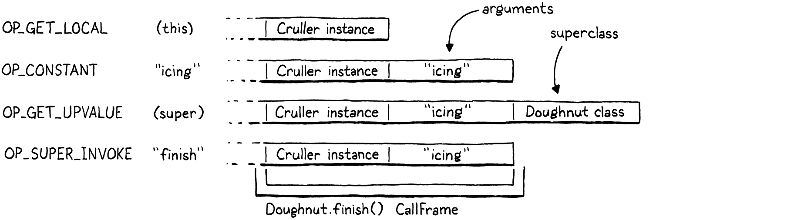

# 29. Superclasses 超類

> You can choose your friends but you sho’ can’t choose your family, an’ they’re still kin to you no matter whether you acknowledge ’em or not, and it makes you look right silly when you don’t.
>
> ​														—— Harper Lee, *To Kill a Mockingbird*

你可以選擇你的朋友，但無法選擇你的家庭，所以不管你承認與否，他們都是你的親屬，而且不承認會讓你顯得很蠢。（哈珀·李，《殺死一隻知更鳥》）

> This is the very last chapter where we add new functionality to our VM. We’ve packed almost the entire Lox language in there already. All that remains is inheriting methods and calling superclass methods. We have [another chapter](http://www.craftinginterpreters.com/optimization.html) after this one, but it introduces no new behavior. It only makes existing stuff faster. Make it to the end of this one, and you’ll have a complete Lox implementation.

這是我們向虛擬機添加新功能的最後一章。我們已經把幾乎所有的Lox語言都裝進虛擬機中了。剩下的就是繼承方法和調用超類方法。在本章之後還有一章，但是沒有引入新的行為。它只是讓現有的東西更快[^1]。堅持到本章結束，你將擁有一個完整的Lox實現。

> Some of the material in this chapter will remind you of jlox. The way we resolve super calls is pretty much the same, though viewed through clox’s more complex mechanism for storing state on the stack. But we have an entirely different, much faster, way of handling inherited method calls this time around.

本章中的一些內容會讓你想起jlox。我們解決超類調用的方式幾乎是一樣的，即便是從clox這種在棧中存儲狀態的更復雜的機制來看。但這次我們會用一種完全不同的、更快的方式來處理繼承方法的調用。

> ## 29 . 1 Inheriting Methods

## 29.1 繼承方法

> We’ll kick things off with method inheritance since it’s the simpler piece. To refresh your memory, Lox inheritance syntax looks like this:

我們會從方法繼承開始，因為它是比較簡單的部分。為了恢復你的記憶，Lox的繼承語法如下所示：

```typescript
class Doughnut {
  cook() {
    print "Dunk in the fryer.";
  }
}

class Cruller < Doughnut {
  finish() {
    print "Glaze with icing.";
  }
}
```

> Here, the Cruller class inherits from Doughnut and thus, instances of Cruller inherit the `cook()` method. I don’t know why I’m belaboring this. You know how inheritance works. Let’s start compiling the new syntax.

這裏，Culler類繼承自Doughnut，因此，Cruller的實例繼承了`cook()`方法。我不明白我為什麼要反覆強調這個，你知道繼承是怎麼回事。讓我們開始編譯新語法。

*<u>compiler.c，在classDeclaration()方法中添加代碼：</u>*

```c
  currentClass = &classCompiler;
  // 新增部分開始
  if (match(TOKEN_LESS)) {
    consume(TOKEN_IDENTIFIER, "Expect superclass name.");
    variable(false);
    namedVariable(className, false);
    emitByte(OP_INHERIT);
  }
  // 新增部分結束
  namedVariable(className, false);
```

> After we compile the class name, if the next token is a `<`, then we found a superclass clause. We consume the superclass’s identifier token, then call `variable()`. That function takes the previously consumed token, treats it as a variable reference, and emits code to load the variable’s value. In other words, it looks up the superclass by name and pushes it onto the stack.

在編譯類名之後，如果下一個標識是`<`，那我們就找到了一個超類子句。我們消耗超類的標識符，然後調用`variable()`。該函數接受前面消耗的標識，將其視為變量引用，併發出代碼來加載變量的值。換句話説，它通過名稱查找超類並將其壓入棧中。

> After that, we call `namedVariable()` to load the subclass doing the inheriting onto the stack, followed by an `OP_INHERIT` instruction. That instruction wires up the superclass to the new subclass. In the last chapter, we defined an `OP_METHOD` instruction to mutate an existing class object by adding a method to its method table. This is similar—the `OP_INHERIT` instruction takes an existing class and applies the effect of inheritance to it.

之後，我們調用`namedVariable()`將進行繼承的子類加載到棧中，接着是`OP_INHERIT`指令。該指令將超類與新的子類連接起來。在上一章中，我們定義了一條`OP_METHOD`指令，通過向已有類對象的方法表中添加方法來改變它。這裏是類似的——`OP_INHERIT`指令接受一個現有的類，並對其應用繼承的效果。

> In the previous example, when the compiler works through this bit of syntax:

在前面的例子中，當編譯器處理這些語法時：

```
class Cruller < Doughnut {
```

> The result is this bytecode:

結果就是這個字節碼：


> Before we implement the new `OP_INHERIT` instruction, we have an edge case to detect.

在我們實現新的`OP_INHERIT`指令之前，還需要檢測一個邊界情況。

*<u>compiler.c，在classDeclaration()方法中添加代碼：</u>*

```c
    variable(false);
    // 新增部分開始
    if (identifiersEqual(&className, &parser.previous)) {
      error("A class can't inherit from itself.");
    }
    // 新增部分結束
    namedVariable(className, false);
```

> A class cannot be its own superclass. Unless you have access to a deranged nuclear physicist and a very heavily modified DeLorean, you cannot inherit from yourself.

一個類不能成為它自己的超類[^2]。除非你能接觸到一個核物理學家和一輛改裝過的DeLorean汽車【譯者注：電影《回到未來》的梗】，否則你無法繼承自己。

> ### 29 . 1 . 1 Executing inheritance

### 29.1.1 執行繼承

> Now onto the new instruction.

現在來看新指令。

*<u>chunk.h，在枚舉OpCode中添加代碼：</u>*

```c
  OP_CLASS,
  // 新增部分開始
  OP_INHERIT,
  // 新增部分結束
  OP_METHOD
```

> There are no operands to worry about. The two values we need—superclass and subclass—are both found on the stack. That means disassembling is easy.

不需要擔心任何操作數。我們需要的兩個值——超類和子類——都可以在棧中找到。這意味着反彙編很容易。

*<u>debug.c，在disassembleInstruction()方法中添加代碼：</u>*

```c
      return constantInstruction("OP_CLASS", chunk, offset);
    // 新增部分開始  
    case OP_INHERIT:
      return simpleInstruction("OP_INHERIT", offset);
    // 新增部分結束
    case OP_METHOD:
```

> The interpreter is where the action happens.

解釋器是行為發生的地方。

*<u>vm.c，在run()方法中添加代碼：</u>*

```c
        break;
      // 新增部分開始
      case OP_INHERIT: {
        Value superclass = peek(1);
        ObjClass* subclass = AS_CLASS(peek(0));
        tableAddAll(&AS_CLASS(superclass)->methods,
                    &subclass->methods);
        pop(); // Subclass.
        break;
      }
      // 新增部分結束
      case OP_METHOD:
```

> From the top of the stack down, we have the subclass then the superclass. We grab both of those and then do the inherit-y bit. This is where clox takes a different path than jlox. In our first interpreter, each subclass stored a reference to its superclass. On method access, if we didn’t find the method in the subclass’s method table, we recursed through the inheritance chain looking at each ancestor’s method table until we found it.

從棧頂往下，我們依次有子類，然後是超類。我們獲取這兩個類，然後進行繼承。這就是clox與jlox不同的地方。在我們的第一個解釋器中，每個子類都存儲了一個對其超類的引用。在訪問方法時，如果我們沒有在子類方法表中找到它，就通過繼承鏈遞歸遍歷每個祖先的方法表，直到找到該方法。

> For example, calling `cook()` on an instance of Cruller sends jlox on this journey:

例如，在Cruller的實例上調用`cook()`方法，jlox會這樣做：


> That’s a lot of work to perform during method *invocation* time. It’s slow, and worse, the farther an inherited method is up the ancestor chain, the slower it gets. Not a great performance story.

在方法*調用*期間要做大量的工作。這很慢，而且更糟糕的是，繼承的方法在祖先鏈上越遠，它就越慢。這不是一個好的性能故事。

> The new approach is much faster. When the subclass is declared, we copy all of the inherited class’s methods down into the subclass’s own method table. Later, when *calling* a method, any method inherited from a superclass will be found right in the subclass’s own method table. There is no extra runtime work needed for inheritance at all. By the time the class is declared, the work is done. This means inherited method calls are exactly as fast as normal method calls—a single hash table lookup.

新方法則要快得多。當子類被聲明時，我們將繼承類的所有方法複製到子類自己的方法表中。之後，當我們*調用*某個方法時，從超類繼承的任何方法都可以在子類自己的方法表中找到。繼承根本不需要做額外的運行時工作。當類被聲明時，工作就完成了。這意味着繼承的方法和普通方法調用一樣快——只需要一次哈希表查詢[^3]。


> I’ve sometimes heard this technique called “copy-down inheritance”. It’s simple and fast, but, like most optimizations, you get to use it only under certain constraints. It works in Lox because Lox classes are *closed*. Once a class declaration is finished executing, the set of methods for that class can never change.

我有時聽到這種技術被稱為“向下複製繼承”。它簡單而快速，但是，與大多數優化一樣，你只能在特定的約束條件下使用它。它適用於Lox，是因為Lox的類是*關閉*的。一旦某個類的聲明執行完畢，該類的方法集就永遠不能更改。

> In languages like Ruby, Python, and JavaScript, it’s possible to crack open an existing class and jam some new methods into it or even remove them. That would break our optimization because if those modifications happened to a superclass *after* the subclass declaration executed, the subclass would not pick up those changes. That breaks a user’s expectation that inheritance always reflects the current state of the superclass.

在Ruby、Python和JavaScript等語言中，可以打開一個現有的類，並將一些新方法加入其中，甚至刪除方法。這會破壞我們的優化，因為如果這些修改在子類聲明執行*之後*發生在超類上，子類就不會獲得這些變化。這就打破了用户的期望，即繼承總是反映超類的當前狀態[^4]。

> Fortunately for us (but not for users who like the feature, I guess), Lox doesn’t let you patch monkeys or punch ducks, so we can safely apply this optimization.

幸運的是（我猜對於喜歡這一特性的用户來説不算幸運），Lox不允許猴子補丁或鴨子打洞，所以我們可以安全的應用這種優化。

> What about method overrides? Won’t copying the superclass’s methods into the subclass’s method table clash with the subclass’s own methods? Fortunately, no. We emit the `OP_INHERIT` after the `OP_CLASS` instruction that creates the subclass but before any method declarations and `OP_METHOD` instructions have been compiled. At the point that we copy the superclass’s methods down, the subclass’s method table is empty. Any methods the subclass overrides will overwrite those inherited entries in the table.

那方法重寫呢？將超類的方法複製到子類的方法表中，不會與子類自己的方法發生衝突嗎？幸運的是，不會。我們是在創建子類的`OP_CLASS`指令之後、但在任何方法聲明和`OP_METHOD`指令被編譯之前發出`OP_INHERIT`指令。當我們將超類的方法複製下來時，子類的方法表是空的。子類重寫的任何方法都會覆蓋表中那些繼承的條目。

> ### 29 . 1 . 2 Invalid superclasses

### 29.1.2 無效超類

> Our implementation is simple and fast, which is just the way I like my VM code. But it’s not robust. Nothing prevents a user from inheriting from an object that isn’t a class at all:

我們的實現簡單而快速，這正是我喜歡我的VM代碼的原因。但它並不健壯。沒有什麼能阻止用户繼承一個根本不是類的對象：

```typescript
var NotClass = "So not a class";
class OhNo < NotClass {}
```

> Obviously, no self-respecting programmer would write that, but we have to guard against potential Lox users who have no self respect. A simple runtime check fixes that.

顯然，任何一個有自尊心的程序員都不會寫這種東西，但我們必須堤防那些沒有自尊心的潛在Lox用户。一個簡單的運行時檢查就可以解決這個問題。

*<u>vm.c，在run()方法中添加代碼：</u>*

```c
        Value superclass = peek(1);
        // 新增部分開始
        if (!IS_CLASS(superclass)) {
          runtimeError("Superclass must be a class.");
          return INTERPRET_RUNTIME_ERROR;
        }
        // 新增部分結束
        ObjClass* subclass = AS_CLASS(peek(0));
```

> If the value we loaded from the identifier in the superclass clause isn’t an ObjClass, we report a runtime error to let the user know what we think of them and their code.

如果我們從超類子句的標識符中加載到的值不是ObjClass，就報告一個運行時錯誤，讓用户知道我們對他們及其代碼的看法。

> ## 29 . 2 Storing Superclasses

## 29.2 存儲超類

> Did you notice that when we added method inheritance, we didn’t actually add any reference from a subclass to its superclass? After we copy the inherited methods over, we forget the superclass entirely. We don’t need to keep a handle on the superclass, so we don’t.
>

你是否注意到，在我們添加方法繼承時，實際上並沒有添加任何從子類指向超類的引用？我們把繼承的方法複製到子類之後，就完全忘記了超類。我們不需要保存超類的句柄，所以我們沒有這樣做。

> That won’t be sufficient to support super calls. Since a subclass may override the superclass method, we need to be able to get our hands on superclass method tables. Before we get to that mechanism, I want to refresh your memory on how super calls are statically resolved.
>

這不足以支持超類調用。因為子類可能會覆蓋超類方法[^5]，我們需要能夠獲得超類方法表。在討論這個機制之前，我想讓你回憶一下如何靜態解析超類調用。

> Back in the halcyon days of jlox, I showed you [this tricky example](http://www.craftinginterpreters.com/inheritance.html#semantics) to explain the way super calls are dispatched:
>

回顧jlox的光輝歲月，我給你展示了這個棘手的示例，來解釋超類調用的分派方式：

```typescript
class A {
  method() {
    print "A method";
  }
}

class B < A {
  method() {
    print "B method";
  }

  test() {
    super.method();
  }
}

class C < B {}

C().test();
```

> Inside the body of the `test()` method, `this` is an instance of C. If super calls were resolved relative to the superclass of the *receiver*, then we would look in C’s superclass, B. But super calls are resolved relative to the superclass of the *surrounding class where the super call occurs*. In this case, we are in B’s `test()` method, so the superclass is A, and the program should print “A method”.
>

在`test()`方法的主體中，`this`是C的一個實例。如果超類調用是在*接收器*的超類中來解析的，那我們會在C的超類B中尋找方法。但是超類調用是在*發生超類調用的外圍類*的超類中解析的。在本例中，我們在B的`test()`方法中，因此超類是A，程序應該打印“A method”。

> This means that super calls are not resolved dynamically based on the runtime instance. The superclass used to look up the method is a static—practically lexical—property of where the call occurs. When we added inheritance to jlox, we took advantage of that static aspect by storing the superclass in the same Environment structure we used for all lexical scopes. Almost as if the interpreter saw the above program like this:
>

這意味着超類調用不是根據運行時的實例進行動態解析的。用於查找方法的超類是調用發生位置的一個靜態（實際上是詞法）屬性。當我們在jlox中添加繼承時，我們利用了這種靜態優勢，將超類存儲在我們用於所有詞法作用域的同一個Environment結構中。就好像解釋器看到的程序是這樣的：

```typescript
class A {
  method() {
    print "A method";
  }
}

var Bs_super = A;
class B < A {
  method() {
    print "B method";
  }

  test() {
    runtimeSuperCall(Bs_super, "method");
  }
}

var Cs_super = B;
class C < B {}

C().test();
```

> Each subclass has a hidden variable storing a reference to its superclass. Whenever we need to perform a super call, we access the superclass from that variable and tell the runtime to start looking for methods there.
>

每個子類都有一個隱藏變量，用於存儲對其超類的引用。當我們需要執行一個超類調用時，我們就從這個變量訪問超類，並告訴運行時從那裏開始查找方法。

> We’ll take the same path with clox. The difference is that instead of jlox’s heap-allocated Environment class, we have the bytecode VM’s value stack and upvalue system. The machinery is a little different, but the overall effect is the same.
>

我們在clox中採用相同的方法。不同之處在於，我們使用的是字節碼虛擬機的值棧和上值系統，而不是jlox的堆分配的Environment 類。機制有些不同，但總體效果是一樣的。

> ### 29 . 2 . 1 A superclass local variable

### 29.2.1 超類局部變量

> Our compiler already emits code to load the superclass onto the stack. Instead of leaving that slot as a temporary, we create a new scope and make it a local variable.

我們的編譯器已經發出了將超類加載到棧中的代碼。我們不將這個槽看作是臨時的，而是創建一個新的作用域，並將其作為一個局部變量。

*<u>compiler.c，在classDeclaration()方法中添加代碼：</u>*

```c
    }
    // 新增部分開始
    beginScope();
    addLocal(syntheticToken("super"));
    defineVariable(0);
    // 新增部分結束
    namedVariable(className, false);
    emitByte(OP_INHERIT);
```

> Creating a new lexical scope ensures that if we declare two classes in the same scope, each has a different local slot to store its superclass. Since we always name this variable “super”, if we didn’t make a scope for each subclass, the variables would collide.

創建一個新的詞法作用域可以確保，如果我們在同一個作用域中聲明兩個類，每個類都有一個不同的局部槽來存儲其超類。由於我們總是將該變量命名為“super”，如果我們不為每個子類創建作用域，那麼這些變量就會發生衝突。

> We name the variable “super” for the same reason we use “this” as the name of the hidden local variable that `this` expressions resolve to: “super” is a reserved word, which guarantees the compiler’s hidden variable won’t collide with a user-defined one.

我們將該變量命名為“super”，與我們使用“this”作為`this`表達式解析得到的隱藏局部變量名稱的原因相同：“super”是一個保留字，它可以保證編譯器的隱藏變量不會與用户定義的變量發生衝突。

> The difference is that when compiling `this` expressions, we conveniently have a token sitting around whose lexeme is “this”. We aren’t so lucky here. Instead, we add a little helper function to create a synthetic token for the given constant string.

不同之處在於，在編譯`this`表達式時，我們可以很方便地使用一個標識，詞素是`this`。在這裏我們就沒那麼幸運了。相對地，我們添加一個小的輔助函數，來為給定的常量字符串創建一個合成標識[^6]。

*<u>compiler.c，在variable()方法後添加代碼：</u>*

```c
static Token syntheticToken(const char* text) {
  Token token;
  token.start = text;
  token.length = (int)strlen(text);
  return token;
}
```

> Since we opened a local scope for the superclass variable, we need to close it.

因為我們為超類變量打開了一個局部作用域，我們還需要關閉它。

*<u>compiler.c，在classDeclaration()方法中添加代碼：</u>*

```c
  emitByte(OP_POP);
  // 新增部分開始
  if (classCompiler.hasSuperclass) {
    endScope();
  }
  // 新增部分結束
  currentClass = currentClass->enclosing;
```

> We pop the scope and discard the “super” variable after compiling the class body and its methods. That way, the variable is accessible in all of the methods of the subclass. It’s a somewhat pointless optimization, but we create the scope only if there *is* a superclass clause. Thus we need to close the scope only if there is one.

在編譯完類的主體及其方法後，我們會彈出作用域並丟棄“super”變量。這樣，該變量在子類的所有方法中被都可以訪問。這是一個有點無意義的優化，但我們只在有超類子句的情況下創建作用域。因此，只有在有超類的情況下，我們才需要關閉這個作用域。

> To track that, we could declare a little local variable in `classDeclaration()`. But soon, other functions in the compiler will need to know whether the surrounding class is a subclass or not. So we may as well give our future selves a hand and store this fact as a field in the ClassCompiler now.

為了記錄是否有超類，我們可以在`classDeclaration()`中聲明一個局部變量。但是很快，編譯器中的其它函數需要知道外層的類是否是子類。所以我們不妨幫幫未來的自己，現在就把它作為一個字段存儲在ClassCompiler中。

*<u>compiler.c，在結構體ClassCompiler中添加代碼：</u>*

```c
typedef struct ClassCompiler {
  struct ClassCompiler* enclosing;  
  // 新增部分開始
  bool hasSuperclass;
  // 新增部分結束
} ClassCompiler;
```

> When we first initialize a ClassCompiler, we assume it is not a subclass.

當我們第一次初始化某個ClassCompiler時，我們假定它不是子類。

*<u>compiler.c，在classDeclaration()方法中添加代碼：</u>*

```c
  ClassCompiler classCompiler;
  // 新增部分開始
  classCompiler.hasSuperclass = false;
  // 新增部分結束
  classCompiler.enclosing = currentClass;
```

> Then, if we see a superclass clause, we know we are compiling a subclass.

然後，如果看到超類子句，我們就知道正在編譯一個子類。

*<u>compiler.c，在classDeclaration()方法中添加代碼：</u>*

```c
    emitByte(OP_INHERIT);
    // 新增部分開始
    classCompiler.hasSuperclass = true;
    // 新增部分結束
  }
```

> This machinery gives us a mechanism at runtime to access the superclass object of the surrounding subclass from within any of the subclass’s methods—simply emit code to load the variable named “super”. That variable is a local outside of the method body, but our existing upvalue support enables the VM to capture that local inside the body of the method or even in functions nested inside that method.

這種機制在運行時為我們提供了一種方法，可以從子類的任何方法中訪問外層子類的超類對象——只需發出代碼來加載名為“super”的變量。這個變量是方法主體之外的一個局部變量，但是我們現有的上值支持VM在方法主體內、甚至是嵌套方法內的函數中捕獲該局部變量。

> ## 29 . 3 Super Calls

## 29.3 超類調用

> With that runtime support in place, we are ready to implement super calls. As usual, we go front to back, starting with the new syntax. A super call begins, naturally enough, with the `super` keyword.

有了這個運行時支持，我們就可以實現超類調用了。跟之前一樣，我們從前端到後端，先從新語法開始。超類調用，自然是以`super`關鍵字開始[^7]。

*<u>compiler.c，替換1行：</u>*

```c
  [TOKEN_RETURN]        = {NULL,     NULL,   PREC_NONE},
  // 替換部分開始
  [TOKEN_SUPER]         = {super_,   NULL,   PREC_NONE},
  // 替換部分結束
  [TOKEN_THIS]          = {this_,    NULL,   PREC_NONE},
```

> When the expression parser lands on a `super` token, control jumps to a new parsing function which starts off like so:

當表達式解析器落在一個`super`標識時，控制流會跳轉到一個新的解析函數，該函數的開頭是這樣的：

*<u>compiler.c，在syntheticToken()方法後添加代碼：</u>*

```c
static void super_(bool canAssign) {
  consume(TOKEN_DOT, "Expect '.' after 'super'.");
  consume(TOKEN_IDENTIFIER, "Expect superclass method name.");
  uint8_t name = identifierConstant(&parser.previous);
}
```

> This is pretty different from how we compiled `this` expressions. Unlike `this`, a `super` token is not a standalone expression. Instead, the dot and method name following it are inseparable parts of the syntax. However, the parenthesized argument list is separate. As with normal method access, Lox supports getting a reference to a superclass method as a closure without invoking it:

這與我們編譯`this`表達式的方式很不一樣。與`this`不同，`super`標識不是一個獨立的表達式[^8]。相反，它後面的點和方法名稱是語法中不可分割的部分。但是，括號內的參數列表是獨立的。和普通的方法訪問一樣，Lox支持以閉包的方式獲得對超類方法的引用，而不必調用它：

```typescript
class A {
  method() {
    print "A";
  }
}

class B < A {
  method() {
    var closure = super.method;
    closure(); // Prints "A".
  }
}
```

> In other words, Lox doesn’t really have super *call* expressions, it has super *access* expressions, which you can choose to immediately invoke if you want. So when the compiler hits a `super` token, we consume the subsequent `.` token and then look for a method name. Methods are looked up dynamically, so we use `identifierConstant()` to take the lexeme of the method name token and store it in the constant table just like we do for property access expressions.

換句話説，Lox並沒有真正的超類*調用（call）*表達式，它有的是超類*訪問（access）*表達式，如果你願意，可以選擇立即調用。因此，當編譯器碰到一個`super`標識時，我們會消費後續的`.`標識，然後尋找一個方法名稱。方法是動態查找的，所以我們使用`identifierConstant()`來獲取方法名標識的詞素，並將其存儲在常量表中，就像我們對屬性訪問表達式所做的那樣。

> Here is what the compiler does after consuming those tokens:

下面是編譯器在消費這些標識之後做的事情：

*<u>compiler.c，在super_()方法中添加代碼：</u>*

```c
  uint8_t name = identifierConstant(&parser.previous);
  // 新增部分開始
  namedVariable(syntheticToken("this"), false);
  namedVariable(syntheticToken("super"), false);
  emitBytes(OP_GET_SUPER, name);
  // 新增部分結束
}
```

> In order to access a *superclass method* on *the current instance*, the runtime needs both the receiver *and* the superclass of the surrounding method’s class. The first `namedVariable()` call generates code to look up the current receiver stored in the hidden variable “this” and push it onto the stack. The second `namedVariable()` call emits code to look up the superclass from its “super” variable and push that on top.

為了在*當前實例*上訪問一個*超類方法*，運行時需要接收器*和*外圍方法所在類的超類。第一個`namedVariable()`調用產生代碼來查找存儲在隱藏變量“this”中的當前接收器，並將其壓入棧中。第二個`namedVariable()`調用產生代碼，從它的“super”變量中查找超類，並將其推入棧頂。

> Finally, we emit a new `OP_GET_SUPER` instruction with an operand for the constant table index of the method name. That’s a lot to hold in your head. To make it tangible, consider this example program:

最後，我們發出一條新的`OP_GET_SUPER`指令，其操作數為方法名稱的常量表索引。你腦子裏裝的東西太多了。為了使它具體化，請看下面的示例程序：

```typescript
class Doughnut {
  cook() {
    print "Dunk in the fryer.";
    this.finish("sprinkles");
  }

  finish(ingredient) {
    print "Finish with " + ingredient;
  }
}

class Cruller < Doughnut {
  finish(ingredient) {
    // No sprinkles, always icing.
    super.finish("icing");
  }
}
```

> The bytecode emitted for the `super.finish("icing")` expression looks and works like this:

`super.finish("icing")`發出的字節碼看起來像是這樣的：


> The first three instructions give the runtime access to the three pieces of information it needs to perform the super access:

前三條指令讓運行時獲得了執行超類訪問時需要的三條信息：

> 1. The first instruction loads **the instance** onto the stack.
> 2. The second instruction loads **the superclass where the method is resolved**.
> 3. Then the new `OP_GET_SUPER` instuction encodes **the name of the method to access** as an operand.

1. 第一條指令將**實例**加載到棧中。
2. 第二條指令加載了**將用於解析方法的超類**。
3. 然後，新的`OP_GET_SUPER`指令將**要訪問的方法名稱**編碼為操作數。

> The remaining instructions are the normal bytecode for evaluating an argument list and calling a function.

剩下的指令是用於計算參數列表和調用函數的常規字節碼。

> We’re almost ready to implement the new `OP_GET_SUPER` instruction in the interpreter. But before we do, the compiler has some errors it is responsible for reporting.

我們幾乎已經準備好在解釋器中實現新的`OP_GET_SUPER`指令了。但在此之前，編譯器需要負責報告一些錯誤。

*<u>compiler.c，在super_()方法中添加代碼：</u>*

```c
static void super_(bool canAssign) {  
  // 新增部分開始
  if (currentClass == NULL) {
    error("Can't use 'super' outside of a class.");
  } else if (!currentClass->hasSuperclass) {
    error("Can't use 'super' in a class with no superclass.");
  }
  // 新增部分結束
  consume(TOKEN_DOT, "Expect '.' after 'super'.");
```

> A super call is meaningful only inside the body of a method (or in a function nested inside a method), and only inside the method of a class that has a superclass. We detect both of these cases using the value of `currentClass`. If that’s `NULL` or points to a class with no superclass, we report those errors.

超類調用只有在方法主體（或方法中嵌套的函數）中才有意義，而且只在具有超類的某個類的方法中才有意義。我們使用`currentClass`的值來檢測這兩種情況。如果它是`NULL`或者指向一個沒有超類的類，我們就報告這些錯誤。

> ### 29 . 3 . 1 Executing super accesses

### 29.3.1 執行超類訪問

> Assuming the user didn’t put a `super` expression where it’s not allowed, their code passes from the compiler over to the runtime. We’ve got ourselves a new instruction.

假設用户沒有在不允許的地方使用`super`表達式，他們的代碼將從編譯器傳遞到運行時。我們已經有了一個新指令。

*<u>chunk.h，在枚舉OpCode中添加代碼：</u>*

```c
  OP_SET_PROPERTY,
  // 新增部分開始
  OP_GET_SUPER,
  // 新增部分結束
  OP_EQUAL,
```

> We disassemble it like other opcodes that take a constant table index operand.

我們像對其它需要常量表索引操作數的操作碼一樣對它進行反彙編。

*<u>debug.c，在disassembleInstruction()方法中添加代碼：</u>*

```c
      return constantInstruction("OP_SET_PROPERTY", chunk, offset);
    // 新增部分開始
    case OP_GET_SUPER:
      return constantInstruction("OP_GET_SUPER", chunk, offset);
    // 新增部分結束  
    case OP_EQUAL:
```

> You might anticipate something harder, but interpreting the new instruction is similar to executing a normal property access.

你可能預想這是一件比較困難的事，但解釋新指令與執行正常的屬性訪問類似。

*<u>vm.c，在run()方法中添加代碼：</u>*

```c
      }
      // 新增部分開始
      case OP_GET_SUPER: {
        ObjString* name = READ_STRING();
        ObjClass* superclass = AS_CLASS(pop());

        if (!bindMethod(superclass, name)) {
          return INTERPRET_RUNTIME_ERROR;
        }
        break;
      }
      // 新增部分結束
      case OP_EQUAL: {
```

> As with properties, we read the method name from the constant table. Then we pass that to `bindMethod()` which looks up the method in the given class’s method table and creates an ObjBoundMethod to bundle the resulting closure to the current instance.

和屬性一樣，我們從常量表中讀取方法名。然後我們將其傳遞給`bindMethod()`，該方法會在給定類的方法表中查找方法，並創建一個ObjBoundMethod將結果閉包與當前實例相綁定。

> The key difference is *which* class we pass to `bindMethod()`. With a normal property access, we use the ObjInstances’s own class, which gives us the dynamic dispatch we want. For a super call, we don’t use the instance’s class. Instead, we use the statically resolved superclass of the containing class, which the compiler has conveniently ensured is sitting on top of the stack waiting for us.

關鍵的區別在於將*哪個*類傳遞給`bindMethod()`。對於普通的屬性訪問，我們使用ObjInstances自己的類，這為我們提供了我們想要的動態分派。對於超類調用，我們不使用實例的類。相反，我們使用靜態分析得到的外層類的超類，編譯器已經確保它在棧頂等着我們[^9]。

> We pop that superclass and pass it to `bindMethod()`, which correctly skips over any overriding methods in any of the subclasses between that superclass and the instance’s own class. It also correctly includes any methods inherited by the superclass from any of *its* superclasses.

我們彈出該超類並將其傳遞給`bindMethod()`，該方法會正確地跳過該超類與實例本身的類之間的任何子類覆寫的方法。它還正確地包含了超類從其任何超類中繼承的方法。

> The rest of the behavior is the same. Popping the superclass leaves the instance at the top of the stack. When `bindMethod()` succeeds, it pops the instance and pushes the new bound method. Otherwise, it reports a runtime error and returns `false`. In that case, we abort the interpreter.

其餘的行為都是一樣的。超類彈出棧使得實例位於棧頂。當`bindMethod()`成功時，它會彈出實例並壓入新的已綁定方法。否則，它會報告一個運行時錯誤並返回`false`。在這種情況下，我們中止解釋器。

> ### 29 . 3 . 2 Faster super calls

### 29.3.2 更快的超類調用

> We have superclass method accesses working now. And since the returned object is an ObjBoundMethod that you can then invoke, we’ve got super *calls* working too. Just like last chapter, we’ve reached a point where our VM has the complete, correct semantics.

我們現在有了對超類方法的訪問。由於返回的對象是一個你可以稍後調用的ObjBoundMethod，我們也就有了可用的超類*調用*。就像上一章一樣，我們的虛擬機現在已經有了完整、正確的語義。

> But, also like last chapter, it’s pretty slow. Again, we’re heap allocating an ObjBoundMethod for each super call even though most of the time the very next instruction is an `OP_CALL` that immediately unpacks that bound method, invokes it, and then discards it. In fact, this is even more likely to be true for super calls than for regular method calls. At least with method calls there is a chance that the user is actually invoking a function stored in a field. With super calls, you’re *always* looking up a method. The only question is whether you invoke it immediately or not.

但是，也和上一章一樣，它很慢。同樣，我們為每個超類調用在堆中分配了一個ObjBoundMethod，儘管大多數時候下一個指令就是`OP_CALL`，它會立即解包該已綁定方法，調用它，然後丟棄它。事實上，超類調用比普通方法調用更有可能出現這種情況。至少在方法調用中，用户有可能實際上在調用存儲在字段中的函數。在超類調用中，你肯定是在查找一個方法。唯一的問題在於你是否立即調用它。

> The compiler can certainly answer that question for itself if it sees a left parenthesis after the superclass method name, so we’ll go ahead and perform the same optimization we did for method calls. Take out the two lines of code that load the superclass and emit `OP_GET_SUPER`, and replace them with this:

如果編譯器看到超類方法名稱後面有一個左括號，它肯定能自己回答這個問題，所以我們會繼續執行與方法調用相同的優化。去掉加載超類併發出`OP_GET_SUPER`的兩行代碼，替換為這個：

*<u>compiler.c，在super_()方法中替換2行：</u>*

```c
  namedVariable(syntheticToken("this"), false);
  // 替換部分開始
  if (match(TOKEN_LEFT_PAREN)) {
    uint8_t argCount = argumentList();
    namedVariable(syntheticToken("super"), false);
    emitBytes(OP_SUPER_INVOKE, name);
    emitByte(argCount);
  } else {
    namedVariable(syntheticToken("super"), false);
    emitBytes(OP_GET_SUPER, name);
  }
  // 替換部分結束
}
```

> Now before we emit anything, we look for a parenthesized argument list. If we find one, we compile that. Then we load the superclass. After that, we emit a new `OP_SUPER_INVOKE` instruction. This superinstruction combines the behavior of `OP_GET_SUPER` and `OP_CALL`, so it takes two operands: the constant table index of the method name to look up and the number of arguments to pass to it.

現在，在我們發出任何代碼之前，我們要尋找一個帶括號的參數列表。如果找到了，我們就編譯它，任何加載超類，之後，我們發出一條新的`OP_SUPER_INVOKE`指令。這個超級指令結合了`OP_GET_SUPER`和`OP_CALL`的行為，所以它需要兩個操作數：待查找的方法名稱和要傳遞給它的參數數量。

> Otherwise, if we don’t find a `(`, we continue to compile the expression as a super access like we did before and emit an `OP_GET_SUPER`.

否則，如果沒有找到`(`，則繼續像前面那樣將表達式編譯為一個超類訪問，併發出一條`OP_GET_SUPER`指令。

> Drifting down the compilation pipeline, our first stop is a new instruction.

沿着編譯流水線向下，我們的第一站是一條新指令。

*<u>chunk.h，在枚舉OpCode中添加代碼：</u>*

```c
  OP_INVOKE,
  // 新增部分開始
  OP_SUPER_INVOKE,
  // 新增部分結束
  OP_CLOSURE,
```

> And just past that, its disassembler support.

在那之後，是它的反彙編器支持。

*<u>debug.c，在disassembleInstruction()方法中添加代碼：</u>*

```c
      return invokeInstruction("OP_INVOKE", chunk, offset);
    // 新增部分開始
    case OP_SUPER_INVOKE:
      return invokeInstruction("OP_SUPER_INVOKE", chunk, offset);
    // 新增部分結束
    case OP_CLOSURE: {
```

> A super invocation instruction has the same set of operands as `OP_INVOKE`, so we reuse the same helper to disassemble it. Finally, the pipeline dumps us into the interpreter.

超類調用指令具有與`OP_INVOKE`相同的操作數集，因此我們複用同一個輔助函數對其反彙編。最後，流水線將我們帶到解釋器中。

*<u>vm.c，在run()方法中添加代碼：</u>*

```c
        break;
      }
      // 新增部分開始
      case OP_SUPER_INVOKE: {
        ObjString* method = READ_STRING();
        int argCount = READ_BYTE();
        ObjClass* superclass = AS_CLASS(pop());
        if (!invokeFromClass(superclass, method, argCount)) {
          return INTERPRET_RUNTIME_ERROR;
        }
        frame = &vm.frames[vm.frameCount - 1];
        break;
      }
      // 新增部分結束
      case OP_CLOSURE: {
```

> This handful of code is basically our implementation of `OP_INVOKE` mixed together with a dash of `OP_GET_SUPER`. There are some differences in how the stack is organized, though. With an unoptimized super call, the superclass is popped and replaced by the ObjBoundMethod for the resolved function *before* the arguments to the call are executed. This ensures that by the time the `OP_CALL` is executed, the bound method is *under* the argument list, where the runtime expects it to be for a closure call.

這一小段代碼基本上是`OP_INVOKE`的實現，其中混雜了一點`OP_GET_SUPER`。不過，在堆棧的組織方式上有些不同。在未優化的超類調用中，超類會被彈出，並在調用的*參數*被執行之前替換為被解析函數的ObjBoundMethod。這確保了在`OP_CALL`執行時，已綁定方法在參數列表*之下*，也就是運行時期望閉包調用所在的位置。

> With our optimized instructions, things are shuffled a bit:

在我們優化的指令中，事情有點被打亂：



> Now resolving the superclass method is part of the *invocation*, so the arguments need to already be on the stack at the point that we look up the method. This means the superclass object is on top of the arguments.

現在，解析超類方法是執行的一部分，因此當我們查找方法時，參數需要已經在棧上。這意味着超類對象位於參數之上。

> Aside from that, the behavior is roughly the same as an `OP_GET_SUPER` followed by an `OP_CALL`. First, we pull out the method name and argument count operands. Then we pop the superclass off the top of the stack so that we can look up the method in its method table. This conveniently leaves the stack set up just right for a method call.

除此之外，其行為與`OP_GET_SUPER`後跟`OP_CALL`大致相同。首先，我們取出方法名和參數數量兩個操作數。然後我們從棧頂彈出超類，這樣我們就可以在它的方法表中查找方法。這方便地將堆棧設置為適合方法調用的狀態。

> We pass the superclass, method name, and argument count to our existing `invokeFromClass()` function. That function looks up the given method on the given class and attempts to create a call to it with the given arity. If a method could not be found, it returns `false`, and we bail out of the interpreter. Otherwise, `invokeFromClass()` pushes a new CallFrame onto the call stack for the method’s closure. That invalidates the interpreter’s cached CallFrame pointer, so we refresh `frame`.

我們將超類、方法名和參數數量傳遞給現有的`invokeFromClass()`函數。該函數在給定的類上查找給定的方法，並嘗試用給定的元數創建一個對它的調用。如果找不到某個方法，它就返回false，並退出解釋器。否則，`invokeFromClass()`將一個新的CallFrame壓入方法閉包的調用棧上。這會使解釋器緩存的CallFrame指針失效，所以我們也要刷新`frame`。

> ## 29 . 4 A Complete Virtual Machine

## 29.4 一個完整的虛擬機

> Take a look back at what we’ve created. By my count, we wrote around 2,500 lines of fairly clean, straightforward C. That little program contains a complete implementation of the—quite high-level!—Lox language, with a whole precedence table full of expression types and a suite of control flow statements. We implemented variables, functions, closures, classes, fields, methods, and inheritance.

回顧一下我們創造了什麼。根據我的計算，我們編寫了大約2500行相當乾淨、簡潔的C語言代碼。這個小程序中包含了對Lox語言（相當高級）的完整實現，它有一個滿是表達式類型的優先級表和一套控制流語句。我們實現了變量、函數、閉包、類、字段、方法和繼承。

> Even more impressive, our implementation is portable to any platform with a C compiler, and is fast enough for real-world production use. We have a single-pass bytecode compiler, a tight virtual machine interpreter for our internal instruction set, compact object representations, a stack for storing variables without heap allocation, and a precise garbage collector.

更令人印象深刻的是，我們的實現可以移植到任何帶有C編譯器的平台上，而且速度快到足以在實際生產中使用。我們有一個單遍字節碼編譯器，一個用於內部指令集的嚴格虛擬機解釋器，緊湊的對象表示，一個用於存儲變量而不需要堆分配的棧，以及一個精確的垃圾回收器。

> If you go out and start poking around in the implementations of Lua, Python, or Ruby, you will be surprised by how much of it now looks familiar to you. You have seriously leveled up your knowledge of how programming languages work, which in turn gives you a deeper understanding of programming itself. It’s like you used to be a race car driver, and now you can pop the hood and repair the engine too.

如果你開始研究Lua、Python或Ruby的實現，你會驚訝於它們現在看起來有多熟悉。你已經真正提高了關於編程語言工作方式的知識水平，這反過來又使你對編程本身有了更深的理解。這就像你以前是個賽車手，現在你可以打開引擎蓋，修改發動機了。

> You can stop here if you like. The two implementations of Lox you have are complete and full featured. You built the car and can drive it wherever you want now. But if you are looking to have more fun tuning and tweaking for even greater performance out on the track, there is one more chapter. We don’t add any new capabilities, but we roll in a couple of classic optimizations to squeeze even more perf out. If that sounds fun, [keep reading](http://www.craftinginterpreters.com/optimization.html) . . . 

如果你願意，可以在這裏停下來。你擁有的兩個Lox實現是完整的、功能齊全的。你造了這倆車，現在可以把它開到你想去的地方。但是，如果你想獲得更多改裝與調整的樂趣，以期在賽道上獲得更佳的性能，還有一個章節。我們沒有增加任何新的功能，但我們推出了幾個經典的優化，以擠壓出更多的性能。如果這聽起來很有趣，請繼續讀下去……


[^1]: 這個“只是”並不意味着加速不重要！畢竟，我們的第二個虛擬機的全部目的就是比jlox有更好的性能。你可以認為，前面的15章都是“優化”。
[^2]: 有趣的是，根據我們實現方法繼承的方式，我認為允許循環實際上不會在clox中引起任何問題。它不會做任何有用的事情，但我認為它不會導致崩潰或無限循環。
[^3]: 好吧，我想應該是兩次哈希查詢。因為首先我們必須確保實例上的字段不會遮蔽方法。
[^4]: 可以想見，在運行時改變某個類中以命令式定義的方法集會使得對程序的推理變得困難。這是一個非常強大的工具，但也是一個危險的工具。<BR>那些認為這個工具可能有點太危險的人，給它取了個不倫不類的名字“猴子補丁”，或者是更不體面的“鴨子打洞”。
[^5]: “可能”這個詞也許不夠有力。大概這個方法*已經*被重寫了。否則，你為什麼要費力地使用`super`而不是直接調用它呢？
[^6]: 我説“常量字符串”是因為標識不對其詞素做任何內存管理。如果我們試圖使用堆分配的字符串，最終會泄漏內存，因為它永遠不會被釋放。但是，C語言字符串字面量的內存位於可執行文件的常量數據部分，永遠不需要釋放，所以我們這樣沒有問題。
[^7]: 就是這樣，朋友，你要添加到解析表中的最後一項。
[^8]: 假設性問題：如果一個光禿禿的`super`標識是一個表達式，那麼它會被計算為哪種對象呢？
[^9]: 與`OP_GET_PROPERTY`相比的另一個區別是，我們不會先嚐試尋找遮蔽字段。字段不會被繼承，所以`super`表達式總是解析為方法。<BR>如果Lox是一種使用*委託*而不是*繼承*的基於原型的語言，那麼就不是一個*類*繼承另一個*類*，而是實例繼承自（委託給）其它實例。在這種情況下，字段可以被繼承，我們就需要在這裏檢查它們。


---

## 習題

1. > A tenet of object-oriented programming is that a class should ensure new objects are in a valid state. In Lox, that means defining an initializer that populates the instance’s fields. Inheritance complicates invariants because the instance must be in a valid state according to all of the classes in the object’s inheritance chain.
   >
   > The easy part is remembering to call `super.init()` in each subclass’s `init()` method. The harder part is fields. There is nothing preventing two classes in the inheritance chain from accidentally claiming the same field name. When this happens, they will step on each other’s fields and possibly leave you with an instance in a broken state.
   >
   > If Lox was your language, how would you address this, if at all? If you would change the language, implement your change.

   面向對象編程的一個原則是，類應該確保新對象處於有效狀態。在Lox中，這意味着要定義一個填充實例字段的初始化器。繼承使不變性複雜化，因為對於對象繼承鏈中的所有類，實例必須處於有效狀態。

   簡單的部分是記住在每個子類的`init()`方法中調用`super.init()`。比較難的部分是字段。沒有什麼方法可以防止繼承鏈中的兩個類意外地聲明相同的字段名。當這種情況發生時，它們會互相干擾彼此的字段，並可能讓你的實例處於崩潰狀態。

   如果Lox是你的語言，你會如何解決這個問題？如果你想改變語言，請實現你的更改。

2. > Our copy-down inheritance optimization is valid only because Lox does not permit you to modify a class’s methods after its declaration. This means we don’t have to worry about the copied methods in the subclass getting out of sync with later changes to the superclass.
   >
   > Other languages, like Ruby, *do* allow classes to be modified after the fact. How do implementations of languages like that support class modification while keeping method resolution efficient?

   我們的向下複製繼承優化之所以有效，僅僅是因為Lox不允許在類聲明之後修改它的方法。這意味着我們不必擔心子類中複製的方法與後面對超類的修改不同步。

   其它語言，如Ruby，確實允許在事後修改類。像這樣的語言實現如何支持類的修改，同時保持方法解析的效率呢？

3. > In the [jlox chapter on inheritance](http://www.craftinginterpreters.com/inheritance.html), we had a challenge to implement the BETA language’s approach to method overriding. Solve the challenge again, but this time in clox. Here’s the description of the previous challenge:

   在jlox關於繼承的章節中，我們有一個習題，是實現BETA語言的方法重寫。再次解決這個習題，但這次是在clox中。下面是對之前習題的描述：

   > In Lox, as in most other object-oriented languages, when looking up a method, we start at the bottom of the class hierarchy and work our way up—a subclass’s method is preferred over a superclass’s. In order to get to the superclass method from within an overriding method, you use `super`.

   在Lox中，和其它大多數面向對象的語言一樣，當查找一個方法時，我們從類層次結構的底部開始，然後向上查找——子類的方法優於超類的方法。要想在子類方法中訪問超類方法，可以使用`super`。

   > The language [BETA](https://beta.cs.au.dk/) takes the [opposite approach](http://journal.stuffwithstuff.com/2012/12/19/the-impoliteness-of-overriding-methods/). When you call a method, it starts at the *top* of the class hierarchy and works *down*. A superclass method wins over a subclass method. In order to get to the subclass method, the superclass method can call `inner`, which is sort of like the inverse of `super`. It chains to the next method down the hierarchy.

   [BETA](https://beta.cs.au.dk/)語言則採取了[相反的方法](http://journal.stuffwithstuff.com/2012/12/19/the-impoliteness-of-overriding-methods/)。當你調用某個方法時，它從類層次結構的頂部開始向下運行。超類方法優於子類方法。要想訪問子類方法，超類方法中可以調用`inner()`，這有點像是`super`的反義詞。它會鏈接到層次結構中的下一個方法。

   > The superclass method controls when and where the subclass is allowed to refine its behavior. If the superclass method doesn’t call `inner` at all, then the subclass has no way of overriding or modifying the superclass’s behavior.

   超類方法控制着子類何時何地被允許完善其行為。如果超類方法根本不調用`inner`，那麼子類就沒有辦法覆寫或修改超類的行為。

   > Take out Lox’s current overriding and `super` behavior, and replace it with BETA’s semantics. In short:

   去掉Lox中當前的覆寫和`super`行為，替換為BETA的語義。簡而言之：

   > - When calling a method on a class, the method *highest* on the class’s inheritance chain takes precedence.
   > - Inside the body of a method, a call to `inner` looks for a method with the same name in the nearest subclass along the inheritance chain between the class containing the `inner` and the class of `this`. If there is no matching method, the `inner` call does nothing.

   * 當調用某個類中的方法時，該類繼承鏈上最高的方法優先。
   * 在方法體內部，對`inner`的調用，會沿着包含`inner`的類和`this`的類之間的繼承鏈，在最近的子類中查找同名的方法。如果沒有匹配的方法，`inner`調用就什麼也不做。

   > For example:

   舉例來説：

   ```typescript
   class Doughnut {
     cook() {
       print "Fry until golden brown.";
       inner();
       print "Place in a nice box.";
     }
   }
   
   class BostonCream < Doughnut {
     cook() {
       print "Pipe full of custard and coat with chocolate.";
     }
   }
   
   BostonCream().cook();
   ```

   > This should print:

   這裏應該打印：

   ```
   Fry until golden brown.
   Pipe full of custard and coat with chocolate.
   Place in a nice box.
   ```

   > Since clox is about not just implementing Lox, but doing so with good performance, this time around try to solve the challenge with an eye towards efficiency.

   因為clox不僅僅是實現Lox，而是要以良好的性能來實現，所以這次要嘗試以效率為導向來解決這個問題。