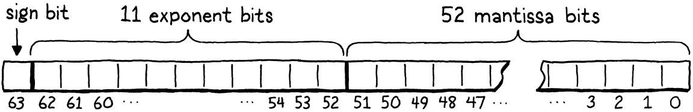
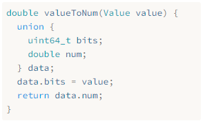

# 30. Optimization 優化

> The evening’s the best part of the day. You’ve done your day’s work. Now you can put your feet up and enjoy it.
>
> ​													——Kazuo Ishiguro, *The Remains of the Day*

夜晚是一天中最美好的時光。你已經完成了一天的工作，現在你可以雙腿擱平，享受一下。（石黑一雄，《長日將盡》）

> If I still lived in New Orleans, I’d call this chapter a *lagniappe*, a little something extra given for free to a customer. You’ve got a whole book and a complete virtual machine already, but I want you to have some more fun hacking on clox. This time, we’re going for pure performance. We’ll apply two very different optimizations to our virtual machine. In the process, you’ll get a feel for measuring and improving the performance of a language implementation—or any program, really.

如果我還住在新奧爾良，我會把這一章稱為*lagniappe*（小贈品），即免費送給顧客的一點額外的東西。你已經有了一整本書和一個完整的虛擬機，但我希望你能在clox上獲得更多的樂趣。這一次，我們要追求的是純粹的性能。我們將對虛擬機應用兩種截然不同的優化。在這個過程中，你將瞭解如何測量和提高語言實現的性能——或者説任何程序的性能，真的。

> ## 30 . 1 Measuring Performance

## 30.1 測量性能

> **Optimization** means taking a working application and improving its performance. An optimized program does the same thing, it just takes less resources to do so. The resource we usually think of when optimizing is runtime speed, but it can also be important to reduce memory usage, startup time, persistent storage size, or network bandwidth. All physical resources have some cost—even if the cost is mostly in wasted human time—so optimization work often pays off.

**優化**是指拿到一個基本可用的應用程序並提高其性能。一個優化後的程序能做到同樣的事情，只是需要更少的資源。我們在優化時通常考慮的資源是運行時速度，但減少內存使用、啓動時間、持久化存儲大小或網絡帶寬也很重要。所有的物理資源都有一定的成本——即使成本主要是浪費人力時間，所以優化工作通常都能得到回報。

> There was a time in the early days of computing that a skilled programmer could hold the entire hardware architecture and compiler pipeline in their head and understand a program’s performance just by thinking real hard. Those days are long gone, separated from the present by microcode, cache lines, branch prediction, deep compiler pipelines, and mammoth instruction sets. We like to pretend C is a “low-level” language, but the stack of technology between
>
> ```
> printf("Hello, world!");
> ```
>
> and a greeting appearing on screen is now perilously tall.

在計算機早期，曾經有一段時間，一個熟練的程序員可以把整個硬件架構和編譯器管道記在腦子裏，只需要認真思考就可以瞭解程序的性能。那些日子早已一去不復返了，現在已經被微碼、緩存線、分支預測、深層編譯器管道和龐大的指令集所分隔。我們喜歡假裝C語言是一種“低級”語言，但在`printf("Hello, world!");`和屏幕上出現的問候語之間的技術棧現在已經很高了。

> Optimization today is an empirical science. Our program is a border collie sprinting through the hardware’s obstacle course. If we want her to reach the end faster, we can’t just sit and ruminate on canine physiology until enlightenment strikes. Instead, we need to *observe* her performance, see where she stumbles, and then find faster paths for her to take.

今天的優化是一門經驗科學。我們的程序是一隻在硬件障礙賽中衝刺的邊牧。如果我們想讓她更快地到達終點，我們不能只是坐在那裏思考犬類的生理機能，等着靈光乍現。相反，我們需要*觀察*她的表現，看看她在那裏出錯，然後為她找到更快的路徑。

> Much like agility training is particular to one dog and one obstacle course, we can’t assume that our virtual machine optimizations will make *all* Lox programs run faster on *all* hardware. Different Lox programs stress different areas of the VM, and different architectures have their own strengths and weaknesses.

就像敏捷訓練要真的一隻狗和一項障礙賽，我們不能假設我們的虛擬機優化會使所有的Lox程序在所有硬件上運行得更快。不同的Lox程序側重虛擬機的不同領域，不同的架構也有其自身的優勢和劣勢。

### 30 . 1 . 1 Benchmarks

> When we add new functionality, we validate correctness by writing tests—Lox programs that use a feature and validate the VM’s behavior. Tests pin down semantics and ensure we don’t break existing features when we add new ones. We have similar needs when it comes to performance:
>

當我們添加新功能時，我們通過編寫測試來驗證正確性——使用某個特性並驗證虛擬機行為的Lox程序。測試可以約束語義，並確保在添加新功能時，不會破壞現有的特性。在性能方面，我們也有類似的需求：

> 1. How do we validate that an optimization *does* improve performance, and by how much?
> 2. How do we ensure that other unrelated changes don’t *regress* performance?
>

1. 我們如何驗證一項優化確實提高了性能，以及提高了多少？
2. 我們如何確保其它不相關的修改不會使性能退步？

> The Lox programs we write to accomplish those goals are **benchmarks**. These are carefully crafted programs that stress some part of the language implementation. They measure not *what* the program does, but how *long* it takes to do it.
>

我們為實現這些目標而編寫的Lox程序就是**基準**。這些都是精心設計的程序，側重於語言實現的某些部分。它們測量的不是程序*做了什麼*，而是做完這些需要*多久*[^1]。

> By measuring the performance of a benchmark before and after a change, you can see what your change does. When you land an optimization, all of the tests should behave exactly the same as they did before, but hopefully the benchmarks run faster.

通過測量修改前後的基準性能，你可以看到修改的效果。當你完成優化時，所有測試都應該與之前的行為完全一樣，只是希望基準程序運行更快一點。

> Once you have an entire *suite* of benchmarks, you can measure not just *that* an optimization changes performance, but on which *kinds* of code. Often you’ll find that some benchmarks get faster while others get slower. Then you have to make hard decisions about what kinds of code your language implementation optimizes for.
>

一旦你有了一整套的基準測試，你不僅可以衡量某個優化是否改變了性能，而且可以衡量改變了哪類代碼的性能。通常，你會發現一些基準測試變得更快，而另一些則變得更慢。然後你必須作出艱難的決策：你的語言實現要對哪種代碼進行優化。

> The suite of benchmarks you choose to write is a key part of that decision. In the same way that your tests encode your choices around what correct behavior looks like, your benchmarks are the embodiment of your priorities when it comes to performance. They will guide which optimizations you implement, so choose your benchmarks carefully, and don’t forget to periodically reflect on whether they are helping you reach your larger goals.
>

你選擇編寫的基準套件是該決策的一部分。就像你的測試代碼編碼了關於正確代碼行為的選擇，你的基準測試是你在性能方面側重點的體現。它們將指導你實現哪些優化，所以要仔細選擇你的基準測試，並且不要忘記定期反思它們是否能幫助你實現更大的目標[^2]。

> Benchmarking is a subtle art. Like tests, you need to balance not overfitting to your implementation while ensuring that the benchmark does actually tickle the code paths that you care about. When you measure performance, you need to compensate for variance caused by CPU throttling, caching, and other weird hardware and operating system quirks. I won’t give you a whole sermon here, but treat benchmarking as its own skill that improves with practice.
>

基準測試是一門微妙的藝術。就像測試一樣，你需要在不過度擬合語言實現的同時，確保基準測試確實適合你所關心的代碼路徑。在測量性能時，你需要補償由CPU節流、緩存和其它奇怪的硬件和操作系統特性造成的差異。我不會在這裏給你一個完整的説教，但請把基準測試當作可以通過實踐來提高的一門技能。

> ### 30 . 1 . 2 Profiling

### 30.1.2 剖析

> OK, so you’ve got a few benchmarks now. You want to make them go faster. Now what? First of all, let’s assume you’ve done all the obvious, easy work. You are using the right algorithms and data structures—or, at least, you aren’t using ones that are aggressively wrong. I don’t consider using a hash table instead of a linear search through a huge unsorted array “optimization” so much as “good software engineering”.

好的，現在你已經有了一些基準測試。你想讓它們走得更快，現在怎麼辦呢？首先，我們假設你已經完成了所有明顯的、簡單的工作。你使用了正確的算法和數據結構——或者，至少你沒有使用那些嚴重錯誤的算法和數據結構。我認為使用哈希表代替巨大的無序數組進行線性搜索不是“優化”，而是“良好的軟件工程實現”。

> Since the hardware is too complex to reason about our program’s performance from first principles, we have to go out into the field. That means *profiling*. A **profiler**, if you’ve never used one, is a tool that runs your program and tracks hardware resource use as the code executes. Simple ones show you how much time was spent in each function in your program. Sophisticated ones log data cache misses, instruction cache misses, branch mispredictions, memory allocations, and all sorts of other metrics.

由於硬件太過複雜，無法從基本原理推斷出程序的性能，所以我們必須深入實地。這意味着*剖析*。**剖析器**（如果你從未使用過）是一種工具，可以運行你的程序並在代碼執行過程中跟蹤硬件資源的使用情況[^3]。簡單的剖析器可以向你展示程序中每個函數花費了多少時間。複雜的剖析器則會記錄數據緩存缺失、指令緩存缺失、分支預測錯誤、內存分配和其它各種指標。

> There are many profilers out there for various operating systems and languages. On whatever platform you program, it’s worth getting familiar with a decent profiler. You don’t need to be a master. I have learned things within minutes of throwing a program at a profiler that would have taken me *days* to discover on my own through trial and error. Profilers are wonderful, magical tools.

現在有很多針對不同操作系統和語言的剖析器。無論你在什麼平台上編程，熟悉一個像樣的剖析器都是值得的。你不需要稱為大師。我在把程序扔給剖析器的幾分鐘內就學到了很多東西，而這些東西是我自己通過反覆試驗*好幾天*才發現的。剖析器是一種絕妙、神奇的工具。

> ## 30 . 2 Faster Hash Table Probing

## 30.2 更快的哈希表探測

> Enough pontificating, let’s get some performance charts going up and to the right. The first optimization we’ll do, it turns out, is about the *tiniest* possible change we could make to our VM.

廢話説得夠多了，我們來讓性能圖表趨向右上方（提升性能）。我們要做的第一個優化，事實證明也是我們可以對虛擬機所做出的最微小的改變。

> When I first got the bytecode virtual machine that clox is descended from working, I did what any self-respecting VM hacker would do. I cobbled together a couple of benchmarks, fired up a profiler, and ran those scripts through my interpreter. In a dynamically typed language like Lox, a large fraction of user code is field accesses and method calls, so one of my benchmarks looked something like this:

當我第一次讓clox派生的字節碼虛擬機工作時，我做了任何有自尊心的虛擬機黑客都會做的事情。我拼湊了幾個基準測試，啓動了一個剖析器，並通過我的解釋器運行了這些腳本。在Lox這樣的動態類型語言中，用户代碼的很大一部分是字段訪問和方法調用，所以我的其中一個基準測試看起來是這樣的[^4]：

```typescript
class Zoo {
  init() {
    this.aardvark = 1;
    this.baboon   = 1;
    this.cat      = 1;
    this.donkey   = 1;
    this.elephant = 1;
    this.fox      = 1;
  }
  ant()    { return this.aardvark; }
  banana() { return this.baboon; }
  tuna()   { return this.cat; }
  hay()    { return this.donkey; }
  grass()  { return this.elephant; }
  mouse()  { return this.fox; }
}

var zoo = Zoo();
var sum = 0;
var start = clock();
while (sum < 100000000) {
  sum = sum + zoo.ant()
            + zoo.banana()
            + zoo.tuna()
            + zoo.hay()
            + zoo.grass()
            + zoo.mouse();
}

print clock() - start;
print sum;
```

> If you’ve never seen a benchmark before, this might seem ludicrous. *What* is going on here? The program itself doesn’t intend to do anything useful. What it does do is call a bunch of methods and access a bunch of fields since those are the parts of the language we’re interested in. Fields and methods live in hash tables, so it takes care to populate at least a *few* interesting keys in those tables. That is all wrapped in a big loop to ensure our profiler has enough execution time to dig in and see where the cycles are going.

如果你以前從未見過基準測試，那這個看起來可能會很好笑。這是怎麼回事？這個程序本身並不打算做任何有用的事情。它所做的就是調用一堆方法和訪問一堆字段，因為這些是語言中我們感興趣的部分。字段和方法都在哈希表中，因此需要小心地在這些表中至少填入幾個有趣的鍵[^5]。這一切都包裝在一個大循環中，以確保我們的剖析器有足夠的執行時間來挖掘和查看循環的走向。

> Before I tell you what my profiler showed me, spend a minute taking a few guesses. Where in clox’s codebase do you think the VM spent most of its time? Is there any code we’ve written in previous chapters that you suspect is particularly slow?

在我告訴你剖析器顯示了什麼之前，先花點時間猜一下。你認為在clox的代碼庫中，虛擬機的大部分時間都花在了哪裏？我們在前幾章所寫的代碼中，有沒有你懷疑特別慢的？

> Here’s what I found: Naturally, the function with the greatest inclusive time is `run()`. (**Inclusive time** means the total time spent in some function and all other functions it calls—the total time between when you enter the function and when it returns.) Since `run()` is the main bytecode execution loop, it drives everything.

下面是我的發現：自然，非獨佔時間最大的函數是`run()`。（**非獨佔時間（Inclusive time）**是指在某個函數及其調用的所有其它函數中所花費的總時間——即從你進入函數到函數返回之間的總時間。）因為`run()`是主要的字節碼執行循環，它驅動着一切。

> Inside `run()`, there are small chunks of time sprinkled in various cases in the bytecode switch for common instructions like `OP_POP`, `OP_RETURN`, and `OP_ADD`. The big heavy instructions are `OP_GET_GLOBAL` with 17% of the execution time, `OP_GET_PROPERTY` at 12%, and `OP_INVOKE` which takes a whopping 42% of the total running time.

在`run()`內部，有小塊的時間視不同情況分散在如`OP_POP`、`OP_RETURN`、`OP_ADD`等常見指令中。較大的重磅指令是佔執行時間17%的`OP_GET_GLOBAL`，佔12%的`OP_GET_PROPERTY`，還有佔總運行時間的42%的`OP_INVOKE`。

> So we’ve got three hotspots to optimize? Actually, no. Because it turns out those three instructions spend almost all of their time inside calls to the same function: `tableGet()`. That function claims a whole 72% of the execution time (again, inclusive). Now, in a dynamically typed language, we expect to spend a fair bit of time looking stuff up in hash tables—it’s sort of the price of dynamism. But, still, *wow.*

所以我們有三個熱點需要優化？事實上，並不是。因為事實證明，這三條指令幾乎所有的時間都花在了調用同一個函數上：`tableGet()`。這個函數佔用了整整72%的執行時間（同樣的，非獨佔時間）。現在，在一個動態類型語言中，我們預想到會花費相當多的時間在哈希表中查找內容——這算是動態的代價，但是，仍舊讓人驚歎。

> ### 30 . 2 . 1 Slow key wrapping

### 30.2.1 緩慢的鍵包裝

> If you take a look at `tableGet()`, you’ll see it’s mostly a wrapper around a call to `findEntry()` where the actual hash table lookup happens. To refresh your memory, here it is in full:
>

如果查看一下`tableGet()`，你會發現它主要是對`findEntry()`調用的一個包裝，而`findEntry()`是真正進行哈希表查找的地方。為了喚起你的記憶，下面是它的全部內容：

```c
static Entry* findEntry(Entry* entries, int capacity,
                        ObjString* key) {
  uint32_t index = key->hash % capacity;
  Entry* tombstone = NULL;

  for (;;) {
    Entry* entry = &entries[index];
    if (entry->key == NULL) {
      if (IS_NIL(entry->value)) {
        // Empty entry.
        return tombstone != NULL ? tombstone : entry;
      } else {
        // We found a tombstone.
        if (tombstone == NULL) tombstone = entry;
      }
    } else if (entry->key == key) {
      // We found the key.
      return entry;
    }

    index = (index + 1) % capacity;
  }
}
```

> When running that previous benchmark—on my machine, at least—the VM spends 70% of the total execution time on *one line* in this function. Any guesses as to which one? No? It’s this:
>

在運行之前的基準測試時——至少在我的機器上是這樣——虛擬機將總執行時間的70%花費在這個函數的*一行*代碼上。能猜到是哪一行嗎？猜不到？是這一行：

```c
  uint32_t index = key->hash % capacity;
```

> That pointer dereference isn’t the problem. It’s the little `%`. It turns out the modulo operator is *really* slow. Much slower than other arithmetic operators. Can we do something better?

問題不在於指針解引用，而是那個小小的`%`。事實證明，取模操作符*真的*很慢。比其它算術運算符慢得多[^6]。我們能做得更好嗎？

> In the general case, it’s really hard to re-implement a fundamental arithmetic operator in user code in a way that’s faster than what the CPU itself can do. After all, our C code ultimately compiles down to the CPU’s own arithmetic operations. If there were tricks we could use to go faster, the chip would already be using them.
>

在一般情況下，要想在用户代碼中重新實現一個算術運算符，而且要比CPU本身的運算速度更快，這是非常難的。畢竟，我們的C代碼最終會被編譯為CPU自己的算術運算。如果有什麼技巧可以加速運算，芯片早就在使用了。

> However, we can take advantage of the fact that we know more about our problem than the CPU does. We use modulo here to take a key string’s hash code and wrap it to fit within the bounds of the table’s entry array. That array starts out at eight elements and grows by a factor of two each time. We know—and the CPU and C compiler do not—that our table’s size is always a power of two.
>

然而，我們可以利用這一事實：我們比CPU更瞭解我們的問題。我們在這裏使用取模將鍵字符串的哈希碼包裝到表的項數組的大小範圍內。該數組開始時有8個元素，每次增加2倍。我們知道（CPU和C編譯器都不知道）我們的表大小總是2的冪。

> Because we’re clever bit twiddlers, we know a faster way to calculate the remainder of a number modulo a power of two: **bit masking**. Let’s say we want to calculate 229 modulo 64. The answer is 37, which is not particularly apparent in decimal, but is clearer when you view those numbers in binary:
>

因為我們是聰明的位操作者，我們知道一個更快的方法來計算一個數以2的冪為模的餘數：**位掩碼**。假設我們要計算229對64取模。答案是37，這在十進制中不是特別明顯，但當你用二進制查看這些數字時，就會更清楚：


> On the left side of the illustration, notice how the result (37) is simply the dividend (229) with the highest two bits shaved off? Those two highest bits are the bits at or to the left of the divisor’s single 1 bit.
>

在圖的左側，注意結果（37）是如何簡單地將除數（229）的最高兩位削除？這兩個最高的位是被除數第一個1及其左側的比特位。

> On the right side, we get the same result by taking 229 and bitwise AND-ing it with 63, which is one less than our original power of two divisor. Subtracting one from a power of two gives you a series of 1 bits. That is exactly the mask we need in order to strip out those two leftmost bits.

在右邊，我們將299和63（原來的2的冪除數減一）進行按位與操作，也可以得到同樣的結果。2的冪減去1會得到一系列的1比特。這正是我們需要的掩碼，以便剝離掉最左側的兩個比特。

> In other words, you can calculate a number modulo any power of two by simply AND-ing it with that power of two minus one. I’m not enough of a mathematician to *prove* to you that this works, but if you think it through, it should make sense. We can replace that slow modulo operator with a very fast decrement and bitwise AND. We simply change the offending line of code to this:

換句話説，要計算某個數與任何2的冪的模數，你可以簡單地將該數與2的冪減1進行位相與。我不是一個數學家，無法向你證明這一點，但如果你仔細想想，這應該是有道理的。我們可以用一個非常快的減法和按位與運算來替換那個緩慢的模運算。我們只是簡單地將那行代碼改為：

*<u>table.c，在findEntry()方法中替換1行：</u>*

```c
static Entry* findEntry(Entry* entries, int capacity,
                        ObjString* key) {  
  // 替換部分開始
  uint32_t index = key->hash & (capacity - 1);
  // 替換部分結束
  Entry* tombstone = NULL;
```

> CPUs love bitwise operators, so it’s hard to improve on that.

CPU喜歡位運算，因此很難在此基礎上進行改進[^7]。

> Our linear probing search may need to wrap around the end of the array, so there is another modulo in `findEntry()` to update.

我們的線性探測搜索可能需要在數組的末尾繞回起點，所以在`findEntry()`中還有一個模運算需要更新。

*<u>table.c，在findEntry()方法中替換1行：</u>*

```c
    // We found the key.
      return entry;
    }
    // 替換部分開始
    index = (index + 1) & (capacity - 1);
    // 替換部分結束
  }
```

> This line didn’t show up in the profiler since most searches don’t wrap.

這一行沒有出現在剖析器中，是因為大部分搜索都不需要繞回。

> The `findEntry()` function has a sister function, `tableFindString()` that does a hash table lookup for interning strings. We may as well apply the same optimizations there too. This function is called only when interning strings, which wasn’t heavily stressed by our benchmark. But a Lox program that created lots of strings might noticeably benefit from this change.

`findEntry()`函數有一個姊妹函數，`tableFindString()`，它為駐留的字符串做哈希表查詢。我們不妨在這裏也應用同樣的優化。該函數只在對字符串進行駐留時才會被調用，我們的基準測試中沒有特別側重這一點。但是一個創建大量字符串的Lox程序可能會從這個調整中明顯受益。

*<u>table.c，在tableFindString()方法中替換1行：</u>*

```c
  if (table->count == 0) return NULL;
  // 替換部分開始
  uint32_t index = hash & (table->capacity - 1);
  // 替換部分結束
  for (;;) {
    Entry* entry = &table->entries[index];
```

> And also when the linear probing wraps around.
>

當線性探索繞回起點時也是如此。

*<u>table.c，在tableFindString()方法中替換1行：</u>*

```c
    return entry->key;
    }
    // 替換部分開始
    index = (index + 1) & (table->capacity - 1);
    // 替換部分結束
  }
```

> Let’s see if our fixes were worth it. I tweaked that zoological benchmark to count how many batches of 10,000 calls it can run in ten seconds. More batches equals faster performance. On my machine using the unoptimized code, the benchmark gets through 3,192 batches. After this optimization, that jumps to 6,249.

來看看我們的修補是否值得。我調整了前面的動物學基準測試，計算它能在10秒內運行多少批的10000次調用[^8]。處理批次越多，性能越快。在我的機器上，使用未優化的代碼，基準測試可以執行3192個批次。經過優化之後，這個數字躍升到了6249。


> That’s almost exactly twice as much work in the same amount of time. We made the VM twice as fast (usual caveat: on this benchmark). That is a massive win when it comes to optimization. Usually you feel good if you can claw a few percentage points here or there. Since methods, fields, and global variables are so prevalent in Lox programs, this tiny optimization improves performance across the board. Almost every Lox program benefits.

在同樣的時間內，工作量幾乎是原來的兩倍。我們讓虛擬機的速度提高了一倍（警告：在這個基準測試中）。對於優化來説，這是一個巨大的勝利。通常情況下，如果你能在這裏或那裏提升幾個百分點，你都會感覺很好。因為方法、字段和全局變量在Lox程序中非常普遍，因此這個微小的優化可以全面提高性能。幾乎每個Lox程序都會受益。

> Now, the point of this section is *not* that the modulo operator is profoundly evil and you should stamp it out of every program you ever write. Nor is it that micro-optimization is a vital engineering skill. It’s rare that a performance problem has such a narrow, effective solution. We got lucky.

現在，本節的重點不是説取模運算符非常邪惡，你要把它從你寫的每個程序中剔除。也不是説微優化是一項重要的工程技能。很少有一個性能問題具有如此狹窄、有效的解決方案。我們很幸運。

> The point is that we didn’t *know* that the modulo operator was a performance drain until our profiler told us so. If we had wandered around our VM’s codebase blindly guessing at hotspots, we likely wouldn’t have noticed it. What I want you to take away from this is how important it is to have a profiler in your toolbox.

關鍵在於，直到剖析器告訴我們，我們才知道取模運算符是一個性能損耗。如果我們在虛擬機的代碼庫中盲目地猜測熱點，我們可能不會注意到它。我想讓你從中學到的是，在你的工具箱中擁有一個剖析器是多麼重要。

> To reinforce that point, let’s go ahead and run the original benchmark in our now-optimized VM and see what the profiler shows us. On my machine, `tableGet()` is still a fairly large chunk of execution time. That’s to be expected for a dynamically typed language. But it has dropped from 72% of the total execution time down to 35%. That’s much more in line with what we’d like to see and shows that our optimization didn’t just make the program faster, but made it faster *in the way we expected*. Profilers are as useful for verifying solutions as they are for discovering problems.
>

為了強化這一點，我們繼續在現在已優化的虛擬機中運行最初的基準測試，看看剖析器會顯示什麼。在我的機器上，`tableGet()`仍然佔用了相當大的執行時間。對於動態類型的語言來説，這是可以預期的結果。但是它已經從72%下降到了35%。這更符合我們希望看到的情況，表明我們的優化不僅使程序更快，而且是以預期的方式使它更快。剖析器在驗證解決方法時和發現問題時一樣有用。

> ## 30 . 3 NaN Boxing

## 30.3 NaN裝箱

> This next optimization has a very different feel. Thankfully, despite the odd name, it does not involve punching your grandmother. It’s different, but not, like, *that* different. With our previous optimization, the profiler told us where the problem was, and we merely had to use some ingenuity to come up with a solution.

接下來的這個優化有着非常不同的感覺。值得慶幸的是，雖然它的名字很奇怪，但它並不會推翻一切。確實不同，但不會那麼不同。在我們之前的優化中，剖析器會告訴我們問題出在哪裏，而我們只需要發揮一些聰明才智就可以想出解決方案。

> This optimization is more subtle, and its performance effects more scattered across the virtual machine. The profiler won’t help us come up with this. Instead, it was invented by someone thinking deeply about the lowest levels of machine architecture.

這個優化更加微妙，它對性能的影響在虛擬機在更加分散。剖析器無法幫我們找到它。相反，它是由一個對機器架構底層進行深入思考的人發明的[^9]。

> Like the heading says, this optimization is called **NaN boxing** or sometimes **NaN tagging**. Personally I like the latter name because “boxing” tends to imply some kind of heap-allocated representation, but the former seems to be the more widely used term. This technique changes how we represent values in the VM.

正如標題所説，這種優化稱為**NaN裝箱**，有時也被稱為**NaN標記**。我個人更喜歡後者，因為“裝箱”往往意味着某種堆分配的表示形式，但前者似乎是使用廣泛的術語。這種技術改變了我們在虛擬機中表示值的方式。

> On a 64-bit machine, our Value type takes up 16 bytes. The struct has two fields, a type tag and a union for the payload. The largest fields in the union are an Obj pointer and a double, which are both 8 bytes. To keep the union field aligned to an 8-byte boundary, the compiler adds padding after the tag too:

在64位機器上，我們的Value類型佔用了16個字節。該結構體中有兩個字段，一個類型標籤和一個存儲有效載荷的聯合體。聯合體中最大的字段是一個Obj指針和一個double值，都是8字節。為了使聯合體字段與8字節邊界對齊，編譯器也在標籤後面添加了填充：


> That’s pretty big. If we could cut that down, then the VM could pack more values into the same amount of memory. Most computers have plenty of RAM these days, so the direct memory savings aren’t a huge deal. But a smaller representation means more Values fit in a cache line. That means fewer cache misses, which affects *speed*.

真可真夠大的。如果我們能把它減少，那虛擬機就能在相同的內存中裝入更多的值。現在大多數計算機都有足夠的RAM，所以節省直接內存不是什麼大問題。但是更小的表示方式意味着有更多的值可以放入緩存行中。這意味着更少的緩存失誤，從而影響*速度*。

> If Values need to be aligned to their largest payload size, and a Lox number or Obj pointer needs a full 8 bytes, how can we get any smaller? In a dynamically typed language like Lox, each value needs to carry not just its payload, but enough additional information to determine the value’s type at runtime. If a Lox number is already using the full 8 bytes, where could we squirrel away a couple of extra bits to tell the runtime “this is a number”?

既然Value需要與最大的有效載荷對齊，而且Lox數值或Obj指針需要完整的8個字節，那我們如何才能變得更小呢？在Lox這樣的動態類型語言中，每個值不僅需要攜帶其有效載荷，還需要攜帶足夠多的附加信息，以便在運行時確定值的類型。如果一個Lox的數字已經用了整整8個字節，那我們可以在哪裏偷取兩個額外的比特來告訴運行時“這是一個數字”？

> This is one of the perennial problems for dynamic language hackers. It particularly bugs them because statically typed languages don’t generally have this problem. The type of each value is known at compile time, so no extra memory is needed at runtime to track it. When your C compiler compiles a 32-bit int, the resulting variable gets *exactly* 32 bits of storage.

這是動態語言黑客長期面臨的問題之一。因為靜態類型語言通常不存在這個問題，所以這讓他們特別困擾。每個值的類型在編譯時就已經知道了，所以在運行時不需要額外的內存來記錄這些信息。當你的C語言編譯器編譯一個32位的int時，產生的變量會得到*正好*32位的存儲空間。

> Dynamic language folks hate losing ground to the static camp, so they’ve come up with a number of very clever ways to pack type information and a payload into a small number of bits. NaN boxing is one of those. It’s a particularly good fit for languages like JavaScript and Lua, where all numbers are double-precision floating point. Lox is in that same boat.

動態語言的人討厭輸給靜態陣營，所以他們想出了許多非常聰明的方法，將類型信息和有效載荷打包到少量的比特中。NaN裝箱就是其中之一。它特別適合於像JavaScript和Lua這樣的語言，在這些語言中，所有數字都是雙精度浮點數。Lox也是如此。

> ### 30 . 3 . 1 What is (and is not) a number?

### 30.3.1 什麼是（以及不是）數值？

> Before we start optimizing, we need to really understand how our friend the CPU represents floating-point numbers. Almost all machines today use the same scheme, encoded in the venerable scroll [IEEE 754](https://en.wikipedia.org/wiki/IEEE_754), known to mortals as the “IEEE Standard for Floating-Point Arithmetic”.

在開始優化之前，我們需要真正瞭解我們的朋友CPU是如何表示浮點數的。現在幾乎所有的機器都使用相同的方案，編碼在古老的卷軸[IEEE 754](https://en.wikipedia.org/wiki/IEEE_754)中，凡人們稱之為“IEEE浮點運算標準”。

> In the eyes of your computer, a 64-bit, double-precision, IEEE floating-point number looks like this:

在你的計算機看來，一個64位、雙精度的IEEE浮點數是這樣的：



> - Starting from the right, the first 52 bits are the **fraction**, **mantissa**, or **significand** bits. They represent the significant digits of the number, as a binary integer.
> - Next to that are 11 **exponent** bits. These tell you how far the mantissa is shifted away from the decimal (well, binary) point.
> - The highest bit is the **sign bit**, which indicates whether the number is positive or negative.

* 從右邊開始，前52位是**分數**、**尾數**或**有效位**。它們以二進制整數形式表示數值的有效數字。
* 接下來是11個**指數**位。它們會告訴你尾數中的小數點要移動多少位。
* 最高的位是**符號**位，表示這個數值是正數還是負數[^10]。

> I know that’s a little vague, but this chapter isn’t a deep dive on floating point representation. If you want to know how the exponent and mantissa play together, there are already better explanations out there than I could write.

我知道這有一點模糊，但這一章並不是對浮點數表示法的深入探討。如果你想知道指數和尾數是如何互相作用的，外面已經有比我寫得更好的解釋了。

> The important part for our purposes is that the spec carves out a special case exponent. When all of the exponent bits are set, then instead of just representing a really big number, the value has a different meaning. These values are “Not a Number” (hence, **NaN**) values. They represent concepts like infinity or the result of division by zero.

對於我們的目的來説，重要的部分是該規範列出了一個特殊情況下的指數。當指數位全部置為1，這個值就不再表示一個非常大的數字了，而是有着不同的含義。這些值是“非數字”（Not a Number，即**NaN**）值。它們代表了像無窮或除0結果這樣的概念。

> *Any* double whose exponent bits are all set is a NaN, regardless of the mantissa bits. That means there’s lots and lots of *different* NaN bit patterns. IEEE 754 divides those into two categories. Values where the highest mantissa bit is 0 are called **signalling NaNs**, and the others are **quiet NaNs**. Signalling NaNs are intended to be the result of erroneous computations, like division by zero. A chip may detect when one of these values is produced and abort a program completely. They may self-destruct if you try to read one.

任何指數位全部被置為1的double數都是NaN，無論尾數位是什麼。這意味着有很多*不同*的NaN模式。IEEE 754將其分為兩類。最高尾數位為0的值被稱為**信號NaN**，其它的是**靜默NaN**。信號NaN是錯誤計算的結果，如除以0。當這些值被生成時，芯片可以檢測到並完全中止程序[^11]。如果你試圖讀取這些值，它們可能會自毀。

> Quiet NaNs are supposed to be safer to use. They don’t represent useful numeric values, but they should at least not set your hand on fire if you touch them.

靜默NaN使用起來更安全。它們不代表有用的數值，但它們至少不會一碰就着。

> Every double with all of its exponent bits set and its highest mantissa bit set is a quiet NaN. That leaves 52 bits unaccounted for. We’ll avoid one of those so that we don’t step on Intel’s “QNaN Floating-Point Indefinite” value, leaving us 51 bits. Those remaining bits can be anything. We’re talking 2,251,799,813,685,248 unique quiet NaN bit patterns.

每一個所有指數位置1、最高尾數位置1的double都是一個靜默NaN。這就留下了52個未解釋的位。我們會避開其中一個，這樣我們就不會踩到Intel的“QNaN浮點不確定”值，剩下51位。這些剩餘的比特可以是任何東西。我們現在説的是2,251,799,813,685,248獨一無二的靜默NaN位模式。


> This means a 64-bit double has enough room to store all of the various different numeric floating-point values and *also* has room for another 51 bits of data that we can use however we want. That’s plenty of room to set aside a couple of bit patterns to represent Lox’s `nil`, `true`, and `false` values. But what about Obj pointers? Don’t pointers need a full 64 bits too?

這意味着一個64位的double有足夠的框架存儲所有不同的浮點數值，*還*有52位的數據空間供我們隨意使用。這樣就有足夠的空間來預留幾個位來表示Lox的`nil`、`true`和`false`值。但是Obj的指針呢？指針不是也需要64位嗎？

> Fortunately, we have another trick up our other sleeve. Yes, technically pointers on a 64-bit architecture are 64 bits. But, no architecture I know of actually uses that entire address space. Instead, most widely used chips today only ever use the low 48 bits. The remaining 16 bits are either unspecified or always zero.

幸運的是，我們還有另一個妙招。是的，從技術上講，64位架構上的指針是64位的。但是，我所知道的架構中沒有一個真正使用了整個地址空間。相反，如今大多數廣泛使用的芯片只使用低48位[^12]。剩餘16位要麼未指定，要麼始終為零。

> If we’ve got 51 bits, we can stuff a 48-bit pointer in there with three bits to spare. Those three bits are just enough to store tiny type tags to distinguish between `nil`, Booleans, and Obj pointers.

如果我們有51比特位，可以把一個48位的指針塞進去，還有3比特位的空閒。這三個比特位剛好可以用來存儲微小的類型標記來區分`nil`、布爾值和Obj指針。

> That’s NaN boxing. Within a single 64-bit double, you can store all of the different floating-point numeric values, a pointer, or any of a couple of other special sentinel values. Half the memory usage of our current Value struct, while retaining all of the fidelity.

這就是NaN裝箱。在一個64位的double中，你可以存儲所有不同的浮點數值、一個指針或其它一些特殊的標示值。這比我們當前Value結構體少了一半的內存佔用量，同時保留了所有的精確性。

> What’s particularly nice about this representation is that there is no need to *convert* a numeric double value into a “boxed” form. Lox numbers *are* just normal, 64-bit doubles. We still need to *check* their type before we use them, since Lox is dynamically typed, but we don’t need to do any bit shifting or pointer indirection to go from “value” to “number”.

這種表示方法的特別之處在於，不需要將數值類型的double值*轉換*為一個“裝箱後的”形式。Lox中的數字只是普通的64位double。在使用之前，我們仍然需要*檢查*它們的類型，因為Lox是動態類型的，但我們不需要做任何的數位偏移或指針引用來完成從“值”到“數”的轉換。

> For the other value types, there is a conversion step, of course. But, fortunately, our VM hides all of the mechanism to go from values to raw types behind a handful of macros. Rewrite those to implement NaN boxing, and the rest of the VM should just work.

對於其它的值類型，當然有一個轉換步驟。但幸運的是，我們的虛擬機將從值到原始類型的所有機制都隱藏在少數幾個宏後面。重寫這些宏來實現NaN裝箱，虛擬機的其它部分就可以正常工作了。

> ### 30 . 3 . 2 Conditional support

### 30.3.2 有條件地支持

> I know the details of this new representation aren’t clear in your head yet. Don’t worry, they will crystallize as we work through the implementation. Before we get to that, we’re going to put some compile-time scaffolding in place.

我知道這個新表示形式的細節在你的腦子裏還不清晰。不用擔心，它們會在我們的實現過程中逐步具現化。在此之前，我們要放置一些編譯時的腳手架。

> For our previous optimization, we rewrote the previous slow code and called it done. This one is a little different. NaN boxing relies on some very low-level details of how a chip represents floating-point numbers and pointers. It *probably* works on most CPUs you’re likely to encounter, but you can never be totally sure.

對於我們之前的優化，我們重寫之前的慢代碼就可以宣告完成了。這一次則有點不同。NaN裝箱依賴於芯片如何表示浮點數和指針等一些非常底層的細節。它也許適用於你可能遇到的大多數CPU，但你永遠無法完全確定。

> It would suck if our VM completely lost support for an architecture just because of its value representation. To avoid that, we’ll maintain support for *both* the old tagged union implementation of Value and the new NaN-boxed form. We select which representation we want at compile time using this flag:

如果我們的虛擬機僅僅因為某個架構的值表示形式而完全失去對它的支持，那就太糟糕了。為了避免這種情況，我們會保留對Value的舊的帶標記聯合體實現方式以及新的NaN裝箱形式的支持。我們在編譯時使用這個標誌來選擇我們想要的方法：

*<u>common.h，添加代碼：</u>*

```c
#include <stdint.h>
// 新增部分開始
#define NAN_BOXING
// 新增部分結束
#define DEBUG_PRINT_CODE
```

> If that’s defined, the VM uses the new form. Otherwise, it reverts to the old style. The few pieces of code that care about the details of the value representation—mainly the handful of macros for wrapping and unwrapping Values—vary based on whether this flag is set. The rest of the VM can continue along its merry way.

如果定義了這個值，虛擬機就會使用新的形式。否則，它就會恢復舊的風格。少數關心值表示形式細節的幾段代碼——主要是用於包裝和解包Value的少數幾個宏——會根據這個標誌是否被設置而有所不同。虛擬機的其它部分可以繼續快樂的旅程。

> Most of the work happens in the “value” module where we add a section for the new type.

大部分工作都發生在“value”模塊中，我們在其中為新類型添加一些代碼。

*<u>value.h，添加代碼：</u>*

```c
typedef struct ObjString ObjString;
// 新增部分開始
#ifdef NAN_BOXING

typedef uint64_t Value;

#else
// 新增部分結束
typedef enum {
```

> When NaN boxing is enabled, the actual type of a Value is a flat, unsigned 64-bit integer. We could use double instead, which would make the macros for dealing with Lox numbers a little simpler. But all of the other macros need to do bitwise operations and uint64_t is a much friendlier type for that. Outside of this module, the rest of the VM doesn’t really care one way or the other.

當啓用NaN裝箱時，Value的實際類型是一個扁平的、無符號的64位整數。我們可以用double代替，這會使處理Lox數字的宏更簡單一些。但所有其它宏都需要進行位操作，而uint_64是一個更友好的類型。在這個模塊之外，虛擬機的其它部分並不真正關心這一點。

> Before we start re-implementing those macros, we close the `#else` branch of the `#ifdef` at the end of the definitions for the old representation.

在我們開始重新實現這些宏之前，我們先關閉舊錶示形式的定義末尾的`#ifdef`的`#else`分支。

*<u>value.h，添加代碼：</u>*

```c
#define OBJ_VAL(object)   ((Value){VAL_OBJ, {.obj = (Obj*)object}})
// 新增部分開始
#endif
// 新增部分結束
typedef struct {
```

> Our remaining task is simply to fill in that first `#ifdef` section with new implementations of all the stuff already in the `#else` side. We’ll work through it one value type at a time, from easiest to hardest.

我們剩下的任務只是在第一個`#ifdef`部分中填入已經在`#else`部分存在的所有內容的新實現。我們會從最簡單到最難，依次完成每個值類型的工作。

> ### 30 . 3 . 3 Numbers

### 30.3.3 數字

> We’ll start with numbers since they have the most direct representation under NaN boxing. To “convert” a C double to a NaN-boxed clox Value, we don’t need to touch a single bit—the representation is exactly the same. But we do need to convince our C compiler of that fact, which we made harder by defining Value to be uint64_t.

我們會從數字開始，因為它們在NaN裝箱方式中有最直接的表示形式。要將C語言中的double“轉換”為一個NaN裝箱後的clox Value，我們不需要改動任何一個比特——其表示方式是完全相同的。但我們確實需要説服我們的C編譯器相信這一事實，我們將Value定義為uint64_t使之變得更加困難。

> We need to get the compiler to take a set of bits that it thinks are a double and use those same bits as a uint64_t, or vice versa. This is called **type punning**. C and C++ programmers have been doing this since the days of bell bottoms and 8-tracks, but the language specifications have hesitated to say which of the many ways to do this is officially sanctioned.

我們需要讓編譯器接受一組它認為是double的比特，並作為uint64_t來使用，反之亦然。這就是所謂的**類型雙關**。C和C++程序員早在喇叭褲和8音軌的時代就開始這樣做了，但語言規範卻一直猶豫不決，不知道哪種方法是官方認可的[^13]。

> I know one way to convert a `double` to `Value` and back that I believe is supported by both the C and C++ specs. Unfortunately, it doesn’t fit in a single expression, so the conversion macros have to call out to helper functions. Here’s the first macro:

我知道一種將`double`轉換為`Value`並反向轉換的方法，我相信C和C++規範都支持該方法。不幸的是，它不適合在一個表達式中使用，因此轉換宏必須調用輔助函數。下面是第一個宏：

*<u>value.h，添加代碼：</u>*

```c
typedef uint64_t Value;
// 新增部分開始
#define NUMBER_VAL(num) numToValue(num)
// 新增部分結束
#else
```

> That macro passes the double here:

這個宏會將double傳遞到這裏：

*<u>value.h，添加代碼：</u>*

```c
#define NUMBER_VAL(num) numToValue(num)
// 新增部分開始
static inline Value numToValue(double num) {
  Value value;
  memcpy(&value, &num, sizeof(double));
  return value;
}
// 新增部分結束
#else
```

> I know, weird, right? The way to treat a series of bytes as having a different type without changing their value at all is `memcpy()`? This looks horrendously slow: Create a local variable. Pass its address to the operating system through a syscall to copy a few bytes. Then return the result, which is the exact same bytes as the input. Thankfully, because this *is* the supported idiom for type punning, most compilers recognize the pattern and optimize away the `memcpy()` entirely.

我知道，很奇怪，對嗎？在不改變值的情況下，將一系列字節視為具有不同類型的方式是`memcpy()`？這看起來慢的可怕：創建一個局部變量；通過系統調用 將其地址傳遞給操作系統，以複製幾個字節；然後返回結果，這個結果與輸入的字節完全相同。值得慶幸的是，由於這是類型雙關的習慣用法，大部分編譯器都能識別這種模式，並完全優化掉`memcpy()`。

> “Unwrapping” a Lox number is the mirror image.

“拆包”一個Lox數字就是鏡像操作。

*<u>value.h，添加代碼：</u>*

```c
typedef uint64_t Value;
// 新增部分開始
#define AS_NUMBER(value)    valueToNum(value)
// 新增部分結束
#define NUMBER_VAL(num) numToValue(num)
```

> That macro calls this function:

這個宏會調用下面的函數：

*<u>value.h，添加代碼：</u>*

```c
#define NUMBER_VAL(num) numToValue(num)
// 新增部分開始
static inline double valueToNum(Value value) {
  double num;
  memcpy(&num, &value, sizeof(Value));
  return num;
}
// 新增部分結束
static inline Value numToValue(double num) {
```

> It works exactly the same except we swap the types. Again, the compiler will eliminate all of it. Even though those calls to `memcpy()` will disappear, we still need to show the compiler *which* `memcpy()` we’re calling so we also need an include.

它的工作原理完全一樣，只是交換了類型。同樣，編譯器會消除所有這些。儘管對`memcpy()`的那些調用會消失，我們仍然需要向編譯器顯示我們正在調用*哪個*`memcpy()`，因此我們也需要引入一下[^14]。

*<u>value.h，添加代碼：</u>*

```c
#define clox_value_h
// 新增部分開始
#include <string.h>
// 新增部分結束
#include "common.h"
```

> That was a lot of code to ultimately do nothing but silence the C type checker. Doing a runtime type *test* on a Lox number is a little more interesting. If all we have are exactly the bits for a double, how do we tell that it *is* a double? It’s time to get bit twiddling.

其中是大量的代碼，最終除了讓C語言類型檢查器保持沉默之外，什麼也沒做。對一個Lox數字進行運行時類型*測試*就比較有趣了。如果我們拿到的所有比特位正好是一個double，如何判斷它是一個double呢？是時候玩一些位操作技巧了。

*<u>value.h，添加代碼：</u>*

```c
typedef uint64_t Value;
// 新增部分開始
#define IS_NUMBER(value)    (((value) & QNAN) != QNAN)
// 新增部分結束
#define AS_NUMBER(value)    valueToNum(value)
```

> We know that every Value that is *not* a number will use a special quiet NaN representation. And we presume we have correctly avoided any of the meaningful NaN representations that may actually be produced by doing arithmetic on numbers.

我們知道，每個*不是*數字的Value都會使用一個特殊的靜默NaN表示形式。而且假定我們已經正確地避免了任何有意義的NaN表示形式（這些實際上可能是通過對數字進行算術運算產生的）。

> If the double has all of its NaN bits set, and the quiet NaN bit set, and one more for good measure, we can be pretty certain it is one of the bit patterns we ourselves have set aside for other types. To check that, we mask out all of the bits except for our set of quiet NaN bits. If *all* of those bits are set, it must be a NaN-boxed value of some other Lox type. Otherwise, it is actually a number.

如果某個double值的NaN比特位置為1，而且靜默NaN比特位也置為1，還有一個比特位也被置為1，那我們就可以非常肯定它是我們為其它類型預留的比特模式之一[^15]。為了驗證這一點，我們屏蔽掉除靜默NaN置為1的比特之外的所有其它比特位，如果這些位都被置為1了，那它一定是某個其它Lox類型的已NaN裝箱的值。否則，它就是一個數字。

> The set of quiet NaN bits are declared like this:

靜默NaN的比特集合是這樣聲明的：

*<u>value.h，添加代碼：</u>*

```c
#ifdef NAN_BOXING
// 新增部分開始
#define QNAN     ((uint64_t)0x7ffc000000000000)
// 新增部分結束
typedef uint64_t Value;
```

> It would be nice if C supported binary literals. But if you do the conversion, you’ll see that value is the same as this:

如果C支持二進制字面量就好了。但如果你做了轉換，你會看到那個值是這樣的：


> This is exactly all of the exponent bits, plus the quiet NaN bit, plus one extra to dodge that Intel value.

這正是所有的指數位，加上靜默NaN比特位，再加上一個額外的用來規避英特爾值的比特位。

> ### 30 . 3 . 4 Nil, true, and false

### 30 . 3 . 4 Nil、true和false

> The next type to handle is `nil`. That’s pretty simple since there’s only one `nil` value and thus we need only a single bit pattern to represent it. There are two other singleton values, the two Booleans, `true` and `false`. This calls for three total unique bit patterns.

下一個要處理的類型是`nil`。這非常簡單，因為只有一個`nil`值，因此我們只需要1 個比特位模式來表示它。還有另外兩個單例值，即兩個布爾值，`true`和`false`。這總共需要三種唯一的比特位模式。

> Two bits give us four different combinations, which is plenty. We claim the two lowest bits of our unused mantissa space as a “type tag” to determine which of these three singleton values we’re looking at. The three type tags are defined like so:

兩個比特可以得到四種不同的組合，這已經足夠了。我們要求將未使用的尾數中的兩個最低位作為“類型標籤”，以確定我們正面對的是這三個單例值中的哪一個。這三個類型標籤定義如下：

*<u>value.h，添加代碼：</u>*

```c
#define QNAN     ((uint64_t)0x7ffc000000000000)
// 新增部分開始
#define TAG_NIL   1 // 01.
#define TAG_FALSE 2 // 10.
#define TAG_TRUE  3 // 11.
// 新增部分結束
typedef uint64_t Value;
```

> Our representation of `nil` is thus all of the bits required to define our quiet NaN representation along with the `nil` type tag bits:

因此，我們的`nil`表示形式的所有比特位就是定義靜默NaN表示形式所需的所有比特位，以及`nil`類型的標記位：


> In code, we check the bits like so:

在代碼中，我們這樣來檢查：

*<u>value.h，添加代碼：</u>*

```c
#define AS_NUMBER(value)    valueToNum(value)
// 新增部分開始
#define NIL_VAL         ((Value)(uint64_t)(QNAN | TAG_NIL))
// 新增部分結束
#define NUMBER_VAL(num) numToValue(num)
```

> We simply bitwise OR the quiet NaN bits and the type tag, and then do a little cast dance to teach the C compiler what we want those bits to mean.

我們只是將靜默NaN比特位與類型標籤進行按位或運算，然後做一點強制轉換來告訴C編譯器我們希望這些位表示什麼意思。

> Since `nil` has only a single bit representation, we can use equality on uint64_t to see if a Value is `nil`.
>

由於`nil`只有一個比特表示形式，我們可以對uint64_t使用等號來判斷某個Value是否是`nil`。

*<u>value.h，添加代碼：</u>*

```c
typedef uint64_t Value;
// 新增部分開始
#define IS_NIL(value)       ((value) == NIL_VAL)
// 新增部分結束
#define IS_NUMBER(value)    (((value) & QNAN) != QNAN)
```

> You can guess how we define the `true` and `false` values.
>

你可以猜到我們如何定義`true`和`false`值。

*<u>value.h，添加代碼：</u>*

```c
#define AS_NUMBER(value)    valueToNum(value)
// 新增部分開始
#define FALSE_VAL       ((Value)(uint64_t)(QNAN | TAG_FALSE))
#define TRUE_VAL        ((Value)(uint64_t)(QNAN | TAG_TRUE))
// 新增部分結束
#define NIL_VAL         ((Value)(uint64_t)(QNAN | TAG_NIL))
```

> The bits look like this:

比特位看起來是這樣的：


> To convert a C bool into a Lox Boolean, we rely on these two singleton values and the good old conditional operator.
>

為了將C語言bool轉換為Lox的Boolean，我們依靠這兩個單例值和古老的條件運算符。

*<u>value.h，添加代碼：</u>*

```c
#define AS_NUMBER(value)    valueToNum(value)
// 新增部分開始
#define BOOL_VAL(b)     ((b) ? TRUE_VAL : FALSE_VAL)
// 新增部分結束
#define FALSE_VAL       ((Value)(uint64_t)(QNAN | TAG_FALSE))
```

> There’s probably a cleverer bitwise way to do this, but my hunch is that the compiler can figure one out faster than I can. Going the other direction is simpler.
>

可能有更聰明的位運算方式來實現這一點，但我的直覺是，編譯器可以比我更快地找到一個方法。反過來就簡單多了。

*<u>value.h，添加代碼：</u>*

```c
#define IS_NUMBER(value)    (((value) & QNAN) != QNAN)
// 新增部分開始
#define AS_BOOL(value)      ((value) == TRUE_VAL)
// 新增部分結束
#define AS_NUMBER(value)    valueToNum(value)
```

> Since we know there are exactly two Boolean bit representations in Lox—unlike in C where any non-zero value can be considered “true”—if it ain’t `true`, it must be `false`. This macro does assume you call it only on a Value that you know *is* a Lox Boolean. To check that, there’s one more macro.
>

因為我們知道在Lox中正好有兩個Boolean的位表示形式——不像C語言中，任何非零值都可以被認為是“true”——如果它不是`true`，就一定是`false`。這個宏假設你只會在明知是Lox布爾值類型的Value上調用該方法。為了檢查這一點，還有一個宏。

*<u>value.h，添加代碼：</u>*

```c
typedef uint64_t Value;
// 新增部分開始
#define IS_BOOL(value)      (((value) | 1) == TRUE_VAL)
// 新增部分結束
#define IS_NIL(value)       ((value) == NIL_VAL)
```

> That looks a little strange. A more obvious macro would look like this:

這裏看起來有點奇怪。一個更直觀的宏看起來應該是這樣的：

```c
#define IS_BOOL(v) ((v) == TRUE_VAL || (v) == FALSE_VAL)
```

> Unfortunately, that’s not safe. The expansion mentions `v` twice, which means if that expression has any side effects, they will be executed twice. We could have the macro call out to a separate function, but, ugh, what a chore.

不幸的是，這並不安全。展開式中兩次使用了`v`，這意味着如果表達式有任何副作用，它們將被執行兩次。我們可以讓宏調用到一個單獨的函數，但是，唉，真麻煩。

> Instead, we bitwise OR a 1 onto the value to merge the only two valid Boolean bit patterns. That leaves three potential states the value can be in:

相反，我們在值上按位或1，來合併僅有的兩個有效的Boolean比特位模式。這樣，值就剩下了三種可能的狀態：

> 1. It was `FALSE_VAL` and has now been converted to `TRUE_VAL`.
> 2. It was `TRUE_VAL` and the `| 1` did nothing and it’s still `TRUE_VAL`.
> 3. It’s some other, non-Boolean value.
>

1. 之前是`FALSE_VAL`，現在轉換為`TRUE_VAL`。
2. 之前是`TRUE_VAL`，`| 1`沒有起任何作用，結果仍然是`TRUE_VAL`。
3. 它是其它的非布爾值。

> At that point, we can simply compare the result to `TRUE_VAL` to see if we’re in the first two states or the third.

在此基礎上，我們可以簡單地將結果與`TRUE_VAL`進行比較，看看我們是處於前兩個狀態還是第三個狀態。

> ### 30 . 3 . 5 Objects

### 30.3.5 對象

> The last value type is the hardest. Unlike the singleton values, there are billions of different pointer values we need to box inside a NaN. This means we need both some kind of tag to indicate that these particular NaNs *are* Obj pointers, and room for the addresses themselves.

最後一種值類型是最難的。與單例值不同，我們需要在NaN中包含數十億個不同的指針值。這意味着我們既需要某種標籤來表明這些特定的NaN*是*Obj指針，也需要為這些地址本身留出空間。

> The tag bits we used for the singleton values are in the region where I decided to store the pointer itself, so we can’t easily use a different bit there to indicate that the value is an object reference. However, there is another bit we aren’t using. Since all our NaN values are not numbers—it’s right there in the name—the sign bit isn’t used for anything. We’ll go ahead and use that as the type tag for objects. If one of our quiet NaNs has its sign bit set, then it’s an Obj pointer. Otherwise, it must be one of the previous singleton values.

我們用於單例值的標籤比特位處於我決定存儲指針本身的區域，所以我們不能輕易地在那裏使用不同的位來表明該值是一個對象引用[^16]。不過，還有一個位我們沒有用到。因為所有的NaN值都不是數字——正如其名——符號位沒有任何用途。我們會繼續使用它來作為對象的類型標籤。如果某個靜默NaN的符號位被置為1，那麼它就是一個Obj指針。否則，它一定是前面的單例值之一。

> If the sign bit is set, then the remaining low bits store the pointer to the Obj:

如果符號位被置1，那麼剩餘的低比特位會存儲Obj指針：


> To convert a raw Obj pointer to a Value, we take the pointer and set all of the quiet NaN bits and the sign bit.

為了將一個原生Obj指針轉換為Value，我們會接受指針並將所有的靜默NaN比特位和符號位置1。

*<u>value.h，添加代碼：</u>*

```c
#define NUMBER_VAL(num) numToValue(num)
// 新增部分開始
#define OBJ_VAL(obj) \
    (Value)(SIGN_BIT | QNAN | (uint64_t)(uintptr_t)(obj))
// 新增部分結束
static inline double valueToNum(Value value) {
```

> The pointer itself is a full 64 bits, and in principle, it could thus overlap with some of those quiet NaN and sign bits. But in practice, at least on the architectures I’ve tested, everything above the 48th bit in a pointer is always zero. There’s a lot of casting going on here, which I’ve found is necessary to satisfy some of the pickiest C compilers, but the end result is just jamming some bits together.

指針本身是一個完整的64位，原則上，它可能因此與某些靜默NaN和符號位衝突。但實際上，至少在我測試過的架構中，指針中48位以上的所有內容都是零。這裏進行了大量的類型轉換。我們發現這對於滿足一些最挑剔的C語言編譯器來説是必要的，但最終的結果只是將這些比特位塞在一起[^17]。

> We define the sign bit like so:

我們這樣定義符號位：

*<u>value.h，添加代碼：</u>*

```c
#ifdef NAN_BOXING
// 新增部分開始
#define SIGN_BIT ((uint64_t)0x8000000000000000)
// 新增部分結束
#define QNAN     ((uint64_t)0x7ffc000000000000)
```

> To get the Obj pointer back out, we simply mask off all of those extra bits.
>

為了取出Obj指針，我們只需把所有這些額外的比特位屏蔽掉。

*<u>value.h，添加代碼：</u>*

```c
#define AS_NUMBER(value)    valueToNum(value)
// 新增部分開始
#define AS_OBJ(value) \
    ((Obj*)(uintptr_t)((value) & ~(SIGN_BIT | QNAN)))
// 新增部分結束
#define BOOL_VAL(b)     ((b) ? TRUE_VAL : FALSE_VAL)
```

> The tilde (`~`), if you haven’t done enough bit manipulation to encounter it before, is bitwise NOT. It toggles all ones and zeroes in its operand. By masking the value with the bitwise negation of the quiet NaN and sign bits, we *clear* those bits and let the pointer bits remain.
>

如果你沒有做過足夠多的位運算就可能沒有遇到過，波浪號（`~`）是位運算中的NOT（按位取非）。它會切換操作數中所有的1和0。使用靜默NaN和符號位按位取非的值作為掩碼，對值進行屏蔽，我們可以*清除*這些比特位，並將指針比特保留下來。

> One last macro:

最後一個宏：

*<u>value.h，添加代碼：</u>*

```c
#define IS_NUMBER(value)    (((value) & QNAN) != QNAN)
// 新增部分開始
#define IS_OBJ(value) \
    (((value) & (QNAN | SIGN_BIT)) == (QNAN | SIGN_BIT))
// 新增部分結束
#define AS_BOOL(value)      ((value) == TRUE_VAL)
```

> A Value storing an Obj pointer has its sign bit set, but so does any negative number. To tell if a Value is an Obj pointer, we need to check that both the sign bit and all of the quiet NaN bits are set. This is similar to how we detect the type of the singleton values, except this time we use the sign bit as the tag.
>

存儲Obj指針的Value的符號位被置1，但任意負數也是如此。為了判斷Value是否為Obj指針，我們需要同時檢查符號位和所有的靜默NaN比特位。這與我們檢測單例值類型的方法類似，這不過這次我們使用符號位作為標籤。

> ### 30 . 3 . 6 Value functions

### 30.3.6 Value函數

> The rest of the VM usually goes through the macros when working with Values, so we are almost done. However, there are a couple of functions in the “value” module that peek inside the otherwise black box of Value and work with its encoding directly. We need to fix those too.

VM的其餘部分在處理Value時通常都是通過宏，所以我們基本上已經完成了。但是，在“value”模塊中，有幾個函數會窺探Value黑匣子內部，並直接處理器編碼。我們也需要修復這些問題。

> The first is `printValue()`. It has separate code for each value type. We no longer have an explicit type enum we can switch on, so instead we use a series of type tests to handle each kind of value.

第一個是`printValue()`。它針對每個值類型都有單獨的代碼。我們不再有一個明確的類型枚舉進行switch，因此我們使用一系列的類型檢查來處理每一種值。

*<u>value.c，在printValue()方法中添加代碼：</u>*

```c
void printValue(Value value) {
// 新增部分開始
#ifdef NAN_BOXING
  if (IS_BOOL(value)) {
    printf(AS_BOOL(value) ? "true" : "false");
  } else if (IS_NIL(value)) {
    printf("nil");
  } else if (IS_NUMBER(value)) {
    printf("%g", AS_NUMBER(value));
  } else if (IS_OBJ(value)) {
    printObject(value);
  }
#else
// 新增部分結束
  switch (value.type) {
```

> This is technically a tiny bit slower than a switch, but compared to the overhead of actually writing to a stream, it’s negligible.

從技術上講，這比switch語句稍微慢一點點，但是與實際寫入流的開銷相比，它可以忽略不計。

> We still support the original tagged union representation, so we keep the old code and enclose it in the `#else` conditional section.

我們仍然支持原先的帶標籤聯合體表示形式，因此我們保留舊代碼，並將其包含在`#else`條件部分。

*<u>value.c，在printValue()方法中添加代碼：</u>*

```c
  }
// 新增部分開始
#endif
// 新增部分結束
}
```

> The other operation is testing two values for equality.

另一個操作是測試兩個值是否相等。

*<u>value.c，在valuesEqual()方法中添加代碼：</u>*

```c
bool valuesEqual(Value a, Value b) {
// 新增部分開始
#ifdef NAN_BOXING
  return a == b;
#else
// 新增部分結束
  if (a.type != b.type) return false;
```

> It doesn’t get much simpler than that! If the two bit representations are identical, the values are equal. That does the right thing for the singleton values since each has a unique bit representation and they are only equal to themselves. It also does the right thing for Obj pointers, since objects use identity for equality—two Obj references are equal only if they point to the exact same object.

沒有比這更簡單的了！如果兩個比特表示形式是相同的，則值就是相等的。這對於單例值來説是正確的，因為每個單例值都有唯一的位表示形式，而且它們只等於自己。對於Obj指針，它也做了正確的事情，因為對象使用本體來判斷相等——只有當兩個Obj指向完全相同的對象時，它們才相等。

> It’s *mostly* correct for numbers too. Most floating-point numbers with different bit representations are distinct numeric values. Alas, IEEE 754 contains a pothole to trip us up. For reasons that aren’t entirely clear to me, the spec mandates that NaN values are *not* equal to *themselves*. This isn’t a problem for the special quiet NaNs that we are using for our own purposes. But it’s possible to produce a “real” arithmetic NaN in Lox, and if we want to correctly implement IEEE 754 numbers, then the resulting value is not supposed to be equal to itself. More concretely:

對於數字來説，也*基本*是正確的。大多數具有不同位表示形式的浮點數是不同的數值。然而，IEEE 754中有一個坑，會讓我們陷入困境。由於我不太清楚的原因，該規範規定NaN值*不*等於*自身*。對於我們自己使用的特殊的靜默NaN來説，這不是問題。但是在Lox中產生一個“真正的”算術型NaN是有可能的，如果我們想正確地實現IEEE 754數字，那麼產生的結果值就不等於它自身。更具體地説：

```typescript
var nan = 0/0;
print nan == nan;
```

> IEEE 754 says this program is supposed to print “false”. It does the right thing with our old tagged union representation because the `VAL_NUMBER` case applies `==` to two values that the C compiler knows are doubles. Thus the compiler generates the right CPU instruction to perform an IEEE floating-point equality.

IEEE 754表明，這個程序應該打印“false”。對於我們原先的帶標籤聯合體表示形式來説，它是正確的，因為`VAL_NUMBER`將`==`應用於兩個C編譯器知道是double的值。因此，編譯器會生成正確的CPU指令來執行IEEE浮點運算。

> Our new representation breaks that by defining Value to be a uint64_t. If we want to be *fully* compliant with IEEE 754, we need to handle this case.

我們的新表示形式由於將Value定義為uint64_t而打破了這一點。如果我們想完全符合IEEE 754的要求，就需要處理這種情況。

*<u>value.c，在valuesEqual()方法中添加代碼：</u>*

```c
#ifdef NAN_BOXING  
  // 新增部分開始
  if (IS_NUMBER(a) && IS_NUMBER(b)) {
    return AS_NUMBER(a) == AS_NUMBER(b);
  }
  // 新增部分結束
  return a == b;
```

> I know, it’s weird. And there is a performance cost to doing this type test every time we check two Lox values for equality. If we are willing to sacrifice a little compatibility—who *really* cares if NaN is not equal to itself?—we could leave this off. I’ll leave it up to you to decide how pedantic you want to be.

我知道，這很奇怪。而且每次我們檢查兩個Lox值是否相等時，都要進行這種類型測試，這是有性能代價的。如果我們願意犧牲一點兼容性——誰會*真正*關心NaN是否等於其本身呢？——我們可以忽略它。我把這個問題留給你，看看你想要有多“迂腐”[^18]。

> Finally, we close the conditional compilation section around the old implementation.

最後，我們關閉舊實現中的條件編譯部分。

*<u>value.c，在valuesEqual()方法中添加代碼：</u>*

```c
  }
// 新增部分開始
#endif
// 新增部分結束
}
```

> And that’s it. This optimization is complete, as is our clox virtual machine. That was the last line of new code in the book.

就是這樣。這個優化完成了，我們的clox虛擬機也完成了。這是本書中最後一行新代碼。

> ### 30 . 3 . 7 Evaluating performance

### 30.3.7 評估性能

> The code is done, but we still need to figure out if we actually made anything better with these changes. Evaluating an optimization like this is very different from the previous one. There, we had a clear hotspot visible in the profiler. We fixed that part of the code and could instantly see the hotspot get faster.

代碼完成了，但我們仍然需要弄清楚，我們是否真的通過這些修改獲得了一些改進。評估這樣的優化與之前的優化有很大不同。之前，我們可以在剖析器中看到一個明顯的熱點。我們修復了這部分代碼，並立即看到熱點部分變快了。

> The effects of changing the value representation are more diffused. The macros are expanded in place wherever they are used, so the performance changes are spread across the codebase in a way that’s hard for many profilers to track well, especially in an optimized build.

改變值表示形式的影響更加分散。在宏的任何地方都會進行對應的擴展，所以性能的變化會分散到整個代碼庫中，這對很多剖析器來説是很難跟蹤的，尤其是在優化的構建中[^19]。

> We also can’t easily *reason* about the effects of our change. We’ve made values smaller, which reduces cache misses all across the VM. But the actual real-world performance effect of that change is highly dependent on the memory use of the Lox program being run. A tiny Lox microbenchmark may not have enough values scattered around in memory for the effect to be noticeable, and even things like the addresses handed out to us by the C memory allocator can impact the results.

我們也無法輕易推斷出我們的改變所帶來的影響。我們讓Value變得更小，這就減少了虛擬機中的緩存丟失。但是，這一改變在真實世界中的實際性能影響在很大程序上取決於正在運行的Lox程序的內存使用情況。一個很小的Lox微基準測試可能沒有足夠的值分散在內存中，因此效果也許不明顯，甚至類似C語言地址分配器為我們提供的地址這樣的東西也會影響結果。

> If we did our job right, basically everything gets a little faster, especially on larger, more complex Lox programs. But it is possible that the extra bitwise operations we do when NaN-boxing values nullify the gains from the better memory use. Doing performance work like this is unnerving because you can’t easily *prove* that you’ve made the VM better. You can’t point to a single surgically targeted microbenchmark and say, “There, see?”

如果我們的工作做對了，基本上所有東西都會變快一點，尤其是在更大、更復雜的Lox程序上。但是，我們對NaN裝箱值執行的位操作可能會抵消更高效的內存使用所帶來的收益。做這樣的性能工作是令人不安的，因為你無法輕易地證明你已經使虛擬機變得更好了。你不能指着一個特定的微基準測試説：“看到了嗎？”

> Instead, what we really need is a *suite* of larger benchmarks. Ideally, they would be distilled from real-world applications—not that such a thing exists for a toy language like Lox. Then we can measure the aggregate performance changes across all of those. I did my best to cobble together a handful of larger Lox programs. On my machine, the new value representation seems to make everything roughly 10% faster across the board.

相反，我們真正需要的是一套更大的基準測試。理想情況下，這些基準測試應該是從真實世界的應用程序中提煉出來的——對於Lox這樣的玩具語言來説，不存在這樣的東西。然後我們可以測量所有這些測試的總體性能變化。我盡力拼湊了幾個較大的Lox程序。在我的機器是，新的值表示形式似乎使所有的代碼都全面提高了大約10%。

> That’s not a huge improvement, especially compared to the profound effect of making hash table lookups faster. I added this optimization in large part because it’s a good example of a certain *kind* of performance work you may experience, and honestly, because I think it’s technically really cool. It might not be the first thing I would reach for if I were seriously trying to make clox faster. There is probably other, lower-hanging fruit.

這並不是一個巨大的改進，尤其是與哈希查找加速的深遠影響相比。我添加這個優化，很大程度上是因為它是關於你可能遇到的*某種*性能工作的一個很好的例子，而且説實話，我認為它在技術上真的很酷。如果我真的想讓clox變得更快的話，這應該不是我首先要做的事情。可能還有其它更容易實現的目標。

> But, if you find yourself working on a program where all of the easy wins have been taken, then at some point you may want to think about tuning your value representation. I hope this chapter has shined a light on some of the options you have in that area.

但是，如果你發現自己正在處理的程序中，所有容易贏得的東西都已經被拿走了，那麼在某些時候，你可能要考慮調整一下值表示形式。我希望這一章能對你在這方面的一些選擇有所啓發。

> ## 30 . 4 Where to Next

## 30.4 前路何方

> We’ll stop here with the Lox language and our two interpreters. We could tinker on it forever, adding new language features and clever speed improvements. But, for this book, I think we’ve reached a natural place to call our work complete. I won’t rehash everything we’ve learned in the past many pages. You were there with me and you remember. Instead, I’d like to take a minute to talk about where you might go from here. What is the next step in your programming language journey?

關於Lox語言和我們的兩個解釋器，就到此為止了。我們可以一直對它進行修補，添加新的語言功能和巧妙的速度改進。但是，對於本書來説，我認為我們已經達到了一個可以宣告工作完成的狀態。我不會重述我們在過去的許多章節中所學到的一切。你和我一起從那裏過來，你都記得。相反，我想花點時間談談你今後的發展方向。你的編程語言之旅的下一步是什麼？

> Most of you probably won’t spend a significant part of your career working in compilers or interpreters. It’s a pretty small slice of the computer science academia pie, and an even smaller segment of software engineering in industry. That’s OK. Even if you never work on a compiler again in your life, you will certainly *use* one, and I hope this book has equipped you with a better understanding of how the programming languages you use are designed and implemented.

你們中的大多數人可能不會把職業生涯的大部分時間花在編譯器或解釋器上。這在計算機科學學術界中的一個相當小的部分，在工業軟件工程中則是一個更小的部分。這也沒關係。即使你一生中不再從事編譯器工作，你也一定會使用它，而我希望這本書能讓你更好地理解你所使用的編程語言是如何設計與實現的。

> You have also learned a handful of important, fundamental data structures and gotten some practice doing low-level profiling and optimization work. That kind of expertise is helpful no matter what domain you program in.

你還學習了一些重要的、基本的數據結構，並進行了一些底層剖析和優化工作的實踐。無論你在哪個領域編程，這種專業知識都是有幫助的。

> I also hope I gave you a new way of looking at and solving problems. Even if you never work on a language again, you may be surprised to discover how many programming problems can be seen as language-*like*. Maybe that report generator you need to write can be modeled as a series of stack-based “instructions” that the generator “executes”. That user interface you need to render looks an awful lot like traversing an AST.

我也希望我為你們提供了一種看待問題和解決問題的新方法。即使你不再從事語言工作，你也可能會驚訝地發現，有多少編程問題可以被視為*類似於*語言的問題[^20]。也許你需要編寫的報告生成器可以被建模為一系列由生成器“執行”的、基於堆棧的“指令”。你需要渲染的用户界面看起來非常像遍歷AST。

> If you do want to go further down the programming language rabbit hole, here are some suggestions for which branches in the tunnel to explore:

如果你確實想在編程語言領域中走得更遠，這裏有一些關於哪些方面可以探索的建議：

- > Our simple, single-pass bytecode compiler pushed us towards mostly runtime optimization. In a mature language implementation, compile-time optimization is generally more important, and the field of compiler optimizations is incredibly rich. Grab a classic compilers book, and rebuild the front end of clox or jlox to be a sophisticated compilation pipeline with some interesting intermediate representations and optimization passes.
  >
  > Dynamic typing will place some restrictions on how far you can go, but there is still a lot you can do. Or maybe you want to take a big leap and add static types and a type checker to Lox. That will certainly give your front end a lot more to chew on.

  我們這個簡單的、單遍字節碼編譯器將我們推向了運行時優化。在一個成熟的語言實現中，編譯時優化通常更重要，而且編譯器優化的領域也非常豐富。找一本經典的編譯器書籍[^21]，將clox或jlox的前端重構為一個複雜的編譯管道，其中要包含一些有趣的中間表示形式和優化遍歷。

  動態類型會對你能走多遠加以限制，但你仍然可以做很多事情。或者你想要來個大躍進，給Lox添加靜態類型和類型檢查器。這肯定會讓你的前端有更多的東西可以細細咀嚼。

- > In this book, I aim to be correct, but not particularly rigorous. My goal is mostly to give you an *intuition* and a feel for doing language work. If you like more precision, then the whole world of programming language academia is waiting for you. Languages and compilers have been studied formally since before we even had computers, so there is no shortage of books and papers on parser theory, type systems, semantics, and formal logic. Going down this path will also teach you how to read CS papers, which is a valuable skill in its own right.

  在本書中，我的目標是正確，但不是特別嚴謹。我的目標主要是給你一個*直觀感受*和做語言工作的感覺。如果你想要更精確的感覺，那麼整個編程語言學術界都在等着你。在我們擁有計算機之前，語言和編譯器就已經被正式研究過了，因此在解析器理論、類型系統、語義學和形式邏輯方面並不缺乏書籍和論文。沿着這條路走下去也會教你如何閲讀CS論文，這本身就是一項有價值的技能。

- > Or, if you just really enjoy hacking on and making languages, you can take Lox and turn it into your own plaything. Change the syntax to something that delights your eye. Add missing features or remove ones you don’t like. Jam new optimizations in there.
  >
  > Eventually you may get to a point where you have something you think others could use as well. That gets you into the very distinct world of programming language *popularity*. Expect to spend a ton of time writing documentation, example programs, tools, and useful libraries. The field is crowded with languages vying for users. To thrive in that space you’ll have to put on your marketing hat and *sell*. Not everyone enjoys that kind of public-facing work, but if you do, it can be incredibly gratifying to see people use your language to express themselves.

  或者，如果你真的喜歡鑽研和製造語言，你可以把Lox變成你自己的玩物。把語法改成能讓你滿意的東西。增加缺失的功能或刪除你不喜歡的功能。在其中添加新的優化[^22]。

  最終，你會達到某個境地，有了一些你認為其他人也可以使用的東西。這會帶你進入非常獨特的編程語言*流行度*的世界。預計你將花費大量的時間來編寫文檔、示例程序、工具和有用的庫。這個領域充斥着很多爭奪用户的語言。要想在這個領域取得成功，你將必須帶上營銷的帽子，進行銷售。不是每個人都喜歡這種面對公眾的工作，但如果你喜歡，能夠看到人們使用你的語言來表達自己，你會感到無比欣慰。

> Or maybe this book has satisfied your craving and you’ll stop here. Whichever way you go, or don’t go, there is one lesson I hope to lodge in your heart. Like I was, you may have initially been intimidated by programming languages. But in these chapters, you’ve seen that even really challenging material can be tackled by us mortals if we get our hands dirty and take it a step at a time. If you can handle compilers and interpreters, you can do anything you put your mind to.

或者，也許這本書已經滿足了你的需求，你會在這裏停下來。無論你走哪條路，或者不走哪條路，我都希望能把這個教訓留在你心裏。像我一樣，你可能一開始就被編程語言嚇到了。但在這些章節中，你已經看到，即使是真正具有挑戰性的事情，只要親自動手，一步一步來，我們這些凡人也可以解決。如果你能處理好編譯器和解釋器，你就可以做到任何你想做的事情。


[^1]: 大多數基準程序測量的是運行時間。但是，當然，你最終會發現自己需要編寫基準測試來測量內存分配、垃圾回收器花費的時間、啓動時間等等。
[^2]: 在JavaScript虛擬機的早期擴散中，第一個廣泛使用的基準測試套件是WebKit的SunSpider。在瀏覽器大戰期間，營銷人員利用SunSpider的結果來宣稱他們的瀏覽器是最快的。這極大地激勵了虛擬機專家們根據這些基準進行優化。<BR>不幸的是，SunSpider程序往往與真實世界的JavaScript不匹配。它們大多是微基準測試——快速結束的小玩具程序。這些基準測試對複雜的即時編譯器不利，因為它們一開始速度比較慢，但一旦JIT有足夠的時間來優化並重新編譯熱點代碼，就會變得快很多。這將虛擬機專家們置於一個不幸的境地：要麼讓SubSpider的數字變得更好，要麼實際優化真實用户運行的程序類型。<BR>谷歌的V8團隊分享了他們的Octane基準測試套件，這在當時更接近於真實世界的代碼。多年以後，隨着JavaScript使用模式的不斷髮展，甚至Octane也失去了作用。期待你的基準測試隨着你的語言生態系統的發展而發展。<BR>記住，最終目標是使*用户程序*更快，而基準測試只是實現這個目標的一個代替物。
[^3]: 這裏的“你的程序”是指運行其它Lox程序的Lox虛擬機本身。我們要優化的是clox，而不是用户的Lox腳本。當然，選擇哪一個Lox程序加載到虛擬機中會極大地影響clox的哪些部分會受到壓力，這就是基準測試如此重要的原因。<BR>剖析器不會告訴我們正在運行的腳本中每個Lox函數花費了多少時間。我們必須編寫自己的“Lox剖析器”才能做到這一點，這有點超出了本書的範圍。
[^4]: 這個基準測試的另一個注意點是要*使用*所執行的代碼的結果。通過計算滾動求和與打印結果，我們確保虛擬機*必須*執行所有的Lox代碼。這是一個重要的習慣。與我們這個簡單的Lox虛擬機不同，很多編譯器都做了積極的死碼消除，並且聰明到會丟棄那些結果未被使用的計算邏輯。<BR>許多編程語言黑客都會對虛擬機在某些基準測試上的驚人表現印象深刻，最後才意識到這是因為編譯器將整個基準測試程序優化到不存在了。
[^5]: 如果你真的想要對哈希表的性能進行基準測試，那你應該使用許多不同大小的表。我們在這裏給每個表添加的6個鍵甚至都沒有超過哈希表中8個元素的最小閾值。但我不想向你拋出一個龐大的基準測試腳本。如果你喜歡，可以隨意添加更多的小動物和食物。
[^6]: 流水線使得我們很難討論單個CPU指令的性能，但可以給你一個直觀感受，在x86上，除法和模運算比加法和減法運算慢30-50*倍*。
[^7]: 另一個潛在的改進是通過直接存儲位掩碼而不是存儲容量值來消除減法。在我的測試中，這並沒有什麼區別。如果CPU在其它方面遇到瓶頸，指令流水線的存在使得一些操作基本上是無用的。
[^8]: 我們最初的基準測試是固定工作量，然後測量時間。修改後的腳本計算它在10秒內可以執行多少批次的調用，是固定時間並測量工作量。對於性能的比較，我喜歡後一種方法，因為報告的數字代表了速度。你可以直接比較優化前後的數字。當測量執行時間時，你必須進行一些計算，才能得到一個良好的相對性能測量。
[^9]: 我不確定是誰首先提出了這個技巧。我能找到的最早的資料是David Gudeman在1993年發表的論文 《在動態類型語言中表示類型信息（Representing Type Information in Dynamically Typed Languages）》。其他人都在引用這篇文章。但是Gudeman自己説這篇論文並不是什麼新穎的工作，而是 "收集了大量的民間傳説"。<BR>也許發明者已經消失在時間的迷霧中，也許它已經被重新發明了很多次。任何人對IEEE 754進行了足夠長時間的思考，都可能會開始考慮在那些未使用的NaN中加入一些有用的信息。
[^10]: 因為符號位一直存在，即使數字是零，這意味着“正零”和“負零”有不同的位表示形式，事實上，IEEE 754確實區分了它們。
[^11]: 我不知道是否有CPU真正做到了捕獲信號NaN並中止，規範中只是説它們*可以*。
[^12]: 48比特位足以對262,114GB的內存進行尋找。現代操作系統也為每個進程提供了自己的地址空間，所以這應該足夠了。
[^13]: 規範的作者不喜歡類型雙關，因為它使得優化變得更加困難。一個關鍵的優化技術是對指令進行重新排序，以填充CPU的執行管道。顯然，編譯器只有在重排序不會產生用户可見的影響時才可以這樣做。<BR>指針使得這一點更加困難。如果兩個指針指向同一個值，那麼通過一個指針進行的寫操作和通過另一個指針進行的讀操作就不能被重新排序。但是，如果是兩個*不同*類型的指針呢？如果這些指針可以指向同一個對象，那麼基本上*任意*兩個指針都可以成為同一個值的別名。這極大地限制了編譯器可以自由地重新排列的代碼量。<BR>為了避免這種情況，編譯器希望採用**嚴格別名**——不兼容類型的指針不能指向相同的值。類型雙關，從本質上來説，打破了這種假設。
[^14]: 如果你發現自己的編譯器沒有對`memcpy()`進行優化，可以試試這個：
[^15]: 非常肯定，但不是嚴格保證。據我所知，沒有什麼可以阻止CPU產生一個NaN值，作為某些操作的結果，而且這些操作的位表示形式會與我們聲明的位表示形式相沖突。但在我跨多個架構的測試中，還沒有看到這種情況發生。
[^16]: 實際上，即使該值是一個Obj指針，我們也*可以*使用最低位來存儲類型標籤。這是因為Obj指針總是被對齊到8字節邊界，因為Obj包含一個64位的字段。這反過來意味着Obj指針的最低三位始終是0。我們可以在其中存儲任何我們想要的東西，只是在解引用指針之前要將這些屏蔽掉。<BR>這是另一種被稱為**指針標記**的值表示形式優化方案。
[^17]: 在涉及到本書中的代碼時，我都試圖遵循法律條文，所以這一段是值得懷疑的。在優化的時候，你會遇到一個問題，那就是你不僅要突破*規範所規定*的邊界，還有突破真正的編譯器和芯片所允許的邊界。<BR>超出規範之外是有風險的，但在這個無法無天的領域也會有回報。這樣做是否值得，取決於你自己。
[^18]: 事實上，jlox把NaN相等性搞錯了。當你使用`==`來比較基本類型double時，Java做的是正確的，但如果你把這些值包裝在Double或Object中，並使用`equals()`來比較它們時，就是錯的，而這正是jlox中使用相等性的方式。
[^19]: 在做剖析工作時，你基本總是想剖析程序的優化後的“發佈”構建版本，因為這反映了最終用户體驗的性能情況。編譯器的優化（如內聯）會極大地影響代碼中哪些部分是性能熱點。手工優化一個調試構建版本，可能會讓你去“修復”那些優化編譯器本來就會為你解決的問題。<BR>請確保你不會意外地對調試構建版本進行基準測試和優化。我似乎每年都至少要犯一次這樣的錯誤。
[^20]: 這也適用於其它領域。我認為我在編程中所學到的任何一個主題——甚至在編程之外——最終都發現在其它領域中是有用的。我最喜歡軟件工程的一個方面正是它對那些興趣廣泛的人的助益。
[^21]: 在這方面，我喜歡Cooper和Torczon的《*編譯器工程，Engineering a Compiler*》。Appel的《*現代編譯器實現，Modern Compiler Implementation*》一書也廣受好評。
[^22]: 本書的文本版權歸我所有，但jlox和clox的代碼和實現採用了非常寬鬆的[MIT許可](https://en.wikipedia.org/wiki/MIT_License)。我非常歡迎你使用[這些解釋器](https://github.com/munificent/craftinginterpreters)中的任何一個，對它們做任何你想做的事。去吧。<BR>如果你對語言做了重大改動，最好也能改一下名字，主要是為了避免人們對“Lox”這個名字的含義感到困惑。

---

## 習題

> Assigning homework on the last day of school seems cruel but if you really want something to do during your summer vacation:

在學校的最後一天佈置家庭作業似乎很殘酷，但如果你真的想在暑假做點什麼的話：

1. > Fire up your profiler, run a couple of benchmarks, and look for other hotspots in the VM. Do you see anything in the runtime that you can improve?

   啓動你的剖析器，運行幾個基準測試，並查找虛擬機中的其它熱點。你在運行時中看到什麼可以改進的地方嗎？

2. > Many strings in real-world user programs are small, often only a character or two. This is less of a concern in clox because we intern strings, but most VMs don’t. For those that don’t, heap allocating a tiny character array for each of those little strings and then representing the value as a pointer to that array is wasteful. Often, the pointer is larger than the string’s characters. A classic trick is to have a separate value representation for small strings that stores the characters inline in the value.
   >
   > Starting from clox’s original tagged union representation, implement that optimization. Write a couple of relevant benchmarks and see if it helps.

   在現實世界的用户程序中，許多字符串都很小，通常只有一兩個字符。這種clox中不太需要考慮，因為我們會駐留字符串，但大樹下虛擬機不會這樣做。對於那些不這樣做的虛擬機來説，為每個小字符串在堆上分配一個很小的字符數組，然後用一個指向該數組的指針來表示該值是很浪費的。通常情況下，這個指針要比字符串的字符大。一個經典的技巧是為小字符串設置一個單獨的值表示形式，該形式會將字符內聯存儲在值中。

   從clox最初的帶標籤聯合體表示形式開始，實現這一優化。寫幾個相關的基準測試，看看是否有幫助。

3. > Reflect back on your experience with this book. What parts of it worked well for you? What didn’t? Was it easier for you to learn bottom-up or top-down? Did the illustrations help or distract? Did the analogies clarify or confuse?
   >
   > The more you understand your personal learning style, the more effectively you can upload knowledge into your head. You can specifically target material that teaches you the way you learn best.

   回顧一下你在這本書中的經歷。哪些部分對你來説很有用？哪些沒有？對你來説，自下而上的學習更容易，還是自上而下的學習更簡單？插圖有幫助還是分散了注意力？類比是澄清了還是混淆了？

   你越瞭解你的個人學習風格，你就能越有效地將知識輸入你的大腦中。你可以有針對性地選擇用你最擅長的方式進行教學的材料。
