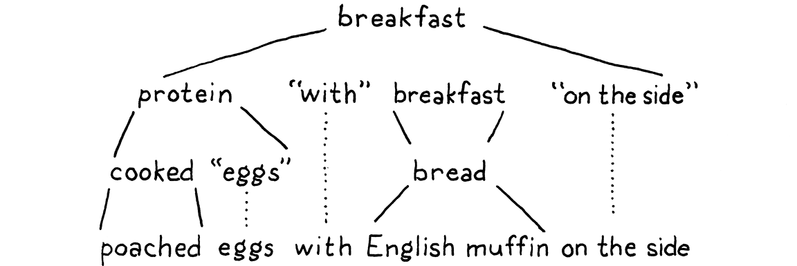

# 5. Representing Code 表示代碼

> To dwellers in a wood, almost every species of tree has its voice as well as its feature.
>
> ​													—— Thomas Hardy, *Under the Greenwood Tree*

對於森林中的居民來説，幾乎每一種樹都有它的聲音和特點。

> In the [last chapter](http://craftinginterpreters.com/scanning.html), we took the raw source code as a string and transformed it into a slightly higher-level representation: a series of tokens. The parser we’ll write in the [next chapter](http://craftinginterpreters.com/parsing-expressions.html) takes those tokens and transforms them yet again, into an even richer, more complex representation.
>

在上一章中，我們以字符串形式接收原始源代碼，並將其轉換為一個稍高級別的表示：一系列詞法標記。我們在下一章中要編寫的解析器，會將這些詞法標記再次轉換為更豐富、更復雜的表示形式。

> Before we can produce that representation, we need to define it. That’s the subject of this chapter. Along the way, we’ll cover some theory around formal grammars, feel the difference between functional and object-oriented programming, go over a couple of design patterns, and do some metaprogramming.
>

在我們能夠輸出這種表示形式之前，我們需要先對其進行定義。這就是本章的主題[^1]。在這一過程中，我們將圍繞形式化語法進行一些理論講解，感受函數式編程和面向對象編程的區別，會介紹幾種設計模式，並進行一些元編程。

> Before we do all that, let’s focus on the main goal—a representation for code. It should be simple for the parser to produce and easy for the interpreter to consume. If you haven’t written a parser or interpreter yet, those requirements aren’t exactly illuminating. Maybe your intuition can help. What is your brain doing when you play the part of a *human* interpreter? How do you mentally evaluate an arithmetic expression like this:

在做這些事情之前，我們先關注一下主要目標——代碼的表示形式。它應該易於解析器生成，也易於解釋器使用。如果您還沒有編寫過解析器或解釋器，那麼這樣的需求描述並不能很好地説明問題。也許你的直覺可以幫助你。當你扮演一個*人類*解釋器的角色時，你的大腦在做什麼？你如何在心裏計算這樣的算術表達式：

```js
1 + 2 * 3 - 4
```

> Because you understand the order of operations—the old “[Please Excuse My Dear Aunt Sally](https://en.wikipedia.org/wiki/Order_of_operations#Mnemonics)” stuff—you know that the multiplication is evaluated before the addition or subtraction. One way to visualize that precedence is using a tree. Leaf nodes are numbers, and interior nodes are operators with branches for each of their operands.

因為你已經理解了操作的順序——以前的“[Please Excuse My Dear Aunt Sally](https://en.wikipedia.org/wiki/Order_of_operations#Mnemonics)”之類[^2]，你知道乘法在加減操作之前執行。有一種方法可以將這種優先級進行可視化，那就是使用樹[^3]。葉子節點是數字，內部節點是運算符，它們的每個操作數都對應一個分支。

> In order to evaluate an arithmetic node, you need to know the numeric values of its subtrees, so you have to evaluate those first. That means working your way from the leaves up to the root—a *post-order* traversal:

要想計算一個算術節點，你需要知道它的子樹的數值，所以你必須先計算子樹的結果。這意味着要從葉節點一直計算到根節點——*後序*遍歷：


* A.從完整的樹開始，先計算最下面的操作`2*3`；
* B.現在計算`+`；
* C.接下來，計算`-`；
* D.最終得到答案。

> If I gave you an arithmetic expression, you could draw one of these trees pretty easily. Given a tree, you can evaluate it without breaking a sweat. So it intuitively seems like a workable representation of our code is a tree that matches the grammatical structure—the operator nesting—of the language.

如果我給你一個算術表達式，你可以很容易地畫出這樣的樹；給你一棵樹，你也可以毫不費力地進行計算。因此，從直觀上看，我們的代碼的一種可行的表示形式是一棵與語言的語法結構（運算符嵌套）相匹配的樹。

> We need to get more precise about what that grammar is then. Like lexical grammars in the last chapter, there is a long ton of theory around syntactic grammars. We’re going into that theory a little more than we did when scanning because it turns out to be a useful tool throughout much of the interpreter. We start by moving one level up the [Chomsky hierarchy](https://en.wikipedia.org/wiki/Chomsky_hierarchy) . . . 

那麼我們需要更精確地瞭解這個語法是什麼。就像上一章的詞彙語法一樣，圍繞句法語法也有一大堆理論。我們要比之前處理掃描時投入更多精力去研究這個理論，因為它在整個解釋器的很多地方都是一個有用的工具。我們先從[喬姆斯基譜系](https://en.wikipedia.org/wiki/Chomsky_hierarchy)中往上升一級……

> ## 5 . 1 Context-Free Grammars

## 5.1 上下文無關語法

> In the last chapter, the formalism we used for defining the lexical grammar—the rules for how characters get grouped into tokens—was called a *regular language*. That was fine for our scanner, which emits a flat sequence of tokens. But regular languages aren’t powerful enough to handle expressions which can nest arbitrarily deeply.

在上一章中，我們用來定義詞法語法（字符如何被分組為詞法標記的規則）的形式體系，被稱為*正則語言*。這對於我們的掃描器來説沒什麼問題，因為它輸出的是一個扁平的詞法標記序列。但正則語言還不夠強大，無法處理可以任意深度嵌套的表達式。

> We need a bigger hammer, and that hammer is a **context-free grammar** (**CFG**). It’s the next heaviest tool in the toolbox of **[formal grammars](https://en.wikipedia.org/wiki/Formal_grammar)**. A formal grammar takes a set of atomic pieces it calls its “alphabet”. Then it defines a (usually infinite) set of “strings” that are “in” the grammar. Each string is a sequence of “letters” in the alphabet.

我們還需要一個更強大的工具，就是上下文無關語法(**context-free grammar**，CFG)。它是[形式化語法](https://en.wikipedia.org/wiki/Formal_grammar)的工具箱中下一個最重的工具。一個形式化語法需要一組原子片段，它稱之為 "alphabet（字母表）"。然後它定義了一組（通常是無限的）"strings（字符串）"，這些字符串 "包含"在語法中。每個字符串都是字母表中 "letters（字符）"的序列。

> I’m using all those quotes because the terms get a little confusing as you move from lexical to syntactic grammars. In our scanner’s grammar, the alphabet consists of individual characters and the strings are the valid lexemes—roughly “words”. In the syntactic grammar we’re talking about now, we’re at a different level of granularity. Now each “letter” in the alphabet is an entire token and a “string” is a sequence of *tokens*—an entire expression.

我這裏使用引號是因為當你從詞法轉到文法語法時，這些術語會讓你有點困惑。在我們的掃描器詞法中，alphabet（字母表）由單個字符組成，strings（字符串）是有效的詞素（粗略的説，就是“單詞”）。在現在討論的句法語法中，我們處於一個不同的粒度水平。現在，字母表中的一個“letters（字符）”是一個完整的詞法標記，而“strings（字符串）”是一個詞法標記系列——一個完整的表達式。

> Oof. Maybe a table will help:

嗯，使用表格可能更有助於理解：

| Terminology<br/>術語                     |      | Lexical grammar 詞法                | Syntactic grammar 語法 |
| ---------------------------------------- | ---- | ----------------------------------- | ---------------------- |
| The “alphabet” is . . . <br />字母表     | →    | Characters<br />字符                | Tokens<br />詞法標記   |
| A “string” is . . . <br />字符串         | →    | Lexeme or token<br />詞素或詞法標記 | Expression<br />表達式 |
| It's implemented by the . . . <br />實現 | →    | Scanner<br />掃描器                 | Parser<br />解析器     |

> A formal grammar’s job is to specify which strings are valid and which aren’t. If we were defining a grammar for English sentences, “eggs are tasty for breakfast” would be in the grammar, but “tasty breakfast for are eggs” would probably not.

形式化語法的工作是指定哪些字符串有效，哪些無效。如果我們要為英語句子定義一個語法，"eggs are tasty for breakfast "會包含在語法中，但 "tasty breakfast for are eggs "可能不會。

> ### 5 . 1 . 1 Rules for grammars

### 5.1.1 語法規則

> How do we write down a grammar that contains an infinite number of valid strings? We obviously can’t list them all out. Instead, we create a finite set of rules. You can think of them as a game that you can “play” in one of two directions.

我們如何寫下一個包含無限多有效字符串的語法?我們顯然無法一一列舉出來。相反，我們創建了一組有限的規則。你可以把它們想象成一場你可以朝兩個方向“玩”的遊戲。

> If you start with the rules, you can use them to *generate* strings that are in the grammar. Strings created this way are called **derivations** because each is *derived* from the rules of the grammar. In each step of the game, you pick a rule and follow what it tells you to do. Most of the lingo around formal grammars comes from playing them in this direction. Rules are called **productions** because they *produce* strings in the grammar.

如果你從規則入手，你可以用它們*生成*語法中的字符串。以這種方式創建的字符串被稱為**推導式**（派生式），因為每個字符串都是從語法規則中*推導*出來的。在遊戲的每一步中，你都要選擇一條規則，然後按照它告訴你的去做。圍繞形式化語法的大部分語言都傾向這種方式。規則被稱為**生成式**，因為它們生成了語法中的字符串。

> Each production in a context-free grammar has a **head**—its name—and a **body**, which describes what it generates. In its pure form, the body is simply a list of symbols. Symbols come in two delectable flavors:

上下文無關語法中的每個生成式都有一個**頭部**（其名稱）和描述其生成內容的**主體**[^4]。在純粹的形式上看，主體只是一系列符號。符號有兩種：

> - A **terminal** is a letter from the grammar’s alphabet. You can think of it like a literal value. In the syntactic grammar we’re defining, the terminals are individual lexemes—tokens coming from the scanner like `if` or `1234`.
>
>   These are called “terminals”, in the sense of an “end point” because they don’t lead to any further “moves” in the game. You simply produce that one symbol.
>
> - A **nonterminal** is a named reference to another rule in the grammar. It means “play that rule and insert whatever it produces here”. In this way, the grammar composes.

* **終止符**是語法字母表中的一個字母。你可以把它想象成一個字面值。在我們定義的語法中，終止符是獨立的詞素——來自掃描器的詞法標記，比如 `if` 或 `1234`。

  這些詞素被稱為“終止符”，表示“終點”，因為它們不會導致遊戲中任何進一步的 "動作"。你只是簡單地產生了那一個符號。

* 非終止符是對語法中另一條規則的命名引用。它的意思是 "執行那條規則，然後將它產生的任何內容插入這裏"。這樣，語法就構成了。

> There is one last refinement: you may have multiple rules with the same name. When you reach a nonterminal with that name, you are allowed to pick any of the rules for it, whichever floats your boat.

還有最後一個細節：你可以有多個同名的規則。當你遇到一個該名字的非終止符時，你可以為它選擇任何一條規則，隨您喜歡。

> To make this concrete, we need a way to write down these production rules. People have been trying to crystallize grammar all the way back to Pāṇini’s *Ashtadhyayi*, which codified Sanskrit grammar a mere couple thousand years ago. Not much progress happened until John Backus and company needed a notation for specifying ALGOL 58 and came up with [Backus-Naur form](https://en.wikipedia.org/wiki/Backus–Naur_form) (**BNF**). Since then, nearly everyone uses some flavor of BNF, tweaked to their own tastes.

為了讓這個規則具體化，我們需要一種方式來寫下這些生成規則。人們一直試圖將語法具體化，可以追溯到Pāṇini的*Ashtadhyayi*，他在幾千年前編纂了梵文語法。直到約翰-巴庫斯（John Backus）和公司需要一個聲明ALGOL 58的符號，並提出了[巴科斯範式](https://en.wikipedia.org/wiki/Backus%E2%80%93Naur_form)（**BNF**），才有了很大的進展。從那時起，幾乎每個人都在使用BNF的某種變形，並根據自己的需要進行了調整[^5]。

> I tried to come up with something clean. Each rule is a name, followed by an arrow (`→`), followed by a sequence of symbols, and finally ending with a semicolon (`;`). Terminals are quoted strings, and nonterminals are lowercase words.

我試圖提出一個簡單的形式。 每個規則都是一個名稱，後跟一個箭頭（`→`），後跟一系列符號，最後以分號（`;`）結尾。 終止符是帶引號的字符串，非終止符是小寫的單詞。

> Using that, here’s a grammar for breakfast menus:

以此為基礎，下面是一個早餐菜單語法：

```js
breakfast  → protein "with" breakfast "on the side" ;
breakfast  → protein ;
breakfast  → bread ;

protein    → crispiness "crispy" "bacon" ;
protein    → "sausage" ;
protein    → cooked "eggs" ;

crispiness → "really" ;
crispiness → "really" crispiness ;

cooked     → "scrambled" ;
cooked     → "poached" ;
cooked     → "fried" ;

bread      → "toast" ;
bread      → "biscuits" ;
bread      → "English muffin" ;
```

> We can use this grammar to generate random breakfasts. Let’s play a round and see how it works. By age-old convention, the game starts with the first rule in the grammar, here `breakfast`. There are three productions for that, and we randomly pick the first one. Our resulting string looks like:

我們可以使用這個語法來隨機生成早餐。我們來玩一輪，看看它是如何工作的。按照老規矩，遊戲從語法中的第一個規則開始，這裏是`breakfast`。它有三個生成式，我們隨機選擇第一個。我們得到的字符串是這樣的：

```js
protein "with" breakfast "on the side"
```

> We need to expand that first nonterminal, `protein`, so we pick a production for that. Let’s pick:

我們需要展開第一個非終止符，`protein`，所有我們要選擇它對應的一個生成式。我們選：

```js
protein → cooked "eggs" ;
```

> Next, we need a production for `cooked`, and so we pick `"poached"`. That’s a terminal, so we add that. Now our string looks like:

接下來，我們需要 `cooked`的生成式，我們選擇 `"poached"`。這是一個終止符，我們加上它。現在我們的字符串是這樣的：

```js
"poached" "eggs" "with" breakfast "on the side"
```

> The next non-terminal is `breakfast` again. The first `breakfast` production we chose recursively refers back to the `breakfast` rule. Recursion in the grammar is a good sign that the language being defined is context-free instead of regular. In particular, recursion where the recursive nonterminal has productions on both sides implies that the language is not regular.

下一個非終止符還是`breakfast` ，我們開始選擇的`breakfast` 生成式遞歸地指向了`breakfast` 規則[^6]。語法中的遞歸是一個很好的標誌，表明所定義的語言是上下文無關的，而不是正則的。特別是，遞歸非終止符兩邊都有生成式的遞歸，意味着語言不是正則的。

> We could keep picking the first production for `breakfast` over and over again yielding all manner of breakfasts like “bacon with sausage with scrambled eggs with bacon . . . ” We won’t though. This time we’ll pick `bread`. There are three rules for that, each of which contains only a terminal. We’ll pick “English muffin”.

我們可以不斷選擇`breakfast` 的第一個生成式，以做出各種各樣的早餐：“bacon with sausage with scrambled eggs with bacon . . . ”，【存疑，按照規則設置，這裏應該不會出現以bacon開頭的字符串，原文可能有誤】但我們不會這樣做。這一次我們選擇`bread`。有三個對應的規則，每個規則只包含一個終止符。我們選 "English muffin"。

> With that, every nonterminal in the string has been expanded until it finally contains only terminals and we’re left with:

這樣一來，字符串中的每一個非終止符都被展開了，直到最後只包含終止符，我們就剩下：



> Throw in some ham and Hollandaise, and you’ve got eggs Benedict.

再加上一些火腿和荷蘭醬，你就得到了鬆餅蛋。

> Any time we hit a rule that had multiple productions, we just picked one arbitrarily. It is this flexibility that allows a short number of grammar rules to encode a combinatorially larger set of strings. The fact that a rule can refer to itself—directly or indirectly—kicks it up even more, letting us pack an infinite number of strings into a finite grammar.

每當我們遇到具有多個結果的規則時，我們都只是隨意選擇了一個。 正是這種靈活性允許用少量的語法規則來編碼出組合性更強的字符串集。一個規則可以直接或間接地引用它自己，這就更提高了它的靈活性，讓我們可以將無限多的字符串打包到一個有限的語法中。

> ### 5 . 1 . 2 Enhancing our notation 

### 5.1.2 增強符號

> Stuffing an infinite set of strings in a handful of rules is pretty fantastic, but let’s take it further. Our notation works, but it’s a little tedious. So, like any good language designer, we’ll sprinkle some syntactic sugar on top. In addition to terminals and nonterminals, we’ll allow a few other kinds of expressions in the body of a rule:
>

在少量的規則中可以填充無限多的字符串是相當奇妙的，但是我們可以更進一步。我們的符號是可行的，但有點乏味。所以，就像所有優秀的語言設計者一樣，我們會在上面撒一些語法糖。除了終止符和非終止符之外，我們還允許在規則的主體中使用一些其他類型的表達式：

- > Instead of repeating the rule name each time we want to add another production for it, we’ll allow a series of productions separated by a pipe (`|`).

  我們將允許一系列由管道符(`|`)分隔的生成式，避免在每次在添加另一個生成式時重複規則名稱。

  ```js
  bread → "toast" | "biscuits" | "English muffin" ;
  ```

- > Further, we’ll allow parentheses for grouping and then allow `|` within that to select one from a series of options within the middle of a production.

  此外，我們允許用括號進行分組，然後在分組中可以用`|`表示從一系列生成式中選擇一個。

  ```js
  protein → ( "scrambled" | "poached" | "fried" ) "eggs" ;
  ```

- > Using recursion to support repeated sequences of symbols has a certain appealing purity, but it’s kind of a chore to make a separate named sub-rule each time we want to loop. So, we also use a postfix `*` to allow the previous symbol or group to be repeated zero or more times.

  使用遞歸來支持符號的重複序列有一定的吸引力，但每次我們要循環的時候，都要創建一個單獨的命名子規則，有點繁瑣[^7]。所以，我們也使用後綴`*`來允許前一個符號或組重複零次或多次。

  ```js
  crispiness → "really" "really"* ;
  ```

- > A postfix `+` is similar, but requires the preceding production to appear at least once.

  後綴`+`與此類似，但要求前面的生成式至少出現一次。

  ```js
  crispiness → "really"+ ;
  ```

- > A postfix `?` is for an optional production. The thing before it can appear zero or one time, but not more.

  後綴`？`表示可選生成式，它之前的生成式可以出現零次或一次，但不能出現多次。

  ```js
  breakfast → protein ( "with" breakfast "on the side" )? ;
  ```

> With all of those syntactic niceties, our breakfast grammar condenses down to:

有了所有這些語法上的技巧，我們的早餐語法濃縮為：

```js
breakfast → protein ( "with" breakfast "on the side" )?
          | bread ;

protein   → "really"+ "crispy" "bacon"
          | "sausage"
          | ( "scrambled" | "poached" | "fried" ) "eggs" ;

bread     → "toast" | "biscuits" | "English muffin" ;
```

> Not too bad, I hope. If you’re used to grep or using [regular expressions](https://en.wikipedia.org/wiki/Regular_expression#Standards) in your text editor, most of the punctuation should be familiar. The main difference is that symbols here represent entire tokens, not single characters.

我希望還不算太壞。如果你習慣使用grep或在你的文本編輯器中使用[正則表達式](https://en.wikipedia.org/wiki/Regular_expression#Standards)，大多數的標點符號應該是熟悉的。主要區別在於，這裏的符號代表整個標記，而不是單個字符。

> We’ll use this notation throughout the rest of the book to precisely describe Lox’s grammar. As you work on programming languages, you’ll find that context-free grammars (using this or [EBNF](https://en.wikipedia.org/wiki/Extended_Backus–Naur_form) or some other notation) help you crystallize your informal syntax design ideas. They are also a handy medium for communicating with other language hackers about syntax.

在本書的其餘部分中，我們將使用這種表示法來精確地描述Lox的語法。當您使用編程語言時，您會發現上下文無關的語法(使用此語法或[EBNF](https://en.wikipedia.org/wiki/Extended_Backus%E2%80%93Naur_form)或其他一些符號)可以幫助您將非正式的語法設計思想具體化。它們也是與其他語言黑客交流語法的方便媒介。

> The rules and productions we define for Lox are also our guide to the tree data structure we’re going to implement to represent code in memory. Before we can do that, we need an actual grammar for Lox, or at least enough of one for us to get started.

我們為Lox定義的規則和生成式也是我們將要實現的樹數據結構（用於表示內存中的代碼）的指南。 在此之前，我們需要為Lox編寫一個實際的語法，或者至少要有一個足夠上手的語法。

> ### 5 . 1 . 3 A Grammar for Lox expressions

### 5.1.3 Lox表達式語法

> In the previous chapter, we did Lox’s entire lexical grammar in one fell swoop. Every keyword and bit of punctuation is there. The syntactic grammar is larger, and it would be a real bore to grind through the entire thing before we actually get our interpreter up and running.
>

在上一章中，我們一氣呵成地完成了Lox的全部詞彙語法，包括每一個關鍵詞和標點符號。但句法語法的規模更大，如果在我們真正啓動並運行解釋器之前，就要把整個語法啃完，那就太無聊了。

> Instead, we’ll crank through a subset of the language in the next couple of chapters. Once we have that mini-language represented, parsed, and interpreted, then later chapters will progressively add new features to it, including the new syntax. For now, we are going to worry about only a handful of expressions:
>

相反，我們將在接下來的幾章中摸索該語言的一個子集。一旦我們可以對這個迷你語言進行表示、解析和解釋，那麼在之後的章節中將逐步為它添加新的特性，包括新的語法。現在，我們只關心幾個表達式：

- > **Literals.** Numbers, strings, Booleans, and `nil`.

  **字面量**。數字、字符串、布爾值以及`nil`。

- > **Unary expressions.** A prefix `!` to perform a logical not, and `-` to negate a number.

  **一元表達式**。前綴`!`執行邏輯非運算，`-`對數字求反。

- > **Binary expressions.** The infix arithmetic (`+`, `-`, `*`, `/`) and logic operators (`==`, `!=`, `<`, `<=`, `>`, `>=`) we know and love.

  **二元表達式**。我們已經知道的中綴算術符（`+，-，*，/`）和邏輯運算符（`==，！=，<，<=，>，> =`）。

- > **Parentheses.** A pair of `(` and `)` wrapped around an expression.

  **括號**。表達式前後的一對`（`和`）`。

> That gives us enough syntax for expressions like:

這已經為表達式提供了足夠的語法，例如：

```
1 - (2 * 3) < 4 == false
```

> Using our handy dandy new notation, here’s a grammar for those:
>

使用我們的新符號，下面是語法的表示：

```js
expression     → literal
               | unary
               | binary
               | grouping ;

literal        → NUMBER | STRING | "true" | "false" | "nil" ;
grouping       → "(" expression ")" ;
unary          → ( "-" | "!" ) expression ;
binary         → expression operator expression ;
operator       → "==" | "!=" | "<" | "<=" | ">" | ">="
               | "+"  | "-"  | "*" | "/" ;
```

> There’s one bit of extra metasyntax here. In addition to quoted strings for terminals that match exact lexemes, we `CAPITALIZE` terminals that are a single lexeme whose text representation may vary. `NUMBER` is any number literal, and `STRING` is any string literal. Later, we’ll do the same for `IDENTIFIER`.

這裏有一點額外的元語法。除了與精確詞素相匹配的終止符會加引號外，我們還對錶示單一詞素的終止符進行`大寫化`，這些詞素的文本表示方式可能會有所不同。`NUMBER`是任何數字字面量，`STRING`是任何字符串字面量。稍後，我們將對`IDENTIFIER`進行同樣的處理[^8]。

> This grammar is actually ambiguous, which we’ll see when we get to parsing it. But it’s good enough for now.

這個語法實際上是有歧義的，我們在解析它時就會看到這一點。但現在這已經足夠了。

> ## 5 . 2 Implementing Syntax Trees

## 5.2 實現語法樹

> Finally, we get to write some code. That little expression grammar is our skeleton. Since the grammar is recursive—note how `grouping`, `unary`, and `binary` all refer back to `expression`—our data structure will form a tree. Since this structure represents the syntax of our language, it’s called a **syntax tree**.

最後，我們要寫一些代碼。這個小小的表達式語法就是我們的骨架。由於語法是遞歸的——請注意`grouping`, `unary`, 和 `binary` 都是指回`expression`的——我們的數據結構將形成一棵樹。因為這個結構代表了我們語言的語法，所以叫做**語法樹**[^9]。

> Our scanner used a single Token class to represent all kinds of lexemes. To distinguish the different kinds—think the number `123` versus the string `"123"`—we included a simple TokenType enum. Syntax trees are not so homogeneous. Unary expressions have a single operand, binary expressions have two, and literals have none.

我們的掃描器使用一個單一的 Token 類來表示所有類型的詞素。為了區分不同的種類——想想數字 `123` 和字符串 `"123"`——我們創建了一個簡單的 TokenType 枚舉。語法樹並不是那麼同質的[^10]。一元表達式只有一個操作數，二元表達式有兩個操作數，而字面量則沒有。

> We *could* mush that all together into a single Expression class with an arbitrary list of children. Some compilers do. But I like getting the most out of Java’s type system. So we’ll define a base class for expressions. Then, for each kind of expression—each production under `expression`—we create a subclass that has fields for the nonterminals specific to that rule. This way, we get a compile error if we, say, try to access the second operand of a unary expression.

我們*可以*將所有這些內容整合到一個包含任意子類列表的 Expression 類中。有些編譯器會這麼做。但我希望充分利用Java的類型系統。所以我們將為表達式定義一個基類。然後，對於每一種表達式——`expression`下的每一個生成式——我們創建一個子類，這個子類有該規則所特有的非終止符字段。這樣，如果試圖訪問一元表達式的第二個操作數，就會得到一個編譯錯誤。

> Something like this:

類似這樣[^11]：

```java
package com.craftinginterpreters.lox;

abstract class Expr { 
  static class Binary extends Expr {
    Binary(Expr left, Token operator, Expr right) {
      this.left = left;
      this.operator = operator;
      this.right = right;
    }

    final Expr left;
    final Token operator;
    final Expr right;
  }

  // Other expressions...
}
```

> Expr is the base class that all expression classes inherit from. As you can see from `Binary`, the subclasses are nested inside of it. There’s no technical need for this, but it lets us cram all of the classes into a single Java file.

Expr是所有表達式類繼承的基類。從`Binary`中可以看到，子類都嵌套在它的內部。這在技術上沒有必要，但它允許我們將所有類都塞進一個Java文件中。

> ### 5 . 2 . 1 Disoriented objects

### 5.2.1 非面向對象

> You’ll note that, much like the Token class, there aren’t any methods here. It’s a dumb structure. Nicely typed, but merely a bag of data. This feels strange in an object-oriented language like Java. Shouldn’t the class *do stuff*?

你會注意到，（表達式類）像Token類一樣，其中沒有任何方法。這是一個很愚蠢的結構，巧妙的類型封裝，但僅僅是一包數據。這在Java這樣的面嚮對象語言中會有些奇怪，難道類不是應該*做一些事情*嗎？

> The problem is that these tree classes aren’t owned by any single domain. Should they have methods for parsing since that’s where the trees are created? Or interpreting since that’s where they are consumed? Trees span the border between those territories, which means they are really owned by *neither*.

問題在於這些樹類不屬於任何單個的領域。樹是在解析的時候創建的，難道類中應該有解析對應的方法？或者因為樹結構在解釋的時候被消費，其中是不是要提供解釋相關的方法？樹跨越了這些領域之間的邊界，這意味着它們實際上不屬於任何一方。

> In fact, these types exist to enable the parser and interpreter to *communicate*. That lends itself to types that are simply data with no associated behavior. This style is very natural in functional languages like Lisp and ML where *all* data is separate from behavior, but it feels odd in Java.

事實上，這些類型的存在是為了讓解析器和解釋器能夠*進行交流*。這就適合於那些只是簡單的數據而沒有相關行為的類型。這種風格在Lisp和ML這樣的函數式語言中是非常自然的，因為在這些語言中，*所有的*數據和行為都是分開的，但是在Java中感覺很奇怪。

> Functional programming aficionados right now are jumping up to exclaim “See! Object-oriented languages are a bad fit for an interpreter!” I won’t go that far. You’ll recall that the scanner itself was admirably suited to object-orientation. It had all of the mutable state to keep track of where it was in the source code, a well-defined set of public methods, and a handful of private helpers.

函數式編程的愛好者們現在都跳起來驚呼：“看吧！面向對象的語言不適合作為解釋器！”我不會那麼過分的。您可能還記得，掃描器本身非常適合面向對象。它包含所有的可變狀態來跟蹤其在源代碼中的位置、一組定義良好的公共方法和少量的私有輔助方法。

> My feeling is that each phase or part of the interpreter works fine in an object-oriented style. It is the data structures that flow between them that are stripped of behavior.

我的感覺是，在面向對象的風格下，解釋器的每個階段或部分都能正常工作。只不過在它們之間流動的數據結構剝離了行為。

> ### 5 . 2 . 2 Metaprogramming the trees

### 5.2.2 節點樹元編程

> Java can express behavior-less classes, but I wouldn’t say that it’s particularly great at it. Eleven lines of code to stuff three fields in an object is pretty tedious, and when we’re all done, we’re going to have 21 of these classes.
>

Java可以表達無行為的類，但很難説它特別擅長。用11行代碼在一個對象中填充3個字段是相當乏味的，當我們全部完成後，我們將有21個這樣的類。

> I don’t want to waste your time or my ink writing all that down. Really, what is the essence of each subclass? A name, and a list of typed fields. That’s it. We’re smart language hackers, right? Let’s automate.
>

我不想浪費你的時間或我的墨水把這些都寫下來。真的，每個子類的本質是什麼?一個名稱和一個字段列表而已。我們是聰明的語言黑客，對吧?我們把它自動化[^12]。

> Instead of tediously handwriting each class definition, field declaration, constructor, and initializer, we’ll hack together a script that does it for us. It has a description of each tree type—its name and fields—and it prints out the Java code needed to define a class with that name and state.
>

與其繁瑣地手寫每個類的定義、字段聲明、構造函數和初始化器，我們一起編寫一個腳本來完成任務。 它具有每種樹類型（名稱和字段）的描述，並打印出定義具有該名稱和狀態的類所需的Java代碼。

> This script is a tiny Java command-line app that generates a file named “Expr.java”:
>

該腳本是一個微型Java命令行應用程序，它生成一個名為“ Expr.java”的文件：

*<u>tool/GenerateAst.java，創建新文件</u>*

```java
package com.craftinginterpreters.tool;

import java.io.IOException;
import java.io.PrintWriter;
import java.util.Arrays;
import java.util.List;

public class GenerateAst {
  public static void main(String[] args) throws IOException {
    if (args.length != 1) {
      System.err.println("Usage: generate_ast <output directory>");
      System.exit(64);
    }
    String outputDir = args[0];
  }
}
```

> Note that this file is in a different package, `.tool` instead of `.lox`. This script isn’t part of the interpreter itself. It’s a tool *we*, the people hacking on the interpreter, run ourselves to generate the syntax tree classes. When it’s done, we treat “Expr.java” like any other file in the implementation. We are merely automating how that file gets authored.
>

注意，這個文件在另一個包中，是`.tool`而不是`.lox`。這個腳本並不是解釋器本身的一部分，它是一個工具，我們這種編寫解釋器的人，通過運行該腳本來生成語法樹類。完成後，我們把“Expr.java”與實現中的其它文件進行相同的處理。我們只是自動化了文件的生成方式。

> To generate the classes, it needs to have some description of each type and its fields.

為了生成類，還需要對每種類型及其字段進行一些描述。

*<u>tool/GenerateAst.java，在 main()方法中添加</u>*

```java
    String outputDir = args[0];
    // 新增部分開始
    defineAst(outputDir, "Expr", Arrays.asList(
      "Binary   : Expr left, Token operator, Expr right",
      "Grouping : Expr expression",
      "Literal  : Object value",
      "Unary    : Token operator, Expr right"
    ));
    // 新增部分結束
  }
```

> For brevity’s sake, I jammed the descriptions of the expression types into strings. Each is the name of the class followed by `:` and the list of fields, separated by commas. Each field has a type and a name.

為簡便起見，我將表達式類型的描述放入了字符串中。 每一項都包括類的名稱，後跟`：`和以逗號分隔的字段列表。 每個字段都有一個類型和一個名稱。

> The first thing `defineAst()` needs to do is output the base Expr class.

`defineAst()`需要做的第一件事是輸出基類Expr。

*<u>tool/GenerateAst.java，在 main()方法後添加：</u>*

```java
  private static void defineAst(
      String outputDir, String baseName, List<String> types)
      throws IOException {
    String path = outputDir + "/" + baseName + ".java";
    PrintWriter writer = new PrintWriter(path, "UTF-8");

    writer.println("package com.craftinginterpreters.lox;");
    writer.println();
    writer.println("import java.util.List;");
    writer.println();
    writer.println("abstract class " + baseName + " {");

    writer.println("}");
    writer.close();
  }
```

> When we call this, `baseName` is “Expr”, which is both the name of the class and the name of the file it outputs. We pass this as an argument instead of hardcoding the name because we’ll add a separate family of classes later for statements.
>

我們調用這個函數時，`baseName`是“Expr”，它既是類的名稱，也是它輸出的文件的名稱。我們將它作為參數傳遞，而不是對名稱進行硬編碼，因為稍後我們將為語句添加一個單獨的類族。

> Inside the base class, we define each subclass.

在基類內部，我們定義每個子類。

*<u>tool/GenerateAst.java，在 defineAst()類中添加[^13]：</u>*

```java
    writer.println("abstract class " + baseName + " {");
    // 新增部分開始
    // The AST classes.
    for (String type : types) {
      String className = type.split(":")[0].trim();
      String fields = type.split(":")[1].trim(); 
      defineType(writer, baseName, className, fields);
    }
    // 新增部分結束
    writer.println("}");
```

> That code, in turn, calls:

這段代碼依次調用：

*<u>tool/GenerateAst.java，在 defineAst()後面添加：</u>*

```java
  private static void defineType(
      PrintWriter writer, String baseName,
      String className, String fieldList) {
    writer.println("  static class " + className + " extends " +
        baseName + " {");

    // Constructor.
    writer.println("    " + className + "(" + fieldList + ") {");

    // Store parameters in fields.
    String[] fields = fieldList.split(", ");
    for (String field : fields) {
      String name = field.split(" ")[1];
      writer.println("      this." + name + " = " + name + ";");
    }

    writer.println("    }");

    // Fields.
    writer.println();
    for (String field : fields) {
      writer.println("    final " + field + ";");
    }

    writer.println("  }");
  }
```

> There we go. All of that glorious Java boilerplate is done. It declares each field in the class body. It defines a constructor for the class with parameters for each field and initializes them in the body.

好了。所有的Java模板都完成了。它在類體中聲明瞭每個字段。它為類定義了一個構造函數，為每個字段提供參數，並在類體中對其初始化。

> Compile and run this Java program now and it blasts out a new “.java” file containing a few dozen lines of code. That file’s about to get even longer.

現在編譯並運行這個Java程序，它會生成一個新的“. Java”文件，其中包含幾十行代碼。那份文件還會變得更長[^14]。

> ## 5 . 3 Working with Trees

## 5.3 處理樹結構

> Put on your imagination hat for a moment. Even though we aren’t there yet, consider what the interpreter will do with the syntax trees. Each kind of expression in Lox behaves differently at runtime. That means the interpreter needs to select a different chunk of code to handle each expression type. With tokens, we can simply switch on the TokenType. But we don’t have a “type” enum for the syntax trees, just a separate Java class for each one.

先想象一下吧。儘管我們還沒有到那一步，但請考慮一下解釋器將如何處理語法樹。Lox中的每種表達式在運行時的行為都不一樣。這意味着解釋器需要選擇不同的代碼塊來處理每種表達式類型。對於詞法標記，我們可以簡單地根據`TokenType`進行轉換。但是我們並沒有為語法樹設置一個 "type "枚舉，只是為每個語法樹單獨設置一個Java類。

> We could write a long chain of type tests:

我們可以編寫一長串類型測試：

```java
if (expr instanceof Expr.Binary) {
  // ...
} else if (expr instanceof Expr.Grouping) {
  // ...
} else // ...
```

> But all of those sequential type tests are slow. Expression types whose names are alphabetically later would take longer to execute because they’d fall through more `if` cases before finding the right type. That’s not my idea of an elegant solution.

但所有這些順序類型測試都很慢。類型名稱按字母順序排列在後面的表達式，執行起來會花費更多的時間，因為在找到正確的類型之前，它們會遇到更多的`if`情況。這不是我認為的優雅解決方案。

> We have a family of classes and we need to associate a chunk of behavior with each one. The natural solution in an object-oriented language like Java is to put those behaviors into methods on the classes themselves. We could add an abstract `interpret()` method on Expr which each subclass would then implement to interpret itself.

我們有一個類族，我們需要將一組行為與每個類關聯起來。在Java這樣的面嚮對象語言中，最自然的解決方案是將這些行為放入類本身的方法中。我們可以在Expr上添加一個抽象的`interpret()`方法，然後每個子類都要實現這個方法來解釋自己[^15]。

> This works alright for tiny projects, but it scales poorly. Like I noted before, these tree classes span a few domains. At the very least, both the parser and interpreter will mess with them. As [you’ll see later](http://craftinginterpreters.com/resolving-and-binding.html), we need to do name resolution on them. If our language was statically typed, we’d have a type checking pass.

這對於小型項目來説還行，但它的擴展性很差。就像我之前提到的，這些樹類跨越了幾個領域。至少，解析器和解釋器都會對它們進行干擾。稍後您將看到，我們需要對它們進行名稱解析。如果我們的語言是靜態類型的，我們還需要做類型檢查。

> If we added instance methods to the expression classes for every one of those operations, that would smush a bunch of different domains together. That violates [separation of concerns](https://en.wikipedia.org/wiki/Separation_of_concerns) and leads to hard-to-maintain code.

如果我們為每一個操作的表達式類中添加實例方法，就會將一堆不同的領域混在一起。這違反了[關注點分離原則](https://en.wikipedia.org/wiki/Separation_of_concerns)，並會產生難以維護的代碼。

> ### 5 . 3 . 1 The expression problem

### 5.3.1 表達式問題

> This problem is more fundamental than it may seem at first. We have a handful of types, and a handful of high-level operations like “interpret”. For each pair of type and operation, we need a specific implementation. Picture a table:

這個問題比起初看起來更基礎。我們有一些類型，和一些高級操作，比如“解釋”。對於每一對類型和操作，我們都需要一個特定的實現。畫一個表:


> Rows are types, and columns are operations. Each cell represents the unique piece of code to implement that operation on that type.

行是類型，列是操作。每個單元格表示在該類型上實現該操作的唯一代碼段。

> An object-oriented language like Java assumes that all of the code in one row naturally hangs together. It figures all the things you do with a type are likely related to each other, and the language makes it easy to define them together as methods inside the same class.

像Java這樣的面向對象的語言，假定一行中的所有代碼都自然地掛在一起。它認為你對一個類型所做的所有事情都可能是相互關聯的，而使用這類語言可以很容易將它們一起定義為同一個類裏面的方法。


> This makes it easy to extend the table by adding new rows. Simply define a new class. No existing code has to be touched. But imagine if you want to add a new *operation*—a new column. In Java, that means cracking open each of those existing classes and adding a method to it.

這種情況下，向表中加入新行來擴展列表是很容易的，簡單地定義一個新類即可，不需要修改現有的代碼。但是，想象一下，如果你要添加一個新操作（新的一列）。在Java中，這意味着要拆開已有的那些類並向其中添加方法。

> Functional paradigm languages in the ML family flip that around. There, you don’t have classes with methods. Types and functions are totally distinct. To implement an operation for a number of different types, you define a single function. In the body of that function, you use *pattern matching*—sort of a type-based switch on steroids—to implement the operation for each type all in one place.

ML家族中的函數式範型反過來了[^16]。在這些語言中，沒有帶方法的類，類型和函數是完全獨立的。要為許多不同類型實現一個操作，只需定義一個函數。在該函數體中，您可以使用*模式匹配*（某種基於類型的switch操作）在同一個函數中實現每個類型對應的操作。

> This makes it trivial to add new operations—simply define another function that pattern matches on all of the types.

這使得添加新操作非常簡單——只需定義另一個與所有類型模式匹配的的函數即可。


> But, conversely, adding a new type is hard. You have to go back and add a new case to all of the pattern matches in all of the existing functions.

但是，反過來説，添加新類型是困難的。您必須回頭向已有函數中的所有模式匹配添加一個新的case。

> Each style has a certain “grain” to it. That’s what the paradigm name literally says—an object-oriented language wants you to *orient* your code along the rows of types. A functional language instead encourages you to lump each column’s worth of code together into a *function*.

每種風格都有一定的 "紋路"。這就是範式名稱的字面意思——面向對象的語言希望你按照類型的行來*組織*你的代碼。而函數式語言則鼓勵你把每一列的代碼都歸納為一個*函數*。

> A bunch of smart language nerds noticed that neither style made it easy to add *both* rows and columns to the table. They called this difficulty the “expression problem” because—like we are now—they first ran into it when they were trying to figure out the best way to model expression syntax tree nodes in a compiler.

一羣聰明的語言迷注意到，這兩種風格都不容易向表格中添加行和列。他們稱這個困難為“表達式問題”[^17]。就像我們現在一樣，他們是在試圖找出在編譯器中建模表達式語法樹節點的最佳方法時，第一次遇到了該問題。

> People have thrown all sorts of language features, design patterns, and programming tricks to try to knock that problem down but no perfect language has finished it off yet. In the meantime, the best we can do is try to pick a language whose orientation matches the natural architectural seams in the program we’re writing.

人們已經拋出了各種各樣的語言特性、設計模式和編程技巧，試圖解決這個問題，但還沒有一種完美的語言能夠解決它。與此同時，我們所能做的就是儘量選擇一種與我們正在編寫的程序的自然架構相匹配的語言。

> Object-orientation works fine for many parts of our interpreter, but these tree classes rub against the grain of Java. Fortunately, there’s a design pattern we can bring to bear on it.

面向對象在我們的解釋器的許多部分都可以正常工作，但是這些樹類與Java的本質背道而馳。 幸運的是，我們可以採用一種設計模式來解決這個問題。

> ### 5 . 3 . 2 The Visitor pattern

### 5.3.2 訪問者模式

> The **Visitor pattern** is the most widely misunderstood pattern in all of *Design Patterns*, which is really saying something when you look at the software architecture excesses of the past couple of decades.

**訪問者模式**是所有*設計模式*中最容易被誤解的模式，當您回顧過去幾十年的軟件架構氾濫狀況時，會發現確實如此。

> The trouble starts with terminology. The pattern isn’t about “visiting”, and the “accept” method in it doesn’t conjure up any helpful imagery either. Many think the pattern has to do with traversing trees, which isn’t the case at all. We *are* going to use it on a set of classes that are tree-like, but that’s a coincidence. As you’ll see, the pattern works as well on a single object.

問題出在術語上。這個模式不是關於“visiting（訪問）”，它的 “accept”方法也沒有讓人產生任何有用的想象。許多人認為這種模式與遍歷樹有關，但事實並非如此。我們確實要在一組樹結構的類上使用它，但這只是一個巧合。如您所見，該模式在單個對象上也可以正常使用。

> The Visitor pattern is really about approximating the functional style within an OOP language. It lets us add new columns to that table easily. We can define all of the behavior for a new operation on a set of types in one place, without having to touch the types themselves. It does this the same way we solve almost every problem in computer science: by adding a layer of indirection.

訪問者模式實際上近似於OOP語言中的函數式。它讓我們可以很容易地向表中添加新的列。我們可以在一個地方定義針對一組類型的新操作的所有行為，而不必觸及類型本身。這與我們解決計算機科學中幾乎所有問題的方式相同：添加中間層。

> Before we apply it to our auto-generated Expr classes, let’s walk through a simpler example. Say we have two kinds of pastries: beignets and crullers.

在將其應用到自動生成的Expr類之前，讓我們先看一個更簡單的例子。比方説我們有兩種點心:Beignet(捲餅)和Cruller(油酥卷)。

```java
 abstract class Pastry {
  }

  class Beignet extends Pastry {
  }

  class Cruller extends Pastry {
  }
```

> We want to be able to define new pastry operations—cooking them, eating them, decorating them, etc.—without having to add a new method to each class every time. Here’s how we do it. First, we define a separate interface.

我們希望能夠定義新的糕點操作（烹飪，食用，裝飾等），而不必每次都向每個類添加新方法。我們是這樣做的。首先，我們定義一個單獨的接口[^18]。

```java
  interface PastryVisitor {
    void visitBeignet(Beignet beignet); 
    void visitCruller(Cruller cruller);
  }
```

> Each operation that can be performed on pastries is a new class that implements that interface. It has a concrete method for each type of pastry. That keeps the code for the operation on both types all nestled snugly together in one class.

可以對糕點執行的每個操作都是實現該接口的新類。 它對每種類型的糕點都有具體的方法。 這樣一來，針對兩種類型的操作代碼都緊密地嵌套在一個類中。

> Given some pastry, how do we route it to the correct method on the visitor based on its type? Polymorphism to the rescue! We add this method to Pastry:

給定一個糕點，我們如何根據其類型將其路由到訪問者的正確方法？多態性拯救了我們！我們在Pastry中添加這個方法：

```java
  abstract class Pastry {
    abstract void accept(PastryVisitor visitor);
  }
```

> Each subclass implements it.

每個子類都需要實現該方法：

```java
  class Beignet extends Pastry {
    @Override
    void accept(PastryVisitor visitor) {
      visitor.visitBeignet(this);
    }
  }
```

> And:

以及：

```java
  class Cruller extends Pastry {
    @Override
    void accept(PastryVisitor visitor) {
      visitor.visitCruller(this);
    }
  }
```

> To perform an operation on a pastry, we call its `accept()` method and pass in the visitor for the operation we want to execute. The pastry—the specific subclass’s overriding implementation of `accept()`—turns around and calls the appropriate visit method on the visitor and passes *itself* to it.

要對糕點執行一個操作，我們就調用它的`accept()`方法，並將我們要執行的操作vistor作為參數傳入該方法。pastry類——特定子類對`accept()`的重寫實現——會反過來，在visitor上調用合適的visit方法，並將*自身*作為參數傳入。

> That’s the heart of the trick right there. It lets us use polymorphic dispatch on the *pastry* classes to select the appropriate method on the *visitor* class. In the table, each pastry class is a row, but if you look at all of the methods for a single visitor, they form a *column*.

這就是這個技巧的核心所在。它讓我們可以在*pastry*類上使用多態派遣，在*visitor*類上選擇合適的方法。對應在表格中，每個pastry類都是一行，但如果你看一個visitor的所有方法，它們就會形成一*列*。


> We added one `accept()` method to each class, and we can use it for as many visitors as we want without ever having to touch the pastry classes again. It’s a clever pattern.

我們為每個類添加了一個`accept（）`方法，我們可以根據需要將其用於任意數量的訪問者，而無需再次修改*pastry*類。 這是一個聰明的模式。


> ### 5 . 3 . 3 Visitors for expressions

### 5.3.3 表達式訪問者

> OK, let’s weave it into our expression classes. We’ll also refine the pattern a little. In the pastry example, the visit and `accept()` methods don’t return anything. In practice, visitors often want to define operations that produce values. But what return type should `accept()` have? We can’t assume every visitor class wants to produce the same type, so we’ll use generics to let each implementation fill in a return type.

好的，讓我們將它編入表達式類中。我們還要對這個模式進行一下完善。在糕點的例子中，visit和`accept()`方法沒有返回任何東西。在實踐中，訪問者通常希望定義能夠產生值的操作。但`accept()`應該具有什麼返回類型呢？我們不能假設每個訪問者類都想產生相同的類型，所以我們將使用泛型來讓每個實現類自行填充一個返回類型。

> First, we define the visitor interface. Again, we nest it inside the base class so that we can keep everything in one file.

首先，我們定義訪問者接口。同樣，我們把它嵌套在基類中，以便將所有的內容都放在一個文件中。

*<u>tool/GenerateAst.java，在 defineAst()方法中添加：</u>*

```java
    writer.println("abstract class " + baseName + " {");
    // 新增部分開始
    defineVisitor(writer, baseName, types);
    // 新增部分結束
    // The AST classes.
```

> That function generates the visitor interface.

這個函數會生成visitor接口。

*<u>tool/GenerateAst.java，在 defineAst()方法後添加：</u>*

```java
  private static void defineVisitor(
      PrintWriter writer, String baseName, List<String> types) {
    writer.println("  interface Visitor<R> {");

    for (String type : types) {
      String typeName = type.split(":")[0].trim();
      writer.println("    R visit" + typeName + baseName + "(" +
          typeName + " " + baseName.toLowerCase() + ");");
    }

    writer.println("  }");
  }
```

> Here, we iterate through all of the subclasses and declare a visit method for each one. When we define new expression types later, this will automatically include them.

在這裏，我們遍歷所有的子類，併為每個子類聲明一個visit方法。當我們以後定義新的表達式類型時，會自動包含這些內容。

> Inside the base class, we define the abstract `accept()` method.

在基類中，定義抽象 `accept()` 方法。

*<u>tool/GenerateAst.java，在 defineAst()方法中添加：</u>*

```java
    	defineType(writer, baseName, className, fields);
    }
    // 新增部分開始
    // The base accept() method.
    writer.println();
    writer.println("  abstract <R> R accept(Visitor<R> visitor);");
    // 新增部分結束
    writer.println("}");
```

> Finally, each subclass implements that and calls the right visit method for its own type.

最後，每個子類都實現該方法，並調用其類型對應的visit方法。

*<u>tool/GenerateAst.java，在 defineType()方法中添加：</u>*

```java
    writer.println("    }");
    // 新增部分開始
    // Visitor pattern.
    writer.println();
    writer.println("    @Override");
    writer.println("    <R> R accept(Visitor<R> visitor) {");
    writer.println("      return visitor.visit" +
        className + baseName + "(this);");
    writer.println("    }");
    // 新增部分結束
    // Fields.
```

> There we go. Now we can define operations on expressions without having to muck with the classes or our generator script. Compile and run this generator script to output an updated “Expr.java” file. It contains a generated Visitor interface and a set of expression node classes that support the Visitor pattern using it.

這下好了。現在我們可以在表達式上定義操作，而且無需對類或生成器腳本進行修改。編譯並運行這個生成器腳本，輸出一個更新後的 "Expr.java "文件。該文件中包含一個生成的Visitor接口和一組使用該接口支持Visitor模式的表達式節點類。

> Before we end this rambling chapter, let’s implement that Visitor interface and see the pattern in action.

在結束這雜亂的一章之前，我們先實現一下這個Visitor接口，看看這個模式的運行情況。

> ## 5 . 4 A (Not Very) Pretty Printer

## 5.4 一個（不是很）漂亮的打印器

> When we debug our parser and interpreter, it’s often useful to look at a parsed syntax tree and make sure it has the structure we expect. We could inspect it in the debugger, but that can be a chore.

當我們調試解析器和解釋器時，查看解析後的語法樹並確保其與期望的結構一致通常是很有用的。我們可以在調試器中進行檢查，但那可能有點難。

> Instead, we’d like some code that, given a syntax tree, produces an unambiguous string representation of it. Converting a tree to a string is sort of the opposite of a parser, and is often called “pretty printing” when the goal is to produce a string of text that is valid syntax in the source language.

相反，我們需要一些代碼，在給定語法樹的情況下，生成一個明確的字符串表示。將語法樹轉換為字符串是解析器的逆向操作，當我們的目標是產生一個在源語言中語法有效的文本字符串時，通常被稱為 "漂亮打印"。

> That’s not our goal here. We want the string to very explicitly show the nesting structure of the tree. A printer that returned `1 + 2 * 3` isn’t super helpful if what we’re trying to debug is whether operator precedence is handled correctly. We want to know if the `+` or `*` is at the top of the tree.

這不是我們的目標。我們希望字符串非常明確地顯示樹的嵌套結構。如果我們要調試的是操作符的優先級是否處理正確，那麼返回`1 + 2 * 3`的打印器並沒有什麼用，我們想知道`+`或`*`是否在語法樹的頂部。

> To that end, the string representation we produce isn’t going to be Lox syntax. Instead, it will look a lot like, well, Lisp. Each expression is explicitly parenthesized, and all of its subexpressions and tokens are contained in that.

因此，我們生成的字符串表示形式不是Lox語法。相反，它看起來很像Lisp。每個表達式都被顯式地括起來，並且它的所有子表達式和詞法標記都包含在其中。

> Given a syntax tree like:

給定一個語法樹，如：


> It produces:

輸出結果為：

```js
(* (- 123) (group 45.67))
```

> Not exactly “pretty”, but it does show the nesting and grouping explicitly. To implement this, we define a new class.

不是很“漂亮”，但是它確實明確地展示了嵌套和分組。為了實現這一點，我們定義了一個新類。

*<u>lox/AstPrinter.java，創建新文件：</u>*

```java
package com.craftinginterpreters.lox;

class AstPrinter implements Expr.Visitor<String> {
  String print(Expr expr) {
    return expr.accept(this);
  }
}
```

> As you can see, it implements the visitor interface. That means we need visit methods for each of the expression types we have so far.

如你所見，它實現了visitor接口。這意味着我們需要為我們目前擁有的每一種表達式類型提供visit方法。

*<u>lox/AstPrinter.java，在 print()方法後添加：</u>*

```java
  return expr.accept(this);
  }
  // 新增部分開始
  @Override
  public String visitBinaryExpr(Expr.Binary expr) {
    return parenthesize(expr.operator.lexeme,
                        expr.left, expr.right);
  }

  @Override
  public String visitGroupingExpr(Expr.Grouping expr) {
    return parenthesize("group", expr.expression);
  }

  @Override
  public String visitLiteralExpr(Expr.Literal expr) {
    if (expr.value == null) return "nil";
    return expr.value.toString();
  }

  @Override
  public String visitUnaryExpr(Expr.Unary expr) {
    return parenthesize(expr.operator.lexeme, expr.right);
  }
	// 新增部分結束
}
```

> Literal expressions are easy—they convert the value to a string with a little check to handle Java’s `null` standing in for Lox’s `nil`. The other expressions have subexpressions, so they use this `parenthesize()` helper method:

字面量表達式很簡單——它們將值轉換為一個字符串，並通過一個小檢查用Java中的`null`代替Lox中的`nil`。其他表達式有子表達式，所以它們要使用`parenthesize()`這個輔助方法：

*<u>lox/AstPrinter.java，在 visitUnaryExpr()方法後添加：</u>*

```java
  private String parenthesize(String name, Expr... exprs) {
    StringBuilder builder = new StringBuilder();

    builder.append("(").append(name);
    for (Expr expr : exprs) {
      builder.append(" ");
      builder.append(expr.accept(this));
    }
    builder.append(")");

    return builder.toString();
  }
```

> It takes a name and a list of subexpressions and wraps them all up in parentheses, yielding a string like:

它接收一個名稱和一組子表達式作為參數，將它們全部包裝在圓括號中，並生成一個如下的字符串：

```
(+ 1 2)
```

> Note that it calls `accept()` on each subexpression and passes in itself. This is the recursive step that lets us print an entire tree.

請注意，它在每個子表達式上調用`accept()`並將自身傳遞進去。 這是遞歸步驟，可讓我們打印整棵樹。

> We don’t have a parser yet, so it’s hard to see this in action. For now, we’ll hack together a little `main()` method that manually instantiates a tree and prints it.

我們還沒有解析器，所以很難看到它的實際應用。現在，我們先使用一個`main()`方法來手動實例化一個樹並打印它。

*<u>lox/AstPrinter.java，在 parenthesize()方法後添加：</u>*

```java
  public static void main(String[] args) {
    Expr expression = new Expr.Binary(
        new Expr.Unary(
            new Token(TokenType.MINUS, "-", null, 1),
            new Expr.Literal(123)),
        new Token(TokenType.STAR, "*", null, 1),
        new Expr.Grouping(
            new Expr.Literal(45.67)));

    System.out.println(new AstPrinter().print(expression));
  }
```

> If we did everything right, it prints:

如果我們都做對了，它就會打印：

```js
(* (- 123) (group 45.67))
```

> You can go ahead and delete this method. We won’t need it. Also, as we add new syntax tree types, I won’t bother showing the necessary visit methods for them in AstPrinter. If you want to (and you want the Java compiler to not yell at you), go ahead and add them yourself. It will come in handy in the next chapter when we start parsing Lox code into syntax trees. Or, if you don’t care to maintain AstPrinter, feel free to delete it. We won’t need it again.

您可以繼續刪除這個方法，我們後面不再需要它了。另外，當我們添加新的語法樹類型時，我不會在AstPrinter中展示它們對應的visit方法。如果你想這樣做(並且希望Java編譯器不會報錯)，那麼你可以自行添加這些方法。在下一章，當我們開始將Lox代碼解析為語法樹時，它將會派上用場。或者，如果你不想維護AstPrinter，可以隨意刪除它。我們不再需要它了。


[^1]: 我非常擔心這一章會成為這本書中最無聊的章節之一，所以我儘可能多地往裏面塞入了很多有趣的想法。
[^2]: 在美國，運算符優先級常縮寫為**PEMDAS**，分別表示*P*arentheses(括號), *E*xponents(指數), *M*ultiplication/*D*ivision(乘除), *A*ddition/*S*ubtraction(加減)。為了便於記憶，將縮寫詞擴充為“**Please Excuse My Dear Aunt Sally**”。
[^3]: 這並不是説樹是我們代碼的唯一可能的表示方式。在第三部分，我們將生成字節碼，這是另一種對人類不友好但更接近機器的表示方式。
[^4]: 將頭部限制為單個符號是上下文無關語法的定義特性。更強大的形式，如[無限制文法](https://en.wikipedia.org/wiki/Unrestricted_grammar)，允許在頭部和主體中都包含一系列的符號。
[^5]: 是的，我們需要為定義語法的規則定義一個語法。我們也應該指定這個元語法嗎?我們用什麼符號來表示它?從上到下都是語言
[^6]: 想象一下，我們在這裏遞歸擴展幾次`breakfast`規則，比如 "bacon with bacon with bacon with . . ." ，為了正確地完成這個字符串，我們需要在結尾處添加同等數量的 "on the side "詞組。跟蹤所需尾部的數量超出了正則語法的能力範圍。正則語法可以表達*重複*，但它們無法*統計*有多少重複，但是這（種跟蹤）對於確保字符串的`with`和`on the side`部分的數量相同是必要的。
[^7]: Scheme編程語言就是這樣工作的。它根本沒有內置的循環功能。相反，所有重複都用遞歸來表示。
[^8]: 如果你願意，可以嘗試使用這個語法生成一些表達式，就像我們之前用早餐語法做的那樣。生成的表達式你覺得對嗎？你能讓它生成任何錯誤的東西，比如1+/3嗎？
[^9]: 特別是，我們要定義一個**抽象語法樹（AST）**。在**解析樹**中，每一個語法生成式都成為樹中的一個節點。AST省略了後面階段不需要的生成式。
[^10]: 詞法單元也不是完全同質的。字面值的標記存儲值，但其他類型的詞素不需要該狀態。我曾經見過一些掃描器使用不同的類來處理字面量和其他類型的詞素，但我認為我應該把事情簡單化。
[^11]: 我儘量避免在代碼中使用縮寫，因為這會讓不知道其含義的讀者犯錯誤。但是在我所研究過的編譯器中，“Expr”和“Stmt”是如此普遍，我最好現在就開始讓您習慣它們。
[^12]: 我從Jython和IronPython的創建者Jim Hugunin那裏得到了編寫語法樹類腳本的想法。真正的腳本語言比Java更適合這種情況，但我儘量不向您提供太多的語言。
[^13]: 這不是世界上最優雅的字符串操作代碼，但也很好。它只在我們給它的類定義集上運行。穩健性不是優先考慮的問題。
[^14]: 附錄II包含了在我們完成jlox的實現並定義了它的所有語法樹節點之後，這個腳本生成的代碼。
[^15]: 這就是Erich Gamma等人在《設計模式:可重用的面向對象軟件的元素》一書中所謂的[解釋器模式](https://en.wikipedia.org/wiki/Interpreter_pattern)。
[^16]: ML，是元語言(metalanguage)的簡稱，它是由Robin Milner和他的朋友們創建的，是偉大的編程語言家族的主要分支之一。它的子程序包括SML、Caml、OCaml、Haskell和F#。甚至Scala、Rust和Swift都有很強的相似性。就像Lisp一樣，它也是那種充滿了好點子的語言之一，即使在40多年後的今天，語言設計者仍然在重新發現它們。
[^17]: 諸如Common Lisp的CLOS，Dylan和Julia這樣的支持多方法(多分派)的語言都能輕鬆添加新類型和操作。它們通常犧牲的是靜態類型檢查或單獨編譯。
[^18]: 在設計模式中，這兩種方法的名字都叫`visit()`，很容易混淆，需要依賴重載來區分不同方法。這也導致一些讀者認為正確的visit方法是在運行時根據其參數類型選擇的。事實並非如此。與重寫不同，重載是在編譯時靜態分派的。為每個方法使用不同的名稱使分派更加明顯，同時還向您展示瞭如何在不支持重載的語言中應用此模式。


------

> ## CHALLENGES

## 習題

> 1、Earlier, I said that the `|`, `*`, and `+` forms we added to our grammar metasyntax were just syntactic sugar. Take this grammar:
>
> ```
> expr → expr ( "(" ( expr ( "," expr )* )? ")" | "." IDENTIFIER )+
>      | IDENTIFIER
>      | NUMBER
> ```
>
> Produce a grammar that matches the same language but does not use any of that notational sugar.
>
> *Bonus:* What kind of expression does this bit of grammar encode?

1、之前我説過，我們在語法元語法中添加的`|`、`*`、`+`等形式只是語法糖。以這個語法為例:

```
expr → expr ( "(" ( expr ( "," expr )* )? ")" | "." IDENTIFIER )+
     | IDENTIFIER
     | NUMBER
```

生成一個與同一語言相匹配的語法，但不要使用任何語法糖。

附加題：這一點語法表示了什麼樣的表達式？

> 2、The Visitor pattern lets you emulate the functional style in an object-oriented language. Devise a complementary pattern for a functional language. It should let you bundle all of the operations on one type together and let you define new types easily.
>
> (SML or Haskell would be ideal for this exercise, but Scheme or another Lisp works as well.)

2、Visitor 模式讓你可以在面向對象的語言中模仿函數式。為函數式語言設計一個互補的模式，該模式讓你可以將一個類型上的所有操作捆綁在一起，並輕鬆擴展新的類型。

(SML或Haskell是這個練習的理想選擇，但Scheme或其它Lisp方言也可以。)

> 3、In [Reverse Polish Notation](https://en.wikipedia.org/wiki/Reverse_Polish_notation) (RPN), the operands to an arithmetic operator are both placed before the operator, so `1 + 2` becomes `1 2 +`. Evaluation proceeds from left to right. Numbers are pushed onto an implicit stack. An arithmetic operator pops the top two numbers, performs the operation, and pushes the result. Thus, this:
>
> ```java
> (1 + 2) * (4 - 3)
> ```
>
> in RPN becomes:
>
> ```java
> 1 2 + 4 3 - *
> ```
>
> Define a visitor class for our syntax tree classes that takes an expression, converts it to RPN, and returns the resulting string.

3、在[逆波蘭表達式](https://en.wikipedia.org/wiki/Reverse_Polish_notation)(RPN)中，算術運算符的操作數都放在運算符之前，所以`1 + 2`變成了`1 2 +`。計算時從左到右進行，操作數被壓入隱式棧。算術運算符彈出前兩個數字，執行運算，並將結果推入棧中。因此,

```java
(1 + 2) * (4 - 3)
```

在RPN中變為了

```
1 2 + 4 3 - *
```

為我們的語法樹類定義一個Vistor類，該類接受一個表達式，將其轉換為RPN，並返回結果字符串。
