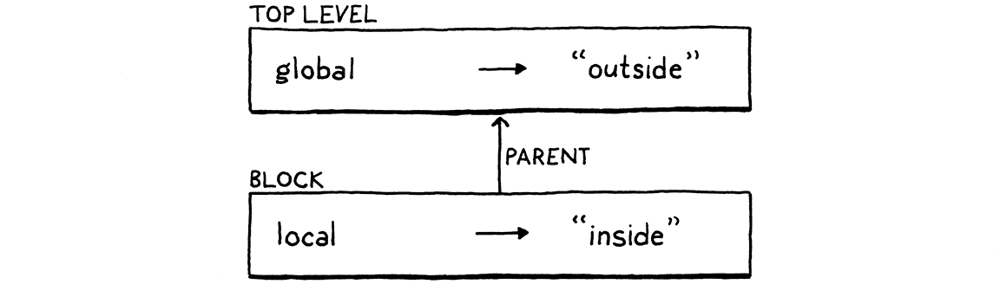

# 8. Statements and State 陳述式和狀態

> *All my life, my heart has yearned for a thing I cannot name.*
>
> ​																																		——    André Breton, *Mad Love*

終我一生，我們的內心都在渴求一種我無法名狀的東西。

> The interpreter we have so far feels less like programming a real language and more like punching buttons on a calculator. “Programming” to me means building up a system out of smaller pieces. We can’t do that yet because we have no way to bind a name to some data or function. We can’t compose software without a way to refer to the pieces.

到目前為止，我們提供解釋器的感覺不太像是在使用一種真正的語言進行編程，更像是在計算器上按按鈕。對我來説，"編程 "意味着用較小的部分構建出一個系統。我們目前還不支持這樣做，因為我們還無法將一個名稱綁定到某個數據或函數。我們不能在無法引用小片段的情況下編寫軟件。

> To support bindings, our interpreter needs internal state. When you define a variable at the beginning of the program and use it at the end, the interpreter has to hold on to the value of that variable in the meantime. So in this chapter, we will give our interpreter a brain that can not just process, but *remember*.

為了支持綁定，我們的解釋器需要保存內部狀態。如果你在程序開始處定義了一個變量，並在結束處使用它，那麼解釋器必須在這期間保持該變量的值。所以在這一章中，我們會給解釋器一個大腦，它不僅可以運算，而且可以*記憶*。


> State and statements go hand in hand. Since statements, by definition, don’t evaluate to a value, they need to do something else to be useful. That something is called a **side effect**. It could mean producing user-visible output or modifying some state in the interpreter that can be detected later. The latter makes them a great fit for defining variables or other named entities.

狀態和語句是相輔相成的。因為根據定義，語句不會計算出一個具體值，而是需要做一些事情來發揮作用。這些事情被稱為**副作用(side effect)**。它可能意味着產生用户可見的輸出，或者修改解釋器中的一些狀態，而這些狀態後續可以被檢測到。第二個特性使得語句非常適合於定義變量或其他命名實體。

> In this chapter, we’ll do all of that. We’ll define statements that produce output (`print`) and create state (`var`). We’ll add expressions to access and assign to variables. Finally, we’ll add blocks and local scope. That’s a lot to stuff into one chapter, but we’ll chew through it all one bite at a time.

在這一章中，我們會實現所有這些。我們會定義可以產生輸出和創建狀態的語句，然後會添加表達式來訪問和賦值給這些變量，最後，我們會引入代碼塊和局部作用域。這一章要講的內容太多了，但是我們會一點一點地把它們嚼碎。

> ## 8 . 1 Statements

## 8.1 語句

> We start by extending Lox’s grammar with statements. They aren’t very different from expressions. We start with the two simplest kinds:

我們首先擴展Lox的語法以支持語句。 語句與表達式並沒有很大的不同，我們從兩種最簡單的類型開始：

1. > An **expression statement** lets you place an expression where a statement is expected. They exist to evaluate expressions that have side effects. You may not notice them, but you use them all the time in C, Java, and other languages. Any time you see a function or method call followed by a `;`, you’re looking at an expression statement.

   **表達式語句**可以讓您將表達式放在需要語句的位置。它們的存在是為了計算有副作用的表達式。您可能沒有注意到它們，但其實你在C、Java和其他語言中一直在使用表達式語句[^1]。如果你看到一個函數或方法調用後面跟着一個`;`，您看到的其實就是一個表達式語句。

2. > A **`print` statement** evaluates an expression and displays the result to the user. I admit it’s weird to bake printing right into the language instead of making it a library function. Doing so is a concession to the fact that we’re building this interpreter one chapter at a time and want to be able to play with it before it’s all done. To make print a library function, we’d have to wait until we had all of the machinery for defining and calling functions before we could witness any side effects.

   **`print`語句**會計算一個表達式，並將結果展示給用户。我承認把`print`直接放進語言中，而不是把它變成一個庫函數，這很奇怪[^2]。這樣做是基於本書的編排策略的讓步，即我們會以章節為單位逐步構建這個解釋器，並希望能夠在完成解釋器的所有功能之前能夠使用它。如果讓`print`成為一個標準庫函數，我們必須等到擁有了定義和調用函數的所有機制之後，才能看到它發揮作用。

> New syntax means new grammar rules. In this chapter, we finally gain the ability to parse an entire Lox script. Since Lox is an imperative, dynamically typed language, the “top level” of a script is simply a list of statements. The new rules are:

新的詞法意味着新的語法規則。在本章中，我們終於獲得解析整個Lox腳本的能力。由於Lox是一種命令式的、動態類型的語言，所以腳本的“頂層”也只是一組語句。新的規則如下：

```javascript
program        → statement* EOF ;

statement      → exprStmt
               | printStmt ;

exprStmt       → expression ";" ;
printStmt      → "print" expression ";" ;
```

> The first rule is now `program`, which is the starting point for the grammar and represents a complete Lox script or REPL entry. A program is a list of statements followed by the special “end of file” token. The mandatory end token ensures the parser consumes the entire input and doesn’t silently ignore erroneous unconsumed tokens at the end of a script.

現在第一條規則是`program`，這也是語法的起點，代表一個完整的Lox腳本或REPL輸入項。程序是一個語句列表，後面跟着特殊的“文件結束”(EOF)標記。強制性的結束標記可以確保解析器能夠消費所有輸入內容，而不會默默地忽略腳本結尾處錯誤的、未消耗的標記。

> Right now, `statement` only has two cases for the two kinds of statements we’ve described. We’ll fill in more later in this chapter and in the following ones. The next step is turning this grammar into something we can store in memory—syntax trees.

目前，`statement`只有兩種情況，分別對應於我們描述的兩類語句。我們將在本章後面和接下來的章節中補充更多內容。接下來就是將這個語法轉化為我們可以存儲在內存中的東西——語法樹。。

> ### 8 . 1 . 1 Statement syntax trees

### 8.1.1 Statement語法樹

> There is no place in the grammar where both an expression and a statement are allowed. The operands of, say, `+` are always expressions, never statements. The body of a `while` loop is always a statement.

語法中沒有地方既允許使用表達式，也允許使用語句。 操作符（如`+`）的操作數總是表達式，而不是語句。`while`循環的主體總是一個語句。

> Since the two syntaxes are disjoint, we don’t need a single base class that they all inherit from. Splitting expressions and statements into separate class hierarchies enables the Java compiler to help us find dumb mistakes like passing a statement to a Java method that expects an expression.

因為這兩種語法是不相干的，所以我們不需要提供一個它們都繼承的基類。將表達式和語句拆分為單獨的類結構，可使Java編譯器幫助我們發現一些愚蠢的錯誤，例如將語句傳遞給需要表達式的Java方法。

> That means a new base class for statements. As our elders did before us, we will use the cryptic name “Stmt”. With great foresight, I have designed our little AST metaprogramming script in anticipation of this. That’s why we passed in “Expr” as a parameter to `defineAst()`. Now we add another call to define Stmt and its subclasses.

這意味着要為語句創建一個新的基類。正如我們的前輩那樣，我們將使用“Stmt”這個隱秘的名字。我很有遠見，在設計我們的AST元編程腳本時就已經預見到了這一點。這就是為什麼我們把“Expr”作為參數傳給了`defineAst()`。現在我們添加另一個方法調用來定義`Stmt`和它的子類。

*<u>tool/GenerateAst.java，在 main()方法中新增：</u>*

```java
      "Unary    : Token operator, Expr right"
    ));
    // 新增部分開始
    defineAst(outputDir, "Stmt", Arrays.asList(
      "Expression : Expr expression",
      "Print      : Expr expression"
    ));
    // 新增部分結束
  }
```

新節點對應的生成代碼可以參考附錄： [Appendix II](http://craftinginterpreters.com/appendix-ii.html): [Expression statement](http://craftinginterpreters.com/appendix-ii.html#expression-statement), [Print statement](http://craftinginterpreters.com/appendix-ii.html#print-statement).

> Run the AST generator script and behold the resulting “Stmt.java” file with the syntax tree classes we need for expression and `print` statements. Don’t forget to add the file to your IDE project or makefile or whatever.

運行AST生成器腳本，查看生成的`Stmt.java`文件，其中包含表達式和`print`語句所需的語法樹類。不要忘記將該文件添加到IDE項目或makefile或其他文件中。

> ### 8 . 1 . 2 Parsing statements

### 8.1.2 解析語句

> The parser’s `parse()` method that parses and returns a single expression was a temporary hack to get the last chapter up and running. Now that our grammar has the correct starting rule, `program`, we can turn `parse()` into the real deal.

解析器的`parse()`方法會解析並返回一個表達式，這是一個臨時方案，是為了讓上一章的代碼能啓動並運行起來。現在，我們的語法已經有了正確的起始規則，即`program`，我們可以正式編寫`parse()`方法了。

*<u>lox/Parser.java， parse()方法，替換7行：</u>*

```java
  List<Stmt> parse() {
    List<Stmt> statements = new ArrayList<>();
    while (!isAtEnd()) {
      statements.add(statement());
    }

    return statements; 
  }
```

> This parses a series of statements, as many as it can find until it hits the end of the input. This is a pretty direct translation of the `program` rule into recursive descent style. We must also chant a minor prayer to the Java verbosity gods since we are using ArrayList now.

該方法會盡可能多地解析一系列語句，直到命中輸入內容的結尾為止。這是一種非常直接的將`program`規則轉換為遞歸下降風格的方式。由於我們現在使用ArrayList，所以我們還必須向Java的冗長之神做一個小小的祈禱。

*<u>lox/Parser.java，新增代碼：</u>*

```java
package com.craftinginterpreters.lox;
// 新增部分開始
import java.util.ArrayList;
// 新增部分結束
import java.util.List;
```

> A program is a list of statements, and we parse one of those statements using this method:

一個程序就是一系列的語句，而我們可以通過下面的方法解析每一條語句：

*<u>lox/Parser.java，在 expression()方法後添加：</u>*

```java
  private Stmt statement() {
    if (match(PRINT)) return printStatement();

    return expressionStatement();
  }
```

> A little bare bones, but we’ll fill it in with more statement types later. We determine which specific statement rule is matched by looking at the current token. A `print` token means it’s obviously a `print` statement.

這是一個簡單的框架，但是稍後我們將會填充更多的語句類型。我們通過查看當前標記來確定匹配哪條語句規則。`print`標記意味着它顯然是一個`print`語句。

> If the next token doesn’t look like any known kind of statement, we assume it must be an expression statement. That’s the typical final fallthrough case when parsing a statement, since it’s hard to proactively recognize an expression from its first token.

如果下一個標記看起來不像任何已知類型的語句，我們就認為它一定是一個表達式語句。這是解析語句時典型的最終失敗分支，因為我們很難通過第一個標記主動識別出一個表達式。

> Each statement kind gets its own method. First `print`:

每種語句類型都有自己的方法。首先是`print`：

*<u>lox/Parser.java，在 statement()方法後添加：</u>*

```java
  private Stmt printStatement() {
    Expr value = expression();
    consume(SEMICOLON, "Expect ';' after value.");
    return new Stmt.Print(value);
  }
```

> Since we already matched and consumed the `print` token itself, we don’t need to do that here. We parse the subsequent expression, consume the terminating semicolon, and emit the syntax tree.

因為我們已經匹配並消費了`print`標記本身，所以這裏不需要重複消費。我們先解析隨後的表達式，消費表示語句終止的分號，並生成語法樹。

> If we didn’t match a `print` statement, we must have one of these:

如果我們沒有匹配到`print`語句，那一定是一條下面的語句：

*<u>lox/Parser.java，在 printStatement()方法後添加：</u>*

```java
  private Stmt expressionStatement() {
    Expr expr = expression();
    consume(SEMICOLON, "Expect ';' after expression.");
    return new Stmt.Expression(expr);
  }
```

> Similar to the previous method, we parse an expression followed by a semicolon. We wrap that Expr in a Stmt of the right type and return it.

與前面的方法類似，我們解析一個後面帶分號的表達式。我們將Expr封裝在一個正確類型的Stmt中，並返回它。

> ### 8 . 1 . 3 Executing statements

### 8.1.3 執行語句

> We’re running through the previous couple of chapters in microcosm, working our way through the front end. Our parser can now produce statement syntax trees, so the next and final step is to interpret them. As in expressions, we use the Visitor pattern, but we have a new visitor interface, Stmt.Visitor, to implement since statements have their own base class.

我們在前面幾章一步一步地慢慢完成了解釋器的前端工作。我們的解析器現在可以產生語句語法樹，所以下一步，也是最後一步，就是對其進行解釋。和表達式一樣，我們使用的是Visitor模式，但是我們需要實現一個新的訪問者接口`Stmt.Visitor`，因為語句有自己的基類。

> We add that to the list of interfaces Interpreter implements.

我們將其添加到Interpreter實現的接口列表中。

*<u>lox/Interpreter.java，替換1行[^3]：</u>*

```java
// 替換部分開始
class Interpreter implements Expr.Visitor<Object>,
                             Stmt.Visitor<Void> {
// 替換部分結束
  void interpret(Expr expression) { 
```

> Unlike expressions, statements produce no values, so the return type of the visit methods is Void, not Object. We have two statement types, and we need a visit method for each. The easiest is expression statements.

與表達式不同，語句不會產生值，因此visit方法的返回類型是`Void`，而不是`Object`。我們有兩種語句類型，每種類型都需要一個visit方法。最簡單的是表達式語句：

*<u>lox/Interpreter.java，在 evaluate()方法後添加：</u>*

```java
  @Override
  public Void visitExpressionStmt(Stmt.Expression stmt) {
    evaluate(stmt.expression);
    return null;
  }
```

> We evaluate the inner expression using our existing `evaluate()` method and discard the value. Then we return `null`. Java requires that to satisfy the special capitalized Void return type. Weird, but what can you do?

我們使用現有的`evaluate()`方法計算內部表達式，並丟棄其結果值。然後我們返回`null`，因為Java要求為特殊的大寫Void返回類型返回該值。很奇怪，但你能有什麼辦法呢？

> The `print` statement’s visit method isn’t much different.

`print`語句的visit方法沒有太大的不同。

*<u>lox/Interpreter.java，在 visitExpressionStmt()方法後添加：</u>*

```java
  @Override
  public Void visitPrintStmt(Stmt.Print stmt) {
    Object value = evaluate(stmt.expression);
    System.out.println(stringify(value));
    return null;
  }
```

> Before discarding the expression’s value, we convert it to a string using the `stringify()` method we introduced in the last chapter and then dump it to stdout.

在丟棄表達式的值之前，我們使用上一章引入的`stringify()`方法將其轉換為字符串，然後將其輸出到stdout。

> Our interpreter is able to visit statements now, but we have some work to do to feed them to it. First, modify the old `interpret()` method in the Interpreter class to accept a list of statements—in other words, a program.

我們的解釋器現在可以處理語句了，但是我們還需要做一些工作將語句輸入到解釋器中。首先，修改Interpreter類中原有的`interpret()` 方法，讓其能夠接受一組語句——即一段程序。

*<u>lox/Interpreter.java，修改 interpret()方法，替換8行：</u>*

```java
  void interpret(List<Stmt> statements) {
    try {
      for (Stmt statement : statements) {
        execute(statement);
      }
    } catch (RuntimeError error) {
      Lox.runtimeError(error);
    }
  }
```

> This replaces the old code which took a single expression. The new code relies on this tiny helper method:

這段代碼替換了原先處理單個表達式的舊代碼。新代碼依賴於下面的小輔助方法。

*<u>lox/Interpreter.java，在 evaluate()方法後添加：</u>*

```java
  private void execute(Stmt stmt) {
    stmt.accept(this);
  }
```

> That’s the statement analogue to the `evaluate()` method we have for expressions. Since we’re working with lists now, we need to let Java know.

這類似於處理表達式的`evaluate()`方法，這是這裏處理語句。因為我們要使用列表，所以我們需要在Java中引入一下。

<u>*lox/Interpreter.java*</u>

```java
package com.craftinginterpreters.lox;
// 新增部分開始
import java.util.List;
// 新增部分結束
class Interpreter implements Expr.Visitor<Object>,
```

> The main Lox class is still trying to parse a single expression and pass it to the interpreter. We fix the parsing line like so:

Lox主類中仍然是隻解析單個表達式並將其傳給解釋器。我們將其修正如下：

*<u>lox/Lox.java，在 run()方法中替換一行：</u>*

```java
    Parser parser = new Parser(tokens);
    // 替換部分開始
    List<Stmt> statements = parser.parse();
    // 替換部分結束
    // Stop if there was a syntax error.
```

> And then replace the call to the interpreter with this:

然後將對解釋器的調用替換如下：

*<u>lox/Lox.java，在 run()方法中替換一行：</u>*

```java
    if (hadError) return;
    // 替換部分開始
    interpreter.interpret(statements);
    // 替換部分結束
  }
```

> Basically just plumbing the new syntax through. OK, fire up the interpreter and give it a try. At this point, it’s worth sketching out a little Lox program in a text file to run as a script. Something like:

基本就是對新語法進行遍歷。 OK，啓動解釋器並測試一下。 現在有必要在文本文件中草擬一個小的Lox程序來作為腳本運行。 就像是：

```java
print "one";
print true;
print 2 + 1;
```

> It almost looks like a real program! Note that the REPL, too, now requires you to enter a full statement instead of a simple expression. Don’t forget your semicolons.

它看起來就像一個真實的程序！ 請注意，REPL現在也要求你輸入完整的語句，而不是簡單的表達式。 所以不要忘記後面的分號。

> ## 8 . 2 Global Variables

## 8.2 全局變量

> Now that we have statements, we can start working on state. Before we get into all of the complexity of lexical scoping, we’ll start off with the easiest kind of variables—globals. We need two new constructs.

現在我們已經有了語句，可以開始處理狀態了。在深入探討語法作用域的複雜性之前，我們先從最簡單的變量（全局變量）開始[^4]。我們需要兩個新的結構。

1. > A **variable declaration** statement brings a new variable into the world.
   
   **變量聲明**語句用於創建一個新變量。
   
   ```javascript
   var beverage = "espresso";
   ```
   
   > This creates a new binding that associates a name (here “beverage”) with a value (here, the string `"espresso"`).
   
   該語句將創建一個新的綁定，將一個名稱（這裏是 `beverage`）和一個值（這裏是字符串 `"espresso"`）關聯起來。
   
2. > Once that’s done, a **variable expression** accesses that binding. When the identifier “beverage” is used as an expression, it looks up the value bound to that name and returns it.

   一旦聲明完成，**變量表達式**就可以訪問該綁定。當標識符“beverage”被用作一個表達式時，程序會查找與該名稱綁定的值並返回。
   
   ```javascript
   print beverage; // "espresso".
   ```

> Later, we’ll add assignment and block scope, but that’s enough to get moving.

稍後，我們會添加賦值和塊作用域，但是這些已經足夠繼續後面的學習了。

> ### 8 . 2 . 1 Variable syntax

### 8.2.1 變量語法

> As before, we’ll work through the implementation from front to back, starting with the syntax. Variable declarations are statements, but they are different from other statements, and we’re going to split the statement grammar in two to handle them. That’s because the grammar restricts where some kinds of statements are allowed.

與前面一樣，我們將從語法開始，從前到後依次完成實現。變量聲明是一種語句，但它們不同於其他語句，我們把statement語法一分為二來處理該情況。這是因為語法要限制某個位置上哪些類型的語句是被允許的。

> The clauses in control flow statements—think the then and else branches of an `if` statement or the body of a `while`—are each a single statement. But that statement is not allowed to be one that declares a name. This is OK:

控制流語句中的子句——比如，`if`或`while`語句體中的`then`和`else`分支——都是一個語句。但是這個語句不應該是一個聲明名稱的語句。下面的代碼是OK的：

```java
if (monday) print "Ugh, already?";
```

> But this is not:

但是下面的代碼不行：

```java
if (monday) var beverage = "espresso";
```

> We *could* allow the latter, but it’s confusing. What is the scope of that `beverage` variable? Does it persist after the `if` statement? If so, what is its value on days other than Monday? Does the variable exist at all on those days?

我們也*可以*允許後者，但是會令人困惑。 `beverage`變量的作用域是什麼？`if`語句結束之後它是否還繼續存在？如果存在的話，在其它條件下它的值是什麼？這個變量是否在其它情形下也一直存在？

> Code like this is weird, so C, Java, and friends all disallow it. It’s as if there are two levels of “precedence” for statements. Some places where a statement is allowed—like inside a block or at the top level—allow any kind of statement, including declarations. Others allow only the “higher” precedence statements that don’t declare names.

這樣的代碼有點奇怪，所以C、Java及類似語言中都不允許這種寫法。語句就好像有兩個“優先級”。有些允許語句的地方——比如在代碼塊內或程序頂層[^5]——可以允許任何類型的語句，包括變量聲明。而其他地方只允許那些不聲明名稱的、優先級更高的語句。

> To accommodate the distinction, we add another rule for kinds of statements that declare names.

為了適應這種區別，我們為聲明名稱的語句類型添加了另一條規則：

```javascript
program        → declaration* EOF ;

declaration    → varDecl
               | statement ;

statement      → exprStmt
               | printStmt ;
```

> Declaration statements go under the new `declaration` rule. Right now, it’s only variables, but later it will include functions and classes. Any place where a declaration is allowed also allows non-declaring statements, so the `declaration` rule falls through to `statement`. Obviously, you can declare stuff at the top level of a script, so `program` routes to the new rule.

聲明語句屬於新的 `declaration`規則。目前，這裏只有變量，但是後面還會包含函數和類。任何允許聲明的地方都允許一個非聲明式的語句，所以 `declaration` 規則會下降到`statement`。顯然，你可以在腳本的頂層聲明一些內容，所以`program`規則需要路由到新規則。

> The rule for declaring a variable looks like:

聲明一個變量的規則如下：

```javascript
varDecl        → "var" IDENTIFIER ( "=" expression )? ";" ;
```

> Like most statements, it starts with a leading keyword. In this case, `var`. Then an identifier token for the name of the variable being declared, followed by an optional initializer expression. Finally, we put a bow on it with the semicolon.

像大多數語句一樣，它以一個前置關鍵字開頭，這裏是`var`。然後是一個標識符標記，作為聲明變量的名稱，後面是一個可選的初始化式表達式。最後，以一個分號作為結尾。

> To access a variable, we define a new kind of primary expression.

為了訪問變量，我們還需要定義一個新類型的基本表達式：

```javascript
primary        → "true" | "false" | "nil"
               | NUMBER | STRING
               | "(" expression ")"
               | IDENTIFIER ;
```

> That `IDENTIFIER` clause matches a single identifier token, which is understood to be the name of the variable being accessed.

 `IDENTIFIER` 子語句會匹配單個標識符標記，該標記會被理解為正在訪問的變量的名稱。

> These new grammar rules get their corresponding syntax trees. Over in the AST generator, we add a new statement tree for a variable declaration.

這些新的語法規則需要其相應的語法樹。在AST生成器中，我們為變量聲明添加一個新的語句樹。

*<u>tool/GenerateAst.java，在 main()方法中添加一行，前一行需要加`,`：</u>*

```java
      "Expression : Expr expression",
      "Print      : Expr expression",
      // 新增部分開始
      "Var        : Token name, Expr initializer"
      // 新增部分結束
    ));
```

> It stores the name token so we know what it’s declaring, along with the initializer expression. (If there isn’t an initializer, that field is `null`.)

這裏存儲了名稱標記，以便我們知道該語句聲明瞭什麼，此外還有初始化表達式（如果沒有，字段就是`null`）。

> Then we add an expression node for accessing a variable.

然後我們添加一個表達式節點用於訪問變量。

*<u>tool/GenerateAst.java，在 main()方法中添加一行，前一行需要加`,`：</u>*

```javascript
      "Literal  : Object value",
      "Unary    : Token operator, Expr right",
      // 新增部分開始
      "Variable : Token name"
      // 新增部分結束
    ));
```

> It’s simply a wrapper around the token for the variable name. That’s it. As always, don’t forget to run the AST generator script so that you get updated “Expr.java” and “Stmt.java” files.

這只是對變量名稱標記的簡單包裝，就是這樣。像往常一樣，別忘了運行AST生成器腳本，這樣你就能得到更新的 "Expr.java "和 "Stmt.java "文件。

> ### 8 . 2 . 2 Parsing variables

### 8.2.2 解析變量

> Before we parse variable statements, we need to shift around some code to make room for the new `declaration` rule in the grammar. The top level of a program is now a list of declarations, so the entrypoint method to the parser changes.

在解析變量語句之前，我們需要修改一些代碼，為語法中的新規則`declaration`騰出一些空間。現在，程序的最頂層是聲明語句的列表，所以解析器方法的入口需要更改：

*<u>lox/Parser.java，在 parse()方法中替換1行：</u>*

```java
    List<Stmt> parse() {
    List<Stmt> statements = new ArrayList<>();
    while (!isAtEnd()) {  
      // 替換部分開始
      statements.add(declaration());
      // 替換部分結束
    }

    return statements; 
  }
```

> That calls this new method:

這裏會調用下面的新方法：

*<u>lox/Parser.java，在 expression()方法後添加：</u>*

```java
  private Stmt declaration() {
    try {
      if (match(VAR)) return varDeclaration();

      return statement();
    } catch (ParseError error) {
      synchronize();
      return null;
    }
  }
```

> Hey, do you remember way back in that [earlier chapter](http://craftinginterpreters.com/parsing-expressions.html) when we put the infrastructure in place to do error recovery? We are finally ready to hook that up.

你還記得前面的章節中，我們建立了一個進行錯誤恢復的框架嗎？現在我們終於可以用起來了。

> This `declaration()` method is the method we call repeatedly when parsing a series of statements in a block or a script, so it’s the right place to synchronize when the parser goes into panic mode. The whole body of this method is wrapped in a try block to catch the exception thrown when the parser begins error recovery. This gets it back to trying to parse the beginning of the next statement or declaration.

當我們解析塊或腳本中的 一系列語句時， `declaration()` 方法會被重複調用。因此當解析器進入恐慌模式時，它就是進行同步的正確位置。該方法的整個主體都封裝在一個try塊中，以捕獲解析器開始錯誤恢復時拋出的異常。這樣可以讓解析器跳轉到解析下一個語句或聲明的開頭。

> The real parsing happens inside the try block. First, it looks to see if we’re at a variable declaration by looking for the leading `var` keyword. If not, it falls through to the existing `statement()` method that parses `print` and expression statements.

真正的解析工作發生在try塊中。首先，它通過查找前面的`var`關鍵字判斷是否是變量聲明語句。如果不是的話，就會進入已有的`statement()`方法中，解析`print`和語句表達式。

> Remember how `statement()` tries to parse an expression statement if no other statement matches? And `expression()` reports a syntax error if it can’t parse an expression at the current token? That chain of calls ensures we report an error if a valid declaration or statement isn’t parsed.

還記得 `statement()` 會在沒有其它語句匹配時會嘗試解析一個表達式語句嗎？而`expression()`如果無法在當前語法標記處解析表達式，則會拋出一個語法錯誤？這一系列調用鏈可以保證在解析無效的聲明或語句時會報告錯誤。

> When the parser matches a `var` token, it branches to:

當解析器匹配到一個`var`標記時，它會跳轉到：

*<u>lox/Parser.java，在 printStatement()方法後添加：</u>*

```java
  private Stmt varDeclaration() {
    Token name = consume(IDENTIFIER, "Expect variable name.");

    Expr initializer = null;
    if (match(EQUAL)) {
      initializer = expression();
    }

    consume(SEMICOLON, "Expect ';' after variable declaration.");
    return new Stmt.Var(name, initializer);
  }
```

> As always, the recursive descent code follows the grammar rule. The parser has already matched the `var` token, so next it requires and consumes an identifier token for the variable name.

與之前一樣，遞歸下降代碼會遵循語法規則。解析器已經匹配了`var`標記，所以接下來要消費一個標識符標記作為變量的名稱。

> Then, if it sees an `=` token, it knows there is an initializer expression and parses it. Otherwise, it leaves the initializer `null`. Finally, it consumes the required semicolon at the end of the statement. All this gets wrapped in a Stmt.Var syntax tree node and we’re groovy.

然後，如果找到`=`標記，解析器就知道後面有一個初始化表達式，並對其進行解析。否則，它會將初始器保持為`null`。最後，會消費語句末尾所需的分號。然後將所有這些都封裝到一個Stmt.Var語法樹節點中。

> Parsing a variable expression is even easier. In `primary()`, we look for an identifier token.

解析變量表達式甚至更簡單。在`primary()`中，我們需要查找一個標識符標記。

*<u>lox/Parser.java，在 primary()方法中添加：</u>*

```java
      return new Expr.Literal(previous().literal);
    }
    // 新增部分開始
    if (match(IDENTIFIER)) {
      return new Expr.Variable(previous());
    }
    // 新增部分結束
    if (match(LEFT_PAREN)) {
```

> That gives us a working front end for declaring and using variables. All that’s left is to feed it into the interpreter. Before we get to that, we need to talk about where variables live in memory.

這為我們提供了聲明和使用變量的可用前端，剩下的就是將其接入解釋器中。在此之前，我們需要討論變量在內存中的位置。

> ## 8 . 3 Environments

## 8.3 環境

> The bindings that associate variables to values need to be stored somewhere. Ever since the Lisp folks invented parentheses, this data structure has been called an **environment**.

變量與值之間的綁定關係需要保存在某個地方。自從Lisp發明圓括號以來，這種數據結構就被稱為**環境**。


> You can think of it like a map where the keys are variable names and the values are the variable’s, uh, values. In fact, that’s how we’ll implement it in Java. We could stuff that map and the code to manage it right into Interpreter, but since it forms a nicely delineated concept, we’ll pull it out into its own class.

你可以把它想象成一個映射，其中鍵是變量名稱，值就是變量的值[^6]。實際上，這也就是我們在Java中採用的實現方式。我們可以直接在解釋器中加入該映射及其管理代碼，但是因為它形成了一個很好的概念，我們可以將其提取到單獨的類中。

> Start a new file and add:

打開新文件，添加以下代碼：

*<u>lox/Environment.java，創建新文件</u>*

```java
package com.craftinginterpreters.lox;

import java.util.HashMap;
import java.util.Map;

class Environment {
  private final Map<String, Object> values = new HashMap<>();
}
```

> There’s a Java Map in there to store the bindings. It uses bare strings for the keys, not tokens. A token represents a unit of code at a specific place in the source text, but when it comes to looking up variables, all identifier tokens with the same name should refer to the same variable (ignoring scope for now). Using the raw string ensures all of those tokens refer to the same map key.

其中使用一個Java Map來保存綁定關係。這裏使用原生字符串作為鍵，而不是使用標記。一個標記表示源文本中特定位置的一個代碼單元，但是在查找變量時，具有相同名稱的標識符標記都應該指向相同的變量（暫時忽略作用域）。使用原生字符串可以保證所有這些標記都會指向相同的映射鍵。

> There are two operations we need to support. First, a variable definition binds a new name to a value.

我們需要支持兩個操作。首先，是變量定義操作，可以將一個新的名稱與一個值進行綁定。

*<u>lox/Environment.java，在 Environment類中添加：</u>*

```java
  void define(String name, Object value) {
    values.put(name, value);
  }
```

> Not exactly brain surgery, but we have made one interesting semantic choice. When we add the key to the map, we don’t check to see if it’s already present. That means that this program works:

不算困難，但是我們這裏也做出了一個有趣的語義抉擇。當我們向映射中添加鍵時，沒有檢查該鍵是否已存在。這意味着下面的代碼是有效的：

```javascript
var a = "before";
print a; // "before".
var a = "after";
print a; // "after".
```

> A variable statement doesn’t just define a *new* variable, it can also be used to *re*define an existing variable. We could choose to make this an error instead. The user may not intend to redefine an existing variable. (If they did mean to, they probably would have used assignment, not `var`.) Making redefinition an error would help them find that bug.

變量語句不僅可以定義一個新變量，也可以用於重新定義一個已有的變量。我們可以選擇將其作為一個錯誤來處理。用户可能不打算重新定義已有的變量（如果他們想這樣做，可能會使用賦值，而不是`var`），將重定義作為錯誤可以幫助用户發現這個問題。

> However, doing so interacts poorly with the REPL. In the middle of a REPL session, it’s nice to not have to mentally track which variables you’ve already defined. We could allow redefinition in the REPL but not in scripts, but then users would have to learn two sets of rules, and code copied and pasted from one form to the other might not work.

然而，這樣做與REPL的交互很差。在與REPL的交互中，最好是讓用户不必在腦子記錄已經定義了哪些變量。我們可以在REPL中允許重定義，在腳本中不允許。但是這樣一來，用户就不得不學習兩套規則，而且一種形式的代碼複製粘貼到另一種形式後可能無法運行[^7]。

> So, to keep the two modes consistent, we’ll allow it—at least for global variables. Once a variable exists, we need a way to look it up.

所以，為了保證兩種模式的統一，我們選擇允許重定義——至少對於全局變量如此。一旦一個變量存在，我們就需要可以查找該變量的方法。

*<u>lox/Environment.java，在 Environment類中添加：</u>*

```java
class Environment {
  private final Map<String, Object> values = new HashMap<>();
  // 新增部分開始
  Object get(Token name) {
    if (values.containsKey(name.lexeme)) {
      return values.get(name.lexeme);
    }

    throw new RuntimeError(name,
        "Undefined variable '" + name.lexeme + "'.");
  }
  // 新增部分結束
  void define(String name, Object value) {
```

> This is a little more semantically interesting. If the variable is found, it simply returns the value bound to it. But what if it’s not? Again, we have a choice:

這在語義上更有趣一些。如果找到了這個變量，只需要返回與之綁定的值。但如果沒有找到呢？我們又需要做一個選擇：

- > Make it a syntax error.

  拋出語法錯誤

- > Make it a runtime error.
  
  拋出運行時錯誤
  
- > Allow it and return some default value like `nil`.
  
  允許該操作並返回默認值（如`nil`）

> Lox is pretty lax, but the last option is a little *too* permissive to me. Making it a syntax error—a compile-time error—seems like a smart choice. Using an undefined variable is a bug, and the sooner you detect the mistake, the better.

Lox是很寬鬆的，但最後一個選項對我來説有點過於寬鬆了。把它作為語法錯誤（一個編譯時的錯誤）似乎是一個明智的選擇。使用未定義的變量確實是一個錯誤，用户越早發現這個錯誤就越好。

> The problem is that *using* a variable isn’t the same as *referring* to it. You can refer to a variable in a chunk of code without immediately evaluating it if that chunk of code is wrapped inside a function. If we make it a static error to *mention* a variable before it’s been declared, it becomes much harder to define recursive functions.

問題在於，*使用*一個變量並不等同於*引用*它。如果代碼塊封裝在函數中，則可以在代碼塊中引用變量，而不必立即對其求值。如果我們把引用未聲明的變量當作一個靜態錯誤，那麼定義遞歸函數就變得更加困難了。

> We could accommodate single recursion—a function that calls itself—by declaring the function’s own name before we examine its body. But that doesn’t help with mutually recursive procedures that call each other. Consider:

通過在檢查函數體之前先聲明函數名稱，我們可以支持單一遞歸——調用自身的函數。但是，這無法處理互相調用的遞歸程序[^8]。考慮以下代碼：

```java
fun isOdd(n) {
  if (n == 0) return false;
  return isEven(n - 1);
}

fun isEven(n) {
  if (n == 0) return true;
  return isOdd(n - 1);
}
```

> The `isEven()` function isn’t defined by the time we are looking at the body of `isOdd()` where it’s called. If we swap the order of the two functions, then `isOdd()` isn’t defined when we’re looking at `isEven()`’s body.

當我們查看`isOdd()`方法時， `isEven()` 方法被調用的時候還沒有被聲明。如果我們交換着兩個函數的順序，那麼在查看`isEven()`方法體時會發現`isOdd()`方法未被定義[^9]。

> Since making it a *static* error makes recursive declarations too difficult, we’ll defer the error to runtime. It’s OK to refer to a variable before it’s defined as long as you don’t *evaluate* the reference. That lets the program for even and odd numbers work, but you’d get a runtime error in:

因為將其當作*靜態*錯誤會使遞歸聲明過於困難，因此我們把這個錯誤推遲到運行時。在一個變量被定義之前引用它是可以的，只要你不對引用進行*求值*。這樣可以讓前面的奇偶數代碼正常工作。但是執行以下代碼時，你會得到一個運行時錯誤：

```javascript
print a;
var a = "too late!";
```

> As with type errors in the expression evaluation code, we report a runtime error by throwing an exception. The exception contains the variable’s token so we can tell the user where in their code they messed up.

與表達式計算代碼中的類型錯誤一樣，我們通過拋出一個異常來報告運行時錯誤。異常中包含變量的標記，以便我們告訴用户代碼的什麼位置出現了錯誤。

> ### 8 . 3 . 1 Interpreting global variables

### 8.3.1 解釋全局變量

> The Interpreter class gets an instance of the new Environment class.

Interpreter類會獲取Environment類的一個實例。

*<u>lox/Interpreter.java，在 Interpreter類中添加：</u>*

```java
class Interpreter implements Expr.Visitor<Object>,
                             Stmt.Visitor<Void> {  
  // 添加部分開始                           
  private Environment environment = new Environment();
  // 添加部分結束                             
  void interpret(List<Stmt> statements) {
```

> We store it as a field directly in Interpreter so that the variables stay in memory as long as the interpreter is still running.

我們直接將它作為一個字段存儲在解釋器中，這樣，只要解釋器仍在運行，變量就會留在內存中。

> We have two new syntax trees, so that’s two new visit methods. The first is for declaration statements.

我們有兩個新的語法樹，所以這就是兩個新的訪問方法。第一個是關於聲明語句的。

*<u>lox/Interpreter.java，在 visitPrintStmt()方法後添加：</u>*

```java
  @Override
  public Void visitVarStmt(Stmt.Var stmt) {
    Object value = null;
    if (stmt.initializer != null) {
      value = evaluate(stmt.initializer);
    }

    environment.define(stmt.name.lexeme, value);
    return null;
  }
```

> If the variable has an initializer, we evaluate it. If not, we have another choice to make. We could have made this a syntax error in the parser by *requiring* an initializer. Most languages don’t, though, so it feels a little harsh to do so in Lox.

如果該變量有初始化式，我們就對其求值。如果沒有，我們就需要做一個選擇。我們可以通過在解析器中*要求*初始化式令其成為一個語法錯誤。但是，大多數語言都不會這麼做，所以在Lox中這樣做感覺有點苛刻。

> We could make it a runtime error. We’d let you define an uninitialized variable, but if you accessed it before assigning to it, a runtime error would occur. It’s not a bad idea, but most dynamically typed languages don’t do that. Instead, we’ll keep it simple and say that Lox sets a variable to `nil` if it isn’t explicitly initialized.

我們可以使其成為運行時錯誤。我們允許您定義一個未初始化的變量，但如果您在對其賦值之前訪問它，就會發生運行時錯誤。這不是一個壞主意，但是大多數動態類型的語言都不會這樣做。相反，我們使用最簡單的方式。或者説，如果變量沒有被顯式初始化，Lox會將變量設置為`nil`。

```javascript
var a;
print a; // "nil".
```

> Thus, if there isn’t an initializer, we set the value to `null`, which is the Java representation of Lox’s `nil` value. Then we tell the environment to bind the variable to that value.

因此，如果沒有初始化式，我們將值設為`null`，這也是Lox中的`nil`值的Java表示形式。然後，我們告訴環境上下文將變量與該值進行綁定。

> Next, we evaluate a variable expression.

接下來，我們要對變量表達式求值。

*<u>lox/Interpreter.java，在 visitUnaryExpr()方法後添加：</u>*

```java
  @Override
  public Object visitVariableExpr(Expr.Variable expr) {
    return environment.get(expr.name);
  }
```

> This simply forwards to the environment which does the heavy lifting to make sure the variable is defined. With that, we’ve got rudimentary variables working. Try this out:

這裏只是簡單地將操作轉發到環境上下文中，環境做了一些繁重的工作保證變量已被定義。這樣，我們就可以支持基本的變量操作了。嘗試以下代碼：

```javascript
var a = 1;
var b = 2;
print a + b;
```

> We can’t reuse *code* yet, but we can start to build up programs that reuse *data*.

我們還不能複用代碼，但是我們可以構建能夠複用數據的程序。

> ## 8 . 4 Assignment

## 8.4 賦值

> It’s possible to create a language that has variables but does not let you reassign—or **mutate**—them. Haskell is one example. SML supports only mutable references and arrays—variables cannot be reassigned. Rust steers you away from mutation by requiring a `mut` modifier to enable assignment.

你可以創建一種語言，其中有變量，但是不支持對該變量重新賦值（或更改）。Haskell就是一個例子。SML只支持可變引用和數組——變量不能被重新賦值。Rust則通過要求`mut`標識符開啓賦值，從而引導用户遠離可更改變量。

> Mutating a variable is a side effect and, as the name suggests, some language folks think side effects are dirty or inelegant. Code should be pure math that produces values—crystalline, unchanging ones—like an act of divine creation. Not some grubby automaton that beats blobs of data into shape, one imperative grunt at a time.

更改變量是一種副作用，顧名思義，一些語言專家認為副作用是骯髒或不優雅的。代碼應該是純粹的數學，它會產生值——純淨的、不變的值——就像上帝造物一樣。而不是一些骯髒的自動機器，將數據塊轉換成各種形式，一次執行一條命令。

> Lox is not so austere. Lox is an imperative language, and mutation comes with the territory. Adding support for assignment doesn’t require much work. Global variables already support redefinition, so most of the machinery is there now. Mainly, we’re missing an explicit assignment notation.

Lox沒有這麼嚴苛。Lox是一個命令式語言，可變性是與生俱來的，添加對賦值操作的支持並不需要太多工作。全局變量已經支持了重定義，所以該機制的大部分功能已經存在。主要的是，我們缺少顯式的賦值符號。

> ### 8 . 4 . 1 Assignment syntax

### 8.4.1 賦值語法

> That little `=` syntax is more complex than it might seem. Like most C-derived languages, assignment is an expression and not a statement. As in C, it is the lowest precedence expression form. That means the rule slots between `expression` and `equality` (the next lowest precedence expression).

這個小小的`=`語法比看起來要更復雜。像大多數C派生語言一樣，賦值是一個表達式，而不是一個語句。和C語言中一樣，它是優先級最低的表達式形式。這意味着該規則在語法中處於 `expression` 和`equality`（下一個優先級的表達式）之間。

```javascript
expression     → assignment ;
assignment     → IDENTIFIER "=" assignment
               | equality ;
```

> This says an `assignment` is either an identifier followed by an `=` and an expression for the value, or an `equality` (and thus any other) expression. Later, `assignment` will get more complex when we add property setters on objects, like:

這就是説，一個`assignment`（賦值式）要麼是一個標識符，後跟一個`=`和一個對應值的表達式；要麼是一個等式（也就是任何其它）表達式。稍後，當我們在對象中添加屬性設置式時，賦值將會變得更加複雜，比如：

```java
instance.field = "value";
```

> The easy part is adding the new syntax tree node.

最簡單的部分就是添加新的語法樹節點。

*<u>tool/GenerateAst.java，在 main()方法中添加：</u>*

```java
    defineAst(outputDir, "Expr", Arrays.asList(
      // 新增部分開始
      "Assign   : Token name, Expr value",
      // 新增部分結束
      "Binary   : Expr left, Token operator, Expr right",
```

> It has a token for the variable being assigned to, and an expression for the new value. After you run the AstGenerator to get the new Expr.Assign class, swap out the body of the parser’s existing `expression()` method to match the updated rule.

其中包含被賦值變量的標記，一個計算新值的表達式。運行AstGenerator得到新的`Expr.Assign`類之後，替換掉解析器中現有的`expression()`方法的方法體，以匹配最新的規則。

*<u>lox/Parser.java，在 expression()方法中替換一行：</u>*

```java
  private Expr expression() {
    // 替換部分開始
    return assignment();
    // 替換部分結束
  }
```

> Here is where it gets tricky. A single token lookahead recursive descent parser can’t see far enough to tell that it’s parsing an assignment until *after* it has gone through the left-hand side and stumbled onto the `=`. You might wonder why it even needs to. After all, we don’t know we’re parsing a `+` expression until after we’ve finished parsing the left operand.

這裏開始變得棘手。單個標記前瞻遞歸下降解析器直到解析完左側標記並且遇到`=`標記*之後*，才能判斷出來正在解析的是賦值語句。你可能會想，為什麼需要這樣做？畢竟，我們也是完成左操作數的解析之後才知道正在解析的是`+`表達式。

> The difference is that the left-hand side of an assignment isn’t an expression that evaluates to a value. It’s a sort of pseudo-expression that evaluates to a “thing” you can assign to. Consider:

區別在於，賦值表達式的左側不是可以求值的表達式，而是一種偽表達式，計算出的是一個你可以賦值的“東西”。考慮以下代碼：

```javascript
var a = "before";
a = "value";
```

> On the second line, we don’t *evaluate* `a` (which would return the string “before”). We figure out what variable `a` refers to so we know where to store the right-hand side expression’s value. The [classic terms](https://en.wikipedia.org/wiki/Value_(computer_science)#lrvalue) for these two constructs are **l-value** and **r-value**. All of the expressions that we’ve seen so far that produce values are r-values. An l-value “evaluates” to a storage location that you can assign into.

在第二行中，我們不會對`a`進行求值（如果求值會返回“before”）。我們要弄清楚`a`指向的是什麼變量，這樣我們就知道該在哪裏保存右側表達式的值。這兩個概念的[經典術語](https://en.wikipedia.org/wiki/Value_(computer_science)#lrvalue)是**左值**和**右值**。到目前為止，我們看到的所有產生值的表達式都是右值。左值"計算"會得到一個存儲位置，你可以向其賦值。

> We want the syntax tree to reflect that an l-value isn’t evaluated like a normal expression. That’s why the Expr.Assign node has a *Token* for the left-hand side, not an Expr. The problem is that the parser doesn’t know it’s parsing an l-value until it hits the `=`. In a complex l-value, that may occur many tokens later.

我們希望語法樹能夠反映出左值不會像常規表達式那樣計算。這也是為什麼Expr.Assign節點的左側是一個Token，而不是Expr。問題在於，解析器直到遇到`=`才知道正在解析一個左值。在一個複雜的左值中，可能在出現很多標記之後才能識別到。

```java
makeList().head.next = node;
```

> We have only a single token of lookahead, so what do we do? We use a little trick, and it looks like this:

我們只會前瞻一個標記，那我們該怎麼辦呢？我們使用一個小技巧，看起來像下面這樣[^10]：

*<u>lox/Parser.java，在 expressionStatement()方法後添加：</u>*

```java
  private Expr assignment() {
    Expr expr = equality();

    if (match(EQUAL)) {
      Token equals = previous();
      Expr value = assignment();

      if (expr instanceof Expr.Variable) {
        Token name = ((Expr.Variable)expr).name;
        return new Expr.Assign(name, value);
      }

      error(equals, "Invalid assignment target."); 
    }

    return expr;
  }
```

> Most of the code for parsing an assignment expression looks similar to that of the other binary operators like `+`. We parse the left-hand side, which can be any expression of higher precedence. If we find an `=`, we parse the right-hand side and then wrap it all up in an assignment expression tree node.

解析賦值表達式的大部分代碼看起來與解析其它二元運算符（如`+`）的代碼類似。我們解析左邊的內容，它可以是任何優先級更高的表達式。如果我們發現一個`=`，就解析右側內容，並把它們封裝到一個賦值表達式樹節點中。

> One slight difference from binary operators is that we don’t loop to build up a sequence of the same operator. Since assignment is right-associative, we instead recursively call `assignment()` to parse the right-hand side.

與二元運算符的一個細微差別在於，我們不會循環構建相同操作符的序列。因為賦值操作是右關聯的，所以我們遞歸調用 `assignment()`來解析右側的值。

> The trick is that right before we create the assignment expression node, we look at the left-hand side expression and figure out what kind of assignment target it is. We convert the r-value expression node into an l-value representation.

訣竅在於，在創建賦值表達式節點之前，我們先查看左邊的表達式，弄清楚它是什麼類型的賦值目標。然後我們將右值表達式節點轉換為左值的表示形式。

> This conversion works because it turns out that every valid assignment target happens to also be valid syntax as a normal expression. Consider a complex field assignment like:

這種轉換是有效的，因為事實證明，每個有效的賦值目標正好也是符合普通表達式的有效語法[^11]。考慮一個複雜的屬性賦值操作，如下：

```java
newPoint(x + 2, 0).y = 3;
```

> The left-hand side of that assignment could also work as a valid expression.

該賦值表達式的左側也是一個有效的表達式。

```java
newPoint(x + 2, 0).y;
```

> The first example sets the field, the second gets it.

第一個例子設置該字段，第二個例子獲取該字段。

> This means we can parse the left-hand side *as if it were* an expression and then after the fact produce a syntax tree that turns it into an assignment target. If the left-hand side expression isn’t a valid assignment target, we fail with a syntax error. That ensures we report an error on code like this:

這意味着，我們可以像解析表達式一樣解析左側內容，然後生成一個語法樹，將其轉換為賦值目標。如果左邊的表達式不是一個有效的賦值目標，就會出現一個語法錯誤[^12]。這樣可以確保在遇到類似下面的代碼時會報告錯誤：

```java
a + b = c;
```

> Right now, the only valid target is a simple variable expression, but we’ll add fields later. The end result of this trick is an assignment expression tree node that knows what it is assigning to and has an expression subtree for the value being assigned. All with only a single token of lookahead and no backtracking.

現在，唯一有效的賦值目標就是一個簡單的變量表達式，但是我們後面會添加屬性字段。這個技巧的最終結果是一個賦值表達式樹節點，該節點知道要向什麼賦值，並且有一個表達式子樹用於計算要使用的值。所有這些都只用了一個前瞻標記，並且沒有回溯。

### 8 . 4 . 2 Assignment semantics

> We have a new syntax tree node, so our interpreter gets a new visit method.

我們有了一個新的語法樹節點，所以我們的解釋器也需要一個新的訪問方法。

*<u>lox/Interpreter.java，在 visitVarStmt()方法後添加：</u>*

```java
  @Override
  public Object visitAssignExpr(Expr.Assign expr) {
    Object value = evaluate(expr.value);
    environment.assign(expr.name, value);
    return value;
  }
```

> For obvious reasons, it’s similar to variable declaration. It evaluates the right-hand side to get the value, then stores it in the named variable. Instead of using `define()` on Environment, it calls this new method:

很明顯，這與變量聲明很類似。首先，對右側表達式運算以獲取值，然後將其保存到命名變量中。這裏不使用Environment中的 `define()`，而是調用下面的新方法：

*<u>lox/Environment.java，在 get()方法後添加：</u>*

```java
  void assign(Token name, Object value) {
    if (values.containsKey(name.lexeme)) {
      values.put(name.lexeme, value);
      return;
    }

    throw new RuntimeError(name,
        "Undefined variable '" + name.lexeme + "'.");
  }
```

> The key difference between assignment and definition is that assignment is not allowed to create a *new* variable. In terms of our implementation, that means it’s a runtime error if the key doesn’t already exist in the environment’s variable map.

賦值與定義的主要區別在於，賦值操作不允許創建新變量。就我們的實現而言，這意味着如果環境的變量映射中不存在變量的鍵，那就是一個運行時錯誤[^13]。

> The last thing the `visit()` method does is return the assigned value. That’s because assignment is an expression that can be nested inside other expressions, like so:

`visit()`方法做的最後一件事就是返回要賦給變量的值。這是因為賦值是一個表達式，可以嵌套在其他表達式裏面，就像這樣:

```javascript
var a = 1;
print a = 2; // "2".
```

> Our interpreter can now create, read, and modify variables. It’s about as sophisticated as early BASICs. Global variables are simple, but writing a large program when any two chunks of code can accidentally step on each other’s state is no fun. We want *local* variables, which means it’s time for *scope*.

我們的解釋器現在可以創建、讀取和修改變量。這和早期的BASICs一樣複雜。全局變量很簡單，但是在編寫一個大型程序時，任何兩塊代碼都可能不小心修改對方的狀態，這就不好玩了。我們需要*局部*變量，這意味着是時候討論*作用域*了。

> ## 8 . 5 Scope

## 8.5 作用域

> A **scope** defines a region where a name maps to a certain entity. Multiple scopes enable the same name to refer to different things in different contexts. In my house, “Bob” usually refers to me. But maybe in your town you know a different Bob. Same name, but different dudes based on where you say it.

**作用域**定義了名稱映射到特定實體的一個區域。多個作用域允許同一個名稱在不同的上下文中指向不同的內容。在我家，“Bob”通常指的是我自己，但是在你的身邊，你可能認識另外一個Bob。同一個名字，基於你的所知所見指向了不同的人。

> **Lexical scope** (or the less commonly heard **static scope**) is a specific style of scoping where the text of the program itself shows where a scope begins and ends. In Lox, as in most modern languages, variables are lexically scoped. When you see an expression that uses some variable, you can figure out which variable declaration it refers to just by statically reading the code.

**詞法作用域**（或者比較少見的**靜態作用域**）是一種特殊的作用域定義方式，程序本身的文本顯示了作用域的開始和結束位置[^14]。Lox，和大多數現代語言一樣，變量在詞法作用域內有效。當你看到使用了某些變量的表達式時，你通過靜態地閲讀代碼就可以確定其指向的變量聲明。

> For example:

舉例來説：

```javascript
{
  var a = "first";
  print a; // "first".
}

{
  var a = "second";
  print a; // "second".
}
```

> Here, we have two blocks with a variable `a` declared in each of them. You and I can tell just from looking at the code that the use of `a` in the first `print` statement refers to the first `a`, and the second one refers to the second.

這裏，我們在兩個塊中都定義了一個變量`a`。我們可以從代碼中看出，在第一個`print`語句中使用的`a`指的是第一個`a`，第二個語句指向的是第二個變量。


> This is in contrast to **dynamic scope** where you don’t know what a name refers to until you execute the code. Lox doesn’t have dynamically scoped *variables*, but methods and fields on objects are dynamically scoped.

這與**動態作用域**形成了對比，在動態作用域中，直到執行代碼時才知道名稱指向的是什麼。Lox沒有動態作用域*變量*，但是對象上的方法和字段是動態作用域的。

```java
class Saxophone {
  play() {
    print "Careless Whisper";
  }
}

class GolfClub {
  play() {
    print "Fore!";
  }
}

fun playIt(thing) {
  thing.play();
}
```

When `playIt()` calls `thing.play()`, we don’t know if we’re about to hear “Careless Whisper” or “Fore!” It depends on whether you pass a Saxophone or a GolfClub to the function, and we don’t know that until runtime.

當`playIt()`調用`thing.play()`時，我們不知道我們將要聽到的是 "Careless Whisper "還是 "Fore!" 。這取決於你向函數傳遞的是Saxophone還是GolfClub，而我們在運行時才知道這一點。

> Scope and environments are close cousins. The former is the theoretical concept, and the latter is the machinery that implements it. As our interpreter works its way through code, syntax tree nodes that affect scope will change the environment. In a C-ish syntax like Lox’s, scope is controlled by curly-braced blocks. (That’s why we call it **block scope**.)

作用域和環境是近親，前者是理論概念，而後者是實現它的機制。當我們的解釋器處理代碼時，影響作用域的語法樹節點會改變環境上下文。在像Lox這樣的類C語言語法中，作用域是由花括號的塊控制的。（這就是為什麼我們稱它為**塊範圍**）。

```java
{
  var a = "in block";
}
print a; // Error! No more "a".
```

> The beginning of a block introduces a new local scope, and that scope ends when execution passes the closing `}`. Any variables declared inside the block disappear.

塊的開始引入了一個新的局部作用域，當執行通過結束的`}`時，這個作用域就結束了。塊內聲明的任何變量都會消失。

> ### 8 . 5 . 1 Nesting and shadowing

### 8.5.1 嵌套和遮蔽

> A first cut at implementing block scope might work like this:

實現塊作用域的第一步可能是這樣的：

1. > As we visit each statement inside the block, keep track of any variables declared.

   當訪問塊內的每個語句時，跟蹤所有聲明的變量。

2. > After the last statement is executed, tell the environment to delete all of those variables.

   執行完最後一條語句後，告訴環境將這些變量全部刪除。

> That would work for the previous example. But remember, one motivation for local scope is encapsulation—a block of code in one corner of the program shouldn’t interfere with some other block. Check this out:

這對前面的例子是可行的。但是請記住，局部作用域的一個目的是封裝——程序中一個塊內的代碼，不應該干擾其他代碼塊。看看下面的例子：

```java
// How loud?
var volume = 11;

// Silence.
volume = 0;

// Calculate size of 3x4x5 cuboid.
{
  var volume = 3 * 4 * 5;
  print volume;
}
```

> Look at the block where we calculate the volume of the cuboid using a local declaration of `volume`. After the block exits, the interpreter will delete the *global* `volume` variable. That ain’t right. When we exit the block, we should remove any variables declared inside the block, but if there is a variable with the same name declared outside of the block, *that’s a different variable*. It shouldn’t get touched.

請看這個代碼塊，在這裏我們聲明瞭一個局部變量`volume`來計算長方體的體積。該代碼塊退出後，解釋器將刪除*全局*`volume`變量。這是不對的。當我們退出代碼塊時，我們應該刪除在塊內聲明的所有變量，但是如果在代碼塊外聲明瞭相同名稱的變量，那就是一個不同的變量。它不應該被刪除。

> When a local variable has the same name as a variable in an enclosing scope, it **shadows** the outer one. Code inside the block can’t see it any more—it is hidden in the “shadow” cast by the inner one—but it’s still there.

當局部變量與外圍作用域中的變量具有相同的名稱時，內部變量會遮蔽外部變量。代碼塊內部不能再看到外部變量——它被遮蔽在內部變量的陰影中——但它仍然是存在的。

> When we enter a new block scope, we need to preserve variables defined in outer scopes so they are still around when we exit the inner block. We do that by defining a fresh environment for each block containing only the variables defined in that scope. When we exit the block, we discard its environment and restore the previous one.

當進入一個新的塊作用域時，我們需要保留在外部作用域中定義的變量，這樣當我們退出內部代碼塊時這些外部變量仍然存在。為此，我們為每個代碼塊定義一個新的環境，該環境只包含該作用域中定義的變量。當我們退出代碼塊時，我們將丟棄其環境並恢復前一個環境。

> We also need to handle enclosing variables that are *not* shadowed.

我們還需要處理沒有被遮蔽的外圍變量。

```javascript
var global = "outside";
{
  var local = "inside";
  print global + local;
}
```

> Here, `global` lives in the outer global environment and `local` is defined inside the block’s environment. In that `print` statement, both of those variables are in scope. In order to find them, the interpreter must search not only the current innermost environment, but also any enclosing ones.

這段代碼中，`global`在外部全局環境中，`local`則在塊環境中定義。在執行print`語句時，這兩個變量都在作用域內。為了找到它們，解釋器不僅要搜索當前最內層的環境，還必須搜索所有外圍的環境。

> We implement this by chaining the environments together. Each environment has a reference to the environment of the immediately enclosing scope. When we look up a variable, we walk that chain from innermost out until we find the variable. Starting at the inner scope is how we make local variables shadow outer ones.

我們通過將環境鏈接在一起來實現這一點。每個環境都有一個對直接外圍作用域的環境的引用。當我們查找一個變量時，我們從最內層開始遍歷環境鏈直到找到該變量。從內部作用域開始，就是我們使局部變量遮蔽外部變量的方式。




> Before we add block syntax to the grammar, we’ll beef up our Environment class with support for this nesting. First, we give each environment a reference to its enclosing one.

在我們添加塊語法之前，我們要強化Environment類對這種嵌套的支持。首先，我們在每個環境中添加一個對其外圍環境的引用。

*<u>lox/Environment.java，在 Environment類中添加：</u>*

```java
class Environment {
  // 新增部分開始
  final Environment enclosing;
  // 新增部分結束
  private final Map<String, Object> values = new HashMap<>();
```

> This field needs to be initialized, so we add a couple of constructors.

這個字段需要初始化，所以我們添加兩個構造函數。

*<u>lox/Environment.java，在 Environment類中添加：</u>*

```java
  Environment() {
    enclosing = null;
  }

  Environment(Environment enclosing) {
    this.enclosing = enclosing;
  }
```

> The no-argument constructor is for the global scope’s environment, which ends the chain. The other constructor creates a new local scope nested inside the given outer one.

無參構造函數用於全局作用域環境，它是環境鏈的結束點。另一個構造函數用來創建一個嵌套在給定外部作用域內的新的局部作用域。

> We don’t have to touch the `define()` method—a new variable is always declared in the current innermost scope. But variable lookup and assignment work with existing variables and they need to walk the chain to find them. First, lookup:

我們不必修改`define()`方法——因為新變量總是在當前最內層的作用域中聲明。但是變量的查找和賦值是結合已有的變量一起處理的，需要遍歷環境鏈以找到它們。首先是查找操作：

*<u>lox/Environment.java，在 get()方法中添加：</u>*

```java
      return values.get(name.lexeme);
    }
    // 新增部分開始
    if (enclosing != null) return enclosing.get(name);
    // 新增部分結束
    throw new RuntimeError(name,
        "Undefined variable '" + name.lexeme + "'.");
```

> If the variable isn’t found in this environment, we simply try the enclosing one. That in turn does the same thing recursively, so this will ultimately walk the entire chain. If we reach an environment with no enclosing one and still don’t find the variable, then we give up and report an error as before.

如果當前環境中沒有找到變量，就在外圍環境中嘗試。然後遞歸地重複該操作，最終會遍歷完整個鏈路。如果我們到達了一個沒有外圍環境的環境，並且仍然沒有找到這個變量，那我們就放棄，並且像之前一樣報告一個錯誤。

> Assignment works the same way.

賦值也是如此。

*<u>lox/Environment.java，在 assign()方法中添加：</u>*

```java
      values.put(name.lexeme, value);
      return;
    }
    // 新增部分開始
    if (enclosing != null) {
      enclosing.assign(name, value);
      return;
    }
    // 新增部分結束
    throw new RuntimeError(name,
```

> Again, if the variable isn’t in this environment, it checks the outer one, recursively.

同樣，如果變量不在此環境中，它會遞歸地檢查外圍環境。

> ### 8 . 5 . 2 Block syntax and semantics

### 8.5.2 塊語法和語義

> Now that Environments nest, we’re ready to add blocks to the language. Behold the grammar:

現在環境已經嵌套了，我們就準備向語言中添加塊了。請看以下語法：

```javascript
statement      → exprStmt
               | printStmt
               | block ;

block          → "{" declaration* "}" ;
```

> A block is a (possibly empty) series of statements or declarations surrounded by curly braces. A block is itself a statement and can appear anywhere a statement is allowed. The syntax tree node looks like this:

塊是由花括號包圍的一系列語句或聲明(可能是空的)。塊本身就是一條語句，可以出現在任何允許語句的地方。語法樹節點如下所示。

*<u>tool/GenerateAst.java，在 main()方法中添加：</u>*

```java
    defineAst(outputDir, "Stmt", Arrays.asList(
      // 新增部分開始
      "Block      : List<Stmt> statements",
      // 新增部分結束
      "Expression : Expr expression",
```

> It contains the list of statements that are inside the block. Parsing is straightforward. Like other statements, we detect the beginning of a block by its leading token—in this case the `{`. In the `statement()` method, we add:

它包含塊中語句的列表。解析很簡單。與其他語句一樣，我們通過塊的前綴標記(在本例中是`{`)來檢測塊的開始。在`statement()`方法中，我們添加代碼：

*<u>lox/Parser.java，在 statement()方法中添加：</u>*

```java
    if (match(PRINT)) return printStatement();
    // 新增部分開始
    if (match(LEFT_BRACE)) return new Stmt.Block(block());
    // 新增部分結束
    return expressionStatement();
```

> All the real work happens here:

真正的工作都在這裏進行：

*<u>lox/Parser.java，在 expressionStatement()方法後添加：</u>*

```java
  private List<Stmt> block() {
    List<Stmt> statements = new ArrayList<>();

    while (!check(RIGHT_BRACE) && !isAtEnd()) {
      statements.add(declaration());
    }

    consume(RIGHT_BRACE, "Expect '}' after block.");
    return statements;
  }
```

> We create an empty list and then parse statements and add them to the list until we reach the end of the block, marked by the closing `}`. Note that the loop also has an explicit check for `isAtEnd()`. We have to be careful to avoid infinite loops, even when parsing invalid code. If the user forgets a closing `}`, the parser needs to not get stuck.

我們先創建一個空列表，然後解析語句並將其放入列表中，直至遇到塊的結尾（由`}`符號標識）[^15]。注意，該循環還有一個明確的`isAtEnd()`檢查。我們必須小心避免無限循環，即使在解析無效代碼時也是如此。如果用户忘記了結尾的`}`，解析器需要保證不能被阻塞。

> That’s it for syntax. For semantics, we add another visit method to Interpreter.

語法到此為止。對於語義，我們要在Interpreter中添加另一個訪問方法。

*<u>lox/Interpreter.java，在 execute()方法後添加：</u>*

```java
  @Override
  public Void visitBlockStmt(Stmt.Block stmt) {
    executeBlock(stmt.statements, new Environment(environment));
    return null;
  }
```

> To execute a block, we create a new environment for the block’s scope and pass it off to this other method:

要執行一個塊，我們先為該塊作用域創建一個新的環境，然後將其傳入下面這個方法：

*<u>lox/Interpreter.java，在execute()方法後添加：</u>*

```java
  void executeBlock(List<Stmt> statements,
                    Environment environment) {
    Environment previous = this.environment;
    try {
      this.environment = environment;

      for (Stmt statement : statements) {
        execute(statement);
      }
    } finally {
      this.environment = previous;
    }
  }
```

> This new method executes a list of statements in the context of a given environment. Up until now, the `environment` field in Interpreter always pointed to the same environment—the global one. Now, that field represents the *current* environment. That’s the environment that corresponds to the innermost scope containing the code to be executed.

這個新方法會在給定的環境上下文中執行一系列語句。在此之前，解釋器中的 `environment` 字段總是指向相同的環境——全局環境。現在，這個字段會指向*當前*環境，也就是與要執行的代碼的最內層作用域相對應的環境[^16]。

> To execute code within a given scope, this method updates the interpreter’s `environment` field, visits all of the statements, and then restores the previous value. As is always good practice in Java, it restores the previous environment using a finally clause. That way it gets restored even if an exception is thrown.

為了在給定作用域內執行代碼，該方法會先更新解釋器的 `environment` 字段，執行所有的語句，然後恢復之前的環境。基於Java中一貫的優良傳統，它使用`finally`子句來恢復先前的環境。這樣一來，即使拋出了異常，環境也會被恢復。

> Surprisingly, that’s all we need to do in order to fully support local variables, nesting, and shadowing. Go ahead and try this out:

出乎意料的是，這就是我們為了完全支持局部變量、嵌套和遮蔽所需要做的全部事情。試運行下面的代碼：

```javascript
var a = "global a";
var b = "global b";
var c = "global c";
{
  var a = "outer a";
  var b = "outer b";
  {
    var a = "inner a";
    print a;
    print b;
    print c;
  }
  print a;
  print b;
  print c;
}
print a;
print b;
print c;
```

> Our little interpreter can remember things now. We are inching closer to something resembling a full-featured programming language.

我們的小解釋器現在可以記住東西了，我們距離全功能編程語言又近了一步。


[^1]: Pascal是一個異類。它區分了過程和函數。函數可以返回值，但過程不能。語言中有一個語句形式用於調用過程，但函數只能在需要表達式的地方被調用。在Pascal中沒有表達式語句。
[^2]: 我只想説，BASIC和Python有專門的`print`語句，而且它們是真正的語言。當然，Python確實在3.0中刪除了`print`語句。

[^3]: Java不允許使用小寫的void作為泛型類型參數，這是因為一些與類型擦除和堆棧有關的隱晦原因。相應的，提供了一個單獨的Void類型專門用於此用途，相當於裝箱後的void，就像Integer與int的關係。
[^4]: 全局狀態的名聲不好。當然，過多的全局狀態（尤其是可變狀態）使維護大型程序變得困難。一個出色的軟件工程師會盡量減少使用全局變量。但是，如果你正在拼湊一種簡單的編程語言，甚至是在學習第一種語言時，全局變量的簡單性會有所幫助。我學習的第一門語言是BASIC，雖然我最後不再使用了，但是在我能夠熟練使用計算機完成有趣的工作之前，如果能夠不需要考慮作用域規則，這一點很好。
[^5]: 代碼塊語句的形式類似於表達式中的括號。“塊”本身處於“較高”的優先級，並且可以在任何地方使用，如`if`語句的子語句中。而其中*包含的*可以是優先級較低的語句。你可以在塊中聲明變量或其它名稱。通過大括號，你可以在只允許某些語句的位置書寫完整的語句語法。
[^6]: Java中稱之為**映射**或**哈希映射**。其他語言稱它們為**哈希表**、**字典**(Python和c#)、**哈希表**(Ruby和Perl)、**表**(Lua)或**關聯數組**(PHP)。很久以前，它們被稱為**分散表**。
[^7]: 我關於變量和作用域的原則是，“如果有疑問，參考Scheme的做法”。Scheme的開發人員可能比我們花了更多的時間來考慮變量範圍的問題——Scheme的主要目標之一就是向世界介紹詞法作用域，所以如果你跟隨他們的腳步，就很難出錯。Scheme允許在頂層重新定義變量。
[^8]: 當然，這可能不是判斷一個數字是奇偶性的最有效方法（更不用説如果傳入一個非整數或負數，程序會發生不可控的事情）。忍耐一下吧。
[^9]: 一些靜態類型的語言，如Java和C#，通過規定程序的頂層不是一連串的命令式語句來解決這個問題。相應的，它們認為程序是一組同時出現的聲明。語言實現在查看任何函數的主體之前，會先聲明所有的名字。<br/>像C和Pascal這樣的老式語言並不是這樣工作的。相反，它們會強制用户添加明確的前向聲明，從而在名稱完全定義之前先聲明它。這是對當時有限的計算能力的一種讓步。它們希望能夠通過一次文本遍歷就編譯完一個源文件，因此這些編譯器不能在處理函數體之前先收集所有聲明。
[^10]: 如果左側不是有效的賦值目標，我們會報告一個錯誤，但我們不會拋出該錯誤，因為解析器並沒有處於需要進入恐慌模式和同步的混亂狀態。
[^11]: 即使存在不是有效表達式的賦值目標，你也可以使用這個技巧。定義一個**覆蓋語法**，一個可以接受所有有效表達式和賦值目標的寬鬆語法。如果你遇到了`=`，並且左側不是有效的賦值目標則報告錯誤。相對地，如果沒有遇到`=`，而且左側不是有效的表達式也報告一個錯誤。
[^12]: 早在解析一章，我就説過我們要在語法樹中表示圓括號表達式，因為我們以後會用到。這就是為什麼。我們需要能夠區分這些情況：

```java
a = 3;   // OK.
(a) = 3; // Error.
```

[^13]: 與Python和Ruby不同，Lox不做[隱式變量聲明](http://craftinginterpreters.com/statements-and-state.html#design-note)。
[^14]: “詞法”來自希臘語“ lexikos”，意思是“與單詞有關”。 當我們在編程語言中使用它時，通常意味着您無需執行任何操作即可從源代碼本身中獲取到一些東西。詞法作用域是隨着ALGOL出現的。早期的語言通常是動態作用域的。當時的計算機科學家認為，動態作用域的執行速度更快。今天，多虧了早期的Scheme研究者，我們知道這不是真的。甚至可以説，情況恰恰相反。變量的動態作用域仍然存在於某些角落。Emacs Lisp默認為變量的動態作用域。Clojure中的[`binding`](http://clojuredocs.org/clojure.core/binding)宏也提供了。JavaScript中普遍不被喜歡的[`with`語句](https://developer.mozilla.org/en-US/docs/Web/JavaScript/Reference/Statements/with)將對象上的屬性轉換為動態作用域變量。
[^15]: 讓`block()`返回原始的語句列表，並在`statement()`方法中將該列表封裝在Stmt.Block中，這看起來有點奇怪。我這樣做是因為稍後我們會重用`block()`來解析函數體，我們當然不希望函數體被封裝在Stmt.Block中。
[^16]: 手動修改和恢復一個可變的`environment`字段感覺很不優雅。另一種經典方法是顯式地將環境作為參數傳遞給每個訪問方法。如果要“改變”環境，就在沿樹向下遞歸時傳入一個不同的環境。你不必恢復舊的環境，因為新的環境存在於 Java 堆棧中，當解釋器從塊的訪問方法返回時，該環境會被隱式丟棄。我曾考慮過在jlox中這樣做，但在每一個訪問方法中加入一個環境參數，這有點繁瑣和冗長。為了讓這本書更簡單，我選擇了可變字段。


------

> ## CHALLENGES

## 習題

> 1、The REPL no longer supports entering a single expression and automatically printing its result value. That’s a drag. Add support to the REPL to let users type in both statements and expressions. If they enter a statement, execute it. If they enter an expression, evaluate it and display the result value.

1、REPL不再支持輸入一個表達式並自動打印其結果值。這是個累贅。在 REPL 中增加支持，讓用户既可以輸入語句又可以輸入表達式。如果他們輸入一個語句，就執行它。如果他們輸入一個表達式，則對錶達式求值並顯示結果值。

> 2、Maybe you want Lox to be a little more explicit about variable initialization. Instead of implicitly initializing variables to `nil`, make it a runtime error to access a variable that has not been initialized or assigned to, as in:

2、也許你希望Lox對變量的初始化更明確一些。與其隱式地將變量初始化為nil，不如將訪問一個未被初始化或賦值的變量作為一個運行時錯誤，如：

```javascript
// No initializers.
var a;
var b;

a = "assigned";
print a; // OK, was assigned first.

print b; // Error!
```

> 3、What does the following program do?

3、下面的代碼會怎麼執行？

```javascript
var a = 1;
{
  var a = a + 2;
  print a;
}
```

> What did you *expect* it to do? Is it what you think it should do? What does analogous code in other languages you are familiar with do? What do you think users will expect this to do?

你期望它怎麼執行？它是按照你的想法執行的嗎？你所熟悉的其他語言中的類似代碼怎麼執行？你認為用户會期望它怎麼執行？

------

> ## DESIGN NOTE: IMPLICIT VARIABLE DECLARATION

## 設計筆記：隱式變量聲明

> Lox has distinct syntax for declaring a new variable and assigning to an existing one. Some languages collapse those to only assignment syntax. Assigning to a non-existent variable automatically brings it into being. This is called **implicit variable declaration** and exists in Python, Ruby, and CoffeeScript, among others. JavaScript has an explicit syntax to declare variables, but can also create new variables on assignment. Visual Basic has [an option to enable or disable implicit variables](https://msdn.microsoft.com/en-us/library/xe53dz5w(v=vs.100).aspx).
>
> When the same syntax can assign or create a variable, each language must decide what happens when it isn’t clear about which behavior the user intends. In particular, each language must choose how implicit declaration interacts with shadowing, and which scope an implicitly declared variable goes into.
>
> - In Python, assignment always creates a variable in the current function’s scope, even if there is a variable with the same name declared outside of the function.
> - Ruby avoids some ambiguity by having different naming rules for local and global variables. However, blocks in Ruby (which are more like closures than like “blocks” in C) have their own scope, so it still has the problem. Assignment in Ruby assigns to an existing variable outside of the current block if there is one with the same name. Otherwise, it creates a new variable in the current block’s scope.
> - CoffeeScript, which takes after Ruby in many ways, is similar. It explicitly disallows shadowing by saying that assignment always assigns to a variable in an outer scope if there is one, all the way up to the outermost global scope. Otherwise, it creates the variable in the current function scope.
> - In JavaScript, assignment modifies an existing variable in any enclosing scope, if found. If not, it implicitly creates a new variable in the *global* scope.
>
> The main advantage to implicit declaration is simplicity. There’s less syntax and no “declaration” concept to learn. Users can just start assigning stuff and the language figures it out.
>
> Older, statically typed languages like C benefit from explicit declaration because they give the user a place to tell the compiler what type each variable has and how much storage to allocate for it. In a dynamically typed, garbage-collected language, that isn’t really necessary, so you can get away with making declarations implicit. It feels a little more “scripty”, more “you know what I mean”.
>
> But is that a good idea? Implicit declaration has some problems.
>
> - A user may intend to assign to an existing variable, but may have misspelled it. The interpreter doesn’t know that, so it goes ahead and silently creates some new variable and the variable the user wanted to assign to still has its old value. This is particularly heinous in JavaScript where a typo will create a *global* variable, which may in turn interfere with other code.
> - JS, Ruby, and CoffeeScript use the presence of an existing variable with the same name—even in an outer scope—to determine whether or not an assignment creates a new variable or assigns to an existing one. That means adding a new variable in a surrounding scope can change the meaning of existing code. What was once a local variable may silently turn into an assignment to that new outer variable.
> - In Python, you may *want* to assign to some variable outside of the current function instead of creating a new variable in the current one, but you can’t.
>
> Over time, the languages I know with implicit variable declaration ended up adding more features and complexity to deal with these problems.
>
> - Implicit declaration of global variables in JavaScript is universally considered a mistake today. “Strict mode” disables it and makes it a compile error.
> - Python added a `global` statement to let you explicitly assign to a global variable from within a function. Later, as functional programming and nested functions became more popular, they added a similar `nonlocal` statement to assign to variables in enclosing functions.
> - Ruby extended its block syntax to allow declaring certain variables to be explicitly local to the block even if the same name exists in an outer scope.
>
> Given those, I think the simplicity argument is mostly lost. There is an argument that implicit declaration is the right *default* but I personally find that less compelling.
>
> My opinion is that implicit declaration made sense in years past when most scripting languages were heavily imperative and code was pretty flat. As programmers have gotten more comfortable with deep nesting, functional programming, and closures, it’s become much more common to want access to variables in outer scopes. That makes it more likely that users will run into the tricky cases where it’s not clear whether they intend their assignment to create a new variable or reuse a surrounding one.
>
> So I prefer explicitly declaring variables, which is why Lox requires it.

Lox使用不同的語法來聲明新變量和為已有變量賦值。有些語言將其簡化為只有賦值語法。對一個不存在的變量進行賦值時會自動生成該變量。這被稱為**隱式變量聲明**，存在於Python、Ruby和CoffeeScript以及其他語言中。JavaScript有一個顯式的語法來聲明變量，但是也可以在賦值時創建新變量。Visual Basic有一個[選項可以啓用或禁用隱式變量](https://msdn.microsoft.com/en-us/library/xe53dz5w(v=vs.100).aspx)。

當同樣的語法既可以對變量賦值，也可以創建變量時，語言實現就必須決定在不清楚用户的預期行為時該怎麼辦。特別是，每種語言必須選擇隱式變量聲明與變量遮蔽的交互方式，以及隱式變量應該屬於哪個作用域。

* 在Python中，賦值總是會在當前函數的作用域內創建一個變量，即使在函數外部聲明瞭同名變量。
* Ruby通過對局部變量和全局變量使用不同的命名規則，避免了一些歧義。 但是，Ruby中的塊（更像閉包，而不是C中的“塊”）具有自己的作用域，因此仍然存在問題。在Ruby中，如果已經存在一個同名的變量，則賦值會賦給當前塊之外的現有變量。否則，就會在當前塊的作用域中創建一個新變量。
* CoffeeScript在許多方面都效仿Ruby，這一點也類似。它明確禁止變量遮蔽，要求賦值時總是優先賦給外部作用域中現有的變量（一直到最外層的全局作用域）。如果變量不存在的話，它會在當前函數作用域中創建新變量。
* 在JavaScript中，賦值會修改任意外部作用域中的一個現有變量（如果能找到該變量的話）。如果變量不存在，它就隱式地在全局作用域內創建一個新的變量。

隱式聲明的主要優點是簡單。語法較少，無需學習“聲明”概念。用户可以直接開始賦值，然後語言就能解決其它問題。

像C這樣較早的靜態類型語言受益於顯式聲明，是因為它們給用户提供了一個地方，讓他們告訴編譯器每個變量的類型以及為它分配多少存儲空間。在動態類型、垃圾收集的語言中，這其實是沒有必要的，所以你可以通過隱式聲明來實現。這感覺更 "腳本化"，更像是 "你懂我的意思吧"。

但這是就個好主意嗎？隱式聲明還存在一些問題。

* 用户可能打算為現有變量賦值，但是出現拼寫錯誤。解釋器不知道這一點，所以它悄悄地創建了一些新變量，而用户想要賦值的變量仍然是原來的值。這在JavaScript中尤其令人討厭，因為一個拼寫錯誤會創建一個全局變量，這反過來又可能會干擾其它代碼。
* JS、Ruby和CoffeeScript通過判斷是否存在同名變量——包括外部作用域——來確定賦值是創建新變量還是賦值給現有變量。這意味着在外圍作用域中添加一個新變量可能會改變現有代碼的含義，原先的局部變量可能會默默地變成對新的外部變量的賦值。
* 在Python中，你可能想要賦值給當前函數之外的某個變量，而不是在當前函數中創建一個新變量，但是你做不到。

隨着時間的推移，我所知道的具有隱式變量聲明的語言最後都增加了更多的功能和複雜性來處理這些問題。

* 現在，普遍認為JavaScript中全局變量的隱式聲明是一個錯誤。“Strict mode ”禁用了它，並將其成為一個編譯錯誤。
* Python添加了一個`global`語句，讓用户可以在函數內部顯式地賦值給一個全局變量。後來，隨着函數式編程和嵌套函數越來越流行，他們添加了一個類似的`nonlocal`語句來賦值給外圍函數中的變量。
* Ruby擴展了它的塊語法，允許在塊中顯式地聲明某些變量，即使外部作用域中存在同名的變量。

考慮到這些，我認為簡單性的論點已經失去了意義。有一種觀點認為隱式聲明是正確的默認選項，但我個人認為這種説法不太有説服力。

我的觀點是，隱式聲明在過去的幾年裏是有意義的，當時大多數腳本語言都是非常命令式的，代碼是相當簡單直觀的。隨着程序員對深度嵌套、函數式編程和閉包越來越熟悉，訪問外部作用域中的變量變得越來越普遍。這使得用户更有可能遇到棘手的情況，即不清楚他們的賦值是要創建一個新變量還是重用外圍的已有變量。

所以我更喜歡顯式聲明變量，這就是Lox要這樣做的原因。

