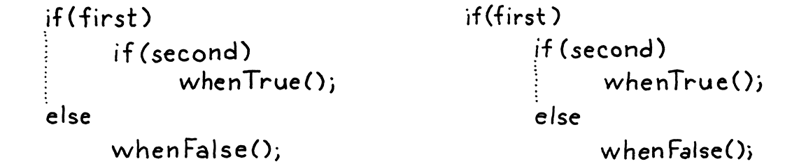

# 9. Control Flow 控制流

> Logic, like whiskey, loses its beneficial effect when taken in too large quantities.
>
> ​                                                                                                         ——    Edward John Moreton Drax Plunkett, Lord Dunsany

邏輯和威士忌一樣，如果攝入太多，就會失去其有益的效果。

> Compared to [last chapter’s](http://craftinginterpreters.com/statements-and-state.html) grueling marathon, today is a lighthearted frolic through a daisy meadow. But while the work is easy, the reward is surprisingly large.

與上一章艱苦的馬拉松相比，這一章就是在雛菊草地上的輕鬆嬉戲。雖然工作很簡單，但回報卻驚人的大。

> Right now, our interpreter is little more than a calculator. A Lox program can only do a fixed amount of work before completing. To make it run twice as long you have to make the source code twice as lengthy. We’re about to fix that. In this chapter, our interpreter takes a big step towards the programming language major leagues: *Turing-completeness*.

現在，我們的解釋器只不過是一個計算器而已。一個Lox程序在結束之前只能做固定的工作量。要想讓它的運行時間延長一倍，你就必須讓源代碼的長度增加一倍。我們即將解決這個問題。在本章中，我們的解釋器向編程語言大聯盟邁出了一大步：圖靈完備性。

> ## 9 . 1Turing Machines (Briefly)

## 9.1 圖靈機（簡介）

> In the early part of last century, mathematicians stumbled into a series of confusing paradoxes that led them to doubt the stability of the foundation they had built their work upon. To address that [crisis](https://en.wikipedia.org/wiki/Foundations_of_mathematics#Foundational_crisis), they went back to square one. Starting from a handful of axioms, logic, and set theory, they hoped to rebuild mathematics on top of an impervious foundation.

在上世紀初，數學家們陷入了一系列令人困惑的悖論之中，導致他們對自己工作所依賴的基礎的穩定性產生懷疑[^1]。為了解決這一[危機](https://en.wikipedia.org/wiki/Foundations_of_mathematics#Foundational_crisis)，他們又回到了原點。他們希望從少量的公理、邏輯和集合理論開始，在一個不透水的地基上重建數學。

> They wanted to rigorously answer questions like, “Can all true statements be proven?”, “Can we [compute](https://en.wikipedia.org/wiki/Computable_function) all functions that we can define?”, or even the more general question, “What do we mean when we claim a function is ‘computable’?”

他們想要嚴格地回答這樣的問題：“所有真實的陳述都可以被證明嗎？”，“我們可以計算我們能定義的所有函數嗎？”，甚至是更一般性的問題，“當我們聲稱一個函數是'可計算的'時，代表什麼意思？”

> They presumed the answer to the first two questions would be “yes”. All that remained was to prove it. It turns out that the answer to both is “no”, and astonishingly, the two questions are deeply intertwined. This is a fascinating corner of mathematics that touches fundamental questions about what brains are able to do and how the universe works. I can’t do it justice here.

他們認為前兩個問題的答案應該是“是”，剩下的就是去證明它。但事實證明這兩個問題的答案都是“否”。而且令人驚訝的是，這兩個問題是深深地交織在一起的。這是數學的一個迷人的角落，它觸及了關於大腦能夠做什麼和宇宙如何運作的基本問題。我在這裏説不清楚。

> What I do want to note is that in the process of proving that the answer to the first two questions is “no”, Alan Turing and Alonzo Church devised a precise answer to the last question—a definition of what kinds of functions are computable. They each crafted a tiny system with a minimum set of machinery that is still powerful enough to compute any of a (very) large class of functions.

我想指出的是，在證明前兩個問題的答案是 "否 "的過程中，艾倫·圖靈和阿隆佐·邱奇為最後一個問題設計了一個精確的答案，即定義了什麼樣的函數是可計算的。他們各自設計了一個具有最小機械集的微型系統，該系統仍然強大到足以計算一個超大類函數中的任何一個。

> These are now considered the “computable functions”. Turing’s system is called a **Turing machine**. Church’s is the **lambda calculus**. Both are still widely used as the basis for models of computation and, in fact, many modern functional programming languages use the lambda calculus at their core.

這些現在被認為是“可計算函數”。圖靈的系統被稱為**圖靈機**[^2]，邱奇的系統是**lambda演算**。這兩種方法仍然被廣泛用作計算模型的基礎，事實上，許多現代函數式編程語言的核心都是lambda演算。


> Turing machines have better name recognition—there’s no Hollywood film about Alonzo Church yet—but the two formalisms are [equivalent in power](https://en.wikipedia.org/wiki/Church–Turing_thesis). In fact, any programming language with some minimal level of expressiveness is powerful enough to compute *any* computable function.

圖靈機的知名度更高——目前還沒有關於阿隆佐·邱奇的好萊塢電影，但這兩種形式[在能力上是等價的](https://en.wikipedia.org/wiki/Church%E2%80%93Turing_thesis)。事實上，任何具有最低表達能力的編程語言都足以計算任何可計算函數。

> You can prove that by writing a simulator for a Turing machine in your language. Since Turing proved his machine can compute any computable function, by extension, that means your language can too. All you need to do is translate the function into a Turing machine, and then run that on your simulator.

你可以用自己的語言為圖靈機編寫一個模擬器來證明這一點。由於圖靈證明了他的機器可以計算任何可計算函數，推而廣之，這意味着你的語言也可以。你所需要做的就是把函數翻譯成圖靈機，然後在你的模擬器上運行它。

> If your language is expressive enough to do that, it’s considered **Turing-complete**. Turing machines are pretty dang simple, so it doesn’t take much power to do this. You basically need arithmetic, a little control flow, and the ability to allocate and use (theoretically) arbitrary amounts of memory. We’ve got the first. By the end of this chapter, we’ll have the second.

如果你的語言有足夠的表達能力來做到這一點，它就被認為是**圖靈完備**的。圖靈機非常簡單，所以它不需要太多的能力。您基本上只需要算術、一點控制流以及分配和使用(理論上)任意數量內存的能力。我們已經具備了第一個條件[^3]。在本章結束時，我們將具備第二個條件。

> ## 9 . 2Conditional Execution

## 9.2 條件執行

> Enough history, let’s jazz up our language. We can divide control flow roughly into two kinds:

説完了歷史，現在讓我們把語言優化一下。我們大致可以把控制流分為兩類：

- > **Conditional** or **branching control flow** is used to *not* execute some piece of code. Imperatively, you can think of it as jumping *ahead* over a region of code.

  **條件**或**分支控制流**是用來不執行某些代碼的。意思是，你可以把它看作是跳過了代碼的一個區域。

- > **Looping control flow** executes a chunk of code more than once. It jumps *back* so that you can do something again. Since you don’t usually want *infinite* loops, it typically has some conditional logic to know when to stop looping as well.

  **循環控制流**是用於多次執行一塊代碼的。它會*向回*跳轉，從而能再次執行某些代碼。用户通常不需要無限循環，所以一般也會有一些條件邏輯用於判斷何時停止循環。

> Branching is simpler, so we’ll start there. C-derived languages have two main conditional execution features, the `if` statement and the perspicaciously named “conditional” operator (`?:`). An `if` statement lets you conditionally execute statements and the conditional operator lets you conditionally execute expressions.
>

分支更簡單一些，所以我們先從分支開始實現。C衍生語言中包含兩個主要的條件執行功能，即`if`語句和“條件”運算符（`?:`）[^4]。`if`語句使你可以按條件執行語句，而條件運算符使你可以按條件執行表達式。

> For simplicity’s sake, Lox doesn’t have a conditional operator, so let’s get our `if` statement on. Our statement grammar gets a new production.
>

為了簡單起見，Lox沒有條件運算符，所以讓我們直接開始`if`語句吧。我們的語句語法需要一個新的生成式。

```javascript
statement      → exprStmt
               | ifStmt
               | printStmt
               | block ;

ifStmt         → "if" "(" expression ")" statement
               ( "else" statement )? ;
```

> An `if` statement has an expression for the condition, then a statement to execute if the condition is truthy. Optionally, it may also have an `else` keyword and a statement to execute if the condition is falsey. The syntax tree node has fields for each of those three pieces.

if語句有一個表達式作為條件，然後是一個在條件為真時要執行的語句。另外，它還可以有一個`else`關鍵字和條件為假時要執行的語句。語法樹節點中對語法的這三部分都有對應的字段。

*<u>tool/GenerateAst.java，在 main()方法中添加：</u>*

```java
      "Expression : Expr expression",
      // 新增部分開始
      "If         : Expr condition, Stmt thenBranch," +
                  " Stmt elseBranch",
      // 新增部分結束
      "Print      : Expr expression",
```

> Like other statements, the parser recognizes an `if` statement by the leading `if` keyword.

與其它語句類似，解析器通過開頭的`if`關鍵字來識別`if`語句。

*<u>lox/Parser.java，在 statement()方法中添加：</u>*

```java
  private Stmt statement() {
    // 新增部分開始
    if (match(IF)) return ifStatement();
    // 新增部分結束
    if (match(PRINT)) return printStatement();
```

> When it finds one, it calls this new method to parse the rest:

如果發現了`if`關鍵字，就調用下面的新方法解析其餘部分[^5]：

*<u>lox/Parser.java，在 statement()方法後添加：</u>*

```java
  private Stmt ifStatement() {
    consume(LEFT_PAREN, "Expect '(' after 'if'.");
    Expr condition = expression();
    consume(RIGHT_PAREN, "Expect ')' after if condition."); 

    Stmt thenBranch = statement();
    Stmt elseBranch = null;
    if (match(ELSE)) {
      elseBranch = statement();
    }

    return new Stmt.If(condition, thenBranch, elseBranch);
  }
```

> As usual, the parsing code hews closely to the grammar. It detects an else clause by looking for the preceding `else` keyword. If there isn’t one, the `elseBranch` field in the syntax tree is `null`.

跟之前一樣，解析代碼嚴格遵循語法。它通過查找前面的`else`關鍵字來檢測`else`子句。如果沒有，語法樹中的`elseBranch`字段為`null`。

> That seemingly innocuous optional else has, in fact, opened up an ambiguity in our grammar. Consider:

實際上，這個看似無傷大雅的可選項在我們的語法中造成了歧義。考慮以下代碼：

```java
if (first) if (second) whenTrue(); else whenFalse();
```

> Here’s the riddle: Which `if` statement does that else clause belong to? This isn’t just a theoretical question about how we notate our grammar. It actually affects how the code executes:

謎題是這樣的:這裏的`else`子句屬於哪個`if`語句?這不僅僅是一個關於如何標註語法的理論問題。它實際上會影響代碼的執行方式：

- > If we attach the else to the first `if` statement, then `whenFalse()` is called if `first` is falsey, regardless of what value `second` has.

  如果我們將`else`語句關聯到第一個`if`語句，那麼當`first`為假時，無論`second`的值是多少，都將調用`whenFalse()`。

- > If we attach it to the second `if` statement, then `whenFalse()` is only called if `first` is truthy and `second` is falsey.

  如果我們將`else`語句關聯到第二個`if`語句，那麼只有當`first`為真並且`second`為假時，才會調用`whenFalse()`。

> Since else clauses are optional, and there is no explicit delimiter marking the end of the `if` statement, the grammar is ambiguous when you nest `if`s in this way. This classic pitfall of syntax is called the **[dangling else](https://en.wikipedia.org/wiki/Dangling_else)** problem.
>

由於`else`子句是可選的，而且沒有明確的分隔符來標記`if`語句的結尾，所以當你以這種方式嵌套`if`時，語法是不明確的。這種典型的語法陷阱被稱為[懸空的else](https://en.wikipedia.org/wiki/Dangling_else)問題。



> It *is* possible to define a context-free grammar that avoids the ambiguity directly, but it requires splitting most of the statement rules into pairs, one that allows an `if` with an `else` and one that doesn’t. It’s annoying.

也可以定義一個上下文無關的語法來直接避免歧義，但是需要將大部分語句規則拆分成對，一個是允許帶有`else`的`if`語句，另一個不允許。這很煩人。

> Instead, most languages and parsers avoid the problem in an ad hoc way. No matter what hack they use to get themselves out of the trouble, they always choose the same interpretation—the `else` is bound to the nearest `if` that precedes it.

相反，大多數語言和解析器都以一種特殊的方式避免了這個問題。不管他們用什麼方法來解決這個問題，他們總是選擇同樣的解釋——`else`與前面最近的`if`綁定在一起。

> Our parser conveniently does that already. Since `ifStatement()` eagerly looks for an `else` before returning, the innermost call to a nested series will claim the else clause for itself before returning to the outer `if` statements.

我們的解析器已經很方便地做到了這一點。因為 `ifStatement()`在返回之前會繼續尋找一個`else`子句，連續嵌套的最內層調用在返回外部的`if`語句之前，會先為自己聲明`else`語句。

> Syntax in hand, we are ready to interpret.

語法就緒了，我們可以開始解釋了。

*<u>lox/Interpreter.java，在 visitExpressionStmt()後添加：</u>*

```java
  @Override
  public Void visitIfStmt(Stmt.If stmt) {
    if (isTruthy(evaluate(stmt.condition))) {
      execute(stmt.thenBranch);
    } else if (stmt.elseBranch != null) {
      execute(stmt.elseBranch);
    }
    return null;
  }
```

> The interpreter implementation is a thin wrapper around the self-same Java code. It evaluates the condition. If truthy, it executes the then branch. Otherwise, if there is an else branch, it executes that.

解釋器實現就是對相同的Java代碼的簡單包裝。它首先對條件表達式進行求值。如果為真，則執行`then`分支。否則，如果有存在`else`分支，就執行該分支。

> If you compare this code to how the interpreter handles other syntax we’ve implemented, the part that makes control flow special is that Java `if` statement. Most other syntax trees always evaluate their subtrees. Here, we may not evaluate the then or else statement. If either of those has a side effect, the choice not to evaluate it becomes user visible.
>

如果你把這段代碼與解釋器中我們已實現的處理其它語法的代碼進行比較，會發現控制流中特殊的地方就在於Java的`if`語句。其它大多數語法樹總是會對子樹求值，但是這裏，我們可能會不執行`then`語句或`else`語句。如果其中任何一個語句有副作用，那麼選擇不執行某條語句就是用户可見的。

> ## 9 . 3Logical Operators

## 9.3 邏輯操作符

> Since we don’t have the conditional operator, you might think we’re done with branching, but no. Even without the ternary operator, there are two other operators that are technically control flow constructs—the logical operators `and` and `or`.

由於我們沒有條件運算符，你可能認為我們已經完成分支開發了，但其實還沒有。雖然沒有三元運算符，但是還有兩個其它操作符在技術上是控制流結構——邏輯運算符`and`和`or`。

> These aren’t like other binary operators because they **short-circuit**. If, after evaluating the left operand, we know what the result of the logical expression must be, we don’t evaluate the right operand. For example:

它們與其它二進制運算符不同，是因為它們會短路。如果在計算左操作數之後，我們已經確切知道邏輯表達式的結果，那麼就不再計算右操作數。例如：

```java
false and sideEffect();
```

> For an `and` expression to evaluate to something truthy, both operands must be truthy. We can see as soon as we evaluate the left `false` operand that that isn’t going to be the case, so there’s no need to evaluate `sideEffect()` and it gets skipped.

對於一個`and`表達式來説，兩個操作數都必須是真，才能得到結果為真。我們只要看到左側的`false`操作數，就知道結果不會是真，也就不需要對`sideEffect()`求值，會直接跳過它。

> This is why we didn’t implement the logical operators with the other binary operators. Now we’re ready. The two new operators are low in the precedence table. Similar to `||` and `&&` in C, they each have their own precedence with `or` lower than `and`. We slot them right between `assignment` and `equality`.

這就是為什麼我們沒有在實現其它二元運算符的時候一起實現邏輯運算符。現在我們已經準備好了。這兩個新的運算符在優先級表中的位置很低，類似於C語言中的`||`和`&&`，它們都有各自的優先級，`or`低於`and`。我們把這兩個運算符插入`assignment` 和 `equality`之間。

```javascript
expression     → assignment ;
assignment     → IDENTIFIER "=" assignment
               | logic_or ;
logic_or       → logic_and ( "or" logic_and )* ;
logic_and      → equality ( "and" equality )* ;
```

> Instead of falling back to `equality`, `assignment` now cascades to `logic_or`. The two new rules, `logic_or` and `logic_and`, are similar to other binary operators. Then `logic_and` calls out to `equality` for its operands, and we chain back to the rest of the expression rules.

`assignment` 現在不是落到 `equality`，而是繼續進入`logic_or`。兩個新規則，`logic_or` 和 `logic_and`，與其它二元運算符類似。然後`logic_and`會調用`equality`計算其操作數，然後我們就鏈入了表達式規則的其它部分。

> We could reuse the existing Expr.Binary class for these two new expressions since they have the same fields. But then `visitBinaryExpr()` would have to check to see if the operator is one of the logical operators and use a different code path to handle the short circuiting. I think it’s cleaner to define a new class for these operators so that they get their own visit method.

對於這兩個新表達式，我們可以重用Expr.Binary類，因為他們具有相同的字段。但是這樣的話，`visitBinaryExpr()` 方法中必須檢查運算符是否是邏輯運算符，並且要使用不同的代碼處理短路邏輯。我認為更整潔的方法是為這些運算符定義一個新類，這樣它們就有了自己的`visit`方法。

*<u>tool/GenerateAst.java，在main()方法中添加：</u>*

```java
      "Literal  : Object value",
      // 新增部分開始
      "Logical  : Expr left, Token operator, Expr right",
      // 新增部分結束
      "Unary    : Token operator, Expr right",
```

> To weave the new expressions into the parser, we first change the parsing code for assignment to call `or()`.

為了將新的表達式加入到解析器中，我們首先將賦值操作的解析代碼改為調用`or()`方法。

*<u>lox/Parser.java,在 assignment()方法中替換一行：</u>*

```java
  private Expr assignment() {
    // 新增部分開始
    Expr expr = or();
    // 新增部分結束
    if (match(EQUAL)) {
```

> The code to parse a series of `or` expressions mirrors other binary operators.

解析一系列`or`語句的代碼與其它二元運算符相似。

*<u>lox/Parser.java，在 assignment()方法後添加：</u>*

```java
  private Expr or() {
    Expr expr = and();

    while (match(OR)) {
      Token operator = previous();
      Expr right = and();
      expr = new Expr.Logical(expr, operator, right);
    }

    return expr;
  }
```

> Its operands are the next higher level of precedence, the new `and` expression.

它的操作數是位於下一優先級的新的`and`表達式。

*<u>lox/Parser.java，在 or()方法後添加：</u>*

```java
  private Expr and() {
    Expr expr = equality();

    while (match(AND)) {
      Token operator = previous();
      Expr right = equality();
      expr = new Expr.Logical(expr, operator, right);
    }

    return expr;
  }
```

> That calls `equality()` for its operands, and with that, the expression parser is all tied back together again. We’re ready to interpret.

這裏會調用 `equality()` 計算操作數，這樣一來，表達式解析器又重新綁定到了一起。我們已經準備好進行解釋了。

*<u>lox/Interpreter.java，在 visitLiteralExpr()方法後添加：</u>*

```java
  @Override
  public Object visitLogicalExpr(Expr.Logical expr) {
    Object left = evaluate(expr.left);

    if (expr.operator.type == TokenType.OR) {
      if (isTruthy(left)) return left;
    } else {
      if (!isTruthy(left)) return left;
    }

    return evaluate(expr.right);
  }
```

> If you compare this to the [earlier chapter’s](http://craftinginterpreters.com/evaluating-expressions.html) `visitBinaryExpr()` method, you can see the difference. Here, we evaluate the left operand first. We look at its value to see if we can short-circuit. If not, and only then, do we evaluate the right operand.

如果你把這個方法與前面章節的`visitBinaryExpr()`方法相比較，就可以看出其中的區別。這裏，我們先計算左操作數。然後我們查看結果值，判斷是否可以短路。當且僅當不能短路時，我們才計算右側的操作數。

> The other interesting piece here is deciding what actual value to return. Since Lox is dynamically typed, we allow operands of any type and use truthiness to determine what each operand represents. We apply similar reasoning to the result. Instead of promising to literally return `true` or `false`, a logic operator merely guarantees it will return a value with appropriate truthiness.

另一個有趣的部分是決定返回什麼實際值。由於Lox是動態類型的，我們允許任何類型的操作數，並使用真實性來確定每個操作數代表什麼。我們對結果採用類似的推理。邏輯運算符並不承諾會真正返回`true`或`false`，而只是保證它將返回一個具有適當真實性的值。

> Fortunately, we have values with proper truthiness right at hand—the results of the operands themselves. So we use those. For example:

幸運的是，我們手邊就有具有適當真實性的值——即操作數本身的結果，所以我們可以直接使用它們。如：

```javascript
print "hi" or 2; // "hi".
print nil or "yes"; // "yes".
```

> On the first line, `"hi"` is truthy, so the `or` short-circuits and returns that. On the second line, `nil` is falsey, so it evaluates and returns the second operand, `"yes"`.

在第一行，`“hi”`是真的，所以`or`短路並返回它。在第二行，`nil`是假的，因此它計算並返回第二個操作數`“yes”`。

> That covers all of the branching primitives in Lox. We’re ready to jump ahead to loops. You see what I did there? *Jump. Ahead.* Get it? See, it’s like a reference to . . . oh, forget it.

這樣就完成了Lox中的所有分支原語，我們準備實現循環吧。

> ## 9 . 4While Loops

## 9.4 While循環

> Lox features two looping control flow statements, `while` and `for`. The `while` loop is the simpler one, so we’ll start there. Its grammar is the same as in C.

Lox有兩種類型的循環控制流語句，分別是`while`和`for`。`while`循環更簡單一點，我們先從它開始.

```javascript
statement      → exprStmt
               | ifStmt
               | printStmt
               | whileStmt
               | block ;

whileStmt      → "while" "(" expression ")" statement ;
```

> We add another clause to the statement rule that points to the new rule for while. It takes a `while` keyword, followed by a parenthesized condition expression, then a statement for the body. That new grammar rule gets a syntax tree node.

我們在`statement`規則中添加一個子句，指向while對應的新規則`whileStmt`。該規則接收一個`while`關鍵字，後跟一個帶括號的條件表達式，然後是循環體對應的語句。新語法規則需要定義新的語法樹節點。

*<u>tool/GenerateAst.java,在 main()方法中新增，前一行後添加“,”</u>* 

```java
      "Print      : Expr expression",
      "Var        : Token name, Expr initializer",
      // 新增部分開始
      "While      : Expr condition, Stmt body"
      // 新增部分結束
    ));
```

> The node stores the condition and body. Here you can see why it’s nice to have separate base classes for expressions and statements. The field declarations make it clear that the condition is an expression and the body is a statement.

該節點中保存了條件式和循環體。這裏就可以看出來為什麼表達式和語句最好要有單獨的基類。字段聲明清楚地表明瞭，條件是一個表達式，循環主體是一個語句。

> Over in the parser, we follow the same process we used for `if` statements. First, we add another case in `statement()` to detect and match the leading keyword.

在解析器中，我們遵循與`if`語句相同的處理步驟。首先，在 `statement()` 添加一個case分支檢查並匹配開頭的關鍵字。

*<u>lox/Parser.java，在statement()方法中添加：</u>*

```java
    if (match(PRINT)) return printStatement();
    // 新增部分開始
    if (match(WHILE)) return whileStatement();
    // 新增部分結束
    if (match(LEFT_BRACE)) return new Stmt.Block(block());
```

> That delegates the real work to this method:

實際的工作委託給下面的方法：

*<u>lox/Parser.java，在 varDeclaration()方法後添加：</u>*

```java
  private Stmt whileStatement() {
    consume(LEFT_PAREN, "Expect '(' after 'while'.");
    Expr condition = expression();
    consume(RIGHT_PAREN, "Expect ')' after condition.");
    Stmt body = statement();

    return new Stmt.While(condition, body);
  }
```

> The grammar is dead simple and this is a straight translation of it to Java. Speaking of translating straight to Java, here’s how we execute the new syntax:

語法非常簡單，這裏將其直接翻譯為Java。説到直接翻譯成Java，下面是我們執行新語法的方式：

*<u>lox/Interpreter.java，在 visitVarStmt()方法後添加：</u>*

```java
  @Override
  public Void visitWhileStmt(Stmt.While stmt) {
    while (isTruthy(evaluate(stmt.condition))) {
      execute(stmt.body);
    }
    return null;
  }
```

> Like the visit method for `if`, this visitor uses the corresponding Java feature. This method isn’t complex, but it makes Lox much more powerful. We can finally write a program whose running time isn’t strictly bound by the length of the source code.

和`if`的訪問方法一樣，這裏的訪問方法使用了相應的Java特性。這個方法並不複雜，但它使Lox變得更加強大。我們終於可以編寫一個運行時間不受源代碼長度嚴格限制的程序了。

> ## 9 . 5For Loops

## 9.5 For循環

> We’re down to the last control flow construct, Ye Olde C-style `for` loop. I probably don’t need to remind you, but it looks like this:

我們已經到了最後一個控制流結構，即老式的C語言風格`for`循環。我可能不需要提醒你，但還是要説它看起來是這樣的： 

```java
for (var i = 0; i < 10; i = i + 1) print i;
```

> In grammarese, that’s:

在語法中，是這樣的：

```javascript
statement      → exprStmt
               | forStmt
               | ifStmt
               | printStmt
               | whileStmt
               | block ;

forStmt        → "for" "(" ( varDecl | exprStmt | ";" )
                 expression? ";"
                 expression? ")" statement ;
```

> Inside the parentheses, you have three clauses separated by semicolons:

在括號內，有三個由分號分隔的子語句：

1. > The first clause is the *initializer*. It is executed exactly once, before anything else. It’s usually an expression, but for convenience, we also allow a variable declaration. In that case, the variable is scoped to the rest of the `for` loop—the other two clauses and the body.

   第一個子句是*初始化式*。它只會在任何其它操作之前執行一次。它通常是一個表達式，但是為了便利，我們也允許一個變量聲明。在這種情況下，變量的作用域就是`for`循環的其它部分——其餘兩個子式和循環體。

2. > Next is the *condition*. As in a `while` loop, this expression controls when to exit the loop. It’s evaluated once at the beginning of each iteration, including the first. If the result is truthy, it executes the loop body. Otherwise, it bails.

   接下來是*條件表達式*。與`while`循環一樣，這個表達式控制了何時退出循環。它會在每次循環開始之前執行一次（包括第一次）。如果結果是真，就執行循環體；否則，就結束循環。

3. > The last clause is the *increment*. It’s an arbitrary expression that does some work at the end of each loop iteration. The result of the expression is discarded, so it must have a side effect to be useful. In practice, it usually increments a variable.

   最後一個子句是*增量式*。它是一個任意的表達式，會在每次循環結束的時候做一些工作。因為表達式的結果會被丟棄，所以它必須有副作用才能有用。在實踐中，它通常會對變量進行遞增。

> Any of these clauses can be omitted. Following the closing parenthesis is a statement for the body, which is typically a block.

這些子語句都可以忽略。在右括號之後是一個語句作為循環體，通常是一個代碼塊。

> ### 9 . 5 . 1Desugaring

### 9.5.1 語法脱糖

> That’s a lot of machinery, but note that none of it does anything you couldn’t do with the statements we already have. If `for` loops didn’t support initializer clauses, you could just put the initializer expression before the `for` statement. Without an increment clause, you could simply put the increment expression at the end of the body yourself.

這裏包含了很多配件，但是請注意，它所做的任何事情中，沒有一件是無法用已有的語句實現的。如果`for`循環不支持初始化子句，你可以在`for`語句之前加一條初始化表達式。如果沒有增量子語句，你可以直接把增量表達式放在循環體的最後。

> In other words, Lox doesn’t *need* `for` loops, they just make some common code patterns more pleasant to write. These kinds of features are called **syntactic sugar**. For example, the previous `for` loop could be rewritten like so:

換句話説，Lox不*需要*`for`循環，它們只是讓一些常見的代碼模式更容易編寫。這類功能被稱為**語法糖**[^6]。例如，前面的`for`循環可以改寫成這樣：

```javascript
{
  var i = 0;
  while (i < 10) {
    print i;
    i = i + 1;
  }
}
```

> This script has the exact same semantics as the previous one, though it’s not as easy on the eyes. Syntactic sugar features like Lox’s `for` loop make a language more pleasant and productive to work in. But, especially in sophisticated language implementations, every language feature that requires back-end support and optimization is expensive.

雖然這個腳本不太容易看懂，但這個腳本與之前那個語義完全相同。像Lox中的`for`循環這樣的語法糖特性可以使語言編寫起來更加愉快和高效。但是，特別是在複雜的語言實現中，每一個需要後端支持和優化的語言特性都是代價昂貴的。

> We can have our cake and eat it too by **desugaring**. That funny word describes a process where the front end takes code using syntax sugar and translates it to a more primitive form that the back end already knows how to execute.

我們可以通過**脱糖**來吃這個蛋糕。這個有趣的詞描述了這樣一個過程：前端接收使用了語法糖的代碼，並將其轉換成後端知道如何執行的更原始的形式。

> We’re going to desugar `for` loops to the `while` loops and other statements the interpreter already handles. In our simple interpreter, desugaring really doesn’t save us much work, but it does give me an excuse to introduce you to the technique. So, unlike the previous statements, we *won’t* add a new syntax tree node. Instead, we go straight to parsing. First, add an import we’ll need soon.

我們將把`for`循環脱糖為`while`循環和其它解釋器可處理的其它語句。在我們的簡單解釋器中，脱糖真的不能為我們節省很多工作，但它確實給了我一個契機來向你介紹這一技術。因此，與之前的語句不同，我們不會為`for`循環添加一個新的語法樹節點。相反，我們會直接進行解析。首先，先引入一個我們要用到的依賴：

*<u>lox/Parser.java，添加代碼：</u>*

```java
import java.util.ArrayList;
// 新增部分開始
import java.util.Arrays;
// 新增部分結束
import java.util.List;
```

> Like every statement, we start parsing a `for` loop by matching its keyword.

像每個語句一樣，我們通過匹配`for`關鍵字來解析循環。

*<u>lox/Parser.java,在 statement()方法中新增：</u>*

```java
  private Stmt statement() {
    // 新增部分開始
    if (match(FOR)) return forStatement();
    // 新增部分結束
    if (match(IF)) return ifStatement();
```

> Here is where it gets interesting. The desugaring is going to happen here, so we’ll build this method a piece at a time, starting with the opening parenthesis before the clauses.

接下來是有趣的部分，脱糖也是在這裏發生的，所以我們會一點點構建這個方法，首先從子句之前的左括號開始。

*<u>lox/Parser.java，在 statement()方法後添加：</u>*

```java
  private Stmt forStatement() {
    consume(LEFT_PAREN, "Expect '(' after 'for'.");

    // More here...
  }
```

> The first clause following that is the initializer.

接下來的第一個子句是初始化式。

*<u>lox/Parser.java，在 forStatement()方法中替換一行：</u>*

```java
    consume(LEFT_PAREN, "Expect '(' after 'for'.");
    // 替換部分開始
    Stmt initializer;
    if (match(SEMICOLON)) {
      initializer = null;
    } else if (match(VAR)) {
      initializer = varDeclaration();
    } else {
      initializer = expressionStatement();
    }
    // 替換部分結束
  }
```

> If the token following the `(` is a semicolon then the initializer has been omitted. Otherwise, we check for a `var` keyword to see if it’s a variable declaration. If neither of those matched, it must be an expression. We parse that and wrap it in an expression statement so that the initializer is always of type Stmt.

如果`(`後面的標記是分號，那麼初始化式就被省略了。否則，我們就檢查`var`關鍵字，看它是否是一個變量聲明。如果這兩者都不符合，那麼它一定是一個表達式。我們對其進行解析，並將其封裝在一個表達式語句中，這樣初始化器就必定屬於Stmt類型。

> Next up is the condition.

接下來是條件表達式。

*<u>lox/Parser.java，在 forStatement()方法中添加代碼：</u>*

```java
      initializer = expressionStatement();
    }
    // 新增部分開始
    Expr condition = null;
    if (!check(SEMICOLON)) {
      condition = expression();
    }
    consume(SEMICOLON, "Expect ';' after loop condition.");
    // 新增部分結束
  }
```

> Again, we look for a semicolon to see if the clause has been omitted. The last clause is the increment.

同樣，我們查找分號檢查子句是否被忽略。最後一個子句是增量語句。

*<u>lox/Parser.java，在 forStatement()方法中添加：</u>*

```java
    consume(SEMICOLON, "Expect ';' after loop condition.");
    // 新增部分開始
    Expr increment = null;
    if (!check(RIGHT_PAREN)) {
      increment = expression();
    }
    consume(RIGHT_PAREN, "Expect ')' after for clauses.");
    // 新增部分結束
  }
```

> It’s similar to the condition clause except this one is terminated by the closing parenthesis. All that remains is the body.

它類似於條件式子句，只是這個子句是由右括號終止的。剩下的就是循環主體了。

*<u>lox/Parser.java，在 forStatement()方法中添加代碼：</u>*

```java
    consume(RIGHT_PAREN, "Expect ')' after for clauses.");
    // 新增部分開始
    Stmt body = statement();

    return body;
    // 新增部分結束
  }
```

> We’ve parsed all of the various pieces of the `for` loop and the resulting AST nodes are sitting in a handful of Java local variables. This is where the desugaring comes in. We take those and use them to synthesize syntax tree nodes that express the semantics of the `for` loop, like the hand-desugared example I showed you earlier.

我們已經解析了`for`循環的所有部分，得到的AST節點也存儲在一些Java本地變量中。這裏也是脱糖開始的地方。我們利用這些變量來合成表示`for`循環語義的語法樹節點，就像前面展示的手工脱糖的例子一樣。

> The code is a little simpler if we work backward, so we start with the increment clause.

如果我們從後向前處理，代碼會更簡單一些，所以我們從增量子句開始。

*<u>lox/Parser.java，在 forStatement()方法中新增：</u>*

```java
    Stmt body = statement();
    // 新增部分開始
    if (increment != null) {
      body = new Stmt.Block(
          Arrays.asList(
              body,
              new Stmt.Expression(increment)));
    }
    // 新增部分結束
    return body;
```

> The increment, if there is one, executes after the body in each iteration of the loop. We do that by replacing the body with a little block that contains the original body followed by an expression statement that evaluates the increment.

如果存在增量子句的話，會在循環的每個迭代中在循環體結束之後執行。我們用一個代碼塊來代替循環體，這個代碼塊中包含原始的循環體，後面跟一個執行增量子語句的表達式語句。

*<u>lox/Parser.java，在 forStatement()方法中新增代碼：</u>*

```java
    }
    // 新增部分開始
    if (condition == null) condition = new Expr.Literal(true);
    body = new Stmt.While(condition, body);
    // 新增部分結束
    return body;
```

> Next, we take the condition and the body and build the loop using a primitive `while` loop. If the condition is omitted, we jam in `true` to make an infinite loop.

接下來，我們獲取條件式和循環體，並通過基本的`while`語句構建對應的循環。如果條件式被省略了，我們就使用`true`來創建一個無限循環。

*<u>lox/Parser.java，在 forStatement()方法中新增：</u>*

```java
    body = new Stmt.While(condition, body);
    // 新增部分開始
    if (initializer != null) {
      body = new Stmt.Block(Arrays.asList(initializer, body));
    }
    // 新增部分結束
    return body;
```

> Finally, if there is an initializer, it runs once before the entire loop. We do that by, again, replacing the whole statement with a block that runs the initializer and then executes the loop.

最後，如果有初始化式，它會在整個循環之前運行一次。我們的做法是，再次用代碼塊來替換整個語句，該代碼塊中首先運行一個初始化式，然後執行循環。

> That’s it. Our interpreter now supports C-style `for` loops and we didn’t have to touch the Interpreter class at all. Since we desugared to nodes the interpreter already knows how to visit, there is no more work to do.

就是這樣。我們的解釋器現在已經支持了C語言風格的`for`循環，而且我們根本不需要修改解釋器類。因為我們通過脱糖將其轉換為了解釋器已經知道如何訪問的節點，所以無需做其它的工作。

> Finally, Lox is powerful enough to entertain us, at least for a few minutes. Here’s a tiny program to print the first 21 elements in the Fibonacci sequence:

最後，Lox已強大到足以娛樂我們，至少幾分鐘。下面是一個打印斐波那契數列前21個元素的小程序：

```javascript
var a = 0;
var temp;

for (var b = 1; a < 10000; b = temp + b) {
  print a;
  temp = a;
  a = b;
}
```


[^1]: 其中最著名的就是羅素悖論。最初，集合理論允許你定義任何類型的集合。只要你能用英語描述它，它就是有效的。自然，鑑於數學家對自引用的偏愛，集合可以包含其他的集合。於是，羅素，這個無賴，提出了：<br/>R是所有不包含自身的集合的集合。<br/>R是否包含自己？如果不包含，那麼根據定義的後半部分，它應該包含；如果包含，那麼它就不滿足定義。腦袋要炸了。
[^2]: 圖靈把他的發明稱為 “a-machines”，表示“automatic(自動)”。他並沒有自吹自擂到把自己的名字放入其中。後來的數學家們為他做了這些。這就是你如何在成名的同時還能保持謙虛。
[^3]: 我們也基本上具備第三個條件了。你可以創建和拼接任意大小的字符串，因此也就可以存儲無界內存。但我們還無法訪問字符串的各個部分。
[^4]: 條件操作符也稱為三元操作符，因為它是C語言中唯一接受三個操作數的操作符。
[^5]: 條件周圍的圓括號只有一半是有用的。您需要在條件和then語句之間設置某種分隔符，否則解析器無法判斷是否到達條件表達式的末尾。但是` if` 後面的小括號並沒有什麼用處。Dennis Ritchie 把它放在那裏是為了讓他可以使用` )`作為結尾的分隔符，而且不會出現不對稱的小括號。其他語言，比如Lua和一些BASICs，使用`then`這樣的關鍵字作為結束分隔符，在條件表達式之前沒有任何內容。而Go和Swift則要求語句必須是一個帶括號的塊，這樣就可以使用語句開頭的`{`來判斷條件表達式是否結束。
[^6]: 這個令人愉快的短語是由Peter J. Landin在1964年創造的，用來描述ALGOL等語言支持的一些很好的表達式形式是如何在更基本但可能不太令人滿意的lambda演算的基礎上增添一些小甜頭的。


------

> ## CHALLENGES

## 習題

> 1、A few chapters from now, when Lox supports first-class functions and dynamic dispatch, we technically won’t *need* branching statements built into the language. Show how conditional execution can be implemented in terms of those. Name a language that uses this technique for its control flow.

1、在接下來的幾章中，當Lox支持一級函數和動態調度時，從技術上講，我們就不需要在語言中內置分支語句。説明如何用這些特性來實現條件執行。説出一種在控制流中使用這種技術的語言。

> 2、Likewise, looping can be implemented using those same tools, provided our interpreter supports an important optimization. What is it, and why is it necessary? Name a language that uses this technique for iteration.

2、同樣地，只要我們的解釋器支持一個重要的優化，循環也可以用這些工具來實現。它是什麼？為什麼它是必要的？請説出一種使用這種技術進行迭代的語言。

> 3、Unlike Lox, most other C-style languages also support `break` and `continue` statements inside loops. Add support for `break` statements.
>
> The syntax is a `break` keyword followed by a semicolon. It should be a syntax error to have a `break` statement appear outside of any enclosing loop. At runtime, a `break` statement causes execution to jump to the end of the nearest enclosing loop and proceeds from there. Note that the `break` may be nested inside other blocks and `if` statements that also need to be exited.

3、與Lox不同，大多數其他C風格語言也支持循環內部的`break`和`continue`語句。添加對`break`語句的支持。

語法是一個`break`關鍵字，後面跟一個分號。如果`break`語句出現在任何封閉的循環之後，那就應該是一個語法錯誤。在運行時，`break`語句會跳轉到最內層的封閉循環的末尾，並從那裏開始繼續執行。注意，`break`語句可以嵌套在其它需要退出的代碼塊和`if`語句中。

------

> ## DESIGN NOTE: SPOONFULS OF SYNTACTIC SUGAR

## 設計筆記：一些語法糖

> When you design your own language, you choose how much syntactic sugar to pour into the grammar. Do you make an unsweetened health food where each semantic operation maps to a single syntactic unit, or some decadent dessert where every bit of behavior can be expressed ten different ways? Successful languages inhabit all points along this continuum.
>
> On the extreme acrid end are those with ruthlessly minimal syntax like Lisp, Forth, and Smalltalk. Lispers famously claim their language “has no syntax”, while Smalltalkers proudly show that you can fit the entire grammar on an index card. This tribe has the philosophy that the *language* doesn’t need syntactic sugar. Instead, the minimal syntax and semantics it provides are powerful enough to let library code be as expressive as if it were part of the language itself.
>
> Near these are languages like C, Lua, and Go. They aim for simplicity and clarity over minimalism. Some, like Go, deliberately eschew both syntactic sugar and the kind of syntactic extensibility of the previous category. They want the syntax to get out of the way of the semantics, so they focus on keeping both the grammar and libraries simple. Code should be obvious more than beautiful.
>
> Somewhere in the middle you have languages like Java, C#, and Python. Eventually you reach Ruby, C++, Perl, and D—languages which have stuffed so much syntax into their grammar, they are running out of punctuation characters on the keyboard.
>
> To some degree, location on the spectrum correlates with age. It’s relatively easy to add bits of syntactic sugar in later releases. New syntax is a crowd pleaser, and it’s less likely to break existing programs than mucking with the semantics. Once added, you can never take it away, so languages tend to sweeten with time. One of the main benefits of creating a new language from scratch is it gives you an opportunity to scrape off those accumulated layers of frosting and start over.
>
> Syntactic sugar has a bad rap among the PL intelligentsia. There’s a real fetish for minimalism in that crowd. There is some justification for that. Poorly designed, unneeded syntax raises the cognitive load without adding enough expressiveness to carry its weight. Since there is always pressure to cram new features into the language, it takes discipline and a focus on simplicity to avoid bloat. Once you add some syntax, you’re stuck with it, so it’s smart to be parsimonious.
>
> At the same time, most successful languages do have fairly complex grammars, at least by the time they are widely used. Programmers spend a ton of time in their language of choice, and a few niceties here and there really can improve the comfort and efficiency of their work.
>
> Striking the right balance—choosing the right level of sweetness for your language—relies on your own sense of taste.

當你設計自己的語言時，你可以選擇在語法中注入多少語法糖。你是要做一種不加糖、每個語法操作都對應單一的語法單元的健康食品？還是每一點行為都可以用10種不同方式實現的墮落的甜點？把這兩種情況看作是兩端的話，成功的語言分佈在這個連續體的每個中間點。

極端尖刻的一側是那些語法極少的語言，如Lisp、Forth和SmallTalk。Lisp的擁躉廣泛聲稱他們的語言 "沒有語法"，而Smalltalk的人則自豪地表示，你可以把整個語法放在一張索引卡上。這個部落的理念是，語言不需要句法糖。相反，它所提供的最小的語法和語義足夠強大，足以讓庫中的代碼像語言本身的一部分一樣具有表現力。

接近這些的是像C、Lua和Go這樣的語言。他們的目標是簡單和清晰，而不是極簡主義。有些語言，如Go，故意避開了語法糖和前一類語言的語法擴展性。他們希望語法不受語義的影響，所以他們專注於保持語法和庫的簡單性。代碼應該是明顯的，而不是漂亮的。

介於之間的是Java、C#和Python等語言。最終，你會看到Ruby、C++、Perl和D-語言，它們在語法中塞入了太多的句法規則，以至於鍵盤上的標點符號都快用完了。

在某種程度上，頻譜上的位置與年齡相關。在後續的版本中增加一些語法糖是比較容易的。新的語法很容易讓人喜歡，而且與修改語義相比，它更不可能破壞現有的程序。一旦加進去，你就再也不能把它去掉了，所以隨着時間的推移，語言會變得越來越甜。從頭開始創建一門新語言的主要好處之一是，它給了你一個機會去刮掉那些累積的糖霜並重新開始。

語法糖在PL知識分子中名聲不佳。那羣人對極簡主義有一種真正的迷戀。這是有一定道理的。設計不良的、不必要的語法增加了認知負荷，卻沒有增加相匹配的表達能力。因為一直會有向語言中添加新特性的壓力，所以需要自律並專注於簡單，以避免臃腫。一旦你添加了一些語法，你就會被它困住，所以明智的做法是要精簡。

同時，大多數成功的語言都有相當複雜的語法，至少在它們被廣泛使用的時候是這樣。程序員在他們所選擇的語言上花費了大量的時間，一些隨處可見的細節確實可以提高他們工作時的舒適度和效率。

找到正確的平衡——為你的語言選擇適當的甜度——取決於你自己的品味。
